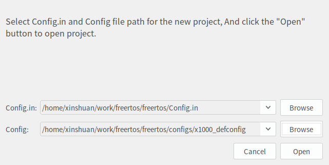
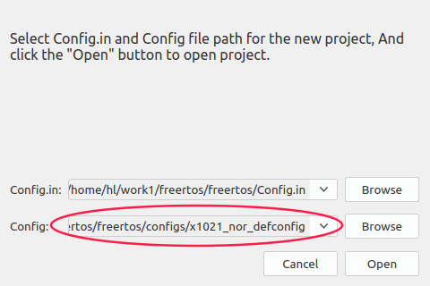
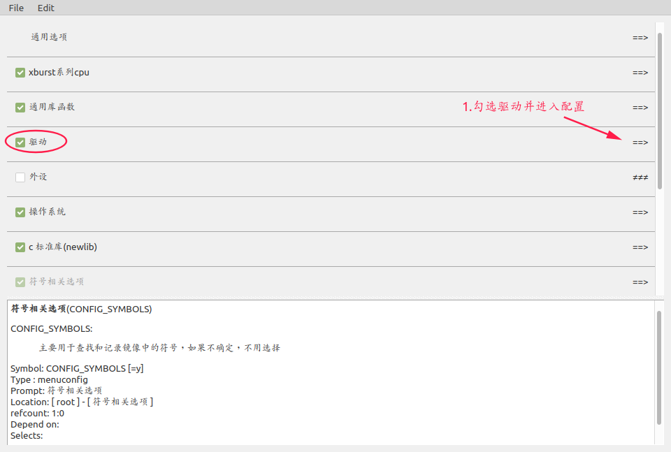
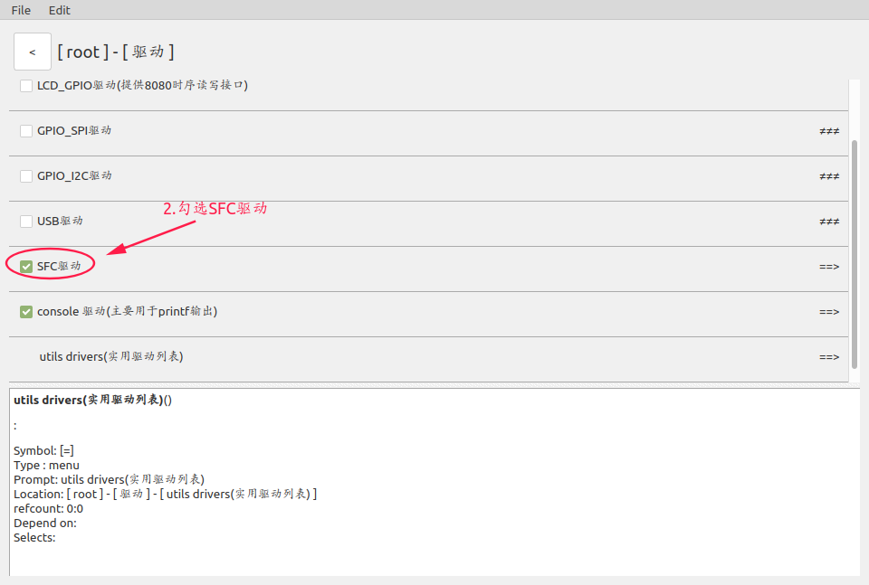
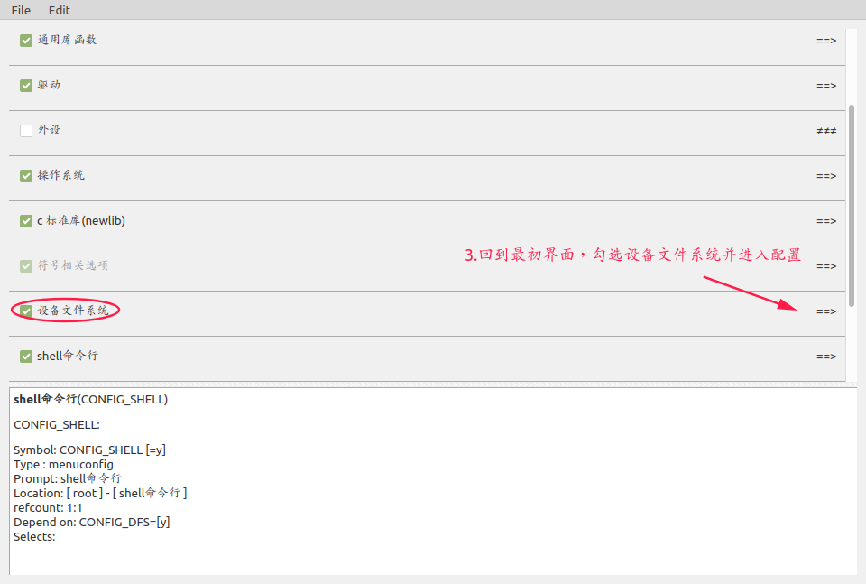
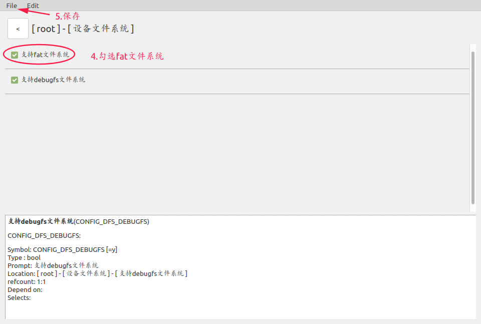
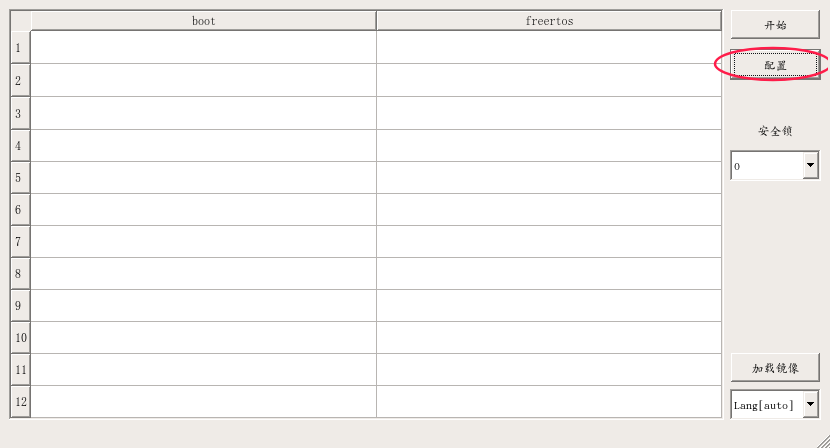
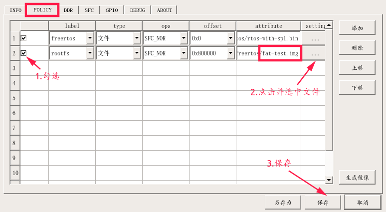
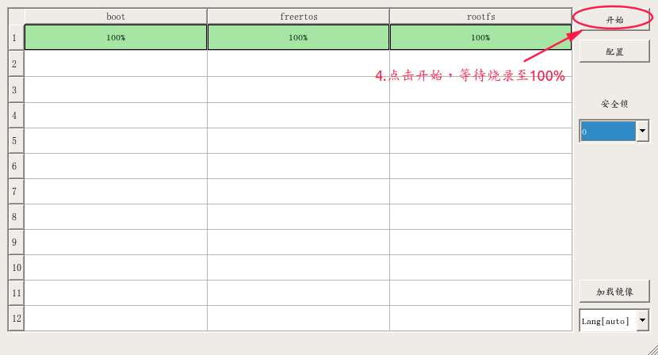

# FreeRTOS工程编译说明


## 1.目录说明

```D
├── bootloader                  // 引导代码
├── doc                                 // 文档
├── freertos
│   ├── build                       // 编译脚本
│   ├── configs                  // 编译配置文件
│   ├── devices                 // 外接设备驱动
│   ├── drivers                  // 驱动目录
│   ├── example               // 示例代码
│   ├── filesystem           // 文件系统
│   ├── include                 // 头文件
│   ├── lib                          // 通用库函数
│   ├── net                        // 网络协议栈
│   ├── newlib                  // c标准库
│   ├── os                          // 系统内核代码
│   ├── package              // 配置界面选项和编译链接
│   ├── shell                     // 终端命令行
│   ├── symbols              // (内部使用,用于异常打印)
│   ├── third_party        // 第三方开源库
│   ├── tools                    // (内部使用,编译系统工具脚本)
│   ├── vendor                // 用户使用编程目录
│   └── xburst                 // 芯片级别代码
└── tools
    ├── burntools              // 烧录工具
    ├── iconfigtool            // 配置工具
    └── toolchains             // 编译工具
```


## 2.工程编译

### 2.1 初始化编译环境

>   设置编译器到环境变量

```shell
cd freertos
source build/envsetup.sh
```

### 2.2 选择配置文件

```shell
make x1000_defconfig
```

### 2.3 编译工程

>   编译生成的目标文件rtos-with-spl.bin

```shell
make
```


## 3.修改配置文件

>   修改配置文件使用可视化配置工具IConfigTool

### 3.1 解压并打开配置工具

>   IConfigTool配置工具在tools/目录下，解压后直接运行
>
>   `如果IConfigTool出现闪退时，删除工具lib/目录下libQtCore.so.4与libQtGui.so.4文件`

```shell
./IConfigTool
```



`Config.in 是生成配置界面文件`

>   freertos/Config.in
>

`Config是需要修改的配置文件`

>   configs/x1000_defconfig
>

点击open进入IConfigTool配置工具主界面。

### 3.2 保存配置文件

```
修改完成后保存配置，并编译系统。
1．点击File选项
2．选择save进行保存
3．重新执行make x1000_defconfig
4．执行make
```


## 4.FAT文件系统制作

### 4.1 创建空的文件系统（以4M为例）

```shell
mkfs.fat -S 4096 -C fat-test.img 4096
```

```
参数解释：
-S logical-sector-size 逻辑扇区的大小需设置为 4096
-C 创建目标文件，用此选项必须给出<block-count> 单位1KByte
```

命令效果：在当前目录产生一个.img文件，这是个空镜像文件。

### 4.2 修改文件系统内容

>   1.创建文件夹并挂载文件系统
>
>   2.修改文件系统，添加或删除文件
>
>   3.取消挂载

```shell
mkdir fs_tmp
sudo mount -t vfat fat-test.img ./fs_tmp
........
........
........
sudo umount ./fs_tmp
```


## 5.FAT文件系统使用流程

1.选择相应板级配置，且 fat 文件系统目前只支持 nor











2.将 fat-test.img 烧录到 rootfs 分区，板子启动后该分区会自动挂载，有关烧录部分可查阅 2_FreeRTOS工程烧录简介

```c
"注意：当前rootfs分区不支持挂载 FAT32 格式的镜像文件，如果选上支持debugfs文件系统，则挂载镜像中不能有名为 sys 目录或文件"
```






