# FreeRTOS 快速开发文档


## 1 添加自己的代码

　　进入目录`freertos/vendor`，对文件`vendor.c`操作如下图

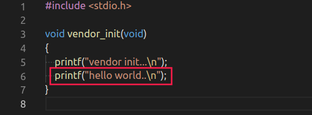

　　编译烧录后显示如下图

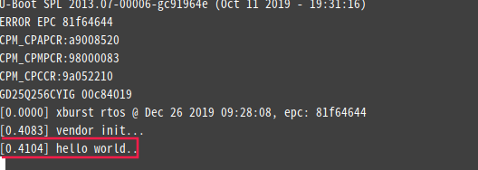


## 2 添加源文件,加入通用编译流程

　　支持格式：`.c .s .S .cc .cpp` 目前暂不支持C++

​         以在`freertos/vendor`目录下添加文件`add.c`

　　在`freertod/vendor/Makefile`中添加

```makefile
src-y += add.c
```

　　加入后编译如下所示

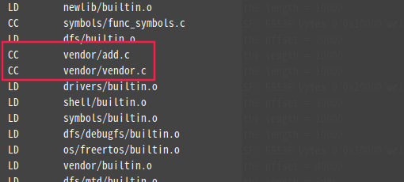

　　在`vendor.c`中引用`add.c`中的函数

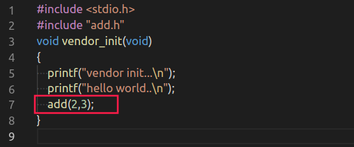

　　编译烧录结果如下

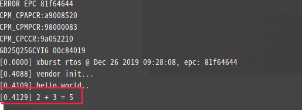


## 3 在外部编译静态库文件

生成.o文件

```
tools/toolchains/mips-gcc520-elf/bin/mips-sde-elf-gcc -c -G 0 xxx.c
```

### 特别注意：在编译时必须加上　-G 0 参数，否则制作成静态库后，使用会报错！

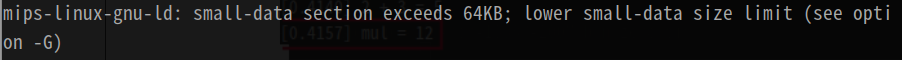


生成.a文件

```
tools/toolchains/mips-gcc520-elf/bin/mips-sde-elf-ar -rcs libmul.a xxx.o
```


## 4 添加目标文件,加入通用编译流程

　　支持格式：`.o` `.a`

　　以在`freertos/vendor`中添加`libmul.a`

　　在`freertod/package/vendor/vendor.mk`中添加

```makefile
package_lib-y += vendor/libmul.a
```

　　在`vendor.c`引用`libmul.a`中的函数

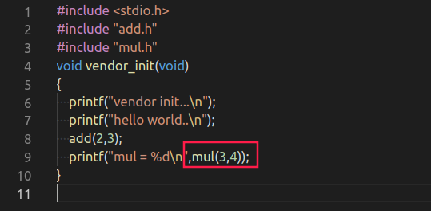

　　烧录结果显示

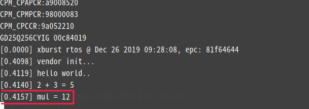


## 5 添加自动检索头文件目录

　　添加自动检索头文件目录：可以用＃include <xxx.h> 添加头文件，操作如下：

　　对目录 `freertos/package/vendor` 下的 `vendor.mk` 文件代码添加include头文件目录

```makefile
CFLAGS += -Ivendor/include
```


## 6 添加宏控可在IconfigTool中修改

　　 进入`package/vendor/`目录对`Config.in`操作

　　如下图例子

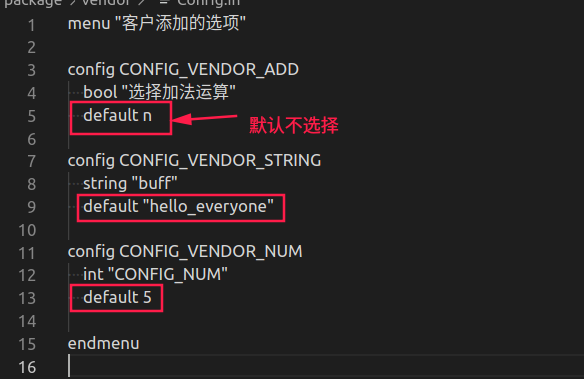


　　烧录后的结果如下图

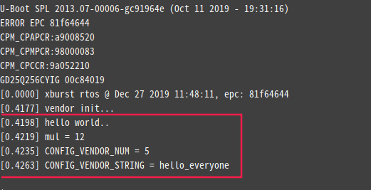

　　　如果需要开启或者修改宏控的值，在`IconfigTool`工具界，点击进入用户添加的选项

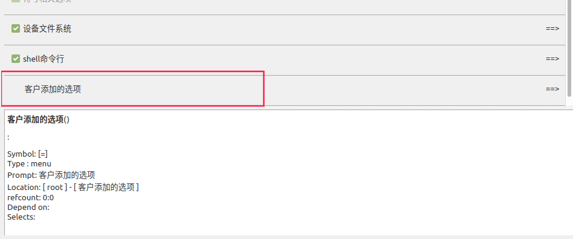

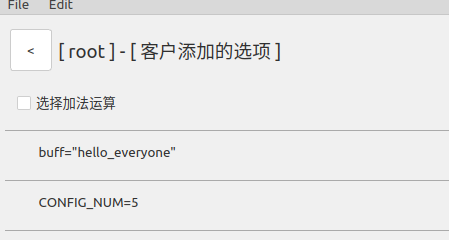

　　此时可以依据需求修改，修改完成后点击左上角的file、save

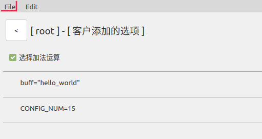

　　修改之后，回到`freertos`目录下make xxx_defconfig，再进行编译，结果如下

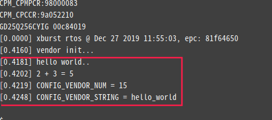

## 7 用宏来控制文件是否加入编译流程

　　前文描述的步骤都是将文件加入了编译流程。但可以通过宏来控制我们需要的文件来加入编译流程。以`add.c`文件为例,如下图`Makefile`文件：

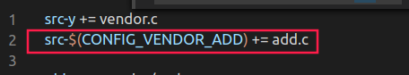

　　`vendor.c`如下图，与之前的程序一样。

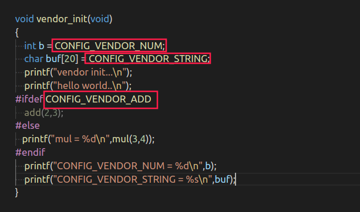

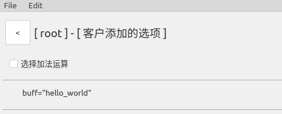

　　`IconfigTool`的配置界面如上图所示，未勾选“选择加法运算”，编译如下，没有编译`add.c`

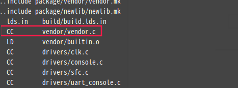

　　烧录结果如下图

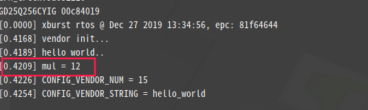

　　若勾选了“选择加法运算”，编译如下，编译加入`add.c`

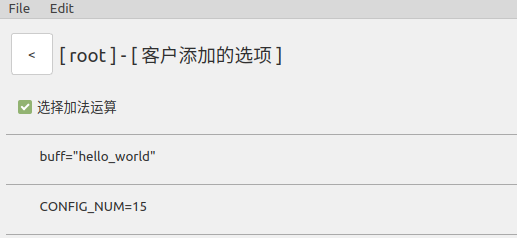

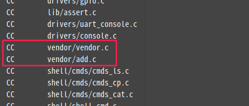

　　烧录结果如下

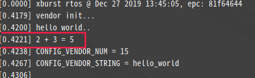

## 8 注意事项

　　与驱动相关文件推荐使用源码编译，仅推荐算法使用.o/.a，与驱动相关的文件最好使用源码编译。

　　例1:对于不同的板极，soc中.h的内容是不同的，以`soc-x1000`中的`soc/gpio.h`和`soc-x1520`中的`soc/gpio.h`，如下图

　　`soc-x1000`中的`soc/gpio.h`

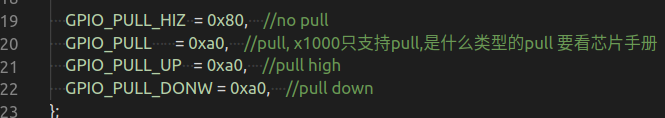

　　 `soc-x1520`中的`soc/gpio.h`

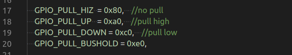

　　从以上两张图中明显可以看出，不同的板极引脚功能是不同的。

　　例2：.o/.a的生成链接了某些驱动，但是当固件更新时，对应的驱动的结构体大小或者接口发生变化的时候也会出错。

　　所以仅推荐算法使用的.o/.a，与驱动相关的文件最好使用源码编译。


## 9 相关文件介绍

### 9.1 package/vendor/vendor.mk

>  文件中可以使用如下变量执行相应的功能

```
package_name       #定义包名,用于 package_depends 依赖时寻找

package_depends      #定义依赖的包,依赖的包先编译

package_builtin_src    #定需要编译的文件目录,在改目录中编写Makefile文件控制哪

package_make_hook

package_init_hook

package_finalize_hook

package_clean_hook

hook 的执行顺序如下所示: init_hook -> builtin_src -> make_hoook -> rtos镜像 -> finalize_hook
```

> 例如，   在 package/vendor/vendor.mk 中添加

```makefile
define vendor_make_hook
	$(Q)echo "生成.bin文件之前执行"
endef
define vendor_init_hook
	$(Q)echo "在编译流程开始前执行"
endef
define vendor_finalize_hook
	$(Q)echo "在编译流程结束后执行"
endef
define vendor_clean_hook
	$(Q)echo "在 make clean的时候执行"
endef
package_make_hook =  vendor_make_hook
package_init_hook =  vendor_init_hook
package_clean_hook = vendor_clean_hook
package_finalize_hook = vendor_finalize_hook
```

### 9.2  xburst/init.c

　　`c_main`函数是工程的入口，在文件`init.c`中，该文件在`freertos/xburst/`目录下。`c_main`中的宏控是开启开发板的部分功能，例如开机时显示编译的时间、cache驱动(cache相关操作)、IRQ驱动(中断)、CLK驱动(时钟)、高精度定时器等，依据需求用户可以在`IconfigTool`中开启。直至`CONFIG_OS`前都是相应的宏控。在`CONFIG_OS`定义后创建线程`main_init_thread`，其中第三方编写的内容函数`vendor_init`就在该线程的末尾执行。
