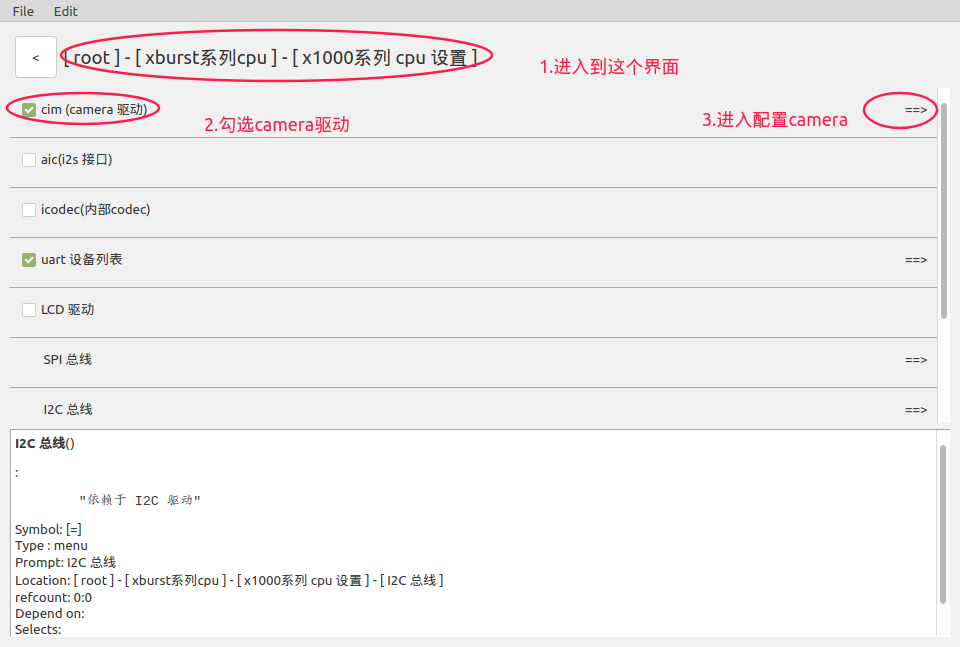
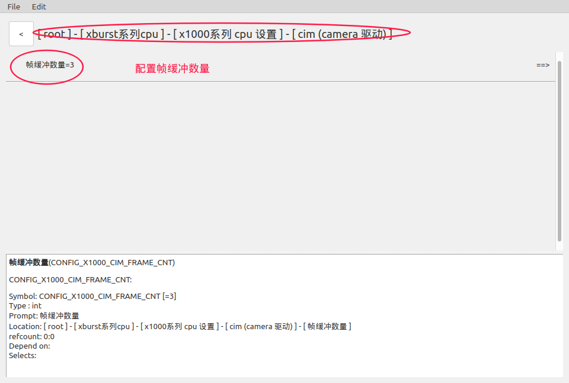
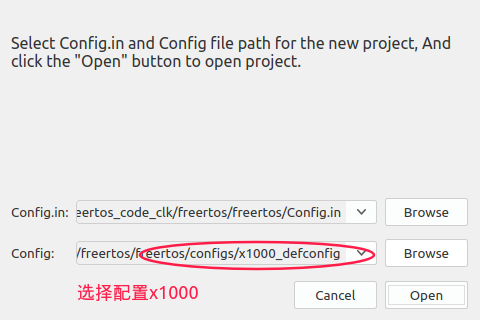
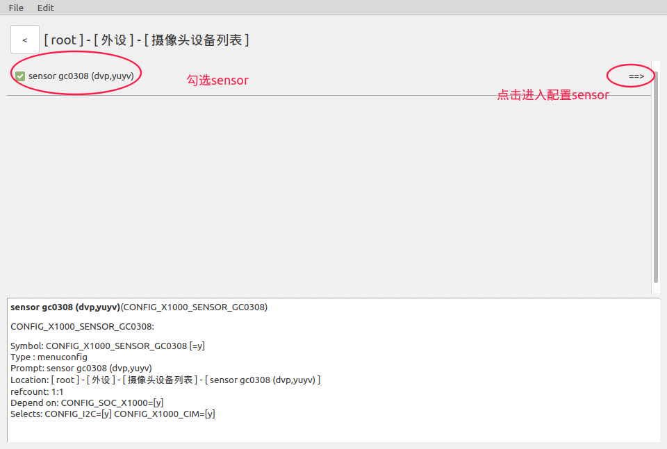
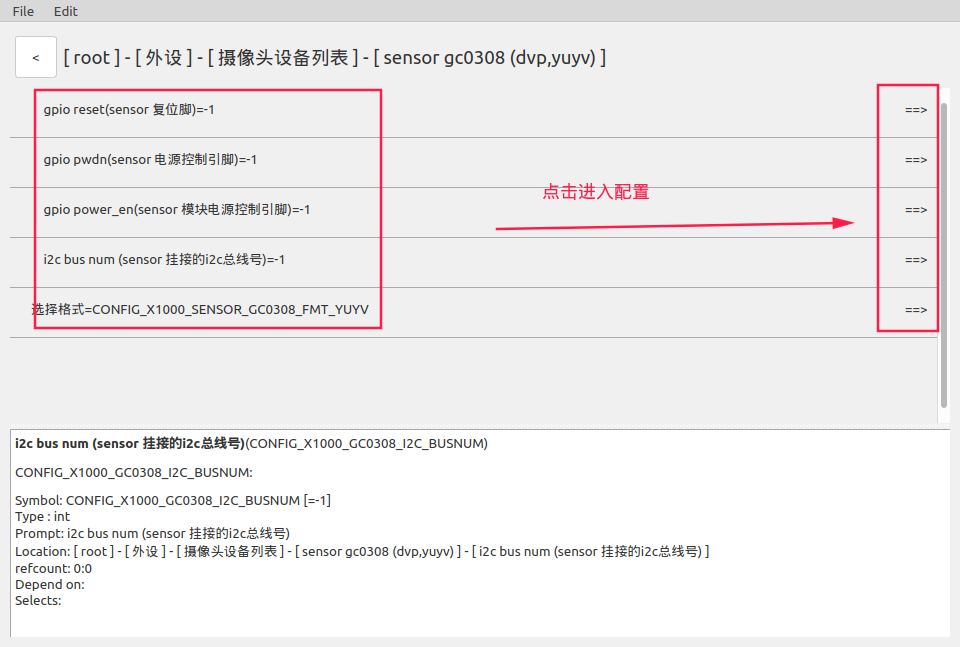
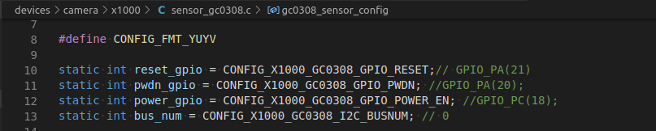
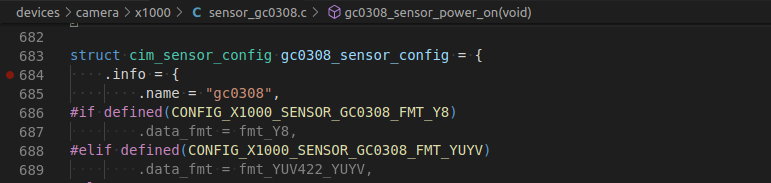

# FreeRTOS_x1000 Camera Sensor使用说明


## 1.关于Camera

> 1.君正x1000添加的Camera sensor驱动代码存放在devices/camera/x1000/目录下。
>
>       另外x1000 的camera接口驱动代码存放在xburst/soc-x1000/camera/ 目录下(可以不用关注)。
>
> 2.应用层的调用接口在driver/camera.c 文件中，应用例子在example/driver/camera_example.c中。


## 2.添加Camera Sensor

### 2.1.添加流程概要

> **1.配置Sensor结构体**
>
> ​         在新添加的sensor代码中定义一个struct cim_sensor_config 类型的变量，并进行配置。该结构体类型的相关说明在第2.2章
>
> **2.注册Sensor**
>
> ​         在Camera结构题初始化后需要使用cim_register_sensor()函数(函数说明在2.3.1)对新添加的Sensor进行注册，并将第一步配置的结构体变量作为实参传入。
>
> ​         君正的Sensor都注册在devices/init.c的cim_sensor_init()函数内。注册实例在2.3.2小节。
>
> **3.配置Camera Sensor**
>
> ​        使用IConfigTool对x1000的Camera驱动进行配置，配置方法在第2.4章。
>
> **建议参考君正已添加的Sensor代码**

### 2.2.配置Sensor结构体

#### 2.2.1.包含头文件

```c
  #include <soc/cim_sensor.h>
```

#### 2.2.2. Sensor结构体说明

```c
摄像头配置结构体

struct cim_sensor_config {

  struct camera_info info;                      // 配置sensor信息

  cim_interface cim_interface;                  // 配置Camera的数据采样模式

  // 控制台每次从摄像头接收四个字节的数据，然后下面再选择这四个数据的存放顺序
  // 例如index_byte0 = CIM_DVP_BYTE0 表示将第一个接收到的字节数据存放在第一个字节内存中
  // 例如原始数据为yuyv将其转变为yvyu
  // 则配置为index_byte0 = CIM_DVP_BYTE0;
  //        index_byte0 = CIM_DVP_BYTE3;
  //        index_byte0 = CIM_DVP_BYTE2;
  //        index_byte0 = CIM_DVP_BYTE1;
  cim_data_index index_byte0;                   // 选择存放在第1个字节内存的数据
  cim_data_index index_byte1;                   // 选择存放在第2个字节内存的数据
  cim_data_index index_byte2;                   // 选择存放在第3个字节内存的数据
  cim_data_index index_byte3;                   // 选择存放在第4个字节内存的数据

  dvp_sync_polarity hsync_polarity;             // 配置行同步信号的有效电平和触发边沿

  dvp_sync_polarity vsync_polarity;             // 配置帧同步信号的有效电平和触发边沿

  dvp_pclk_sample_edge data_sample_edge;        // 选择数据的采集边沿

  int (*sensor_power_on)(void);                 // 摄像头 开电源函数

  void (*sensor_power_off)(void);               // 摄像头 关电源函数

  int (*sensor_stream_on)(void);                // 摄像头 开启图像输出函数

  void (*sensor_stream_off)(void);              // 摄像头 关闭图像输出函数

};

```

#### 2.2.3.类型详解

包含头文件

```
#include <soc/cim_sensor.h>
```

```c
摄像头信息结构体

struct camera_info {
    const char *name;                     // 摄像头名称
    unsigned int xres;                    // 图像x轴长度
    unsigned int yres;                    // 图像y轴长度
    unsigned int frame_period_us;         // 帧周期
    camera_data_fmt data_fmt;             // 图像数据格式
    unsigned int frame_size;              // 该项不用配置
    unsigned int uv_data_offset;          // 该项不用配置

};
```

```c
图像数据格式
typedef enum {
  fmt_BAYER_RGGB_16BIT,
  fmt_BAYER_GRBG_16BIT,
  fmt_BAYER_GBRG_16BIT,
  fmt_BAYER_BGGR_16BIT,
  fmt_YUV422_YUYV,
  fmt_YUV422_UYVY,
  fmt_YUV422_YVYU,
  fmt_YUV422_VYUY,
  fmt_NV12,
  fmt_NV21,
  fmt_BAYER_RGGB_8BIT,
  fmt_BAYER_GRBG_8BIT,
  fmt_BAYER_GBRG_8BIT,
  fmt_BAYER_BGGR_8BIT,
  fmt_Y8,

} camera_data_fmt;
```

```c

数据采样模式

typedef enum {
  CIM_ITU656_Progressive_mode,           // 目前不支持
  CIM_ITU656_Interlace_mode,             // 目前不支持
  CIM_sync_mode,                         // 时钟同步模式

} cim_interface;
```

```c
数据接收顺序

typedef enum {
  CIM_DVP_BYTE0,                         // 第1个接收到的一字节数据
  CIM_DVP_BYTE1,                         // 第2个接收到的一字节数据
  CIM_DVP_BYTE2,                         // 第3个接收到的一字节数据
  CIM_DVP_BYTE3,                         // 第4个接收到的一字节数据

} cim_data_index;
```

```c
配置DVP 同步时序的有效电平和触发边沿

typedef enum {

  POLARITY_HIGH_ACTIVE,                 // 有效电平为高电平，触发边沿为上升沿
  POLARITY_LOW_ACTIVE,                  // 有效电平为低电平，触发边沿为下升沿

} dvp_sync_polarity;
```

```c
采样边沿

typedef enum {

  DVP_RISING_EDGE,                      // 采样边沿为上升沿
  DVP_FALLING_EDGE,                     // 采样边沿为下降沿

} dvp_pclk_sample_edge;
```


### 2.3.注册Sensor

#### 2.3.1. 注册函数说明

```c
void cim_register_sensor(struct cim_sensor_config *sensor)

功能：Sensor注册函数

参数：sensor         // 将第2章配置的sensor结构体变量传入

返回值：无
```

#### 2.3.2. 注册实例

以下我将注册新添加的gc0308 sensor，君正的sensor也是这样注册的。

```c
1.首先在自己新添加的sensor代码sensor_gc0308.c中定义一个sensor初始化函数，
  在该函数内调用注册函数进行注册，如下。

void gc0308_sensor_init(void)
{
  cim_register_sensor(&gc0308_sensor_config);
}
```

```c
2.随后将第一步定义的gc0308_sensor_init()函数,
  在devices/init.c里的cim_sensor_init()中调用，如下。

extern void gc0308_sensor_init(void);                // 声明函数
static void cim_sensor_init(void)
{
  gc0308_sensor_init();
}
```

### 2.4.配置Camera Sensor

1.选择x1000的config文件，进行配置


2.进入到该界面，勾选并配置x1000的camera驱动。

> ​      cim选项对应的宏名称为(CONFIG_X1000_CIM)



> 进入到Camera驱动配置后，就可以看到下图的配置界面。
>
> 我们需要配置Camera的帧缓冲数量(CONFIG_X1000_CIM_FRAME_CNT)




## 3.使用君正添加的Camera Sensor

### 3.1.配置Camera Sensor

1.选择x1000的config文件，进行配置



2.进入到该界面，勾选并进入配置x1000的camera驱动

> cim选项对应的宏名称为(CONFIG_X1000_CIM)


> 进入到Camera驱动配置后，就可以看到下图的配置界面。
>
> 我们需要配置Camera的帧缓冲数量(CONFIG_X1000_CIM_FRAME_CNT)


3.下面我们要进行sensor相关配置

> 1.勾选外设，进行配置


> 2.进入配置摄像头设备


> 3.进入到摄像头设备列表后，就可以看到下图的界面。
>
> 这些是目前君正x1000提供的sensor(后续会根据实际需求再添加)



> 4.进入到sensor配置后，就可以看到sensor gc0308的配置界面
>
> 每种sensor需要我们配置的内容不同,一切以实际情况而定



> 下面列出了配置选项和对应的宏(这些宏也可以在IConfigTool的下方解释栏看到)。
>
> 复位引脚                       CONFIG_X1000_GC0308_GPIO_RESET
>
> 电源控制引脚               CONFIG_X1000_GC0308_GPIO_PWDN
>
> 模块电源控制引脚       CONFIG_X1000_GC0308_GPIO_POWER_EN
>
> 挂接的I2C总线号         CONFIG_X1000_GC0308_I2C_BUSNUM
>
>
>
> 编码格式                       CONFIG_X1000_SENSOR_GC0308_FMT_YUYV
>
> ​                                      CONFIG_X1000_SENSOR_GC0308_FMT_Y8


> 下图为FreeRTOS x1000君正添加的gc0308 sensor的部分代码，我们在代码中可以查询到
>
> 这些宏的应用。





### 3.2.Camera编程流程

> 包含头文件
>
>  \#include <camera.h>
>
>
>
> 1.初始化Camera驱动                       camera_init()
>
> 2.探测可用的 camera                       camera_detect()
>
> 3.获取探测到的camera的信息         camera_get_info()
>
> 4.打开camera电源                            camera_power_on()
>
> 5.打开 camera 图像输出                  camera_stream_on()
>
> 6.等待可用的帧                                 camera_wait_frame()
>
> 7.将帧还给camera                           camera_put_frame()
>
> 8.关闭camera电源                           camera_power_off()
>
>
>
> 例子代码在example/driver/camera_example.c中
