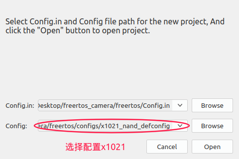
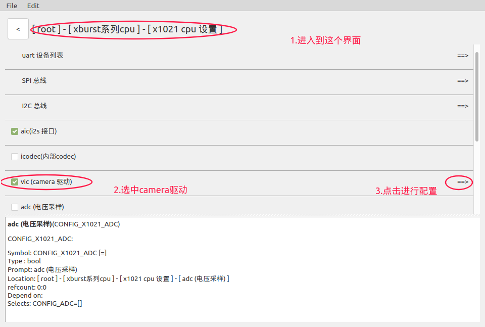
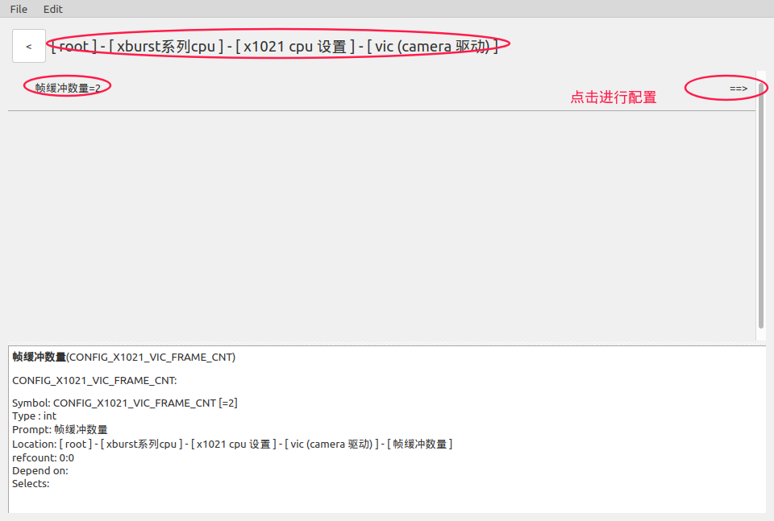
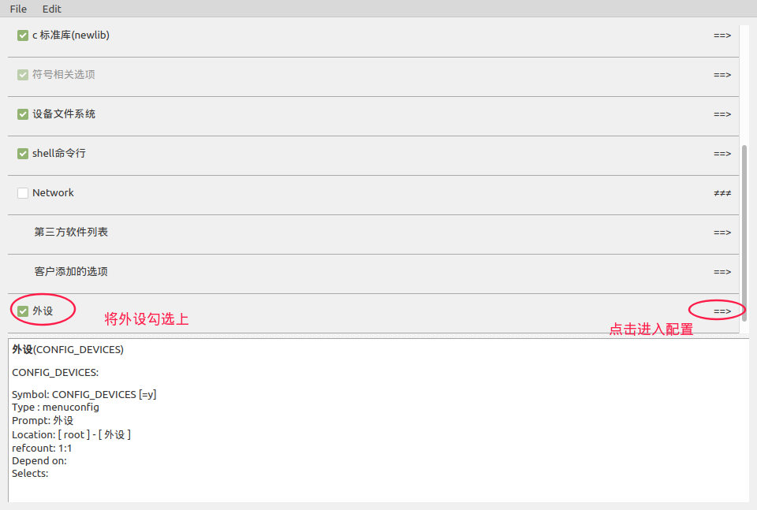
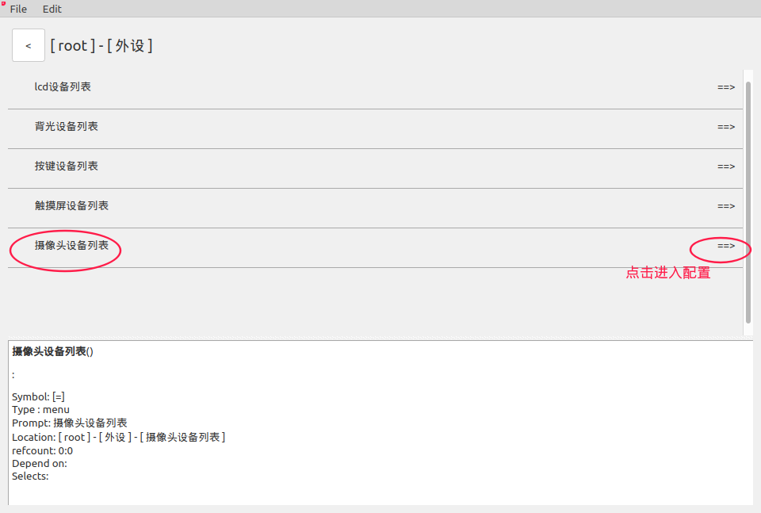
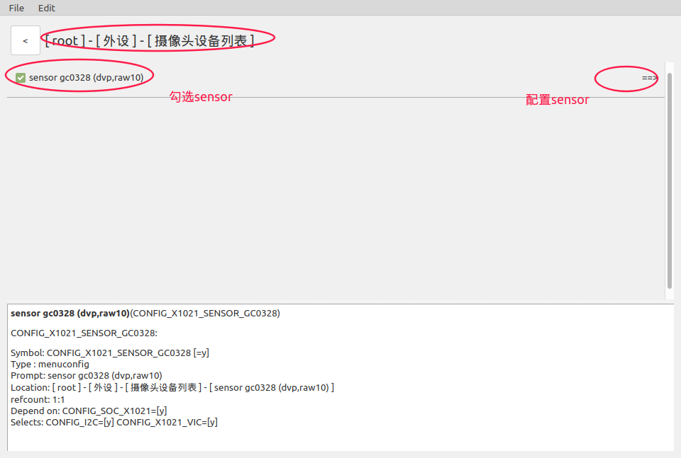
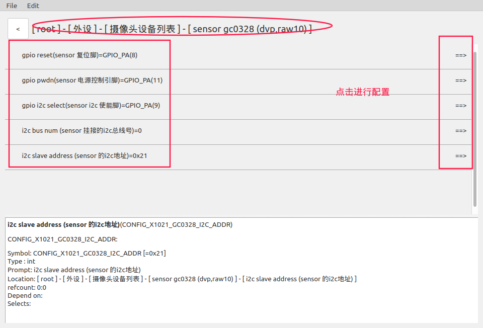
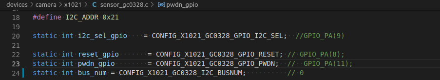

# FreeRTOS_x1021 Camera Sensor使用说明

## 1.关于Camera

> 1.君正x1021添加的Camera sensor驱动代码存放在devices/camera/x1021/目录下。
>
>    另外x1021 的camera接口驱动代码存放在xburst/soc-x1021/camera/ 目录下(可以不用关注)。
>
> 2.应用层的调用接口在driver/camera.c 文件中，应用例子在example/driver/camera_example.c中。


## 2.添加Camera Sensor

### 2.1.添加流程概要

> **1.配置Sensor结构体**
>
> ​         在新添加的sensor代码中定义一个struct vic_sensor_config 类型的变量，并进行配置。该结构体类型的相关说明在第2.2章
>
> **2.注册Sensor**
>
> ​         在Camera结构题初始化后需要使用vic_register_sensor()函数(函数说明在2.3.1)对新添加的Sensor进行注册，并将第一步配置的结构体变量作为实参传入。
>
> ​         君正的Sensor都注册在devices/init.c的cim_sensor_init()函数内。注册实例在2.3.2小节。
>
> **3.配置Camera Sensor**
>
> ​        使用IConfigTool对x1021的Camera驱动进行配置，配置方法在第2.4章。
>
> **建议参考君正已添加的Sensor代码**

### 2.2.配置Sensor结构体

#### 2.2.1.包含头文件

```
#include <soc/vic_sensor.h>
```

#### 2.2.2. Sensor结构体说明

```c
摄像头配置结构体
struct vic_sensor_config {
    struct camera_info info;                    // 配置sensor信息
    vic_interface vic_interface;                // 选择camera 接口类型
    struct dvp_bus_info dvp_cfg_info;           // 配置dvp接口信息
    long isp_clk_rate;                          // 设置isp时钟频率
    int (*sensor_power_on)(void);               // 摄像头 开电源函数
    void (*sensor_power_off)(void);             // 摄像头 关电源函数
    int (*sensor_stream_on)(void);              // 摄像头 开启图像输出函数
    void (*sensor_stream_off)(void);            // 摄像头 关闭图像输出函数
    struct list_head link;                      // 该项不用配置
};
```

#### 2.2.3.类型详解

包含头文件

```
#include <soc/vic_sensor.h>
```

```c
摄像头信息结构体
struct camera_info {
        const char *name;                      // 摄像头名称
        unsigned int xres;                     // 图像x轴长度
        unsigned int yres;                     // 图像y轴长度
        unsigned int frame_period_us;          // 帧周期
        camera_data_fmt data_fmt;              // camera_wait_frame得到的数据格式
        unsigned int frame_size;               // 该项不用配置
        unsigned int uv_data_offset;           // 该项不用配置
};
```

```c
选择摄像头输出数据格式
typedef enum {
    fmt_BAYER_RGGB_16BIT,
    fmt_BAYER_GRBG_16BIT,
    fmt_BAYER_GBRG_16BIT,
    fmt_BAYER_BGGR_16BIT,
    fmt_YUV422_YUYV,
    fmt_YUV422_UYVY,
    fmt_YUV422_YVYU,
    fmt_YUV422_VYUY,
    fmt_NV12,
    fmt_NV21,
    fmt_BAYER_RGGB_8BIT,
    fmt_BAYER_GRBG_8BIT,
    fmt_BAYER_GBRG_8BIT,
    fmt_BAYER_BGGR_8BIT,
    fmt_Y8,
} camera_data_fmt;
```

```c
Camera支持的接口类型
typedef enum {
    VIC_bt656,                    // 目前不支持
    VIC_bt601,                    // 目前不支持
    VIC_dvp,
    VIC_bt1120,                   // 目前不支持
} vic_interface;
```

```c
DVP接口信息配置
struct dvp_bus_info {
    dvp_data_fmt           dvp_data_fmt;            // DVP接口数据格式
    dvp_gpio_mode          dvp_gpio_mode;           // 选择DVP数据线引脚
    dvp_timing_mode        dvp_timing_mode;         // DVP 接口时序模式
    yuv_data_order         dvp_yuv_data_order;      // DVP YUV数据传输顺序
    dvp_sync_polarity      dvp_hsync_polarity;      // DVP行同步信号的有效电平
    dvp_sync_polarity      dvp_vsync_polarity;      // DVP帧同步信号的有效电平
    dvp_img_scan_mode      dvp_img_scan_mode;       // DVP图像扫描模式
};
```

```c
DVP接口数据格式
typedef enum {
    DVP_RAW8,
    DVP_RAW10,
    DVP_RAW12,
    DVP_YUV422,
} dvp_data_fmt
```

```c
选择DVP数据线引脚
typedef enum {
    DVP_PA_LOW_10BIT,              // 低10位引脚
    DVP_PA_HIGH_10BIT,             // 低10位引脚
    DVP_PA_12BIT,                  // 12位引脚全部使用
    DVP_PA_LOW_8BIT,               // 低8位引脚
    DVP_PA_HIGH_8BIT,              // 高8位引脚
} dvp_gpio_mode;
```

```c
DVP 接口时序模式
typedef enum {
    DVP_href_mode,
    DVP_hsync_mode,                // 目前不支持
    DVP_sony_mode,                 // 目前不支持
} dvp_timing_mode;
```

```c
/*                          clk1,clk2,clk3,clk4
 * 初始yuv 4字节顺序_1_2_3_4   1    2    3    4
 * 可根据自己的需求，转变成以下顺序
 */
typedef enum {
    order_2_1_4_3,
    order_2_3_4_1,
    order_1_2_3_4,
    order_3_2_1_4,
} yuv_data_order;
```

```c
DVP 同步时序的有效电平
typedef enum {
    POLARITY_HIGH_ACTIVE,            // 高电平有效
    POLARITY_LOW_ACTIVE,             // 低电平有效
} dvp_sync_polarity;
```

```c
DVP图像扫描模式
typedef enum {
    DVP_img_scan_progress,          // 逐行扫描
    DVP_img_scan_interlace,         // 交错扫描(奇数行与偶数行分开扫描)
} dvp_img_scan_mode;
```

### 2.3.注册Sensor

#### 2.3.1.注册函数说明

```c
void vic_register_sensor(struct vic_sensor_config *sensor)

功能：Sensor注册函数

参数：sensor                 // 将第2章配置的sensor结构体变量传入

返回值：无
```

#### 2.3.2. 注册实例

以下我将注册新添加的gc0328 sensor，君正的sensor也是这样注册的。

```c
1.首先在新添加的sensor代码sensor_gc0328.c中定义一个sensor初始化函数，
在该函数内调用注册函数进行注册，如下。

void gc0328_sensor_init(void)
{
    vic_register_sensor(&gc0328_sensor_config);
}
```

```c
2.然后将第一步定义的gc0328_sensor_init()在devices/init.c里的cim_sensor_init()中调用，如下。

extern void gc0328_sensor_init(void);                // 声明函数
static void cim_sensor_init(void)
{
    gc0328_sensor_init();
}
```

### 2.4.配置Camera Sensor

1.选择x1021是的config文件，进行配置



2.进入到该界面，勾选并配置x1021的camera驱动。

> vic选项对应的宏名称为(CONFIG_X1021_VIC)


> 进入到Camera驱动配置后，就可以看到下图的配置界面。
>
> 我们需要配置Camera的帧缓冲数量(CONFIG_X1021_VIC_FRAME_CNT)


## 3.使用君正添加的Camera Sensor

### 3.1.配置Camera Sensor

1.选择x1021的config文件，进行配置


2.进入到该界面，勾选并进入配置x1021的camera驱动。

> vic选项对应的宏名称为(CONFIG_X1021_VIC)



> 进入到Camera驱动配置后，就可以看到下图的配置界面。
>
> 我们需要配置Camera的帧缓冲数量(CONFIG_X1021_VIC_FRAME_CNT)



3.下面我们要进行sensor相关配置

> 1.勾选外设，进行配置



2.进入配置摄像头设备



3.进入到摄像头设备列表后，就可以看到下图的界面。(这里我们以配置gc0328为例)

> 这些是目前君正x1021提供的sensor(后续会根据实际需求再添加)，



4.进入到sensor配置后，就可以看到sensor gc0328的配置界面

> 每种sensor需要我们配置的内容不同,一切以实际情况而定



> 下面列出了配置选项和对应的宏(这些宏也可以在IConfigTool的下方解释栏看到)。
>
> 复位引脚                                    CONFIG_X1021_GC0328_GPIO_RESET
>
> 电源控制引脚,低电平有效        CONFIG_X1021_GC0328_GPIO_PWDN
>
> sensor挂接的I2C总线号          CONFIG_X1021_GC0328_I2C_BUSNUM
>
> sensori2c使能引脚                   CONFIG_X1021_GC0328_GPIO_I2C_SEL
>
> 

> 下图为FreeRTOS x1021君正添加的gc0328 sensor的部分代码，我们在代码中可以查询到这些宏的应用。



### 3.2.Camera编程流程

> 包含头文件
>
> \#include <camera.h>
>
>
>
> 1.初始化Camera驱动                       camera_init()
>
> 2.探测可用的 camera                       camera_detect()
>
> 3.获取探测到的camera的信息         camera_get_info()
>
> 4.打开camera电源                            camera_power_on()
>
> 5.打开 camera 图像输出                  camera_stream_on()
>
> 6.等待可用的帧                                 camera_wait_frame()
>
> 7.将帧还给camera                           camera_put_frame()
>
> 8.关闭camera电源                           camera_power_off()
>
>
>
> 例子代码在example/driver/camera_example.c中
