# FreeRTOS API


## 1.GPIO


### 1.1.GPIO配置流程

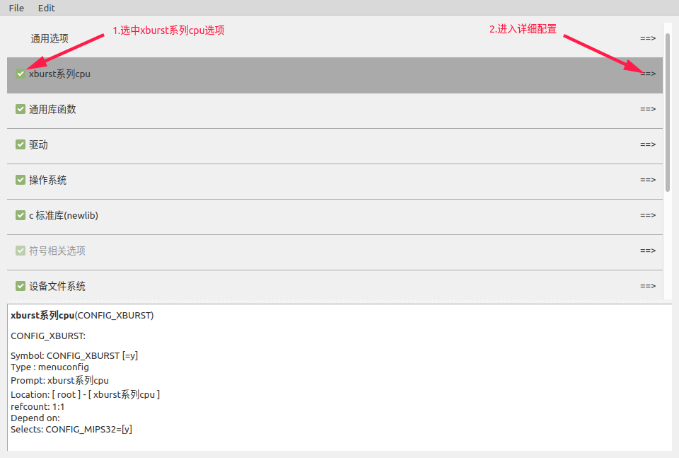

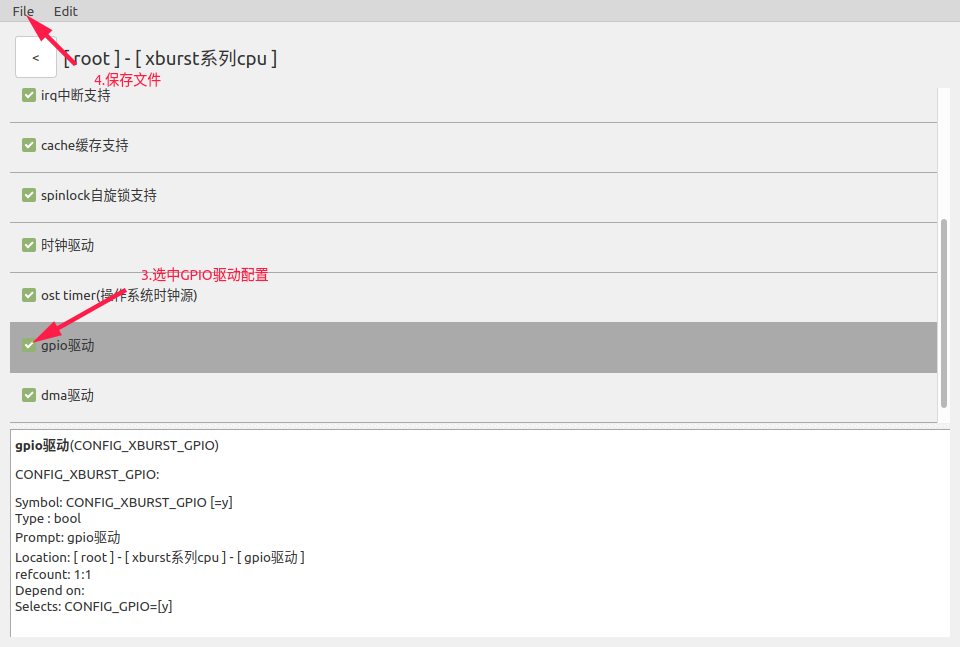

> 下面配置GPIO的电源域，参照自己的板级进行配置。
>
> 因为默认配置即为典型配置，所以无特殊需求可不进行配置。
>
> 只有x1021 和x1830才有此配置选项，下面以x1021为例。

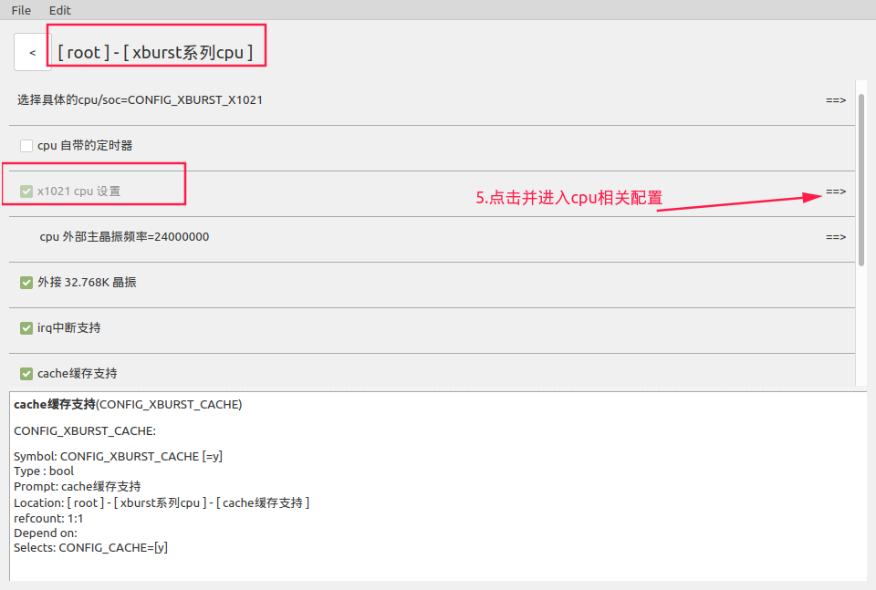

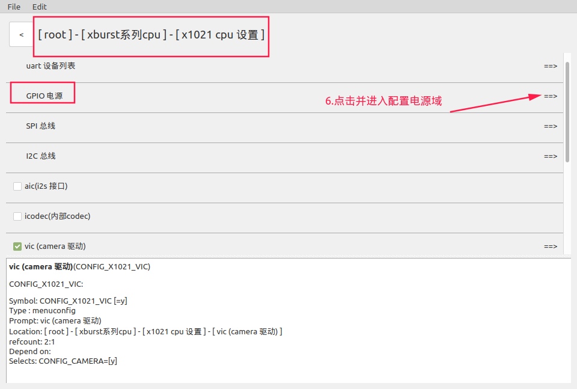

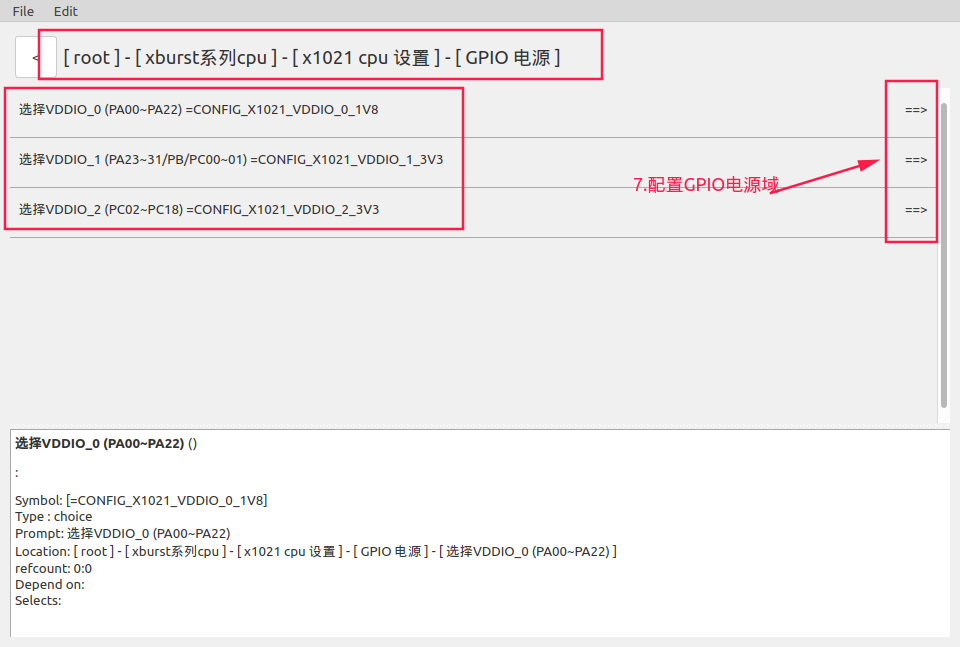

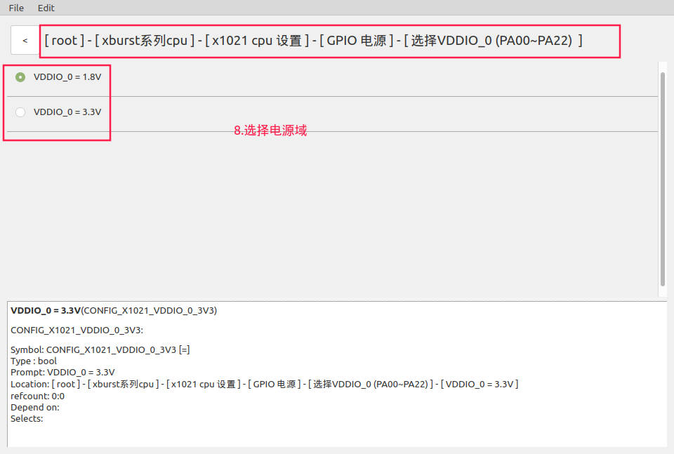

### 1.2.GPIO使用流程

> 注意：使用之前必须核对并配置GPIO电源域，上面是配置步骤。

> 1.申请需要使用的io口资源，gpio_request
>
> 2.设置io口模式，gpio_direction_input（输入）gpio_direction_output（输出）
>
> 3.释放io口，gpio_release


### 1.3.GPIO详解

#### 1.3.1.包含头文件

```c
#include <gpio.h>
#include <irq.h>
#include <soc/gpio.h>
```

#### 1.3.2.中间参数详解

```c
X1000：
            GPIO功能：
            enum gpio_function {
                         GPIO_FUNC_0        = 0x10,  /* 0000, GPIO 作为 function0 */
                         GPIO_FUNC_1        = 0x11,  /* 0001, GPIO 作为 function1 */
                         GPIO_FUNC_2        = 0x12,  /* 0010, GPIO 作为 function2 */
                         GPIO_FUNC_3        = 0x13,  /* 0011, GPIO 作为 function3 */
                         GPIO_OUTPUT0     = 0x14,  /* 0100, GPIO 输出低电平 */
                         GPIO_OUTPUT1     = 0x15,  /* 0101, GPIO 输出高电平 */
                         GPIO_INPUT            = 0x16,  /* 0110, GPIO 引脚输入 */
                         GPIO_INT_LO          = 0x18,  /* 1000, 低电平触发中断（不需要设置） */
                         GPIO_INT_HI           = 0x19,  /* 1001, 高电平触发中断（不需要设置） */
                         GPIO_INT_FE           = 0x1a,  /* 1010, 下降沿触发中断（不需要设置） */
                         GPIO_INT_RE           = 0x1b,  /* 1011, 上升沿触发中断（不需要设置） */
                         GPIO_INT_MASK_LO   = 0x1c,  /* 1100, 端口是低电平触发的中断输入。 屏蔽中断 */
                         GPIO_INT_MASK_HI   = 0x1d,  /* 1101, 端口是高电平触发的中断输入。 屏蔽中断. */
                         GPIO_INT_MASK_FE   = 0x1e,  /* 1110, 端口是下降沿触发的中断输入。 屏蔽中断. */
                         GPIO_INT_MASK_RE   = 0x1f,  /* 1111,端口是上升沿触发的中断输入。 屏蔽中断. */
                         GPIO_PULL_HIZ      = 0x80,   /* 悬空（没有上下拉)*/
                         GPIO_PULL                = 0xa0,    /*拉, x1000只支持pull,是什么类型的pull 要看芯片手册*/
                         GPIO_PULL_UP        = 0xa0,    /* 拉高 */
                         GPIO_PULL_DOWN = 0xa0,    /* 拉低 */
};

X1021/X1520/X1830：
            GPIO功能：
            enum gpio_function {
                         GPIO_FUNC_0    = 0x10,  /* 0000, GPIO 作为 function0 */
                         GPIO_FUNC_1    = 0x11,  /* 0001, GPIO 作为 function1 */
                         GPIO_FUNC_2    = 0x12,  /* 0010, GPIO 作为 function2 */
                         GPIO_FUNC_3    = 0x13,  /* 0011, GPIO 作为 function3 */
                         GPIO_OUTPUT0   = 0x14,  /* 0100, GPIO 输出低电平 */
                         GPIO_OUTPUT1   = 0x15,  /* 0101, GPIO 输出高电平 */
                         GPIO_INPUT     = 0x16,  /* 0110, GPIO 引脚输入 */
                         GPIO_INT_LO    = 0x18,  /* 1000, 低电平触发中断（不需要设置） */
                         GPIO_INT_HI    = 0x19,  /* 1001, 高电平触发中断（不需要设置） */
                         GPIO_INT_FE    = 0x1a,  /* 1010, 下降沿触发中断（不需要设置） */
                         GPIO_INT_RE    = 0x1b,  /* 1011, 上升沿触发中断（不需要设置） */
                         GPIO_INT_MASK_LO   = 0x1c,  /* 1100, 端口是低电平触发的中断输入。 屏蔽中断 */
                         GPIO_INT_MASK_HI   = 0x1d,  /* 1101, 端口是高电平触发的中断输入。 屏蔽中断. */
                         GPIO_INT_MASK_FE   = 0x1e,  /* 1110, 端口是下降沿触发的中断输入。 屏蔽中断. */
                         GPIO_INT_MASK_RE   = 0x1f,  /* 1111,端口是上升沿触发的中断输入。 屏蔽中断. */
                         GPIO_PULL_HIZ  = 0x80,    /* 悬空（没有上下拉） */
                         GPIO_PULL_UP   = 0xa0,    /* 拉高 */
                         GPIO_PULL_DOWN = 0xc0,    /* 拉低 */
                         GPIO_PULL_BUSHOLD = 0xe0, /* 不需要设置 */
                         GPIO_DRIVE_2MA  = 0x800,    /* 驱动能力为2mA */
                         GPIO_DRIVE_4MA  = 0x900,    /* 驱动能力为4mA */
                         GPIO_DRIVE_8MA  = 0xa00,    /* 驱动能力为8mA */
                         GPIO_DRIVE_12MA = 0xb00,    /* 驱动能力为12mA */
                         GPIO_RATE_SLOW = 0x2000,    /* 上升沿斜率缓 */
                         GPIO_RATE_FAST = 0x3000,    /* 上升沿斜率陡 */
                         GPIO_SMT_ENABLE  = 0x8000,    /* 施密特触发器使能 */
                         GPIO_SMT_DISABLE = 0xc000,    /* 施密特触发器关闭 */
};
```

#### 1.3.3.接口

```c
int gpio_request(int gpio, const char *name)
功能：向驱动申请一个指定io，所申请的io口会被驱动记录。
参数：
             int gpio                              // 申请的io编号 ; 填写格式：GPIO_Px(n)
             const char *name         // 申请者的名字 (做为出错信息打印)
返回值：
                 成功:   0；
                 失败: （1） -EBUSY：申请的io忙状态
                             （2）-1            ：申请的io编号错误
"注意: 此函数在使用io口之前使用。已经被申请的io，在没有释放之前再次申请将会失败。"
```

```c
void gpio_release(int gpio)
功能：释放向驱动已经申请的指定io。
参数：int gpio                              // 所要释放io编号；填写格式：GPIO_Px(n)
"注意：此函数和 gpio_request配对使用，功能相反。"
```

```c
void gpio_direction_input(int gpio)
功能：指定io口设置为输入功能。
参数：int gpio                               // 需要设置的io ；填写格式：GPIO_Px(n)
```

```c
void gpio_direction_output(int gpio, int value)
功能：指定io口设置为输出功能，并输出指定电平value。
参数：
             int gpio                               // 需要指定io口的编号；填写格式GPIO_Px(n)
             int value：
                                   0： 输出低电平
                                   1： 输出高电平
```

```c
int gpio_get_value(int gpio)
功能：获取io口的电平。
参数：int gpio                               // 需要获取io口编号； 填写格式：GPIO_Px(n)
返回值：
                 0：电平为低
                 1：电平为高
"注意：GPIO处于任何模式都可以直接调用这个接口，包括中断模式和输出模式。"
```

```c
void gpio_set_value(int gpio , int value)
功能：设置io口的电平。
参数：int gpio                               // 需要设置的io口编号； 填写格式：GPIO_Px(n)
             value：
                           0：输出低电平
                           1：输出高电平
"注意：必须保证GPIO是输出模式，才能调用这个接口。"
```

```c
int gpio_to_irq(int gpio)
功能：通过io口编号转换成对应的外部中断编号。
参数：int gpio                              // 要获取的io口编号； 填写格式：GPIO_Px(n)
返回值：
                成功：返回中断编号
                失败：-1（io编号错误）
```

```c
int irq_to_gpio(int irq)
功能：通过外部中断编号转换成对应的io口编号。
参数：int gpio                              // 要获取的io口编号； 填写格式：GPIO_Px(n)
返回值：返回io口编号
```

```c
char *gpio_to_str(int gpio, char *buf,  size_t size);
功能：gpio转字符串。
参数：
             int gpio                                    //  io口编号  填写格式：GPIO_Px(n)
             char *buf                                 // 存放字符串指针
             size_t size                               // buf 的长度（sizeof(buf)）
返回值：字符串地址
```

```c
int str_to_gpio(const char *str);
功能：字符串转gpio。
参数：char *str                                   // 字符串地址
返回值：
                 成功：gpio值
                 失败：-1
```

```c
void gpio_set_func(int gpio, enum gpio_function func)
功能：把指定io口配置为指定功能。
参数：
               int gpio                                    // 要获取的io口编号； 填写格式：GPIO_Px(n)
               enum gpio_function func// GPIO功能
```

```c
enum gpio_function gpio_get_func(int gpio);
功能：获取gpio的功能。
参数：
           int gpio                                         // io口编号 填写格式：GPIO_Px(n)
返回值：返回gpio所有功能
```

```
线程安全并可在中断上下文使用：
        str_to_gpio
        gpio_request
        gpio_release
        gpio_direction_input
        gpio_direction_output
        gpio_get_value
        gpio_set_value
        gpio_to_str
        gpio_get_func
        gpio_set_fun
```


## 2.UART


### 2.1.Uart配置流程

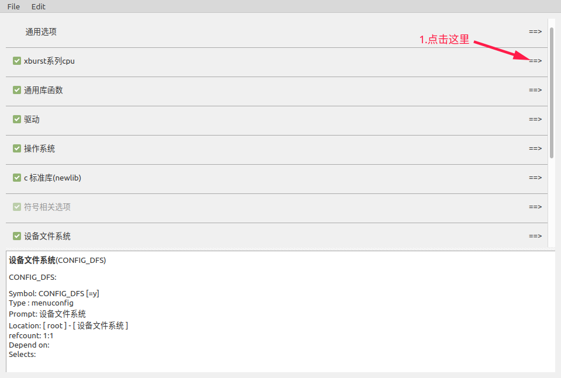

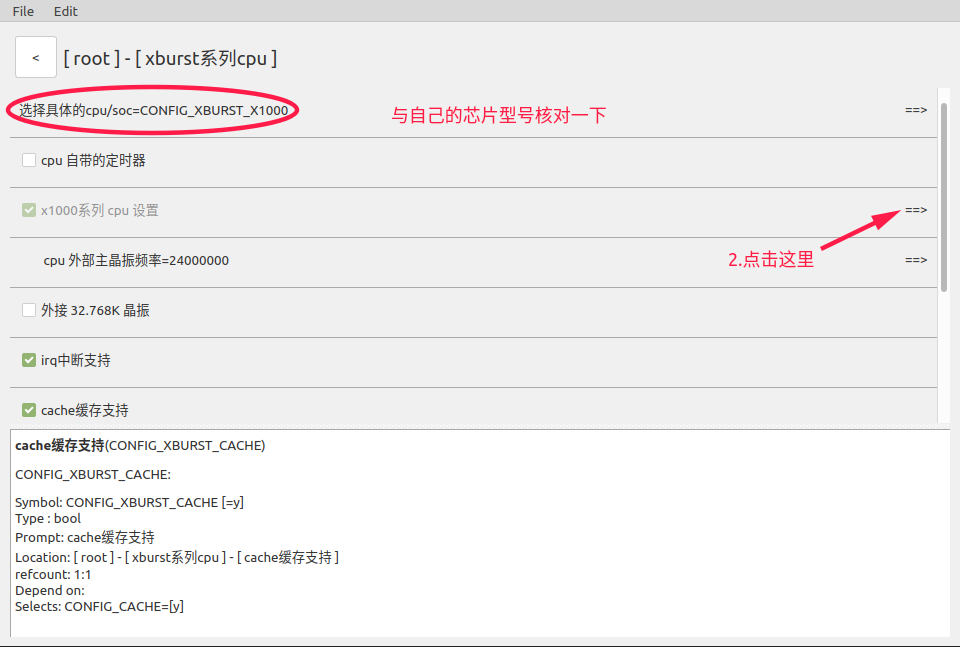

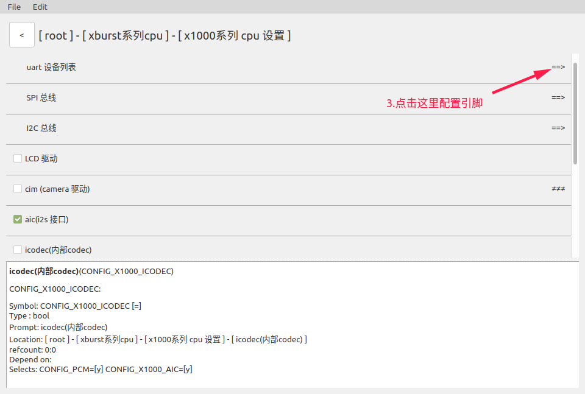

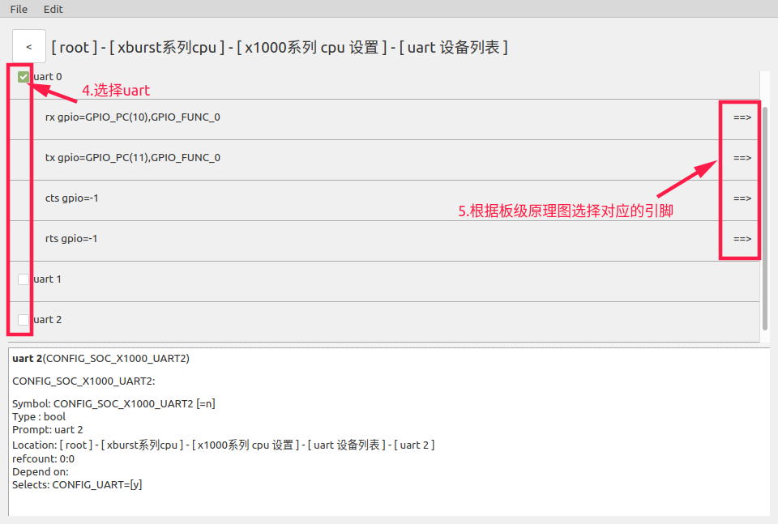


`修改终端串口配置`

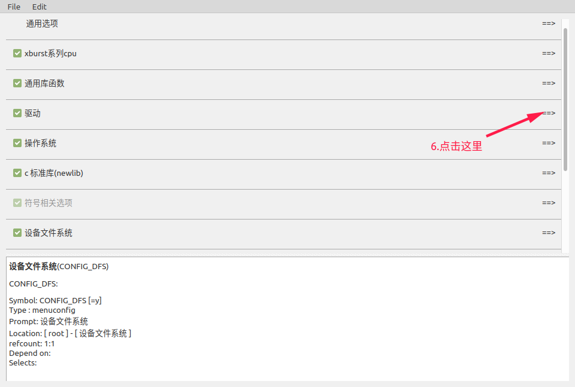

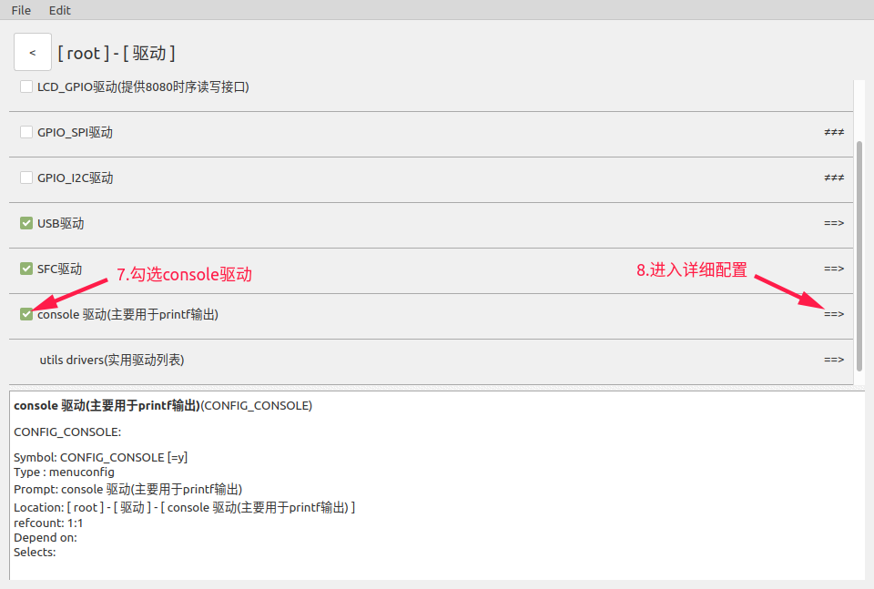

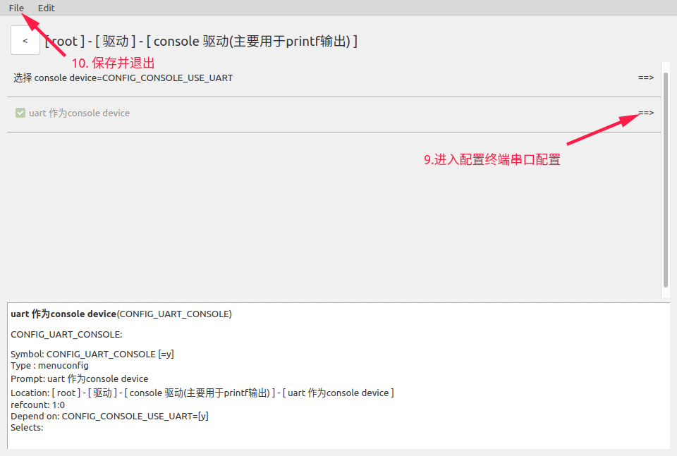


### 2.2.UART使用流程

> 1.uart_start                                                             //初始化控制器，并设置接收缓存
>
> 2.uart_send, uart_receive, uart_get_char //函数进行传输。
>
> 3.uart_stop                                                             //关闭控制器并清除接收缓存
>
> 例子代码在example/driver/uart_example.c


### 2.3.UART接口详解

#### 2.3.1.包含头文件

```c
#include <uart.h>
```

#### 2.3.2.中间参数详解

```c
uart配置结构体
struct uart_config {
             unsigned char uart_id;                                          // uart总线编号
             unsigned char data_bits;                                      // 一帧的数据位数
             unsigned char stop_bits;                                      // 停止位数
             unsigned char loop_mode;                                 // 循环模式设置(用于测试)
             unsigned char rx_poll_mode;                            // 接收方式：1为轮询机制 0为中断方式
             unsigned char tx_poll_mode;                            // 发送方式：1为轮询机制 0为中断方式
             enum uart_parity parity;                                      // 设置uart奇偶校验
             enum uart_follow_contrl follow_contrl;       // 设置流控
             unsigned int baud_rate;                                        // 设置波特率
};

uart设置奇偶枚举
enum uart_parity {
             UART_PARITY_NONE,             //没有奇偶校验
             UART_PARITY_ODD,                //奇校验
             UART_PARITY_EVEN,              //偶校验
};

uart设置流控枚举
enum uart_follow_contrl {
             UART_FC_NONE,                     //关闭流控
             UART_FC_CTS_RTS,               //控制流选择RTS/CTS
};
```

#### 2.3.3.接口

```c
void uart_start(struct uart_config *config)
功能：初始化uart控制器，设置引脚功能映射，设置接受缓存
参数：struct uart_config *config                                             // uart配置结构体
```

```c
void uart_stop(struct uart_config *config)
功能：关闭uart控制器(关闭时钟和释放中断等操作)
参数：struct uart_config *config                                            // uart配置结构体
```

```c
void uart_send(struct uart_config *config, const char *buf, unsigned int len)
功能：uart发送数据
参数：
              struct uart_config *config                                            // uart配置结构体
              const char *buf                                                                 // 待发送的数据
              unsigned int len                                                               // 发送数据的长度
```

```c
void uart_receive(struct uart_config *config, char *buf, unsigned int len)
功能：uart接收数据
参数：
             struct uart_config *config                                              // uart配置结构体
             const char *buf                                                                   // 接收数据缓冲区
             unsigned int len                                                                 // 需要接受数据的长度
```

```c
char uart_get_char(struct uart_config *config)
功能：uart接收一个字符
参数：struct uart_config *config                                              // uart配置结构体
返回值：获取到的字符
```

```
线程安全并可在中断上下文使用：
        uart_start
        uart_stop （注意：调用数据传输过程，停止uart会系统异常）

如果初始化为中断工作模式，函数线程安全。不允许在中断上下文使用。
如果初始化为轮询工作模式，函数非线程安全，需要用户自己保证不能同时调用函数。可以在中断上下文使用。
        uart_send
        uart_receive
        uart_get_char
```


## 3.I2C


### 3.1.I2C配置流程

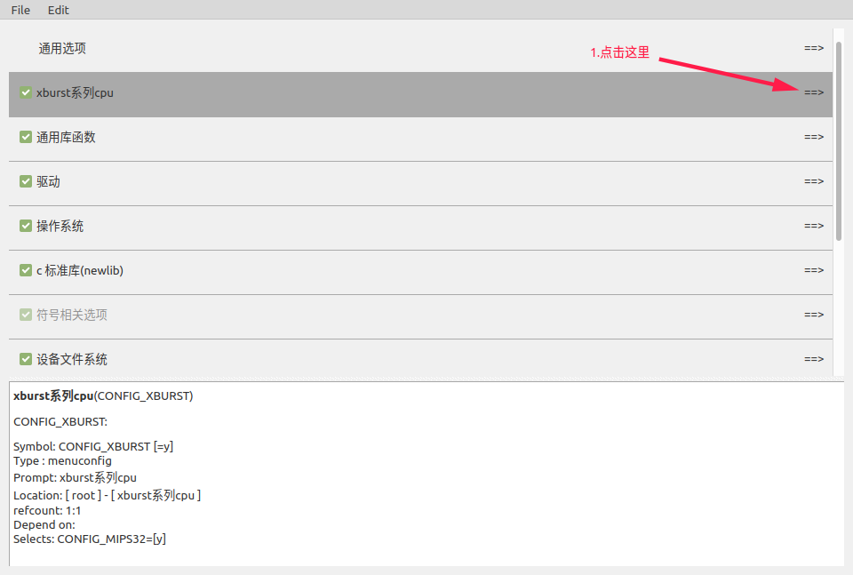

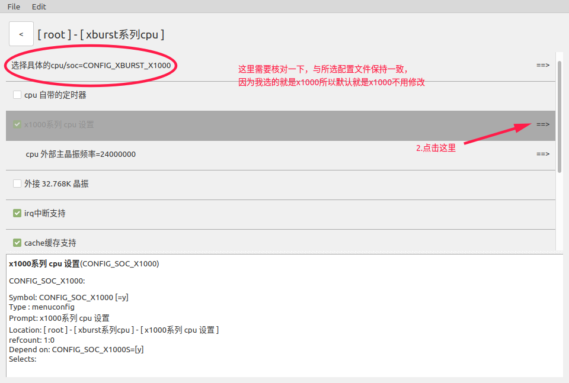

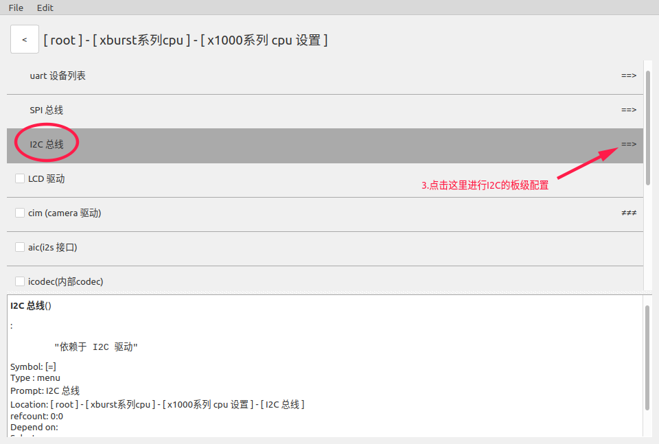

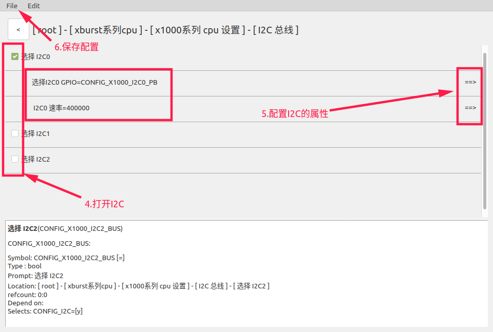


### 3.2.I2C使用流程

> 1.i2c_init                         //函数初始化I2C
>
> 2.i2c_register               //注册I2C
>
> 3.i2c_transfer              //函数进行I2C数据传输
>
> 4.i2c_unregister               //释放I2C
>
> 例子代码在example/driver/i2c_example.c


### 3.3.I2C接口详解

#### 3.3.1.包含头文件

```c
#include<i2c.h>
```

#### 3.3.2.中间参数详解

```c
I2C从设备句柄:
struct i2c_device {
             int bus_num;                                               // I2C总线编号
             char *name;                                                 // I2C设备名（仅作为标识）
             enum i2c_addr_type addr_bit;           // I2C器件地址类型
             unsigned short addr;                               // I2C从设备地址
             struct i2c_bus *i2c_bus;                         // I2C总线
             struct list_head link;                                // 已注册设备链表节点
};

I2C从设备器件地址长度：
enum i2c_addr_type {
             I2C_ADDR_BIT_7,                                     // 7位器件地址
             I2C_ADDR_BIT_10,                                  // 10位器件地址
};

I2C传输相关信息结构体:
struct i2c_msg {
             int len;                                                           // 数据传输的个数
             void *buf;                                                     // 数据缓冲区
             int flags;
                               /*
                                 * flags 传输标识.有以下选择：
                                 * I2C_M_TEN : 选择 10bit 地址
                                 * I2C_M_RD  : 发送读操作命令
                                 * I2C_M_RW  : 发送写操作命令
                                 * I2C_M_NOSTART ：当flags没有此标志位时开始传输第一个msg时发送start信号
                                 *                                          之后每个msg都发送start信号最后传输结束发送stop信号。
                                 * NOTE： 以上传输标识可组合使用（使用或运算）
                                 */
};
```

#### 3.3.3.接口

```c
struct i2c_device *i2c_register(int i2c_bus_num, unsigned short addr, enum i2c_addr_type addr_bit, char *name)
功能：  注册I2C设备
参数：
              int i2c_bus_num                                             // I2C总线编号
　　　 unsigned short addr                                     // I2C从设备地址
              enum i2c_addr_type addr_bit                 // I2C从设备地址类型
　　　 char *name                                                       // I2C设备名（仅作为标识）
返回值：struct i2c_device                                         // 从设备句柄
```

```c
int i2c_transfer(struct i2c_device *i2c, struct i2c_msg *msg, int count)
功能：I2C数据传输
参数：
              struct i2c_device *i2c                                   // 从设备句柄（I2C注册函数返回值）
              struct i2c_msg *msg                                     // 传输数据的信息
              int count　　　　　　　　                         // 传输数据的数量
返回值：
                  大于0　　　　　　　　　                        // 传输数据的数量
　　　　-ENXIO（-6）　　　　　　                     // 没有发现从设备地址和设备
　　　　-ETIMEDOUT（-110）　                          // 连接超时
"注意：函数运行时会阻塞，在线程上下文使用的时候会引起任务调度，在中断上下文使用时会轮询阻塞。"
```

```c
 int i2c_detect_device(struct i2c_device *i2c)
   功能：检测I2C从设备地址
   形参：struct i2c_device *i2c                                 // 从设备句柄（I2C注册函数返回值）
   返回值：
                    0                                                                       // 检测器件地址成功(i2c->addr)
                    -ETIMEDOUT（-110）　                         // 连接超时
```

```c
void i2c_unregister(struct i2c_device *i2c)
功能： 释放I2C资源
形参： struct i2c_device *i2c                                    // 从设备句柄（I2C注册函数返回值）
```

```
线程安全，不能在中断上下文使用：
        i2c_register
        i2c_transfer
        i2c_unregister
        i2c_detect_device
```


## 4.GPIO_I2C


> 提示：使用gpio模拟i2c。

### 4.1.GPIO_I2C配置流程

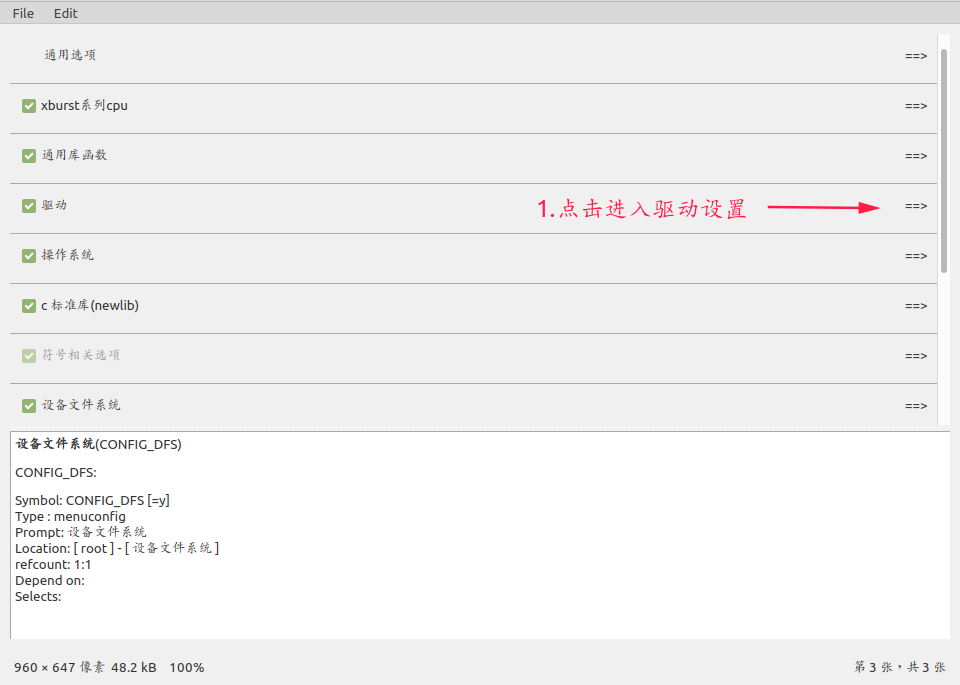

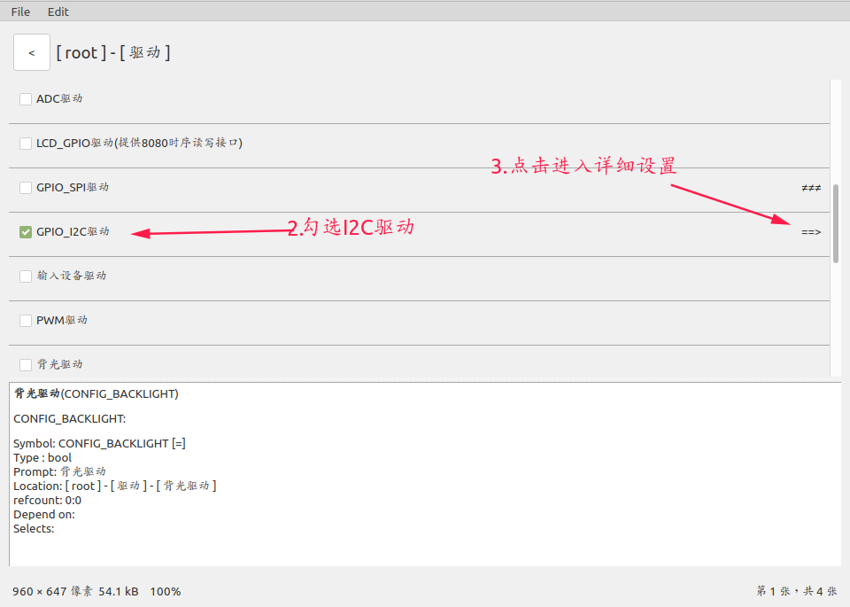

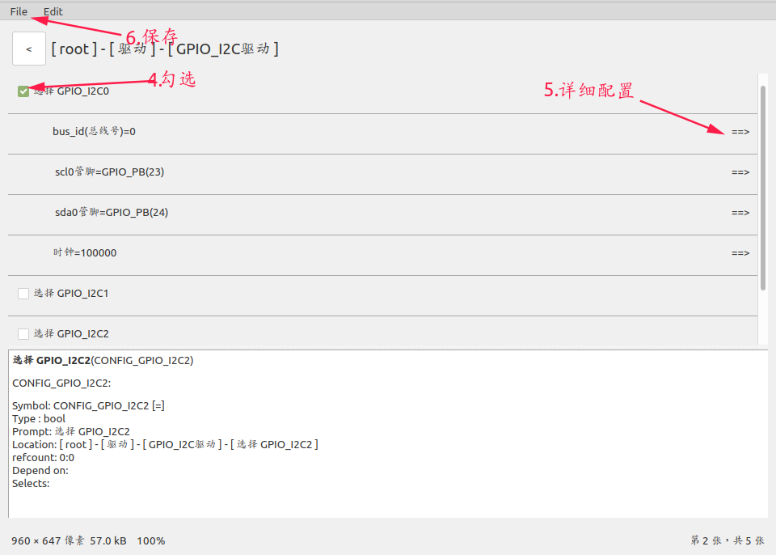


### 4.2.GPIO_I2C使用流程

> 1、配置好Iconfig会注册对应的I2C总线
>
> 注意：如果Iconfig配置总线不够，可以自行添加总线。
>
> 在调用注册函数前可以先调用i2c_gpio_add_bus 函数添加总线
>
> 在调用注销后调用i2c_gpio_remove_bus函数删除总线。


### 4.3.GPIO_I2C接口详解

#### 4.3.1.包含头文件

```c
#include<gpio_i2c.h>
```

#### 4.3.2.中间参数详解

```c
gpio_i2c总线数据结构体：
struct gpio_i2c_bus_data {
             int i2c_bus_id;                            //总线编号
             int gpio_scl;                                 //scl时钟线引脚
             int gpio_sda;                               //sda数据线引脚
             unsigned int clk_rate;             //时钟频率
};
" 注意：其他结构体参数清参考i2c中间参数详解。"
```

#### 4.3.3.接口

```c
struct i2c_bus* gpio_i2c_add_bus(struct gpio_i2c_bus_data *i2c);
功能：向总线链表添加总线节点
参数：struct gpio_i2c_bus_data *i2c                                 //总线数据，数据内容可由用户输入
返回值：总线信息结构体
```

```c
void gpio_i2c_remove_bus(struct i2c_bus *i2c_bus);
功能：移除总线链表中的总线节点
参数：struct i2c_bus *i2c_bus                                             //总线信息
返回值：无
"注意：其他 注册 传输 注销api请参考适配器i2c函数，这些函数与适配器共用同一个接口。"
```

```
线程安全，可以在中断上下文使用：
        gpio_i2c_add_bus
线程安全，不能在中断上下文使用：
        gpio_i2c_remove_bus
```


## 5.SPI


### 5.1.SPI配置流程

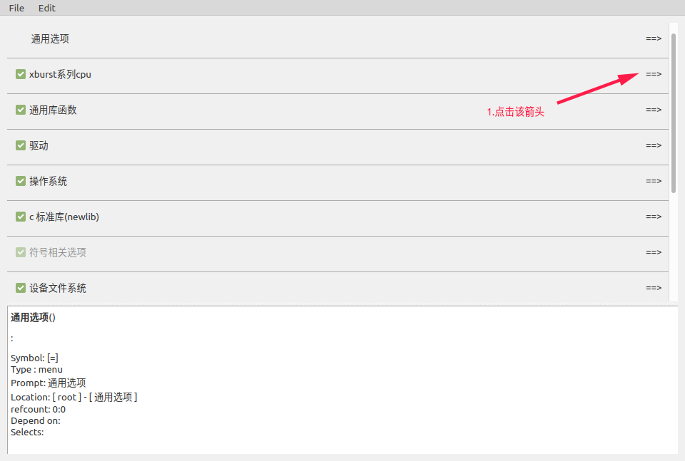

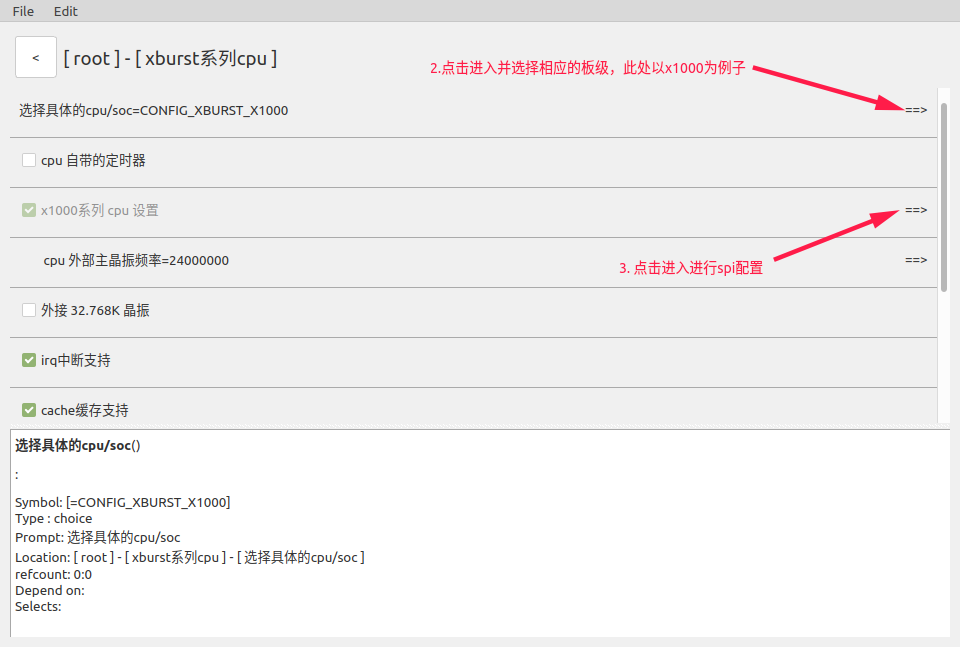

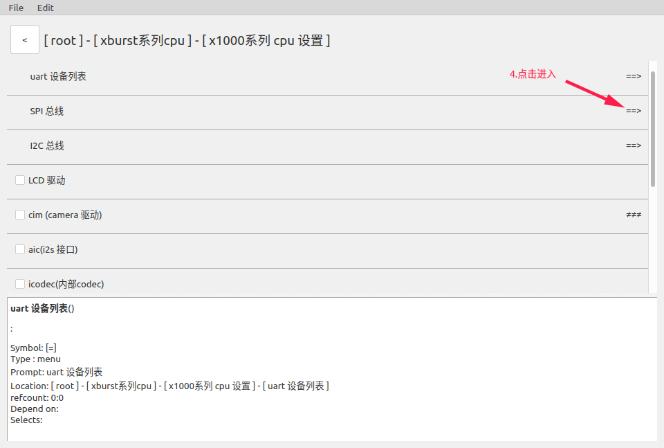

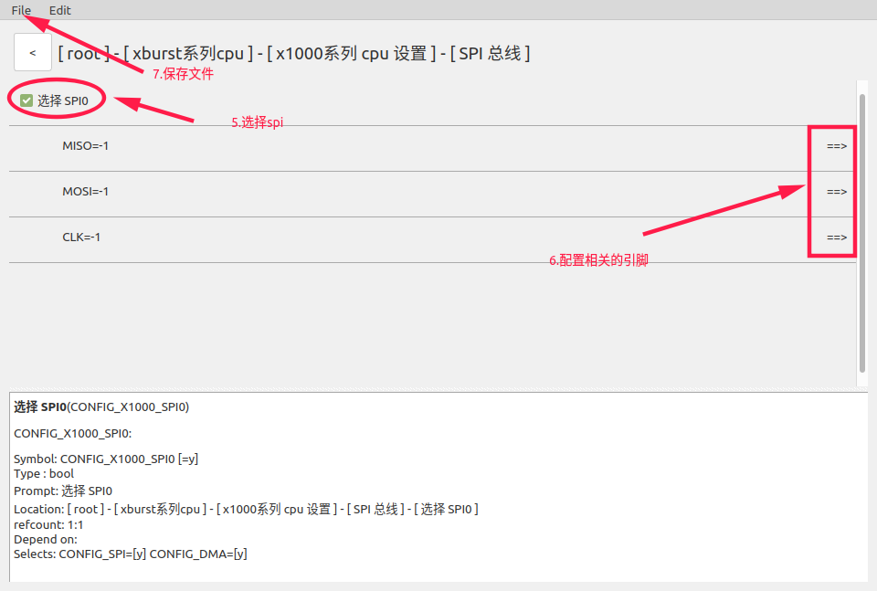


### 5.2.SPI使用流程

> 1.初始化spi，spi_init
>
> 2.定义spi配置信息结构体struct spi_config_data
>
> 3.配置spi结构体节点，spi_register
>
> 4.配置传送/接收结构体，struct spi_message
>
> 5.调用传输函数，spi_transfer
>
> 6.释放资源，spi_unregister
>
> 例子代码在example/driver/spi_example.c


### 5.3.SPI接口详解

#### 5.3.1.包含头文件

```c
#include <gpio.h>
#include <spi.h>
```

#### 5.3.2.中间参数详解

```c
SPI从设备句柄：
struct spi_device {                                                  /*spi设备句柄，不需要修改*/
             struct spi_config_data config;
             int spi_bus_id;
             struct spi_bus *spi_bus;
             struct list_head link;
};

spi_config_data结构体，包含SPI的配置信息：
struct spi_config_data {
             unsigned int id;                                                    /* SPI 控制器 ID */
             unsigned int cs_pin;                                           /* 指定作为 cs 脚的 GPIO */
             char *name;                                                            /* name 仅作为一个标识 */
             unsigned int clk_rate;                                         /* 时钟频率(默认为 1*1000*1000) */
             enum spi_cs_valid_level cs_valid_level;    /* 有效电平 */

             enum spi_data_endian tx_endian;
             enum spi_data_endian rx_endian;
             /* 数据传输的大小端模式选择,具体可选类型为 spi_data_endian 所定义的类型 */

             unsigned int bits_per_word;
             /* bits_per_word 代表数据的位宽.
                  例如:bits_per_word = 32 时,SPI传输过程中的最小数据单位为32bit. */

             unsigned int spi_pol;
             unsigned int spi_pha;
             /**
             * 极性 spi_pol :
             * 当spi_pol=0，在时钟空闲即无数据传输时,clk电平为低电平
             * 当spi_pol=1，在时钟空闲即无数据传输时,clk电平为高电平
             * 相位 spi_pha :
             * 当spi_pha=0，表示在第一个跳变沿开始传输数据，下一个跳变沿完成传输
             * 当spi_pha=1，表示在第二个跳变沿开始传输数据，下一个跳变沿完成传输
             */

             unsigned int loop_mode; /* 循环模式，可用于测试 */
};

spi_message结构体，包含传输过程的相关信息：
struct spi_message {
             /* NOTE:在君正平台下,dma传输需要保证发送和接收的个数相等,其他传输方式不作要求.
             * tlen 发送数据的个数.发送数据的大小＝发送数据的个数(tlen)＊数据对应的字节长度
             * rlen 接收数据的个数.接收数据的大小＝接收数据的个数(rlen)＊数据对应的字节长度
             *
             * bits_per_word 范围是 0～32；
             * 建议选择 8、16、32 作为 bits_per_word 的值，其余的可参考对应的驱动程序.
             * 当 bits_per_word = 8,对应的数据字节长度为1.
             * 当 bits_per_word = 16,对应的数据字节长度为2.
             * 当 bits_per_word = 32,对应的数据字节长度为4.
             */
             int tlen;
             int rlen;
             const void *tx_buf; /* 发送缓冲区 */
             void *rx_buf;             /* 接收缓冲区 */
             int use_dma;             /* 0:不使用dma方式传输； 1：使用dma方式传输 */
             int cs_change;           /* 传输结束时,改变cs的状态 */
};
```

#### 5.3.3.接口

```c
struct spi_device *spi_register(struct spi_config_data *config)
功能：SPI 设备注册
参数：struct spi_config_data *config          /*包含spi配置信息*/
返回值：struct spi_device                                 /*SPI从设备句柄*/
```

```c
void spi_transfer(struct spi_device *spi, struct spi_message *msg, int count);
功能：spi数据传输。
参数：
             struct spi_device *spi                               /*从设备句柄*/
             struct spi_message *msg                        /*msg 结构体,包含传输过程的相关信息*/
             int count                                                         /*一个msg中包含的transfer的数目*/
"注意：函数运行时会阻塞，在线程上下文使用的时候会引起任务调度，在中断上下文使用时会轮询阻塞。"
```

```c
void spi_unregister(struct spi_device *spi)
功能：释放SPI资源
参数：struct spi_device *spi                                /*从设备句柄*/
```

```
线程安全，不能在中断上下文使用：
        spi_register
        spi_transfer
        spi_unregister
```


## 6.GPIO_SPI


> 提示：使用gpio模拟spi。

### 6.1.GPIO_SPI配置流程

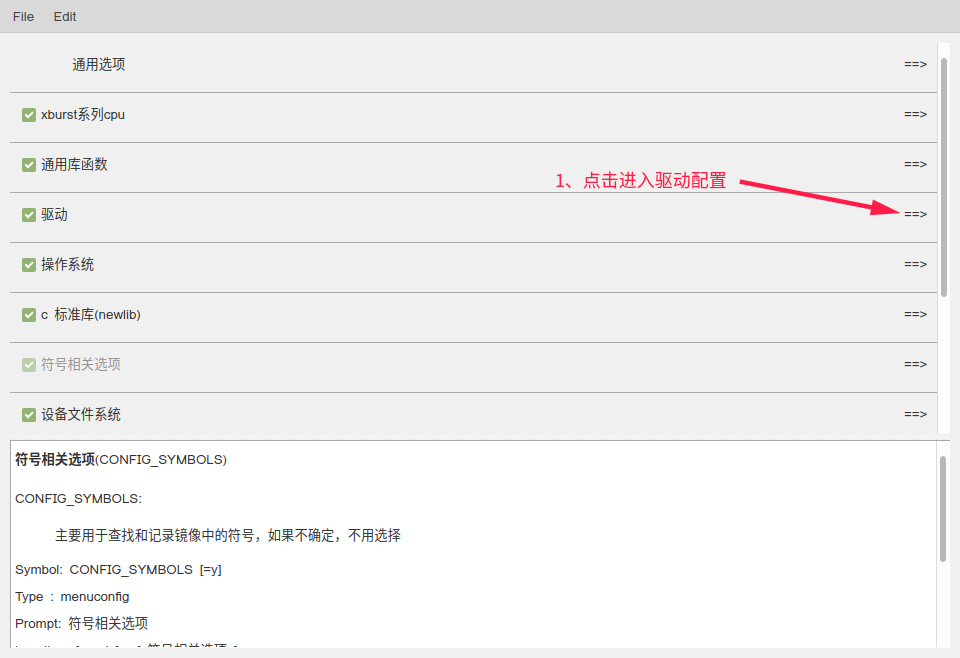

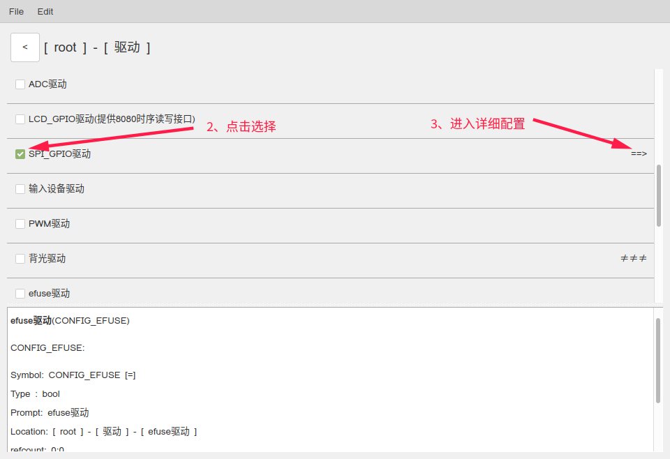

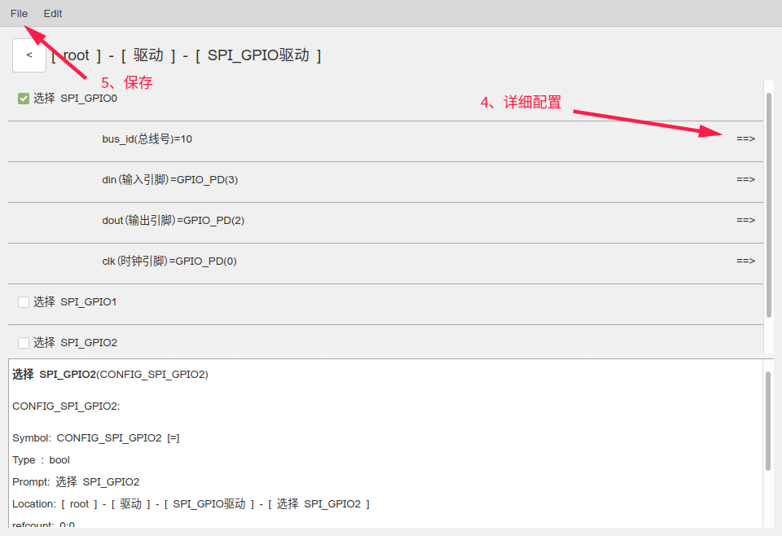


### 6.2.GPIO_SPI使用流程

> 1、配置好Iconfig，会自动注册SPI总线
> 注意：如果Iconfig配置总线不够，可以自己进行添加总线。
>              在调用注册函数前先调用gpio_spi_add_bus添加总线。
>              在调用注销后调用gpio_spi_remove_bus删除总线。


### 6.3.GPIO_SPI接口详解

#### 6.3.1.包含头文件

```c
#include <gpio_spi.h>
```

6.3.2.中间参数详解

```c
gpio_spi总线数据结构体：
struct gpio_spi_bus_data {
             int spi_bus_id;                  // 总线编号
             int gpio_dout;                   // 输出引脚
             int gpio_din;                      // 输入引脚
             int gpio_clk;                       // 时钟引脚
};
"注意：还有结构体参数请参考spi中间参数详解。"
```

#### 6.3.3.接口

```c
struct spi_bus* gpio_spi_add_bus(struct gpio_spi_bus_data *spi);
功能：向总线链表添加总线。节点
参数：struct gpio_spi_bus_data *spi              // 总线数据
返回值：总线信息结构体
```

```c
void gpio_spi_remove_bus(struct spi_bus *spi_bus);
功能：删除总线链表中总线节点。
参数：struct spi_bus *spi_bus                          // 总线信息
"注意：其他 注册 传输 注销api请参考适配器spi函数，此三个函数与适配器共用同一个接口。"
```

```
线程安全，可以在中断上下文使用：
        gpio_spi_add_bus
线程安全，不能在中断上下文使用：
        gpio_spi_remove_bus
```


## 7.Spi Flash Controller(SFC)


### 7.1.Sfc配置流程


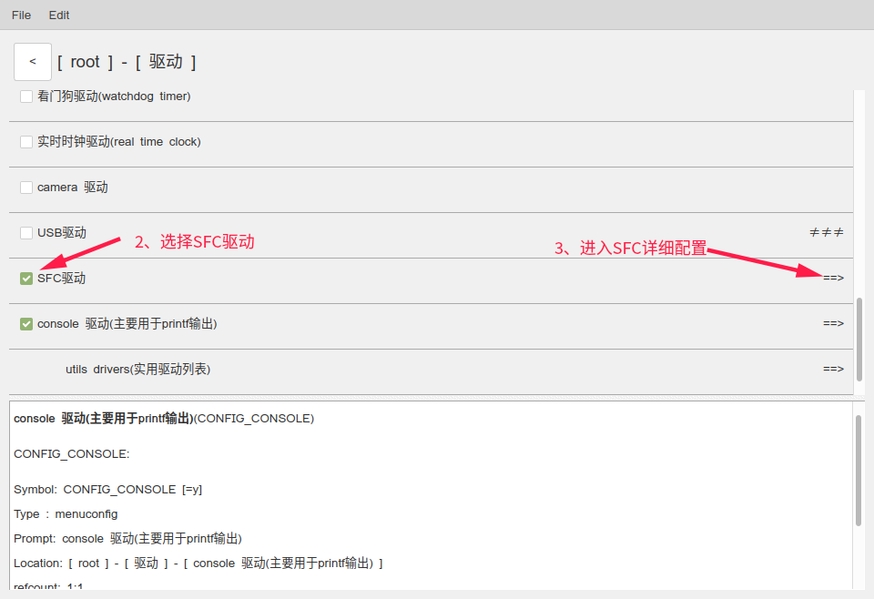

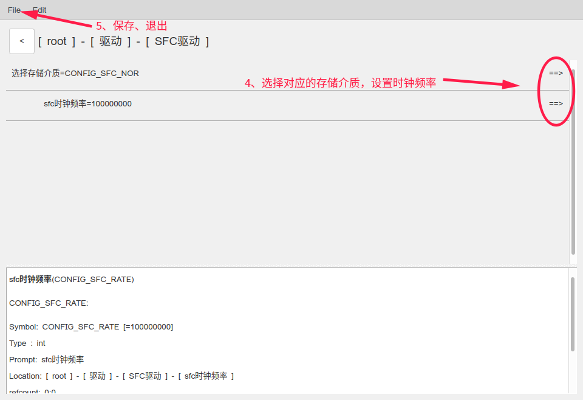


### 7.2.Sfc使用流程

> 写流程
>
> 1、调用sfc_init 初始化flash。
>
> 2、调用sfc_erase 擦除flash数据。
>
> 3、调用sfc_write 向flash写数据。
>
>  读流程
>
> 1、调用sfc_init 初始化flash。
>
> 2、调用sfc_read 读取flash数据。


### 7.3.Sfc接口详解

#### 7.3.1.包含头文件

```c
#include <driver/sfc.h>
```

#### 7.3.2.中间参数

```c
falsh类型枚举
enum sfc_flash_type {
             SFC_FLASH_TYPE_NOR,         // nor flash
             SFC_FLASH_TYPE_NAND,      // nand flash
};

falsh信息结构体
struct  flash_info{
              uint32_t sector_size;       // 扇区大小（单位：字节）
              uint32_t chip_size;           // flash 大小(单位：字节)
              uint32_t erase_size;         // 一次擦除大小（单位：字节）
};
```

#### 7.3.3.接口

```c
int sfc_read(uint32_t from, uint32_t len, uint8_t *buf);
功能：读取flash数据
参数：
             from                            // 起始地址（单位：字节）
             len                               // 读取数据长度（单位：字节）
             buf                              // 数据buf
返回值：成功读取数据的长度
```

```c
int sfc_write(uint32_t to, uint32_t len, const uint8_t *buf);
功能：向flash写数据
参数：
             to                                 // 起始地址（单位：字节）
             len                               // 读取数据长度（单位：字节）
             buf                               // 数据buf
返回值：成功写向flash写数据的长度。
"注意：进行写操作前必须先对写的扇区进行擦除操作。"
```

```c
int sfc_erase(uint32_t addr, uint32_t len);
功能：擦除flash数据
参数：
             addr                              // 起始地址（单位：字节）
             len                                 // 擦除数据长度（单位：字节）
返回值：
                 0     ：擦除成功
                 -22 ：擦除失败
"注意：擦除的长度和地址都必须以最小擦除大小对齐，否则擦除失败。"
```

```c
const struct flash_info * get_flash_info(void);
功能：获取flash信息
返回值：flash信息结构体
```

```
线程安全，可以在中断上下文使用：
        get_flash_info
线程安全，不能在中断上下文使用：
        sfc_read
        sfc_write
        sfc_erase
```


## 8.ADC


### 8.1.ADC配置流程

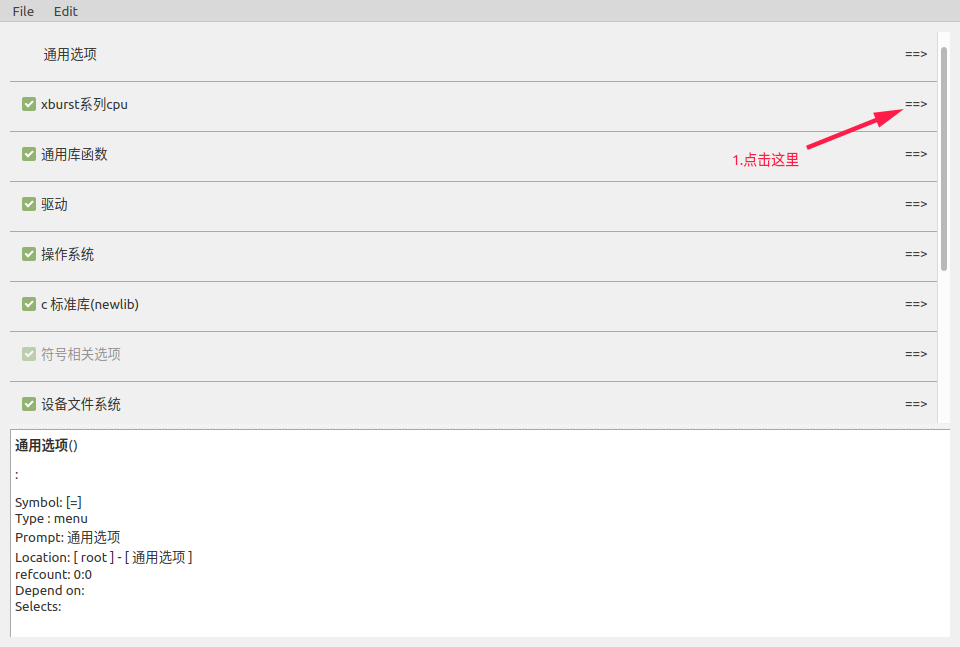

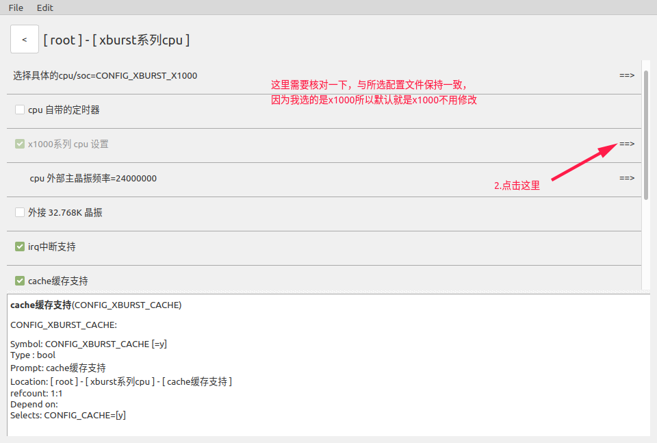

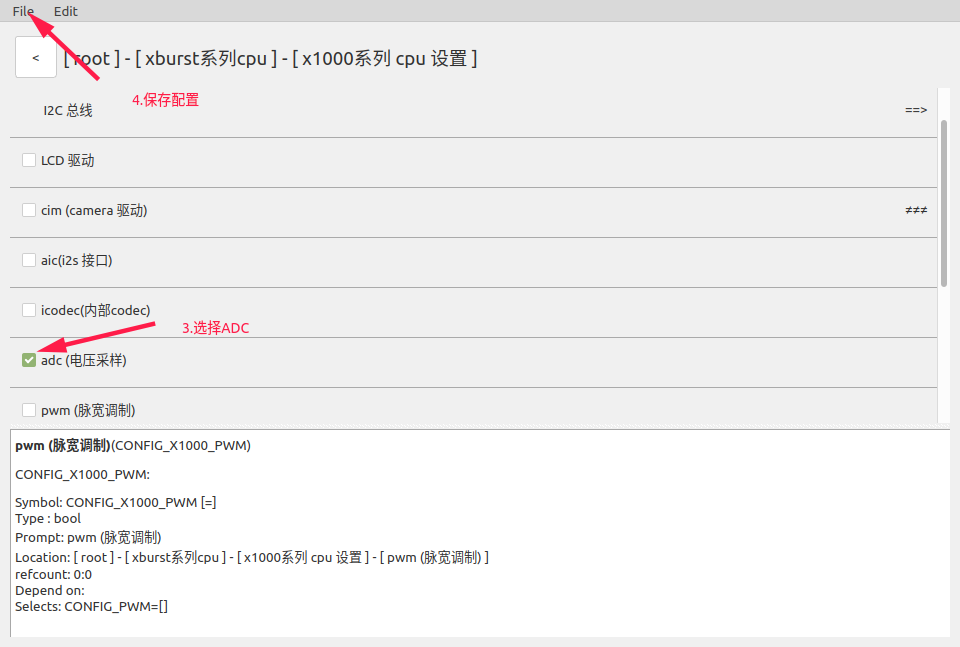


### 8.2.ADC使用流程

> 1.初始化adc，adc_init
>
> 2.读取adc数据，adc_read_data
>
> 3.释放adc，adc_deinit
>
> 例子代码在example/driver/adc_example.c
>
> --------------------------------------------------------------------
>
> 1.设置多通道采样时的中断回调，adc_set_irq_cb
>
> 2.开启多通道采样，adc_start_channels_sampling
>
> 3.多通道采样中使用，在回调中读取具体通道数据，adc_read_raw_channel_data
>
> 4.是否自动重启采样，adc_enable_repeat_sampling
>
> 例子代码在example/driver/adc_channels_sampling_example.c
>
> --------------------------------------------------------------------
>
> 1.打开 adc 轮询模式，adc_enable_poll_mode
>
> 2.关闭 adc 轮询模式，adc_disable_poll_mode
>
> 3.使用轮询模式采样 adc 通道的值，adc_read_data_poll
>
> --------------------------------------------------------------------
>
> 以下是x2600有的adc采集序列的功能
>
> 1.设置 adc 的工作时钟，最大可工作在30M，adc_set_clk
>
> 2.设置采样序列优先级, 可选值 0, 1, 2, 值越大优先级越高，adc_set_seq_priority
>
> 3.清除所有中断的标志位，adc_clean_all_interrupt_flag
>
> 4.使能 adc 功能，adc_power_on
>
> 5.失能 adc 功能，adc_power_off
>
> --------------------------------------------------------------------
>
> seq0: adc 的采集序列, 支持4个通道, 依次进行采样
>
> 1.使能 seq0 采样序列，adc_enable_seq0
>
> 2.失能 seq0 采样序列，adc_disable_seq0
>
> 3.触发 seq0 采样，adc_start_seq0
>
> 4.没有使能中断时，使用此函数查询 seq0 采样序列数据是否准备好，adc_poll_seq0_data_ready
>
> 5.读取 seq0 的采样序列的数据，adc_read_seq0_data
>
> --------------------------------------------------------------------
>
> seq1: adc 的采集序列, 最大支持16个通道, 依次进行采样
>
> 1.使能 seq1 采样序列，adc_enable_seq1
>
> 2.触发 seq1 的采样，adc_start_seq1
>
> 3.没有使能中断且使用了 dma 模式时，使用此函数查询 seq1 采样序列数据是否准备好，adc_dma_poll_seq1_data_ready
>
> 4.读取 dma 模式下当前 seq1 可读的采样序列的数据个数, 单位为byte，adc_dma_seq1_get_readable_size
>
> 5.读取 dma 模式下的 seq1 的采样序列的数据，adc_dma_seq1_read_data
>
> 6.没有使能中断时，使用此函数查询 seq1 采样序列数据是否准备好，adc_poll_seq1_data_ready
>
> 7.读取 seq1 的采样序列的数据，adc_read_seq1_data
>
> 8.失能 seq1 采样序列，adc_disable_seq1
>
> --------------------------------------------------------------------
> 
> seq2: adc 的采集序列, 最大支持8个通道, 依次进行采样
>
> 1.使能 seq2 采样序列，adc_enable_seq2
>
> 2.触发 seq2 的采样，adc_start_seq2
>
> 3.没有使能中断且使用了 dma 模式时，使用此函数查询 seq2 采样序列数据是否准备好，adc_dma_poll_seq2_data_ready
>
> 4.读取 dma 模式下当前 seq2 可读的采样序列的数据个数, 单位为byte，adc_dma_seq2_get_readable_size
>
> 5.读取 dma 模式下的 seq2 的采样序列的数据，adc_dma_seq2_read_data
>
> 6.没有使能中断时，使用此函数查询 seq2 采样序列数据是否准备好，adc_poll_seq2_data_ready
>
> 7.读取 seq2 的采样序列的数据，adc_read_seq2_data
>
> 8.失能 seq2 采样序列，adc_disable_seq2
>
> --------------------------------------------------------------------
>
> awd: analog watch dog, 所有通道支持看门狗功能(阈值模式), 输入电压高于或低于设定阈值时将触发中断
>
> 1.使能对应通道的 awd 功能，adc_enable_awd
>
> 2.失能对应通道的 awd 功能，adc_disable_awd
>
> 3.设置 awd 的中断回调函数，adc_set_awd_cb
>
> 例子代码在example/driver/x2600_adc_dma_example.c和x2600_adc_example.c


### 8.3.ADC接口详解

### 8.3.1.ADC包含头文件

```c
#include <adc.h>
```

#### 8.3.2.中间参数详解
```c
# 以下是x2600 adc的功能配置参数(详细功能概述见xburst2/soc-x2600/include/soc/adc.h)：

触发采集的方式
enum adc_trigger_type {
    adc_trigger_tcu0_half,
    adc_trigger_tcu0_full,
    adc_trigger_tcu1_half,
    adc_trigger_tcu1_full,
    adc_trigger_tcu2_half,
    adc_trigger_tcu2_full,
    adc_trigger_tcu3_half,
    adc_trigger_tcu3_full,
    adc_trigger_tcu4_half,
    adc_trigger_tcu4_full,
    adc_trigger_tcu5_half,
    adc_trigger_tcu5_full,
    adc_trigger_tcu6_half,
    adc_trigger_tcu6_full,
    adc_trigger_tcu7_half,
    adc_trigger_tcu7_full,
    adc_trigger_gpio_rising_edge,
    adc_trigger_gpio_falling_edge,
    adc_trigger_gpio_both_edge,
    adc_trigger_software,
};
```

```c
struct adc_seq0_config {
    unsigned char channel_cnt;  // adc 采样序列使用的adc 通道总数
    unsigned char channels[4];  // 采样序列依次的通道号
    /* 中断回调函数,当一个转换序列完成之后回调,回调中需要读取adc数据 */
    void (*irq_cb)(void);
};
```

```c
struct adc_seq1_config {
    /* 连续采样模式的计数时钟 = adc_clk / continus_clk_div; 最大值 2的24次方 */
    int continus_clk_div;
    /* 采样延时计数时钟 = adc_clk / delay_clk_div; 最大值 2的24次方 */
    int delay_clk_div;
    enum adc_trigger_type trigger;      // adc 采样触发类型
    unsigned char enable_channel_num;   // 使能采样通道号,保存在数据的12-15 4bit位
    unsigned char channel_cnt;          // adc 采样序列使用的adc 通道总数
    unsigned char channels[16];         // 采样序列依次的通道号
    /* 采样序列每个通道的延时, 单位是 adc delay clk */
    unsigned short channel_delays[16];

    unsigned char group_cnt;  // 连续采样模式下分组的个数,0表示不使能连续采样
    unsigned char groups[8];  // 分组模式依次对应每组通道的个数
    unsigned short group_delays[8]; // 每个分组转换完之后的延时, 单位是 adc cont clk

    void (*irq_cb)(void); // 中断回调函数,当一个转换序列完成之后回调,回调中需要读取adc数据

    unsigned int dma_mode; // 是否使用dma模式，非0为使用
    unsigned short *dma_buf; // dma接收数据的buf，要求cache对齐
    unsigned int dma_size; // dma buf的大小
};
```

```c
struct adc_seq2_config {
    /* 采样延时计数时钟 = adc_clk / delay_clk_div; 最大值 2的24次方 */
    int delay_clk_div;
    enum adc_trigger_type trigger;     // adc 采样触发类型
    unsigned char enable_channel_num;  // 使能采样通道号,保存在数据的12-15 4bit位
    unsigned char channel_cnt;         // adc 采样序列使用的adc 通道总数
    unsigned char channels[8];         // 采样序列依次的通道号
    unsigned char channel_delays[8];   // 采样序列每个通道的延时, 单位是 adc delay clk

    /* 中断回调函数,当一个转换序列完成之后回调,回调中需要读取adc数据 */
    void (*irq_cb)(void);

    unsigned int dma_mode; // 是否使用dma模式，非0为使用
    unsigned short *dma_buf; // dma接收数据的buf，要求cache对齐
    unsigned int dma_size; // dma buf的大小
};
```

```c
adc awd 功能的中断回调函数类型
/**
 * low_flags 保存低于 low_threshold 触发中断的通道 [0，15]
 * high_flags 保存高于 high_threshold 触发中断的通道 [0，15]
 */
typedef void (*adc_awd_cb)(unsigned short low_flags, unsigned short high_flags);
```

#### 8.3.3.接口

```c
void adc_init(void)
功能：初始化adc(使能adc时钟，初始化控制器，并申请adc中断)
```

```c
int adc_read_data(unsigned int channel)
功能：adc数据采样
参数：
             channel：通道(0:AUX0  1:AUX1  2:AUX2 ......)
返回值：
                 大于0                           ：采集数据
                 -ENODEV(-19)          ：没有发现设备
                 -ETIMEDOUT(-116)：超时
                 -EINVAC(-22)             ：超过通道数
"注意：实际电压=(采样数据/1024)*参考电压"
```

```c
void adc_deinit (void)
功能：释放adc资源(释放中断、释放adc)
```

```c
void adc_set_irq_cb(adc_irq_cb_t cb_func)
功能：设置多通道采样时的中断回调
参数：
                cb_func：需要在回调里读取数据
```

```c
void adc_start_channels_sampling(unsigned int channels)
功能：开启多通道采样
参数：
                channels：需要开启的通道，每位bit对应一个通道
```

```c
int adc_read_raw_channel_data(unsigned int channel)
功能：多通道采样中使用，在回调中读取具体通道数据
参数：
                channel：需要读取的通道
返回值：
                成功：返回采样值
                失败：返回-1
```

```c
void adc_enable_repeat_sampling(int enable)
功能：是否自动重启采样
参数：
                enable：是否开启自动重启采样
```

```c
void adc_enable_poll_mode(void)
功能：打开 adc 轮询模式
```

```c
void adc_disable_poll_mode(void)
功能：关闭 adc 轮询模式
```

```c
int adc_read_data_poll(unsigned int channel)
功能：使用轮询模式采样 adc 通道的值
参数：
                channel：需要读取的通道
返回值：
                成功：返回采样值
                失败：-EINVAL -- 超过通道数
```

以下是x2600 adc的接口：
```c
void adc_set_clk(int src_clk_rate, int div)
功能：设置 adc 工作时钟 adc_clk ，adc_clk = src_clk_rate/div，adc_clk最大为30M
参数：
                src_clk_rate：输入的源时钟
                div：分频系数
```

```c
void adc_set_seq_priority(
    char seq0_pri, char seq1_pri, char seq2_pri, int high_break_low)
功能：设置采样序列优先级, 可选值 0, 1, 2, 值越大优先级越高
参数：
                seq0_pri：seq0 的优先级
                seq1_pri：seq1 的优先级
                seq2_pri：seq2 的优先级
                high_break_low：表示低优先级序列未完成时是否可以被高优先级打断
                                1表示打断 0不打断
```

```c
void adc_clean_all_interrupt_flag(void)
功能：清除所有中断的标志位
```

```c
void adc_power_on(void)
功能：使能 adc 功能
```

```c
void adc_power_off(void)
功能：失能 adc 功能
```

```c
void adc_enable_seq0(struct adc_seq0_config *cfg)
功能：使能 seq0 采样序列
参数：
                cfg：seq0 的配置，详细信息见struct adc_seq0_config
```

```c
void adc_disable_seq0(struct adc_seq0_config *cfg)
功能：失能 seq0 采样序列
参数：
                cfg：seq0 的配置，详细信息见struct adc_seq0_config
```

```c
void adc_start_seq0(void)
功能：触发 seq0 采样
```

```c
int adc_poll_seq0_data_ready(void)
功能：配置里的irq_cb 为NULL时,使用此函数查询seq0采样序列数据是否准备好
返回值：
                返回1：数据已准备好
                返回0：数据尚未完成
```

```c
void adc_read_seq0_data(unsigned short *values, int len)
功能：读取 seq0 的采样序列的数据
参数：
                values：作为输出，数据将读取到该buf中
                len：buf的大小，数组大小必须是采样序列的长度/通道数
```

```c
void adc_enable_seq1(struct adc_seq1_config *cfg)
功能：使能 seq1 采样序列
参数：
                cfg：seq1 的配置，详细信息见struct adc_seq1_config
```

```c
void adc_start_seq1(void)
功能：trigger == adc_trigger_software 时,使用本函数触发 adc seq1 的采样
```

```c
int adc_dma_poll_seq1_data_ready(struct adc_seq1_config *cfg)
功能：irq_cb 为NULL, dma_mode 为1时, 使用此函数查询seq1采样序列数据是否准备好
参数：
                cfg：seq1 的配置
返回值：
                返回1：数据已准备好
                返回0：数据尚未完成
```

```c
int adc_dma_seq1_get_readable_size(struct adc_seq1_config *cfg)
功能：读取 dma 模式下当前 seq1 可读的采样序列的数据个数
参数：
                cfg：seq1 的配置
返回值：
                返回当前可读的数据量, 单位为byte
```

```c
unsigned int adc_dma_seq1_read_data(
        struct adc_seq1_config *cfg, unsigned short *data)
功能：读取 seq1 dma 模式下采样序列的数据
参数：
                cfg：seq1 的配置
                data：输出的数据buf
返回值：
                返回读到的采样序列的数据个数, 单位为byte
```

```c
int adc_poll_seq1_data_ready(void)
功能：irq_cb 为NULL时,使用此函数查询seq1采样序列数据是否准备好
返回值：
                返回1：数据已准备好
                返回0：数据尚未完成
```

```c
void adc_read_seq1_data(unsigned short *values, int len)
功能：读取 seq1 的采样序列的数据
参数：
                values：作为输出，数据将读取到该buf中
                len：buf的大小，数组大小必须是采样序列的长度/通道数
```

```c
void adc_disable_seq1(struct adc_seq1_config *cfg)
功能：失能 seq1 采样序列
参数：
                cfg：seq1 的配置
```

```c
void adc_enable_seq2(struct adc_seq2_config *cfg)
功能：使能 seq2 采样序列
参数：
                cfg：seq2 的配置，详细信息见struct adc_seq2_config
```

```c
void adc_start_seq2(void)
功能：trigger == adc_trigger_software 时,使用本函数触发 adc seq2 的采样
```

```c
int adc_dma_poll_seq2_data_ready(struct adc_seq2_config *cfg)
功能：irq_cb 为NULL, dma_mode 为1时, 使用此函数查询seq2采样序列数据是否准备好
参数：
                cfg：seq2 的配置
返回值：
                返回1：数据已准备好
                返回0：数据尚未完成
```

```c
int adc_dma_seq2_get_readable_size(struct adc_seq2_config *cfg)
功能：读取 dma 模式下当前 seq2 可读的采样序列的数据个数
参数：
                cfg：seq2 的配置
返回值：
                返回当前可读的数据量, 单位为byte
```

```c
unsigned int adc_dma_seq2_read_data(
        struct adc_seq2_config *cfg, unsigned short *data)
功能：读取 seq2 dma 模式下采样序列的数据
参数：
                cfg：seq2 的配置
                data：输出的数据buf
返回值：
                返回读到的采样序列的数据个数, 单位为byte
```

```c
int adc_poll_seq2_data_ready(void)
功能：irq_cb 为NULL时,使用此函数查询seq2采样序列数据是否准备好
返回值：
                返回1：数据已准备好
                返回0：数据尚未完成
```

```c
void adc_read_seq2_data(unsigned short *values, int len);
功能：读取 seq2 的采样序列的数据
参数：
                values：作为输出，数据将读取到该buf中
                len：buf的大小，数组大小必须是采样序列的长度/通道数
```

```c
void adc_disable_seq2(struct adc_seq2_config *cfg)
功能：失能 seq2 采样序列
参数：
                cfg：seq2 的配置
```

```c
void adc_enable_awd(int channel, int low_threshold, int high_threshold)
功能：使能对应通道的 awd 功能
      需要设置seqn采集所需通道，才能触发对应通道的 awd 功能，本身不具备采样功能
参数：
                channel：使能 awd 功能的通道
                low_threshold ：低阈值触发
                                对应通道的采样值 <= 该值时触发中断，-1 则不使能该功能
                high_threshold：高阈值触发
                                对应通道的采样值 >= 该值时触发中断，-1 则不使能该功能
```

```c
void adc_disable_awd(int channel)
功能：失能对应通道的 awd 功能
参数：
                channel：失能 awd 功能的通道
```

```c
void adc_set_awd_cb(adc_awd_cb cb)
功能：设置 awd 的中断回调函数，触发任意一个条件时进入中断，回调可以读取是哪个通道触发
参数：
                cb：中断回调函数，详细见 adc_awd_cb 函数的描述
```

```
线程安全，不能在中断上下文使用：
        adc_init
        adc_read_data
        adc_deinit
        adc_start_channels_sampling
```


## 9.WATCHDOG


### 9.1.Watchdog配置流程


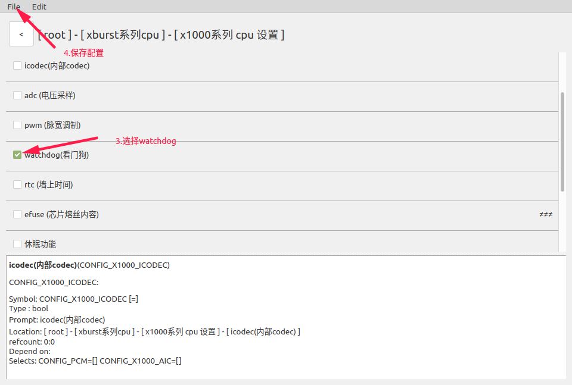


### 9.2.Watchdog使用流程

> 1.启动看门狗，设置看门狗的最长喂狗时间，wdt_start
>
> 2.喂看门狗，wdt_feed
>
> 例子代码在example/driver/watchdog_example.c


### 9.3.Watchdog接口详解

#### 9.3.1.包含头文件

```c
#include “watchdog.h”
```

#### 9.3.2.接口

```c
void wdt_start(unsigned long ms)
功能：启动看门狗（使能看门狗时钟，再设置看门狗的最长喂狗时间）
参数： unsigned long ms:设置最长喂狗时间(毫秒级： 1s=1000ms)
注意：仅支持在软件看门狗关闭情况下，调用本接口。否则就会引起kernel panic，会提示："WDT: watchdog is running ! "。
```

```c
void wdt_stop(void)
功能：关闭看门狗
"注意：仅支持在软件看门狗开启情况下，调用本接口。"
```

```c
void wdt_feed(void)
功能：喂看门狗(清空看门狗定时器计数器)
"注意：仅支持在软件看门狗开启情况下，调用本接口。"
```

```c
void reset(void)
功能：强制重启
```

```
线程安全并可在中断上下文使用：
        wdt_start
        wdt_stop
        wdt_feed
        reset
```


## 10.RTC


### 10.1.RTC配置流程


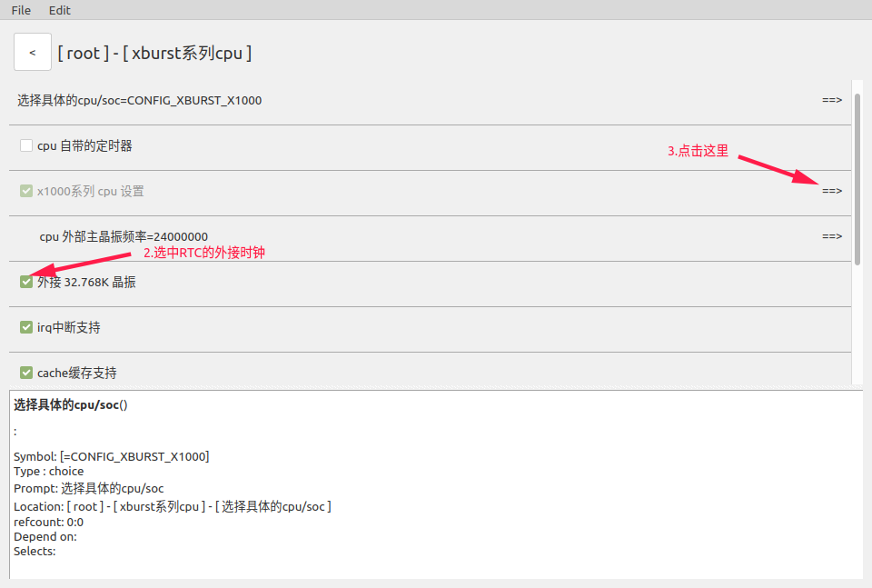

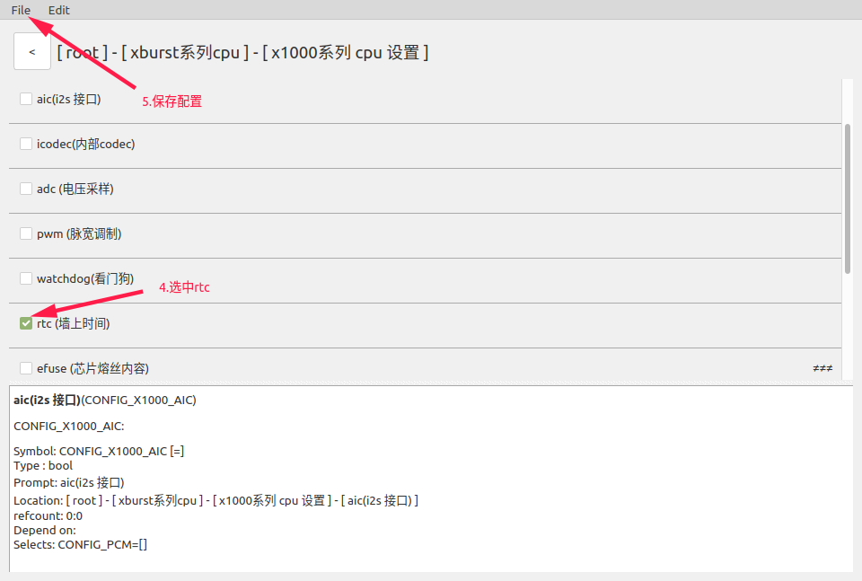


### 10.2.RTC启动流程

> 1.rtc_init         //初始化RTC
>
> 2.rtc_get_current_time  rtc_set_time      //函数设置和获取时间
>
> 例子代码在example/driver/rtc_example.c


### 10.3.RTC接口详解

#### 10.3.1.包含头文件

```c
#include <rtc.h>
```

#### 10.3.2.中间参数详解

```
RTC时间结构体
struct rtc_time {
             int tm_sec;         // 秒
             int tm_min;        // 分
             int tm_hour;      // 时
             int tm_mday;    // 日
             int tm_mon;      // 月
             int tm_year;       // 年
             int tm_wday;     // 周几
             int tm_yday;      // 在一年中的第几天
             int tm_isdst;      // 夏令时标识符，实行夏令时为正，不实行夏令时为0。
};
```

#### 10.3.3.接口

```c
void rtc_set_tm(struct rtc_time *tm)
功能：设置RTC时间
参数：*tm                // RTC时间结构体指针
```

```c
void rtc_get_current_tm(struct rtc_time *tm)
功能：获取当前RTC时间
参数：*tm                // RTC时间结构体指针
```

```c
void rtc_show_current_tm(struct rtc_time *tm)
功能：打印当前RTC时间
参数：*tm                 // RTC时间结构体指针
```

```c
void rtc_set_alarm(unsigned int sec, void (*rtc_cb)(void))
功能：设置RTC闹钟
参数：sec                    //设置闹钟时间，单位为秒
```

```
线程安全，不能在中断上下文使用：
        rtc_set_tm
        rtc_get_current_tm
        rtc_show_current_tm
        rtc_set_alarm
```


## 11.HRTIMER


> Hrtimer(高精度定时器)是基于Operating System Timer的systick时钟实现，没有个数上的限制。


### 11.1.Hrtimer配置流程

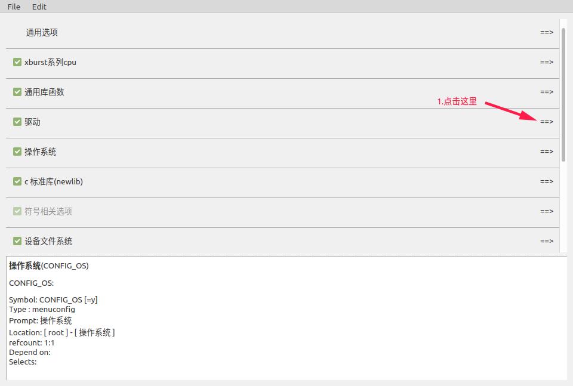

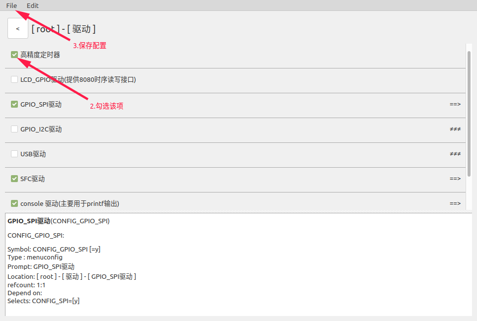


### 11.2.Hrtimer使用流程

> 1.初始化定时器               hrtimer_init
>
> 2.激活定时器                hrtimer_start
>
> 3.重新设置并激活定时器           hrtimer_restart
>
> 4.取消定时器                hrtimer_cancel
>
> 例子代码在example/driver/hrtimer_example.c


### 11.3.Hrtimer接口详解

#### 11.3.1.包含头文件

```c
#include "hrtimer.h"
```

#### 11.3.2.中间参数详解

```c
void (*function_handler)(struct hrtimer *)
功能：定时器计时回调函数
参数：
              timer：高精度定时器结构体
返回值：无
```

#### 11.3.3.接口

```c
void hrtimer_init(struct hrtimer *timer, void (*function_handler)(struct hrtimer *))
功能：初始化定时器结构体并设置回调函数
参数：
            timer：高精度定时器结构体
            function_handler：定时器回调函数
```

```c
int hrtimer_start(struct hrtimer *timer, uint64_t tim)
功能：激活定时器
参数：
            timer：高精度定时器结构体
            tim：从当前时间开始计时tim时间,单位us
                       timer->expires = tim + systick_get_time_us()
                       Systick_get_time_us函数用于获取当前时间
                       timer->expires为到期时间
返回值：
                0：表示激活成功
                1：重新激活已激活的定时器
```

```c
int hrtimer_start_at_expires(struct hrtimer *timer, uint64_t expires)
功能：设置到期时间并激活该定时器
参数：
            timer：高精度定时器结构体
            expires：到期时间，是绝对时间，定时器计时到该时间停止计时
返回值：
               0：表示激活成功
               1：重新激活已激活的定时器
```

```c
void hrtimer_restart(struct hrtimer *timer, uint64_t tim)
功能：重新设置并激活定时器，该函数只能在自身hrtimer处理程序回调上下文调用
参数：
            timer：高精度定时器结构体
            tim：从当前时间开始计时tim时间,单位us
                        timer->expires = tim + systick_get_time_us()
                        Systick_get_time_us函数用于获取当前时间
                        timer->expires为到期时间
```

```c
void hrtimer_restart_at_expires(struct hrtimer *timer, uint64_t expires)
功能：重新设置并激活定时器，指定到期时间，该函数只能在自身hrtimer处理程序回调上下文调用
参数：
           timer：高精度定时器结构体
           expires：到期时间，是绝对时间，定时器计时到该时间停止计时
```

```c
int hrtimer_try_to_cancel(struct hrtimer *timer)
功能：试图移除定时器
参数：timer：高精度定时器结构体
返回值：
                 0：定时器未激活
                 1：移除已激活的定时器
                -1：定时器正在执行回调函数所以无法停止
```

```c
int hrtimer_cancel(struct hrtimer *timer)
功能：移除定时器
参数：timer：高精度定时器结构体
返回值：
               0：定时器未激活
               1：移除已激活的定时器
```

```
线程安全，可以在中断上下文使用：
        hrtimer_init
        hrtimer_start
        hrtimer_start_at_expires
        hrtimer_try_to_cancel
线程安全，不能在中断上下文使用：
        hrtimer_cancel
 只能在自身中断函数调用：
         hrtimer_restart
         hrtimer_restart_at_expires
```


## 12.PWM


### 12.1.Pwm配置流程


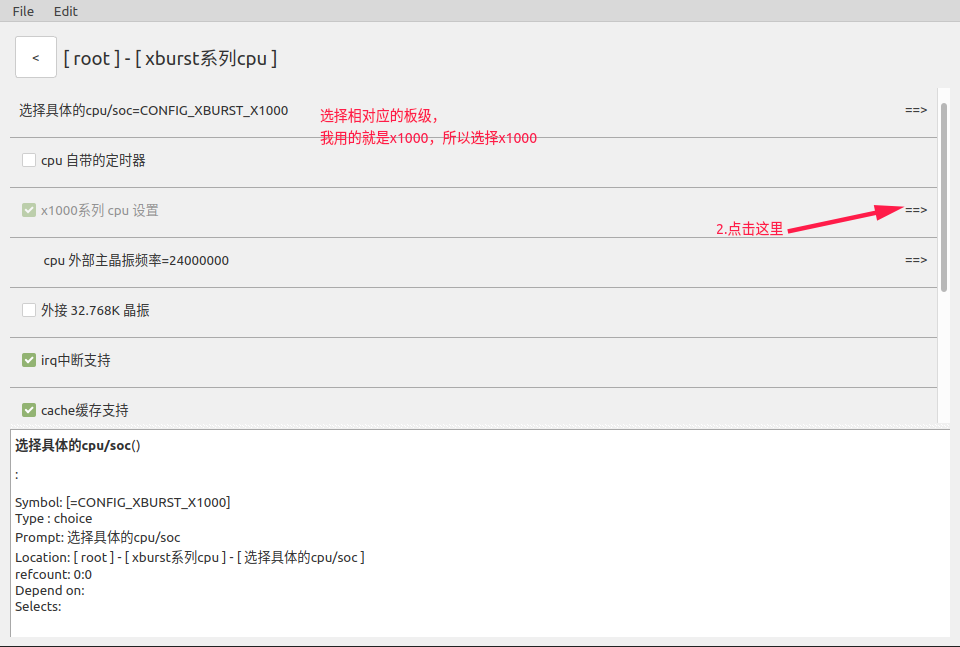

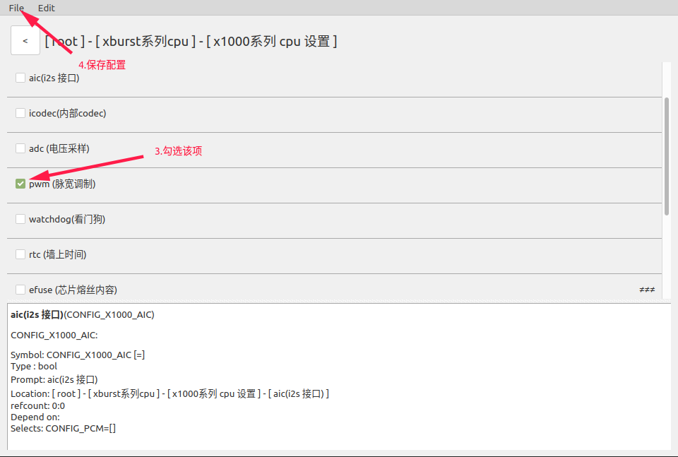


### 12.2.Pwm使用流程

> 1.申请 PWM 资源                   pwm_request
>
> 2.配置 PWM 信息                   pwm_config
>
> 3.设置 PWM 调制级数           pwm_set_level
>
> 4.释放 PWM 资源                    pwm_release
>
> 5.获取 PWM 调制后频率         pwm_get_freq
>
> 6.初始化 PWM 的 dma 模式      pwm_dma_init
>
> 7.使用 dma 模式更新 PWM 的频率        pwm_dma_update
>
> 8.停止dma的循环模式           pwm_dma_disable_loop
>
> 9.用于多通道同时开启时的使能          pwm_set_not_really_enable
>
> 10.用于多通道同时开启时的失能         pwm_set_not_really_disable
>
> 11.多通道同时开启             pwm_enable_channels
>
> 12.多通道同时关闭             pwm_disable_channels
>
> 例子代码在example/driver/pwm_example.c


### 12.3.Pwm接口详解

#### 12.3.1.包含头文件

```c
#include <gpio.h>
#include <pwm.h>
```

#### 12.3.2.中间参数详解

```c
PWM配置结构体
struct pwm_config_data {
    enum pwm_shutdown_mode shutdown_mode;  // 设置PWM波停止后的模式
    enum pwm_idle_level idle_level;  // 空闲电平
    enum pwm_accuracy_priority accuracy_priority;  // 设置频率精度和级数精度优先级
    char *clk_id;  //指定时钟源ID
    unsigned long freq;  // 频率
    unsigned long levels;  // PWM调制的级数
};
```

```c
PWM波停止后的模式枚举
enum pwm_shutdown_mode {
    PWM_graceful_shutdown,  // pwm停止输出时,尽量保证pwm的信号结尾是一个完整的周期
    PWM_abrupt_shutdown,  // pwm停止输出时,立刻将pwm设置成空闲时电平
};
```

```c
空闲电平枚举
enum pwm_idle_level {
    PWM_idle_low,  // pwm 空闲时电平为低
    PWM_idle_high,  // pwm 空闲时电平为高
};
```

```c
频率精度和级数精度优先级枚举
enum pwm_accuracy_priority {
    PWM_accuracy_freq_first,  // 优先满足pwm的目标频率的精度,级数可能不准确
    PWM_accuracy_levels_first,  // 优先满足pwm的级数设置,pwm频率可能不准确
};
```

```c
PWM dma 模式的配置结构体
struct pwm_dma_config {
    enum pwm_idle_level idle_level;  // 空闲电平
    enum pwm_dma_start_level start_level;  // 起始电平
    /*dma 回调函数，该参数为 NULL 时使用默认回调，为避免指针异常必须进行初始化
      仅在多通道同时开启且为dma非loop模式下时，可选择使用该函数，平常使用赋值为NULL*/
    void (*dma_complete_cb)(void *data);
};
```

```c
PWM dma 模式的数据信息
struct pwm_dma_data {
    struct pwm_data *data;
    unsigned int data_count;
    unsigned int dma_loop;
};
```

```c
dma 模式的起始电平枚举
enum pwm_dma_start_level {
    PWM_start_low,   /* pwm dma模式的起始电平为低 */
    PWM_start_high,  /* pwm dma模式的起始电平为高 */
};
```

```c
dma 模式需要产生的高低电平个数
struct pwm_data {
    /* 低电平个数 */
    unsigned low:16;
    /* 高电平个数 */
    unsigned high:16;
};
```

```c
需要确保 dma 数据的高低电平不能有零计数，否则需要手动把该宏定义打开
#define PWM_CHECK_DMA_DATA
```

#### 12.3.3.接口

```c
int pwm_request(int gpio, const char *name)
功能：申请 PWM 资源
参数：
                gpio：指定 GPIO 号
                name：PWM 名称
返回值：
                成功：返回申请的 PWM 通道号
                失败：负值
```

```c
int pwm_config(int ch, struct pwm_config_data* config)
功能：设置 PWM 信息
参数：
                ch：PWM 通道号
                config：PWM 配置数据
返回值：
                成功 ： 0
                失败 ： 非0
```

```c
void pwm_release(int ch)
功能：释放 PWM 资源
参数：
                ch：PWM 通道号
```

```c
void pwm_set_level(int ch, unsigned long level)
功能：设置 PWM 调制级数
参数：
                ch：PWM 通道号
                level：pwm 调制级数，即一个周期内非空闲电平长度
```

```c
unsigned long pwm_get_freq(int ch)
功能：获取当前已设置的时钟频率，并将其返回
参数：
                ch：PWM 通道号
返回值：
                获取 PWM 最终调制后的频率
```

```c
int pwm_dma_init(int id, struct pwm_dma_config *dma_config)
功能：初始化 PWM 的 dma 模式
参数：
                id：PWM 通道号
                dma_config：PWM dma 模式的配置信息
返回值：
                成功 ： 返回 dma 模式频率
                失败 ： 返回 -1
```

```c
int pwm_dma_update(int id, struct pwm_dma_data *dma_data)
功能：使用 dma 模式连续更新 PWM 的频率
      普通dma模式: 函数会阻塞到 dma 数据全部转换成对应pwm输出(多通道同时开启模式下不阻塞)
      循环dma模式：函数不会阻塞，需要调用pwm2_dma_disable_loop停止dma
参数：
                id：PWM 通道号
                dma_data：PWM dma 模式需要输出的数据
返回值：
                成功 ： 返回 0
                失败 ： 返回 -1
```

```c
int pwm_dma_disable_loop(int id)
功能：停止 dma 的循环模式
参数：
                id：PWM 通道号
返回值：
                成功 ： 返回 0
                失败 ： 返回 -1
```

```c
void pwm_set_not_really_enable(int id, int enable)
功能：预初始化功能的使(失)能，使能后在调用pwm_enable_channels不会开始工作
      即当使用该功能时，调用pwm_set_level和pwm_dma_update只是设置，不会工作
      只有当调用pwm_enable_channels时才会输出波形
      pwm dma的非loop模式下，需要知道是否完成dma传输的话
      要在pwm_dma_init时传入dma_config->dma_complete_cb
参数：
                id：PWM 通道号
                enable：是否使用
```

```c
void pwm_set_not_really_disable(int id, int enable)
功能：使能后在输出过程中不完全关闭pwm的功能，保证在下次使用时相位的一致性
      直接调用pwm_release依然会关闭pwm功能，过程中将占空比设为0或100时不会关闭pwm
      与上面的函数功能并不成对
参数：
                id：PWM 通道号
                enable：是否使用
```

```c
void pwm_enable_channels(unsigned int channels)
功能：多通道同时开启
参数：
                channels：需要启动的通道，每位bit对应通道号
```

```c
void pwm_disable_channels(unsigned int channels)
功能：多通道同时关闭
参数：
                channels：需要关闭的通道，每位bit对应通道号
```

```
线程安全，可以在中断上下文使用：
        pwm_request
        pwm_config
        pwm_release
        pwm_set_level
        pwm_get_freq
        pwm_dma_init
        pwm_dma_update(仅loop模式下可以)
        pwm_dma_disable_loop
        pwm_set_not_really_enable
        pwm_set_not_really_disable
        pwm_enable_channels
        pwm_disable_channels
```


## 13.EFUSE


### 13.1.EFUSE配置流程

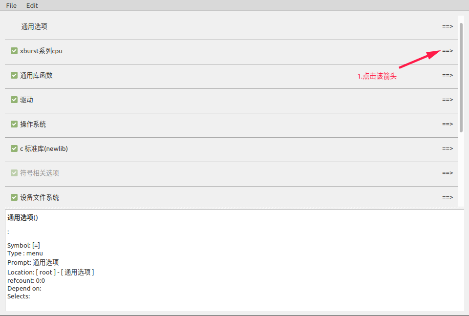

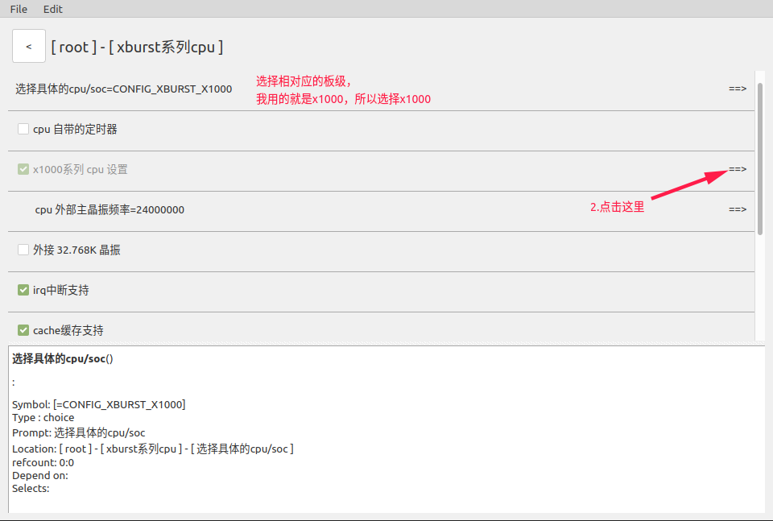

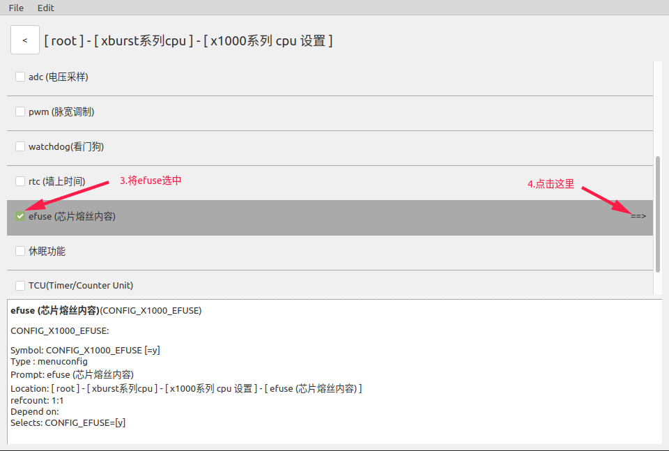

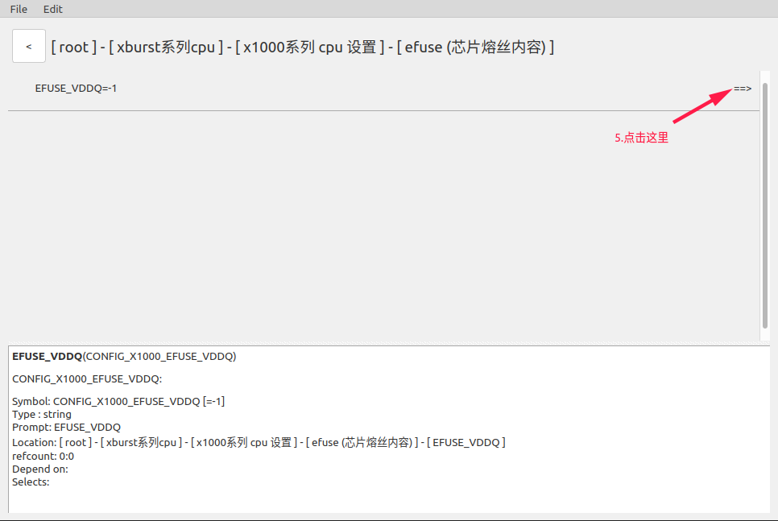

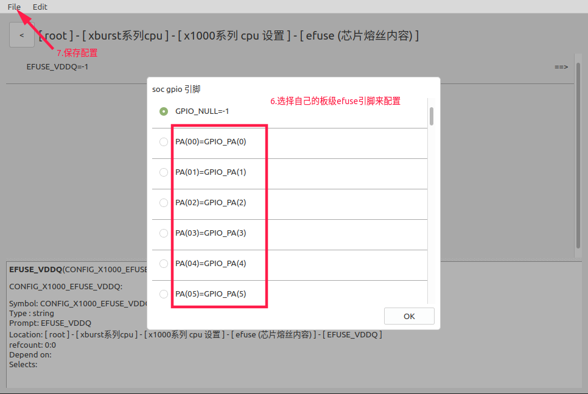


### 13.2.EFUSE使用流程

> 1.调用efuse_init初始化EFUSE。
>
> 2.使用efuse_write efuse_read进行读写。
>
> 例子代码在example/driver/efuse_example.c


### 13.3.EFUSE接口详解

#### 13.3.1.包含头文件

```c
#include <efuse.h>
```

#### 13.3.2.中间参数详解

```c
x1830与x1520的EFUSE 数据段id
enum segment_id {
             CHIP_ID,                            //存放芯片ID
             USER_ID,                           //存放使用者ID
             SARADC_CAL_DAT,       //存放校准数据
             TRIM_DATA,                     //存放修剪数据
             PROGRAM_PROTECT, //设置段保护位
             CPU_ID,                             //CPU ID
             SPECIAL_USE,                //保留给君正公司使用
             CUSTOMER_RESV,        //保留给客户使用
};
X1000的EFUSE 数据段id
enum segment_id {
             CHIP_ID,                         //存放芯片ID
             RANDOM_NUM,           //存放随机数字
             CUSTOMER_ID,            //使用者ID
             PROTECT_BIT,              //设置保护位
             ROOT_KEY,                    //root用户密钥
             CHIP_KEY,                      //存放芯片密钥
             USER_KEY,                     //存放用户密钥
             NKU,
};
efuse 段信息结构体
struct seg_info {
             int efuse_seg_cnt;                          //段的数量
             const char **seg_name;              //段的名称
             const unsigned int *seg_size;    //段的大小
};
```

#### 13.3.3.接口

```c
int efuse_write(enum segment_id seg_id, unsigned char *buf, int start, int size)
功能：efuse 写函数
参数：
             enum segment_id seg_id         //待写入的数据段的ID
             unsigned int *buf                         //待写入的数据
             int start                                             //段内偏移地址
             int len                                                //待写入数据的长度
返回值：
                返回值为0：正常退出
                其它值       ：异常退出
"注意：任何段的任一位一旦被写入了1将永远为1，写入0可则不影响下一次写操作。"
```

```c
int efuse_write_segment(enum segment_id seg_id, unsigned char *buf, int len)
功能：efuse 写整段函数
参数：
             enum segment_id seg_id         //待写入的数据段的ID
             unsigned int *buf                         //待写入的数据
             int len                                                //待写入数据的长度
返回值：
                返回值为0：正常退出
                其它值       ：异常退出
"注意：任何段的任一位一旦被写入了1将永远为1，写入0可则不影响下一次写操作。"
```

```c
int efuse_read(enum segment_id seg_id, unsigned char *buf, int start, int size)
功能：efuse 读函数
参数：
             enum segment_id seg_id         //待读取的数据段的ID
             unsigned int *buf                         //读到的数据
             int start                                             //段内偏移地址
             int len                                                //读到的数据的长度
返回值：
                返回值为0：正常退出
                其它值       ：异常退出
```

```c
int efuse_read_segment(enum segment_id seg_id, unsigned char *buf, int len)
功能：efuse 读整段函数
参数：
             enum segment_id seg_id         //待读取的数据段的ID
             unsigned int *buf                         //读到的数据
             int len                                                //读到的数据的长度
返回值：
                 返回值为0：正常退出
                 其它值       ：异常退出
```

```
线程安全，不能在中断上下文使用：
        efuse_write
        efuse_read
        efuse_write_segment
        efuse_read_segment
```


## 14.USB DEVICE


### 14.1.USB DEVICE配置流程

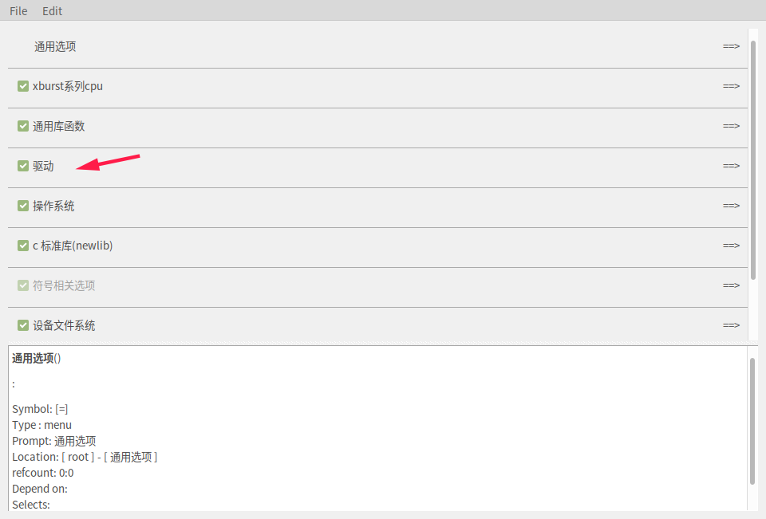

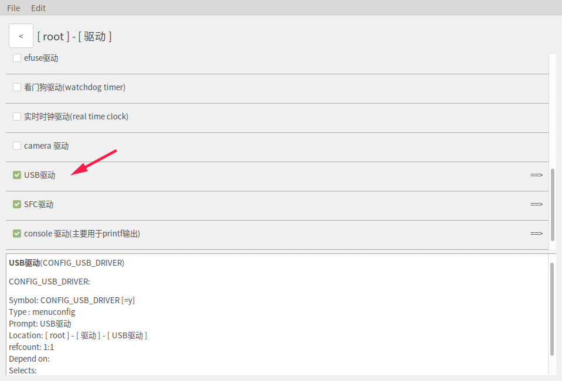

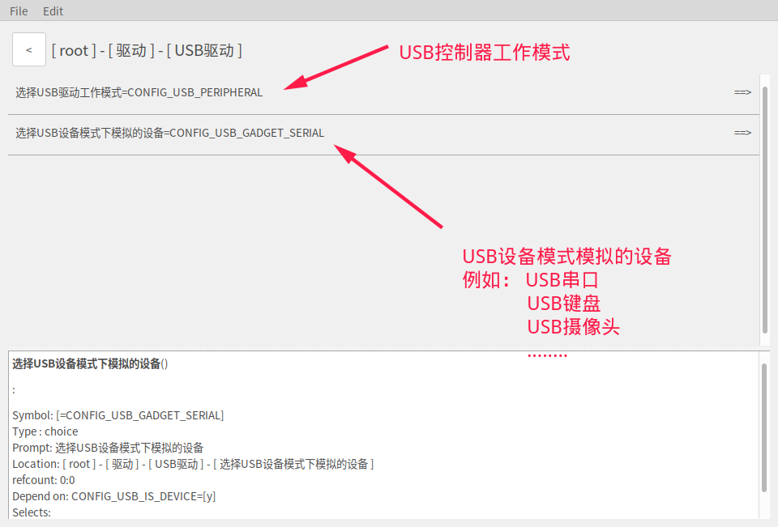


### 14.2.USB CODE接口详解

#### 14.2.1.包含头文件

```c
#include <usb/usb.h>
```

#### 14.2.2.接口

```c
int usb_core_init(void)
功能：初始化USB控制器，USB底层驱动
```

```c
void usb_core_exit(void)
功能：关闭USB控制器 （"必须注销设备驱动才能关闭控制器"）
```

```c
void usb_core_suspend(void)
功能：挂起USB控制器（"可以在使用过程中挂起"）
```

```c
void usb_core_resume(void)
功能：USB控制器从挂起模式恢复
```

```
非线程安全，可以中断上下文使用：（不建议用户直接调用，默认初始化有调用）
        usb_core_init
        usb_core_exit
        usb_core_suspend
        usb_core_resume
```


### 14.3.USB HID使用流程

> 1．初始化usb控制器             usb_core_init
>
> 2．注册usb hid驱动               gadget_hid_init
>
> 3．等待usb连接                       gadget_hid_wait_connect
>
> 4．hid数据交互                        gadget_hid_read         gadget_hid_write
>
> 5．usb休眠或唤醒                   usb_core_suspend       usb_core_resume
>
> 6．卸载usb hid驱动                gadget_hid_cleanup
>
> 7．释放usb 驱动                       usb_core_exit
>
> 例子代码在example/usb/device/gadget_hid_keyboard.c

#### 14.3.1.USB HID接口详解

##### 14.3.1.1.包含头文件

```c
#include <usb/gadget_hid.h>
```

##### 14.3.1.2.中间参数详解

```c
typedef void (*connect_callback_t)(int connect)
功能：USB键盘链接断开回调函数
参数：connect
                                1：USB链接
                                0：USB断开链接

hid功能结构体:
struct hid_report_descriptor {
             uint8_t     subclass;                                        //引导协议。1：引导接口子类(在BIOS下就启动)
                                                                                             //                       0：没有子类
                                                                                             //                       2~255：保留
             uint8_t     protocol;                                         //接口遵循的协议。0:无 1:键盘 2:鼠标 3~255保留
             unsigned short      report_length;            //每次传输的字节数(和报表(*report_desc)输入字节数必须相等)
             unsigned short      report_desc_length;//报表的长度
             const uint8_t     *report_desc;                   //hid报表
};

供应商和产品ID结构体:
struct gadget_id {
             uint16_t    vendor_id;          //供应商id
             uint16_t    product_id;         //产品id
};
```

##### 14.3.1.3.接口

```c
int gadget_hid_init(const struct gadget_id *id, const struct hid_report_descriptor *report, connect_callback_t connect_cb)
功能：注册USB 键盘驱动，申请数据缓存区
参数：
              id                             // 供应商和产品ID结构体
              report                    // hid功能结构体
              connect_cb         // 连接断开回调函数（不需要时可以设在为NULL）
返回值：
                成功： 0
                失败： 负数错误代码
```

```c
void gadget_hid_cleanup(void)
功能：注销USB键盘驱动
"注意：函数可能会引起阻塞，不能在中断上下文使用。和gadget_hid_init配对使用，功能相反。"
```

```c
int gadget_hid_read(uint8_t *buffer, uint32_t count, uint8_t block, uint32_t timeout_ms)
功能：读取USB主机下发的数据
参数：
              buffer                // 接收数据
              count                // 接收数据大小
              block                // 当接收缓存区没有数据时，是否阻塞到有数据接收
                                          //  1：阻塞接收
                                          //  0：不阻塞接收
               timeout_ms  // 阻塞超时时间 单位：毫秒
                                           //需要一直阻塞不超时，使用THREAD_COND_TIMEOUT_NO_LIMIT_MS
返回值：
                  成功：读取到的数据个数
                  失败：小于零    常见错误处理如下：
                                                         -ENODEV               没有注册USB键盘驱动
                                                         -ENOLINK              USB线没有连接，需要"gadget_hid_wait_connect"
                                                         -EAGAIN                 非阻塞模式下缓冲区没有数据可读
                                                         -ETIMEDOUT        阻塞模式下等待时间超时
```

```c
int gadget_hid_write(const uint8_t *buffer, uint32_t count, uint8_t block, uint32_t timeout_ms)
功能：发送USB数据到主机
参数：
              buffer                    // 发送数据
              count                     // 发送数据大小
              block                     // 当发送缓存区已满，是否阻塞到有数据发送
                                              //  1：阻塞发送
                                              //  0：不阻塞发送
               timeout_ms      //   阻塞超时时间 单位：毫秒
                                              //   需要一直阻塞不超时，使用THREAD_COND_TIMEOUT_NO_LIMIT_MS
返回值：
                  成功：发送数据的个数
                  失败：小于零     常见错误处理如下 ：
                                                         -ENODEV              没有注册USB键盘驱动
                                                         -ENOLINK             USB线没有连接，需要"gadget_hid_wait_connect"
                                                         -EAGAIN                非阻塞模式下,写缓冲区已满
                                                         -ETIMEDOUT       阻塞模式下等待时间超时
"注意：HID设备为键盘时，按键事件发送按下后需要发送按键释放事件，不然PC会认为按键一直按下（全零数据包为按键释放）"
```

```c
int gadget_hid_get_connect_status(void)
功能：获取USB线当前的链路状态
返回值：
                成功： 1为USB已连接， 0为USB断开连接
                失败： 小于零    常见错误处理如下：
                                                       -ENODEV               没有注册USB键盘驱动
```

```c
int gadget_hid_wait_connect(uint32_t timeout_ms)
功能：阻塞线程到USB连接
参数：timeout_ms   // 阻塞超时时间 单位：毫秒
                                          //  需要一直阻塞不超时，使用THREAD_COND_TIMEOUT_NO_LIMIT_MS
返回值：
                 成功： 0
                 失败： 小于零    常见错误处理如下：
                                                          -ENODEV           没有注册USB键盘驱动
                                                          -ETIMEDOUT    阻塞模式下等待时间超时
```

```
线程安全，可以中断上下文使用：
        gadget_hid_init
        gadget_hid_get_connect_status
线程安全，不能在中断上下文使用：
        gadget_hid_cleanup
        gadget_hid_wait_connect
线程安全，阻塞模式不能在中断上下文使用：
线程安全，非阻塞模式可以在中断上下文使用：
        gadget_hid_read
        gadget_hid_write
```


### 14.4.USB hid和矩阵键盘应用配置和使用流程

> 1.打开矩阵键盘驱动    CONFIG_MATRIX_KEY
>
> 2.打开usb hid驱动       CONFIG_USB_GADGET_HID
>
> 例子代码在example/usb/device/gadget_hid_matrix_keyboard.c
>
> 该例子代码内所使用的接口和键值在example/usb/device/hid_key_event.c和example/usb/device/hid_key_event.h
>
> 使用该应用需要将hid_key_event.c编译到。


### 14.5.USB CDC串口使用流程

> 1．初始化usb控制器                         usb_core_init
>
> 2．注册usb 串口驱动                        gadget_serial_init
>
> 3．等待usb连接                                  gadget_serial_wait_connect
>
> 4．串口数据交互                                 gadget_serial_read           gadget_serial_write
>
> 5．usb休眠或唤醒                              usb_core_suspend            usb_core_resume
>
> 6．卸载usb 串口驱动                         gadget_serial_cleanup
>
> 7．释放usb 驱动                                  usb_core_exit
>
> 例子代码在example/usb/device/gadget_cdc_serial.c


#### 14.5.1.USB CDC接口详解

##### 14.5.1.1.包含头文件

```c
#include <usb/gadget_serial.h>
```

##### 14.5.1.2.中间参数详解

```c
typedef void (*connect_callback_t)(int connect)
功能：USB串口链接断开回调函数
参数：connect
                               1：USB链接
                               0：USB断开链接

typedef void (*serial_param_callback_t)(struct usb_cdc_serial_param *param)
功能：USB串口参数被修改时的回调函数
参数：param                                               //串口参数结构体

供应商和产品ID结构体:
struct gadget_id {
             uint16_t    vendor_id;                   //供应商id
             uint16_t    product_id;                 //产品id
};

串口参数结构体:
struct usb_cdc_serial_param {
             u32    dwDTERate;                         //波特率
             u8    bCharFormat;                        //字符格式
             u8    bParityType;                           //奇偶类型
             u8    bDataBits;                                //数据位
};
```

##### 14.5.1.3.接口

```c
int gadget_serial_init(const struct gadget_id *id, const struct usb_cdc_serial_param *param, connect_callback_cb connect_cb, serial_param_callback_t serial_cb)
功能：注册USB 串口驱动，申请数据缓存区
参数：
              id                                 // 供应商和产品ID结构体
              param                        // 串口参数结构体
              connect_cb             // 连接断开回调函数（不需要时可以设在为NULL）
              serial_cb                  // USB串口参数被修改时的回调函数（不需要时可以设在为NULL）
返回值：
                 成功：0
                 失败：负数错误代码
```

```c
void gadget_serial_cleanup(void)
功能：注销USB串口驱动
注意：函数可能会引起阻塞，不能在中断上下文使用。和gadget_serial_init配对使用，功能相反。
```

```c
int gadget_serial_read(uint8_t *buf, uint32_t count, uint8_t block, uint32_t timeout_ms)
功能：读取USB主机下发的串口数据
参数：
              buf                     // 接收数据缓存区
              count                // 接收数据缓存区大小
              block                 // 当接收缓存区没有数据时，是否阻塞到有数据接收
                                           // 1：阻塞接收      0：不阻塞接收
               timeout_ms   // 阻塞超时时间 单位：毫秒
                                            // 需要一直阻塞不超时，使用THREAD_COND_TIMEOUT_NO_LIMIT_MS
返回值：
                  成功：读取到的数据个数
                  失败：小于零  常见错误处理如下：
                                                         -ENODEV           没有注册USB串口驱动
                                                         -ENOLINK          USB线没有连接，需要"gadget_serial_wait_connect"
                                                         -EAGAIN             非阻塞模式下缓冲区没有数据可读
                                                         -ETIMEDOUT    阻塞模式下等待时间超时
```

```c
int gadget_serial_write(const uint8_t *buf, uint32_t count, uint32_t block, uint32_t timeout_ms)
功能：发送串口数据给USB主机
参数：
              buf                      // 需要发送的数据
              count                 // 发送数据大小
              block                  // 当发送缓存区没有空间时，是否阻塞到数据添加到发送缓存
                                           // 1：阻塞发送       0：不阻塞发送
              timeout_ms    // 阻塞超时时间 单位：毫秒
                                           // 需要一直阻塞不超时，使用THREAD_COND_TIMEOUT_NO_LIMIT_MS
返回值：
                  成功：发送数据个数
                  失败：小于零    常见错误处理如下：
                                                          -ENODEV              没有注册USB串口驱动
                                                          -ENOLINK             USB线没有连接，需要"gadget_serial_wait_connect"
                                                          -EAGAIN                非阻塞模式下发送缓存区没有空间存放发送数据
                                                          -ETIMEDOUT       阻塞模式下等待时间超时
```

```c
int gadget_serial_flush_chars(uint32_t timeout_ms)

功能：阻塞等待所有数据发送完成
参数：timeout_ms      // 阻塞超时时间 单位：毫秒
                                             // 需要一直阻塞不超时，使用THREAD_COND_TIMEOUT_NO_LIMIT_MS
返回值：
                  成功：0
                  失败：小于零      常见错误处理如下：
                                                          -ENODEV             没有注册USB串口驱动
                                                          -ENOLINK            USB线没有连接，需要"gadget_serial_wait_connect"
                                                          -ETIMEDOUT      阻塞模式下等待时间超时
```

```c
int gadget_serial_get_connect_status(void)
功能：获取USB线当前的链路状态
返回值：
                  成功：
                              1为USB已连接
                              0为USB断开连接
                   失败：小于零    常见错误处理如下：
                                                          -ENODEV            没有注册USB串口驱动
```

```c
int gadget_serial_wait_connect(uint32_t timeout_ms)
功能：阻塞线程到USB连接
参数：timeout_ms                            // 阻塞超时时间 单位：毫秒
                                                                   // 需要一直阻塞不超时，使用THREAD_COND_TIMEOUT_NO_LIMIT_MS
返回值：
                 成功： 0
                 失败： 小于零     常见错误处理如下：
                                                          -ENODEV                没有注册USB串口驱动
                                                          -ETIMEDOUT        阻塞模式下等待时间超时
```

```
线程安全，可以中断上下文使用：
        gadget_serial_init
        gadget_serial_get_connect_status
线程安全，不能在中断上下文使用：
        gadget_serial_cleanup
        gadget_serial_flush_chars
        gadget_serial_wait_connect
线程安全，阻塞模式不能在中断上下文使用：
线程安全，非阻塞模式可以在中断上下文使用：
        gadget_serial_read
        gadget_serial_write
```


### 14.6.USB串口和键盘复合设备使用流程

> 1．初始化usb控制器                               usb_core_init
>
> 2．注册usb 串口键盘复合设备驱动   gadget_serial_hid_init
>
> 3．等待usb连接                    gadget_serial_wait_connect     gadget_hid_wait_connect
>
> 4．串口数据交互                   gadget_serial_read    gadget_serial_write
>
> 5．hid数据交互                      gadget_hid_read     gadget_hid_write
>
> 6．usb休眠或唤醒                 usb_core_suspend     usb_core_resume
>
> 7．卸载usb 串口驱动            gadget_serial_hid_cleanup
>
> 8．释放usb 驱动                     usb_core_exit
>
> 例子代码在example/usb/device/gadget_serial_keyboard.c


#### 14.6.1.USB 串口和键盘复合设备接口详解

##### 14.6.1.1.包含头文件

```c
#include <usb/gadget_serial_hid.h>
```

##### 14.6.1.2.中间参数详解

```c
typedef void (*connect_callback_t)(int connect)
功能：USB串口链接断开回调函数
参数：connect      1  USB链接
                                    0  USB断开链接

typedef void (*serial_param_callback_t)(struct usb_cdc_serial_param *param)
功能：USB串口参数被修改时的回调函数
参数：param                    //串口参数结构体

hid功能结构体:
struct hid_report_descriptor {
             uint8_t     subclass;                                              //引导协议。1：引导接口子类(在BIOS下就启动)
                                                                                                  //                       0：没有子类
                                                                                                  //                       2~255：保留
             uint8_t     protocol;                                              //接口遵循的协议。0:无 1:键盘 2:鼠标 3~255保留
             unsigned short      report_length;                 //每次传输的字节数(和报表(*report_desc)输入字节数必须相等)
             unsigned short      report_desc_length;     //报表的长度
             const uint8_t     *report_desc;                        // hid报表
};

供应商和产品ID结构体:
struct gadget_id {
             uint16_t    vendor_id;          //供应商id
             uint16_t    product_id;        //产品id
};

串口参数结构体:
struct usb_cdc_serial_param {
             u32    dwDTERate;     //波特率
             u8    bCharFormat;    //字符格式
             u8    bParityType;       //奇偶类型
             u8    bDataBits;            //数据位
};
```

##### 14.6.1.3.接口

```c
int gadget_serial_hid_init(const struct gadget_id *id, const struct hid_report_descriptor *report, const struct usb_cdc_serial_param *param, connect_callback_t connect_cb, serial_param_callback_t serial_cb)
功能：注册USB 键盘串口复合设备驱动，申请数据缓存区
参数：
             id                                   // 供应商和产品ID结构体
             report                          // hid功能结构体
             param                          // 串口参数结构体
             connect_cb               // 连接断开回调函数（不需要时可以设在为NULL）
             serial_cb                    // USB串口参数被修改时的回调函数（不需要时可以设在为NULL）
返回值：
                 成功： 0
                 失败： 负数错误代码
```

```c
void gadget_serial_hid_cleanup(void)
功能：注销USB键盘串口复合设备驱动
注意：函数可能会引起阻塞，不能在中断上下文使用。和gadget_serial_hid_init配对使用，功能相反。
```

```c
int gadget_serial_read(uint8_t *buf, uint32_t count, uint8_t block, uint32_t timeout_ms)
int gadget_serial_write(const uint8_t *buf, uint32_t count, uint32_t block, uint32_t timeout_ms)
int gadget_serial_flush_chars(uint32_t timeout_ms)
int gadget_serial_get_connect_status(void)
int gadget_serial_wait_connect(uint32_t timeout_ms)
参考 14.5.1 USB CDC接口详解
```

```c
int gadget_hid_read(uint8_t *buffer, uint32_t count, uint8_t block, uint32_t timeout_ms)
int gadget_hid_write(const uint8_t *buffer, uint32_t count, uint8_t block, uint32_t timeout_ms)
int gadget_hid_get_connect_status(void)
int gadget_hid_wait_connect(uint32_t timeout_ms)
参考 14.3.1 USB HID接口详解
```

```
线程安全，可以中断上下文使用：
        gadget_serial_hid_init
线程安全，不能在中断上下文使用：
        gadget_serial_hid_cleanup
```


### 14.7. USB 摄像头使用流程

> 1．初始化usb控制器                          usb_core_init
>
> 2．注册usb 摄像头驱动                     gadget_uvc_init
>
> 3．等待usb连接                                    gadget_uvc_wait_connect
>
> 4．等待uvc启动数据流,获取摄像头数据格式        gadget_uvc_wait_stream
>
> 5．发送摄像头数据给主机                          gadget_uvc_write
>
> 6．usb休眠或唤醒                          usb_core_suspend      usb_core_resume
>
> 7．卸载usb 摄像头驱动                 gadget_uvc_cleanup
>
> 8．释放usb 驱动                               usb_core_exit
>
> 例子代码在example/usb/device/gadget_usb_uvc.c


#### 14.7.1.USB摄像头接口详解

##### 14.7.1.1.包含头文件

```
#include <usb/gadget_uvc.h>
```

##### 14.7.1.2.中间参数详解

```c
UVC摄像头数据格式
#define V4L2_PIX_FMT_YUYV        v4l2_fourcc('Y', 'U', 'Y', 'V')  /*  16  YUV 4:2:2     */
#define V4L2_PIX_FMT_GREY        v4l2_fourcc('G', 'R', 'E', 'Y') /*  8 Greyscale       */
#define V4L2_PIX_FMT_NV12        v4l2_fourcc('N', 'V', '1', '2')  /*12 Y/CbCr 4:2:0 */
#define V4L2_PIX_FMT_BGR24     v4l2_fourcc('B', 'G', 'R', '3')  /*24 BGR-8-8-8    */

UVC数据buf的状态
enum uvc_buffer_state {
             UVC_BUF_STATE_IDLE = 0,                      //空闲
             UVC_BUF_STATE_QUEUED = 1,             //数据已经加入发送
             UVC_BUF_STATE_ACTIVE = 2,                 //数据正在发送
             UVC_BUF_STATE_DONE = 3,                    //数据发送完成
             UVC_BUF_STATE_ERROR = 4,                  //数据发送出错
};

UVC摄像头格式
struct uvc_video_format {
             /* Frame parameters */
             u32 fcc;                                       // 摄像头数据格式
             unsigned int width;              // 图像的宽度
             unsigned int height;             // 图像的高度
             unsigned int bpp;                  // 图像的像素深度 单位：bit
             unsigned int fps;                    // 摄像头的帧率
};

UVC数据结构体
struct uvc_buffer {
             struct list_head queue;                          //链表用于内部管理 （不需要用户初始化）

             enum uvc_buffer_state state;             //数据包的状态（不需要用户初始化）

             const void *mem;                                     //数据地址（需要用户初始化）
             unsigned int length;                                //数据长度 （需要用户初始化）
             unsigned int bytesused;                        //已经发送的数据长度（不需要用户初始化）

             void (*complete)(struct uvc_buffer *buf);   //数据传输完成回调函数
};

UVC摄像头控制部分请求结构体
 struct uvc_control_request {
             void* buf;                                                    // 设置与获取数据缓冲区
             unsigned int buf_actual;                      // 获取数据实际长度
             unsigned char request;                         // 请求
             unsigned int request_len;                    // 请求长度
             unsigned char entity_id;                       // 实体id
             unsigned char control_selector;        // 控制选择器
             unsigned char event_out;                     // 输出标志
 }

UVC回调函数结构体
struct uvc_callback {
              format_callback_t format_cb;            // 设置UVC摄像头格式回调
              stream_callback_t stream_cb;            // UVC摄像头数据流打开关闭回调
              connect_callback_t connect_cb;        // UVC摄像头链接断开回调
              fparam_callback_t param_cb;             // 设置UVC摄像头功能、参数回调
}

ID结构体
struct gadget_id {
              uint16_t vendor_id;                              // 厂商id
              uint16_t product_id                             // 产品id
}

UVC摄像头帧配置结构体
 注意：需要多个帧数据时需要将帧从小到大排序
struct uvc_frame_config {
              unsigned int width;                               // 帧宽
              unsigned int height;                              // 帧高
              unsigned int fps_num;                         // 帧数集合的大小
              const unsigned int *frame_fps;        // 指向帧数(每秒传输帧的数量)集合的指针
}

UVC摄像头格式配置结构体
注意：需要多种格式时需要将格式的像素深度从小到大排序
struct uvc_format_config {
              unsigned int fcc;                                                      // 像素格式
              unsigned int bpp;                                                    // 像素深度
              unsigned int frames_num;                                   // 帧配置数量
              const struct uvc_frame_config *frames;        // 指向帧配置集合的指针
}

UVC摄像头设备配置
struct uvc_format_config {
              unsigned int format_num;                                    // 格式配置数量
              unsigned int camera_feature_config;              // 摄像头功能配置
              unsigned int camera_param_config;               // 摄像头参数配置
              const struct uvc_format_config *formats;     // 指向格式配置集合的指针
}

typedef void (*format_callback_t)(const struct uvc_video_format *format);
功能：设置UVC摄像头格式回调
参数：format        摄像头参数

typedef int (*stream_callback_t)(int enable);
功能：UVC摄像头数据流打开关闭回调
参数：enable       数据流打开关闭
                                  1：打开数据流
                                  0：关闭数据流
返回值：
                  摄像头数据流打开成功返回：  0
                                                      失败返回： -1

typedef void (*connect_callback_t)(int connect);
功能：UVC摄像头链接断开回调
参数：connect
                               1： USB链接
                               0：  USB断开链接
typedef int (*param_callback_t)(const struct uvc_control_request *req);
功能：设置UVC摄像头功能、参数回调
参数：req             UVC控制部分请求
返回值：
                             失败返回：错误码
                                                                -EOPNOTSUPP
                             成功返回：发送长度

```

##### 14.7.1.3.接口

```c
void gadget_uvc_init(const struct gadget_id *id, const struct uvc_device_config * config, const struct uvc_callback* callback)
功能：注册USB 摄像头驱动
参数：
               id                                        // 厂商、产品 id
               config                               // uvc设备配置信息
               callback                           // uvc回调结构体（不需要可以设为NULL）
```

```c
void gadget_uvc_cleanup(void)
功能：注销USB摄像头驱动
注意：函数可能会引起阻塞，不能在中断上下文使用。和gadget_uvc_init配对使用，功能相反。
```

```c
int gadget_uvc_write(struct uvc_buffer *buf, uint8_t block, uint32_t timeout_ms)
功能：发送一帧摄像头数据给USB主机
参数：
              buf                                       // uvc数据结构体
              block                                  // 当发送缓存区没有空间时，是否阻塞到数据添加到发送缓存
                                                            // 1：阻塞发送       0：不阻塞发送
              timeout_ms                    // 阻塞超时时间 单位：毫秒
                                                           // 需要一直阻塞不超时，使用THREAD_COND_TIMEOUT_NO_LIMIT_MS
返回值：
                成功： 0
                失败：小于零    常见错误处理如下：
                                                      -ENODEV                     没有注册USB串口驱动
                                                      -ENOLINK                    USB线没有连接，需要"gadget_uvc_wait_connect"
                                                      -ENOTCONN               UVC没有打开数据流，需要"gadget_uvc_wait_stream"
                                                      -EAGAIN                       非阻塞模式下发送缓存区没有空间存放发送数据
                                                      -ETIMEDOUT              阻塞模式下等待时间超时
```

```c
int gadget_uvc_get_connect_status(void)
功能：获取USB线当前的链路状态
返回值：
                  成功： 1为USB已连接， 0为USB断开连接
                  失败： 小于零    常见错误处理如下：
                                                          -ENODEV             没有注册USB摄像头驱动
```

```c
int gadget_uvc_wait_connect(uint32_t timeout_ms)
功能：阻塞线程到USB连接
参数：timeout_ms                    //  阻塞超时时间 单位：毫秒
                                                           //  需要一直阻塞不超时，使用THREAD_COND_TIMEOUT_NO_LIMIT_MS
返回值：
                  成功： 0
                  失败： 小于零    常见错误处理如下：
                                                          -ENODEV                    没有注册USB摄像头驱动
                                                          -ETIMEDOUT             阻塞模式下等待时间超时
```

```c
int gadget_uvc_wait_stream(uint32_t timeout_ms, struct uvc_video_format *format)
功能：阻塞线程到UVC打开数据流
参数：
              timeout_ms                   // 阻塞超时时间 单位：毫秒
                                                           //  需要一直阻塞不超时，使用THREAD_COND_TIMEOUT_NO_LIMIT_MS
              format                               // 摄像头参数
返回值：
                 成功： 0
                 失败： 小于零     常见错误处理如下：
                                                          -ENODEV                  没有注册USB摄像头驱动
                                                          -ETIMEDOUT           阻塞模式下等待时间超时
```

```
线程安全，可以中断上下文使用：
        gadget_uvc_init
        gadget_uvc_get_connect_status
线程安全，不能在中断上下文使用：
        gadget_uvc_cleanup
        gadget_uvc_wait_connect
        gadget_uvc_wait_stream
线程安全，阻塞模式不能在中断上下文使用：
线程安全，非阻塞模式可以在中断上下文使用：
        gadget_uvc_write
```


### 14.8.USB 通用块设备使用流程

> 1．初始化usb控制器                         usb_core_init
>
> 2．注册usb 串口驱动                        gadget_bulk_init
>
> 3．等待usb连接                                  gadget_bulk_wait_connect
>
> 4．串口数据交互                                 gadget_bulk_read           gadget_bulk_write
>
> 5．usb休眠或唤醒                              usb_core_suspend            usb_core_resume
>
> 6．卸载usb 串口驱动                         gadget_bulk_cleanup
>
> 7．释放usb 驱动                                  usb_core_exit
>
> 例子代码在example/usb/device/gadget_generic_bulk.c


#### 14.8.1.USB 通用块设备接口详解

##### 14.8.1.1.包含头文件

```c
#include <usb/gadget_bulk.h>
```

##### 14.8.1.2.中间参数详解

```c
typedef void (*connect_callback_t)(int connect)
功能：USB链接断开回调函数
参数：connect
                               1：USB链接
                               0：USB断开链接

供应商和产品ID结构体:
struct gadget_id {
             uint16_t    vendor_id;                   //供应商id
             uint16_t    product_id;                 //产品id
};
```

##### 14.5.1.3.接口

```c
int gadget_bulk_init(const struct gadget_id *id, connect_callback_cb connect_cb)
功能：注册USB 块设备驱动，申请数据缓存区
参数：
              id                                 // 供应商和产品ID结构体
              connect_cb             // 连接断开回调函数（不需要时可以设在为NULL）
返回值：
                 成功：0
                 失败：负数错误代码
```

```c
void gadget_serial_cleanup(void)
功能：注销USB块设备驱动
注意：函数可能会引起阻塞，不能在中断上下文使用。和gadget_bulk_init配对使用，功能相反。
```

```c
int gadget_bulk_read(uint8_t *buffer, uint32_t len, uint8_t block, uint32_t timeout_ms)
功能：读取USB主机下发的数据
参数：
              buffer                     // 接收数据缓存区
              len                // 接收数据缓存区大小
              block                 // 当接收缓存区没有数据时，是否阻塞到有数据接收
                                           // 1：阻塞接收      0：不阻塞接收
               timeout_ms   // 阻塞超时时间 单位：毫秒
                                            // 需要一直阻塞不超时，使用THREAD_COND_TIMEOUT_NO_LIMIT_MS
返回值：
                  成功：读取到的数据个数
                  失败：小于零  常见错误处理如下：
                                                         -ENODEV           没有注册USB通用块设备
                                                         -ENOLINK          USB线没有连接，需要"gadget_bulk_wait_connect"
                                                         -EAGAIN             非阻塞模式下缓冲区没有数据可读
                                                         -ETIMEDOUT    阻塞模式下等待时间超时
```

```c
int gadget_bulk_write(const uint8_t *buffer, uint32_t len, uint32_t block, uint32_t timeout_ms)
功能：发送数据给USB主机
参数：
              buffer                      // 需要发送的数据
              len                 // 发送数据大小
              block                  // 当发送缓存区没有空间时，是否阻塞到数据添加到发送缓存
                                           // 1：阻塞发送       0：不阻塞发送
              timeout_ms    // 阻塞超时时间 单位：毫秒
                                           // 需要一直阻塞不超时，使用THREAD_COND_TIMEOUT_NO_LIMIT_MS
返回值：
                  成功：发送数据个数
                  失败：小于零    常见错误处理如下：
                                                          -ENODEV              没有注册USB通用块设备驱动
                                                          -ENOLINK             USB线没有连接，需要"gadget_bulk_wait_connect"
                                                          -EAGAIN                非阻塞模式下发送缓存区没有空间存放发送数据
                                                          -ETIMEDOUT       阻塞模式下等待时间超时
```

```c
int gadget_bulk_flush_data(uint32_t timeout_ms)

功能：阻塞等待所有数据发送完成
参数：timeout_ms      // 阻塞超时时间 单位：毫秒
                                             // 需要一直阻塞不超时，使用THREAD_COND_TIMEOUT_NO_LIMIT_MS
返回值：
                  成功：0
                  失败：小于零      常见错误处理如下：
                                                          -ENODEV             没有注册USB通用块设备驱动
                                                          -ENOLINK            USB线没有连接，需要"gadget_bulk_wait_connect"
                                                          -ETIMEDOUT      阻塞模式下等待时间超时
```

```c
int gadget_bulk_get_connect_status(void)
功能：获取USB线当前的链路状态
返回值：
                  成功：
                              1为USB已连接
                              0为USB断开连接
                   失败：小于零    常见错误处理如下：
                                                          -ENODEV            没有注册USB通用块设备驱动
```

```c
int gadget_bulk_wait_connect(uint32_t timeout_ms)
功能：阻塞线程到USB连接
参数：timeout_ms                            // 阻塞超时时间 单位：毫秒
                                                                   // 需要一直阻塞不超时，使用THREAD_COND_TIMEOUT_NO_LIMIT_MS
返回值：
                 成功： 0
                 失败： 小于零     常见错误处理如下：
                                                          -ENODEV                没有注册USB通用块设备驱动
                                                          -ETIMEDOUT        阻塞模式下等待时间超时
```

```
线程安全，可以中断上下文使用：
        gadget_bulk_init
        gadget_bulk_get_connect_status
线程安全，不能在中断上下文使用：
        gadget_bulk_cleanup
        gadget_bulk_flush_data
        gadget_bulk_wait_connect
线程安全，阻塞模式不能在中断上下文使用：
线程安全，非阻塞模式可以在中断上下文使用：
        gadget_bulk_read
        gadget_bulk_write
```


## 15.LCD GPIO（8080接口）


> 提示：使用gpio模拟slcd的8080传输

### 15.1LCD GPIO配置流程

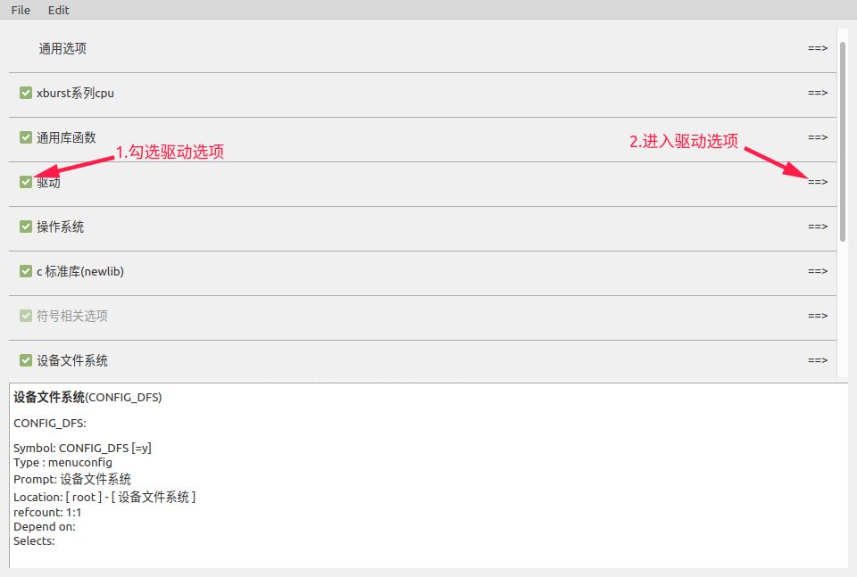

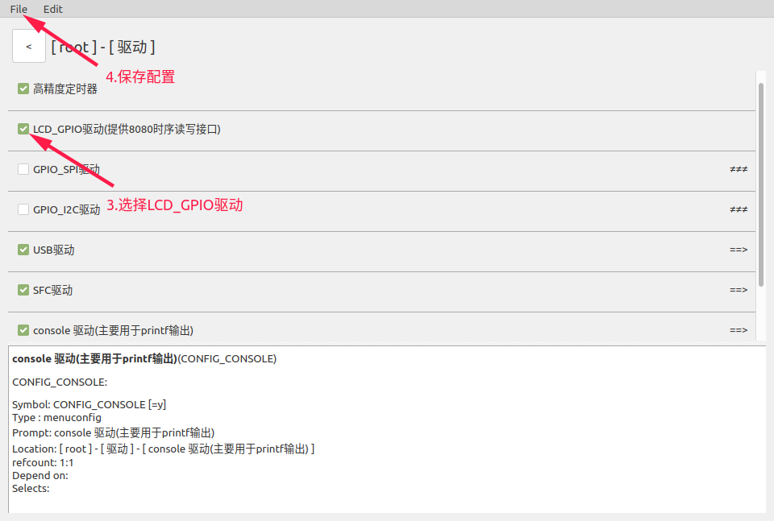


### 15.2.LCD_GPIO使用流程

> 1、调用slcd_gpio_save函数进行保存各GPIO的功能。
>
> 2、调用slcd_gpio_send_cmd发送命令（或者发送数据，接收数据）。
>
> 3、调用slcd_gpio_restore函数进行恢复各GPIO的功能。


### 15.3.LCD_GPIO接口详解

#### 15.3.1.包含头文件

```c
#include <slcd_gpio.h>
```

#### 15.3.2.中间参数详解

```c
slcd总线信息：
struct slcd_bus_info
{
             int wr_gpio;                                      // 写引脚
             int rd_gpio;                                       // 读引脚
             int dc_gpio;                                      // 数据命令引脚
             int cs_gpio;                                       // 片选引脚

             int data_width;                                // 发送数据时位宽
             int cmd_width;                                // 发送命令时位宽

             int data_pin[DATA_WIDTH];         // 数据引脚

             struct slcd_svae_func slcd_func;// 保存引脚功能结构体
};

#define DATA_WIDTH     24                           // 数据线最大宽度
```

#### 15.3.3.接口

```c
void slcd_gpio_save(struct slcd_bus_info* info);
功能：保存slcd控制和数据引脚使用适配器时的功能
参数：info                                                            // slcd总线信息结构体
```

```c
void slcd_gpio_restore(struct slcd_bus_info* info);
功能：恢复slcd控制和数据引脚使用适配器时的功能
参数：info                                                             // slcd总线信息结构体
```

```c
void slcd_gpio_send_cmd(struct slcd_bus_info* info, unsigned int cmd);
功能：发送命令
参数：
              info                                                             // slcd总线信息结构体
              cmd                                                            // 命令
```

```c
void slcd_gpio_send_data(struct slcd_bus_info* info, unsigned int data);
功能：发送数据
参数：
             info                                                             // slcd总线信息结构体
             data                                                            // 命令
```

```c
unsigned int slcd_gpio_receive_data(struct slcd_bus_info* info);
功能：接收
参数：info                                                             // slcd总线信息结构体
返回值：接收数据
```

```
非线程安全，可以在中断上下文使用：
        slcd_gpio_save
        slcd_gpio_restore
        slcd_gpio_send_cmd
        slcd_gpio_send_data
        slcd_gpio_receive_data
```


## 16.Frame Buffer


### 16.1.Frame Buffer配置流程

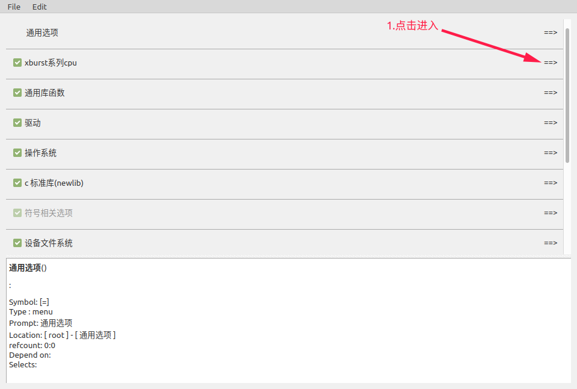

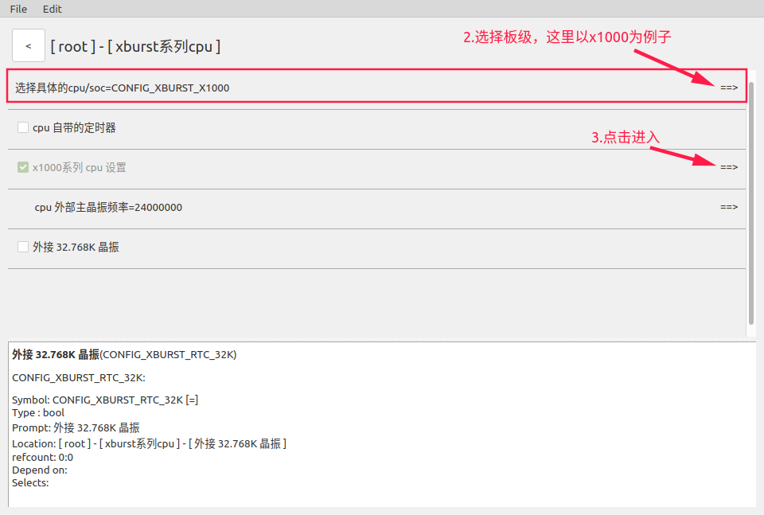

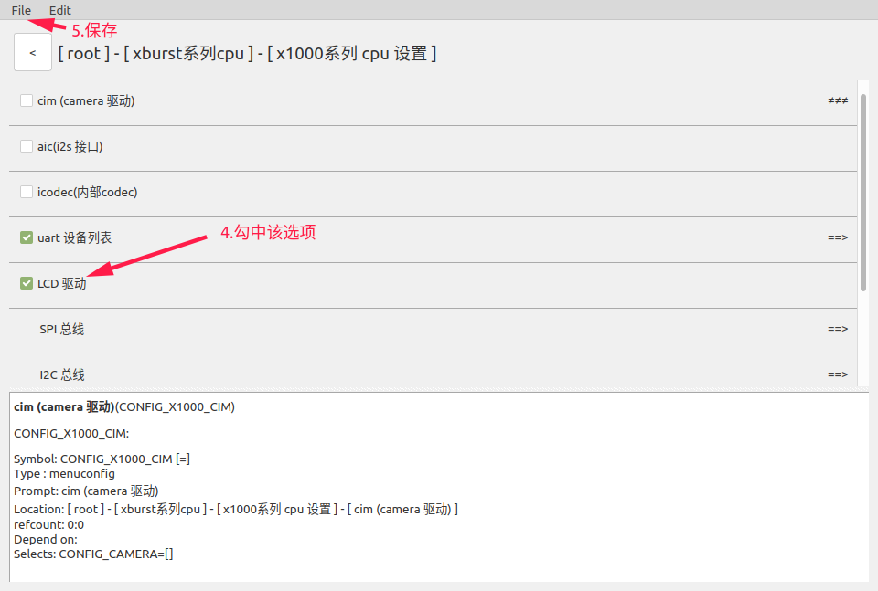


### 16.2.Frame Buffer使用流程

> 1.fb_init 初始化数据
>
> 2.fb_enable 配置相关寄存器
>
> 3.fb_get_info 获取内存映射的地址,并往里面写入RGB数据
>
> 4.fb_display 将屏幕色彩数据刷新到屏幕上
>
> 例子代码在example/driver/fb_example.c


### 16.3.Frame Buffer接口详解

#### 16.3.1.Frame Buffer包含头文件

```c
#include <fb.h>
```

#### 16.3.2.中间参数详解

```c
struct fbinfo {
             void *fb_mem;                                             /*内存映射的地址*/
             unsigned int xres;                                       /*图像x轴长度*/
             unsigned int yres;                                       /*图像y轴长度*/
             unsigned int bits_per_pixel;                  /*一个像数点的位数*/
             unsigned int bytes_per_pixel;               /*一个像数点的字节数*/
             unsigned int bytes_per_line;                 /*一行的字节数*/
             unsigned int bytes_per_frame;             /*帧的字节数*/
             unsigned int frame_count;                      /*帧的数量*/
}
```

#### 16.3.3.接口

```c
void fb_enable(void)
功能：使能fb,主要配置fb相关的寄存器，初始化屏幕并使能电源
```

```c
void fb_disable(void)
功能：关闭控制器时钟,以及关闭屏幕电源
```

```c
void fb_get_info(struct fbinfo *info)
功能：获取帧相关的数据
参数：struct fbinfo *info                                                   /*帧相关信息结构体*/
```

```c
void fb_pan_display(int frame_index)
功能：刷新屏幕数据 （"注意：需调用该函数才会将数据同步到屏幕上"）
参数：int frame_index                                                         /*刷新第几帧*/
```

```
线程安全，可以中断上下文使用：
        fb_get_info
线程安全，不能在中断上下文使用：
        fb_enable
        fb_disable
        fb_pan_display
```


## 17.Backlight


### 17.1.Backlight配置流程

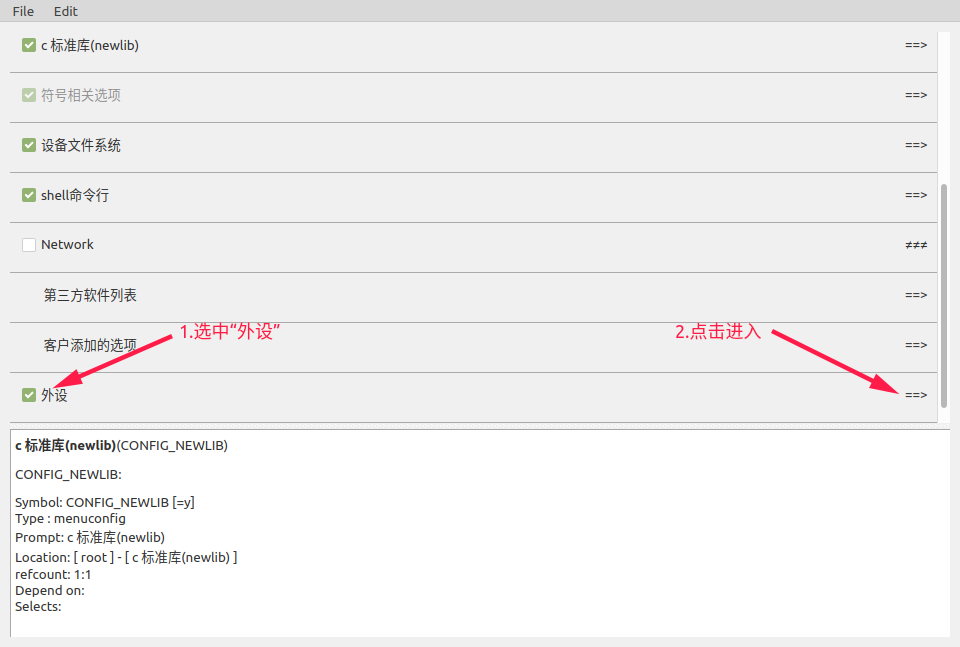

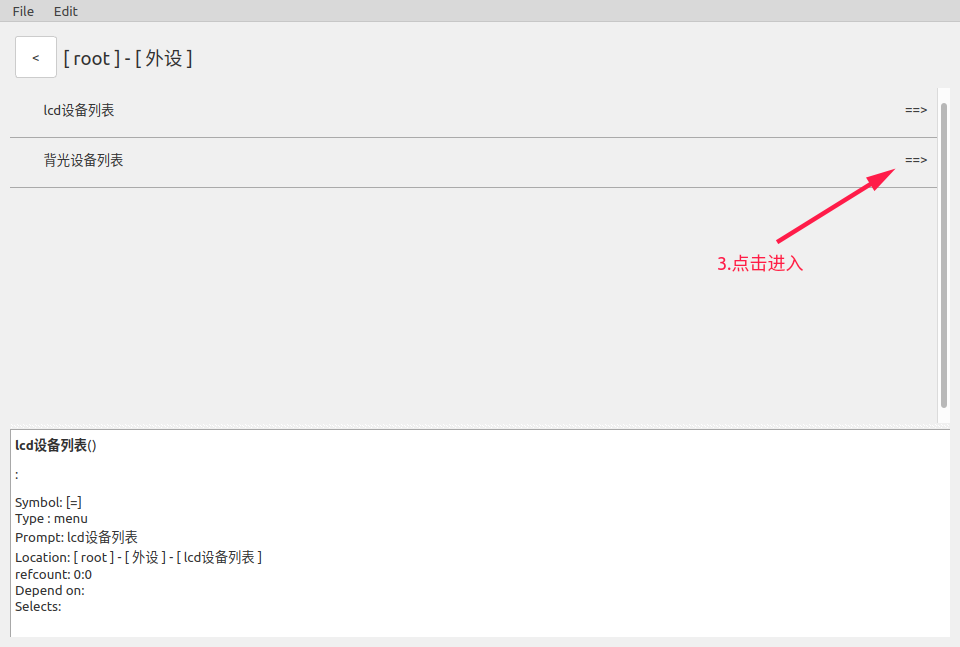

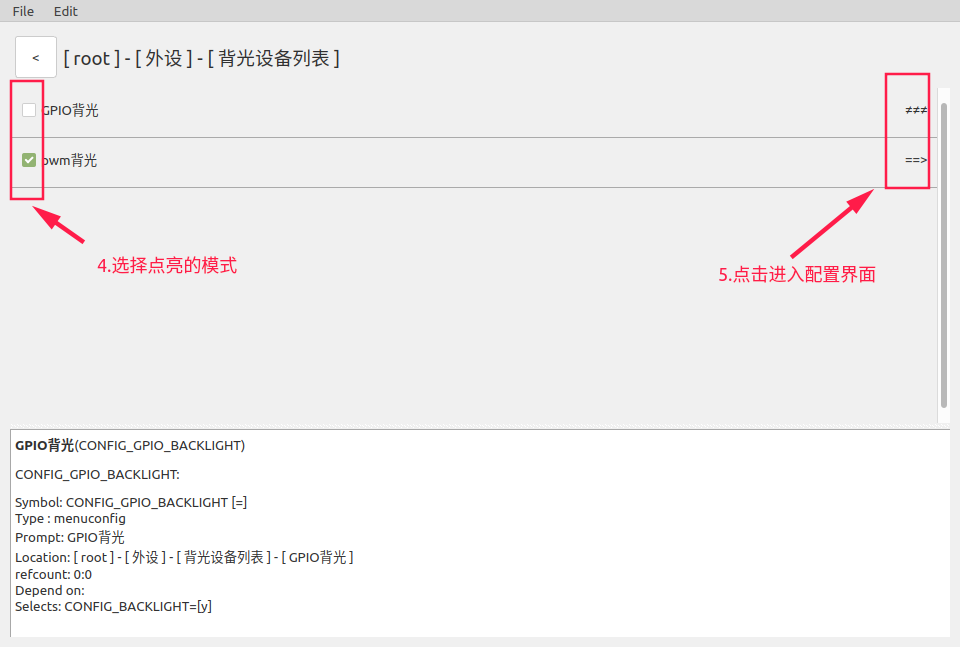

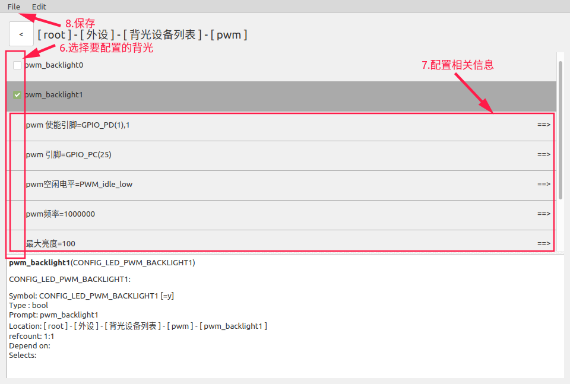


### 17.2.Backlight使用流程

> 1.backlight_init，初始化并配置pwm、gpio背光
>
> 2.open_backlight ,打开背光
>
> 3.set_backlight_brightness 设置背光亮度
>
> 例子代码在example/driver/backlight_example.c


### 17.3.Backlight接口详解

#### 17.3.1.Backlight包含头文件

```c
#include <led_backlight>
```

#### 17.3.2.中间参数详解

```c
gpio引脚的数据结构：
struct gpio_pin {
             int gpio;                     //pin 对应的gpio
             int enable_level;   //pin 使能时的电平
};
```

#### 17.3.3.接口

```c
struct backlight *backlight_open(const char *name);
功能：获取操作背光句柄
参数：const char name                                                      /*背光名字*/
返回值：相应的背光操作句柄
```

```c
void backlight_set_brightness(struct backlight *backlight, int brightness);
功能：设置背光亮度
参数：
              struct backlight *backlight                        /*背光句柄*/
              int brightness                                                           /*背光亮度*/
```

```c
int backlight_get_brightness(struct backlight *backlight);
功能：获取当前亮度值
参数：struct led backlight *backlight                           /*背光句柄*/
返回值：当前亮度值
```

```c
int backlight_get_maxbrightness(struct backlight *backlight);
功能：获取屏幕支持最大亮度值
参数：struct led_backlight *backlight                          /*背光句柄*/
返回值：最大亮度值
```

```c
struct pwm_backlight *pwm_backlight_register(int pwm_gpio, struct gpio_pin pwm_en_gpio, const char *name, struct pwm_config_data *data);
功能：注册新的PWM背光
参数：
             int pwm_gpio                                                              /*pwm输出引脚*/
             struct gpio_pin pwm_en_gpio                             /*pwm引脚的数据*/
             const char *name                                                       /*为新注册的背光取的名字*/
             struct pwm_config_data *data                             /*pwm的配置信息，详见pwm章节*/
返回值：pwm背光句柄
```

```c
void pwm_backlight_unregiser(struct pwm_backlight *backlight);
功能：注销pwm背光，释放pwm资源
参数：struct led_pwm_backlight *backlight              /*pwm背光句柄*/
```

```
线程安全，可以中断上下文使用：
        backlight_open
        backlight_get_brightness
        backlight_get_maxbrightness
        pwm_backlight_register
        pwm_backlight_unregiser
线程安全，不能在中断上下文使用：
        backlight_set_brightness
```


## 18.Camera


### 18.1.Camera配置流程

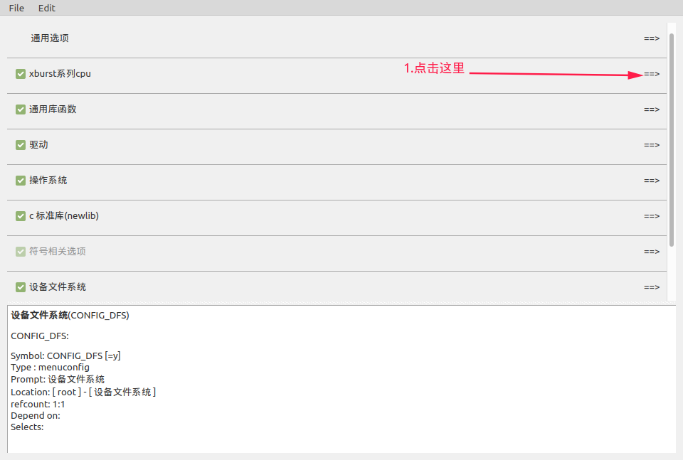

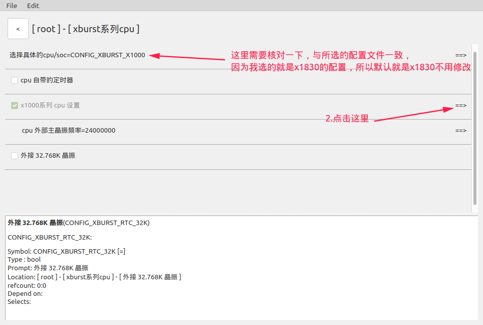

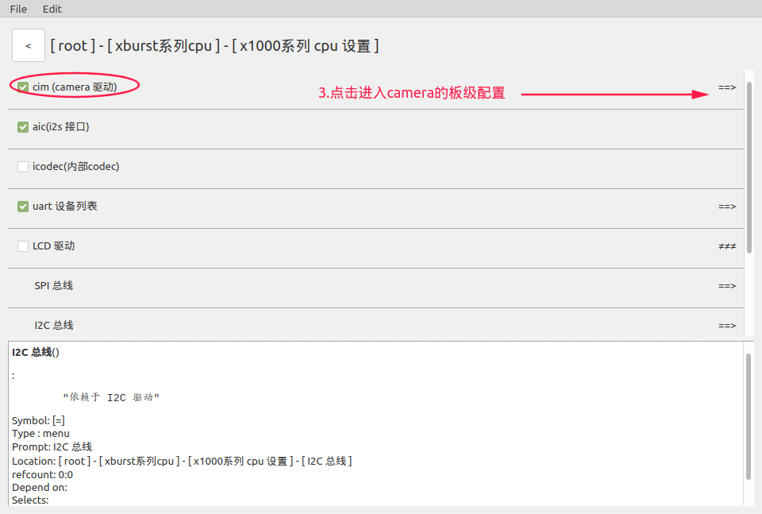

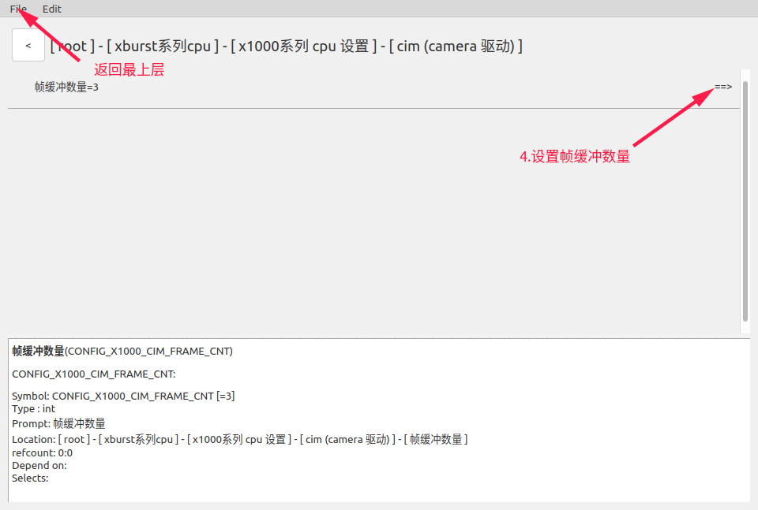

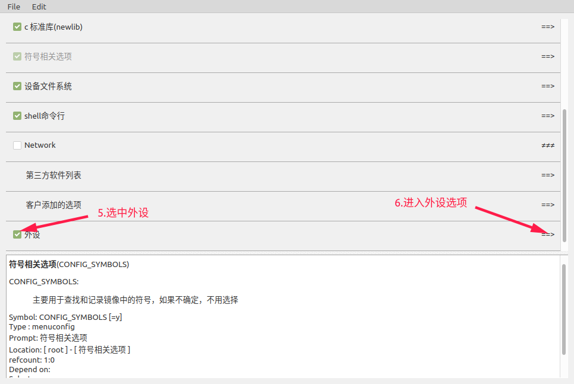

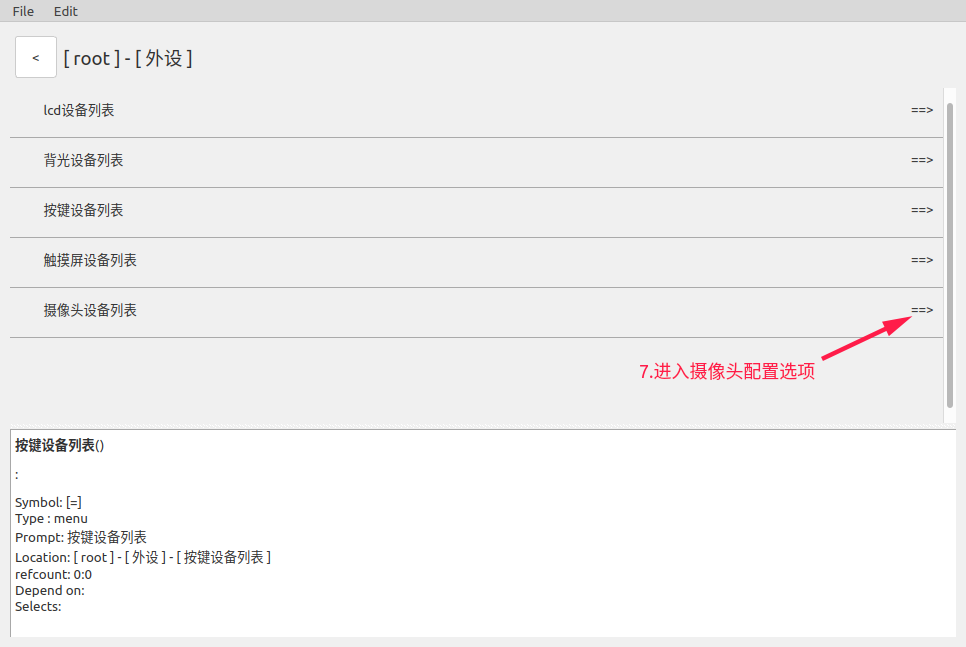

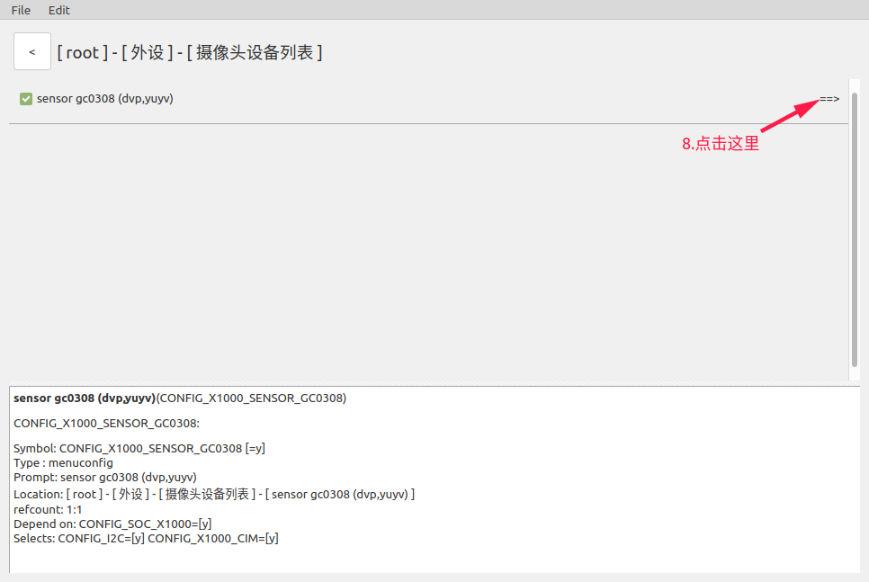

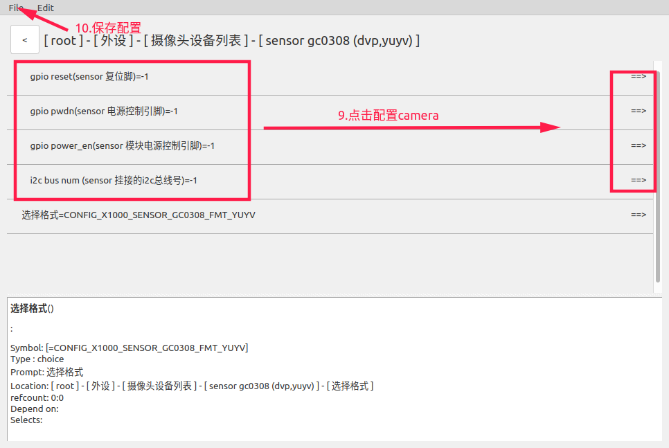


### 18.2.Camera使用流程

> 1.初始化Camera驱动             camera_init()
>
> 2.探测可用的 camera            camera_detect()
>
> 3.获取探测到的camera的信息        camera_get_info()
>
> 4.打开camera电源                       camera_power_on()
>
> 5.打开 camera 图像输出            camera_stream_on()
>
> 6.等待可用的帧                             camera_wait_frame()
>
> 7.将帧还给camera                       camera_put_frame()
>
> 8.关闭camera电源                       camera_power_off()
>
> 例子代码在example/driver/camera_example.c


### 18.3.Camera接口详解

#### 18.3.1.包含头文件

```c
#include <camera.h>
```

#### 18.3.2.中间参数详解

```c
摄像头信息结构体
struct camera_info {
             const char *name;                                         // 摄像头名称
             unsigned int xres;                                         // 图像x轴长度
             unsigned int yres;                                         // 图像y轴长度
             unsigned int frame_period_us;              // 帧周期(单位us)
             camera_data_fmt data_fmt;                    // 数据格式
             unsigned int frame_size;                            // 一帧数据经过对齐之后的大小
             unsigned int uv_data_offset;                    // 诸如 NV12 等 planner 格式下, UV数据在一帧中的偏移
};

选择数据格式
typedef enum {
         fmt_BAYER_RGGB_16BIT,
         fmt_BAYER_GRBG_16BIT,
         fmt_BAYER_GBRG_16BIT,
         fmt_BAYER_BGGR_16BIT,
         fmt_YUV422_YUYV,
         fmt_YUV422_UYVY,
         fmt_YUV422_YVYU,
         fmt_YUV422_VYUY,
         fmt_NV12,
         fmt_NV21,
         fmt_BAYER_RGGB_8BIT,
         fmt_BAYER_GRBG_8BIT,
         fmt_BAYER_GBRG_8BIT,
         fmt_BAYER_BGGR_8BIT,
         fmt_Y8,
} camera_data_fmt;
```

#### 18.3.3.接口

```c
struct camera_device *camera_detect(void)
功能：探测第一个可用的 camera
返回值：
                  非NULL：成功，返回探测到的camera设备结构体指针
                       NULL：失败
"注意：失败原因一般都是i2c通信失败或者没有sensor注册。"
```

```c
struct camera_info *camera_get_info(struct camera_device *camera)
功能：获取camera信息
参数：camera                           // 由camera_detect() 返回的指针
返回值：                                      //  camera信息
```

```c
int camera_power_on(struct camera_device *camera)
功能：打开 camera 电源
参数：camera                           // 由camera_detect() 返回的指针
返回值：
                等于 0：成功
                小于 0：失败
"注意：失败原因一般都是i2c通信失败。"
```

```c
void camera_power_off(struct camera_device *camera)
功能：关闭 camera 电源
参数：camera                            // 由camera_detect() 返回的指针
```

```c
int camera_stream_on(struct camera_device *camera)
功能：打开 camera 图像输出
参数：camera                             // 由camera_detect() 返回的指针
返回值：
                 等于 0：成功
                 小于 0：失败
"注意：失败原因一般都是i2c通信, 且必须在打开camera 电源之后才能打开图像输出。"
```

```c
void camera_stream_off(struct camera_device *camera)
功能：关闭 camera 图像输出
参数：camera                                    // 由camera_detect() 返回的指针
```

```c
void *camera_wait_frame(struct camera_device *camera)
功能：等待可用的一帧
参数：camera                                     // 由camera_detect() 返回的指针
返回值：
                 非NULL：帧地址
                     NULL：表示失败
"注意：通过该函数获得的帧地址，一定要通过camera_put_frame还回去才会被再次填充图像数据。这样就保证了这帧图像在使用时的安全性。"
```

```c
void camera_put_frame(struct camera_device *camera, void *frame)
功能：将帧还给camera
参数：
             camera                                     // 由camera_detect() 返回的指针
             frame                                        // 由 camera_wait_frame() 返回的指针
```

```c
unsigned int camera_get_available_frame_count(struct camera_device *camera)
功能：获取可用的帧数 (最大值由驱动frame buffer数量决定)
参数：camera                                      // 由 camera_detect() 返回的指针
返回值：可用的帧数
```

```c
void camera_skip_frames(struct camera_device *camera, unsigned int frames)
功能：跳过指定的可用帧(这样camera_wait_frame() 能拿到较新的帧)
参数：
             camera                                         // 摄像头设备结构体
             frames                                          // 要跳过的帧数
```

```
线程安全，可以中断上下文使用：
        camera_get_info
        camera_put_frame
        camera_get_available_frame_count
        camera_skip_frames
线程安全，不能在中断上下文使用：
        camera_detect
        camera_power_on
        camera_power_off
        camera_stream_on
        camera_stream_off
        camera_wait_frame
```


## 19.PCM


### 19.1.Pcm配置流程

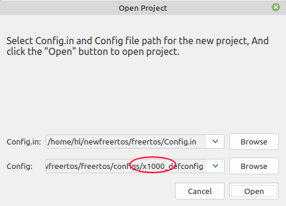

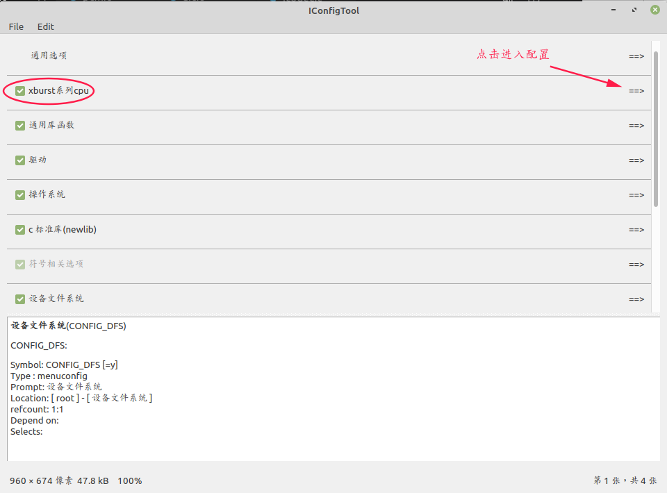

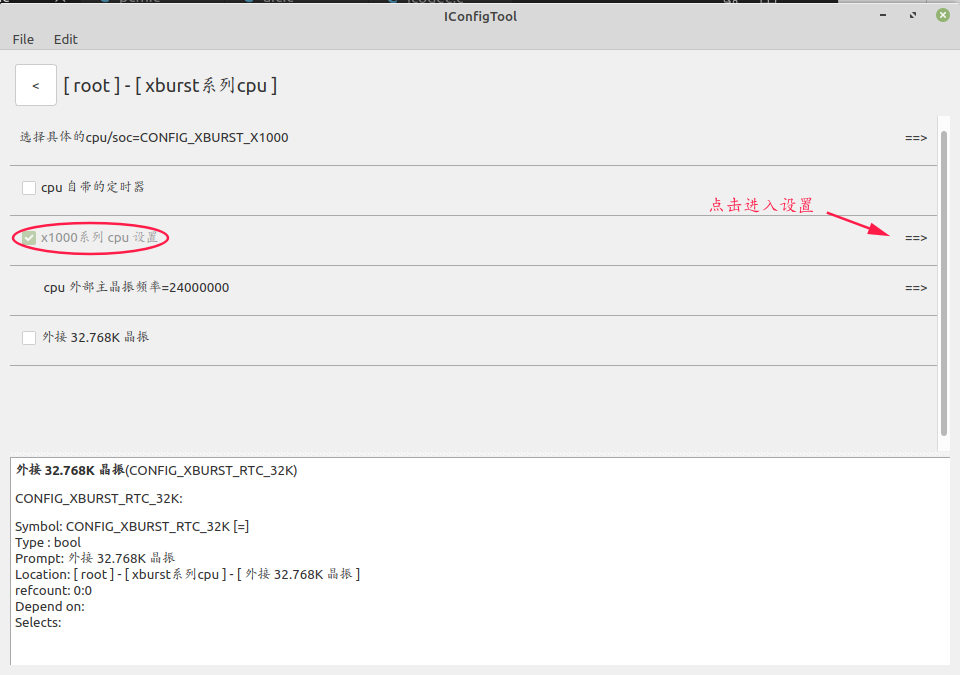

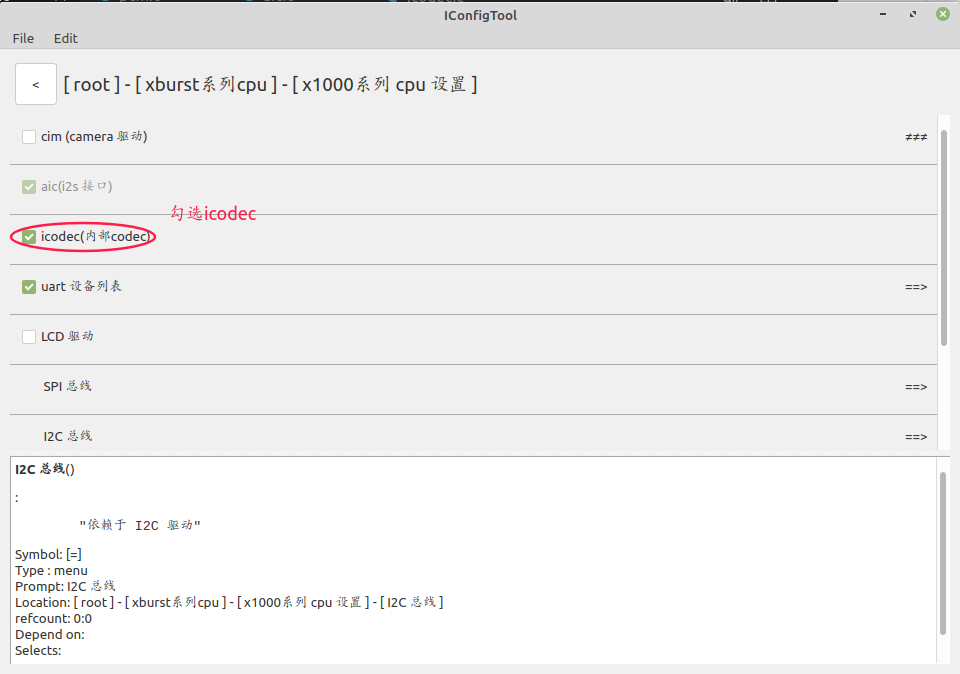


### 19.2.Pcm使用流程

#### 19.2.1.使用内部codec播放音频流程

> 1.获取播放功能 aic 设备              pcm_get("aic-playback")
>
> 2.获取播放功能 icodec 设备       pcm_get("icodec-playback")
>
> 3.设置 aic 的工作时钟频率          pcm_private_ctrl(pcm_get("aic-playback"), "sysclk-set-rate", 24 * 1000 * 1000)
>
> 4.设置 aic 输出工作时钟              pcm_private_ctrl(pcm_get("aic-playback"), "sysclk-set-output", 1)
>
> 5.选择使用icodec                         pcm_private_ctrl(pcm_get("aic-playback"), "use-internal-codec", 1)
>
> 6.使能aic                                       pcm_enable(pcm_get("aic-playback"), &playback_params)
>
> 7.使能 icodec                               pcm_enable(pcm_get("icodec-playback"), &playback_params)
>
> 8.启动 icodec                               pcm_start(pcm_get("icodec-playback"))
>
> 9.启动 aic                                     pcm_start(pcm_get("aic-playback"))
>
> 10.开始 aic 将数据写入icodec   pcm_write_frame(pcm_get("aic-playback"), (void *)buffer, sizeof(buffer) / pcm_frame_size(&playback_params))
>
> 11.关闭 aic                                   pcm_disable(pcm_get("aic-playback"))
>
> 12.关闭 icodec                            pcm_disable(pcm_get("icodec-playback"))

#### 19.2.2.使用内部codec录制音频流程

> 1.获取录音功能 aic 设备              pcm_get("aic-capture")
>
> 2.获取录音功能 icodec 设备       pcm_get("icodec-capture")
>
> 3.设置 aic 的工作时钟频率          pcm_private_ctrl(pcm_get("aic-capture"), "sysclk-set-rate", 24 * 1000 * 1000)
>
> 4.设置 aic 输出工作时钟              pcm_private_ctrl(pcm_get("aic-capture"), "sysclk-set-output", 1)
>
> 5.选择使用icodec                         pcm_private_ctrl(pcm_get("aic-capture"), "use-internal-codec", 1)
>
> 6.选择使用模拟mic                      pcm_private_ctrl(pcm_get("icodec-capture"), "bias-on", 1);
>
> 7.使能aic                                       pcm_enable(pcm_get("aic-capture"), &capture_params)
>
> 8.使能 icodec                               pcm_enable(pcm_get("icodec-capture"), &capture_params)
>
> 9.启动 icodec                               pcm_start(pcm_get("icodec-capture"))
>
> 10.启动 aic                                     pcm_start(pcm_get("aic-capture"))
>
> 11.开始 aic 将数据写入icodec   pcm_read_frame(pcm_get("aic-capture"), (void *)buffer, sizeof(buffer) / pcm_frame_size(&capture_params))
>
> 12.关闭 icodec                            pcm_disable(pcm_get("icodec-capture"))
>
> 13.关闭 aic                                   pcm_disable(pcm_get("aic-capture"))


### 19.3.Pcm接口详解

#### 19.3.1.Pcm包含头文件

```c
#include <driver/pcm.h>
```

#### 19.3.2.Pcm中间参数详解

```c
1.pcm_get()用于获取已注册的设备，参数如下：
"aic-playback"：表示获取 aic 设备并使用 aic 的音频播放相关接口
"aic-capture"：表示获取 aic 设备并使用 aic 的音频录制相关接口
"icodec-playback"：表示获取 icodec 设备并使用 icodec 的音频播放相关接口
"icodec-capture"：表示获取 icodec 设备并使用 icodec 的音频录制相关接口

2.pcm_private_ctrl()设置aic：
第一个参数：通过 pcm_get() 获取的aic设备
第二个参数：
"sysclk-set-rate"：设置 aic 的时钟频率，第三个参数表示设置频率的值  注意：x1000 需设为24 * 1000 * 1000
"sysclk-set-output"：设置 aic 的工作时钟模式，第三个参数为1表示输出时钟信号，0不输出
"use-internal-codec"：设置是否使用内部 codec，第三个参数为1表示使用，0不使用

3.pcm_private_ctrl()设置icodec
第一个参数：通过 pcm_get() 获取的 icodec 设备
第二个参数：
"bias-on"：使能模拟 mic 供电，此时第一个参数应为通过 pcm_get("icodec-capture") 获取的设备，第三个参数为1表示打开偏置电压，0不打开
"mix-stereo-to-left-channel"：音频播放混合双声道到左声道，此时第一个参数应为通过 pcm_get("icodec-playback") 获取的设备，第三个参数为1表示打开混合输入，0表示不打开

struct pcm_params {
    pcm_interface pcm_interface;                        //PCM音频接口
    i2s_frame_mode i2s_frame_mode;                      //数据帧格式
    i2s_bclk_direction i2s_bclk_direction;              //bclk主从模式选择
    i2s_frame_direction i2s_frame_direction;            //采样率主从模式选择
    pcm_data_fmt pcm_data_fmt;                          //采样位数
    pcm_sample_rate pcm_sample_rate;                    //采样率
    unsigned int channels;                              //采样通道数
    unsigned int buffer_time_ms;
    unsigned int period_time_ms;
};

typedef enum {
    pcm_interface_i2s,
    pcm_interface_i2s_MSB, // i2s 右对齐
    pcm_interface_i2s_left_justified, // i2s 左对齐

    pcm_interface_nums,
} pcm_interface;

typedef enum {
    pcm_fmt_S8,
    pcm_fmt_U8,
    pcm_fmt_S16LE,
    pcm_fmt_S16BE,
    pcm_fmt_U16LE,
    pcm_fmt_U16BE,
    pcm_fmt_S24LE,
    pcm_fmt_S24BE,
    pcm_fmt_U24LE,
    pcm_fmt_U24BE,
    pcm_fmt_S32LE,
    pcm_fmt_S32BE,
    pcm_fmt_U32LE,
    pcm_fmt_U32BE,

    pcm_fmt_nums,
} pcm_data_fmt;

typedef enum {
    pcm_rate_5512,
    pcm_rate_8000,
    pcm_rate_11025,
    pcm_rate_12000,
    pcm_rate_16000,
    pcm_rate_22050,
    pcm_rate_24000,
    pcm_rate_32000,
    pcm_rate_44100,
    pcm_rate_48000,
    pcm_rate_64000,
    pcm_rate_88200,
    pcm_rate_96000,
    pcm_rate_176400,
    pcm_rate_192000,

    pmc_rate_nums,
} pcm_sample_rate;

typedef enum {
    i2s_LR_mode,
    i2s_RL_mode,
} i2s_frame_mode;

typedef enum {
    i2s_bclk_codec_slave,
    i2s_bclk_codec_master,
} i2s_bclk_direction;

typedef enum {
    i2s_frame_codec_slave,
    i2s_frame_codec_master,
} i2s_frame_direction;

"例子代码在example/driver/audio_pcm_example.c中"
```

#### 19.3.3.接口

```c
struct pcm_device *pcm_get(const char *name)
功能：    获取已经注册的设备
参数：
         name                     //设备相应功能字符串名
返回值：相应功能设备
"注意：有关参数选项请查阅中间参数详解。"
```

```c
int pcm_private_ctrl(struct pcm_device *dev, const char *ctrl_id, unsigned long value)
功能：配置相应设备
参数：
        dev                       //通过pcm_get()获取的设备
        ctrl_id                   //需要配置的功能的字符串名
        value                     //设置的值
返回值：
        0                         //成功
        -ENODEV                   //该函数功能不存在
        -EINVAL                   //配置失败
"注意：有关参数选项请查阅中间参数详解。"
```

```c
int pcm_write_frame(struct pcm_device *dev, void *buf, int frame_count)
功能：aic将音频数据写入icodec
参数：
        dev                       //通过 pcm_get("aic-playback") 获取的设备
        buf                       //需要写入的音频数据
        frame_count               //数据帧的个数,sizeof(buffer) / pcm_frame_size(&playback_params)
返回值：
        0                         //成功
        -ENODEV                   //该函数功能不存在
        -EINVAL                   //传输失败
```

```c
int pcm_write_frame_timeout(struct pcm_device *dev, void *buf, int frame_count, unsigned int timeout_ms)
功能：带超时的aic将音频数据写入icodec
参数：
        dev                       //通过 pcm_get("aic-playback") 获取的设备
        buf                       //需要写入的音频数据
        frame_count               //数据帧的个数
        timeout_ms                //超时时间
返回值：
        0                         //成功
        -ENODEV                   //该函数功能不存在
        -EINVAL                   //传输失败
```

```c
int pcm_read_frame(struct pcm_device *dev, void *buf, int frame_count)
功能：aic从icodec读取音频数据
参数：
        dev                       //通过 pcm_get("aic-capture") 获取的设备
        buf                       //存放读取数据的 buffer
        frame_count               //数据帧的个数, sizeof(buffer) / pcm_frame_size(&capture_params)
返回值：
        0                         //成功
        -ENODEV                   //该函数功能不存在
        -EINVAL                   //传输失败
```

```c
int pcm_read_frame_timeout(struct pcm_device *dev, void *buf, int frame_count, unsigned int timeout_ms)
功能：带超时的aic从icodec读取音频数据
参数：
        dev                       //通过 pcm_get("aic-capture") 获取的设备
        buf                       //存放读取数据的 buffer
        frame_count               //数据帧的个数
        timeout_ms                //超时时间
返回值：
        0                         //成功
        -ENODEV                   //该函数功能不存在
        -EINVAL                   //传输失败
```

```c
int pcm_check_params(struct pcm_device *dev, struct pcm_params *p)
功能：检查当前设备参数配置是否正确
参数：
        dev                       //通过 pcm_get() 获取的设备
        p                         //当前设备的配置参数
返回值：
        1                         //配置正确
        0                         //配置错误
```

```c
int pcm_enable(struct pcm_device *dev, struct pcm_params *param)
功能：使能相应设备
参数：
        dev                       //通过 pcm_get() 获取的设备
        param                     //当前设备配置参数
返回值：
        -EINVAL                   //失败
        0                         //成功
```

```c
void pcm_disable(struct pcm_device *dev)
功能：失能相应设备
参数：
        dev                       //通过 pcm_get() 获取的设备
```

```c
int pcm_start(struct pcm_device *dev)
功能：启动相应设备功能
参数：
        dev                       //通过 pcm_get() 获取的设备
返回值：
        -EINVAL                   //失败
        0                         //成功
```

```c
void pcm_stop(struct pcm_device *dev)
功能：停止相应设备功能
参数：
        dev                       //通过 pcm_get() 获取的设备
```

```c
int pcm_set_mute(struct pcm_device *dev, int mute)
功能：设置静音模式
参数：
        dev                       //通过 pcm_get("icodec-playback" ) 获取的设备
        mute                      //1表示设置为静音，0取消静音模式
返回值：
        0                         //成功
        -ENODEV                   //该函数功能不存在
        -EINVAL                   //设置失败
```

```c
int pcm_get_mute(struct pcm_device *dev)
功能：判断当前设备是否处于静音模式
参数：
        dev                       //通过 pcm_get("icodec-playback" ) 获取的设备
返回值：
        1                         //设备处于静音模式
        0                         //设备未静音
```

```c
int pcm_set_volume(struct pcm_device *dev, int val)
功能：设置当前设备音量
参数：
        dev                       //通过 pcm_get() 获取的 icodec 设备
        val                       //需要设置的音量值，范围 0～100
返回值：
        0                         //成功
        -ENODEV                   //该函数功能不存在
        -EINVAL                   //设置失败
"注意：音量设置为0时，设备会进入静音模式"
```

```c
int pcm_get_volume(struct pcm_device *dev)
功能：获取当前设备音量
参数：
        dev                       //通过 pcm_get() 获取的 icodec 设备
返回值：
         0~100                    //当前设备音量
        -ENODEV                   //该函数功能不存在
        -EINVAL                   //设置失败
```

```c
unsigned int pcm_data_sample_size(pcm_data_fmt fmt)
功能：检查样本长度是否正确
参数：
        fmt                       //设备采样位数
返回值：
        当前样本长度（采样位数）值，单位字节
```

```c
unsigned int pcm_data_sample_rate(pcm_sample_rate rate)
功能：检查采样率值是否正确
参数：
        rate                      //设备采样率
返回值：
        当前采样率值
```

```c
int pcm_frame_size(struct pcm_params *param)
功能：获取当前帧大小，帧大小 = 样本长度 * 通道数
参数：
        param                     //当前设备的参数配置
返回值：
        当前帧大小
```

```
线程安全，可以中断上下文使用：
        pcm_get
        pcm_check_params
        pcm_get_mute
        pcm_data_sample_size
        pcm_data_sample_rate
        pcm_frame_size
线程安全，不能在中断上下文使用：
        pcm_private_ctrl
        pcm_write_frame
        pcm_write_frame_timeout
        pcm_read_frame
        pcm_read_frame_timeout
        pcm_enable
        pcm_disable
        pcm_start
        pcm_stop
        pcm_set_mute
        pcm_set_volume
        pcm_get_volume
```


## 20.DTRNG


### 20.1.Dtrng配置流程

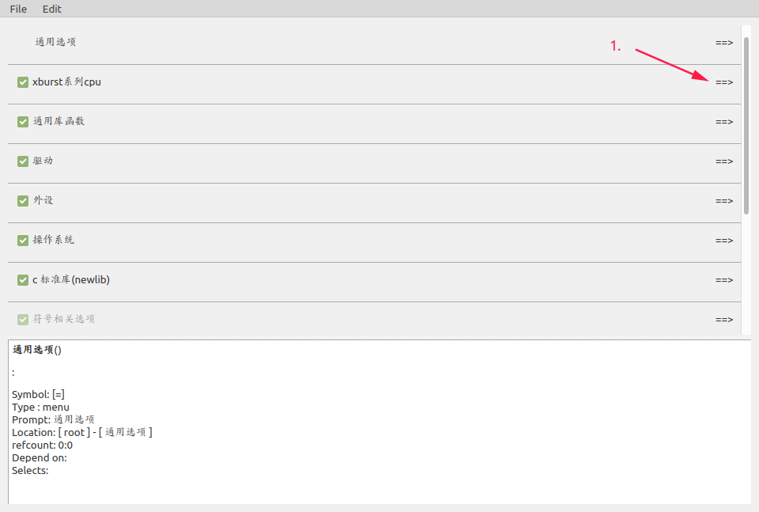

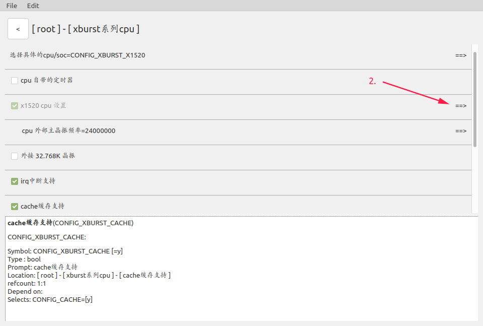

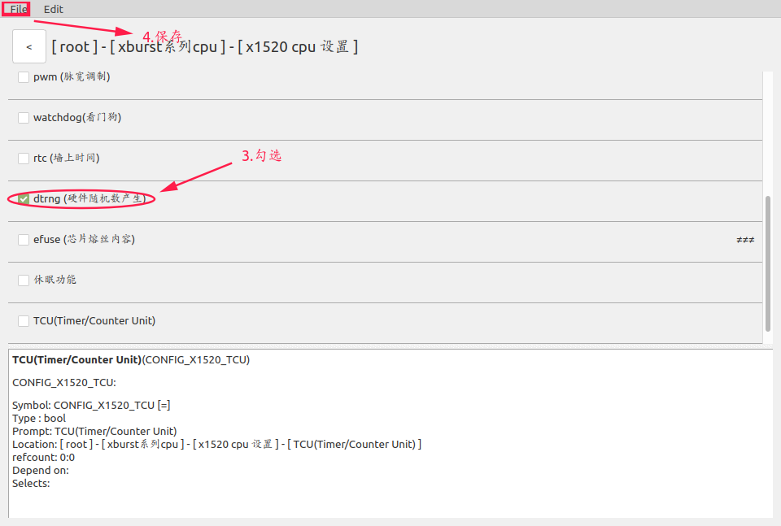

### 20.2.Dtrng使用流程

>   1.初始化并使能Dtrng                      dtrng_init()
>
>   2.读取随机数                                    dtrng_read_random_data()
>
>   3.失能Dtrng                                     dtrng_deinit()

### 20.3.Dtrng接口详解

#### 20.3.1.Dtrng包含头文件

```c
#include <driver/dtrng.h>
```

#### 20.3.2.接口

```c
unsigned int dtrng_read_random_data(void)
功能：获取随机数
返回值：产生的随机数
```

```
线程安全，可以中断上下文使用：
        dtrng_read_random_data
```
