# Freertos中FAT文件系统的制作说明文档

## 1．freertos文件系统介绍

​		Ramdisk介绍:

​		Ramdisk实际上是从内存中划出一部分作为一个分区使用（用内存模拟flash），使用时我们创建一个ramdisk作为根目录"/"的存储空间，在根目录下创建挂载点．

​		FAT文件系统挂载介绍:

​		使用文件系统前，先确定分区中是否存在FAT16/32或exFAT文件系统，如果存在将分区挂载出来，不存在就格式化擦除原来的内容，并在存储介质上新建文件分区表和目录，用来记录数据存放的偏移地址和剩余空间．数据以文件的形式存储，写入新文件时，先在目录中创建一个索引，指示文件存放的偏移地址．当读取数据时，从目录中找到该文件的索引，进而在相应的地址中读取数据．

注：⽬前⽀持 nor和mmc挂载fat⽂件系统．

## 2．创建和修改文件系统

１．创建空的文件系统（以４M为例）

```c
mkfs.fat　-S　4096 -C　fat-test.img　4096
参数解释:
	-S logical-sector-size 逻辑扇区的大小
    -C 创建目标文件，用此选项必须给出＜block-count＞单位是kBytes
```

命令效果：在当前目录产生一个.img文件，这是一个空镜像

２．修改文件系统内容

```c
mkdir fs_tmp    #创建文件夹
sudo mount -t vfat fat-test.img    #挂载文件系统
．．．．．．
．．．．．．
．．．．．．　　　　　　　  #修改文件系统，添加或者删除文件
sudo umount ./fs_tmp    #取消挂载
```

## 3．nor配置流程

### 3.1 配置ramdisk设备

1．从主界面进入"外设"配置，找到ramdisk设备配置

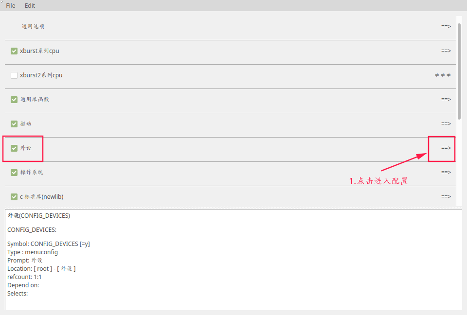

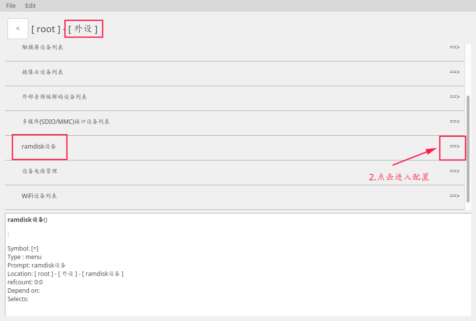

2．勾选ramdisk设备，查看设备配置，保持默认即可

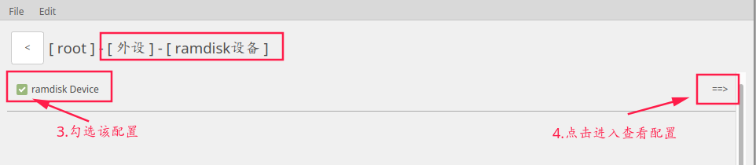

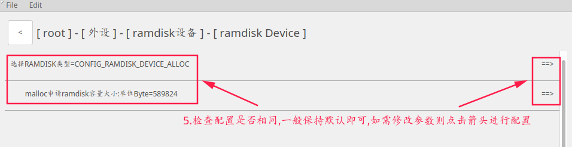

### 3.2 配置设备文件系统

1．从主界面进入设备文件系统

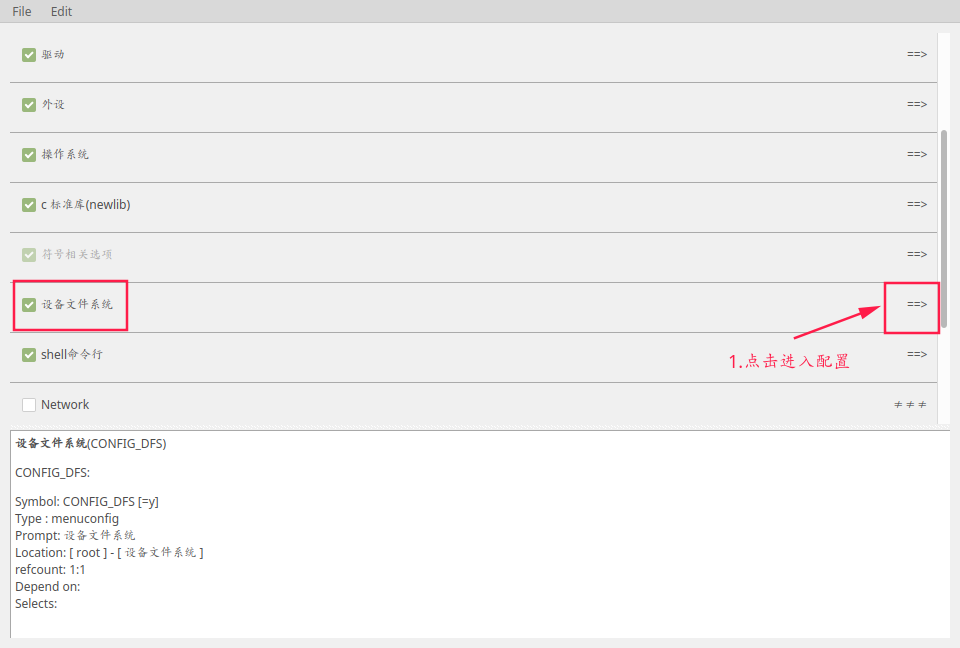

2．添加fat文件系统挂载分区

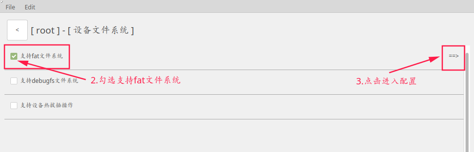

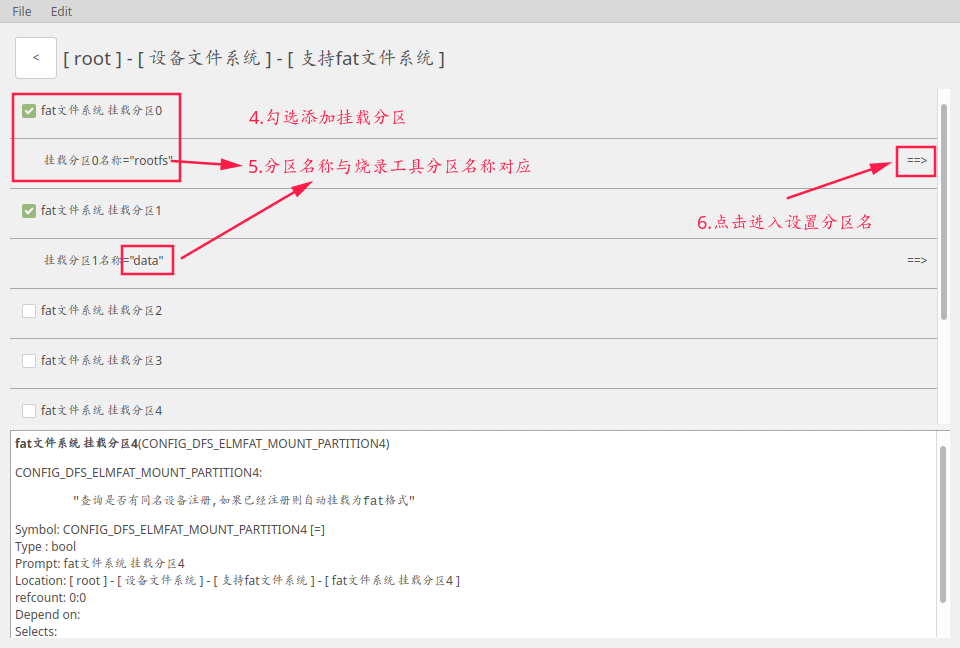

### 3.3 配置烧录工具，设置分区偏移地址与分区大小

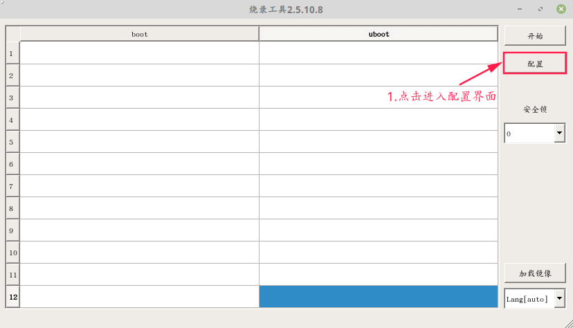

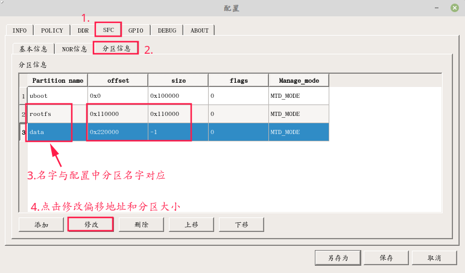

​		烧录时会将分区信息烧录到存储设备．启动会读取分区信息，并与FAT文件系统挂载名称匹配，匹配成功就将对应分区挂载到根目录下．

挂载情况：

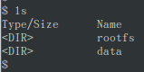

## 4．mmc配置流程

### 4.1 不可拔插设备配置

#### 4.1.1 emmc flash

1．配置ramdisk设备，同3.1配置流程

2．配置不勾选支持热拔插操作，MMC配置中勾选设备不可移除.

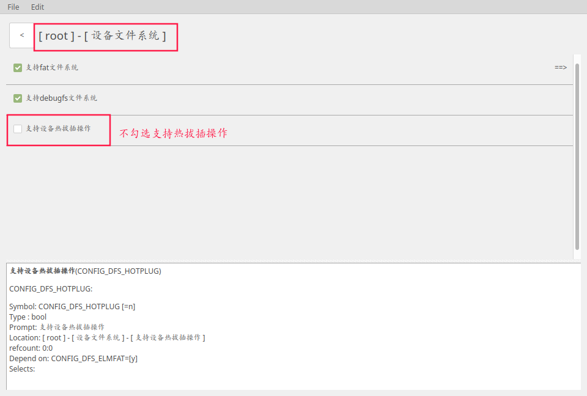

3．修改MMC总线和接口配置

(注：MMC总线要与eMMC Device中设备挂载的总线号对应)


4．启动后会使用默认的分区表，如需更改分区表信息，可修改如下代码中的参数．

freertos/devices/mmc/mmc_partition.c

static struct block_device_partition *get_emmc_device_default_partition_info(void)

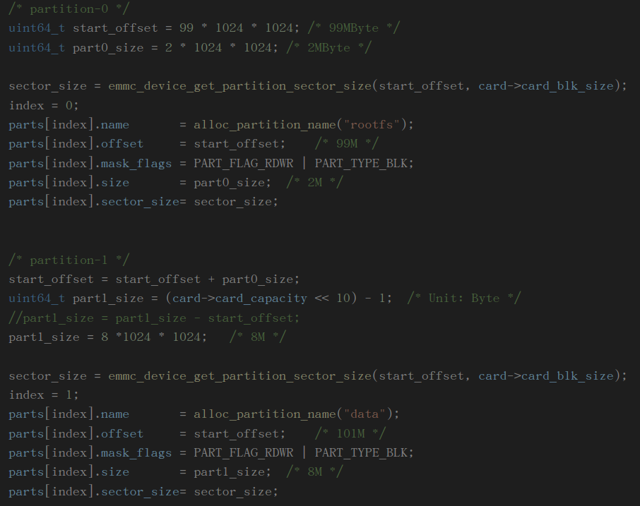

### 4.2 可动态拔插设备配置

（根据MBR/GPT分区表自动挂载设备/分区）

#### 4.2.1 TF卡

1．配置ramdisk设备，同3.1配置流程

2．从主界面进入设备文件系统配置界面,勾选支持热拔插操作

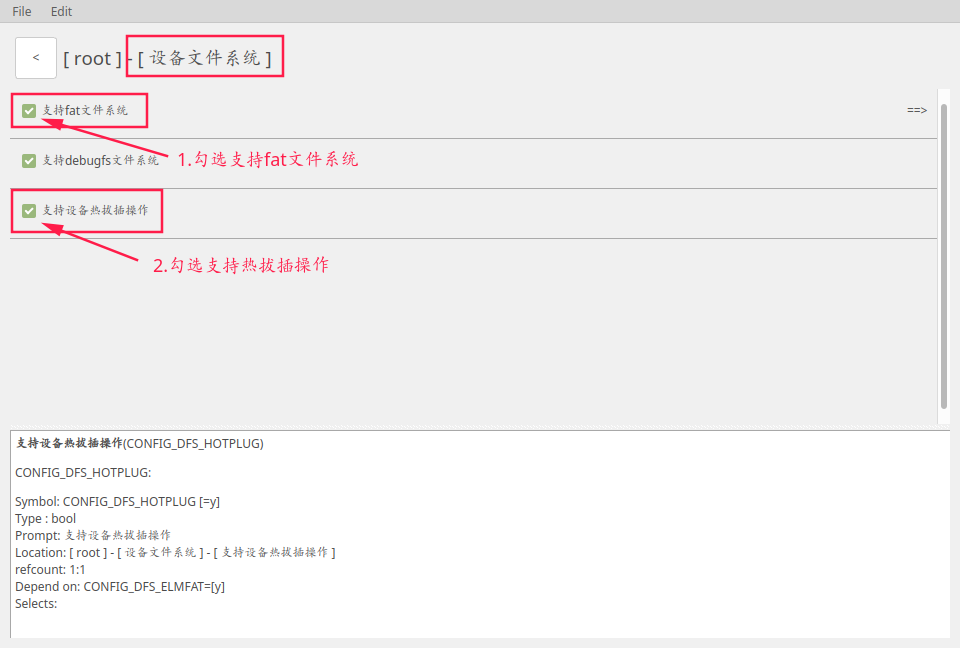

３．配置MMC接口设备

从主界面进入外设选项

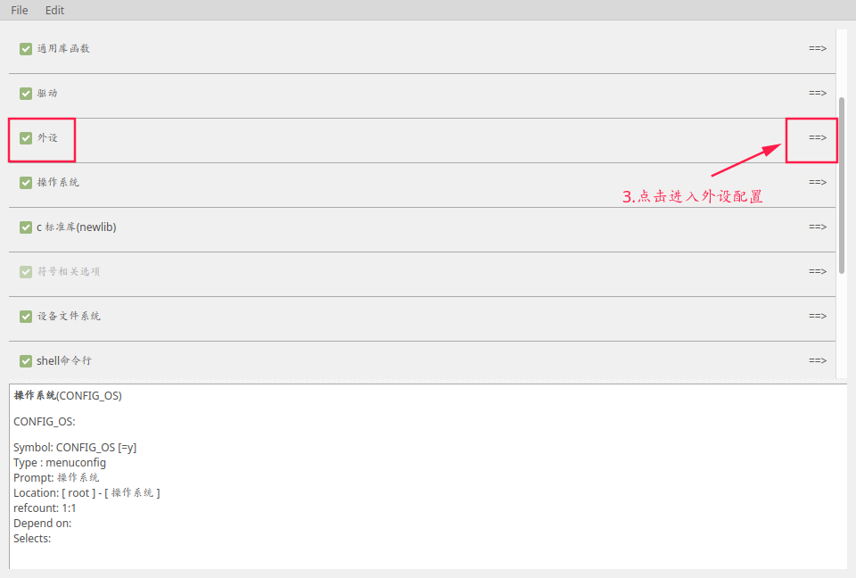

找到MMC接口配置

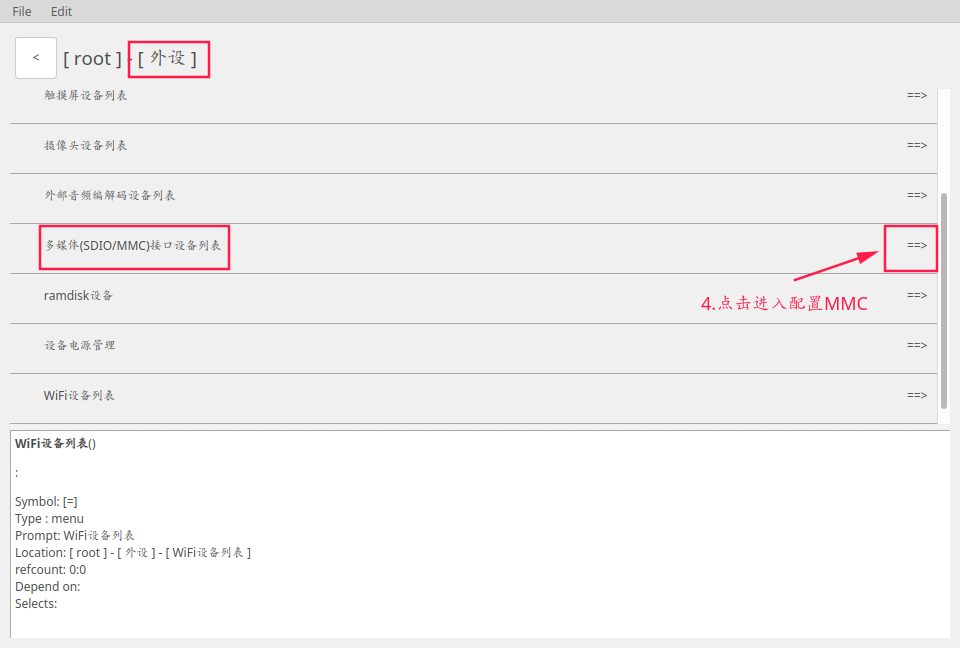

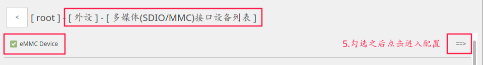

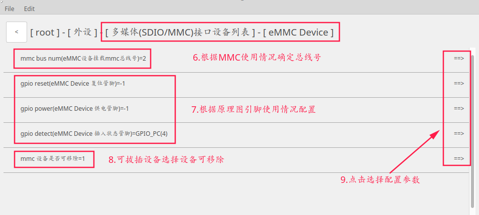

３．编译烧录之后(如图为TF卡探测效果)

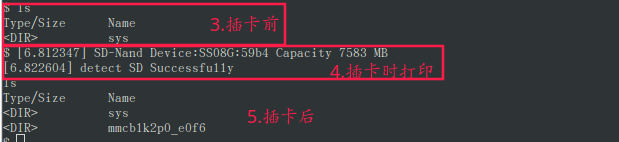

#### 4.2.2 emmc flash(不推荐按照可拔插设备配置)

1．其他配置同TF卡配置，修改MMC接口配置

(注：MMC总线要与eMMC Device中设备挂载的总线号对应)


2．打开以下宏定义，可以打印出GPT分区信息

freertos/devices/mmc/mmc_partition_parse_mbr_gpt.c


3．从GPT分区表读到的分区如果不是FAT格式，会挂载失败，出现以下打印是正常打印(不推荐将emmc flash配置成可拔插设备的原因)


## 5．U盘配置流程

1．从主界面进入设备文件系统配置界面,勾选支持热拔插操作


2．回到主界面进入驱动配置

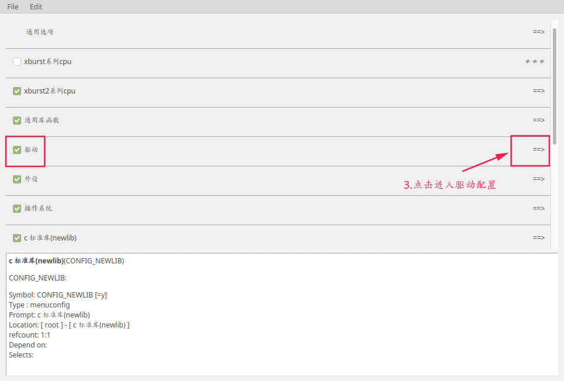

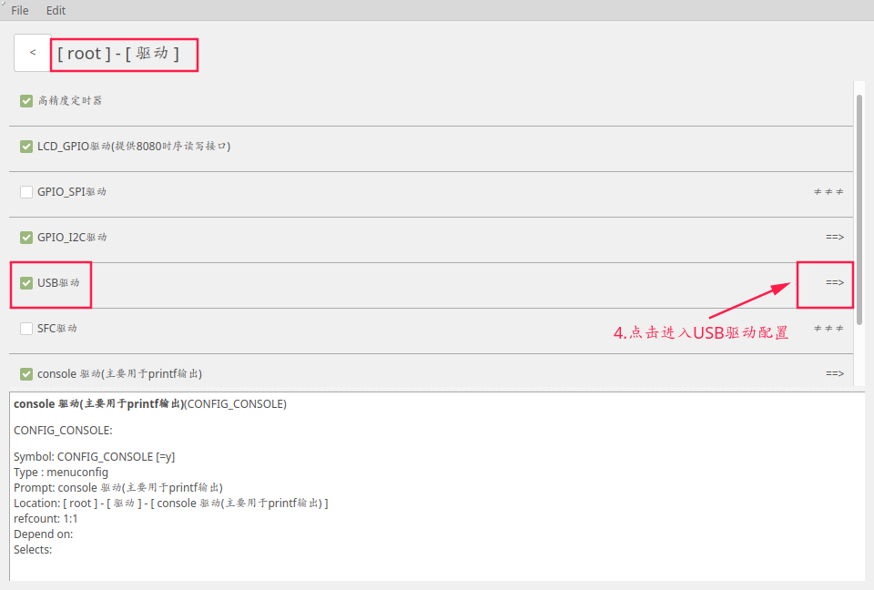

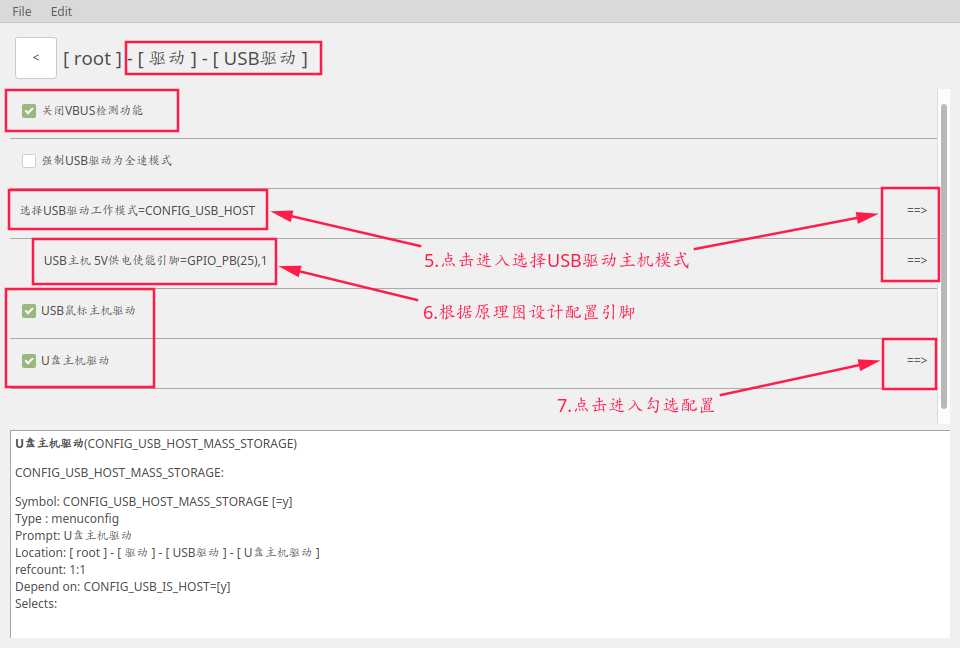

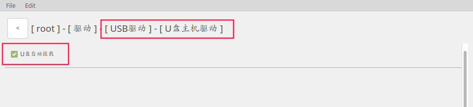

3．编译烧录之后(如图为U盘探测效果)

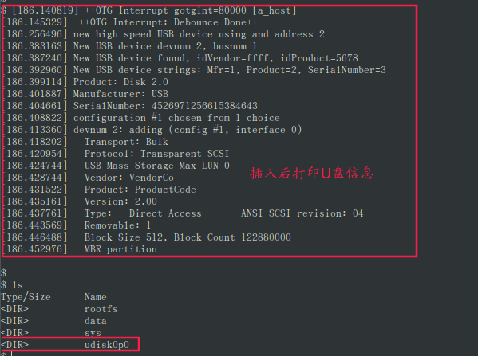