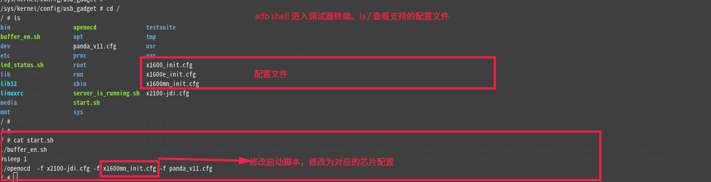
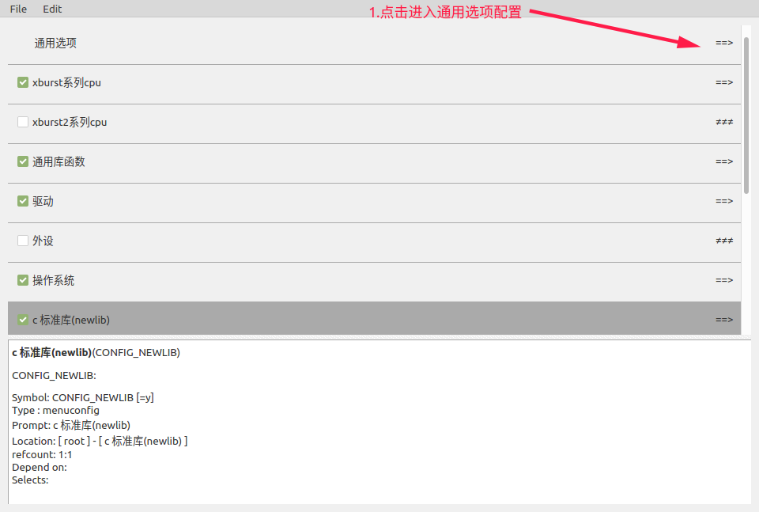
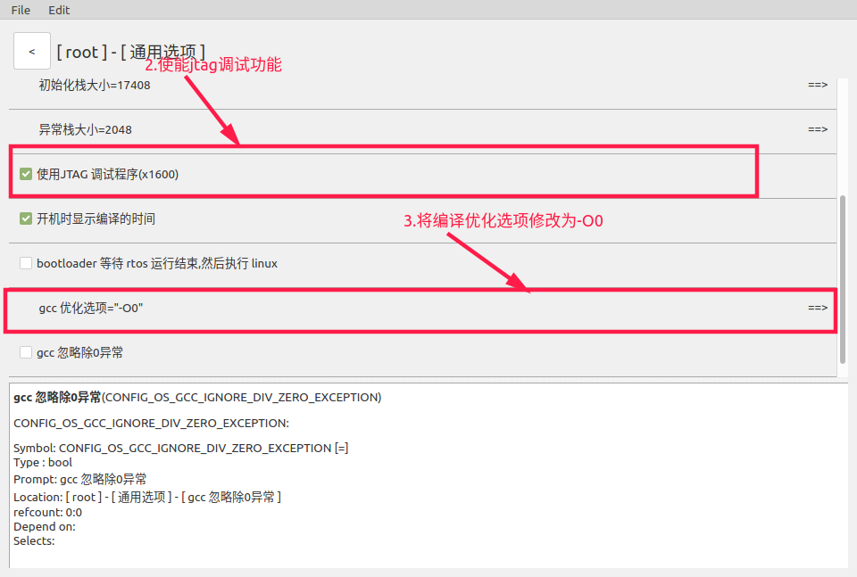
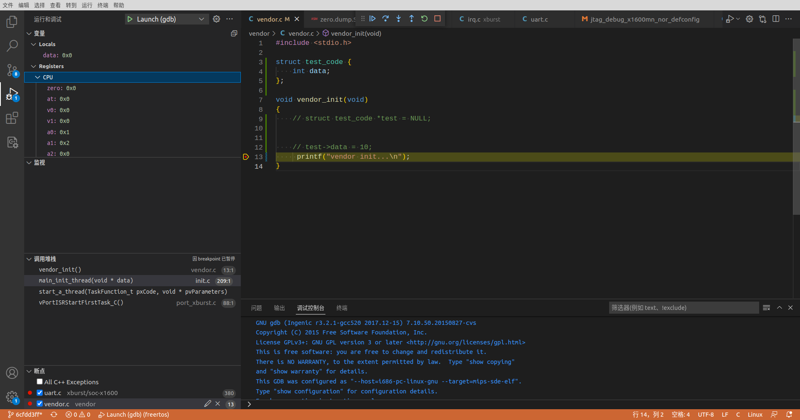
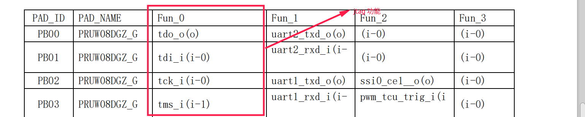
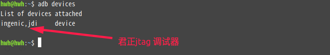
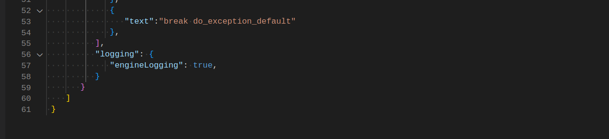

# FreeRTOS_Jtag_Debug使用说明文档

## 1.配置君正jtag 调试器

1. 君正平台下的jtag 的调试依赖于君正的jtag调试器，调试的板子必须有jtag 接口。

2. pc是通过adb 对君正调试器进行控制的，配置文件可通过adb push 添加到君正调试器，配置文件路径在：freertos/example/jtag_debug/ 下。例如：

   ```shell
   adb push freertos/example/jtag_debug/x1600/x1600mn_init.cfg    /              #adb push <PC端的文件路径>  <目标设备的路径>
   ```

3. 通过mips 工具链下的gdb 工具对程序进行调试。在使用君正调试器前请先确保调试器支持将要调试的芯片 ( 目前仅支持x1600系列 ) ，在pc端输入：

   ```
   adb shell
   ```

   进入君正调试器终端说明， 如图：



## 2.vscode环境搭建

这里以linux vscode 环境为例子：

用vscode 打开 freertos 工程， 并在.vscode 创建launch.json和 tasks.json 文件，示例文件在 freertos/example/jtag_debug/目录下

launch.json:

```json
{
    "version": "0.2.0",
    "configurations": [


       // GDB Debugging:
       {
          "program": "${workspaceFolder}/zero.elf",  						 //编译生成的 .elf 文件
          "name": "Launch (gdb)",
          "request": "launch",
          "args": [],
          "stopAtEntry": false,
          "cwd": "${workspaceFolder}",                         						      //工程路径
          "externalConsole": false,
          "internalConsoleOptions": "openOnSessionStart",
          "type": "cppdbg",
          "MIMode": "gdb",
          "miDebuggerPath": "${workspaceFolder}/../tools/toolchains/mips-gcc520-elf/bin/mips-sde-elf-gdb",     //mips 工具链下的gdb 工具
          "miDebuggerArgs": "",
          "targetArchitecture": "mips",
          "preLaunchTask": "build",                                                        // 与task.json 的"label" 字段做匹配
          "customLaunchSetupCommands": [           							// gdb默认启动时，默认运行的命令，可根据需要自行添加
             {
                "description": "gdb 启用整齐打印",
                "text": "-enable-pretty-printing",
                "ignoreFailures": true
             },
             {
                "text":"file ${workspaceFolder}/zero.elf", 
                "ignoreFailures": false
             },
             {
                "text": "target remote localhost:3333",                       //连接调试器
                "ignoreFailures": false
             },
             {
                "text": "monitor reset halt",
                "ignoreFailures": false
             },
             {
                "text": "monitor x1600_init",
                "ignoreFailures": false
             },
             {
                "text": "load",
                "ignoreFailures": false
             },
             {
                "text": "monitor mips32 invalidate all",
                "ignoreFailures": false
             },
             {
                "text":"break do_exception_default"                              //默认在异常加断点。主要目的是当程序进异常能够追踪到调用堆栈
             },
          ],
          "logging": {
             "engineLogging": false,                                                             //gdb 运行的时的log，默认关闭
          }
       }
    ]
 }
```

task.json:

```json
{
    // See https://go.microsoft.com/fwlink/?LinkId=733558
    // for the documentation about the tasks.json format
    "version": "2.0.0",
    "tasks": [
        {
            "label": "make_project",
            "type": "shell",
            "command":"source build/envsetup.sh;make clean;make -j8"   //编译，每次运行调试之前先clean 再编译
        },
        {
            "label": "adb forward",
            "type": "shell",
            "command": "adb forward tcp:3333 tcp:3333",                              //建立转发，为gdb 的连接做准备
        },
        {
            "label":"build",
            "dependsOn":[
                "make_project",
                "adb forward",
            ]
        },
    ]
}
```

## 3.Iconfigtool配置

1. 打开iconfigtools配置工具






2. 将配置好的配置文件，加载到工程，工程目录下输入：

```shell
source build/envsetup.sh
make xxx_defconfig          		 #例如：make  jtag_debug_x1600mn_nor_defconfig
```

3. 在vscode 按 F5 进行调试，如图：(注意：当defconfig 配置文件有改动时，需要在终端make xxx_defconfig， 在vscode 调试才能生效)




## 4.Jtag引脚冲突说明

x1600系列芯片jtag的使用需要用到以下引脚：



当板子已有程序已经用了这些引脚的话，会导致jtag 功能用不了。例如，君正panda开发板，其串口 和 jtag共用一组io，通过硬件跳帽切换功能。在使用jtag前，得先保证板子的程序没初始化过串口。这个时候就不能使用这个串口做printf输出了，可以使用uart0 作printf 输出。

## 5.常见问题及解决方法

### 5.1 用vscode调试时，adb forward 失败

解决办法：

1. 板子断电，并插拔pc与调试器的usb线

2. 在PC终端输入

```shell
adb devices
```

​		确保pc识别到调试器了如图：



### 5.2 gdb连接超时或者一直长时间加载，load文件失败

解决办法：

1. 确保用的是mips 工具链下的gdb 工具，路径为：tools/toolchains/mips-gcc520-elf/bin/mips-sde-elf-gdb

2. 可以修改vscode launch.json文件的“engineLogging”字段，把gdb 运行时的log打开，如图：



3. 确保板子已有程序没有使用jtag的io，可通过烧录一个空文件来排除这个问题。
4. 板子断电，并插拔调试器，重新来过。

