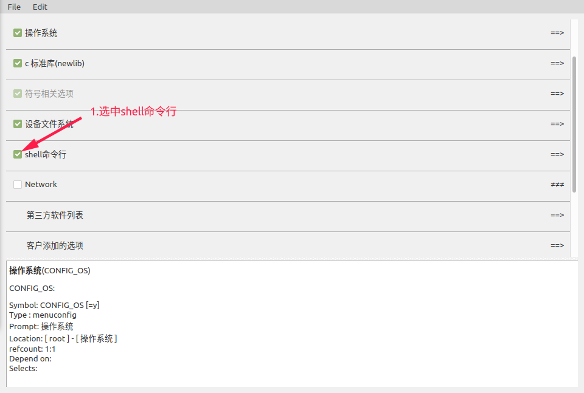

# FreeRTOS Shell 辅助开发

## 1.shell配置流程




## 2.shell详解

### 2.1.GPIO

```c
gpio_get_func_des
功能：查看io口功能说明
参数：无
example：
                     gpio_get_func_des
```

```c
gpio_get_func
功能：获取指定IO功能状态
参数：gpio                       //io口的名字
example：
                     gpio_get_func PA8
```

```c
gpio_set_func <GPIO> <FUNCTION>
功能：设定指定IO功能
参数：gpio                         //io口的名字
              function                //io口功能
example：
                     gpio_set_func PA8 OUTPUT0
```

```c
gpio_set_value <GPIO> <value>
功能：设置io电平
参数：gpio                         //io口的名字
              level                        //io口功能
 example：
                     gpio_set_value PA8 0
"注：io口必须为output状态"
```

```c
gpio_get_value <GPIO>
功能：获取io电平
参数：gpio                         //io口的名字
 example：
                     gpio_set_value PA8
```


### 2.2.I2C

```c
i2c_write <bus_num> <dev_addr> <data0> [data....]
功能：向设备写入数据
参数：bus_num                         //i2c总线（单位：10进制）
             dev_addr                         //设备地址（单位：16进制）
             <data0> [data....]          //数据（单位：16进制）
example：
                      i2c_write 0 0x40 0x11 0x22 0x33
```

```c
i2c_read <bus_num> <dev_addr> <size>
功能：读取设备数据
参数：bus_num                         //i2c总线（单位：10进制）
             dev_addr                         //设备地址（单位：16进制）
             size                                     //读取数据的大小（单位：10进制）
example：
                      i2c_read 0 0x40 2
```

```c
i2c_write_reg <bus_num> <dev_addr> <reg_addr> <data0> [data....]
功能：向寄存器写入数据
参数：bus_num                         //i2c总线（单位：10进制）
             dev_addr                         //设备地址（单位：16进制）
             reg_addr                          //从设备地址（单位：16进制）
             <data0> [data....]          //数据（单位：16进制）
example：
                      i2c_write_reg 0 0x40 0xf0 0x11 0x22 0x33
```

```c
i2c_read_reg <bus_num> <dev_addr> <reg_addr> <size>
功能：读取寄存器数据
参数：bus_num                         //i2c总线（单位：10进制）
             dev_addr                         //设备地址（单位：16进制）
             reg_addr                          //从设备地址（单位：16进制）
             size                                     //读取数据的大小（单位：10进制）
example：
                     i2c_read_reg 0 0x40 0xf0 2
```

```c
i2c_detect <bus_num>
功能：检测该总线的设备
参数：bus_num                         //i2c总线（单位：10进制）
example：
                     i2c_detect 0
```


### 2.3.PWM

```c
pwm_request <gpio> <freq> <max_level> [active_level]
功能：请求pwm和配置
参数：gpio                         //io口的名字
              freq                         //频率
              max_level             //PWM调制的级数
              active_level          //活跃电平
example：
                     pwm_request PC25 2000000 300 1
```

```c
pwm_setlevel <pwm_id> <level>
功能：设置pwm级数
参数：pwm_id                       //PWM 通道号
              level                              //pwm 调制级数，即一个周期内非空闲电平长度
example:
                    pwm_setlevel 0 200
```

```c
pwm_free <pwm_id>
功能：释放pwm资源
参数：pwm_id                       //PWM 通道号
example：
                     pwm_free 0
```


### 2.4.SPI

```c
spi_read_write <BUS_NUM> <CS_GPIO> <CS_VAILD_LEVEL> <PHA> <POL> <DATA0> [DATA....]
功能：SPI传输
参数：BUS_NUM                         //spi总线号
              CS_GPIO                            //cs 脚的 GPIO
              CS_VAILD_LEVEL           //有效电平
              PHA                                     //相位(当PHA=0，表示在第一个跳变沿开始传输数据，下一个跳变沿完成传输
                                                            //           当PHA=1，表示在第二个跳变沿开始传输数据，下一个跳变沿完成传输)
              POL                                      //极性(当POL=0，在时钟空闲即无数据传输时,clk电平为低电平
                                                            //           当POL=1，在时钟空闲即无数据传输时,clk电平为高电平)
              <DATA0> [DATA....]        //数据（单位：16进制）
example:
                    spi_read_write SPI0 PC00 1 PHA0 POL0 0x10 0x20
```


### 2.5.EFUSE

```c
efuse_read <section_id>
功能：从指定的段读取数据
参数：section_id                            //数据段的ID
example：
                      efuse_read CHIP_ID
```


### 2.6.ADC

```c
adc_sample <channel>
功能：获取adc数据
参数：channel                                   //通道号
example：
                      adc_sample 0
```


### 2.7.NOR

```c
nor_write <ADDR> <DATA...>
功能：nor flash写
参数：ADDR                                            //地址（单位：16进制）
             <DATA...>                                     //数据（单位：16进制）
example：
                      nor_write 0x400000 0x11 0x22
```

```c
nor_read <ADDR> <SIZE>
功能：nor flash读
参数：ADDR                                            //地址（单位：16进制）
             SIZE                                              //大小（单位：16进制）
example：
                      nor_read 0x400000 0x2
```


### 2.8.RTC

```c
rtc set_time [year] [mon] [day] [hour] [min] [sec]
功能：设置rtc时间
参数：year                                               //年
             mon                                               //月
             day                                                 //日
             hour                                               //时
             min                                                 //分
             sec                                                  //秒
example：
                      rtc set_time 2019 5 20 23 58 59
```

```c
rtc get_time
功能：获取rtc时间
参数：无
example：
                      rtc get_time
```

```c
rtc set_alarm [second]
功能：设置rtc闹钟
参数：second                                             //秒数
example：
                      rtc set_alarm 5
```


### 2.9.CAMERA

```c
camera_start <switch>
功能：打开或关闭camera
参数：switch                                                //开关（1：开启       0：关闭）
example：
                     1.camera_start 1                    //开启camera
                     2.camera_start 0                    //关闭camera
```

```c
camera_dump
功能：获取camera一帧的图像数据
example：
                     camera_dump
```


### 2.10.THREAD

> thread_dump：可以查看线程当前的函数调用，可以用来排查线程是否卡死
>
> top：能够实时显示系统中各个进程的cpu占用状况，用来查看cpu的负载率

```c
thread_list
功能：查看线程列表
```

```c
thread_dump <thread_name/thread_id>
功能：查看指定线程
参数：thread_name/thread_id                             //线程名字或者id
example：
                      1.thread_dump shell
                      2.thread_dump 3
```

```c
top
功能：显示操作系统进程信息
```


### 2.11.WAKELOCKS

> 当打开休眠功能，所有线程释放wakelock锁时，系统进入低功耗模式。
>
> wake_locks_show可以用来查看哪些线程持锁

```c
wake_locks_show
功能：显示持唤醒锁的线程
```


### 2.12.MEM

> 可用于直接读取或修改内存和寄存器的值。可以动态修改寄存器和读取寄存器。

```c
memdump <unit> <startaddr> <size>
功能：打印地址内的内容
参数：unit                                                    //数据类型
              startaddr                                         //起始地址（单位：16进制）
              size                                                     //大小（单位：10进制）
example：
                      memdump char 0x81000000 1024
```

```c
memset <unit> <startaddr> <data0> [data...]
功能：往内存里写入数据
参数：unit                                                    //数据类型
              startaddr                                         //起始地址（单位：16进制）
              <data0> [data...]                          //数据（单位：16进制）
example：
                      memset char 0x81000000 0x11 0x22
```

```c
memclear <unit> <startaddr> <value> <size>
功能：向一段内存范围内写入数据
参数：unit                                                    //数据类型
              startaddr                                         //起始地址（单位：16进制）
              value                                                 //数据（单位：16进制）
              size                                                     //大小（单位：10进制）
example：
                      memclear char 0x81000000 0xFF 1024
```

```c
memcpy <destaddr> <srcaddr> <size>
功能：内存拷贝
参数：destaddr                                          //用于存储复制内容的地址（单位：16进制）
              srcaddr                                            //要复制的数据的地址（单位：16进制）
              size                                                     //大小（单位：10进制）
example：
                      memcpy  0x81001000 0x81000000 1024
```

### 2.13.USB

> usb_device_test_mode：可用于对USB设备进行眼图分析
>
> 操作流程:
>
> 1、将设备连接主机，并等待设备枚举成功
>
> 2、设置设备为Packet模式
>
> 3、取消设备与主机连接
>
> 4、进行眼图分析

```c
usb_device_test_mode [mode]
功能：对USB设备进行测试
参数：mode       // 模式
                                // mode == 0 取消测试模式
                                // mode == 1 测试 J 模式
                                // mode == 2 测试 K 模式
                                // mode == 3 测试 SE0_NAK 模式
                                // mode == 4 测试Packet模式
                                // mode == 5 强制启动测试模式
example：
                     usb_device_test_mode   4
```

### 2.14.OTHERS

```
help
功能：打印当前所有命令

cat
功能：显示文件内容

cd
功能：更改当前目录

df
功能：报告文件系统磁盘空间使用情况

echo
功能：回显字符串到文件

history
功能：显示命令历史

ls
功能：列出目录内容

mkdir
功能：建立新目录

mv
功能：移动（重命名）文件

pwd
功能：打印当前/工作目录的位置

rm
功能：删除文件/目录

lsmod
功能：显示内核中已经安装的模块

insmod
功能：将模块安装入内核

rmmod
功能：从内核中删除模块
```

