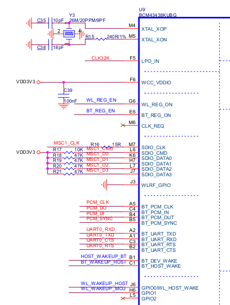

# FreeRTOS 功耗调试说明文档


> NOTE：如何编译工程请查阅《FreeRTOS编译工程说明》、烧录工程请查阅《FreeRTOS烧录工程简介》。


本说明使用 x1000 ilock_core_v2.0 (仅保留CPU、FLASH、RTC 供电，其他器件全部摘除)开始进行功耗调试，并在后续增加一个BT&WIFI模块来描述功耗调试的全过程。


## 1.功耗调试步骤

##### 步骤一、使用 IConfigTool 打开对应soc的配置文件xxx_nand_defconfig/xxx_nor_defconfig，勾选 *休眠功能(CONFIG_X1000_PM)*，取消勾选不需要用到的驱动，保存配置。参考 example/driver/low_power_gpio_set_test_example.c 添加低功耗调试代码，并编译，如：

```
$make x1000_nand_defconfig
$make -j
```

##### 步骤二、根据原理图，对于悬空的管脚一律设置成输出低电平并且NO PULL状态：

```c
gpio_set_func(GPIO_PX(x), (GPIO_OUTPUT0 | GPIO_PULL_HIZ));
```

##### 步骤三、对于外接上拉电阻或下拉电阻，电源或接地的GPIO，设置成输入并且NO PULL状态：

```c
gpio_set_func(GPIO_PX(x), (GPIO_INPUT | GPIO_PULL_HIZ));
```

对于外接上拉电阻或下拉电阻，电源或接地的GPIO，因为直接设置成高电平或低电平可能会因为GPIO输出的电平与外接的电平不相等，导致功耗增加，所以建议设置成输入并且NO PULL状态。

##### 步骤四、逐一增加外设，这里以增加一个BT&WIFI模块(BCM43438KUBG)为例：

> 本例目的只是为了引导用户如何调试出最低功耗，所以直接对BT&WIFI模块失能后进行功耗的调试。在系统唤醒之后不保证BT&WIFI模块能否正常工作。想要达到唤醒之后能正常工作的效果，还得根据BT&WIFI模块的休眠唤醒流程对具体的 IO 进行操作。

在ilock_core_v2.0原理图中需要重点关注的GPIO如下图所示：



根据原理图可知，MSC1_CMD、MSC1_D0－D3都外接了上拉电阻，所以都设置成：

```c
gpio_set_func(GPIO_PX(x), (GPIO_INPUT | GPIO_PULL_HIZ));
```

对于BT_REG_ON、WL_REG_ON外设的使能脚，通过拉低电平来失能BT&WIFI模块:

```c
gpio_set_func(GPIO_PX(x), (GPIO_OUTPUT0 | GPIO_PULL_HIZ));
```

其他引脚如，BT_PCM_CLK、BT_PCM_IN、BT_PCM_OUT等，直接设置成输出低电平，并且NO PULL状态。


> NOTE：
>
> ##### 1、需要注意的是如果在休眠期间不希望BT&WIFI模块断电的用户，需要确认模块各个引脚的状态，否则休眠后可能导致功耗增加。可能使功耗增加的原因如下：
>
> 1) 外设本身引脚默认是输入模式且自带上拉电阻的情况下，设置成低电平，或者外设本身引脚默认是输入模式且自带下拉电阻的情况下，设置成高电平。这两种情况都会产生压差，导致功耗增加。
>
> 2) 外设本身引脚输出电平与CPU输出的电平不一致产生压差，导致功耗增加。
>
> ###### 2、在设备没有断电的情况下，直接设置成输出高电平或低电平可能会产生无效的时序，如BT&WIFI模块的SDIO_CLK，CPU把对应引脚直接设置成输出高电平或低电平可能会产生一个时钟信号，这会导致设备启动不期望地通讯传输，甚至造成唤醒之后设备不可用的现象。所以在设备不掉电的情况下，这些特殊引脚用户需要谨慎操作。
>
> 以上，对BT&WIFI模块调试的方法同样适用于其他外设。


##### 步骤五、以此类推，继续增加其他外设。

##### 步骤六、在完成以上步骤之后，可根据需要把对应引脚的配置移植到对应的驱动中。


## 2、特殊说明

##### 1、在 drivers/pm.c 文件中，提供了 *pm_gpio_low_power_set_init*、*pm_gpio_low_power_runtime_set_before_sleep*、*pm_gpio_low_power_runtime_set_after_sleep* 空函数，用户可根据需求自己实现。具体可参考 example/driver/low_power_gpio_set_test_example.c

##### 2、对于作为 sfc flash 功能的引脚一般不作处理；

##### 3、对于已经外接了 i2c 设备的 i2c 引脚一般不作处理。若 i2c 引脚不外接 i2c 设备，可以当成一个外接上拉电阻的普通IO，设置成输入并且NO PULL状态即可；

##### 4、用户在休眠前可以通过 *gpio_get_func* 命令获取gpio状态并根据需要保存记录，方便唤醒时恢复IO状态，具体可以参考《FreeRTOS_Shell辅助开发.pdf》。

