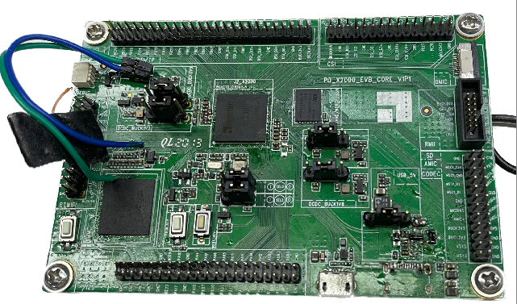
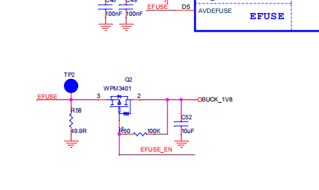
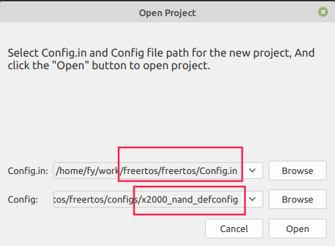
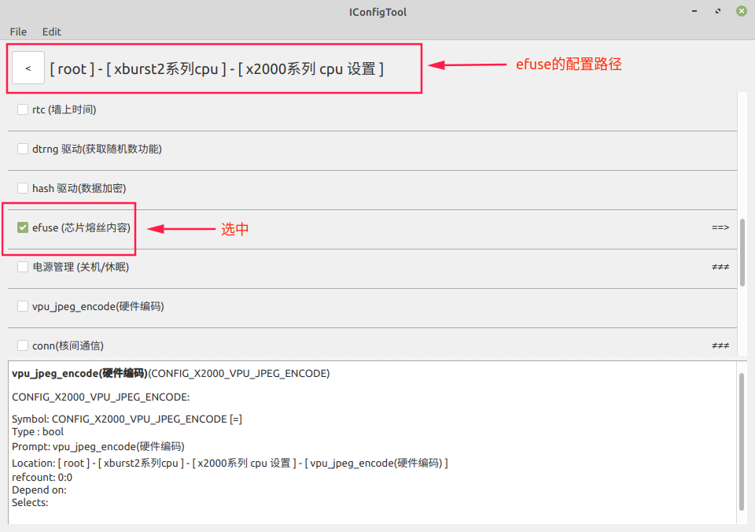
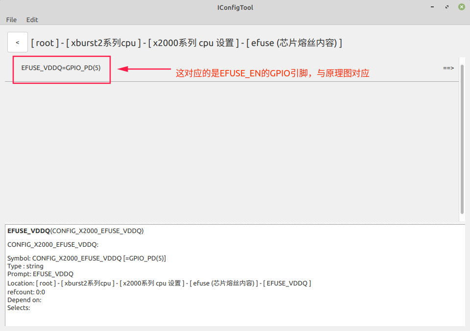
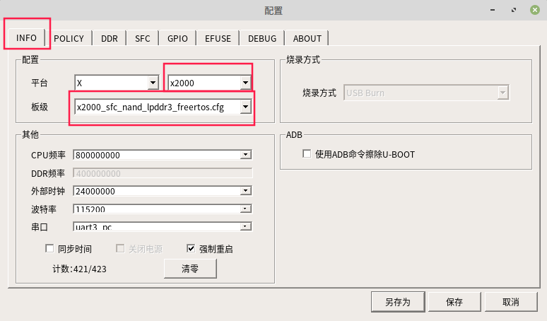
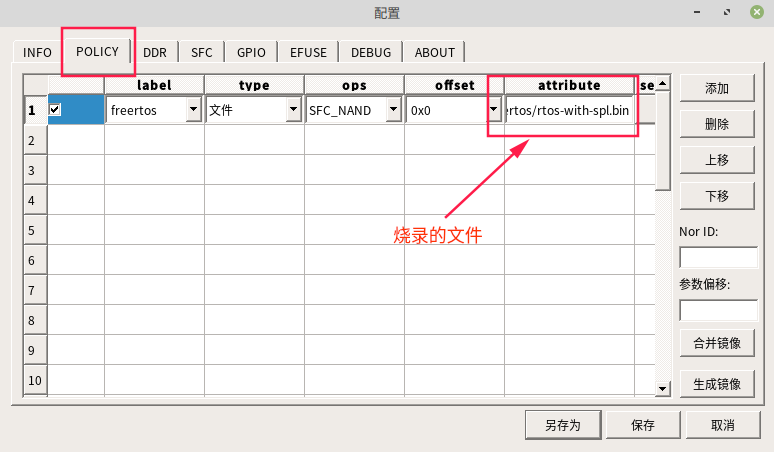
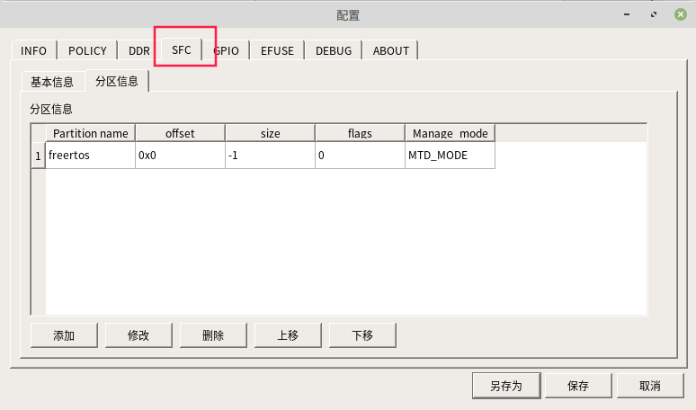

# Freertos_x2000efuse驱动

***写在前面的说明：***

​	1.本文硬件平台：PD_x2000_EVB_CORE_V1P1

​	

​	2.本文的使用的配置文件：x2000_nand_defconfig

## 一 原理介绍

​		efuse类似于EEPROM，是一次性可编程存储器，在芯片出厂之前会被写入信息，在一个芯片中，efuse的容量通常很小，x2000的efuse为2Kb，这些位被单独分成14个段，每个段可以单独编程。

​		efuse里面一般存储芯片的版本号，生产日期和校验位。

​		**注意：**efuse只能由0写为1,不能由1写0。

### 	硬件电路



​		对efuse进行编程时，要给AVDEFUSE引脚提供少于200MS的1.8V电压。efuse的AVDEFUSE引脚的电压由EFUSE_EN对应的IO口控制。

## 二 实现

iConfigTool的工具的配置流程：

**打开iConfigTool工具**



**使能efuse驱动**



**配置efuse_en的使能引脚**



修改完成配置后保存。

### 1.编译系统

```shell
cd freertos
source build/envsetup.sh
make x2000_nand_defconfig
make
```


### 2.烧录系统

#### 1>板极选择



#### 2>烧录的文件



#### 3>分区信息



## 三 读取efuse和对efuse进行编程

### 1.读取efuse

```shell
#打开串口工具，使用下列命令
efuse_read<section_id>
#功能：从指定的段读取数据
#参数：section_id		数据段的ID
#Read data from the specified segment of efuse
#        section_id:             section_size:
#       CHIP_ID                 17
#       CUSTOMER_ID0            17
#       CUSTOMER_ID1            29
#       CUSTOMER_ID2            29
#       TRIM_DATA0              5
#       TRIM_DATA1              5
#       TRIM_DATA2              5
#       SOC_INFO                5
#       PROGRAM_PROTECT         4
#       HIDE_BLOCK              4
#       CHIP_KEY                34
#       USER_KEY0               34
#       USER_KEY1               34
#       NKU                     34
#example:
#		 efuse_read CHIP_ID
```

### 2.对efuse进行编程

```c
#include <shell.h>
#include <driver/efuse.h>
#include <soc/gpio.h>
#include <driver/gpio.h>
#include <stdlib.h>
#include <config.h>
#include <string.h>

#define X2000_EFUSE_SEG_CNT 14
static const char *seg_name[] = {
    "CHIP_ID",
    "CUSTOMER_ID0",
    "CUSTOMER_ID1",
    "CUSTOMER_ID2",
    "TRIM_DATA0",
    "TRIM_DATA1",
    "TRIM_DATA2",
    "SOC_INFO",
    "PROGRAM_PROTECT",
    "HIDE_BLOCK",
    "CHIP_KEY",
    "USER_KEY0",
    "USER_KEY1",
    "NKU",
};

static unsigned int seg_size[] = {
    [CHIP_ID] = CHIP_ID_SIZE,
    [CUSTOMER_ID0] = CUSTOMER_ID_SIZE0,
    [CUSTOMER_ID1] = CUSTOMER_ID_SIZE1,
    [CUSTOMER_ID2] = CUSTOMER_ID_SIZE2,
    [TRIM_DATA0] = TRIM_DATA_SIZE0,
    [TRIM_DATA1] = TRIM_DATA_SIZE1,
    [TRIM_DATA2] = TRIM_DATA_SIZE2,
    [SOC_INFO] = SOC_INFO_SIZE,
    [PROGRAM_PROTECT] = PROGRAM_PROTECT_SIZE,
    [HIDE_BLOCK] = HIDE_BLOCK_SIZE,
    [CHIP_KEY] = CHIP_KEY_SIZE,
    [USER_KEY0]= USER_KEY_SIZE0,
    [USER_KEY1] = USER_KEY_SIZE1,
    [NKU] = NKU_SIZE,
};

void vendor_init(void)
{
    printf("vendor init......!\n");
//在未对efuse进行编程前，在串口打印一遍所有段的数据内容
    int j = 0;
    for (j = 0; j <= NKU; j++) {
        int i = 0;
        unsigned int section_id = j;
        unsigned int size = seg_size[section_id];
        unsigned char *resv = (unsigned char *)malloc(size);
        memset(resv, 0, size);
        printf("-----------id = %d\n", section_id);
        int ret = efuse_read_segment(section_id, resv, size);
        if (ret == 0) {
            for (i = 0; i < size; i++) {
                printf("0x%02X ", resv[i]);
                if (((i + 1) % 10) == 0)
                    printf("\n");
            }
            printf("\n\n");
        } else {
            printf("efuse read segment failure\n");
        }

        free(resv);
    }

//对CUSTOMER_ID0段进行编程
    unsigned int seg_id = CUSTOMER_ID0;//选择哪个段
    unsigned int size = seg_size[seg_id];//获取段的大小
    unsigned char *buf = malloc(size);
    memset(buf, 0 , size);
    if(buf == NULL)
    {
        printf("malloc buf failure\n");
        return ;
    }
    buf[16] = 0x05;//将什么数据写到第几位
    efuse_write_segment(seg_id, buf, size);//对段编程的函数

//在对efuse进行编程后，在串口打印一遍所有段的数据内容，观察数据的位置是否与想写入的位置相同
    for (j = 0; j <= NKU; j++) {
        int i = 0;
        unsigned int section_id = j;
        unsigned int size = seg_size[section_id];
        unsigned char *resv = (unsigned char *)malloc(size);
        memset(resv, 0, size);
        printf("-----------id = %d\n", section_id);
        int ret = efuse_read_segment(section_id, resv, size);
        if (ret == 0) {
            for (i = 0; i < size; i++) {
                printf("0x%02X ", resv[i]);
                if (((i + 1) % 10) == 0)
                    printf("\n");
            }
            printf("\n\n");
        } else {
            printf("efuse read segment failure\n");
        }

        free(resv);
    }

}
```

结果如下：


可以看到0x05写到了对应的位置。