# 1. 报告描述符(Report Descriptor）


​         报告描述符不同于其他描述符，因为它不仅仅是一个值表。 报告描述符的长度和内容取决于设备的一个或多个报告所需的数据字段数量。 报告描述符由提供有关设备信息的项目组成。 项目的第一部分包含三个字段：项目类型，项目标签和项目大小。 这些字段一起标识了项目提供的信息的类型。

​        共有三种项目类型：主要(Main)，全局(Global)和局部(Local)。 当前定义了五个主要(Main)项目标签：

- Iuput:引用来自设备上一个或多个类似控件的数据。 例如，可变(var)数据（例如读取单个轴或一组杠杆的位置）或(arr)阵列数据（例如一个或多个按钮或开关）。

- Output:将数据引用到设备上的一个或多个类似控件，例如设置单个轴或一组杠杆的位置（可变数据var）。 或者，它可以将数据表示到一个或多个LED（arr阵列数据）。

- Feature:描述不供最终用户使用的设备输入和输出，例如，软件功能或控制面板切换。
- Collection:输入项(Iuput)，输出项(Output)和功能项(Feature)的有意义的分组，例如，鼠标，键盘，操纵杆和指针。
- End Collection:一个终止项，用于指定项集合的结尾。

​         报告描述符提供对设备中每个控件提供的数据的描述。 每个Main项目标签（Input，Output或Feature）标识由特定控件返回的数据的大小，并标识该数据是绝对的还是相对的，以及其他相关信息。 前面的Local和Global项定义了最小和最大数据值，依此类推。 报告描述符是设备所有项目的完整集合。 通过仅查看报告描述符，应用程序便知道如何处理传入的数据以及该数据的用途。

​         来自控件的一个或多个数据字段由一个Main项定义，并由前面的Global和Local项进一步描述。 局部项(Local)仅描述下一个Main项定义的数据字段。 全局项目成为该描述符中所有后续数据字段的默认属性。 例如，考虑以下情况（为简洁起见，省略了详细信息）：

```c
Report Size (3)
Report Count (2)
Input
Report Size (8)
Input
Output
```

​         项目解析器解释上面的报告描述符项并创建以下报告（LSB在左侧）

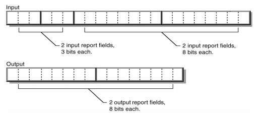

报告描述符可能包含几个主要项目。 报告描述符必须包含以下各项，以描述控件的数据（所有其他项都是可选的）

- Input (Output or Feature)
- Usage
- Usage Page
- Logical Minimum
- Logical Maximum
- Report Size
- Report Count

以下是用于定义三键鼠标的项目的编码示例。 在这种情况下，Main项之前是Usage，Report Count或Report Size等全局项（每行都是一个新项）。

```c
Usage Page (Generic Desktop), //使用通用桌面使用情况页面
Usage (Mouse),
 Collection (Application),            //开始鼠标集合
 Usage (Pointer),
 Collection (Physical),                  //开始指针集合
 Usage Page (Buttons)
 Usage Minimum (1),
 Usage Maximum (3),
 Logical Minimum (0),
 Logical Maximum (1),               //字段返回值从0到1
 Report Count (3),
 Report Size (1),                           //创建三个1位字段（按钮1、2和3）
 Input (Data, Variable, Absolute),//将字段添加到输入报告中。
 Report Count (1),
 Report Size (5),                         //创建5位常量字段
 Input (Constant),                     //在输入报告中添加字段
 Usage Page (Generic Desktop),
 Usage (X),
 Usage (Y),
 Logical Minimum (-127),
 Logical Maximum (127),      //字段返回值从-127到127
 Report Size (8),
 Report Count (2),                   //创建两个8位字段（X和Y位置）
 Input (Data, Variable, Relative), //将字段添加到输入报告中
 End Collection,                      //关闭指针集合
End Collection                        //关闭鼠标集合
```


## 1.1.项目类型和标签（Items Types and Tage）

所有项目都包含一个1字节的前缀，表示该项目的基本类型。 HID类为项目定义了两种基本格式：

- 短项(Short items)：总长度1-5个字节； 用于最常见的物品。 简短项目通常包含1或0字节的可选数据。
- 长项(Long items) ：3 – 258字节长； 用于需要较大零件数据结构的项目。

> 本规范仅定义使用短格式的项目。
> 不应将这两种项目格式与诸如Main，Global和Local之类的项目类型混淆。


### 1.1.1.短项目(Short items)


#### 1.1.1.1.描述

短项目(Short items)格式将项目大小，类型和标签打包到第一个字节中。 根据数据的大小，第一个字节后可以跟0、1、2或4个可选数据字节。

#### 1.1.1.2.组成

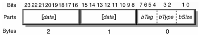

| 组成   | 描述                                                         |
| ------ | ------------------------------------------------------------ |
| bSize  | 指定数据大小的数值表达式：<br />0 = 0 byte<br />1 = 1 byte<br />2 = 2 byte<br />3 = 4 byte |
| bType  | 标识项目类型的数值表达式：<br />0 = Main<br />1 = Global<br />2 = Local<br />3 = Reserved |
| bTag   | 指定项目功能的数值表达式                                     |
| [data] | 可选数据                                                     |

> Remarks
>
> - 短项目标签（Short item tag）没有与之相关的bSize的明确值。 而是由项目数据部分的值确定项目的大小。 即，如果可以用一个字节表示项目数据，则可以将数据部分指定为1个字节，尽管这不是必需的。
> - 如果期望较大的数据项，但如果其所有高阶位均为零，则仍可以缩写。 例如，其中字节1、2和3均为0的32位部分可以缩写为一个字节。
> - 短项目标签（Short item tag）分为三类：主标签（Main），全局标签（Global）和局部标签（Local）。 商品类型（bType）指定标签类别，并因此指定商品的特性。


### 1.1.2.长项目(Long items)


#### 1.1.2.1.描述

​         与短项目(Short items)格式一样，长项目(Long items)格式将项目大小，类型和标签打包到第一个字节中。 长项目(Long items)格式使用特殊的项目标签值来表示它是长项目。 Long item size和Long item tag均为8位数量。 项目数据最多可包含255个字节的数据。

#### 1.1.2.2.组成

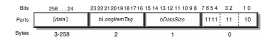

| 组成           | 描述                                                         |
| -------------- | ------------------------------------------------------------ |
| bSize          | 数值表达式，用于指定项的总大小，其中大小为 10（2个字节）。表示项目类型为Long。 |
| bType          | 标识项目类型的数值表达式：<br />3 = Reserved                 |
| bTag           | 用于指定项目功能的数字表达式。总是1111。                     |
| [bDataSize]    | 长项目(Long items)数据的大小。                               |
| [bLongItemTag] | 长项目(Long items)标签。                                     |
| [data]         | 可选数据项。                                                 |

> 重要：本文档中未定义长项目(Long items)标签。 这些标签保留供将来使用。 标签xF0–xFF由供应商定义。


### 1.1.3. 主要项目(Main Items)


#### 1.1.3.1. 描述

主要项目(Main Items)用于在报表描述符中定义或分组某些类型的数据字段。 主要项目(Main Items)有两种类型：数据和非数据。 数据类型主要项目用于在报表中创建一个字段，包括输入，输出和功能。 其他项不会创建字段，因此称为非数据主项。

#### 1.1.3.2. 组成

| 主要项目标签   | 一字节前缀（ nn 代表大小值） | 有效数据和描述                                               |
| -------------- | ---------------------------- | ------------------------------------------------------------ |
| Input          | 1000 00nn                    | Bit 0                  {Data(0) \| Constant(1)}<br />Bit 1                  {Array(0) \| Variable(1)}<br />Bit 2                  {Absolute(0) \| Relative(1)}<br />Bit 3                  {No Wrap(0) \| Wrap(1)}<br />Bit 4                  {Linear(0) \| Non Linear(1)}<br />Bit 5                  {Preferred State (0) \| No Preferred (1)}<br />Bit 6                  {No Null position (0) \| Null state(1)}<br />Bit 7                  Reserved(0)<br />Bit 8                  {Bit Field (0) \| Buffered Bytes (1)}<br />Bit 9~31           Reserved(0) |
| Output         | 1001 00nn                    | Bit 0                  {Data(0) \| Constant(1)}<br />Bit 1                  {Array(0) \| Variable(1)}<br />Bit 2                  {Absolute(0) \| Relative(1)}<br />Bit 3                  {No Wrap(0) \| Wrap(1)}<br />Bit 4                  {Linear(0) \| Non Linear(1)}<br />Bit 5                  {Preferred State (0) \| No Preferred (1)}<br />Bit 6                  {No Null position (0) \| Null state(1)}<br />Bit 7                  Reserved(0)<br />Bit 8                  {Bit Field (0) \| Buffered Bytes (1)}<br />Bit 9~31           Reserved(0) |
| Feature        | 1011 00nn                    | Bit 0                  {Data(0) \| Constant(1)}<br />Bit 1                  {Array(0) \| Variable(1)}<br />Bit 2                  {Absolute(0) \| Relative(1)}<br />Bit 3                  {No Wrap(0) \| Wrap(1)}<br />Bit 4                  {Linear(0) \| Non Linear(1)}<br />Bit 5                  {Preferred State (0) \| No Preferred (1)}<br />Bit 6                  {No Null position (0) \| Null state(1)}<br />Bit 7                  Reserved(0)<br />Bit 8                  {Bit Field (0) \| Buffered Bytes (1)}<br />Bit 9~31           Reserved(0) |
| Collection     | 1010 00nn                    | 0x00                  Physical (group of axes)<br />0x01                  Application (mouse, keyboard) <br/>0x02                  Logical (interrelated data) <br/>0x03                  Report <br/>0x04                  Named Array <br/>0x05                  Usage Switch <br/>0x06                  Usage Modifier <br/>0x07-0x7F       Reserved <br/>0x80-0xFF       Vendor-defined |
| End Collection | 1100 00nn                    | 不适用。         关闭项目集合                                |
| Reserved       | 1101 00nn to 1111 00nn       | 不适用。         为将来的项目保留。                          |

> 注意：
>
> - 所有主要项目(Main Items)的默认数据值为零（0）。
> - 输入项目的数据大小为零（0）字节。 在这种情况下，该项目的每个数据位的值可以假定为零。 这在功能上与使用项目标签相同，该标签指定一个4字节的数据项，后跟四个零字节。


### 1.1.4. 输入，输出和功能项(Input, Output, and Feature Items)


#### 1.1.4.1. 描述

输入，输出和功能项用于在报表中创建数据字段。

- 输入项目（ Input ）描述有关一个或多个物理控件提供的数据的信息。 应用程序可以使用此信息来解释设备提供的数据。 单个项目中定义的所有数据字段共享相同的数据格式。一个输入报表包含一个或多个 Input 项目，主机使用中断输入传输来请求输入报表。
- 输出项目（Output）用于在报告中定义输出数据字段。一个输出报表包含一个或多个 Outpot项目。 输出报表包含控制状态的数据。此项类似于输入项， 除了描述发送到设备的数据（例如，LED状态）。
- 功能项目（Feature）描述了可以发送到设备的设备配置信息。主机使用 Set_Report 与 Get_Report 请求来传送与接收特征报表。

#### 1.1.4.2. 组成

| 位   | 组成                            | 值     | 描述                                                         |
| ---- | ------------------------------- | ------ | ------------------------------------------------------------ |
| 0    | Data \| Constant                | 0 \| 1 | 指示该项目是数据还是常数。<br />数据(Data):表示该项目正在定义包含可修改设备数据的报告字段。<br />常量(Constant):表示项目是报表中的静态只读字段，并且不能由主机修改（写入）。 |
| 1    | Array \| Variable               | 0 \| 1 | 指示项目是在报表中创建变量(Variable)还是数组(Array)数据字段。<br />在变量(Variable)字段中，每个字段代表来自物理控件的数据。为每个字段保留的位数由前面的“报告大小/报告计数”项确定。<br />例如，可以在变量输入项声明的1个字节中报告一组八个开关，其中每个位代表一个开关（打开（1）或关闭（0））（报告大小= 1，报告计数= 8）） 。或者，变量Input项可以添加1个报告字节，用于表示四个三位按钮的状态，其中每个按钮的状态由两位表示（Report Size = 2，Report Count = 4）。或来自可变输入项的1个字节可以表示操纵杆的x位置（报告大小= 8，报告计数= 1）。<br />数组提供了一种替代方法，用于描述从一组按钮返回的数据。如果数组不如可变项灵活，则数组效率更高。数组不为组中的每个按钮返回单个位，而是在每个字段中返回与所按按钮相对应的索引（如键盘扫描代码）。和数组字段中的值超出范围被认为未声明任何控件。数组中同时按下的按钮或键需要在多个字段中报告。<font color=#FF0000>因此，数组输入项中的字段数（报告计数）决定了可以报告的同时控件的最大数目。</font><br />键盘可以使用具有三个8位字段的数组（报告大小= 8，报告计数= 3）来报告多达三个同时键。逻辑最小值指定数组返回的最低索引值，而逻辑最大值指定最大的索引值。可以通过检查逻辑最小值和逻辑最大值之间的差来推导数组中的元素数量（元素数量=逻辑最大值-逻辑最小值+ 1）。 |
| 2    | Absolute \| Relative            | 0 \| 1 | 指示数据是绝对数据(Absolute)（基于固定原点）还是相对数据(Relative)（指示上一次报告的值变化）。<br /> 鼠标设备通常提供相对数据，而平板电脑通常提供绝对数据。 |
| 3    | No Wrap \| wrap                 | 0 \| 1 | 指示数据达到极高或极低值时是否“翻转”。 例如，可以自由旋转360度的拨盘可能会输出0到10的值。<br />如果显示Wrap，则在沿递增方向经过10位置后报告的下一个值将为0。 |
| 4    | Linear \| Nonlinear             | 0 \| 1 | 指示是否已以某种方式处理了来自设备的原始数据，并且不再表示所测量的数据与报告的数据之间的线性关系。 <br />加速度曲线和操纵杆死区就是此类数据的示例。 灵敏度设置会影响“单位”项，但数据仍然是线性的。 |
| 5    | Preferred State \| No Preferred | 0 \| 1 | 指示控件是否具有首选状态，<br />当用户未与控件进行物理交互时，控件将返回到该状态。 按钮（与切换按钮相对）和自动居中操纵杆就是示例。 |
| 6    | No Null Position \| Null State  | 0 \| 1 | 指示控件是否处于未发送有意义的数据的状态。 <br />空状态的一种可能用途是用于控件，要求用户与控件进行物理交互才能报告有用的数据。 <br />例如，某些操纵杆具有多向开关（帽子开关）。 当没有按下帽子开关时，它处于空状态。 当处于空状态时，控件将报告一个超出指定的逻辑最小值和逻辑最大值的值（最负的值，例如8位值为-128）。 |
| 7    | Non-volatile \| Volatile        | 0 \| 1 | 指示功能或输出控件的值是否应由主机更改。<br />可变的输出可以在有或没有主机相互作用的情况下改变。 为避免同步问题，可变控件应尽可能是相对的。 如果可变的输出是绝对的，则在发送Set Report (Output)时，请求将您不想更改的任何控件的值设置为指定的“逻辑最小值”和“逻辑最大值”之外的值（最负的值，例如- 8位值为128）。 设备将忽略对控件的无效输出。<br /><font color=#FF0000>输入（input）项目的数据位7未定义，为保留以备将来使用。</font> |
| 8    | Bit Field \| Buffered Bytes     | 0 \| 1 | 指示控件发出固定大小的字节流。 <br />数据字段的内容由应用程序确定。 缓冲区的内容不解释为单个数字。 由“缓冲字节”项定义的报告数据必须在8位边界上对齐。 来自条形码读取器的数据就是一个示例。 |
| 9~31 | Reserved                        | 0      | 保留以备将来使用。                                           |

> 注意：
>
> - 如果输入项（input）是一个数组，则仅应用“数据/常量(Data / Constant)”，“变量/数组(Variable / Array)”和“绝对/相对(Absolute / Relative)”属性。
> - 可以通过检查Report Size和Report Count值来确定项目中数据字段的数量。 例如，Report Size为8位且Report Count为3的项目具有三个8位数据字段。
> - 数组(Array)项返回的值是一个索引，因此建议：
>   1）当没有声明数组中的任何控件时，Array字段将返回0值。
>   2）逻辑最小值等于1。
>   3）逻辑最大值等于数组中的元素数。
> - 输入项定义可通过控制管道使用以下命令访问的输入报告：
>   Get_Report（input）请求。
> - 输入类型报告也通过中断输入管道以轮询速率发送。
> - 输出项目（output）的 数据|常数、变量|数组、绝对值|相对值、非线性、翻转和空状态数据与输入项目的数据相同。
> - 输出项目可以使用控制管道访问输出报告：
>   Set_Report（output）命令。
> - 输出类型报告可以选择通过中断输出管道发送。
>     虽然功能相似，但输出和功能项在以下方面有所不同
>   方法：
>
>          1.  功能项定义了设备的配置选项，通常由控制面板应用程序设置。 因为它们影响设备的行为（例如:按钮重复率，重置原点等），所以功能项通常对软件应用程序不可见。 相反，输出项代表向用户输出的设备(例如，LED，音频，触觉反馈，等等)。 软件应用程序可能会设置设备输出项目。
>             2.  功能项可以是其他项的属性。 例如，原点重置功能可能会应用于一个或多个位置输入项。 与输出项目一样，功能项目构成了功能报告，可通过控制管道使用Get_Report（Feature）和Set_Report（Feature）请求进行访问。


### 1.1.5. 集合和结束集合项(Collection, End Collection Items )


#### 1.1.5.1. 描述

​         集合项（Collection）标识两个或多个数据（输入，输出或功能）之间的关系。例如，鼠标可以描述为两个到四个数据（x，y，按钮1，按钮2）的集合。 当集合项（Collection）打开数据收集时，结束集合项（End Collection）关闭集合。

​          所有的报表类型都可以使用 Collection 与 End Collection 项目来将相关的 Main 类型项目组成群组。 这两个项目分别用于打开和关闭集合。 所有在 Collection 与 End Collection项目之间的 Main 类型项目都是 Collection 的一部分。

​         Collection 有 3 种类型： Application 、 Physical 与 Logical ，其项目的数据项的值分别为 1、 0 和 2。厂商也可以自己定义 Collection 类型，数据项的值为 80h~FFh 保留给厂商定义。 End Collection 项目无数据项。

​         Application Collection 包含有共同用途的项目或执行单一功能的项目。例如键盘的开机描述符将键盘的按键与 LED 指示灯数据集合成一个 Application Collection 。 所有的报表必须在一个 Application Collection 内。

​         Physical Collection 包含在一个单一几何点上的数据项目，可以将每个位置的数据集合成一个 Physical Collection 。在设备报告多个传感器的位置的时候，使用 Physical Collection 指明不同的数据来自不同的传感器。Logical Collection 形成一个数据结构，包含由 Collection 所连结的不同类型的项目。例如数据缓冲区的内容以及缓冲区内字节数目的计数。

#### 1.1.5.2. 组成

| 集合类型                         | 值                           | 描述                                                         |
| -------------------------------- | ---------------------------- | ------------------------------------------------------------ |
| Physical<br />(物理)             | 0x00                         | 物理集合用于表示在一个几何点处收集的数据点的一组数据项。 这对于可能需要将测量或感测的数据集与单个点相关联的感测设备是有用的。 它并不表示一组数据值来自一个设备，例如键盘。 对于报告多个传感器位置的设备的情况下，物理集合用于显示来自每个单独传感器的数据。 |
| Application<br />(应用)          | 0x01                         | 应用程序可能熟悉的一组主要项目。它还可以用于识别单个设备中用于不同目的的项目组。常见的例子是键盘或鼠标。具有集成定点设备的键盘可以被定义为两个不同的应用程序集合。数据报告通常（但不一定）与应用程序集合相关联（每个应用程序至少一个报告ID）。 |
| Logical<br />(逻辑)              | 0x02                         | 当一组数据项形成复合数据结构时，使用逻辑集合。 一个例子是数据缓冲区和数据的字节数之间的关联。 该集合建立计数和缓冲区之间的链接。 |
| Report<br />(报告)               | 0x03                         | 定义包装报表中所有字段的逻辑集合。 此集合中将包含唯一的报告ID。 应用程序可以轻松确定设备是否支持某种功能。 请注意，可以为Report集合声明任何有效的Report ID值。 |
| Named Array<br />(命名数组)      | 0x04                         | 命名数组是包含选择器用法数组的逻辑集合。 对于给定的功能，类似设备使用的选择器组可以变化。 在记录硬件寄存器时，字段的命名是常见的做法。 要确定设备是否支持Status等特定功能，应用程序可能必须先查询几个已知的Status选择器用法，然后才能确定设备是否支持Status。 命名数组用法允许命名包含选择器的Array字段，因此应用程序只需查询Status用法以确定设备是否支持状态信息。 |
| Usage Switch<br />(使用开关)     | 0x05                         | Usage Switch是一个逻辑集合，用于修改其包含的用法的含义。 此集合类型向应用程序指示在此集合中找到的用法必须是特殊的。 例如，不是在每个可能的功能上声明LED页面上的用法，而是可以将指示符用法应用于Usage Switch集合，并且现在可以将该集合中定义的标准用法识别为功能的指示符而不是功能本身。 请注意，此集合类型不用于标记序号集合，而是使用逻辑集合类型。 |
| Usage Modifier<br />(用法修饰符) | 0x06                         | 修改附加到包含集合的用法的含义。 用法通常定义控件的单个操作模式。 使用修饰符允许扩展控件的操作模式。 例如，LED通常打开或关闭。 对于特定状态，设备可能需要通用的闪烁方法或选择标准LED的颜色。 将LED使用附加到Usage Modifier集合将向应用程序指示该使用支持新的操作模式。 |
| Reserved<br />(保留)             | 0x07 ~ 0x7F<br />0x80 ~ 0xFF | 保留以备将来使用。<br /><br /><br />供应商定义的。           |

> 注意：
>
> - 集合项（Collection）和结束集合项（End Collection）之间的所有主要项都包括在集合中。 集合可能包含其他嵌套集合。
> - 集合项目（Collection）不会生成数据。 但是，Usage项目标签必须与任何集合（例如鼠标或节流）相关联。 集合项可能是嵌套的，除了顶级应用程序集合之外，它们始终是可选的。
> - 如果遇到未知的供应商定义的集合类型，则应用程序必须忽略该集合中声明的所有主要项目。 请注意，在该集合中声明的全局项目将影响状态表。
> - 如果将未知用法附加到已知集合类型，则应忽略该集合的内容。 请注意，在该集合中声明的全局项目将影响状态表。
> - 字符串和物理索引以及分隔符可以与集合相关联。


### 1.1.6.  全局项目（Global Items ）


#### 1.1.6.1. 描述

全局项（Global）描述而不是定义控件中的数据。 一个新的主项目（Main）将假定该项目状态表的特征。 全局项可以更改状态表。 结果，除非被另一个全局项目覆盖，否则全局项目（Global）标签将应用于所有随后定义的项目。

#### 1.1.6.2. 组成

| 全局项目标签     | 一字节前缀（nn表示大小值） | 描述                                                         |
| ---------------- | -------------------------- | ------------------------------------------------------------ |
| Usage Page       | 0000 01nn                  | 指定当前使用页面的无符号整数。 由于用法是32位值，因此可以通过设置后续用法的高16位来使用“用法页面”项来节省报告描述符中的空间。 随后定义为16位以下的任何用法都将解释为“用法ID”，并与“用法”页面连接以形成32位用法。 |
| Logical Minimum  | 0001 01nn                  | 范围值，以逻辑单位表示。 这是变量或数组项将报告的最小值。 例如，报告x位置值从0到128的鼠标的逻辑最小值为0，逻辑最大值为128。 |
| Logical Maximum  | 0010 01nn                  | 范围值，以逻辑单位表示。 这是变量或数组项将报告的最大值。    |
| Physical Minimum | 0011 01nn                  | 可变项目的物理范围的最小值。 这代表已应用单位的逻辑最小值。  |
| Physical Maximum | 0100 01nn                  | 可变项目的物理范围的最大值。                                 |
| Unit Exponent    | 0101 01nn                  | 基数10中单位指数的值。                                       |
| Unit             | 0110 01nn                  | 单位值。                                                     |
| Report Size      | 0111 01nn                  | 无符号整数，以位为单位指定报告字段的大小。 这允许解析器为要使用的reportm处理程序构建项目映射。 |
| Report ID        | 1000 01nn                  | 无符号值，指定报告ID。如果在报告描述符中的任何地方使用了报告ID标记，则设备的所有数据报告都将以单个字节ID字段开头。在第一个Report ID标记之后但在第二个Report ID标记之前的所有项目都包含在以1字节ID开头的报告中。在第二个报告之后但在第三个报告ID标记之前的所有项目都包含在以第二个ID为前缀的第二个报告中，依此类推。<br />此报告ID值指示添加到特定报告的前缀。例如，报告描述符可以定义报告ID为01的3字节报告。此设备将生成4字节数据报告，其中第一个字节为01。设备还可以生成其他报告，每个报告都有唯一的ID。这允许主机区分通过管道中的单个中断到达的不同类型的报告。并且允许设备区分通过单个中断输出管道到达的不同类型的报告。报表ID为零保留，不应使用。 |
| Report Count     | 1001 01nn                  | 无符号整数，指定项目的数据字段数； 确定此特定项目的报告中包含多少个字段（以及因此向报告中添加多少位）。 |
| Push             | 1010 01nn                  | 将Global项目状态表的送入堆栈。                               |
| Pop              | 1011 01nn                  | 从堆栈恢复Global项目状态表。                                 |
| Reserved         | 1100 01nn to 1111 01nn     | 保留供将来使用。                                             |

> 注意：
>
> - 对于数组，Report Count确定可以包含在报告中的最大控件数，并因此确定可以同时按下的键或按钮的数量以及每个元素的大小。 例如，一个数组最多支持三个同时按键，每个字段为1个字节，看起来像这样：
>
> ```c
> ...
> Report Size (8),
> Report Count(3),
> ...
> ```
>
> ​       对于可变项目，“报告计数”指定报告中包含多少控件。 例如，八个按钮可能如下所示：
>
> ```c
> ...
> Report Size (1),
> Report Count (8),
> ...
> ```
>
> - 如果使用了报告ID，则必须在报告描述符中的第一个Input，Output或Feature主项声明之前声明Report ID。
> - 在报告描述符中可以多次遇到相同的报告ID值。 随后声明的Input，Output或Feature主要项将在相应的ID / Type（Input，Output或Feature）报告中找到。


### 1.1.7.  局部项目( Local Items )


#### 1.1.7.1. 描述

局部项目( Local Items )标签定义控件的特征。 这些项目不会结转到下一个主要项目(Main Items)。 如果一个主项定义了多个控件，则可以在其前面加上几个类似的本地项标签。 例如，一个输入项可能有几个与之关联的用法标签，每个控件一个。

#### 1.1.7.2. 组成

| Tag                     | 一字节前缀（nn表示大小值） | 描述                                                         |
| ----------------------- | -------------------------- | ------------------------------------------------------------ |
| Usage                   | 0000 10nn                  | 项目使用的使用指数; 表示项目或集合的建议用法。 在项表示多个控件的情况下，Usage标签可以建议对数组中的每个变量或元素使用。 |
| Usage Minimum           | 0001 10nn                  | 定义与数组或位图关联的起始用法。                             |
| Usage Maximum           | 0010 10nn                  | 定义与数组或位图关联的结束用法。                             |
| Designator Index        | 0011 10nn                  | 确定用于控件的身体部位。 索引指向物理描述符中的指示符。      |
| Designator <br/>Minimum | 0100 10nn                  | 定义与数组或位图关联的起始指示符的索引。                     |
| Designator <br/>Maximum | 0101 10nn                  | 定义与数组或位图关联的结束指示符的索引。                     |
| String Index            | 0111 10nn                  | String描述符的字符串索引； 允许将字符串与特定项目或控件关联。 |
| String Minimum          | 1000 10nn                  | 指定将一组顺序字符串分配给数组或位图中的控件时的第一个字符串索引。 |
| String Maximum          | 1001 10nn                  | 指定将一组顺序字符串分配给数组或位图中的控件时的最后一个字符串索引。 |
| Delimiter               | 1010 10nn                  | 定义一组 Local 项目的开始和结束， 1=开始， 0= 结束           |
| Reserved                | 1010 10nn to 1111 10nn     | 保留                                                         |

> 重要：
>
> - 虽然局部项目( Local Items )不会转移到下一个主要项目( Main Items )，但它们可能适用于单个项目中的多个控件。 例如，如果在定义五个控件的Input项目之前添加了三个Usage标签，则这三种用法将依次分配给前三个控件，第三种用法也将分配给第四和第五个控件。 如果某个项目没有控件（报告计数= 0），则局部项目( Local Items )标签将应用于主要项目( Main Items )（通常是一个收集项目）。
>
> - 要为单个Main项目中的每个控件分配唯一用法，只需按顺序指定每个Usage标记（或使用Usage Minimum或Usage Maximum）。
>
> - 所有局部项目( Local Items )都是无符号整数。
>
>   > 注意：正确使用用法很重要。 尽管存在非常特定的用途（起落架，自行车车轮等），但这些用途旨在标识具有非常特定用途的设备。 带有通用按钮的操纵杆绝对不能为任何按钮分配特定于应用程序的用法。 取而代之的是，它应该分配一个通用的用法，例如“按钮”。但是，运动自行车或飞行模拟器的座舱可能希望狭窄地定义其每个数据源的功能。
>
> - 同样重要的是要记住，Usage项目传达有关数据的预期用途的信息，并且可能与实际测量的内容不对应。 例如，操纵杆将具有与其轴数据相关联的X和Y用法（而不是Usages Rx和Ry）。
>
> - 由于按钮位图和数组可以表示具有单个项目的多个按钮或开关，因此将多个用法分配给主项目可能很有用。 Usage Minimum指定与数组或位图中第一个未关联控件关联的用法。 Usage Maximum指定与项元素关联的使用值范围的结尾。 以下示例说明了如何将其用于105键键盘。
>
>   ```c
>   Report Count (1)                                                  //一个字段将添加到报告中。
>   Report size (8)                                                      //新添加的字段的大小为1字节（8位）。
>   Logical Minimum (0)                                         //将0定义为可能的最低返回值。
>   Logical Maximum (101)                                   //将101定义为可能的最大返回值，并将范围设置为0到101。
>   Usage Page (0x07)                                             //选择键盘用法页面。
>   Usage Minimum (0x00)                                   //分配101键用法中的第一个。
>   Usage Maximum (0x65)                                  //分配101个键的用法中的最后一个。
>   Input：(Data, Array, Absolute)                    //创建一个1字节的数组并将其添加到输入报告中。
>   ```
>
> - 如果将 Usage Minimum声明为扩展用途，则还必须将关联的Usage Maximum声明为扩展用途。
>
> - 使用解释，Usage Minimum或Usage Maximum项目根据项目的bSize字段而变化。 如果bSize字段= 3，则该项被解释为32位无符号值，其中高16位定义Usage Page，低16位定义Usage ID。定义使用情况页面和使用情况ID的32位用法项通常称为“扩展”用法。
>
>   如果bSize字段= 1或2，则Usage将被解释为一个无符号值，用于在当前定义的Usage页面上选择Usage ID。 当解析器遇到主项时，它将最后声明的Usage页面与Usage连接在一起以形成完整的使用值。 扩展的用法可用于覆盖当前为各个用法定义的使用页面。
>
> - 通过简单地用Delimiter项目包围它们，可以将两个或更多个替代用法与控件相关联。 分隔符允许为控件定义别名，以便应用程序可以以多种方式访问它。 形成分隔集的用法按优先顺序组织，其中声明的第一个用法是控件的最优选用法。 HID解析器必须处理Delimiters，但是他们定义的替代用法的支持是可选的。 系统软件可能无法访问定义的第一个（最优选）用法以外的用法。
>
> - HID解析器必须处理定界符(Delimiters )，但是，对它们定义的替代用法的支持是可选的。 系统软件可能无法访问已定义的第一个（最优选的）用法以外的用法。
>
> - 在定义适用于应用程序集合或数组项目的用法时，不能使用定界符(Delimiters)。


# 2.Hid报表示例（鼠标、键盘和自定义）


## 2.1.HID Report Descriptor -------- Mouse(鼠标)

<table>
    <tr>
        <th>Item Tag(Value)</th>
        <th>Raw      Data</th>
        <th>Remark</th>
    </tr>
    <tr>
         <td colspan="3"><font color=#FF0000>  最开始的是大类，通用桌面控制</font> </td>
    </tr >
    <tr >
        <td>Usage Page (Generic Desktop)</td>
        <td>05 01</td>
        <td>  这是一个全局条目，选择用途页为普通桌面<br/><font color=#FF0000>Generic Desktop Page(0x01)</font> </td>
    </tr>
    <tr>
         <td colspan="3"> 接下来是通用桌面控制下的一个设备，我们这里是鼠标</font> </td>
    </tr >
    <tr >
        <td>Usage (Keyboard)</td>
        <td>09 02</td>
        <td>  这是一个局部条目，说明接下来的应用集合用途用于鼠标</font></td>
    </tr>
    <tr>
         <td colspan="3"><font color=#FF0000>  接下来要详细描述鼠标了，所以开一个集合，下面全是鼠标中的描述</font> </td>
    </tr>
    <tr>
        <td>Collection (Application)</td>
        <td>A1 01</td>
        <td>  这是一个主条目，开集合，0x01表示该集合是一个应用集合<br/><font color=#FF0000>它的性质在前面由用途页和用途定义为普通桌面用的鼠标</font></td>
   </tr>
    <tr>
         <td colspan="3"><font color=#0000FF>  ===================================集合开始===================================</font>
  </tr>
    <tr>
         <td colspan="3"><font color=#FF0000>  接下来指出了鼠标中的指针集合</font>
       </tr>
    <tr>
        <td>Usage(Pointer)</td>
        <td>09 01</td>
        <td>  这是一个局部条目，说明用途为指针集合</font></td>
    </tr>
    <tr>
         <td colspan="3"><font color=#FF0000>  开了一个轴组集合,并说明是按键的大类</font>
       </tr>
    <tr>
        <td>Collection (Physical)</td>
        <td>A1 00</td>
        <td>  这是一个主条目，开集合，0x00表示该集合是一个物理集合<br/><font color=#FF0000>用途由前面的局部条目定义为指针集合</font></td>
       </tr>
    <tr>
        <td>Usage Page(Button)</td>
        <td>05 09</td>
        <td>  这是一个全局条目，选择用途页为按键</font></td>
    </tr>
    <tr>
         <td colspan="3"><font color=#FF0000>  以下定义了三个按键的输入报表项目，共3位(第0位表示左键，第1位表示右键，第2位表示中键)</font>
 </tr>
    <tr>
        <td>Usage Minimum (1)</td>
        <td>19 01</td>
        <td>  这是一个局部条目，说明用途的最小值为1.<br/><font color=#FF0000> 实际上是鼠标左键</font></td>
 </tr>
    <tr>
        <td>Usage Minimum (3)</td>
        <td>29 03</td>
        <td>  这是一个局部条目，说明用途的最大值为3.<br/><font color=#FF0000> 实际上是鼠标中键</font></td>
</tr>
    <tr>
        <td>Logical Minimum (0)</td>
        <td>15 00</td>
        <td>  这是一个全局条目，说明返回的数据的逻辑值（就是我们返回的数据域的值）最小为0<br/><font color=#FF0000>因为这里用“位”来表示一个数据域，因此最小为0，最大为1</font></td>
</tr>
    <tr>
        <td>Logical Minimum (1)</td>
        <td>25 01</td>
        <td>  这是一个全局条目，说明逻辑值最大为1</font></td>
</tr>
    <tr>
        <td>Report Size (1)</td>
        <td>75 01</td>
        <td>  这是一个全局条目，说明每个数据域的长度为1个位</font></td>
</tr>
    <tr>
        <td>Report Count (3)</td>
        <td>95 03</td>
        <td>  这是一个全局条目，说明数据域的数量为三个<br/><font color=#FF0000>03表明数据域有3个。</font></td>
</tr>
    <tr>
        <td>Input (Data, Variable, Absolute)</td>
        <td>81 02</td>
        <td>  3个长度为1位的数据域用来作为输入，属性为：Data,Var,Abs。<br/>Data表示这些数据可以变动；<br/>Var表示这些数据域是独立的变量，即每个域表示一个意思<br/>Abs表示绝对值<br/><font color=#FF0000>这样定义的结果就是<br/><font color=#FF0000>第一个数据域位0表示按键1(左键）是否摁下；<br/><font color=#FF0000>第二个数据域位1表示按键2（右键）是否摁下；<br/><font color=#FF0000>第三个数据域位2表示按键3（中键）是否摁下</font></td>
    </tr>
    <tr>
         <td colspan="3"><font color=#FF0000>  以下定义了5个填充位，与前面的3个按键数据组成一个完整的字节</font>
 </tr>
    <tr>
        <td>Report Size (5)</td>
        <td>75 05</td>
        <td>  这是一个全局条目，说明每个数据域的长度为5位。</font></td>
 </tr>
    <tr>
        <td>Report Count (1)</td>
        <td>95 01</td>
        <td>  这是一个全局条目，说明数据域数量为1个。</font></td>
</tr>
    <tr>
        <td>Input (Constant)</td>
        <td>81 01</td>
        <td>  1个长度为5的数据域用来作为输入。<br/>它的属性是常量（只是为了凑齐1字节（与前面三个位），没有实际用途）。</font></td>
    </tr>
    <tr>
         <td colspan="3"><font color=#FF0000>  通用桌面控制大类</font>
  </tr>
    <tr>
        <td>Usage Page (Generic Desktop Control)</td>
        <td>05 01</td>
        <td>  这是一个全局条目，选择用途页为普通桌面<br/><font color=#FF0000> Generic Desktop Page(0x01)。</font></td>
    </tr>
    <tr>
         <td colspan="3"><font color=#FF0000>  以下定义了X,Y和滑轮的输入报表项目，共3个字节位</font>
</tr>
    <tr>
        <td>Usage (X)</td>
        <td>09 30</td>
        <td>  这是一个局部条目，说明用途为X轴。</font></td>
</tr>
    <tr>
        <td>Usage (Y)</td>
        <td>09 31</td>
        <td>  这是一个局部条目，说明用途为Y轴。</font></td>
</tr>
    <tr>
        <td>Usage (Wheel)</td>
        <td>09 38</td>
        <td>  这是一个局部条目，说明用途为滚轮。</font></td>
</tr>
    <tr>
        <td>Logical Minimum (-127)</td>
        <td>15 81</td>
        <td rowspan="2">  这两个为全局条目，说明返回的逻辑最小和最大值。<br/>因为鼠标指针移动时，通常是用相对值来表示的，<br/>相对值的意思就是：<br/><font color=#FF0000>当指针移动时，只发送移动量。<br/><font color=#FF0000>往右移动时，X值为正；<br/><font color=#FF0000>往下移动时，Y值为正。<br/><font color=#FF0000>对于滚轮，当滚轮往上滚时，值为正<br/></font></td>
</tr>
    <tr>
        <td>Logical Maximum (127)</td>
        <td> 25 7F</td>
</tr>
    <tr>
        <td>Report Size (8)</td>
        <td>75 08</td>
        <td>  这是一个全局条目，说明数据域的长度为8位。</font></td>
</tr>
    <tr>
        <td>Report Count (3)</td>
        <td>95 03</td>
        <td>  这是一个全局条目，说明数据域的个数为3个。</font></td>
</tr>
    <tr>
        <td>Input (Data, Variable, Relative)</td>
        <td>81 06</td>
        <td>  3个8位的数据域是输入用的，属性为：Data,Var,Rel。<br/>Data:说明数据是可以变得；<br/>Var:说明这些数据域是独立的：<br/>即第一个8位表示X轴；<br/>第二个8位表示Y轴；<br/>第三个8位表示滚轮；<br/>Rel:表示这些值是相对值</font></td>
    </tr>
    <tr>
         <td colspan="3"><font color=#0000FF>  ===================================集合关闭===================================</font>
 </tr>
    <tr>
        <td>End Collection</td>
        <td>C0 </td>
        <td>  关闭前面开的集合。</font></td>
 </tr>
    <tr>
        <td>End Collection</td>
        <td>C0 </td>
        <td>  关闭前面开的集合。</font></td>
</table>


## 2.2.HID Report Descriptor -------- Keyboard(键盘)

<table>
    <tr>
        <th>Item Tag(Value)</th>
        <th>Raw Data</th>
        <th>Remark</th>
    </tr >
    <tr >
        <td>Usage Page (Generic Desktop)</td>
        <td>05 01</td>
        <td>  这是一个全局条目，选择用途页为普通桌面 Generic Desktop Page(0x01)</font> </td>
    </tr >
    <tr >
        <td>Usage (Keyboard)</td>
        <td>09 06</td>
        <td> 这是一个局部条目，说明接下来的集合用途用于键盘</font></td>
</td>
    </tr>
    <tr>
        <td>Collection (Application)</td>
        <td>A1 01</td>
        <td>这是一个主条目，开集合，0x01表示该集合是一个应用集合<br/>它的性质在前面由用途页和用途定义为普通桌面用的鼠标</font></td>
   </tr>
    <tr>
         <td colspan="3"><font color=#0000FF>  ============================集合开始============================</font>
   </tr>
    <tr>
         <td colspan="3"><font color=#FF0000>  以下定义了键盘的修饰键输入报表，共有8个键，组成一个字节</font>
    </tr>
    <tr>
        <td>Usage Page (Keyboard/Keypad)<br/><font color=#0000FF>参考附表 A-3：Generic Desktop Page</td>
        <td>05 07 </td>
        <td> 这是一个全局条目，选择用途页为键盘<br/><font color=#FF0000> (与下面两条条目一起使用，该条目说明用途，下面两条条目说明用途范围)</font></td>
    </tr>
    <tr>
        <td>Usage Minimum (Keyboard Left Control)</td>
        <td>19 E0 </td>
        <td>这是一个局部条目，说明用途的最小值为0xe0，实际上是键盘左Ctrl键</font></td>
    </tr>
    <tr>
        <td>Usage Maximum (Keyboard Right GUI)</td>
        <td>29 E7 </td>
        <td>这是一个局部条目，说明用途的最大值为0xe7，实际上是键盘右GUI（WINDOW）键</font></td>
    </tr>
    <tr>
        <td>Logical Minimum (0)</td>
        <td>15 00 </td>
        <td> 这是一个全局条目，说明返回的数据的逻辑值（就是我们返回的数据域的值）最小为0<br/><font color=#FF0000> (因为这里用位来表示一个数据域，因此最小为0，最大为1)</font></td>
     </tr>
    <tr>
        <td>Logical Maximum (1)</td>
        <td>25 01</td>
        <td>这是一个全局条目，说明逻辑最大为1</font></td>
        </tr>
    <tr>
        <td>Report Size (1)</td>
        <td>75 01 </td>
        <td>这是一个全局条目，说明每个数据域的长度为1个位</font></td>
  </tr>
    <tr>
        <td>Report Count (8)</td>
        <td>95 08 </td>
        <td>这是个全局条目，说明数据域的数量为8个</font></td>
        </tr>
    <tr>
        <td>Input (Data,Var,Abs,NWrp,Lin,Pref,NNul,Bit)</td>
        <td>81 02</td>
        <td> 8个长度为1位的数据域作为输入，属性为data，var，abs。<br/>Dat表示这些数据可以变动；<br/>Var表示这些数据域是独立，每个域表示一个意思；<br/>Abs 表示绝对值。<br>这样定义的结果就是，当某个域的值为1时，就表示对应的键按下。<br/><font color=#FF0000> 结束了修饰键的输入。</font></td>
        </tr>
    <tr>
         <td colspan="3"><font color=#FF0000>  以下定义了一个保留字节的输入报表</font>
             </tr>
    <tr>
        <td>Report Count (1)</td>
        <td>95 01 </td>
        <td> 这是个全局条目，说明数据域的数量为1个</font></td>
        </tr>
    <tr>
        <td>Report Size (8)</td>
        <td>75 08 </td>
        <td> 这是一个全局条目，说明每个数据域的长度为8个位</font></td>
     </tr>
    <tr>
        <td>Input (Cnst,Var,Abs,NWrp,Lin,Pref,NNul,Bit)</td>
        <td>81 03 </td>
        <td>它的属性为常量（即返回的数据一直是0），该字节是保留字节。<br/><font color=#FF0000> 结束了保留字节的输入。</font></td>
        </tr>
    <tr>
         <td colspan="3"><font color=#FF0000>  以下定义了键盘的LED指示灯输出报表项目，共有5个指示灯</font>
             </tr>
    </tr>
    <tr>
        <td>Report Count (5)</td>
        <td>95 05 </td>
        <td> 这是个全局条目，说明数据域的数量为5个</font></td>
             </tr>
    <tr>
        <td>Report Size (1)</td>
        <td>75 01 </td>
        <td>这是一个全局条目，说明每个数据域的长度为1个位</font></td>
        </tr>
    <tr>
        <td>Usage Page (LEDs)</td>
        <td>05 08 </td>
        <td>  这是一个全局条目，说明使用的用途页为指示灯（LED）<br/><font color=#FF0000> (与下面两条条目一起使用，该条目说明用途，下面两条条目说明用途范围)</font></td>
        </tr>
    <tr>
        <td>Usage Minimum (Num Lock)</td>
        <td>19 01</td>
        <td> 这是一个局部条目，说明用途最小值为数字键盘灯</font></td>
        </tr>
    <tr>
        <td>Usage Maximum (Kana)</td>
        <td>29 05 </td>
        <td>  这是一个局部条目，说明用途最大值为kana灯</font></td>
        </tr>
    <tr>
        <td>Output (Data,Var,Abs,NWrp,Lin,Pref,NNul,NVol,Bit)</td>
        <td> 91 02 </td>
        <td>这是一个主条目，定义输出数据，即前面定义的5个LED<br/><font color=#FF0000>结束了键盘led指示灯的输出。</font></td>
                </tr>
    <tr>
         <td colspan="3"><font color=#FF0000>  以下定义了3个填充位，与前面的5个LED指示灯数据组成一个完整的字节</font>
        </tr>
    <tr>
        <td>Report Count (1)</td>
        <td>95 01</td>
        <td>这是一个全局条目，定义位域数量为1个</font></td>
        </tr>
    <tr>
        <td>Report Size (3)</td>
        <td>75 03 </td>
        <td>这是一个全局条目，定义为域长度为3位</font></td>
        </tr>
    <tr>
        <td>Output (Cnst,Var,Abs,NWrp,Lin,Pref,NNul,NVol,Bit)</td>
        <td>91 03 </td>
        <td>这是一个主条目，定义输出常量，前面用了5位，所以这里需要3个位来凑成1字节</font></td>
    </tr>
    <tr>
         <td colspan="3"><font color=#FF0000>  以下定义了键盘的按键值输入报表项目，共6个字节，存放键编号（0~101）</font>
      </tr>
    <tr>
        <td>Report Count (6)</td>
        <td>95 06 </td>
        <td> 这是一个全局条目。定义位域数量为6个</font></td>
    </tr>
    <tr>
        <td>Report Size (8)</td>
        <td>75 08 </td>
        <td>  这是一个全局条目，定义每个位域长度为8位。</font></td>
         </tr>
    <tr>
        <td>Logical Minimum (0)</td>
        <td>15 00 </td>
        <td>这是一个全局条目，定义逻辑最小值为0。</font></td>
         </tr>
    <tr>
        <td>Logical Maximum (101)    </td>
        <td>25 65 </td>
        <td>这是一个全局条目，定义逻辑最大值为101。</font></td>
         </tr>
    <tr>
        <td>Usage Page (Keyboard/Keypad)</td>
        <td>05 07</td>
        <td>这是一个全局条目，选择用途页为键盘。前面已经选择过用途页为键盘了，所以该条目不要也可以。<br/><font color=#FF0000> (与下面两条条目一起使用，该条目说明用途，下面两条条目说明用途范围)</font></td>
         </tr>
    <tr>
        <td>Usage Minimum (Undefined)    </td>
        <td>19 00 </td>
        <td> 这是一个局部条目，定义用途最小值为0（0表示没有键按下）。</font></td>
         </tr>
    <tr>
        <td>Usage Maximum (Keyboard Application)</td>
        <td>29 65 </td>
        <td>这是一个局部条目，定义用途最大值为0x65。</font></td>
         </tr>
    <tr>
        <td>Input (Data,Ary,Abs)</td>
        <td>81 00 </td>
        <td>6个长度为8位的数据域作为输入，属性为：data，ary，abs。<br/>data说明数据是可以变的；<br/>Ary  说明这些数据域是一个数组，即每个8位都可以表示某个键值;<br/>Abs  表示这些值是绝对值<br/><font color=#FF0000> 结束了键盘的按键值的输入。</font></td>
            </tr>
    <tr>
         <td colspan="3"><font color=#0000FF>  ============================集合结束============================
         </tr>
    <tr>
        <td>End Collection    </td>
        <td>C0</td>
        <td>关闭前面开的集合。</font></td>
</table>


## 2.3.HID Report Descriptor -------- customize(自定义)

<table>
    <tr>
        <th>Item Tag(Value)</th>
        <th>Raw      Data</th>
        <th>Remark</th>
    </tr >
    <tr >
        <td>Usage Page (Generic Desktop)</td>
        <td>06 A0 FF</td>
        <td> 这是一个全局条目，选择用途页为自定义Vendor defined</font>
                </tr >
    <tr >
        <td>Usage(Vendor Usage)</td>
        <td>09 01</td>
        <td>这是一个局部条目，说明接下来的应用集合用途用于自定义</font>
                </tr >
    <tr >
        <td>Collection(Application)</td>
        <td>A1 01</td>
        <td>这是一个主条目，开集合，0x01表示该集合是一个应用集合<br/>它的性质在前面由用途页和用途定义为用户自定义</font>
                </tr >
    <tr >
        <td>Logical Minimum</td>
        <td>15 00</td>
        <td>这是一个全局条目，说明逻辑值最小值为0</font>
                </tr >
    <tr >
        <td>Logical Maximum</td>
        <td>26 FF 00</td>
        <td>这是一个全局条目，说明逻辑值最大值为255</font>
                </tr >
    <tr >
        <td>Report Count</td>
        <td>95 20</td>
        <td>这是一个全局条目，说明数据域的数量为32个</font>
                </tr >
    <tr >
        <td>Report Size</td>
        <td>75 08</td>
        <td>这是一个全局条目，说明每个数据域的长度为8位</font>
                </tr >
    <tr >
        <td>Input(Data,Variable,Absolute)</td>
        <td>81 02</td>
        <td>这是一个主条目，说明有32个长度为8位的数据域作为输入</font>
                </tr >
    <tr >
        <td>Logical Minimum</td>
        <td>15 00</td>
        <td>这是一个全局条目，说明逻辑值最小值为0</font>
                </tr >
    <tr >
        <td>Logical Maximum</td>
        <td>26 FF 00</td>
        <td>这是一个全局条目，说明逻辑值最大值为255</font>
                </tr >
    <tr >
        <td>Report Count</td>
        <td>95 20 </td>
        <td>这是一个全局条目，说明数据域的数量为32个</font>
                </tr >
    <tr >
        <td>Report Size</td>
        <td>75 08</td>
        <td>这是一个全局条目，说明每个数据域的长度为8位</font>
                </tr >
    <tr >
        <td>Output(Data,variable,Absolute)</td>
        <td>91 02</td>
        <td>这是一个主条目，定义输出数据，即32个长度为8位的数据域</font>
                </tr >
    <tr >
        <td>End Collection</td>
        <td>C0</td>
        <td>关闭前面开的集合。</font>


# 3.报表生成工具（HID Descriptor tool）

该工具安装包（dt2_4.zip）在/USB/GADGET/USB_HID目录中。（该工具只适用于windows系统）

1. 将安装包解压到当前文件夹。
2. 进入MSDEV/Projects/test目录中，运行DT.exe。
3. 根据自己的需求生成报表。


# 附表A-1:HID报告描述符表

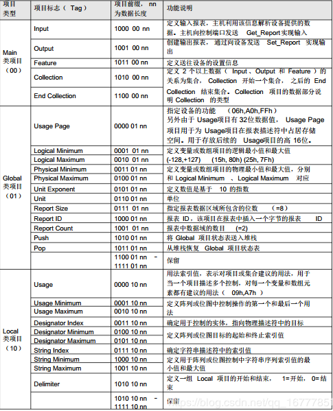


# 附表 A-2：Usage Page 摘要

<table>    <tr>        <th>Page ID</th>        <th>Page Name</th>    </tr >    <tr >        <td>00</td>        <td>Undefined</td>        </tr >    <tr >        <td>01</td>        <td>Generic Desktop Conreols</td>        </tr >    <tr >        <td>02</td>        <td>Simulation Controls</td>        </tr >    <tr >        <td>03</td>        <td>VR Controls</td>        </tr >    <tr >        <td>04</td>        <td>Sport Controls</td>        </tr >    <tr >        <td>05</td>        <td>Game Controls</td>        </tr >    <tr >        <td>06</td>        <td>Generic Device Controls</td>        </tr >    <tr >        <td>07</td>        <td>Keyboard/Keypad</td>        </tr >    <tr >        <td>08</td>        <td>LEDs</td>        </tr >    <tr >        <td>09</td>        <td>Button</td>        </tr >    <tr >        <td>0A</td>        <td>Ordinal</td>        </tr >    <tr >        <td>0B</td>        <td>Telephony</td>        </tr >    <tr >        <td>0C</td>        <td>Consumer</td>        </tr >    <tr >        <td>0D</td>        <td>Digitizer</td>        </tr >    <tr >        <td>0E</td>        <td>Reserved</td>        </tr >    <tr >        <td>0F</td>        <td>PID Page</td>        </tr >    <tr >        <td>10</td>        <td>Unicode</td>        </tr >    <tr >        <td>11~13</td>        <td>Reserved</td>        </tr >    <tr >        <td>14</td>        <td>Alphanumeric Display</td>        </tr >    <tr >        <td>15~3F</td>        <td>Reserved</td>        </tr >    <tr >        <td>40</td>        <td>Medical Instruments</td>        </tr >    <tr >        <td>41~7F</td>        <td>Reserved</td>        </tr >    <tr >        <td>80~83</td>        <td>Monitor pages</td>        </tr >    <tr >        <td>84~87</td>        <td>Power Pages</td>        </tr >    <tr >        <td>88~8B</td>        <td>Reserved</td>        </tr >    <tr >        <td>8C</td>        <td>Bar Code Scanner page</td>        </tr >    <tr >        <td>8D</td>        <td>Scale page</td>        </tr >    <tr >        <td>8E</td>        <td>Magnetic Stripe Readding (MSR) Device</td>        </tr >    <tr >        <td>8F</td>        <td>Reserved Point of Sale pages</td>        </tr >    <tr >        <td>90</td>        <td>Camera Control Page</td>        </tr >    <tr >        <td>91</td>        <td>Arcade Page</td>        </tr >    <tr >        <td>92~FEFF</td>        <td>Reserved</td>        </tr >    <tr >        <td>FF00~FFFF</td>        <td>Vendor-defined</td>

>  注：关于Usage Page的每一个有效定义项，都有一个相应的下一级定义，如Usage Page的数据项数值为1，则设备定义为Generic Desktop Controls，，该类设备的具体功能看附表A-3.


# 附表 A-3：Generic Desktop Page(0x01)


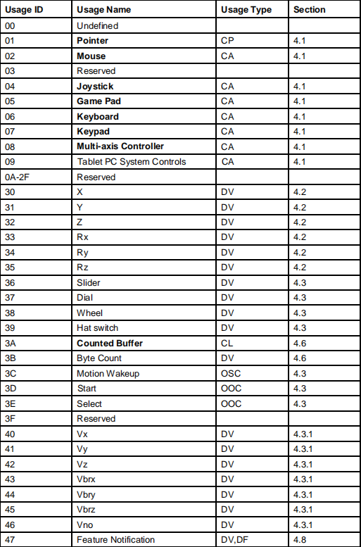

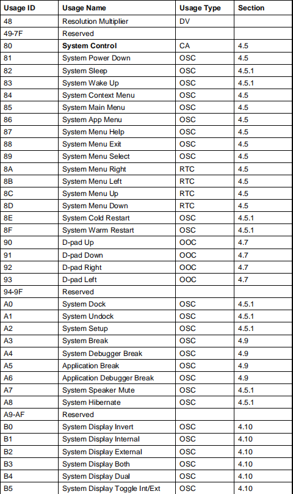

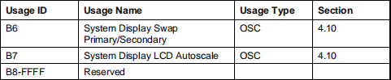


# 附表A-4：Keyboard/keypad Page(0x07)

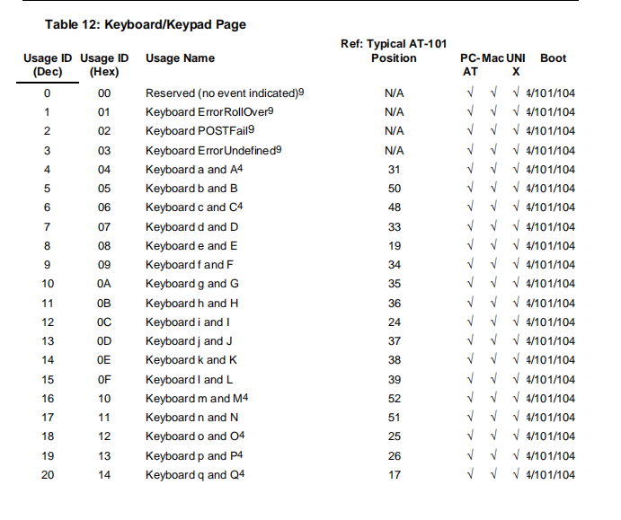

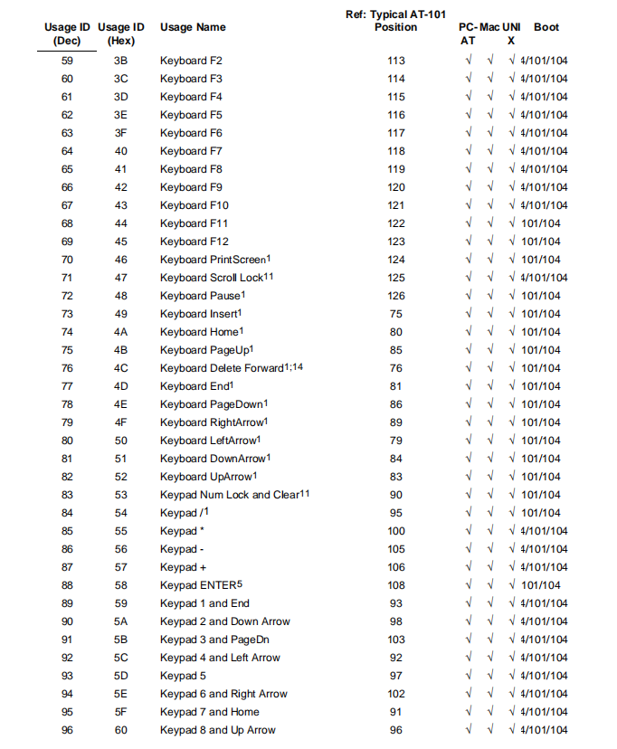

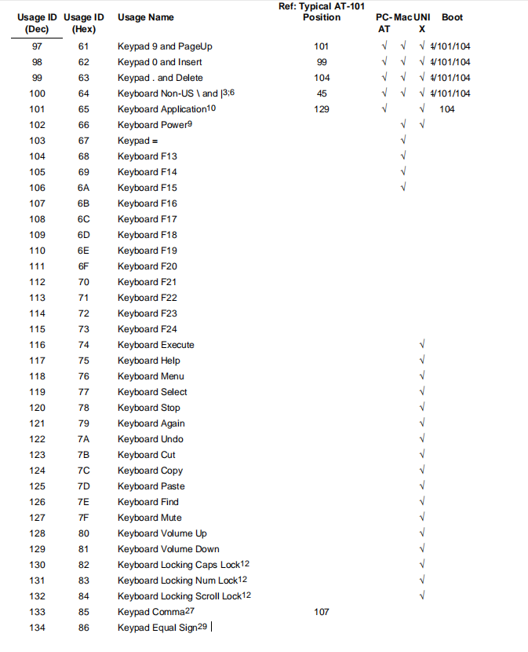

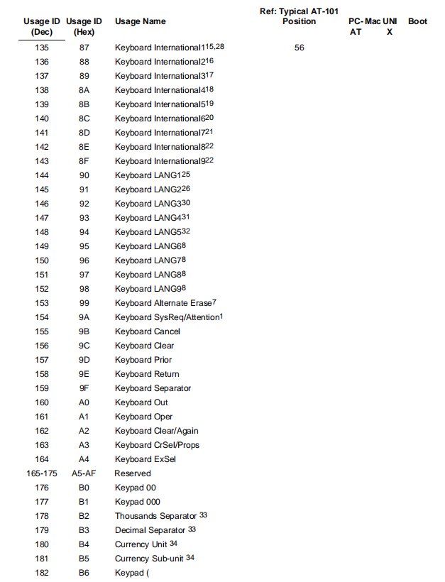

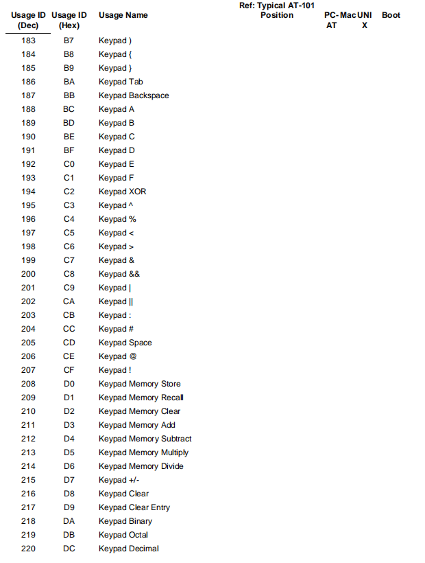

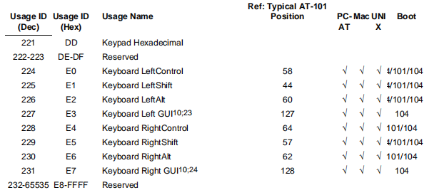


# 附表A-5：LED Page (0x08) 

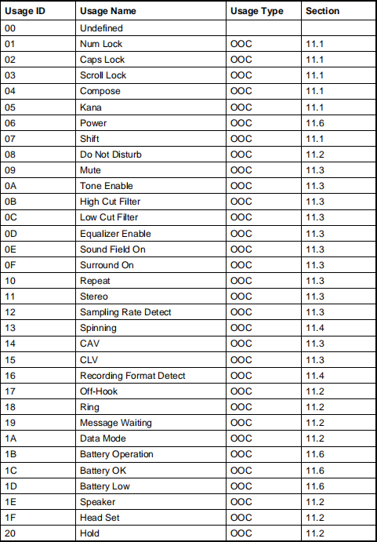

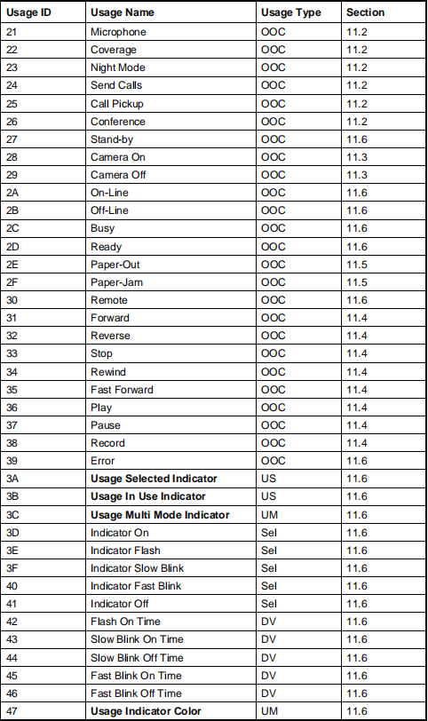

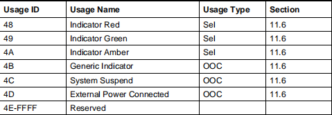


