# FAT文件系统
  文件分配表（英语：File Allocation Table，首字母缩略字：FAT），是一种由微软发明并拥有部分专利的文件系统，供MS-DOS使用，也是所有非NT核心的Windows系统使用的文件系统。

  FAT文件系统考虑当时电脑性能有限，所以未被复杂化，因此几乎所有个人电脑的操作系统都支持。这特性使它成为理想的软盘和存储卡文件系统，也适合用作不同操作系统中的资料交流。

  但FAT有一个严重的**缺点**：当文件删除后写入新资料，FAT不会将文件整理成完整片段再写入，长期使用后会使文件资料变得逐渐分散，而减慢了读写速度。碎片整理是一种解决方法，但必须经常磁盘碎片整理来保持FAT文件系统的效率。

## 一、历史
### 1.FAT12
  初期的FAT就是现在俗称的FAT12。作为软盘的文件系统，它有几项限制：不支持分层性结构，簇寻址只有12位（这使得控制FAT有些棘手）而且只支持最多32M（2^16）的分区。

  当时入门级的磁盘是5.25"、单面、40磁道、每个磁道8个扇区、容量略少于160KB。上面的限制超过了这个容量一个或几个数量级，同时允许将所有的控制结构放在第一个磁道，这样在读写操作时移动磁头。这些限制在随后的几年时间里被逐步增大。

  由于唯一的根目录也必须放在第一个磁道，能够存放的文件个数就限制在几十个。

### 2.目录
  MS-DOS 2.0为了支持以内置10MB硬盘为特色的IBM PC XT，因此几乎与该计算机同时在1983年初发布。它引进了层次目录结构，除了允许更有效率地组织文件外，目录允许在硬盘上存储更多的文件，这是因为最大文件个数不再受制于（仍然是固定且有限的）根目录大小。这个数目现在能够等同于簇的数目（甚至更大，这是考虑到长度为0的文件并不占据任何FAT簇）。

  FAT本身的格式并没有改变。PC XT的10MB的硬盘有4KB大小的簇。如果后来安装了一个20MB的硬盘，并且使用MS-DOS 2.0格式化，最后的簇大小将变为8KB，硬盘容量将变为15.9MB。

### 3.FAT16的开始
  在1984年，IBM发布PC AT，内含一个20MB的硬盘。微软公司也同步发布了MS-DOS 3.0。簇集地址增加至16位，允许更大数量的簇（最大65,517），所以有更大的文件系统大小。但是，最大数量扇区及最大分区（相当于磁盘）的大小仍是32MB。所以，尽管技术上已经是“FAT16”，这种格式并不是我们今天常见到的这个名字所代表的格式。在MS-DOS 3.0格式化一个20 MB的硬盘，这硬盘将不能被MS-DOS 2.0或之前的版本所访问。当然，MS-DOS 3.0仍然可访问MS-DOS 2.0的格式（8KB簇的分区）。

  MS-DOS 3.0也开始支持高密度1.2MB 5.25"磁盘，最著名的是每个磁道有15个扇区，这样就允许FAT有更大的空间。这或许促进了一个对于簇大小的不确定的优化，簇大小从2个扇区减到1个。这样做的最后结果是高密度磁盘比旧的双密度磁盘的速度大幅度降低。

### 4.扩展分区和逻辑驱动器
  除了改进FAT文件系统本身的结构之外，另一个提高FAT存储空间的方式是支持多个磁盘分区。最初，受限于主引导记录中文件分配表的固定结构一个硬盘最多只能切出多达4个分区。然而，由于DOS设计要求只能有一个分区标识为“活动的（Active）”，它也是主引导代码启动所用的分区。使用DOS工具不可能创建几个“主”DOS分区，并且第三方的工具也至少会警告这样一个机制将与DOS不兼容。

  为了用一种兼容的方式使用更多的分区，一种新的分区类型被开发出来（1986年1月的MS-DOS 3.2），扩展分区它实际上是另外称为逻辑分区的一个容器。最初它里面只允许有一个逻辑分区、支持最大64MB的硬盘。在MS-DOS 3.3（1987年8月）这个限制更改到24个分区；它可能来自于强制性的C:-Z：的磁盘命名规则。逻辑分区表使用盘上的数据结构来描述，可能是为了简化编码它与主引导记录非常相似，并且它们组织成类似于俄罗斯套娃那样的结构。一颗硬盘中只能有一个扩展分区。

  在扩展分区观念导入之前，一些硬盘控制器（当时采用独立的硬盘控制卡，IDE标准尚未出现）能够将大硬盘显示为两个独立的硬盘。

### 5.最终的FAT16
  1987年11月，我们今天称之为FAT的格式最终到来，它在康柏DOS 3.31中去掉了磁盘扇区的16位计数器。这个结果曾经一度被称为DOS 3.31大文件系统。尽管看起来磁盘上的变动很小，这个DOS的磁盘代码都必须检查并转换到32位的扇区数，由于它完全是16位的汇编语言这样一个现实，这项工作就变得非常复杂。

  1988年，这项改进通过MS-DOS 4.0得到广泛应用。现在分区大小受限于每个簇的8位有符号扇区计数，它最大能达到2的64次方，对于一个常用的有32KB个簇每扇区512字节的硬盘来说，将FAT16分区大小的“明显”限制扩充到2GB。在磁光盘媒体上，它能使用1或者2KB的扇区，这样大小限制也就成比例地增大。

  后来，Windows NT通过将每个簇的扇区数当作无符号数将最大的簇大小增加到64KB。然而这个格式与当时其它任何格式的FAT都不兼容，并且这样的操作会产生大量的内部碎片。Windows 98也支持这种格式的读写操作，但是它的磁盘管理工具不支持这种格式。

### 6.FAT32
  为了解决FAT16对于卷大小的限制同时让DOS的实模式在非必要情况下不减少可用常规内存状况下处理这种格式，微软公司决定实施新一代的FAT，它被称为FAT32，带有32位的簇数，目前用了其中的28位。

  理论上，这将支持总数达268,435,438（<2^28）的簇，允许磁盘容量达到8TB。

  FAT32随着Windows 95 OSR2发布，尽管需要重新格式化才能使用这种格式并且DriveSpace 3（Windows 95 OSR2和Windows 98所带版本）从来都不支持这种格式。Windows 98提供了一个工具用来在不丢失数据的情况下将现有的硬盘从FAT16转到FAT32格式。在NT产品线上对于它的支持从Windows 2000开始。

  Windows 2000和Windows XP能够读写任何大小的FAT32文件系统，但是这些平台上的格式化程序只能创建最大32GB的FAT32文件系统。Thompson and Thompson（2003）写道“奇怪的是微软公司说这种现象是故意设计的”微软公司知识库文章184006的确是这么说的，但是没有提出任何关于这个限制的合理解释。Peter Norton的观点是“微软公司在有意地削弱FAT32文件系统”。

### 7.exFAT
  在Windows Embedded CE 6.0中引入，Windows XP SP3 以及 Windows Vista SP1也引入了exFAT的支持。在很多方面exFAT有了相当大的改进，特别适合用于闪存。

## 二、设计
### 1.FAT文件系统结构

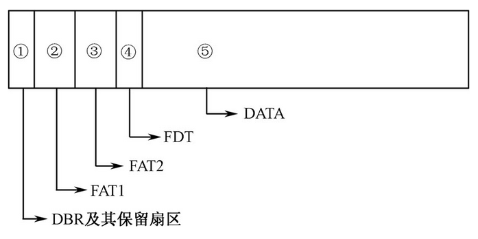
一个FAT文件系统包括四个不同的部分。

1. **DBR及其保留扇区**，位于分区最开始的位置。 第一个保留扇区是引导扇区（分区启动记录）。它包括一个称为基本输入输出参数块的区域（包括一些基本的文件系统信息尤其是它的类型和其它指向其它扇区的指针），通常包括操作系统的启动调用代码。保留扇区的总数记录在引导扇区中的一个参数中。引导扇区中的重要信息可以被DOS和OS/2中称为驱动器参数块的操作系统结构访问。对于FAT32文件系统来说，DBR引导扇区中还储存着一个文件系统信息扇区号，并且这个文件系统信息扇区放在保留扇区中，储存着文件系统的空闲簇数和下一簇空闲簇号。
2. **FAT区域（FAT1、FAT2）**。它包含有两份文件分配表，FAT1是第一份，也是主FAT；FAT2是第二份文件分配表，也就是FAT1的备份，也称做备份FAT。
3. **文件目录表（FDT）**。它是在根目录中存储文件和目录信息的目录表。在FAT32下它可以存在分区中的任何位置，但是在早期的版本中它永远紧随FAT区域之后。
4. **数据区域（DATA）**。这是实际的文件和目录数据存储的区域，它占据了分区的绝大部分。通过简单地在FAT中添加文件链接的个数可以任意增加文件大小和子目录个数（只要有空簇存在）。然而需要注意的是每个簇只能被一个文件占有，这样的话如果在32KB大小的簇中有一个1KB大小的文件，那么31KB的空间就浪费掉了。

### 2.FAT文件系统各部分介绍
#### 2.1.FAT16

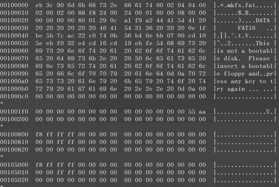

##### 2.1.1 DBR及其保留扇区（位于分区的第一个扇区）

  DBR开始于FAT16文件系统的第一个扇区，计算机启动时首先由BIOS读入主引导盘MBR的内容，以确定各个逻辑驱动器及其起始地址，然后调入活动分区的DBR，将控制权交给DBR，由DBR来引导操作系统。

  FAT16文件系统的DBR由5部分组成，分别为跳转指令、OEM代号、BPB、引导程序和结束标志,下图是一个完整的FAT16文件系统的DBR。
  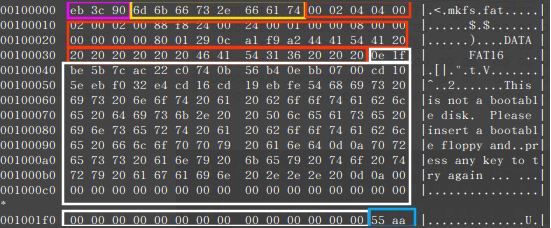

- 紫色标识：跳转指令（跳过开头一段区域） 跳转指令本身占用2字节，它将程序执行流程跳转到引导程序处。例如，当前DBR中的“EB 3C”，就是代表汇编语言的“JMP 3C”。需要注意该指令本身占用2字节，计算跳转目标地址时以该指令的下一字节为基准，所以实际执行的下一条指令应该位于3E。紧接着跳转指令的是一条空指令NOP（90H）。

- 黄色标识：OEM名称（空格补齐）。MS-DOS检查这个区域以确定使用启动记录中的哪一部分数据 （页面存档备份，存于互联网档案馆） 。常见值是IBM 3.3（在“IBM”和“3.3”之间有两个空格）和MSDOS5.0.只是一个名字。例如，当前的DBR中的OEM名称是mkfs.fat。

- **红色标识：BPB（BIOS Parameter BIock，BIOS参数块）**BPB是BIOS Parameter Block的缩写，其含义为BIOS参数块。BPB从第DBR的第12（0BH偏移处）字节开始，占用51字节，记录了有关该文件系统的重要信息。

**FAT16的BPB参数**

| 偏移（字节） | 长度（字节） | 上图对应取值 | 说明                                                         |
| ------------ | ------------ | ------------ | ------------------------------------------------------------ |
| 0x0b         | 2            | 0x0200       | 每个扇区的字节数。基本输入输出系统参数块从这里开始。(上图为512个字节) |
| 0x0d         | 1            | 0x04         | 每簇扇区数(4)，说明一个簇2k                                  |
| 0x0e         | 2            | 0x0004       | 保留扇区数（包括启动扇区）这里是4，说明在DBR引导区往后移动4个扇区就是FAT1分区表 |
| 0x10         | 1            | 0x02         | 文件分配表数目,该分区上的FAT的副本数。本字段的值一般为2，FAT2具有备份作用。 |
| 0x11         | 2            | 0x0200       | 最大根目录条目个数(只有FAT12/FAT16使用此字段)对于FAT32而言，本字段必须设置为0，一般FAT16为512 |
| 0x13         | 2            | 0x8800       | 总扇区数（如果是0，就使用偏移0x20处的4字节值，只有FAT12/FAT16使用此字段）对于FAT32而言，本字段必须设置为0 |
| 0x15         | 1            | 0xf8         | 介质描述符是描述磁盘介质的参数，根据磁盘性质的不同，取不同的值，0xf8为标准值，可移动存储介质，具体取值见下表。 |
| 0x16         | 2            | 0x0024       | 每个文件分配表的扇区（FAT16），表示分区表占36个扇区          |
| 0x18         | 2            | 0x0024       | 每磁道的扇区数，只对于“特殊形状”（由磁头和柱面分割为若干磁道）的存储介质有效。 |
| 0x1a         | 2            | 0x0001       | 磁头数，只对于“特殊形状”（由磁头和柱面分割为若干磁道）的存储介质有效。 |
| 0x1c         | 4            | 0x00000800   | 隐藏扇区，这里0800H=2048个                                   |
| 0x20         | 4            | 0x00000000   | 总扇区数（如果超过65535，参见偏移0x13）                      |
| 0x24         | 1            | 0x80         | 物理驱动器号与BIOS物理驱动器号有关。软盘驱动器被标识为0x00,物理硬盘被标识为0x80,而与物理磁盘驱动器无关。一般地，在发出一个INT13h BIOS调用之前设置该值，具体指定所访问的设备。只有当该设备是一个引导设备时，这个值才有意义。（FAT16） |
| 0x25         | 1            | 0x01         | 保留（reserve）FAT16分区一般将本字段的值设置为0，供NT用      |
| 0x26         | 1            | 0x29         | 扩展引导标签，本字段必须要有能被windows 2000所识别的值0x28或0x29 |
| 0x27         | 4            | 0xa2f9a10c   | ID在格式化磁盘时所产生的一个随机序号，它有助于区别磁盘（FAT16），内容随便。 |
| 0x2b         | 11           | "DATA"       | 卷标（非FAT32）这里表示的是DATA                              |
| 0x36         | 8            | "FAT16"      | FAT文件系统类型（如FAT、FAT12、FAT16）                       |

| 十六进制值 | 介质类型                                                     |
| ---------- | ------------------------------------------------------------ |
| F8         | 硬盘                                                         |
| F9         | 双面5.25英寸软盘（15扇区高密度）、双面3.5英寸软盘            |
| FA         | 双面3.5英寸软盘、RAM虚拟盘                                   |
| FC         | 单面5.25英寸软盘（9扇区高密度）、双面8英寸软盘               |
| FD         | 双面5.25英寸软盘（9扇区低密盘）                              |
| FE         | 单面8英寸软盘（单、双密度）、单面5.25英寸软盘（8扇区低密盘） |
| FF         | 双面5.25英寸软盘（8扇区低密盘）                              |

从上表中能获得的有用信息为：

1. 卡的大小为17MB（只显示已分区并挂载文件系统的分区大小）;
2. 每个簇有4个扇区，即2KB;
3. 卡的总扇区数是34816,隐含扇区为2048;
4. FAT表的大小为36个扇区;
    根据FAT16的格式，主引导区后就是两个一样的分区表，分区表后面又跟了32个扇区作为根目录区。然后后面就是存放文件和文件夹的地方了。每个分区表既然大小算出来是36个扇区，那么FAT1在2052-2087扇区，FAT2就是2088-2123扇区，根目录就是2124-2155扇区，数据区开始于2156扇区，所以可以表示为
    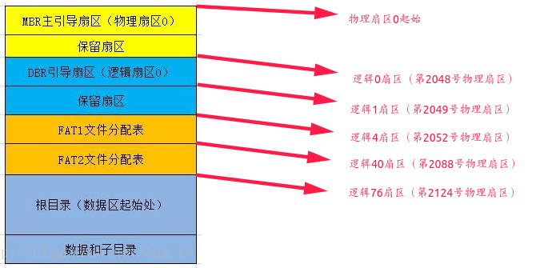

- 白色标识：引导程序。FAT16的DBR引导程序占用448字节（3EH～1FDH）。
- 蓝色标识：结束标志。DBR的结束标志与MBR、EBR的结束标志都相同，为“55 AA”。

##### 2.1.2 FAT文件分配表
###### 2.1.2.1FAT表的作用及结构特点
  FAT（File Allocation Table）即文件分配表，对于FAT文件系统来讲是至关重要的一个组成部分，其主要作用及结构特点如下（如果没有特别说明，以下的作用和特点适用于FAT12、FAT16及FAT32文件系统中的FAT表）。
1. FAT文件系统一般有两份FAT，它们由格式化程序在对分区进行格式化时创建，FAT1是活动FAT，FAT2是备份FAT。
2. FAT1跟在DBR之后，其具体地址由DBR的BPB参数中偏移量为0EH～0FH的两字节描述；FAT2跟在FAT1之后，其地址可以用FAT1的所在扇区号加上每个FAT所占的扇区数获得。
3. FAT表是由FAT表项构成的，我们把FAT表项简称为FAT项。每个FAT项的大小有12位（相当于1.5字节）、16位（相当于2字节）和32位（相当于4字节）三种情况，对应的分别是FAT12、FAT16和FAT32三种文件系统。
4. 每个FAT项都有一个固定的编号，这个编号从0开始，也就是说，第一个FAT项是0号FAT项，第二个FAT项是1号FAT项，以此类推。
5. FAT表的前两个FAT项有专门的用途：0号FAT项通常用来存放分区所在的介质类型，例如硬盘的介质类型为“F8”，那么硬盘上分区的FAT表第一个FAT项就以“F8”开始；1号FAT项则用来存储文件系统的肮脏标志，表明文件系统被非法卸载或者磁盘表面存在错误。
6. 分区的数据区中每一个簇都会映射到FAT表中的唯一一个FAT项。<u>因为0号FAT项和1号FAT项有特殊用途，无法与数据区中的簇形成映射，所以从2号FAT项开始跟数据区中的第一个簇映射，正因为如此，数据区中的第一个簇也就编号为2号簇，这也是没有0号簇和1号簇的原因</u>，然后3号簇跟3号FAT项映射，4号簇跟4号FAT项映射，以此类推，直到数据区中的最后一个簇。
7. 分区格式化后，用户文件以簇为单位存放在数据区中，一个文件至少占用一个簇。当一个文件占用多个簇时，这些簇的簇号不一定是连续的，但这些簇号在存储该文件时就确定了顺序，即每个文件都有其特定的“簇号链”。在分区上的每一个可用的簇在FAT中有且只有一个映射FAT项，通过在对应簇号的FAT项内填入“FAT项值”来表明数据区中的该簇是已占用、空闲或是坏簇三种状态之一。
    从例子FAT16的BPB中的数据可以得知一个FAT表是36个扇区。FAT项的内容很简单，里边的内容就是指出下一个簇在哪里。你的盘有多少个簇，那么它的FAT表就要有多少个项来描述它们。因为FAT16是用2个字节(16位)来描述一个簇的，所以这时FAT表的大小就应该是2位的簇数个字节。FAT表中，第4，5个字节表示第2个簇，第6，7个字节表示第3个簇，第8,9字节表示第4个簇……。就这样，每一个簇都有两个和它对应的字节。这两个字节里面存放的数据就是下一个2K数据所在的簇号。实际上，并不是所有的数值都代表簇号，有几个值被赋于了特定的含义， 我们先看看这几个特殊值代表的含义。

| 序号 | 数值      | 含义                               |
| ---- | --------- | ---------------------------------- |
| 1    | FFF8      | 磁盘标识字                         |
| 2    | FFFF      | 第一簇已经被占用                   |
| 3    | 0000      | 未使用的簇                         |
| 4    | 0002-FFEF | 使用的簇                           |
| 5    | FFF0-FFF6 | 系统留的，一般不会出现这几个簇号   |
| 6    | FFF7      | 坏簇，再写文件时不能往里面写       |
| 7    | FFF8-FFFF | 表示这是最后一个簇了，文件到此结束 |

综合来说，FAT表的功能主要有如下三点：

1. 表明分区所在介质类型。FAT表的0号FAT项用来表明分区所在介质类型，该FAT项的首字节与BPB中介质描述符所对应的介质类型相同。
2. 表明一个文件所占用的各簇的簇链分配情况。每个簇在FAT表中映射一个FAT项，FAT项以指针的方式记录文件的簇链。
3. 标明坏簇和可用簇。以FAT16为例，如果分区格式化时发现坏扇区，即在相应簇的表项中写入FFF7H，表明该簇的扇区不能使用，系统就不会将它分配给用户文件。
   分区上未用但可用的“空簇”的FAT项值为0000H，当需要存放新文件时，系统按一定顺序将它们分配给新文件。

###### 2.1.2.2 FAT表的实际应用
  知道FAT文件分配表的具体的作用后，要分析一个FAT文件分配表，首先是要能够找到文件分配表在哪里，定位FAT1的步骤如下：
1. 系统通过该分区的分区表信息，定位到其DBR扇区；
2. 读取DBR的BPB，主要读取“DBR保留扇区数”这个参数，它在DBR的0EH～0FH偏移处；
3. 读取“DBR保留扇区数”这个参数的值，跳转到相应的分区。

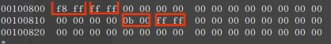
  上面是我的U盘中FAT1分区表中的内容。它一开始就是F8 FF FF FF，从前面的特殊数值中可以知道，这就是磁盘的标识，并且第1簇已经被根目录项占用了。我的U盘里有一个文件，名字叫1.txt。它的第一个簇的地址是0x000a。这个地址从哪里得来的要看后面的内容了，暂且就把它当已知条件吧。这也就是说，在U盘的第10个簇里边存放着1.txt的第1个2K数据，那么它的第二个2K放在哪里呢，我们要看FAT表，第10个簇对应于FAT表中的第20,21个字节，里边的内容为000b，也就是说第2个2K数据在第11个簇里。11个簇对应的FAT表中的数据又是什么呢，原来是FFFF，FFFF是什么意思？看一下特殊数值的含义，原来这是最后一个簇，也就是说，我的1.txt文件到此为止。于是我们只要跟着FAT表的“指路”顺利地把1.txt文件从U盘中找到了。它在U盘里占用了2个簇，我的U盘里边1个簇为2K，所以这个文件的大小也就最多为4K了。所以我们只要根据U盘的读写方法，把第10-11簇里的内容读出来就OK了。

  注意一下，我这个U盘是格式化过的，分区表没有碎片，所以文件的簇和簇都是连在一起的，但实际上并不一定都是连着的，一定要通过FAT表中的指示去寻找下一个簇所在的位置。

##### 2.1.3 目录表

  说完FAT表，下面应该来看根目录区了。

######  2.1.3.1 FDT的位置

FDT的含义为文件目录表，它在一个文件系统中的具体位置是紧跟在FAT2之后。下面模拟一下操作系统定位FDT的方法。定位FDT的步骤如下：

1. 系统通过该分区的分区表信息，定位到其DBR扇区；

2. 读取DBR的0EH～0FH偏移处，得到“DBR保留扇区数”的值；

3. 读取DBR的16H～17H偏移处，得到“每FAT扇区数”的值；

4. 用“DBR保留扇区数”加上2倍的“每FAT扇区数”，跳转到该分区的相应扇区，这里就是FDT的开始。

######  2.1.3.2 FDT的内容
  根目录区里面放的东西就是根目录下所见的东西，根据对引导扇区等数据的分析，我们可以找到根目录区在第2124号物理扇区内。用hexdump指令查看第2124号物理扇区中的数据如下：
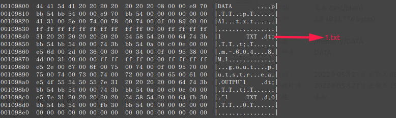
  FAT16和FAT32每个文件名都占32个字节，这里放的是短文件名，也就是“8.3”格式的。
  FDT是用来存放根目录下的文件的目录项的，DBR中11H～12H偏移处的两个字节的含义为“根目录项数”，该值一般为512，也就是说FDT中只能存放最多512个目录项，而每个目录项的大小为32字节（目录项的结构2.1.3.3节会详细分析），这样算下来FDT的扇区数为32个。
  **目录表**是一个表示目录的特殊类型文件（现今通常称为文件夹）。它里面保存的每个文件或目录使用表中的32字节条目表示。每个条目记录名字、扩展名、属性（文件、目录、隐藏、只读、系统和卷)、创建的日期和时间、文件／目录数据第一个簇的地址，最后是文件／目录的大小。
  除了FAT12和FAT16文件系统中的根目录表占据特殊的根目录区域位置之外，所有其它的目录表都存在数据区域。
合法的DOS文件名包括下面一些字符：

+ 大写字母A-Z
+ 数字0-9
+ 空格（尽管结尾的空格被作为填充而不是文件名的一部分）
+ ! # $ % & ( ) - @ ^ _ ` { } ~ '
+ 数值128-255
######  2.1.3.3 FAT16文件系统目录项分析

目录项对于FAT文件系统来讲也是很重要的一个组成部分，其主要作用及结构特点如下（如果没有特别说明，以下的作用和特点适用于FAT12、FAT16及FAT32文件系统中的目录项）。

1. 分区中的每个文件和文件夹（也称为目录）都被分配一个大小为32字节的目录项，用以描述文件或文件夹的属性、大小、起始簇号和时间、日期等信息，当然还会把文件名或目录名也记录在目录项中。

2. 在FAT文件系统中，目录被视为特殊类型的文件，所以每个目录也跟文件一样有目录项。

3. 在FAT16文件系统下，分区根目录下的文件及文件夹的目录项存放在FDT中，分区子目录下的文件及文件夹的目录项存放在数据区相应的簇中。

4. 根据目录项的作用和结构特点，可以把目录项分为四类：

  ①短文件名目录项；

  ②长文件名目录项；

  ③“.”目录项和“..”目录项；

  ④卷标目录项。

**短文件名目录项**

  所谓短文件名是指DOS和Windows 3.x时代文件名的传统格式，即“8.3”格式。在这种格式的限制下，用户在给文件起名时，主文件名不能超过8个字符，并且不能支持中文；扩展名不能超过3个字符，所以称为“8.3”格式。在这种格式下，文件目录项中只需要8＋3＝11字节就可以记录文件名了（主文件名和扩展名之间的“.”是默认的，不用记录），这种格式的目录项也就称为短文件名目录项。
  FAT16短文件名目录项的含义：

| 偏移（hex） | 长度 | 内容                                                         |
| ----------- | ---- | ------------------------------------------------------------ |
| 00          | 8    | 文件名，长度最大为8,第00处的内容为0时表示这是一个未使用的空间，E5表示被删除。05表示E5（因为E5被作为标识了），2E表示这是一个目录。文件名不足8个字以空格（十六进制数值为20H）填满。另外该位置的第一字节也用来表示目录项的分配状态：当这个字节是“00”时，表示该目录项从未使用过；当这个字节是“E5”时，表示该目录项曾经使用过，但目前已经被删除。 |
| 08          | 3    | 扩展名，对于文件夹来说没有扩展名，那么这三个字节用空格填充。 |
| 0B          | 1    | 表示文件属性，可以表示文件的各种属性。0x01就表示只读，0x02表示隐藏，0x03表示只读+隐藏，0x04表示系统，0x05表示存档，0x08表示卷标，0x10表示子目录，0x20表示文件，0x40表示设备（内部使用，磁盘上看不到），0x80表示没有使用，0x0f表示这是一个长文件名的文件。 |
| 0C          | 1    | 保留                                                         |
| 0D          | 1    | 文件创建时间秒后面的时间，10ms为单位，数值从0到199           |
| 0E          | 2    | 文件创建时的时分秒，为时<<11+分<<5+秒/2（秒只保存了2秒的更新分辨率） |
| 10          | 2    | 文件创建时的日期，为（年-1980）<<9+月<<5+日                  |
| 12          | 2    | 文件访问日期，格式和文件创建日期相同                         |
| 14          | 2    | FAT12和FAT16中的EA-Index（OS/2和NT使用），FAT32中第一簇的两个高字节 |
| 16          | 2    | 最后更改时间，格式和偏移0x0e处相同                           |
| 18          | 2    | 最后更改日期，格式和偏移0x10处相同                           |
| 0x1a        | 2    | FAT12和FAT16中的第一个簇。FAT32中第一个簇的两个低字节。      |
| 0x1c        | 4    | 文件大小                                                     |

0x0E-0x0F（小端模式）

| 位    | 描述          |
| ----- | ------------- |
| 15-11 | 小时（0-23）  |
| 10-5  | 分钟（0-59）  |
| 4-0   | 秒／2（0-29） |

0x10-0x11（小端模式）

| 位   | 描述                       |
| ---- | -------------------------- |
| 15-9 | 年（0 = 1980, 127 = 2107） |
| 8-5  | 月（1 = 1月，12 = 12月）   |
| 4-0  | 日（1 - 31）               |

下图是一个具体的短文件名目录项。

  看上图的数据，它表示了一个文件，前十一个字是文件名，对照ASCII码可以知道，这表示的就是我添加的名字为1.txt的文件。偏移0x0B中的数据为0x20,表示这是一个文件，偏移0x1a和0x1b中的09 00表示文件的第一簇地址是0x0009，由0x1c-0x1f中0xc0 0e 00 00可以算出文件大小为3776byte，这和我们用linux图像界面观察到的数据相同。
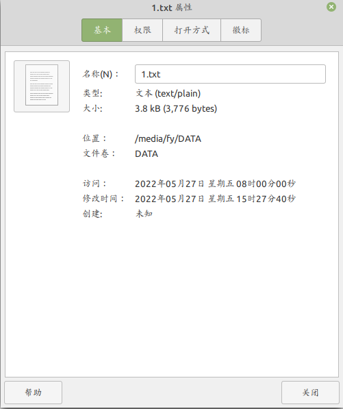

**长文件名目录项**
从在Windows 95开始，文件名“8.3”格式的限制被打破了，文件名可以超过8个字符，并且可以使用中文了，扩展名也可以超过3字节，这种格式的文件名就称为长文件名。

不过在Windows 95以上的系统中创建的长文件名需要考虑与DOS和Windows 3.x的兼容问题，所以在Windows 95以上的系统中，超过8.3格式的文件或目录实际存储着两个名字，一个短文件名和一个长文件名。如果是短文件名，则存储在短文件名目录项中。当创建一个长文件名时，其对应短文件名的存储有以下三个处理原则。

1. 系统取长文件名的前6个字符加上“~1”形成短文件名，其扩展名不变；

2. 如果已存在这个名字的文件，则符号“~”后的数字自动增加；

3. 如果有DOS和Windows 3.x非法的字符，则以下画线“_”替代。

每个长文件名目录项也占用32字节，一个目录项作为长文件名目录项使用时，其属性字节值为0FH，能够存储13个字符，如果文件名很长，一个长文件名就需要多个目录项，这些目录项按倒序排列在其短文件名目录项之前。

| 字节偏移 | 字段长度（字节） | 字段内容及含义                        |
| -------- | ---------------- | ------------------------------------- |
| 0x00     | 1                | 序列号                                |
| 0x01     | 10               | 文件名的第1～5个Unicode码字符         |
| 0x0B     | 1                | 长文件名目录项的属性标志，固定为“0FH” |
| 0x0C     | 1                | 保留未用                              |
| 0x0D     | 1                | 短文件名校验和                        |
| 0x0E     | 12               | 文件名的第6～11个Unicode码字符        |
| 0x1A     | 2                | 始终为0                               |
| 0x1C     | 2                | 文件名的第12～13个Unicode码字符       |

下图是一个具体的长文件名目录项
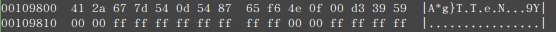

下面对这些参数做详细分析。

1. 序列号（00）

  序列号占1字节，该参数用来描述长文件名目录项的排序。

  在这个字节的8位当中，0～4位这5位描述长文件名目录项的顺序号，从1开始编号。6位（也就是第7位）如果为“1”表明该目录项是最后一项。如果文件删除，该字节也会改为“E5”。

  在当前例子中的值为“41”，说明这是第一个也是最后一个长文件名目录项。

2. 文件名的第1～5个Unicode码字符（01H～0AH）

  该参数长度为10字节，使用UTF-16编码存储5个Unicode字符的文件名，每个字符占用两字节。

  如果文件名已经记录完，但该参数的空间中还有未用的字节，就会在文件名最后一个字符后填充两个字节的“00”，随后未用的字节用“FF”填充。

  在当前例子中Unicode字符解码是中文“未命名文件夹”。

（3）长文件名目录项的属性标志（0BH～0BH）

该参数长度为1字节，是属性字节。当属性的只读位、隐藏位、系统位、卷标位全为1，其他位全为0时，该值就为十六进制的“0FH”，表示该目录项为长文件名记录项。

（4）未用（0CH～0CH）

该字节不使用。

（5）短文件名校验和（0DH～0DH）

  该参数长度为1字节，是一个校验和，长文件名目录项通过这个校验和将其与相应的短文件名目录项关联起来。校验和的数值是使用短文件名计算得到，同一文件的长文件名目录项的校验和必须是相同的。

  校验和的计算方法是依次将短文件名的各个字符对应的二进制值相加，在每一步相加前要先将二进制的结果值依次向右移动一位，最右边的位循环移动到最左边，然后再加上下一个字符所对应的二进制值，直到把最后一个字符加完，结果就是校验和的数值。

（6）文件名的第6～11个字符（0EH～19H）

  该参数长度为12字节，使用UTF-16编码存储6个Unicode字符的文件名，每个字符占用2字节。如果文件名已经记录完，但该参数的空间中还有未用的字节，就会在文件名最后一个字符后填充两个字节的“00”，随后未用的字节用“FF”填充。

（7）始终为0（1AH～1BH）

  该参数长度为2字节，始终都为0。

（8）文件名的第12～13字符（0EH～19H）

  该参数长度为4字节，使用UTF-16编码存储2个Unicode字符的文件名，每个字符占用两字节。该参数的空间中未用的字节用“FF”填充。

**“.”目录项和“..”目录项**

在子目录所在的文件目录项区域中，总有两个特殊的目录，它们就是“.”目录和“..”目录。可以用`ls -al`看到。
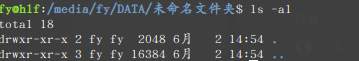

1. “．”表示当前目录。

2. “．．”表示上级目录。

用`hexdump`指令查看"."目录和".."目录的目录项，其内容如下图所示。
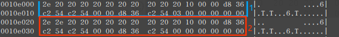
其中”1“号目录项是“.”目录的目录项，“2”号目录项是“..”目录的目录项，他们的格式可以参考短文件名目录项。
可以得到以下结论：

1. “．”目录项所描述的“起始簇号”是子目录本身所在的簇号。当前值为3，说明“．”目录项所在的簇就是3号簇。

2. “．．”目录项所描述的“起始簇号”是上一级目录的起始簇号，如果上一级目录是根目录，则该簇号值被置成0。当前值为0，说明该子目录的上级目录就是根目录。

3. “.”目录和“..”目录的“文件大小”都是0，这同所有的目录一样，不记录大小。

系统利用“.”目录和“..”目录来实现目录之间的双向联系，从而把整个文件系统联系在一起。

**卷标目录项**

  卷标就是一个分区的名字，可以在格式化分区时创建，也可以随时修改。在DOS时代，卷标记录在DBR的BPB中，目前的系统则把卷标当作文件，用文件目录项进行管理，系统为卷标建一个目录项，放在根目录区中，对于FAT16来说，就是放在FDT中。
  卷标的目录项属于短文件名目录项，它有如下特点：

1. 对于FAT格式的分区，卷标的长度最多允许达到11字节，如果卷标为中文，则最多支持5个字符。
2. 卷标的目录项中不记录起始簇号和大小。
3. 卷标的目录项中不记录创建时间和最后访问时间，只记录修改时间。

**删除文件或目录**

  1. 短文件名的目录项第一个字节被改写成E5H；
  2. 长文件名的目录项第一个字节也被改写成E5H；
  3. 子目录中的文件：短文件名和长文件名的第一个字节被改写成E5H；
  4. 子目录中的文件的起始簇号的高2字节也被清0。
#### 2.2 FAT32
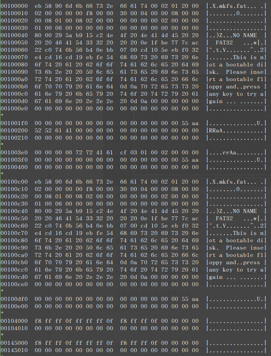
##### 2.2.1 DBR、FSINFO扇区及其保留扇区（位于分区的第一个扇区）
###### 2.2.1.1 DBR引导扇区

  FAT32文件系统的DBR与FAT16的DBR很类似，也由5部分组成，分别为跳转指令、OEM代号、BPB、引导程序和结束标志，下图所示是一个完整的FAT32文件系统的DBR。
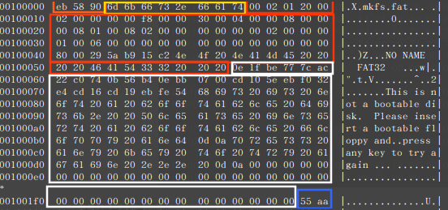

- 橘色标识：跳转指令
  跳转指令本身占用2字节，它将程序执行流程跳转到引导程序处，比如当前DBR中的“EB 58”，就是代表汇编语言的“JMP 58”。需要注意该指令本身占用2字节，计算跳转目标地址时以该指令的下一字节为基准，所以实际执行的下一条指令应该位于5A。紧接着跳转指令的是一条空指令NOP（90H）。

- 黄色标识：OEM代号
  这部分占8字节，其内容由创建该文件系统的OEM厂商具体安排。当前DBR中的OEM代号为“mkfs.fat”。

- **红色标识：BPB**
  FAT32的BPB从第DBR的第12（0BH偏移处）个字节开始，占用79字节，记录了有关该文件系统的重要信息

**FAT32的BPB参数格式如下：**

| 偏移（字节） | 长度（字节） | 上图中对应值  | 说明                                                         |
| ------------ | ------------ | ------------- | ------------------------------------------------------------ |
| 0x0b         | 2            | 0x0200        | 每个扇区的字节数。一般为512字节，但512并不是固定值，该值可以由程序定义，合法值包括512、1024、2048和4096字节。 |
| 0x0d         | 1            | 0x01          | 每簇扇区数,FAT32最大支持128扇区的簇。在FAT32文件系统中所有的簇从2开始进行编号，每个簇都有一个自己的地址编号，并且所有的簇都位于数据区内，在数据区之前是没有簇的。这里为1，每一簇的大小为512个字节。 |
| 0x0e         | 2            | 0x0020        | DBR保留扇区数，是指DBR本身占用的扇区以及其后保留扇区的总和，也就是DBR到FAT1之间的扇区总数，或者说是FAT1的开始扇区号。这里是32,说明在DBR引导区之后移动32个扇区就是FAT1表。 |
| 0x10         | 1            | 0x02          | FAT文件分配表数目，一般在FAT文件系统中都有两个FAT，即FAT1和FAT2，FAT2是FAT1的备份，这里有两个。 |
| 0x11         | 2            | 0x0000        | 最大根目录条目个数，FAT12/FAT16为根目录中目录的个数，FAT32没有固定的FDT，所以不用这个参数。 |
| 0x13         | 2            | 0x0000        | 总扇区数（如果是0，就使用偏移0x20处的4字节值）这两个字节在FAT16中用来表示小于32MB的分区的扇区总数，FAT32的总是大于32MB，所以不用这个参数。 |
| 0x15         | 1            | 0xf8          | 介质描述，0xf8为标准值，可移动存储介质，具体的可以参考FAT16对应的表格。 |
| 0x16         | 2            | 0x0000        | 每个文件分配表的扇区（FAT16）这两个字节在FAT16中用来表示每个FAT表包含的扇区数，FAT32不用这个位置。 |
| 0x18         | 2            | 0x002b        | 每磁道的扇区。只对于“特殊形状”（由磁头和柱面分割为若干磁道）的存储介质有效，0x002b=43 |
| 0x1a         | 2            | 0x0003        | 磁头数。只对于“特殊形状”（由磁头和柱面分割为若干磁道）的存储介质有效，0x0003=3 |
| 0x1c         | 4            | 0x00000800    | 隐藏扇区。隐藏扇区数是指本分区之前使用的扇区数，该值与分区表中所描述的该分区的起始扇区号一致。对于主磁盘分区来讲，是MBR到该分区DBR之间的扇区数；对于扩展分区中的逻辑驱动器来讲，是其EBR到该分区DBR之间的扇区数。，0x0800=2048 |
| 0x20         | 4            | 0x00010800    | 总扇区数扇区总数是指分区的总扇区数，也就是FAT32分区的大小。0x10800=67584 |
| 0x24         | 4            | 0x00000208    | 每个文件分配表的扇区（FAT32）。0x208=520                     |
| 0x28         | 2            | 0x0000        | Flags（FAT32）标记，此域FAT32 特有。这两个字节用于表示FAT2是否可用，当其二进制最高位置1时，表示只有FAT1可用，否则FAT2也可用。 |
| 0x2a         | 2            | 0x0000        | 版本号（FAT32）FAT32版本号0.0，FAT32特有。这两个字节通常都为0。 |
| 0x2c         | 4            | 0x00000002    | 根目录启始簇（FAT32）根目录所在第一个簇的簇号，0x02。（虽然在FAT32文件系统下，根目录可以存放在数据区的任何位置，但是通常情况下还是起始于2号簇） |
| 0x30         | 2            | 0x0001        | FSInfo扇区（FAT32）FSINFO（文件系统信息扇区），该扇区为操作系统提供关于空簇总数及下一可用簇的信息。该扇区一般在分区的1号扇区，也就是紧跟着DBR后的一个扇区。 |
| 0x32         | 2            | 0x0006        | 启动扇区备份（FAT32）备份引导扇区的位置。备份引导扇区一般在6号扇区。该备份扇区与原DBR扇区的内容完全一样，如果原DBR遭到破坏，可以用备份扇区修复。 |
| 0x34         | 12           |               | 保留未使用（FAT32）用于以后FAT 扩展使用。                    |
| 0x40         | 1            | 0x80          | BIOS设备代号（FAT32）与FAT12/16 的定义相同，只不过两者位于启动扇区不同的位置而已。 |
| 0x41         | 1            | 0x00          | 未使用                                                       |
| 0x42         | 1            | 0x29          | 标记（FAT32）扩展引导标志，扩展引导标记用来确认后面的三个参数是否有效，一般值为29H。 |
| 0x43         | 4            | 0xa2 0e 9f 5f | 卷序号（FAT32）通常为一个随机值                              |
| 0x47         | 11           | "No name"     | 卷标（ASCII码）如果建立文件系统的时候指定了卷标，会保存在此。 |
| 0x52         | 8            | "FAT32"       | FAT文件系统类型（FAT32）文件系统格式的ASCII码，"FAT32"       |

- 白色标识：引导程序

  FAT32的DBR引导程序占用420字节（5AH～1FDH）。

- 蓝色标识：结束标志
  DBR的结束标志与MBR、EBR的结束标志都相同，为“55 AA”。

以上5个部分共占用512字节，正好是一个扇区，因此称它为DOS引导扇区。

###### 2.2.1.2 FSINFO扇区
  FAT32在保留区中增加了一个FSINFO扇区，用以记录文件系统中空闲簇的数量以及下一可用簇的簇号等信息，以供操作系统作为参考。FSINFO信息扇区一般位于文件系统的1号扇区，结构非常简单。
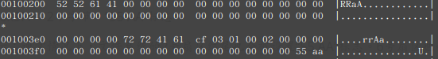

| 字节偏移 | 字段长度（字节） | 字段内容以及含义                        |
| -------- | ---------------- | --------------------------------------- |
| 0x00     | 4                | 扩展引导标签“52 52 61 41”               |
| 0x04     | 480              | 未用                                    |
| 0x1E4    | 4                | 文件系统信息签名“72 72 41 61”           |
| 0x1E8    | 4                | 空闲簇数，此处为''0x000103cf''          |
| 0x1EC    | 4                | 下一个空闲簇的簇号,此处为''0x00000002'' |
| 0x1F0    | 14               | 未用                                    |
| 0x1FE    | 2                | 结束标志“55 AA”                         |

温馨提示：通常情况下，文件系统的2号扇区结尾也会被设置“55 AA”标志。6号扇区也会有一个引导扇区的备份，相应的7号扇区应该是一个备份FSINFO信息扇区，8号扇区可以看做是2号扇区的备份。

##### 2.2.3 FAT文件分配表
  一个分区分成同等大小的簇，也就是连续空间的小块。簇的大小随着FAT文件系统的类型以及分区大小而不同，典型的簇大小介于2KB到32KB之间。每个文件根据它的大小可能占有一个或者多个簇；这样，一个文件就由这些这些（称为单向链表）簇链所表示。然而，这些链并不一定一个接着一个在磁盘上存储，它们经常是在整个数据区域零散的储存。

  **文件分配表（FAT）**是映射到分区每个簇的条目列表。每个条目记录下面五种信息中的一种。
- 链中下一个簇的地址

- 一个特殊的**簇链结束符**（EOC，End Of Cluster-chain，或称End Of Chain）符号指示链的结束

- 一个特殊的符号标示坏簇

- 一个特殊的符号标示保留簇

- 0来表示空闲簇

  每个版本的FAT文件系统使用不同大小的FAT条目。这个大小已经由名字表示出来，例如FAT16文件系统的每个条目使用16位表示，32位文件系统使用32位表示。这个不同意味着FAT32系统的文件分配表能比FAT16映射更多的簇，它也允许FAT32有更大的分区大小。这也使得FAT32比FAT16更能有效地利用磁盘空间，因为每个驱动器能够寻址更小的簇，这也就意味着更少的空间浪费。

FAT条目值：

| FAT12         | FAT16           | FAT32                   | 描述                     |
| ------------- | --------------- | ----------------------- | ------------------------ |
| 0x000         | 0x0000          | 0x?0000000              | 空闲簇                   |
| 0x001         | 0x0001          | 0x?0000001              | 保留簇                   |
| 0x002 - 0xFEF | 0x0002 - 0xFFEF | 0x?0000002 - 0x?FFFFFEF | 被占用的簇；指向下一个簇 |
| 0xFF0 - 0xFF6 | 0xFFF0 - 0xFFF6 | 0x?FFFFFF0 - 0x?FFFFFF6 | 保留值                   |
| 0xFF7         | 0xFFF7          | 0x?FFFFFF7              | 坏簇                     |
| 0xFF8 - 0xFFF | 0xFFF8 - 0xFFFF | 0x?FFFFFF8 - 0x?FFFFFFF | 文件最后一个簇           |

  注意FAT32只使用32位中的28位。高4位通常是0但它们是保留位，不要更改它们。在上面的表中它们用问号表示。

**FAT表分析说明**

  FAT32中每个簇的簇地址是有32bit（4个字节），FAT表中的所有字节位置以4字节为单位进行划分，并对所有划分后的位置由0进行地址编号。0号地址与1号地址被系统保留并存储特殊标志内容。从2号地址开始，每个地址对应于数据区的簇号，FAT表中的地址编号与数据区中的簇号相同。我们称FAT表中的这些地址为FAT表项，FAT表项中记录的值称为FAT表项值。
  当文件系统被创建，也就是进行格式化操作时，分配给FAT区域的空间将会被清空，在FAT1与FAT2的0号表项与1号表项写入特定值。由于创建文件系统的同时也会创建根目录，也就是为根目录分配了一个簇空间，通常为2号簇，与之对应的2号FAT表项记录为2号簇，被写入一个结束标记。
  由于簇号起始于2号，所以FAT表项的0号表项与1号表项不与任何簇对应。FAT32的0号表项值总是“F8FFFF0F”。
  1号表项可能被用于记录脏标志，以说明文件系统没有被正常卸载或者磁盘表面存在错误。不过这个值并不重要。正常情况下1号表项值为“FFFFFFFF”或“FFFFFF0F”。
  如果某个簇未被分配使用，它对应的FAT表项值0；
  当某个簇已被分配使用，则它对应的FAT表项内的表项值也就是该文件的下一个存储位置的簇号。如果该文件结束于该簇，则在它的FAT表项中记录的是一个文件结束标记，对于FAT32而言，代表文件结束的FAT表项值为0x0FFFFFFF。
  如果某个簇存在坏扇区，则整个簇会用0xFFFFFF7标记为坏簇，这个坏簇标记就记录在它所对应的FAT表项中。
  在文件系统中新建文件时，如果新建的文件只占用一个簇，为其分配的簇对应的FAT表项将会写入结束标记。如果新建的文件不只占用一个簇，则在其所占用的每个簇对应的FAT表项中写入为其分配的下一簇的簇号，在最后一个簇对应的FAT表象中写入结束标记。
  新建目录时，只为其分配一个簇的空间，对应的FAT表项中写入结束标记。当目录增大超出一个簇的大小时，将会在空闲空间中继续为其分配一个簇，并在FAT表中为其建立FAT表链以描述它所占用的簇情况。

下图是具体的FAT表项的内容
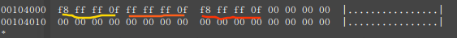

- 黄色划线：0号表项，0x0FFFFFF8,FAT表起始固定标识

- 橙色划线：1号表项，0x0FFFFFFF，不使用，默认值

- 蓝色划线：2号表项，0x0FFFFFF8，标识文件结束，表项对应2号簇，根目录所在簇

**如何找到FAT表所在扇区**：
  DBR的偏移0x0E-0x0F(0x0020=32)是保留扇区大小，保留扇区之后即为FAT1起始扇区，上图中偏移量0x4000转换为扇区就是0x4000/512=32,逻辑扇区从0开始计数，所以32扇区就是FAT1所在的起始扇区。
  在通过偏移0x24-0x27(0x00000208=520)得出每个FAT表所占的扇区，再根据520*512=0x41000得出下一个FAT表的起始偏移位置是0x45000。

##### 2.2.4 目录表
  目录所在的扇区，都是以32 Bytes划分为一个单位，每个单位称为一个目录项，即每个目录项的长度都是32 Bytes 。根目录由若干个目录项组成，一个目录项占用32个字节，可以是长文件名目录项、文件目录项、“.”目录项和“..”目录项等。

  具体格式参照FAT16的目录表格式。

  由上述的数据可以得出mbr分区表格式的fat32的文件格式的分区结构如下图：
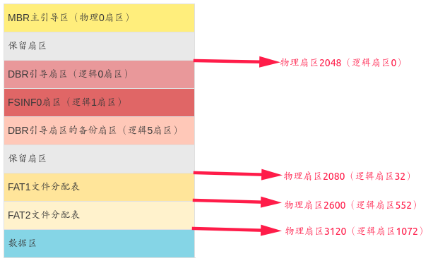