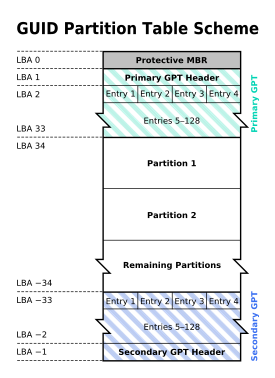
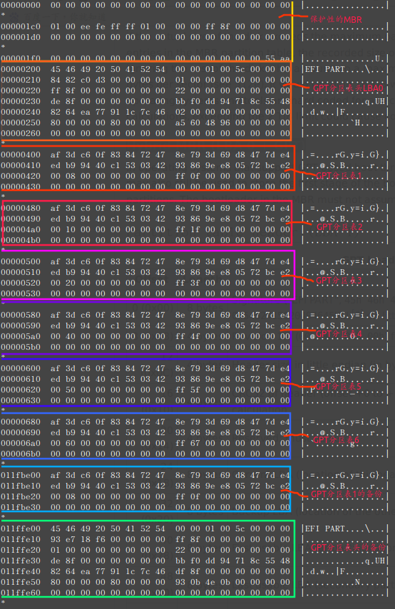
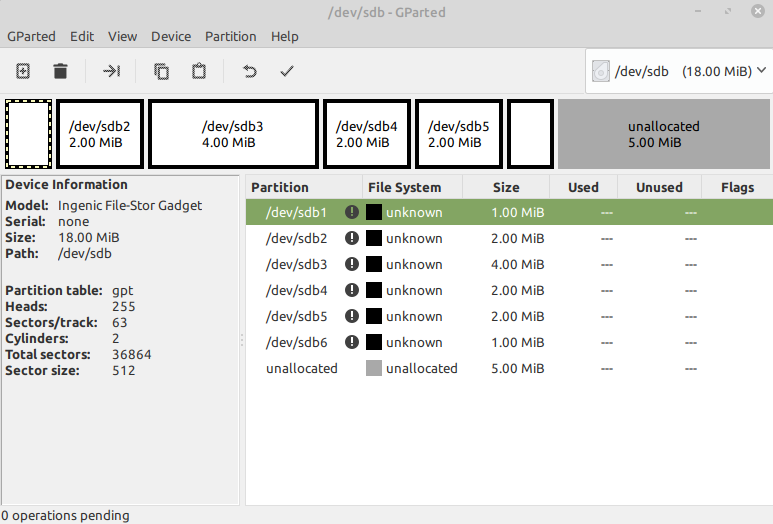

## GPT分区表（全局唯一标识分区表)
  全局唯一标识分区表（GUID Partition Table，缩写：GPT）是一个实体硬盘的分区表的结构布局的标准。它是可扩展固件接口（UEFI）标准（被Intel用于替代个人计算机的BIOS）的一部分，被用于替代BIOS系统中的一32bits来存储逻辑块地址和大小信息的主引导记录（MBR）分区表。对于那些扇区为512字节的磁盘，MBR分区表不支持容量大于2.2TB（2.2×10^12字节）的分区，然而，一些硬盘制造商（诸如希捷和西部数据）注意到这个局限性，并且将他们的容量较大的磁盘升级到4KB的扇区，这意味着MBR的有效容量上限提升到16 TiB。 这个看似“正确的”解决方案，在临时地降低人们对改进磁盘分配表的需求的同时，也给市场带来关于在有较大的块（block）的设备上从BIOS启动时，如何最佳的划分磁盘分区的困惑。GPT分配64bits给逻辑块地址，因而使得最大分区大小在2^64-1个扇区成为可能。对于每个扇区大小为512字节的磁盘，那意味着可以有9.4ZB（9.4×1021字节）或8 ZiB个512字节（9,444,732,965,739,290,426,880字节或18,446,744,073,709,551,615（2^64-1）个扇区×512（2^9）字节每扇区）

  在MBR硬盘中，分区信息直接存储于主引导记录（MBR）中（主引导记录中还存储着系统的引导程序）。但在GPT硬盘中，分区表的位置信息储存在GPT头中。但出于兼容性考虑，硬盘的第一个扇区仍然用作MBR，之后才是GPT头。

  所有现代个人计算机操作系统都支持GPT。有些版本（包括x86架构上的macOS和Microsoft Windows）仅支持在具有EFI固件的系统上从GPT分区引导，但FreeBSD和大多数Linux发行版可以在具有BIOS或EFI固件接口的系统上从GPT分区引导。

  跟现代的MBR一样，GPT也使用逻辑区块地址（LBA）取代了早期的CHS寻址方式。传统MBR信息存储于LBA 0，GPT头存储于LBA 1，接下来才是分区表本身。GPT头有一个指向分区表（分区条目数组）的指针，它通常位于LBA 2。分区表上的每个条目的大小为128字节。UEFI规范规定，无论扇区大小如何，至少为分区条目数组分配16384字节。 因此，在具有512字节扇区的磁盘上，至少32个扇区用于分区条目阵列，第一个可用块位于LBA 34或更高，而在4096字节扇区磁盘上，至少4个扇区用于分区条目阵列，第一个可用块位于LBA 6或更高。

  下图是具有GUID分区表的磁盘布局 :

​																		GPT的分区表的结构

- Prinmary  GPT(主分区)：包括一个分区表头和128个分区记录。每个分区的记录为128字节。负数的LBA地址表示从最后的块开始倒数，−1表示最后一个块。
- Secondary GPT(备份分区)：与主分区一一对应。

  我们来分析一段gpt，下面是用`sudo hexdump /dev/sdb -C`查看的18MB的U盘的gpt。

  使用gparted查看的分区结果如下：

  可以很清楚的看到，U盘分区使用了GPT分区表，并且分成了六个区，对比MBR，MBR 只能有四个主分区或逻辑分区，而GPT分区没有这个限制。

## 1.传统MBR（LBA 0）

  在GPT分区表的最开头，出于兼容性考虑仍然存储了一份传统的MBR，用来防止不支持GPT的硬盘管理工具错误识别并破坏硬盘中的数据，这个MBR也叫做保护MBR。在支持从GPT启动的操作系统中，这里也用于存储第一阶段的启动代码。在这个MBR中，只有一个标识为0xEE的分区，以此来表示这块硬盘使用GPT分区表。不能识别GPT硬盘的操作系统通常会识别出一个未知类型的分区，并且拒绝对硬盘进行操作，除非用户特别要求删除这个分区。这就避免了意外删除分区的危险。另外，能够识别GPT分区表的操作系统会检查保护MBR中的分区表，如果分区类型不是0xEE或者MBR分区表中有多个项，也会拒绝对硬盘进行操作。  
  如果磁盘的实际大小超过了使用MBR分区表中的32位LBA项可表示的最大分区大小，则此分区的记录大小将被剪裁到最大值，从而忽略磁盘的其余部分。假设每个扇区有512字节的磁盘，则这相当于MBR分区能表示的最大大小为2 TiB。这将导致有4个KiB扇区的16个TiB（4Kn），而且由于许多较旧的操作系统和工具都是针对512字节的扇区大小进行硬编码的，或者仅限于32位计算，因此超过2个TiB限制可能会导致兼容性问题。
  在操作系统中，通过BIOS服务而不是EFI支持GPT的引导，第一个扇区也可以用于存储引导加载程序代码的第一阶段，经过修改可以识别GPT分区。MBR中的引导加载程序不能假定扇区大小为512字节。

| 偏移 | 长度（字节） | 意义                                                         |
| ---- | ------------ | ------------------------------------------------------------ |
| 00H  | 1            | 分区状态：00–>非活动分区；80–>活动分区；其它数值没有意义     |
| 01H  | 1            | 分区起始磁头号（HEAD），用到全部8位                          |
| 02H  | 2            | 分区起始扇区号（SECTOR），占据02H的位0－5；该分区的起始磁柱号（CYLINDER），占据02H的位6－7（高两位）和03H的全部8位（低八位）,最大值为1023 |
| 04H  | 1            | 文件系统标志位(这里填入0xee，用来让系统识别是GPT分区)        |
| 05H  | 1            | 分区结束磁头号（HEAD），用到全部8位                          |
| 06H  | 2            | 分区结束扇区号（SECTOR），占据06H的位0－5； 该分区的结束磁柱号（CYLINDER），占据06H的位6－7（高两位）和07H的全部8位（低八位）,最大值为1023 |
| 08H  | 4            | 分区起始相对扇区号，从该磁盘的开始到该分区的开始的位移量，以扇区来计算 |
| 0CH  | 4            | 分区总的扇区数，该分区中的扇区总数                           |

  最后要加上 结束标志字 0x55，0xAA（偏移1FEH－偏移1FFH）最后两个字节，是检验主引导记录是否有效的标志。

## 2.分区表头（LBA1）

  分区表头定义了硬盘的可用空间以及组成分区表的项的大小和数量。在使用64位Windows Server 2003的机器上，最多可以创建128个分区，即分区表中保留了128个项，其中每个都是128字节。（EFI标准要求分区表最小要有16,384字节，即128个分区项的大小）
  分区表头还记录了这块硬盘的GUID，记录了分区表头本身的位置和大小（位置总是在LBA 1）以及备份分区表头和分区表的位置和大小（在硬盘的最后）。它还储存着它本身和分区表的CRC32校验。固件、引导程序和操作系统在启动时可以根据这个校验值来判断分区表是否出错，如果出错了，可以使用软件从硬盘最后的备份GPT中恢复整个分区表，如果备份GPT也校验错误，硬盘将不可使用。

| 起始字节 | 长度  | 内容                                                       |
| :------- | ----- | :--------------------------------------------------------- |
| 0        | 8字节 | 签名（"EFI PART", 45 46 49 20 50 41 52 54）                |
| 8        | 4字节 | 修订（在1.0版中，值是00 00 01 00）                         |
| 12       | 4字节 | 分区表头的大小（单位是字节，通常是92字节，即 5C 00 00 00） |
| 16       | 4字节 | 分区表头（第0－91字节）的CRC32校验                         |
| 20       | 4字节 | 保留，必须是0（00 00 00 00）                               |
| 24       | 8字节 | 当前LBA（这个分区表头的位置）   一般都为LBA1               |
| 32       | 8字节 | 备份LBA（另一个分区表头的位置）一般都在硬盘的最后一个扇区  |
| 40       | 8字节 | 第一个可用于分区的LBA（主分区表的最后一个LBA + 1）         |
| 48       | 8字节  | 最后一个可用于分区的LBA（备份分区表的第一个LBA − 1）         |
| 56       | 16字节 | 硬盘GUID（在类UNIX系统中也叫做UUID） |
| 72       | 8字节  | 分区表项的起始LBA（在主分区表中是2）                         |
| 80       | 4字节  | 分区表项的数量                                               |
| 84       | 4字节  | 一个分区表项的大小（通常是128）                              |
| 88       | 4字节  | 分区序列的CRC32校验 （校验的是整个分区表项 128×128个字节）   |
| 92       | *      | 保留，剩余的字节必须是0（对于512字节LBA的硬盘即是420个字节） |

  注：在计算时分区表头的crc32校验时，**把这个字段作为0处理，需要计算出分区序列的CRC32校验后再计算本字段**

## 3.分区表项(LBA2--LBA33)
  GPT分区表使用简单而直接的方式表示分区。一个分区表项的前16字节是分区类型GUID。例如，EFI系统分区的GUID类型是`{C12A7328-F81F-11D2-BA4B-00A0C93EC93B}`。一个分区表项的前16字节是分区类型GUID。接下来的16字节是该分区唯一的GUID（这个GUID指的是该分区本身，而之前的GUID指的是该分区的类型）。再接下来是分区起始和末尾的64位LBA编号，以及分区的名字和属性。

  从LBA2区块开始，每个LBA都可以记录4组分区记录，所以在默认情况下，总共有4*32=128组分区记录。每组记录用到128字节的空间。

  之所以叫作“GUID分区表”是因为你的驱动器上的每个分区都有一个全局唯一的标识符(globally unique identifier，GUID)——这是一个<u>随机生成的字符串</u>，可以保证为每一个GPT分区都分配完全唯一的标识符。

| 起始字节 | 长度   | 内容                                         |
| -------- | ------ | -------------------------------------------- |
| 0        | 16字节 | 分区类型GUID                                 |
| 16       | 16字节 | 分区GUID                                     |
| 32       | 8字节  | 起始LBA（小端序）                            |
| 40       | 8字节  | 末尾LBA                                      |
| 48       | 8字节  | 属性标签（如：`60`表示“只读”）               |
| 56       | 72字节 | 分区名（可以包括36个[UTF-16]（小端序）字符） |

  注意：扇区尺寸不能假定为512字节，也就是说，一个扇区内可能存放4个以上的分区项，也可能只存放一个分区项的一部分。也就是说，除了头两个扇区(LBA 0 和 LBA 1)之外，GPT规范仅定义了数据结构的尺寸，而不关心使用多少个扇区进行存储。

- 分区类型GUID

  | 相关操作系统 | 分区类型                                                     | GUID                                 |
  | ------------ | ------------------------------------------------------------ | ------------------------------------ |
  | （None）     | 未使用                                                       | 00000000-0000-0000-0000-000000000000 |
  | （None）     | EFI系统分区,必须是VFAT格式                                   | C12A7328-F81F-11D2-BA4B-00A0C93EC93B |
  | （None）     | MBR分区表                                                    | 024DEE41-33E7-11D3-9D69-0008C781F39F |
  | Linux        | 数据分区                                                     | 0FC63DAF-8483-4772-8E79-3D69D8477DE4 |
  | Linux        | RAID 分区                                                    | A19D880F-05FC-4D3B-A006-743F0F84911E |
  | Linux        | (x86)根分区，可用于无fstab时的自动挂载                       | 44479540-F297-41B2-9AF7-D131D5F0458A |
  | Linux        | (x86-64)根分区，可用于无fstab时的自动挂载                    | 4F68BCE3-E8CD-4DB1-96E7-FBCAF984B709 |
  | Linux        | (32-bit ARM)根分区，可用于无fstab时的自动挂载                | 69DAD710-2CE4-4E3C-B16C-21A1D49ABED3 |
  | Linux        | (64-bit ARM/AArch64)根分区，可用于无fstab时的自动挂载        | B921B045-1DF0-41C3-AF44-4C6F280D3FAE |

  | 相关操作系统 | 分区类型                                                     | GUID                                 |
  | ------------ | ------------------------------------------------------------ | ------------------------------------ |
  | Linux        | /boot partition                                              | BC13C2FF-59E6-4262-A352-B275FD6F7172 |
  | Linux        | 交换分区，可用于无fstab时的自动挂载                          | 0657FD6D-A4AB-43C4-84E5-0933C84B4F4F |
  | Linux        | 逻辑卷管理器(LVM)分区                                        | E6D6D379-F507-44C2-A23C-238F2A3DF928 |
  | Linux        | /HOME分区 (/home) ，可用于无fstab时的自动挂载                | 933AC7E1-2EB4-4F13-B844-0E14E2AEF915 |
  | Linux        | 服务器数据分区(/srv) 这是systemd的发明，可用于无fstab时的自动挂载 | 3B8F8425-20E0-4F3B-907F-1A25A76F98E8 |
  | Linux        | Plain dm-crypt partition                                     | 7FFEC5C9-2D00-49B7-8941-3EA10A5586B7 |
  | Linux        | LUKS partition                                               | CA7D7CCB-63ED-4C53-861C-1742536059CC |
  | Linux        | 保留                                                         | 8DA63339-0007-60C0-C436-083AC8230908 |

- 分区属性

  低位4字节表示与分区类型无关的属性，高位4字节表示与分区类型有关的属性。64位分区表属性包括所有分区类型的48位公共属性和16位类型特定属性，如下表：

  | bit  | 解释                                                       |
  | ---- | ---------------------------------------------------------- |
  | 0    | 系统分区(磁盘分区工具必须将此分区保持原样，不得做任何修改) |
  | 1    | EFI隐藏分区(EFI不可见分区)                                 |
  | 2    | 传统的BIOS的可引导分区标志                                 |
  | 3-47 | 保留                                                       |
  | 60   | 只读                                                       |
  | 61   | 浅拷贝（的另个一个分区）                                   |
  | 62   | 隐藏                                                       |
  | 63   | 不自动挂载，也就是不自动分配盘符                           |