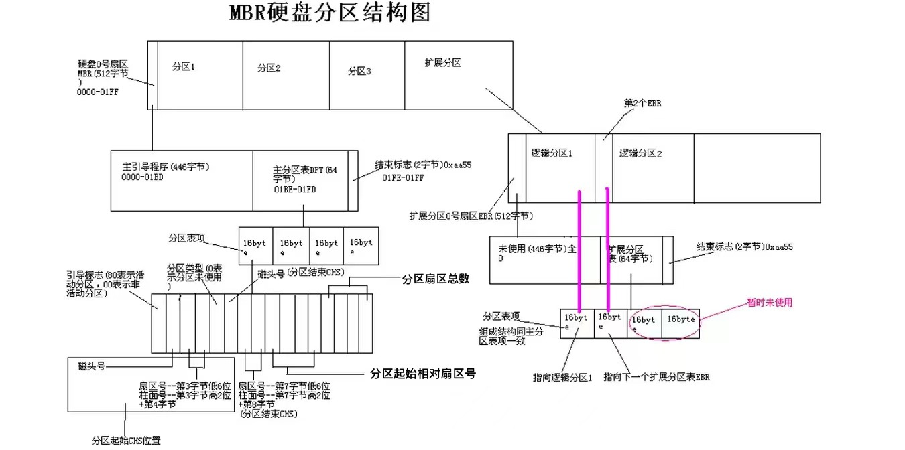
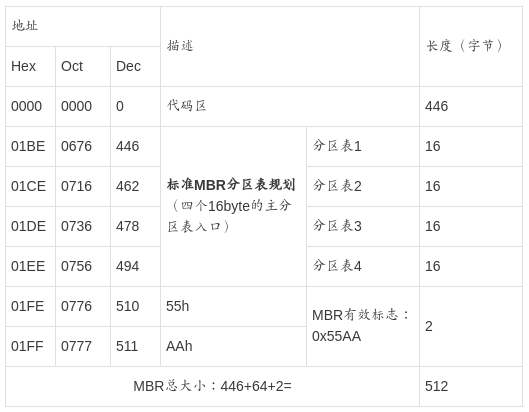
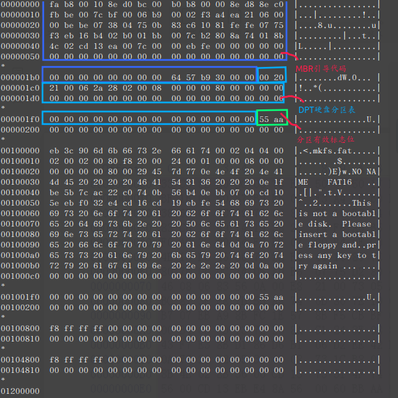
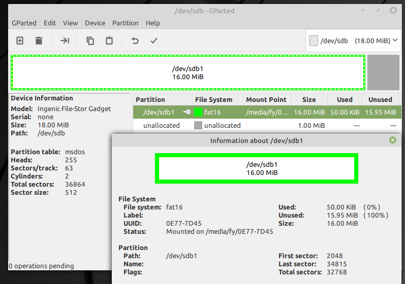
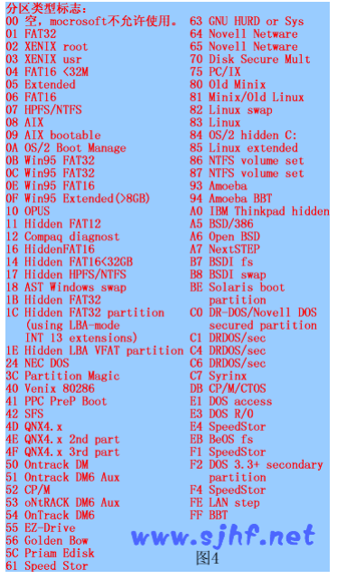
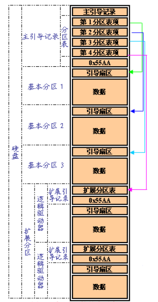
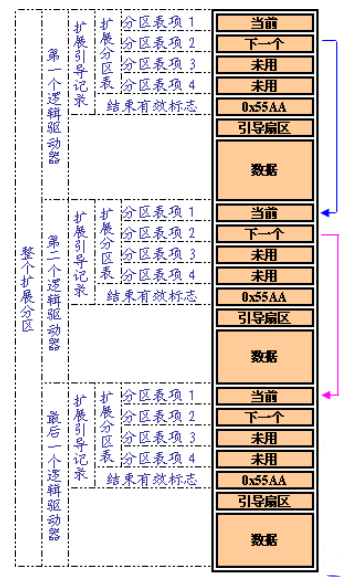
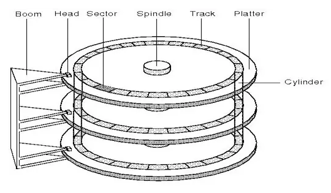

# MBR(主引导记录)

  主引导记录（Master Boot Record，缩写：MBR），又叫做主引导扇区，是一种特殊类型的引导扇区，位于分区计算机大容量存储设备（如固定磁盘或可移动驱动器）的最开始，用于IBM PC兼容系统及其他系统。也是计算机开机后访问硬盘时所必须要读取的首个扇区，它在硬盘上的三维地址为（柱面，磁头，扇区）＝（0，0，1）。

  MBR保存有关包含文件系统的逻辑分区如何在该介质上组织的信息。MBR还包含可执行代码，作为已安装操作系统的加载程序，通常通过将控制权传递给加载程序的第二阶段，或与每个分区的卷引导记录（VBR）结合使用。此MBR代码通常称为引导加载程序。

  MBR中分区表的组织将分区磁盘的最大可寻址存储空间限制为2 TiB（232×512字节）。如果官方不支持32位算术或4096字节扇区，则略微提高此限制的方法，因为它们会致命地破坏与现有引导加载程序和大多数符合MBR的操作系统和系统工具的兼容性，并且在严格控制的系统环境外使用时会导致严重的数据损坏。因此，在新的计算机中，基于MBR的分区方案正在被GUID分区表（GPT）方案所取代。GPT可以与MBR共存，以便为旧系统提供某种有限形式的向后兼容性。

  MBR不存在于非分区介质上，例如Floppie、SuperFloppie或其他配置为这样的存储设备。

  在深入讨论主引导扇区内部结构的时候，**有时也将其开头的446字节内容特指为“主引导录”（MBR）**，其后是4个16字节的“磁盘分表”（DPT），以及2字节的结束标志（55AA）。因此，在使用“主引导记录”（MBR）这个术语的时候，需要根据具体情况判断其到底是指整个主引导扇区，还是主引导扇区的前446字节。

    

主引导扇区内的信息可以通过任何一种基于某种操作系统的分区工具软件写入，但和某种操作系统没有特定的关系，即只要创建了有效的主引导记录就可以引导任意一种操作系统。  

## 1. 磁盘引导原理
  计算机在按下 power 键以后，开始执行主板 bios 程序。进行完一系列检测和配置以后。开始按 bios 中设定的系统引导顺序引导系统。假定现在是硬盘。Bios 执行完自己的程序后如何把执行权交给硬盘呢。交给硬盘后又执行存储在哪里的程序呢。其实，称为 mbr 的一段代码起着举足轻重的作用。MBR(master boot record),即主引导记录，有时也称主引导扇区。位于整个硬盘的 0 柱面 0 磁头 1 扇区(可以看作是硬盘的第一个扇区)，bios在执行自己固有的程序以后就会 jump 到 mbr 中的第一条指令。将系统的控制权交由 mbr 来执行。在总共 512byte的主引导记录中，MBR 的引导程序占了其中的前 446 个字节(偏移 0H~偏移 1BDH)，随后的 64 个字节(偏移 1BEH~偏移 1FDH)为 DPT(Disk PartitionTable，硬盘分区表)，最后的两个字节“55 AA”(偏移 1FEH~偏移 1FFH)是分区有效结束标志。
  MBR 不随操作系统的不同而不同，意即不同的操作系统可能会存在相同的 MBR，即使不同MBR 也不会夹带操作系统的性质。具有公共引导的特性。

  我们来分析一段mbr。下面是用`sudo hexdump /dev/sdb -C|more`查看的18MB的U盘的mbr。

  你的硬盘的 MBR 引导代码可能并非这样。不过即使不同，所执行的功能大体是一样的。

  我们看 DPT 部分。操作系统为了便于用户对磁盘的管理。加入了磁盘分区的概念。即将一块磁盘逻辑划分为几块。磁盘分区数目的多少只受限于 C～Z 的英文字母的数目，在上图 DPT 共 64 个字节中如何表示多个分区的属性呢? microsoft 通过链接的方法解决了这个问题。在 DPT 共 64 个字节中，以 16 个字节为分区表项单位描述一个分区的属性。也就是说，第一个分区表项描述一个分区的属性，一般为基本分区。第二个分区表项描述除基本分区外的其余空间，一般而言，就是我们所说的扩展分区。

  使用gparted查看分区结果如下：
  

## 2. MBR
### 2.1 MBR引导代码

  主引导记录最开头是第一阶段引导代码。它不依赖任何操作系统，而且启动代码也是可以改变的，从而能够实现多系统引导。  其中的硬盘引导程序的主要作用是:

- 检查分区表是否正确并且在系统硬件完成自检以后将控制权交给硬盘上的引导程序（如GNU GRUB）。
- 在分区表中寻找可引导的“活动”分区。
- 将活动分区的第一逻辑扇区内容（也叫分区引导记录，PBR）装入内存。在DOS分区中，此扇区内容称为DOS引导记录（DBR）。

### 2.2硬盘分区表DPT

  硬盘分区表DPT占据主引导扇区的64个字节（偏移01BEH--偏移01FDH），可以对四个分区的信息进行描述，其中每个分区的信息占据16个字节。具体每个字节的定义可以参见**硬盘分区结构信息**。

| 偏移 | 长度（字节） | 意义                                                         |
| ---- | ------------ | ------------------------------------------------------------ |
| 00H  | 1            | 分区状态：00–>非活动分区；80–>活动分区；其它数值没有意义     |
| 01H  | 1            | 分区起始磁头号（HEAD），用到全部8位                          |
| 02H  | 2            | 分区起始扇区号（SECTOR），占据02H的位0－5；该分区的起始磁柱号（CYLINDER），占据02H的位6－7（高两位）和03H的全部8位（低八位）,最大值为1023 |
| 04H  | 1            | 文件系统标志位                                               |
| 05H  | 1            | 分区结束磁头号（HEAD），用到全部8位                          |
| 06H  | 2            | 分区结束扇区号（SECTOR），占据06H的位0－5； 该分区的结束磁柱号（CYLINDER），占据06H的位6－7（高两位）和07H的全部8位（低八位）,最大值为1023 |
| 08H  | 4            | 分区起始相对扇区号，从该磁盘的开始到该分区的开始的位移量，以扇区来计算 |
| 0CH  | 4            | 分区总的扇区数，该分区中的扇区总数                           |

以下是一个例子：
  如果某一分区在硬盘分区表的信息如下:

  80  01 01 00  0B   FE BF FC   3F 00 00 00   7E 86 BB 00

  则我们可以知道，最前面的"80"是一个分区的激活标志，表示系统可引导；"01 01 00"表示分区开始的磁头号为1，开始的扇区号为1，开始的柱面号为0；"0B"表示分区的系统类型是FAT32，其他比较常用的有04（FAT16）、07（NTFS）；"FE BF FC"表示分区结束的磁头号为254，分区结束的扇区号为63、分区结束的柱面号为764；"3F 00 00 00"表示首扇区的相对扇区号为63（小端序）；"7E 86 BB 00"表示总扇区数为12289662（小端序）。

  <u>大于1个字节的数被被以低字节在前的存储格式格式(little endianformat)或称反字节顺序保存下来。</u>低字节在前的格式是一种保存数的方法，这样，最低位的字节最先出现在十六进制数符号中。例如，相对扇区数字段的值 0x3F000000 的低字节在前表示为 0x0000003F。这个低字节在前的格式数的十进制数为 63。

  系统在分区时，各分区都不允许跨柱面，即均以柱面为单位，这就是通常所说的分区粒度。有时候我们分区是输入分区的大小为 7000M，分出来却是 6997M，就是这个原因。 偏移 2H 和偏移 6H 的扇区和柱面参数中, 扇区占 6 位(bit)，柱面占 10 位(bit)，以偏移 6H 为例，其低 6 位用作扇区数的二进制表示。其高两位做柱面数10 位中的高两位，偏移 7H 组成的 8 位做柱面数 10 位中的低 8位。由此可知，实际上用这种方式表示的分区容量是有限的，柱面和磁头从 0 开始编号,扇区从 1 开始编号,所以最多只能表示 1024 个柱面×63 个扇区×256 个磁头×512byte=8455716864byte。即通常的 8.4GB(实际上应该是 7.8GB 左右)限制。实际上磁头数通常只用到 255个(由汇编语言的寻址寄存器决定),即使把这 3 个字节按线性寻址，依然力不从心。 在后来的操作系统中，超过8.4GB 的分区其实已经不通过 C/H/S 的方式寻址了。而是通过偏移 CH～偏移 FH 共 4 个字节 32 位线性扇区地址来表示分区所占用的扇区总数。可知通过 4 个字节可以表示 2^32 个扇区，即 2TB=2048GB，目前对于大多数计算机而言，这已经是个天文数字了。在未超过 8.4GB 的分区上，C/H/S 的表示方法和线性扇区的表示方法所表示的分区大小是一致的。也就是说，两种表示方法是协调的。即使不协调，也以线性寻址为准。(可能在某些系统中会提示出错)。超过 8.4GB 的分区结束 C/H/S 一般填充为 FEH FFH FFH。即 C/H/S 所能表示的最大值。有时候也会用柱面对 1024 的模来填充。不过这几个字节是什么其实都无关紧要了。

  虽然现在的系统均采用线性寻址的方式来处理分区的大小。但不可跨柱面的原则依然没变。本分区的扇区总数加上与前一分区之间的保留扇区数目依然必须是柱面容量的整数倍。(保留扇区中的第一个扇区就是存放分区表的 MBR 或虚拟 MBR 的扇区，分区的扇区总数在线性表示方式上是不计入保留扇区的。如果是第一个分区，保留扇区是本分区前的所有扇区。

-  文件系统标志位：

  

  总结：

  - 所谓的分区就是针对64字节的分区表进行设置而已。
  - **磁盘默认的分区表仅能写入四组分区信息**，每组记录区记录了该区段的起始与结束的柱面号码。
  - 这四个分区的记录被称为主要（Primary）分区或扩展（Extended）分区。
  - 当系统要写入磁盘时，一定会参考磁盘分区表，才能针对某个分区进行数据的处理。
  - 一般的盘都是非活动分区，只有C盘这种引导盘类型的才会设置为活动分区

### 2.3 结束标志字（分区有效标志位）
  结束标志字 0x55，0xAA（偏移1FEH－偏移1FFH）最后两个字节，是检验主引导记录是否有效的标志。

## 3 扩展分区
  扩展分区中的每个逻辑驱动器都存在一个类似于 MBR 的扩展引导记录( Extended Boot Record, EBR)，也有人称之为虚拟 mbr 或扩展 mbr，意思是一样的。扩展引导记录包括一个扩展分区表和该扇区的标签。扩展引导记录将记录只包含扩展分区中每个逻辑驱动器的第一个柱面的第一面的信息。一个逻辑驱动器中的引导扇区一般位于相对扇区 32 或 63。但是，如果磁盘上没有扩展分区，那么就不会有扩展引导记录和逻辑驱动器。第一个逻辑驱动器的扩展分区表中的第一项指向它自身的引导扇区。第二项指向下一个逻辑驱动器的 EBR。如果不存在进一步的逻辑驱动器，第二项就不会使用，而且被记录成一系列零。如果有附加的逻辑驱动器，那么第二个逻辑驱动器的扩展分区表的第一项会指向它本身的引导扇区。第二个逻辑驱动器的扩展分区表的第二项指向下一个逻辑驱动器的EBR。扩展分区表的第三项和第四项永远都不会被使用。
  通过一幅 4 分区的磁盘结构图可以看到磁盘的大致组织形式，如下图：

  关于扩展分区，如下图所示，扩展分区中逻辑驱动器的扩展引导记录是一个连接表。该图显示了一个扩展分区上的三个逻辑驱动器，说明了前面的逻辑驱动器和最后一个逻辑驱动器之间在扩展分区表中的差异。  

  除了扩展分区上最后一个逻辑驱动器外，下表中所描述的扩展分区表的格式在每个逻辑驱动器中都是重复的：第一个项标识了逻辑驱动器本身的引导扇区，第二个项标识了下一个逻辑驱动器的EBR。最后一个逻辑驱动器的扩展分区表只会列出它本身的分区项。最后一个扩展分区表的第二个项到第四个项被使用。

| 扩展分区表项 | 分区表项的内容                                               |
| ------------ | ------------------------------------------------------------ |
| 第一个项     | 包括数据的开始地址在内的与扩展分区中当前逻辑驱动器有关的信息 |
| 第二个项     | 有关扩展分区中的下一个逻辑驱动器的信息，包括包含下一个逻辑驱动器的EBR的扇区地址。如果不存在进一步的逻辑驱动器的话，该字段不会被使用 |
| 第三个项     | 未用                                                         |
| 第四个项     | 未用                                                         |

  扩展分区表项中的相对扇区数字段所显示的是从扩展分区开始到逻辑驱动器中第一个扇区的位移的字节数。总扇区数字段中的数是指组成该逻辑驱动器的扇区数目。总扇区数字段的值等于从扩展分区表项所定义的引导扇区到逻辑驱动器末尾的扇区数。
  有时候在磁盘的末尾会有剩余空间，剩余空间是什么呢？我们前面说到，分区是以 1 柱面的容量为分区粒度的，那么如果磁盘总空间不是整数个柱面的话，不够一个柱面的剩下的空间就是剩余空间了，这部分空间并不参与分区，所以一般无法利用。

总结：

  - **主分区和扩展分区最多可以有4个（硬盘限制）**。
  - 扩展分区最多只能有1个（操作系统限制）。
  - 逻辑分区是由扩展分区持续划分出来的分区。
  - 能够被格式化后作为数据存取的分区是主分区和逻辑分区，扩展分区无法格式化。
  - 逻辑分区的数量依操作系统而不同，在Linux中SATA硬盘已经可以突破63个以上的分区限制。
  - 一般建议将扩展分区的柱面号码分配到最后的柱面内。

## 5. CHS寻址与块号之间的相互转化
### 5.1 磁盘结构

  
  读取数据时以磁头(Heads)转圈的方式进行，在磁片(platter)同心圆中切出一个一个的小区块，这些小区块就是磁盘的最小物理存储单位，成为扇区（sector），同一个同心圆的扇区组合成的圆就是磁道（track）。由于磁盘里可能会有多个碟片，因此在所有碟片上面的同一个磁道可以组成 柱面（cylinder)。

### 5.2 CHS寻址与块号之间的相互转化

 磁头数是磁道数
存放数据时，先存满扇区，后存满磁道，再存满柱面。
**每个柱面上的磁道数（heads）×每个磁道上的扇区数（sectors）=每个柱面上磁盘块数**
 (1)已知块号，则磁盘驱动用的三地址：
      柱面号＝ [ 块号 /   (每个柱面上磁盘块数) ]
      磁头号＝ [ 块号 % (每个柱面上磁盘块数) ]  / 每个磁道上的扇区数
      扇区号＝ [ 块号 % (每个柱面上磁盘块数) ] % 每个磁道上的扇区数+1
(2)已知磁盘块物理地址，则磁盘块号：
     块号＝柱面号 × (每个柱面上磁盘块数)＋磁头号 × 每个磁道上的扇区数＋扇区号-1

