# USB_UVC 摄像头参数功能说明

## 1. UVC数据格式说明

1. 向UVC配置结构体中填充摄像头支持的格式。

   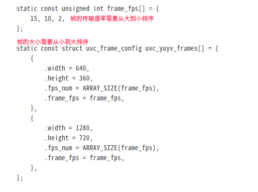

   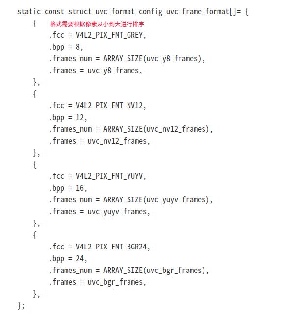

   

2. 在UVC摄像头格式回调函数中，进行修改数据源。

   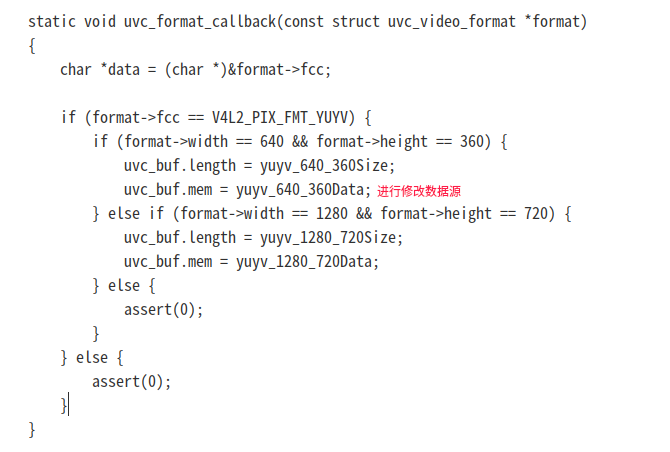

## 2. UVC功能或参数使用流程

### 2.1  UVC请求

#### 2.1.1 UVC请求结构体介绍

```c
struct uvc_control_request {
             void* buf;                                    // 数据缓冲区
             unsigned int buf_actual;     // 实际收到的数据度
             unsigned char request;        // 请求
             unsigned int request_len;  // 请求长度
             unsigned char entity_id;    // 实体ID
             unsigned char control_selector; // 控制选择器
             unsigned char event_out;  // 标记是否主机输出
 };
```

#### 2.1.2 UVC请求列表

```c
#define UVC_SET_CUR 0x01 // 设置当前值
#define UVC_GET_CUR 0x81 // 获取当前值
#define UVC_GET_MIN 0x82 // 获取最小值
#define UVC_GET_MAX 0x83 // 获取最大值
#define UVC_GET_RES 0x84 // 不同控件请求代表含义不同
#define UVC_GET_LEN 0x85 // 获取数据长度
#define UVC_GET_INFO 0x86 // 获取控制的功能状态信息
#define UVC_GET_DEF 0x87 // 获取默认值
```

#### 2.1.3 UVC_GET_INFO请求详解

UVC_GET_INFO请求的数据长度始终为1个字节，而UVC_GET_INFO请求中反映控件状态的两位是D2和D5, 其他位是功能位。 状态位更改时，功能位不应更改。 例如，当控件设置为“自动模式”（设置为D2）时，不得在GET_INFO中更新位D1。 如果实现了可以设置D2的控件，则设备需要具有发送控制更改中断的能力，因此必须设置D3（自动更新控件）。 如果实现了可设置D5的控件，则设备应具有发送控件更改中断的能力。如果实现了编码单元控件，使得设备可以启动该控件的最小和/或最大设置属性的更改，则该设备应具有发送控制更改中断的能力，以通知主机新的GET_MIN和GET_MAX设置，因此必须设置D3（自动更新控制）。

`注意：目前代码仅支持D0、D1功能位。`

| Bit field | description                            | bit state |
| --------- | -------------------------------------- | --------- |
| D0        | 置1 支持GET值请求                      | 功能位    |
| D1        | 置1 支持SET值请求                      | 功能位    |
| D2        | 置1 由于自动模式而被禁用（在设备控制） | 状态位    |
| D3        | 置1 自动更新控制                       | 功能位    |
| D4        | 置1 异步控制                           | 功能位    |
| D5        | 置1 由于与Commit状态不兼容而被禁用。   | 状态位    |
| D6 D7     | 保留（设置为0）                        | _         |

####  2.1.4 UVC实体ID

```c
#define UVC_ENTITY_CAMERA_TERMINAL_ID   0x01     // 摄像头终端ID
#define UVC_ENTITY_PROCESS_UNIT_ID            0x02     // 处理单元ID
#define UVC_ENTITY_OUTPUT_TERMINAL_ID   0x03      // 输出终端ID
```

### 2. 2 UVC添加功能或参数配置流程

1. 在配置结构体中添加对应功能或参数的宏

   camera_param_config：需要添加UVC摄像头参数时，赋对应的值，不需要时赋0。

   camera_feature_config：需要添加UVC摄像头功能时，赋对应的值，不需要时赋0。

   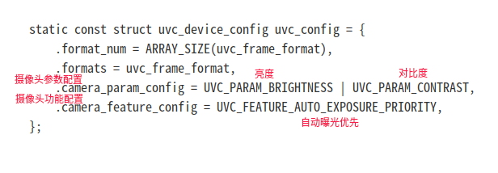

2. 在参数回调函数中添加对应的功能处理流程

   在回调函数根据请求进行匹配相应的摄像头功能或参数，然会进行处理相应的请求。

   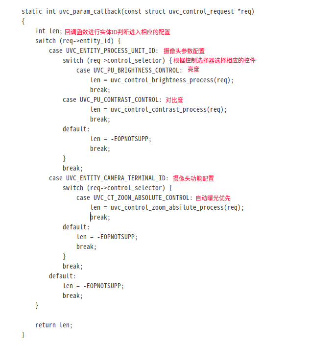

3. 处理添加功能的请求函数

   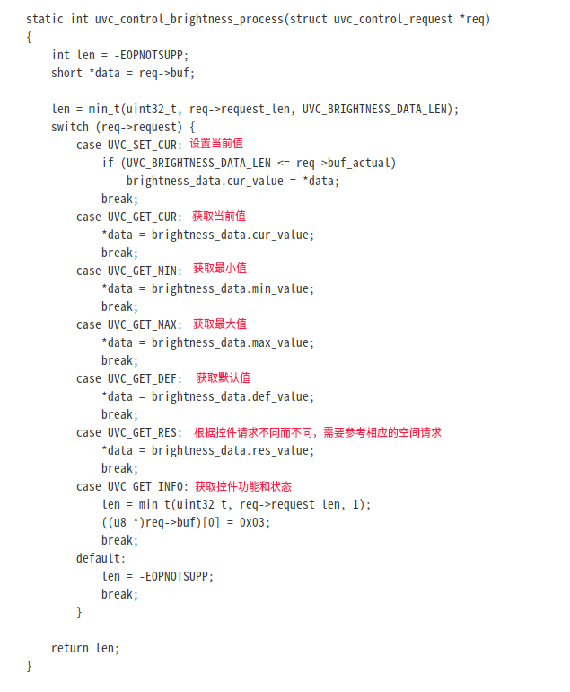

### 2.3  UVC摄像头功能控件请求

#### 2.3.1 扫描模式控制（Scanning Mode Control）

扫描模式控制设置用于控制相机传感器的扫描模式。 值为0表示启用了隔行扫描模式，值为1表示启用了逐行或非隔行扫描模式。

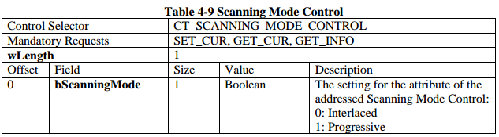

#### 2.3.2 自动曝光模式控制（Auto-Exposure Mode Control）

自动曝光模式控件确定设备是否将自动调整曝光时间和光圈控件。向该控件发出的GET_RES请求将返回此控件支持的模式的位图。 对此控件的有效请求将仅设置一位（选择单个模式）。 该控件必须接受GET_DEF请求并返回其默认值。

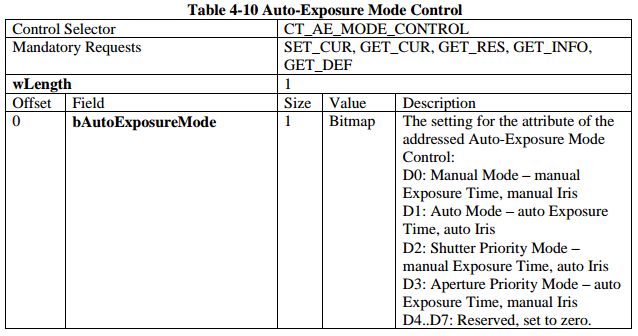

#### 2.3.3 自动曝光优先控制（Auto-Exposure Priority Control）

当自动曝光模式控件设置为自动模式或快门优先模式时，自动曝光优先级控件用于指定对曝光时间控件的约束。 值0表示帧速率必须保持恒定。 值1表示设备可以动态更改帧速率。 默认值为零（0）。

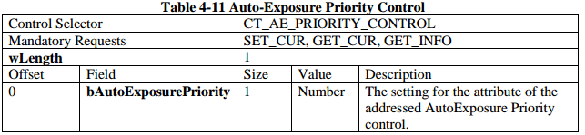

#### 2.3.4 曝光时间（绝对）控制（Exposure Time (Absolute) Control）

曝光时间（绝对）控件用于指定曝光时间。 此值以100µs单位表示，其中1是1 / 10,000秒，10,000是1秒，100,000是10秒。 未定义0的值。 请注意，手动曝光控制还受到帧间隔的限制，该间隔始终具有较高的优先级。 如果将帧间隔更改为低于曝光控制当前值的值，则曝光控制值将自动更改。 默认的“曝光控制”值将是当前帧间隔，直到选择了明确的曝光值为止。 该控件必须接受GET_DEF请求并返回其默认值。

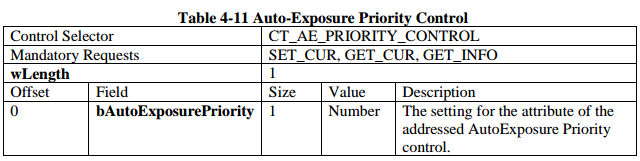

#### 2.3.5 曝光时间（相对）控制（Exposure Time (Relative) Control）

曝光时间（相对）控制用于指定电子快门速度。 该值以增加或减少的曝光时间步长表示。 值1表示曝光时间进一步增加一级，值0xFF表示曝光时间进一步减少一级。 此步骤是特定于实现的。 值0表示将曝光时间设置为实现的默认值。 如果同时支持相对控制和绝对控制，则相对控制的SET_CUR值为0x00以外的值将导致绝对控制的控制更改中断。

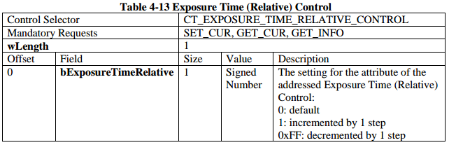

#### 2.3.6 聚焦（绝对）控制（Focus (Absolute) Control）

聚焦（绝对）控件用于指定到最佳聚焦目标的距离。 该值以毫米表示。 默认值是特定于实现的。 该控件必须接受GET_DEF请求并返回其默认值。

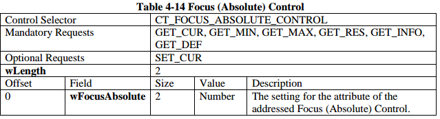

#### 2.3.7 聚焦（相对）控制（Focus (Relative) Control）

聚焦（相对）控件用于移动聚焦透镜组，以指定到最佳聚焦目标的距离。bFocusRelative字段指示聚焦透镜组是停止还是在近距离或无限远方向上移动。 值1表示聚焦透镜组向近方向移动。 值为0表示聚焦透镜组已停止。 值为0xFF表示镜头组朝无限远方向移动.GET_MIN，GET_MAX，GET_RES和GET_DEF请求将在该字段返回零。bSpeed字段指示镜头组移动的速度。 数字低表示速度慢，数字高表示速度高。 GET_MIN，GET_MAX和GET_RES请求用于检索此字段的范围和分辨率。 GET_DEF请求用于检索此字段的默认值。 如果控件不支持速度控制，它将为所有这些请求在此字段中返回值1。 如果同时支持相对控件和绝对控件，则在运动结束时，相对控件的SET_CUR值（非0x00）将导致绝对控件的控件更改中断。 移动的结束可能是由于物理设备限制，也可能是由于主机明确要求停止移动。 如果运动的结束是由于物理设备的限制（例如运动范围的限制），则应为该相对控制生成控制更改中断。 如果运动范围没有限制，则不需要控制更改中断。 

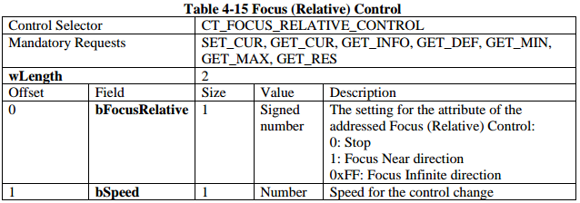

#### 2.3.8 聚焦，简单范围（ Focus, Simple Range）

聚焦，简单控制设置可在非常细微的级别上确定镜头的绝对焦点：微距，人物和场景。 仅当相机处于手动或自动对焦模式时，才可以使用此控件。 该控件必须接受GET_DEF请求并返回其默认值。 

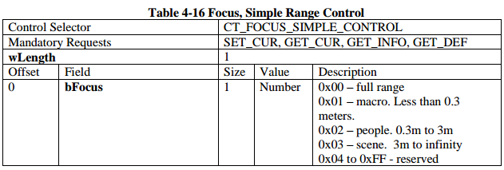

#### 2.3.9 自动聚焦控制（Focus, Auto Control）

自动聚焦控制设置确定设备是否将提供对焦点绝对控制和/或相对控制的自动调整。 值1表示启用自动调整。 该控件必须接受GET_DEF请求并返回其默认值。

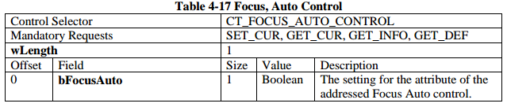

#### 2.3.10 虹膜（绝对）控制（ Iris (Absolute) Control）

虹膜（绝对）控制用于指定相机的光圈设置。 该值以fstop * 100为单位表示。默认值是特定于实现的。 当“自动曝光模式”控件处于“自动”模式或“快门优先”模式时，此控件将不接受SET请求，并且在这种情况下控制管道应指示失速。 该控件必须接受GET_DEF请求并返回其默认值。

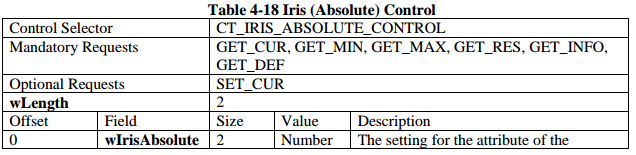

#### 2.3.11 虹膜（相对）控制（Iris (Relative) Control）

虹膜（相对）控件用于指定相机的光圈设置。 此值为带符号整数，表示打开或关闭光圈的步骤数。 值1表示光圈进一步打开了1步。 值0xFF表示虹膜关闭了1步。 此步骤是特定于实现的。 值0表示将光圈设置为实现的默认值。 默认值是特定于实现的。 当“自动曝光模式”控件处于“自动”模式或“快门优先”模式时，此控件将不接受SET请求，并且在这种情况下控制管道应指示失速。如果同时支持相对控制和绝对控制，则相对控制的SET_CUR值为0x00以外的值将导致绝对控制的控制更改中断。

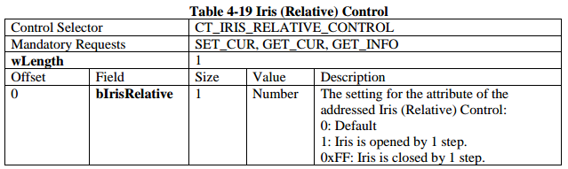

#### 2.3.12 缩放（绝对）控制（Zoom (Absolute) Control）

缩放（绝对）控件用于指定或确定物镜的焦距。 该控件与Camera Terminal描述符中的wObjectiveFocalLengthMin和wObjectiveFocalLengthMax字段结合使用，以描述和控制设备的物镜焦距。 MIN和MAX值足以暗示分辨率，因此RES值必须始终为1。MIN，MAX和默认值取决于实现。 该控件必须接受GET_DEF请求并返回其默认值。

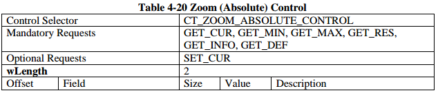

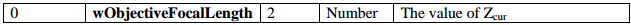

#### 2.3.13 缩放（相对）控制（Zoom (Relative) Control）

缩放（相对）控件用于相对于变焦指定变焦焦距。bZoom字段指示变焦镜头组是否停止或变焦镜头的方向。 值为1表示变焦镜头朝远摄方向移动。 值为零表示变焦镜头已停止，值为0xFF表示变焦镜头朝着广角方向移动。 GET_MIN，GET_MAX，GET_RES和GET_DEF请求将为此字段返回零。bDigitalZoom字段指定启用还是禁用数字缩放。 如果设备仅支持数字缩放，则该字段将被忽略。 GET_DEF请求将返回此字段的默认值。 GET_MIN，GET_MAX和GET_RES请求将为此字段返回零。bSpeed字段指示控制更改的速度。 数字低表示速度较慢，数字高表示速度较高。 GET_MIN，GET_MAX和GET_RES请求用于检索此字段的范围和分辨率。GET_DEF请求用于检索此字段的默认值。 如果控件不支持速度控制，它将为所有这些请求在此字段中返回值1。如果同时支持相对控件和绝对控件，则在运动结束时，相对控件的SET_CUR值（非0x00）将导致绝对控件的控件更改中断。 移动的结束可能是由于物理设备限制，也可能是由于主机明确要求停止移动。 如果运动的结束是由于物理设备的限制（例如运动范围的限制），则应为该相对控制生成控制更改中断。

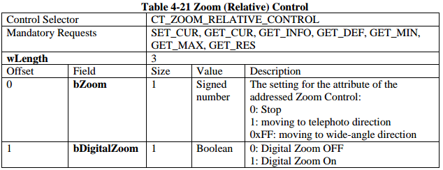

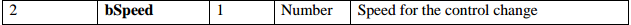

#### 2.3.14 平移倾斜（绝对）控制（PanTilt (Absolute) Control）

平移倾斜（绝对）控件用于指定平移和倾斜设置。 dwPanAbsolute用于以弧秒为单位设置。 1弧秒是1/3600度。 值的范围是–180 * 3600弧秒到+ 180 * 3600弧秒或其子集，默认设置为零。 正值是从原点开始的顺时针方向（从上方看时，摄像机会顺时针旋转），负值是从原点开始的逆时针方向。 该控件必须接受GET_DEF请求并返回其默认值。 dwTiltAbsolute控件用于以弧度秒为单位指定倾斜设置。 1弧秒是1/3600度。 值的范围是–180 * 3600弧秒到+ 180 * 3600弧秒或其子集，默认设置为零。 正值使成像平面朝上，负值使成像平面朝下。 该控件必须接受GET_DEF请求并返回其默认值.

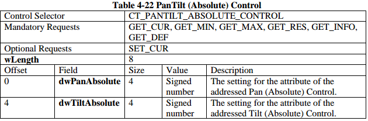

#### 2.3.15 平移倾斜（相对）控制（PanTilt (Relative) Control）

平移倾斜（相对）控件用于指定要移动的平移和倾斜方向。 bPanRelative字段用于指定要移动的声相方向。值0表示停止移动，值1表示开始沿顺时针方向移动，值0xFF表示开始沿逆时针方向移动。 GET_DEF，GET_MIN，GET_MAX和GET_RES请求将为此字段返回零。 bPanSpeed字段用于指定平移方向的移动速度。数字低表示速度较慢，数字高表示速度较高。 GET_MIN，GET_MAX和GET_RES请求用于检索此字段的范围和分辨率。 GET_DEF请求用于检索此字段的默认值。如果该控件不支持Pan控件的速度控制，它将为所有这些请求在此字段中返回值1。bTiltRelative字段用于指定要移动的倾斜方向。值为零表示停止倾斜，值为1表示摄像机将成像平面指向上方，值为0xFF表示摄像机将成像平面指向下方。GET_DEF，GET_MIN，GET_MAX和GET_RES请求将为此字段返回零。 bTiltSpeed字段用于指定倾斜方向的移动速度。数字低表示速度较慢，数字高表示速度较高。 GET_MIN，GET_MAX和GET_RES请求用于检索此字段的范围和分辨率。GET_DEF请求用于检索此字段的默认值。如果控件不支持倾斜控件的速度控制，它将为所有这些请求在此字段中返回值1。如果同时支持相对控件和绝对控件，则在运动结束时，相对控件的SET_CUR值（非0x00）将导致绝对控件的控件更改中断。移动的结束可能是由于物理设备限制，也可能是由于主机明确要求停止移动。如果运动的结束是由于物理设备的限制（例如运动范围的限制），则应为该相对控制生成控制更改中断。如果运动范围没有限制，则不需要控制更改中断。

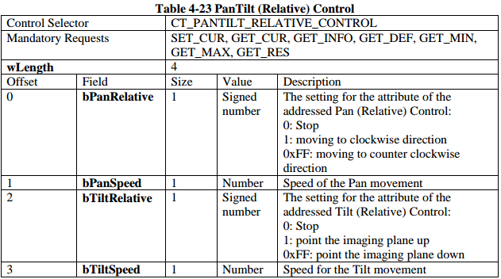

#### 2.3.16 滚动（绝对）控制（Roll (Absolute) Control）

滚动（绝对）控件用于指定以度为单位的滚动设置。 值的范围是– 180至+180，或其子集，默认设置为零。 正值导致相机沿图像查看轴顺时针旋转，负值导致相机逆时针旋转。 该控件必须接受GET_DEF请求并返回其默认值。

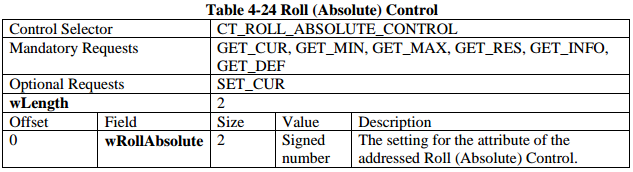

#### 2.3.17  滚动（相对）控制（Roll (Relative) Control）

滚动（相对）控件用于指定要移动的滚动方向。bRollRelative字段用于指定要移动的滚动方向。值0表示停止滚动，值1表示开始沿着图像查看轴按相机的顺时针方向旋转，值0xFF表示开始沿逆时针方向移动。 GET_DEF，GET_MIN，GET_MAX和GET_RES请求将为此字段返回零。 bSpeed用于指定横滚运动的速度。数字低表示速度较慢，数字高表示速度较高。 GET_MIN，GET_MAX和GET_RES请求用于检索此字段的范围和分辨率。 GET_DEF请求用于检索此字段的默认值。如果控件不支持速度控制，它将为所有这些请求在此字段中返回值1。如果同时支持相对控制和绝对控制，则相对控制的SET_CUR值为0x00以外的值将导致绝对控制的控制更改中断。移动的结束可能是由于物理设备限制，也可能是由于主机明确要求停止移动。如果运动的结束是由于物理设备的限制（例如运动范围的限制），则应为该相对控制生成控制更改中断。如果运动范围没有限制，则不需要控制更改中断。

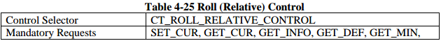

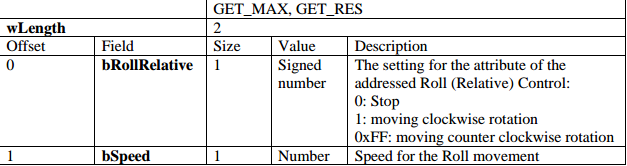

#### 2.3.18 隐私控制（ Privacy Control）

隐私控制设置用于防止摄像机传感器捕获视频。 值0表示相机传感器能够捕获视频图像，而值1表示相机传感器无法捕获视频图像。 该控件应报告为自动更新控件

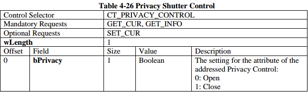

#### 2.3.19 数字窗控制（Digital Window Control）

窗口化API基于“像素”坐标，其中传感器上像素的每一行和每一列都可以用零-（高度1）和零-（宽度1）之间的整数表示。 0,0处的点是坐标系的左上角，而（height-1），（width-1）则是坐标系的右下角。CT_DIGITAL_WINDOW_CONTROL用于指定要查看的目标窗口，以及从控件指定的新窗口移动到当前窗口所要执行的步骤数。 为了防止指定无效的窗口：
wWindow_Bottom≥wWindow_Top和wWindow_Right≥wWindow_Left GET_MAX应该以bmNumStepsUnits指示的单位返回传感器大小以及支持的最大步数。 如果尚未设置bmNumStepsUnits，则应使用默认值。 GET_CUR返回用于捕获的数字窗口的当前坐标。 如果设备在设置之间移动（例如wNumSteps> 1），则GET_CUR引用当前步骤的数字窗口。

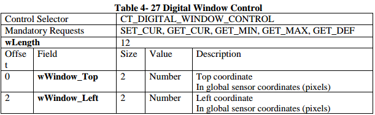

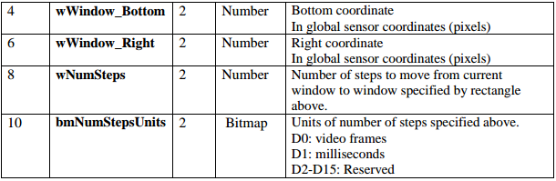

#### 2.3.20 数字敏感区域（ROI）控制（ Digital Region of Interest (ROI) Control）

由CT_REGION_OF_INTEREST_CONTROL指定的矩形将位于全局传感器坐标中。 单位以像素为单位，与视场无关。 它们不受当前正在使用的任何裁剪或缩放的影响。 ROI必须在CT_WINDOW控件指定的当前数字窗口内。 bmAutoControls位掩码确定应该跟踪到敏感区域的板载功能。 要检测设备是否支持特定的自动控制，请使用GET_MAX，该方法返回一个掩码，指示所有受支持的自动控制。

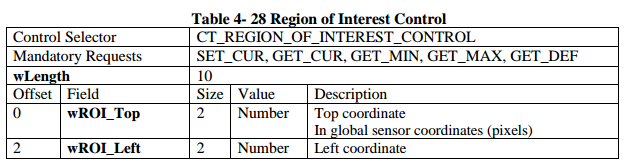

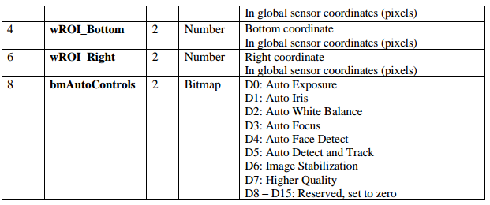

### 2.4 UVC摄像头参数控制请求

#### 2.4.1 背光补偿控制（Backlight Compensation Control）

背光补偿控件用于指定背光补偿。 零值表示禁用背光补偿。 非零值表示启用了背光补偿。 该设备可以支持一定范围的值，或者仅支持二进制开关。 如果支持范围，则数字较小表示背光补偿量最少。 默认值为特定于实现的，但建议启用背光补偿。 该控件必须接受GET_DEF请求并返回其默认值。

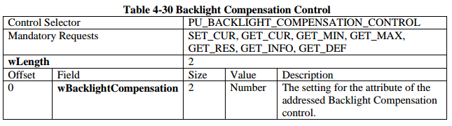

#### 2.4.2 亮度控制（Brightness Control）

这用于指定亮度。 这是一个相对值，其中增加的值表示增加的亮度。 MIN和MAX值足以暗示分辨率，因此RES值必须始终为1。MIN，MAX和默认值取决于实现。 该控件必须接受GET_DEF请求并返回其默认值。

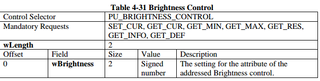

#### 2.4.3 对比控制 （ Contrast Control）

用于指定对比度值。 这是一个相对值，其中增加的值表示增加的对比度。 MIN和MAX值足以暗示分辨率，因此RES值必须始终为1。MIN，MAX和默认值取决于实现。 该控件必须接受GET_DEF请求并返回其默认值

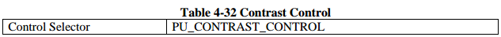

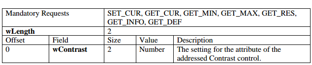

#### 2.4.4 对比度自动控制（Contrast, Auto Control）

对比度自动控制设置确定设备是否将提供相关控制的自动调整。 值1表示启用自动调整。 该控件必须接受GET_DEF请求并返回其默认值。

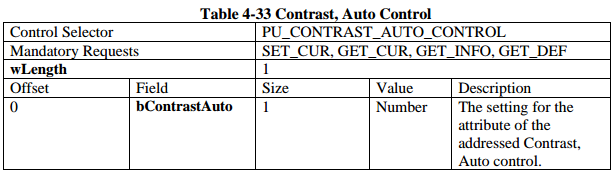

#### 2.4.5 增益控制（Gain Control）

这用于指定增益设置。 这是一个相对值，其中增加的值表示增加的增益。 MIN和MAX值足以暗示分辨率，因此RES值必须始终为1。MIN，MAX和默认值取决于实现。 该控件必须接受GET_DEF请求并返回其默认值。

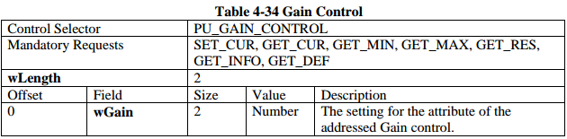

#### 2.4.6 电源线频率控制（Power Line Frequency Control）

此控制允许主机软件指定本地电源线频率，以使设备正确实施防闪烁处理（如果支持）。 默认值是特定于实现的。 该控件必须接受GET_DEF请求并返回其默认值。

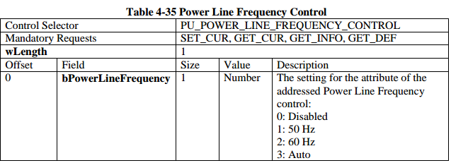

#### 2.4.7 色调控制（Hue Control）

这用于指定色调设置。 色调设置的值以度数乘以100表示。所需的范围必 是-18000到18000（-180到+180度）的子集。 默认值必须为零。 该控件必须接受GET_DEF请求并返回其默认值。

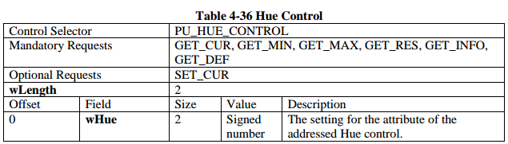

#### 2.4.8 色调自动控制（Hue, Auto Control）

色调自动控制设置确定设备是否将提供对相关控制的自动调整。 值1表示启用自动调整。 该控件必须接受GET_DEF请求并返回其默认值。

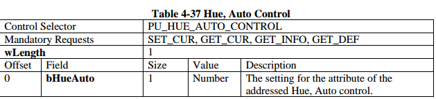

#### 2.4.9 饱和度控制（Saturation Control）

这用于指定饱和度设置。 这是一个相对值，其中增加的值表示增加的饱和度。 饱和度值为0表示灰度。 MIN和MAX值足以暗示分辨率，因此RES值必须始终为1。MIN，MAX和默认值取决于实现。 该控件必须接受GET_DEF请求并返回其默认值。

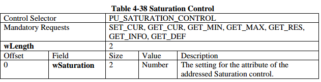

#### 2.4.10 清晰度控制（ Sharpness Control）

这用于指定清晰度设置。 这是一个相对值，其中增加的值表示锐度增加，而MIN值始终表示“不进行锐度处理”，在这种情况下，设备将不处理视频图像以锐化边缘。 MIN和MAX值足以暗示分辨率，因此RES值必须始终为1。MIN，MAX和默认值取决于实现。 该控件必须接受GET_DEF请求并返回其默认值。

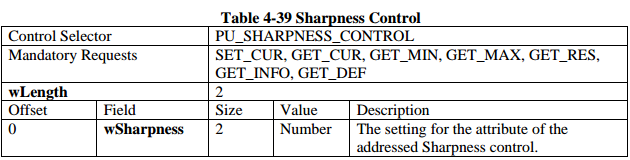

#### 2.4.11 伽玛控制（Gamma Control）

这用于指定伽玛设置。 伽玛设置的值以伽玛乘以100表示。所需范围必须是1到500的子集，默认值通常是100（伽玛= 1）或220（伽玛= 2.2）。 该控件必须接受GET_DEF请求并返回其默认值。

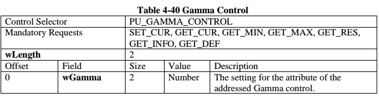

#### 2.4.12 白平衡温度控制（White Balance Temperature Control）

用于将白平衡设置指定为色温，以开尔文为单位。 这是白平衡组件控件的替代选项。 对于网络摄像头和双模相机，最小范围应为2800（白炽灯）至6500（日光）。 白平衡温度的支持范围和默认值取决于实现方式。 该控件必须接受GET_DEF请求并返回其默认值。

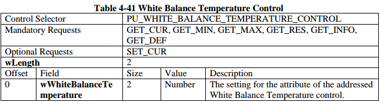

#### 2.4.13 白平衡温度自动控制（White Balance Temperature, Auto Control）

白平衡温度自动控制设置确定设备是否将自动调节相关控制。 值1表示启用自动调整。  该控件必须接受GET_DEF请求并返回其默认值。

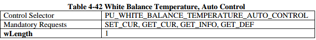

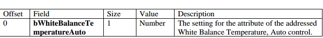

#### 2.4.14 白平衡组件控制（White Balance Component Control）

用于将白平衡设置指定为视频格式的蓝色和红色值。 这是白平衡温度控制的替代选择。 白平衡组件支持的范围和默认值取决于实现。 设备应将控件解释为蓝色和红色对。 该控件必须接受GET_DEF请求并返回其默认值。

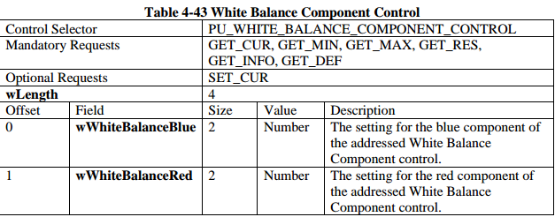

#### 2.4.15 白平衡组件自动控制（White Balance Component, Auto Control）

白平衡组件自动控制设置确定设备是否将提供相关控制的自动调整。 值1表示启用自动调整。 该控件必须接受GET_DEF请求并返回其默认值。

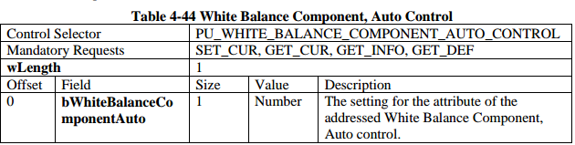

#### 2.4.16 数字乘法器控制 （Digital Multiplier Control）

不建议使用此控件，在本规范的下一修订版中将删除该控件。这用于指定应用于光学图像的数字变焦量。这是乘数m可能值范围内的位置，从而可以通过设备实现方式描述乘数分辨率。 MIN和MAX值足以暗示分辨率，因此RES值必须始终为1。MIN，MAX和默认值取决于实现。如果支持数字乘法器极限控制，则MIN和MAX值应与数字乘法器控制的MIN和MAX值匹配。数字乘法器限制控件允许设备或主机为Zcur值建立临时上限，从而动态减小数字乘法器控件的范围。如果使用数字乘法器限值将限值降低到当前的Zcur值以下，则将调整Zcur值以匹配新限值，并且数字乘法器控件应发送一个控制更改事件，以将调整通知主机。

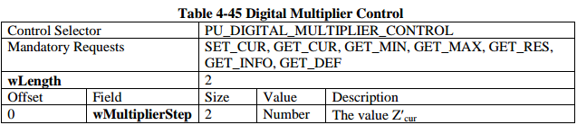

#### 2.4.17 数字乘法器极限控制（Digital Multiplier Limit Control）

这用于指定应用于光学图像的数字变焦量的上限。 这是乘数m可能值范围内的最大位置。 MIN和MAX值足以表示分辨率，因此RES值必须始终为1。MIN，MAX和默认值取决于实现方式。

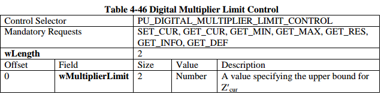

#### 2.4.18 模拟视频标准控制（Analog Video Standard Control）

这用于报告处理单元捕获的流的当前视频标准。


#### 2.4.19 模拟视频锁定状态控制（ Analog Video Lock Status Control）

这用于报告视频解码器是否已实现模拟输入信号的水平锁定。 如果解码器被锁定，则假定正在生成有效的视频流。 仅模拟视频解码器功能支持此控件。


### 2.5 UVC摄像头功能配置

```c
UVC摄像头控制选择器列表
#define UVC_CT_CONTROL_UNDEFINED               0x00
#define UVC_CT_SCANNING_MODE_CONTROL   0x01
#define UVC_CT_AE_MODE_CONTROL                    0x02
#define UVC_CT_AE_PRIORITY_CONTROL             0x03
#define UVC_CT_EXPOSURE_TIME_ABSOLUTE_CONTROL  0x04
#define UVC_CT_EXPOSURE_TIME_RELATIVE_CONTROL     0x05
#define UVC_CT_FOCUS_ABSOLUTE_CONTROL  0x06
#define UVC_CT_FOCUS_RELATIVE_CONTROL     0x07
#define UVC_CT_FOCUS_AUTO_CONTROL             0x08
#define UVC_CT_IRIS_ABSOLUTE_CONTROL         0x09
#define UVC_CT_IRIS_RELATIVE_CONTROL            0x0a
#define UVC_CT_ZOOM_ABSOLUTE_CONTROL     0x0b
#define UVC_CT_ZOOM_RELATIVE_CONTROL        0x0c
#define UVC_CT_PANTILT_ABSOLUTE_CONTROL 0x0d
#define UVC_CT_PANTILT_RELATIVE_CONTROL    0x0e
#define UVC_CT_ROLL_ABSOLUTE_CONTROL       0x0f
#define UVC_CT_ROLL_RELATIVE_CONTROL          0x10
#define UVC_CT_PRIVACY_CONTROL                          0x11
#define UVC_CT_FOCUS_SIMPLE_CONTROL           0x12
#define UVC_CT_WINDOW_CONTROL                         0x13
#define UVC_CT_REGION_OF_INTEREST_CONTROL 0x14

UVC摄像头支持功能列表
#define UVC_FEATURE_SCANNING_MODE                          (1 << 0)
#define UVC_FEATURE_AUTO_EXPOSURE_MODE            (1 << 1)
#define UVC_FEATURE_AUTO_EXPOSURE_PRIORITY      (1 << 2)
#define UVC_FEATURE_EXPOSURE_TIME_ABSOLUT     （1<< 3）
#define UVC_FEATURE_EXPOSURE_TIME_RELATIVE        (1 << 4)
#define UVC_FEATURE_FOCUS_ABSOLUTE                          (1 << 5)
#define UVC_FEATURE_FOCUS_RELATIVE                             (1 << 6)
#define UVC_FEATURE_IRIS_ABSOLUTE                                (1 << 7)
#define UVC_FEATURE_IRIS_RELATIVE                                   (1 << 8)
#define UVC_FEATURE_ZOOM_ABSOLUTE                            (1 << 9)
#define UVC_FEATURE_ZOOM_RELATIVE                              (1 << 10)
#define UVC_FEATURE_PAN_TILT_ABSOLUTE                     (1 << 11)
#define UVC_FEATURE_PAN_TILT_RELATIVE                        (1 << 12)
#define UVC_FEATURE_ROLL_ABSOLUTE                              (1 << 13)
#define UVC_FEATURE_ROLL_RELATIVE                                 (1 << 14)
#define UVC_FEATURE_FOUCES_AUTO                                   (1 << 17)
#define UVC_FEATURE_PRIVACY                                                 (1 << 18)
#define UVC_FEATURE_FOCUS_SIMPLE                                  (1 << 19)
#define UVC_FEATURE_WINDOW                                                (1 << 20)
#define UVC_FEATURE_REGION_OF_INTEREST                   (1 << 21)

UVC摄像头功能数据长度列表
#define UVC_SCANNING_MODE_DATA_LEN                        1
#define UVC_AUTO_EXPOSURE_MODE_DATA_LE             1
#define UVC_AUTO_EXPOSURE_PRIORITY_DATA_LEN   1
#define UVC_EXPOSURE_TIME_ABSOLUTE_DATA_LEN  4
#define UVC_EXPOSURE_TIME_RELATIVE_DATA_LEN     1
#define UVC_FOCUS_ABSOLUTE_DATA_LEN                       2
#define UVC_FOCUS_RELATIVE_DATA_LEN                          2
#define UVC_IRIS_ABSOLUTE_DATA_LEN                             2
#define UVC_IRIS_RELATIVE_DATA_LEN                                1
#define UVC_ZOOM_ABSOLUTE_DATA_LEN                         2
#define UVC_ZOOM_RELATIVE_DATA_LEN                            3
#define UVC_PAN_TILT_ABSOLUTE_DATA_LEN                  8
#define UVC_PAN_TILT_RELATIVE_DATA_LEN                     4
#define UVC_ROLL_ABSOLUTE_DATA_LEN                           2
#define UVC_ROLL_RELATIVE_DATA_LEN                              2
#define UVC_FOUCES_AUTO_DATA_LEN                                1
#define UVC_PRIVACY_DATA_LEN                                              1
#define UVC_FOCUS_SIMPLE_DATA_LEN                               1
#define UVC_WINDOW_DATA_LEN                                            12
#define UVC_REGION_OF_INTEREST_DATA_LE                  10
```

## 2.6  UVC摄像头参数配置

```c
UVC摄像头参数控制选择器
#define UVC_PU_CONTROL_UNDEFINED                  0x00
#define UVC_PU_BACKLIGHT_COMPENSATION_CONTROL 0x01
#define UVC_PU_BRIGHTNESS_CONTROL                0x02
#define UVC_PU_CONTRAST_CONTROL                    0x03
#define UVC_PU_GAIN_CONTROL                                 0x04
#define UVC_PU_POWER_LINE_FREQUENCY_CONTROL      0x05
#define UVC_PU_HUE_CONTROL                                   0x06
#define UVC_PU_SATURATION_CONTROL                  0x07
#define UVC_PU_SHARPNESS_CONTROL                   0x08
#define UVC_PU_GAMMA_CONTROL                             0x09
#define UVC_PU_WHITE_BALANCE_TEMPERATURE_CONTROL 0x0a
#define UVC_PU_WHITE_BALANCE_TEMPERATURE_AUTO_CONTROL 0x0b
#define UVC_PU_WHITE_BALANCE_COMPONENT_CONTROL 0x0c
#define UVC_PU_WHITE_BALANCE_COMPONENT_AUTO_CONTROL      0x0d
#define UVC_PU_DIGITAL_MULTIPLIER_CONTROL  0x0e
#define UVC_PU_DIGITAL_MULTIPLIER_LIMIT_CONTROL      0x0f
#define UVC_PU_HUE_AUTO_CONTROL                      0x10
#define UVC_PU_ANALOG_VIDEO_STANDARD_CONTROL      0x11
#define UVC_PU_ANALOG_LOCK_STATUS_CONTROL               0x12
#define UVC_PU_CONTRAST_AUTO_CONTROL                            0x13

UVC摄像头支持参数列表
#define UVC_PARAM_BRIGHTNESS                                (1 << 0)
#define UVC_PARAM_CONTRAST                                     (1 << 1)
#define UVC_PARAM_HUE                                                   (1 << 2)
#define UVC_PARAM_SATURATION                                 (1 << 3)
#define UVC_PARAM_SHARPNESS                                   (1 << 4)
#define UVC_PARAM_GAMMA                                             (1 << 5)
#define UVC_PARAM_WHITE_BALANCE_TEMPERATURE    (1 << 6)
#define UVC_PARAM_WHITE_BALANCE_COMPONENT        (1 << 7)
#define UVC_PARAM_WHITE_BACKLIGHT_COMPENSATION (1 << 8)
#define UVC_PARAM_GAIN                                                   (1 << 9)
#define UVC_PARAM_POWER_LINE_FREQUEBCY      (1 << 10)
#define UVC_PARAM_HUE_AUTO                                      (1 << 11)
#define UVC_PARAM_WHITE_BALANCE_TEMPERATURE_AUTO        (1 << 12)
#define UVC_PARAM_WHITE_BALANCE_COMPONENT_AUTO           (1 << 13)
#define UVC_PARAM_DIGITAL_MULTIPLIER                  (1 << 14)
#define UVC_PARAM_DIGITAL_MULTIPLIER_LIMIT    (1 << 15)
#define UVC_PARAM_ANALOG_VIDEO_STANDARD    (1 << 16)
#define UVC_PARAM_ANALOG_VIDEO_LOCK_STATUS        (1 << 17)
#define UVC_PARAM_CONTRAST_AUTO                         (1 << 18)

UVC摄像头参数数据长度列表
#define UVC_BRIGHTNESS_DATA_LEN                                               2
#define UVC_CONTRAST_DATA_LEN                                                    2
#define UVC_HUE_DATA_LEN                                                                  2
#define UVC_SATURATION_DATA_LEN                                                2
#define UVC_SHARPNESS_DATA_LEN                                                 2
#define UVC_GAMMA_DATA_LEN                                                           2
#define UVC_WHITE_BALANCE_TEMPERATURE_DATA_LEN      2
#define UVC_WHITE_BALANCE_COMPONENT_DATA_LEN         4
#define UVC_WHITE_BACKLIGHT_COMPENSATION_DATA_LEN          2
#define UVC_GAIN_DATA_LEN                                                                 2
#define UVC_POWER_LINE_FREQUEBCY_DATA_LEN                    1
#define UVC_HUE_AUTO_DATA_LEN                                                    1
#define UVC_WHITE_BALANCE_TEMPERATURE_AUTO_DATA_LEN     1
#define UVC_WHITE_BALANCE_COMPONENT_AUTO_DATA_LEN        1
#define UVC_DIGITAL_MULTIPLIER_DATA_LEN                                2
#define UVC_DIGITAL_MULTIPLIER_LIMIT_DATA_LEN                  2
#define UVC_ANALOG_VIDEO_STANDARD_DATA_LEN                  1
#define UVC_ANALOG_VIDEO_LOCK_STATUS_DATA_LEN           1
#define UVC_CONTRAST_AUTO_DATA_LEN                                       1
```
