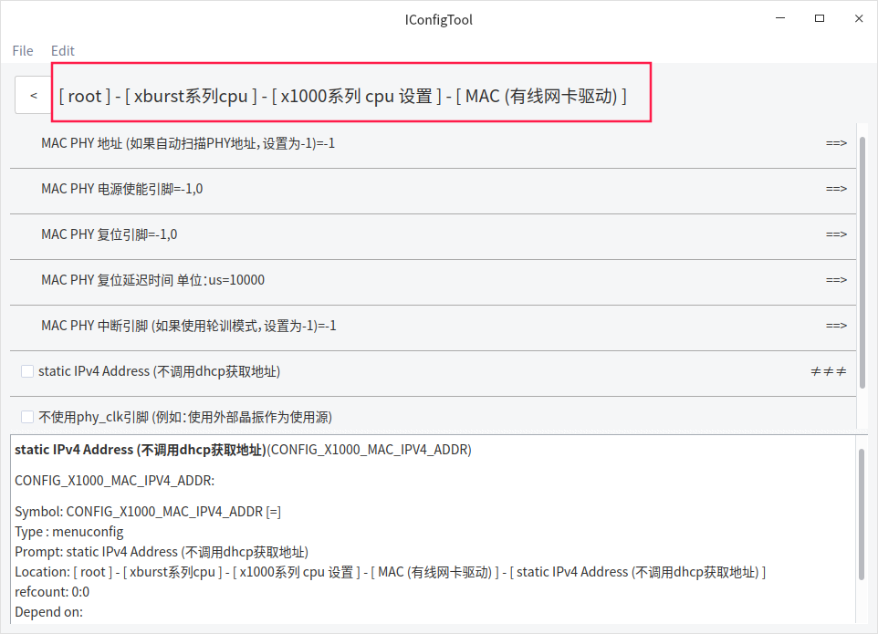
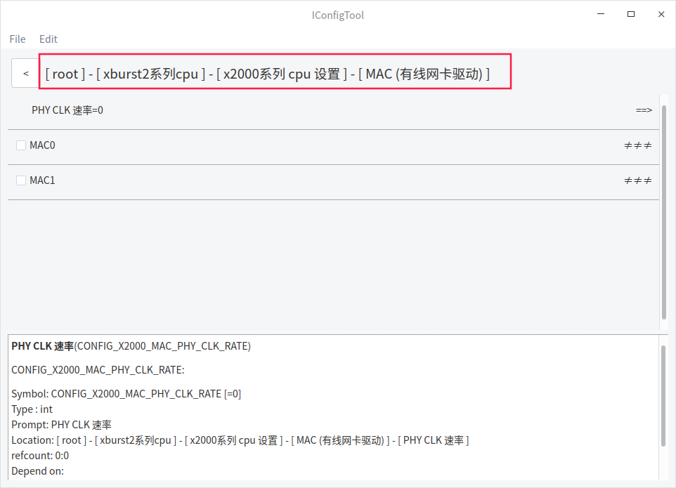
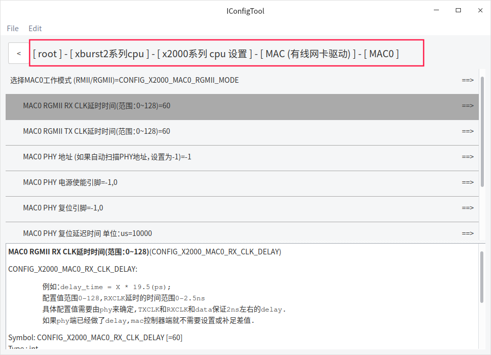
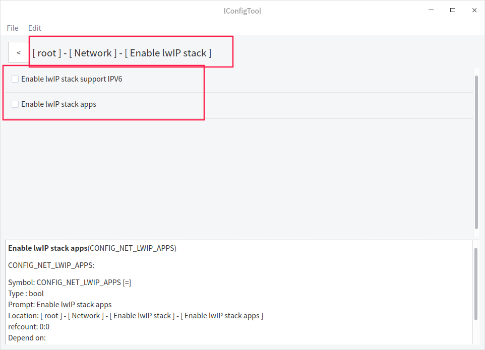

# 以太网配置说明

## x1000以太网配置

mac phy 地址用来指定mac phy地址，减少mac phy的扫描时间。

static ipv4 address 使用静态地址，不调用udcp获取地址。

如果mac phy使用晶振作为时钟源，可以选不使用phy_clk引脚

## x2000以太网配置

x2000有两个以太网接口，但是共用一个phy_clk时钟源。

注意：rgmii⾛线要求，rx0-rx3 需要等⻓，tx0-tx3需要等⻓ ！！！
rx_clk 与 rx_data 等⻓的情况下,并且phy没有配置rx_delay, x2000的rx_delay 配置为默认值60
tx_clk 与 tx_data 等⻓的情况下,并且phy没有配置tx_delay, x2000的tx_delay 配置为默认值60

## lwip协议栈配置

网络协议栈配置：

​	lwip网络协议栈只做了简单的配置，区分 ipv6和apps

apps包括

altcp_tls  http  lwiperf  mdns  mqtt  netbiosns  smtp  snmp  sntp  tftp

如果需要精细裁剪，用户自行修改makefile文件 net/lwip/Makefile

lwip网络协议栈配置 文件 net/lwip/include/lwipopts.h   根据用户需求自行修改。

## 网络相关的基础测试命令

mac_info

​	查看网卡信息：链接状态，ip地址，网关，子网掩码。

cmd_ping

​	测试网卡链接：

​        Please input: ping <host_address> [count] [interval:ms] [packetsize] [timeout:ms]

​				host_address:目标地址 （必须参数）

​				count: ping的次数	（可选参数）

​				interval： ping的间隔	（可选参数）

​				packetsize： ping包附带数据的大小	（可选参数）

​				timeout： ping包超时时间	（可选参数）

iperf_server  （ 注意：需要lwip协议栈配置apps）

​	启动iperf 的tcp服务器，用于测试网络带宽和丢包情况。

​		使用方法：1.mac_info 查看本地网卡的地址  比如：192.168.1.100

​							2.使用pc电脑，iperf -c 192.168.1.100  测试pc发送，板子接收数据的带宽

​														iperf -c 192.168.1.100 -R     测试板子发送，pc接受数据的带宽

mac_phy

​	读取或写入mac phy的寄存器

​		Please input: mac_phy <register_offset> [value]

​				register_offset：mac phy 寄存器偏移	（必须参数）

​				value：写入的数据 	（可选参数，如果没有则为读取）

