# 	X1600系列RTOS系统安全启动


## 一 安全启动应用场景

Security主要为了保护客户厂商的软件程序不被其对手复制，包括整体抄板和抄袭某个应用程序。与此同时，还要保证客户厂商可以软件升级或重新烧录软件程序。

防止代码复制是通过对代码进行加密的方式实现，可以使用AES、2Key-3DES加密。密码可以是用户提供的User-Key0、User-Key1或芯片内部的Chip-Key（随机数密码）。

防止加密的代码被解密，我们将密码存放在芯片的OTP中，只有芯片中的SC-ROM代码可以访问。可以通过调用SC-ROM接口使用密码进行加解密，而软件不直接访问密码本身，防止密码泄露。

硬件环境：halley6：x1600e + nand。根据硬件设计，应将efuse的供电引脚接出来，连接到任意一根可控的gpio，本例将efuse的供电引脚接到pc26，拉高使能给efuse供电。

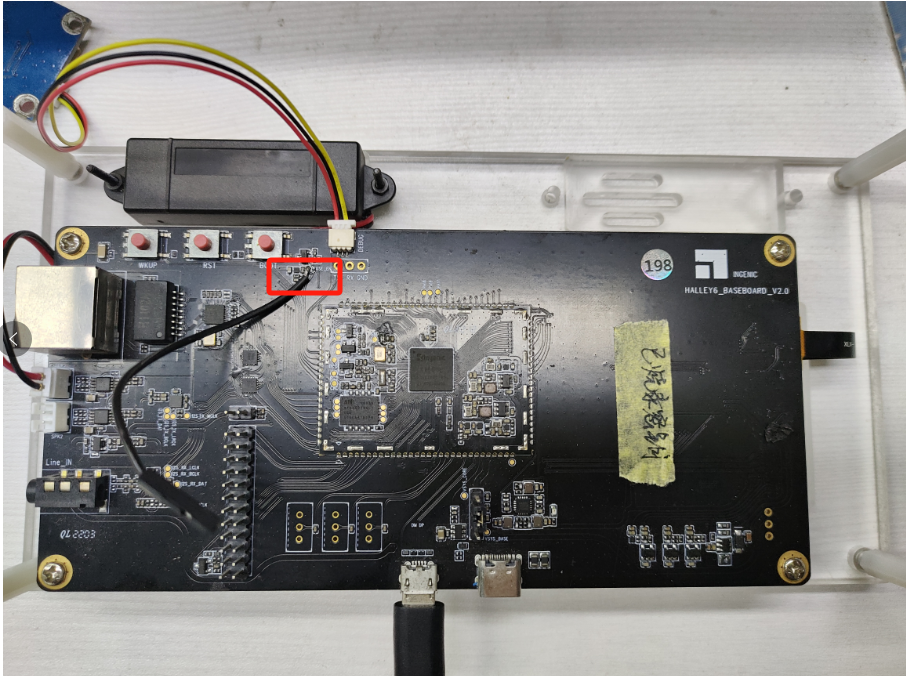

## 二 工具介绍

在使用Security Boot功能时，需要用到以下的工具：

秘钥工具：目前在烧录工具的securitytool\x2000\keytool\目录下，用于生成RSA-Key、User-Key0和User-Key1，提供给签名工具、烧录工具和SC-ROM使用。

签名工具：目前在烧录工具的securitytool\x2000\sigtool\目录下，使用生成的RSA私钥、User-Key0、User-Key1对数据进行加密和签名，并将加密信息填充到文件起始的2048字节中。

烧录工具：烧录RSA公钥的HASH值、User-Key0、User-Key1和加密后的软件程序。

## 三 软件实现

### 3.1 修改spl代码

注意：freertos的spl代码源码在linux代码库中，所以修改freertos的spl源码的话，必须下载一份
linux代码库。具体下载地址需要联系市场经理来获取。

通常spl代码已经编好镜像存储在freertos代码中，加载位置如下（不修改spl镜像就不用下载linux
代码）：

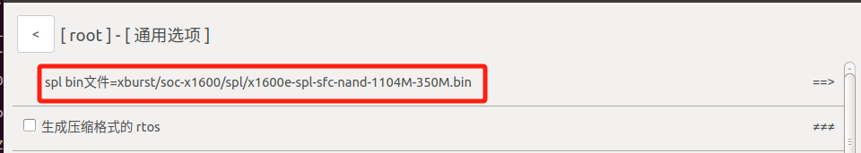

在安全启动功能中，需要修改spl的代码。在新下载的linux代码库uboot-x2000中，找到 board.cfg 文件，查看 x1600e nand rtos 的配置项：x1600e_base_rtos_sfc_nand，在后面添加配置 JZ_SCBOOT：

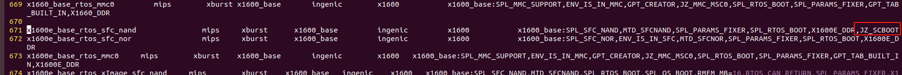

在 uboot-x2000 目录下编译，执行 make x1600e_base_rtos_sfc_nand：


编译好后会在 uboot-x2000/spl 目录下生成 uboot-spl-pad.bin 文件：

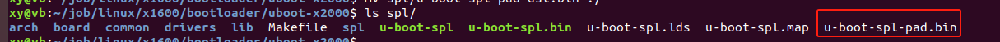

该文件会在签名工具中用到。

### 3.2 编译zero.bin

在 freertos 工程中编译 x1600e nand 的 rtos 镜像：

```c
xy@vb:~/job/freertos/freertos$ make x1600e_nand_defconfig
xy@vb:~/job/freertos/freertos$ make
```

编译完成后会生成 zero.bin 文件：

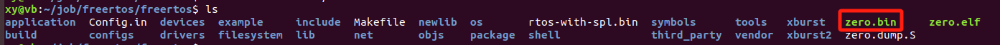

该文件会在签名工具中用到。

## 四 相关签名工具的使用

### 4.1 key 生成工具

key生成工具在烧录工具的如下目录：

```c
cloner-2.5.49-ubuntu_alpha/securitytool/x2000/keytool/
├── keygen-32
├── keygen-64
└── qm_cn.qm
```

如果你运行烧录工具的系统是32位就用keygen-32, 如果是64位就用keygen-64（以sudo权限运
行）。

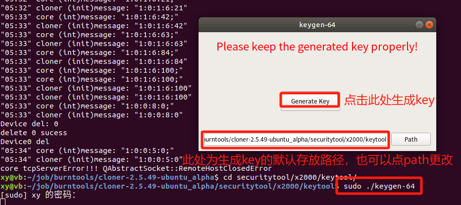

点击 Generate Key 按钮生成签名需要的文件：

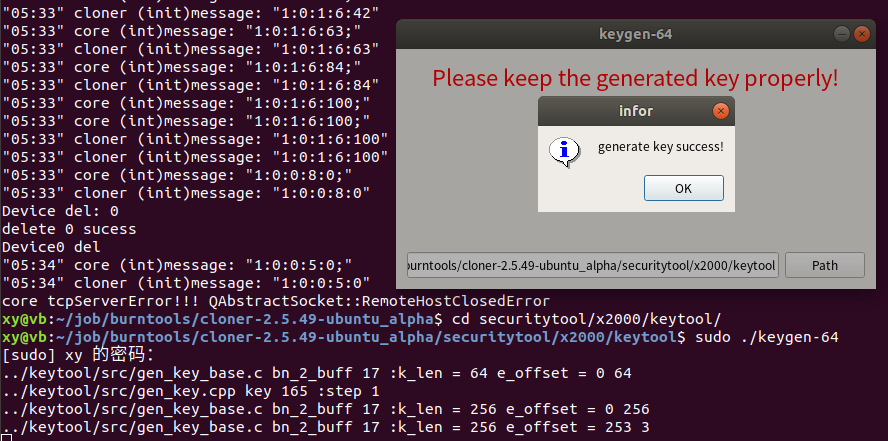

将会在上图设置的默认key存放路径看到如下key：

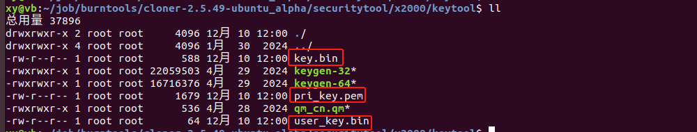

**注意：**

1，下面生成的三个签名文件一定要保存好。同一个板子一旦被签名了，再次烧录时，必须使用同一个签名文件来签名被烧录的固件，不然会烧录失败。

2，后续升级烧录工具版本的话，不需要重新生成key，可以用原有的key即可。但是需要用原有的key重新签名和加密新版本的烧录工具固件，同时把key.bin拷贝到新的烧录工具版本的对应目录即可。

```
key.bin
pri_key.pem
user_key.bin
```

拷贝生成的key到烧录工具的对应目录：

```
xy@vb:~/job/burntools/cloner-2.5.49-ubuntu_alpha/securitytool/x2000/keytool$ cp key.bin ../../../security/x2000/key.bin
```

```
xy@vb:~/job/burntools/cloner-2.5.49-ubuntu_alpha/securitytool/x2000/keytool$ cp pri_key.pem ../sigtool/security_key/pri_key.pem
```

```
xy@vb:~/job/burntools/cloner-2.5.49-ubuntu_alpha/securitytool/x2000/keytool$ cp user_key.bin ../sigtool/security_key/user_key.bin
```

### 4.2 签名工具

签名工具用于签名、加密系统镜像文件，以便保护用户产品板安全。

打开签名工具之前，需要先在securitytool/x2000/sigtool/下**创建⽂件**settings.ini , 写⼊内容:

```
xy@vb:~/job/burntools/cloner-2.5.49-ubuntu_alpha/securitytool/x2000/sigtool$ cat settings.ini 
[debug]
value=1
```

#### 4.2.1 签名burner bin

需要签名当前烧录工具的固件，x1660的固件在firmwares/x1600/

```
xy@vb:~/job/burntools/cloner-2.5.49-ubuntu_alpha$ ll firmwares/x1600/
总用量 404
drwxrwxr-x  2 xy xy   4096 1月  30  2024 ./
drwxrwxr-x 30 xy xy   4096 1月  30  2024 ../
-rwxrwxr-x  1 xy xy    946 1月  30  2024 config.cfg*
-rwxrwxr-x  1 xy xy   8480 8月  15 10:08 spl.bin*    // 第一阶段固件
-rwxrwxr-x  1 xy xy 385604 8月  15 10:08 uboot.bin*  // 第二阶段固件
```

加密工具路径：

```
xy@vb:~/job/burntools/cloner-2.5.49-ubuntu_alpha/securitytool/x2000/sigtool$ ll
总用量 46352
drwxrwxr-x 3 xy   xy       4096 8月  23 16:36 ./
drwxrwxr-x 4 xy   xy       4096 1月  30  2024 ../
-rw-r--r-- 1 root root        0 8月  23 17:59 rsa.txt
drwxrwxr-x 2 xy   xy       4096 1月  30  2024 security_key/
-rwxr--r-- 1 xy   xy         16 7月  11 10:27 settings.ini*
-rwxrwxr-x 1 xy   xy   22086502 1月  30  2024 sigtool-32*
-rwxrwxr-x 1 xy   xy   16734943 1月  30  2024 sigtool-64*
-rwxrwxr-x 1 xy   xy    8620544 1月  30  2024 sigtool.exe*
```

此处仍然是，当前系统是32bit ubuntu的话就用sigtool-32,当前系统是64bit ubuntu的话就用sigtool-64。当前系统是windows的话就用sigtool.exe. 当前我的系统为64bit ubuntu，所以以此为例运行签名工具（以sudo权限运行）：

```
xy@vb:~/job/burntools/cloner-2.5.49-ubuntu_alpha/securitytool/x2000/sigtool$ sudo ./sigtool-64
```

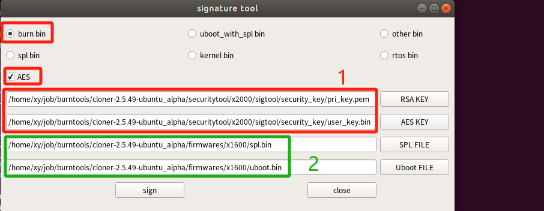

1：选择此前生成的key。

2：此处一定要选择烧录工具firmware/x1600/的固件。

点击下面的`sign`按钮，可以在当前烧录工具的firmware/x1600/下生成签名后的固件：

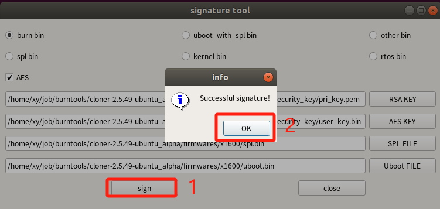

生成加密后的固件：

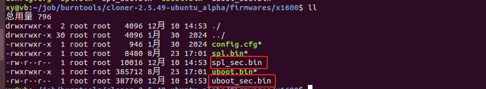

#### 4.2.2 签名spl镜像

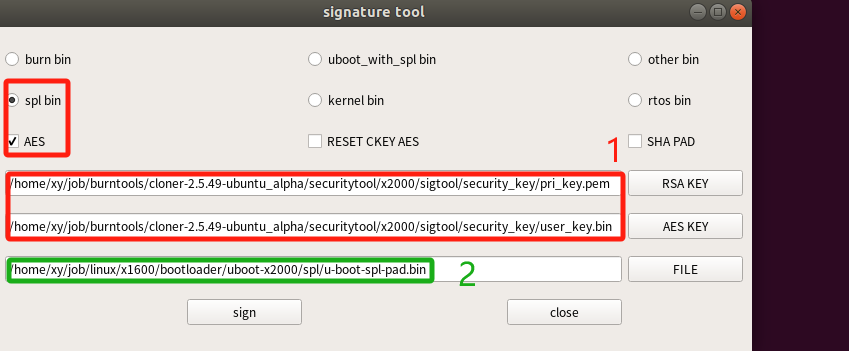

1：选之前生成的key

2：选上文编译出的spl镜像

点击 `sign` 按钮进行签名，签名成功会提示： `Successful signature!` 表示签名成功，成功以后会在同级目录下生成 u-boot-spl-pad-dst.bin 文件，路径为：

```
xy@vb:~/job/linux/x1600/bootloader/uboot-x2000$ ll spl/u-boot-spl-pad-dst.bin 
-rw-r--r-- 1 root root 26624 9月  26 14:05 spl/u-boot-spl-pad-dst.bin
```

#### 4.2.3 签名rtos镜像

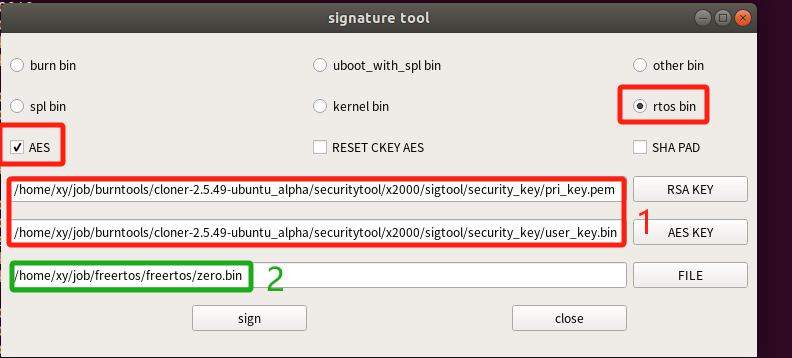

1：选之前生成的key

2：选上文编译出的rtos系统的zero.bin镜像

点击 `sign` 按钮进行签名，签名成功会提示： `Successful signature!` 表示签名成功，成功以后会在同级目录下生成 zero-dst.bin 文件，路径为：

```
xy@vb:~/job/freertos/freertos$ ll zero-dst.bin 
-rwxr--r-- 1 xy xy 310100 9月  26 14:16 zero-dst.bin
```

## 五 烧录工具的配置

启动烧录工具进行如下配置：

```
xy@vb:~/job/burntools/cloner-2.5.49-ubuntu_alpha$ sudo ./cloner 
```

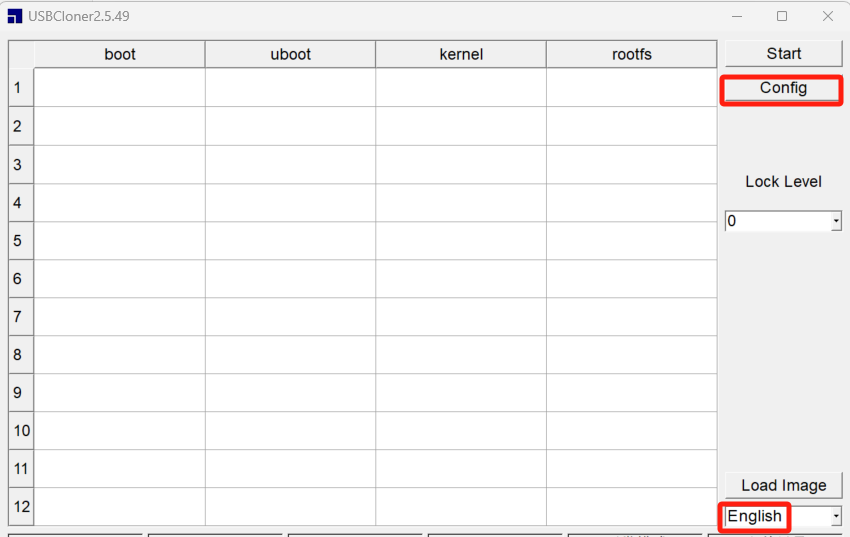

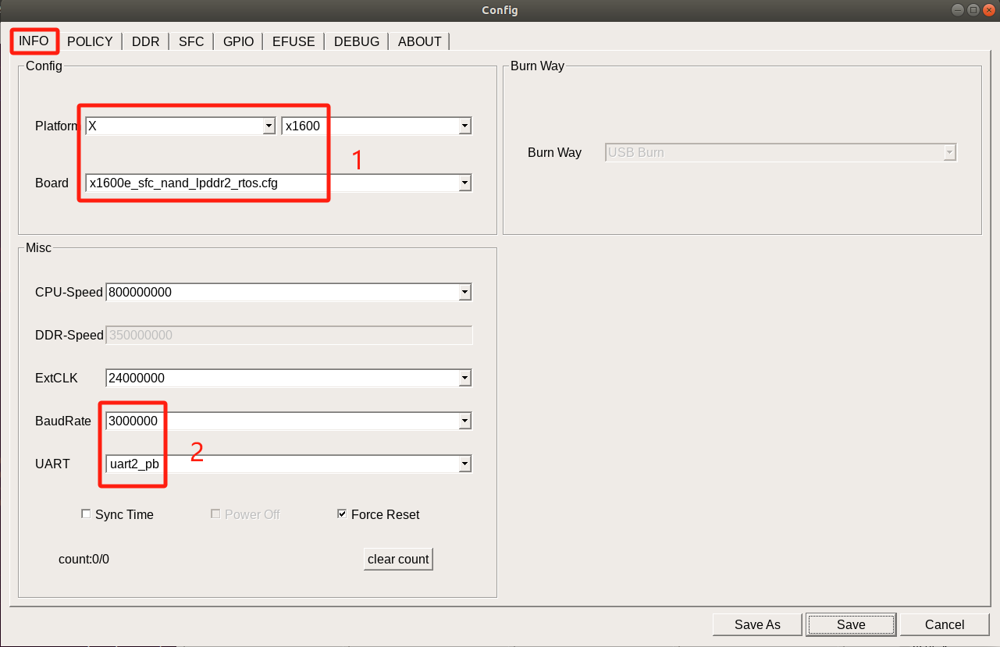

1：根据实际硬件板的主控芯片和存储介质配置来选择。

2：根据实际硬件板的串口uart来设置。

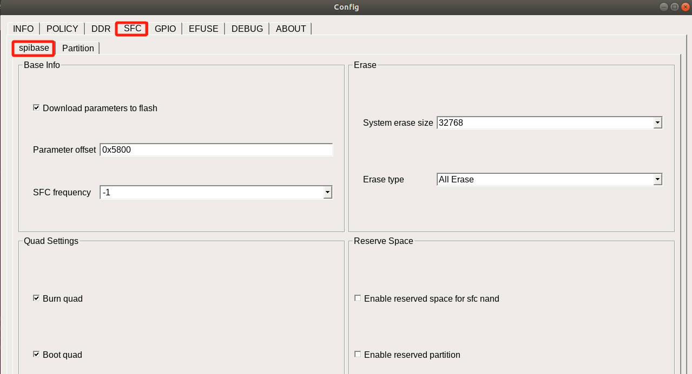

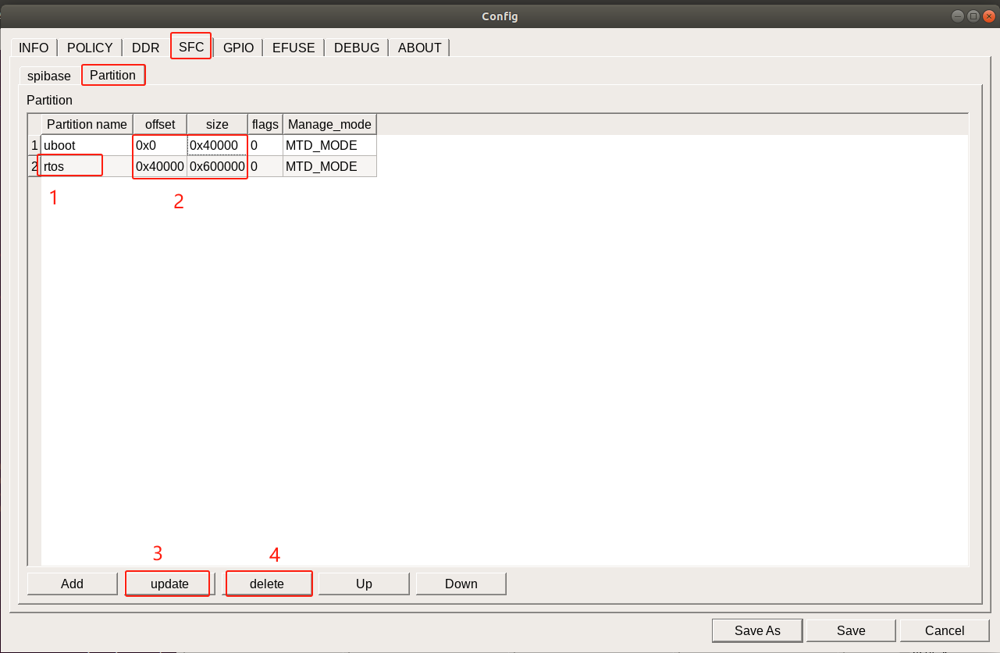

1：此处rtos的系统分区名称必须为“rtos”，否则在启动阶段会找不到rtos的代码分区。

2：此处两个分区的偏移地址和大小必须与`POLICY`中的分区偏移大小保持一致。

3：点击此按钮可以对指定的分区进行编辑。

4：点击此按钮可以删除指定的分区。

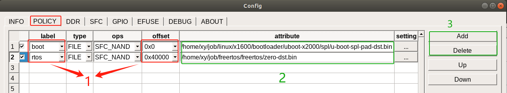

1：此处分区label和offset必须与SFC--》Partition中保持一致。

2：选择上文加密后的spl和rtos镜像文件。

3：点击`Add`或`Delete`按钮可以增加或删除分区。

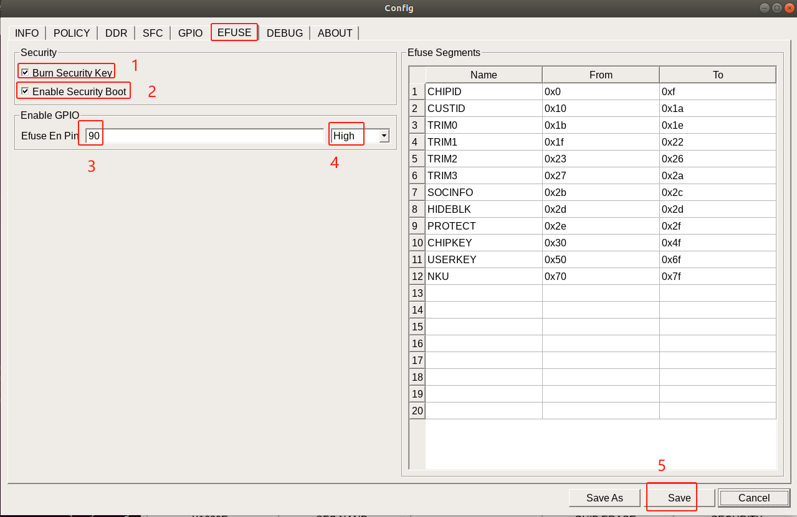

1：勾选后将往主控芯片的efuse中烧写key。

2：勾选后将在烧录阶段启动efuse的key校验功能，只有校验通过之后才能继续烧录。

3：此处是根据硬件设计，配置efuse的供电gpio，当前是选中`PC26` （2 X 32 + 26 = 90）。

4：设置指定efuse的供电引脚PC26拉高使能供电。此处一定要确认好efuse的供电gpio和供电电平，x1600的efuse不能长期供电，一旦供电超过200ms将有烧坏efuse的风险。

5：全部设置完成之后，点击此按钮来保存烧录配置。

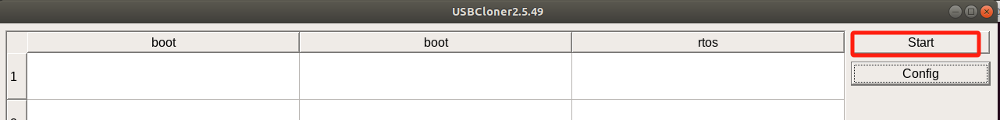

点击`Start`按钮使烧录工具进入可烧录模式。检测到开发板进入硬件烧录模式后，自动进行烧录。

