# Ethernet

## 一 硬件介绍

Darwin_X2000_V2.0开发板 + X2000H芯片 + SPI nand Flash


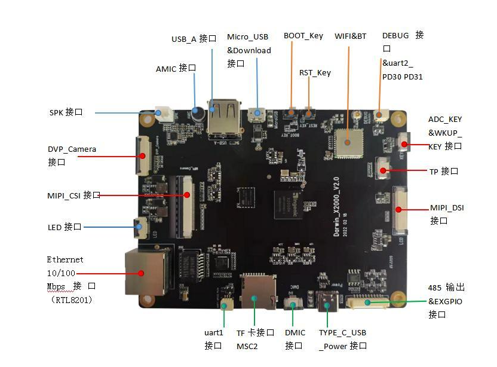

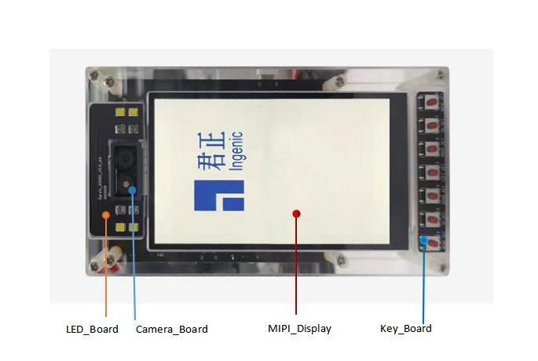

## 二 以太网硬件介绍

​       以太网控制器也称以太网适配器，就是我们通常称的“网卡”，X2000 以太网接口,支持两个以太网接口，每个以太网接口都支持千兆rgmii或者百兆rmii，但是不建议两个以太网接口都同时使用千兆rgmii。

​      X2000平台内置10/100/1000Mbps以太网控制器（RMII接口），开发套件外加物理层处理芯片RTL8201，然后通过网络变压器连接到RJ45形式接口。RTL8201的时钟信号可由由外部25MHz晶体提供，也可由X2000控制器内部输出时钟提供。若设计采用一款百兆以太网PHY芯片时，X2000_MAC_RX_CLK作为控制器和PHY芯片数据通信的参考时钟(input)。在使用RMII接口进行通信时，X2000的MAC_PHY_CLK可以配置出50MHz时钟作为控制器和PHY芯片间数据传输的参考时钟;MAC_RX_CLK可以由X2000的MAC_PHY_CLK引脚提供的50MHz时钟作为PHY芯片的工作时钟,也可以由PHY芯片输出CLK时钟给到X2000_MAC_RX_CLK。开发套件默认由X2000_MAC_PHY_CLK提供给RTL8201时钟,25M时钟贴片NC;RTL8201的15#输出参考 时钟给X2000_MAC_RX_CLK(REF_CLK)。


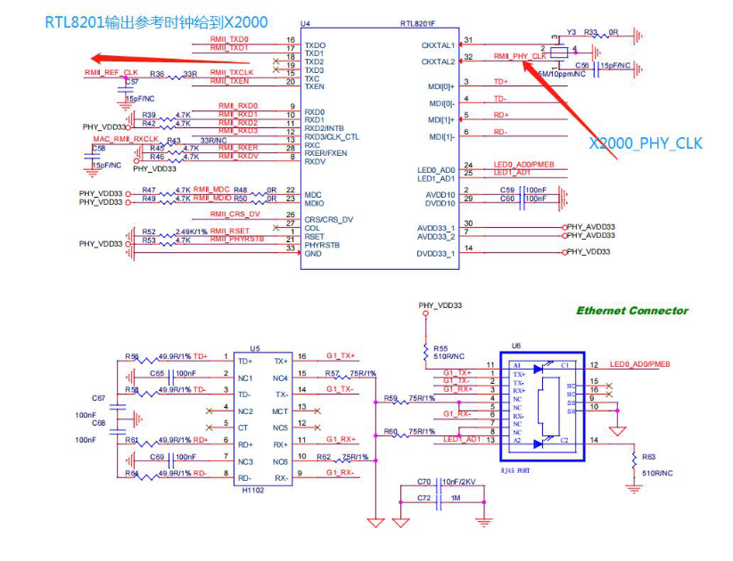


## 三  软件配置

### 3.1 有线网卡驱动配置

打开iconfigtool配置页面

*以Darwin_X2000_V2.0开发板为例 , 使用x2000_darwin_v20_nand_defconfig 配置 , 实际根据硬件需要配置*


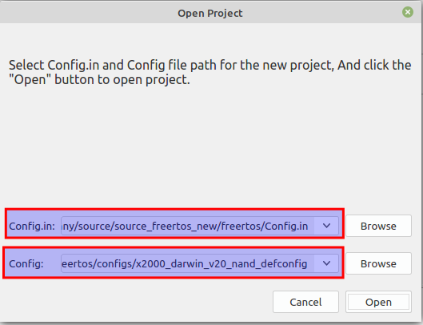


MAC驱动配置

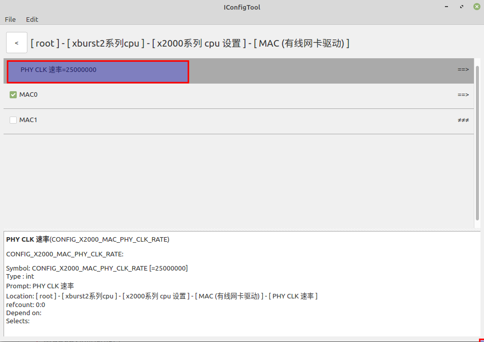


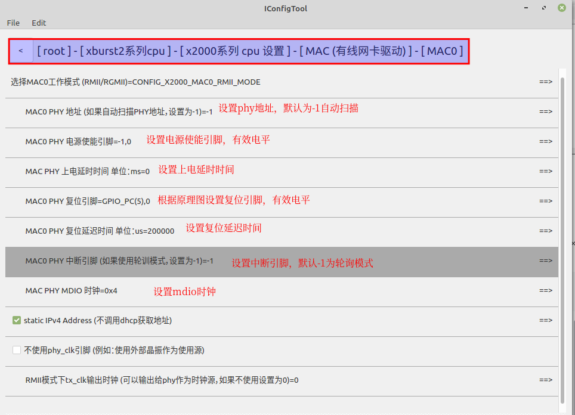


> **mdio时钟影响phy的初始化时间, 如果初始化不过, 可以尝试修改**

IPv4配置

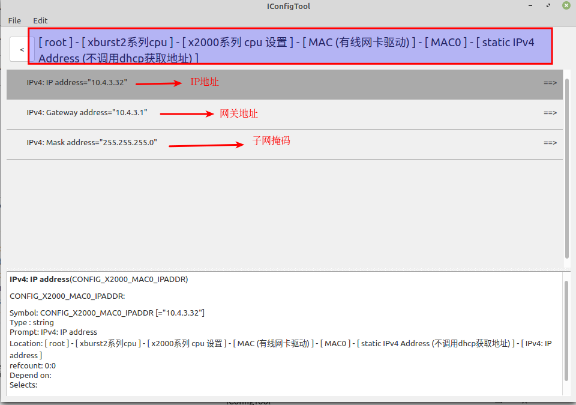


### 3.2 lwip协议栈配置

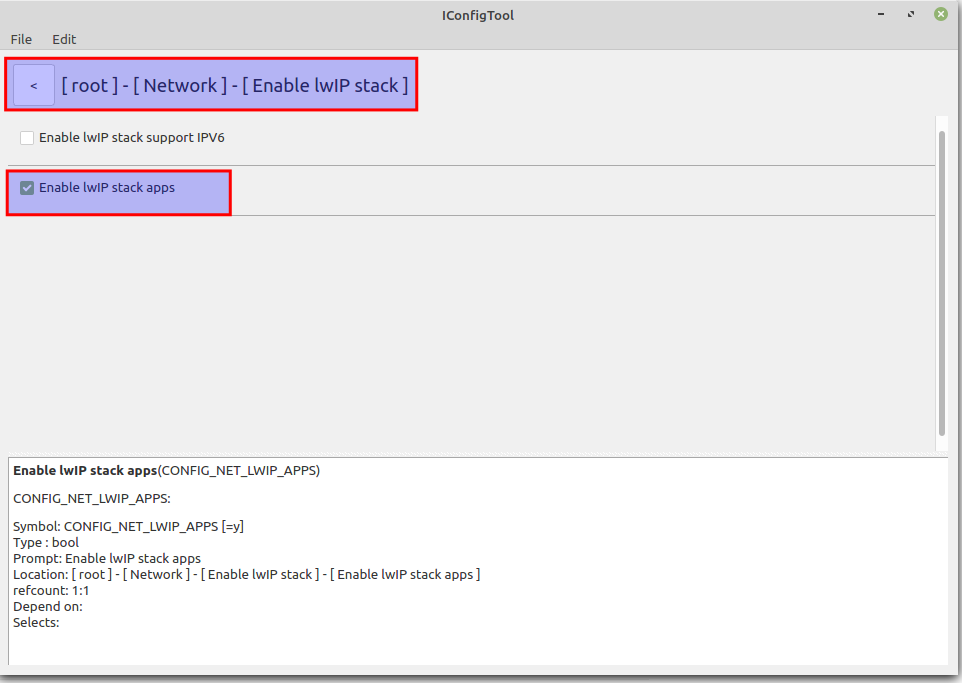

⽹络协议栈配置：

lwip⽹络协议栈只做了简单的配置, 区分 ipv6和apps

apps包括

altcp_tls http lwiperf mdns mqtt netbiosns smtp snmp sntp tftp

## 四 编译和烧录

```c
 kenny@kenny-computer:~/source/source_freertos_new$ cd freertos                      
 kenny@kenny-computer:~/source/source_freertos_new/freertos$ source build/envsetup.sh        //第一次编译需要初始化编译环境
 kenny@kenny-computer:~/source/source_freertos_new/freertos$ make x2000_darwin_v20_nand_defconfig
 kenny@kenny-computer:~/source/source_freertos_new/freertos$ make 
```

```c
kenny@kenny-computer:~/source/source_freertos_new/freertos$ ls rtos-with-spl.bin 
rtos-with-spl.bin                                           //编译出来的文件
```

**请使用最新版烧录工具**

```c
wget ftp://ftp.ingenic.com.cn/DevSupport/Tools/USBBurner/cloner-latest-ubuntu.tar.gz 
wget ftp://ftp.ingenic.com.cn/DevSupport/Tools/USBBurner/cloner-latest-windows.zip
```

**烧录配置**

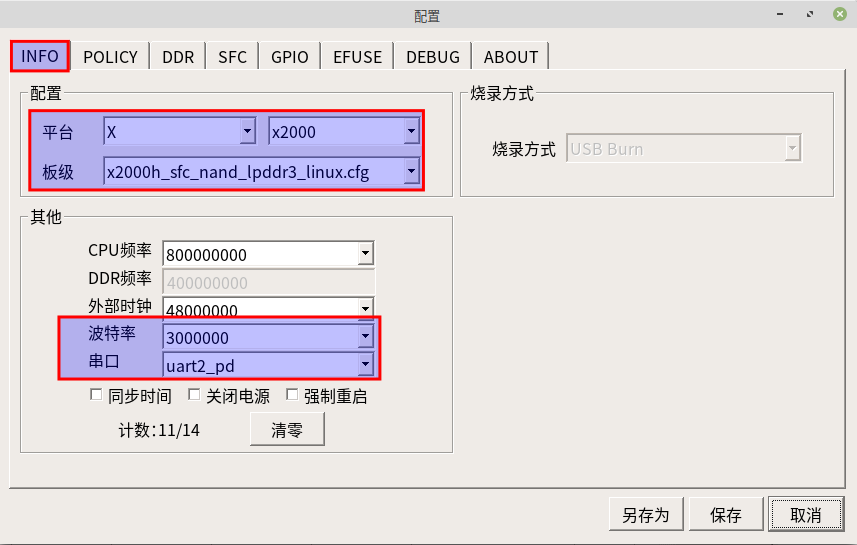


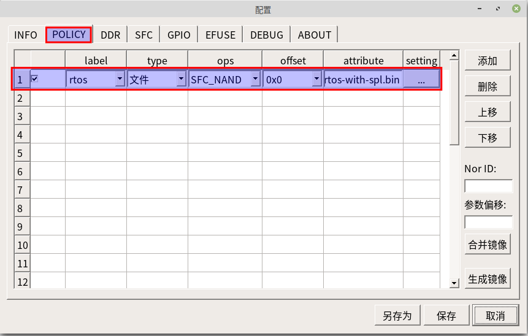


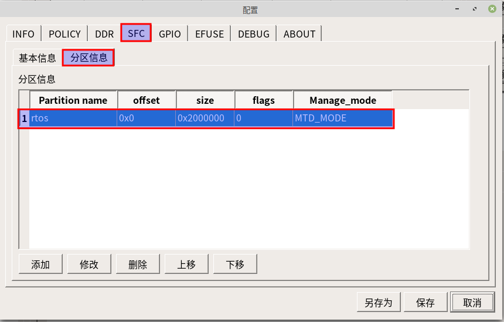


## 五 测试验证

网络验证

```c
$ mac_info                                                        //查看网卡信息            
[14760.452082] network interface device: et0 (Default)
[14760.452273]   MTU: 1500
[14760.452366]   MAC: 52 9d 3d 5e 49 c5 
[14760.452506]   FLAGS: UP LINK_UP ETHARP BROADCAST IGMP
[14760.452701]   ip address: 10.4.3.32
[14760.452833]   gw address: 10.4.3.1
[14760.452963]   net mask  : 255.255.255.0
  
$ ping 10.4.3.9                                                 //测试网卡链接                    
[14827.646159] 60 bytes from 10.4.3.9 icmp_seq=0 ttl=64 time=1 ms
[14828.646903] 60 bytes from 10.4.3.9 icmp_seq=1 ttl=64 time=0 ms
[14829.647617] 60 bytes from 10.4.3.9 icmp_seq=2 ttl=64 time=0 ms
[14830.648327] 60 bytes from 10.4.3.9 icmp_seq=3 ttl=64 time=1 ms

```

iperf测试

```c
$ iperf_server                                //启动iperf的tcp服务器
[6.136974] iperf tcp server start

kenny@kenny-computer:~/source/source_freertos_new/freertos$ iperf -c 10.4.3.32                       //客户端发送信息
------------------------------------------------------------
Client connecting to 10.4.3.32, TCP port 5001
TCP window size: 45.0 KByte (default)
------------------------------------------------------------
[  3] local 10.4.3.9 port 39238 connected with 10.4.3.32 port 5001
[ ID] Interval       Transfer     Bandwidth
[  3]  0.0-10.0 sec   110 MBytes  92.5 Mbits/sec


$ [121.684463] IPERF report: type=0, remote: 10.4.3.9:39238, total bytes: 115604504, duration in ms: 10010, kbits/s: 92384
//服务端接收信息
```

