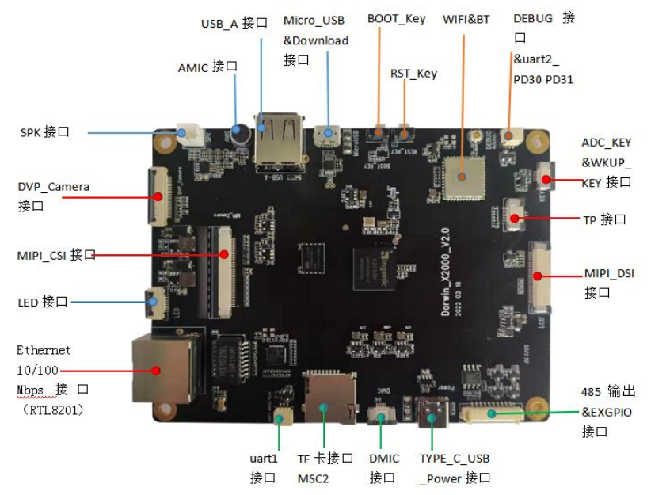
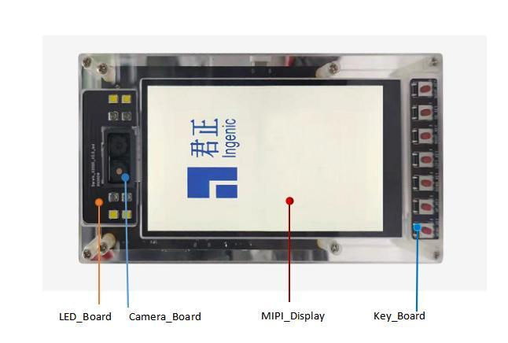
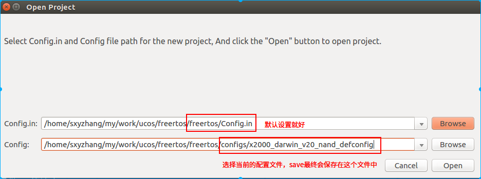
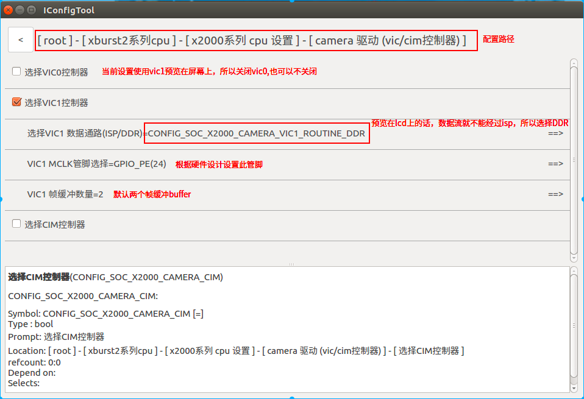
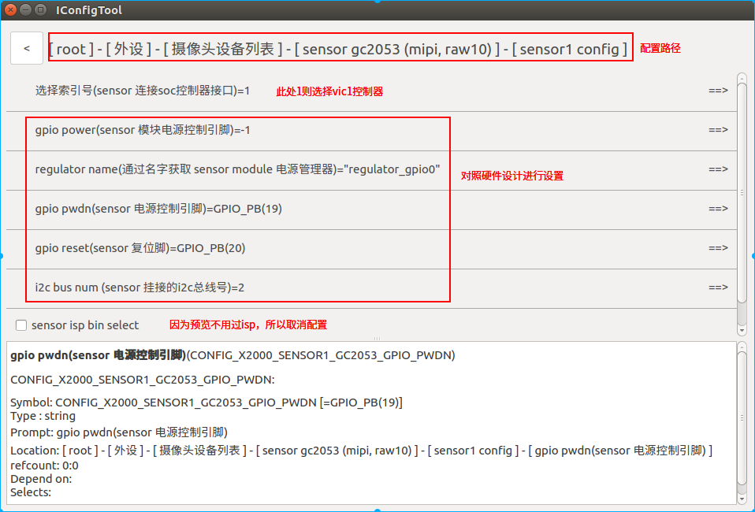
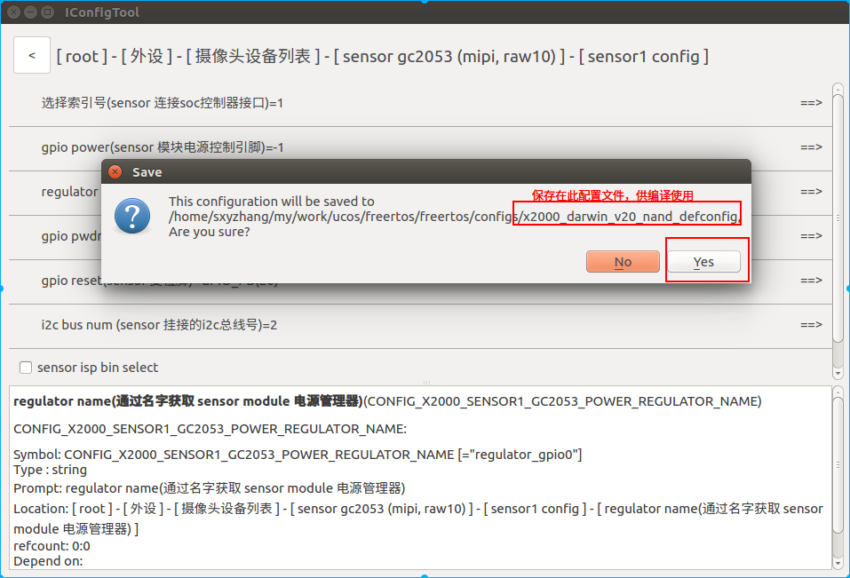

## 							Darwin_v2.0在rtos预览camera1的使用说明


### 一  硬件简介

硬件板:Darwin_X2000_V2.0  +  spi nand 开发板





### 二 软件配置









Ctrl + S  保存当前配置



### 三 软件修改

#### 3.1  添加编译测试demo文件

```
sxyzhang@T430:~/my/work/ucos/freertos/freertos$ vim vendor/Makefile
src-y += vendor.c  example/driver/camera_to_lcd_example.c   # 添加编译测试demo文件
```

#### 3.2  修改demo程序的vic号

```
xyzhang@T430:~/my/work/ucos/freertos/freertos$ git diff example/driver/camera_to_lcd_example.c
diff --git a/example/driver/camera_to_lcd_example.c b/example/driver/camera_to_lcd_example.c
index 7648cf7..3998d56 100644
--- a/example/driver/camera_to_lcd_example.c
+++ b/example/driver/camera_to_lcd_example.c
@@ -42,7 +42,7 @@ void test_camera_to_lcd(void)

     fb = lcd_init(&fb_info);

-    camera = camera_detect(0);
+    camera = camera_detect(1);     # 指定测试vic1
     if (!camera) {
         printf("camera not found\n");
         return;
```

#### 3.3  添加测试入口函数

```
sxyzhang@T430:~/my/work/ucos/freertos/freertos$ git diff vendor/vendor.c
diff --git a/vendor/vendor.c b/vendor/vendor.c
index 898113a..5834e91 100644
--- a/vendor/vendor.c
+++ b/vendor/vendor.c
@@ -1,6 +1,15 @@
 #include <stdio.h>

 void vendor_init(void)
 {
     printf("vendor init...\n");
+	test_camera_to_lcd();
 }
```

### 四  编译

```
sxyzhang@T430:~/my/work/ucos/freertos/freertos$ make x2000_darwin_v20_nand_defconfig
sxyzhang@T430:~/my/work/ucos/freertos/freertos$ make
```


