# 	x2000_darwin_rtos_camera_双摄

## **一 硬件环境**

Darwin_X2000_V2.0 :  X2000H + nand,uart2_pd31

默认双摄sensor：两个GC2053, mipi接口。

根据硬件设计可知，当前VDDIO33_CIM接1.8V， VDDIO33_SD接3.3v。在软件上也要对应设置，否则长时间使用会有烧坏主控芯片的风险。

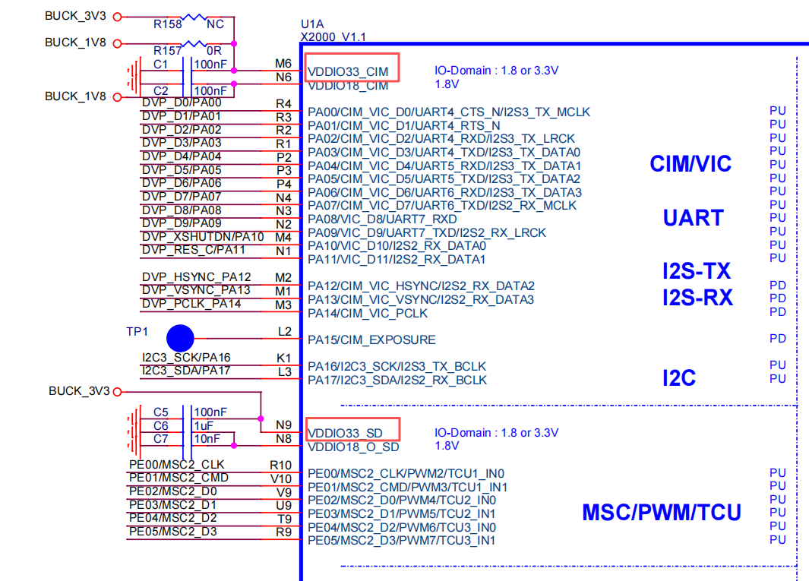

## **二 配置sensor相关**

本文档使用x2000的最小编译配置x2000_nand_defconfig，展示如何配置和使用摄像头。通过isp获取sensor0的帧，并打印获取的帧数。同时将sensor1的数据通过isp预览到屏幕上。

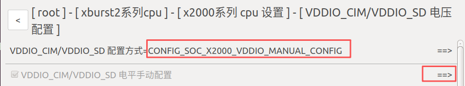

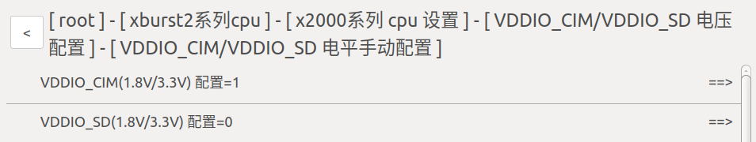

因双摄需要申请比较大的内存，所以此处需扩大rtos的固件使用内存大小：

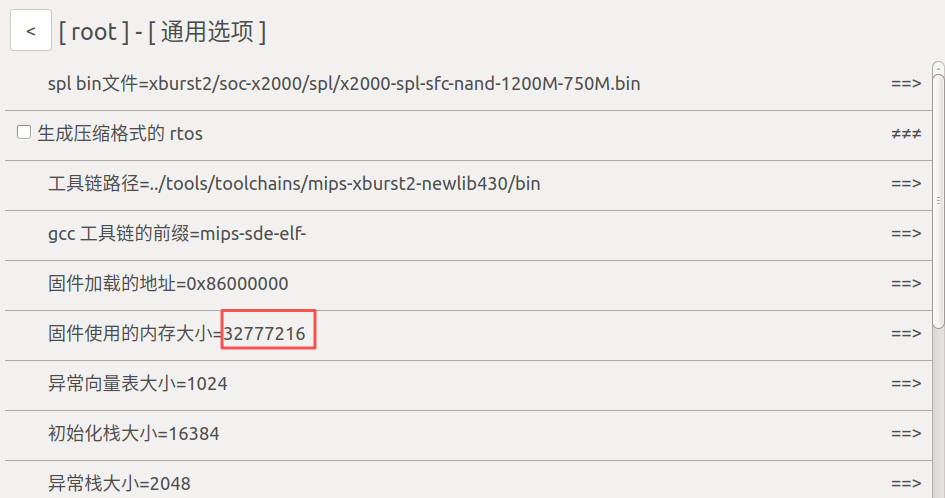

配置sensor外设：

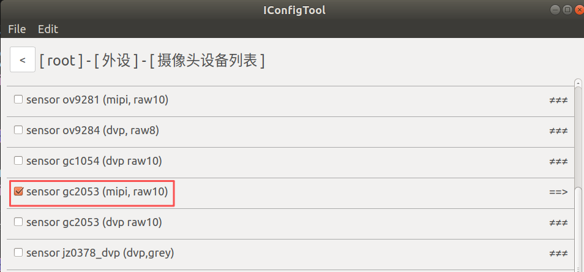

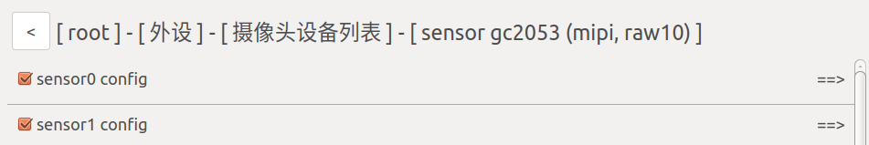

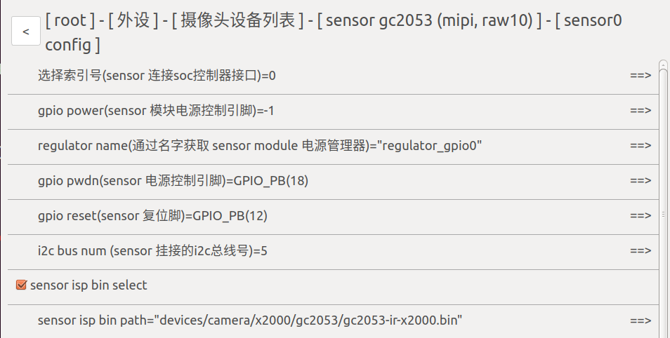

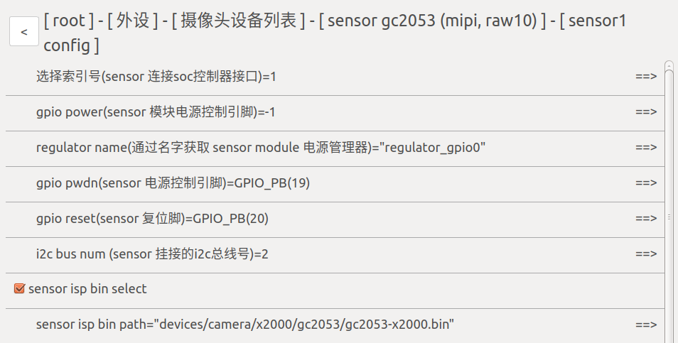

配置sensor对应的电源控制引脚：

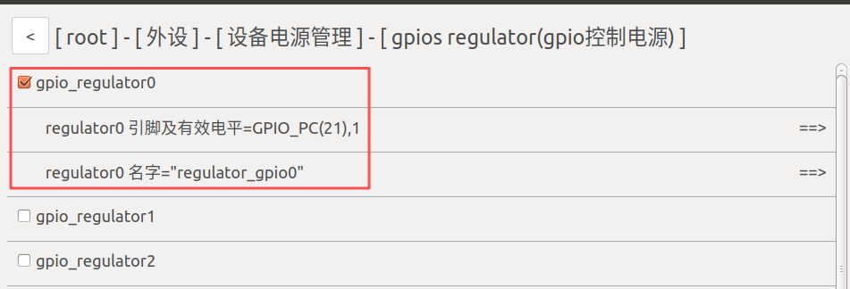

配置sensor对应的i2c：

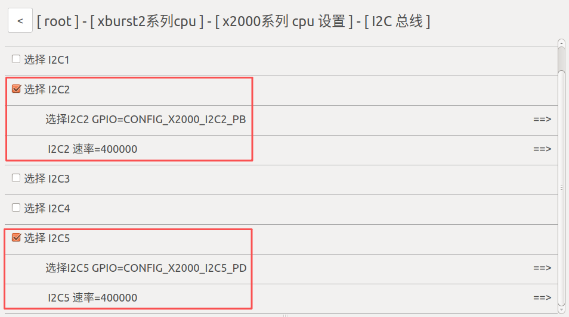

配置vic控制器相关：

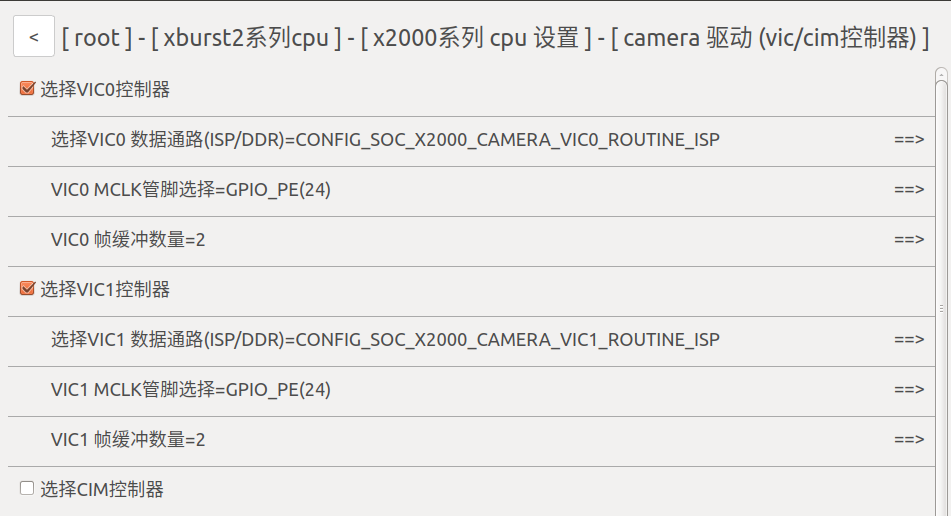

## **三 配置屏幕显示相关**

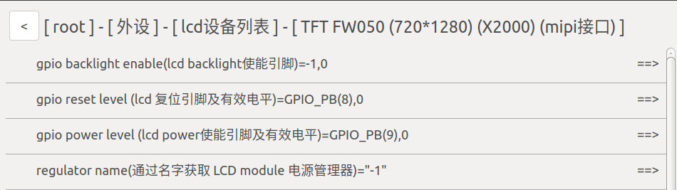

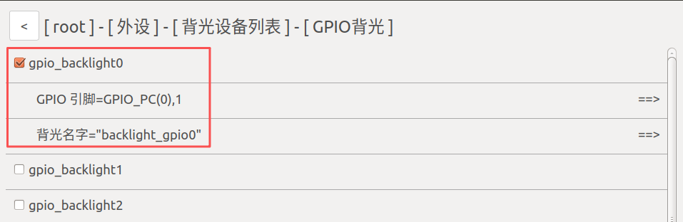

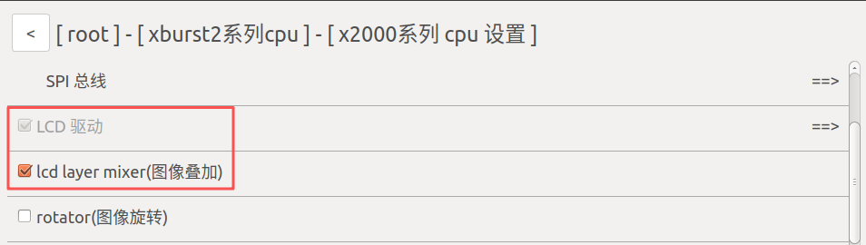

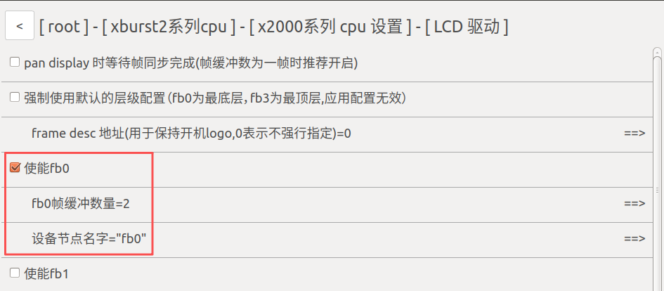

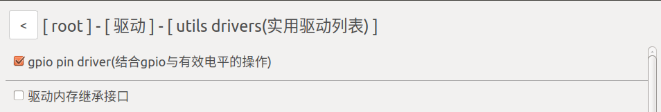

## **四 添加测试代码**

vendor/vendor.c

```c
#include <stdio.h>
#include "example/driver/isp_for_dualcamera_example.c"

void vendor_init(void *arg)
{
    printf("vendor init...\n");
    thread_test_isp();
}
```

编译烧录后将会在屏幕上看到sensor1预览到屏幕上的数据。同时在串口终端可以看到sensor0获取到的帧数：

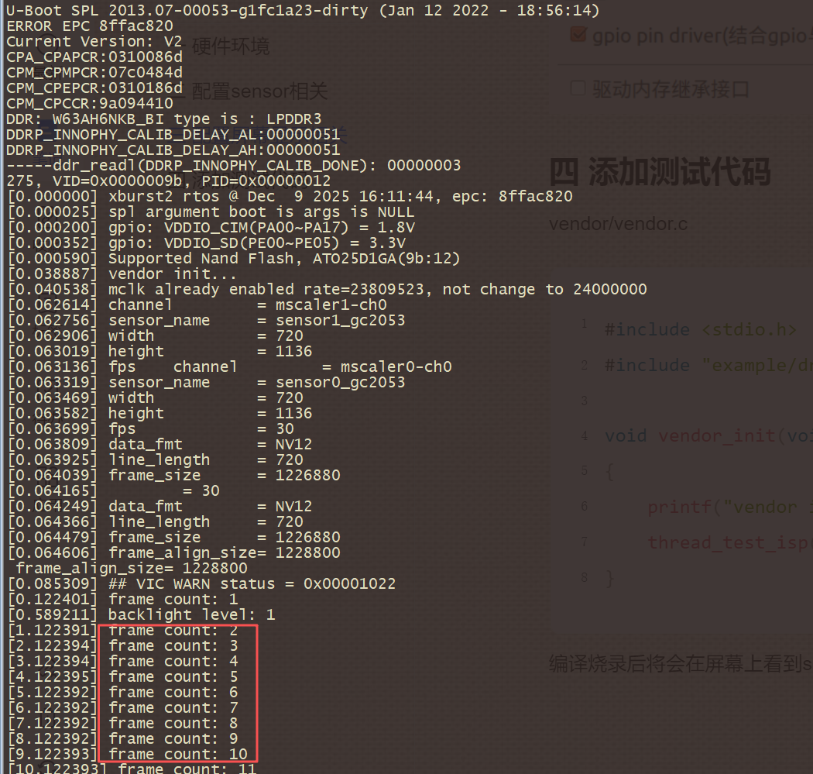