## 						PD_X2600_VAST_V2.0开发板SADC使用说明

### 一 功能说明

#### 1.1 功能简介

SADC主要用来采集某个外设电压，是一个输入的功能。即外部有电压输入进对应ADC引脚时，基于硬件上的参考电压（X2600是1.8V），可以获取到该电压的采样值并由此进一步计算出具体的电压值。电压值和采样值的对应方法是：实际电压 mv = (1800mv * 采样值) / 4096。

X2600的SADC模块在CPU层面上有16个通道，12bit(4096)的分辨率，3个用户可定义的采样序列。

x2600支持多种采样模式，例如单次采样模式、连续采样模式、扫描采样模式。

X2600的SADC采样序列有3个，分别为seq0～2.即adc会按照你设定的顺序，依次去采样对应的通道。

x2600 的SADC还可以做为检测输入电压是否超过用户定义的高、低阈值的看门狗，可以产生一个硬件中断供用户使用。

x2600 SADC模块最大支持时钟为30M， 最大采样率为2Msps。

#### 1.2 三个采样序列具体对比

三个采样序列所具有的功能并不相同，普通情况下seq1的功能最为完善，可以只用这个满足需求，当同时需要有多个采集序列时，才需要考虑到同时设置多个采集序列的情况。三个采样序列具体特性对比如下：

 * adc 包含16个采样通道,采样深度12bit

 * adc 包含三个采样序列:seq0 seq1 seq2.

 * 每个采样序列可以配置多个采样通道和采样顺序

 * 三个采样序列可以配置优先级,从而在触发时决定执行顺序

 * 三个采样序列的采样率是一样的, 都由 adc_clk/15 决定

 * seq0:

 * 最大支持4个通道,依次进行采样

 * 支持采样结束中断

 * 支持软件触发采样

 * 不支持tcu,gpio事件触发

 * 不支持延时采样功能,采样完一个通道,立即开始下一个通道采样

 * 不支持自动连续采样

 * 不支持dma

   

 * seq1:

 * 最大支持16个通道,依次进行采样

 * 支持采样结束中断

 * 支持软件触发采样

 * 支持延时采样,每个通道采样完之后可经过延时,再采样下一个通道

 * 支持自动连续采样,序列完成采样之后,自动重新开始采样

 * 连续采样是分组的,最多可分8组,每组可以定义一个延时,这是分组的核心需求

 * 可以只分一组,设置一个延时,用作简单的连续采样周期

 * 支持tcu 半/满事件触发，支持外部gpio触发

 * 支持dma

   

 * seq2:

 * 最大支持8个通道,依次进行采样

 * 支持采样结束中断

 * 支持软件触发采样

 * 有延时采样功能,采样完一个通道,可以进行延时再进行下一个通道的采样

 * 支持tcu 半/满事件触发, 支持外部gpio触发

 * 不支持自动连续采样

 * 支持dma

#### 1.3 模拟看门狗AWD详述

awd即analog watch dog，其功能就是使能某个adc通道的一个中断。

这个中断可以设置一个高阈值和一个低阈值，当使用seq0~2的任何一个采集序列，采样到该通道的时候，如果此时的值高于设置的高阈值或是低于设置的低阈值时，将会提前触发一个awd的中断，并且调用设置的中断回调函数，awd功能本质上为一个中断。

当需要监测某个adc值高于或低于某个数值时需要通知到用户时，可以使用这个功能。

接口上需要先调用adc_set_awd_cb，设置触发时需要调的回调函数，然后调用adc_enable_awd。输入需要监测的adc通道，以及各自的阈值，之后再采集序列采集到对应通道时，如果触发了对应的阈值，将会调用adc_set_awd_cb设置的回调函数。

### 二 硬件环境说明

本文档以PD_X2600_VAST_V2.0开发板作为演示板，来读取ADC12_CIM及ADC13_SD的电压值。具体电路实现如下：

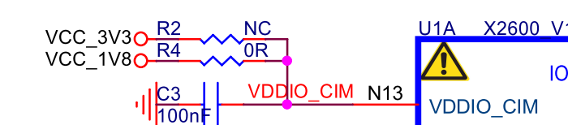

上图可知当前CIM外接供电是1.8v。

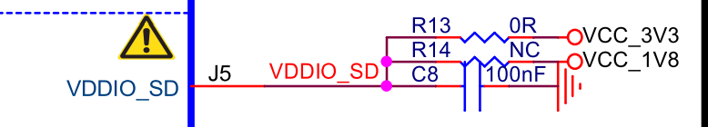

上图可知当前SD外接供电是3.3v。

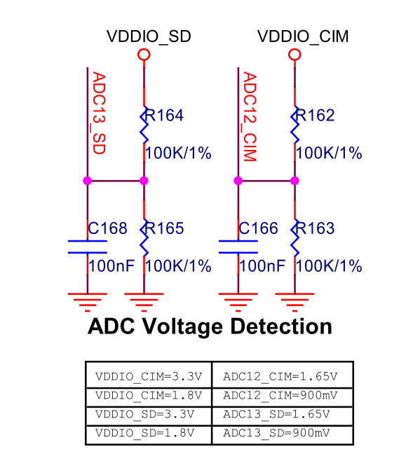

上图可知，当前CIM外接供电为1.8v时，ADC12_CIM应当检测为900mV。 当前SD外接供电为3.3v时，ADC13_SD应当检测为1.65V。

### 三 软件实现

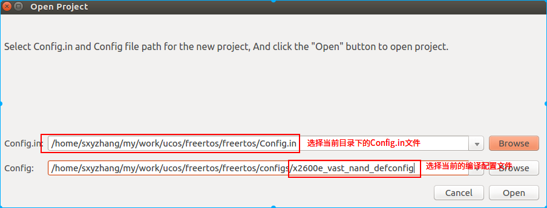

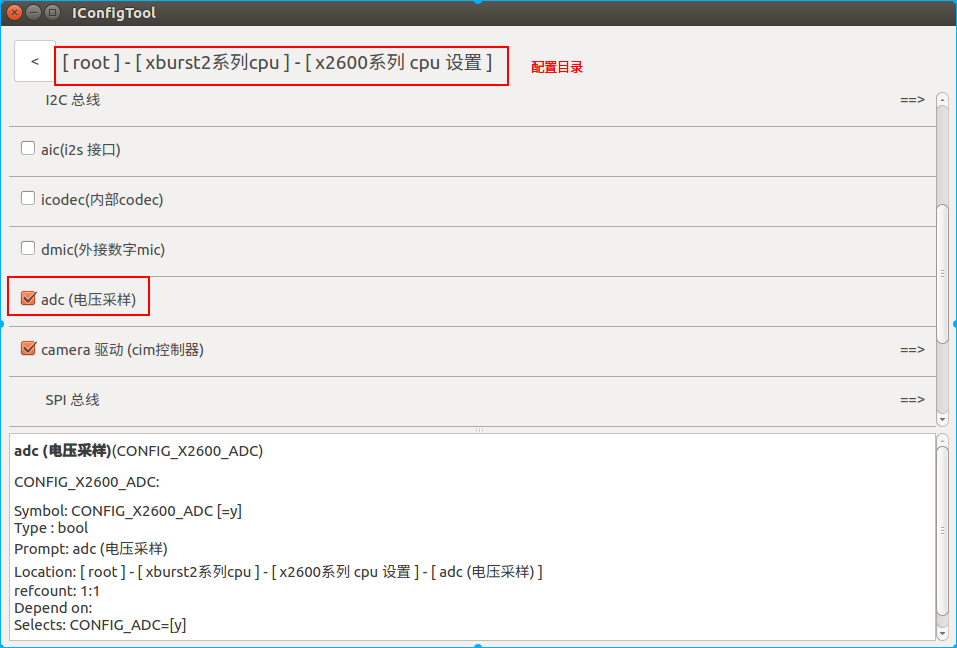

### 四 编译烧录

```c
sxyzhang@T430:~/freertos/freertos$ make x2600e_vast_nand_defconfig
sxyzhang@T430:~/freertos/freertos$ make
```

生成烧录文件：

```c
sxyzhang@T430:~/freertos/freertos$ ll rtos-with-spl.bin
-rw-rw-r-- 1 sxyzhang sxyzhang 512344 9月  21 19:27 rtos-with-spl.bin
```


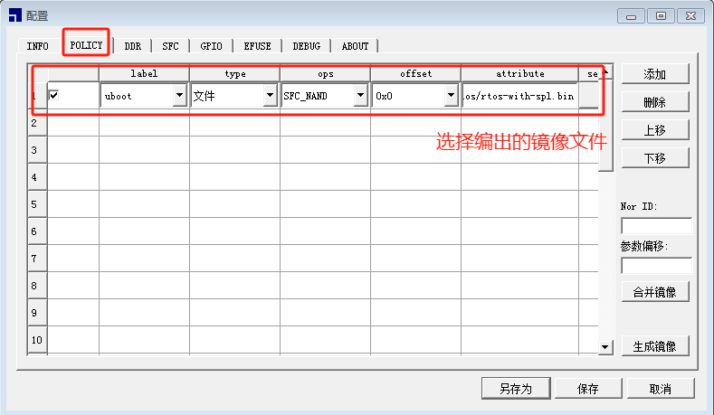

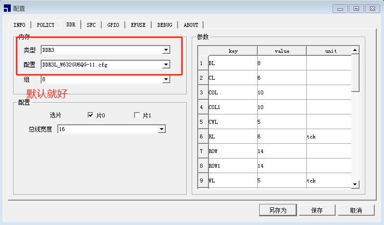


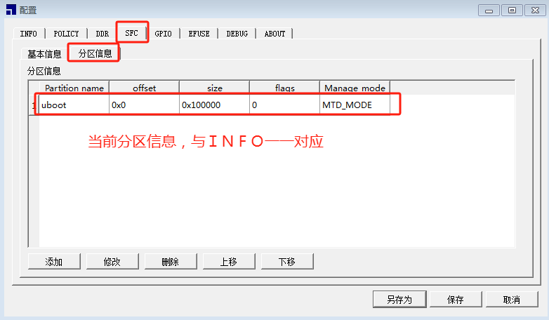

### 五 测试

#### 5.1 代码直接测试

君正SADC驱动测试用例的位置是：

```c
sxyzhang@T430:~/my/work/ucos/freertos/freertos$ ll example/driver/*adc*
-rw-rw-r-- 1 sxyzhang sxyzhang  479 9月  19 17:45 example/driver/adc_channels_sampling_example.c
-rw-rw-r-- 1 sxyzhang sxyzhang  524 9月  19 11:35 example/driver/adc_example.c
-rw-rw-r-- 1 sxyzhang sxyzhang 2043 9月  18 17:13 example/driver/x2600_adc_dma_example.c
-rw-rw-r-- 1 sxyzhang sxyzhang 2093 9月  18 17:13 example/driver/x2600_adc_example.c
```

其中四个测试文件的区别描述如下：

**adc_example.c**:为共用的adc示例文件，用于将采样值转换为对应电压，工作方式上是按每次主动去读adc的值，实际每个芯片有差异，因此实际使用中需要改一下才能用。

**adc_channels_sampling_example.c**:为共用的adc示例文件，跟上者不一样的是，这个示例是用回调的方式去读的，通过开启一次采样，完成后调用回调函数，读取完值之后再次开启采样，这里读取到的值没有计算电压，因此只是采样值。

**x2600_adc_example.c**:x2600独有的示例文件：

adc_test_seq0_irq为用中断读取seq0的示例程序。

adc_test_seq0_poll为用轮训方式读取seq0的示例程序。

adc_test_seq1_irq为用中断读取seq1的示例程序。

adc_test_seq1_poll为用轮训方式读取seq1的示例程序。

**x2600_adc_dma_example.c**：x2600独有的示例文件：

adc_dma_test_seq1_irq为在dma模式下用中断读取seq1的示例程序。

 adc_dma_test_seq1_poll为在dma模式下用轮训方式读取seq1的示例程序。

本文以**adc_channels_sampling_example.c**:为例展示SADC的多通道采样的其中一个用法：

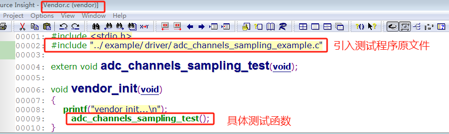

其中adc_channels_sampling_test（）中可以设置当前的采样通道如下：

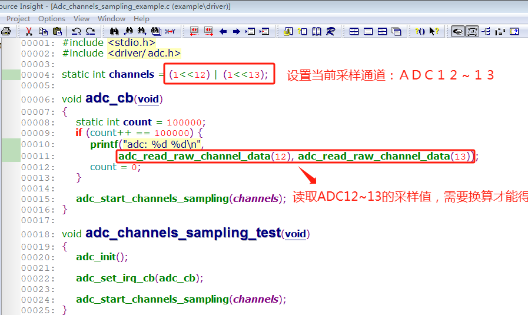

具体运行结果如下：

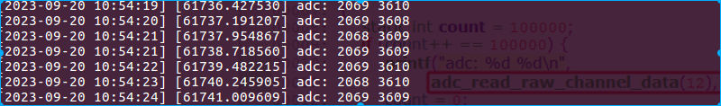

由此可知：

ADC12的电压值为： (1800mv * 2069) / 4096 = 909mv

ADC13的电压值为： (1800mv * 3609) / 4096 = 1586mv

这两个值与前述硬件环境说明中硬件设计思路是一致的，说明ADC工作正常，电压采样正确。

#### 5.2 辅助开发命令测试

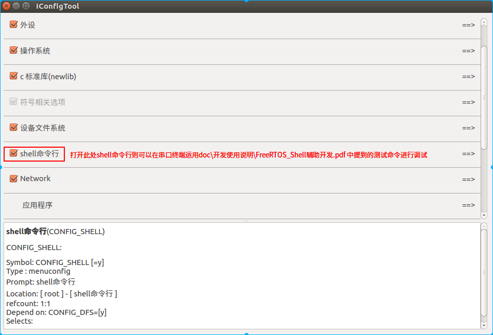

如上配置之后保存，并重新编译烧录：

```c
sxyzhang@T430:~/freertos/freertos$ make x2600e_vast_nand_defconfig
sxyzhang@T430:~/freertos/freertos$ make
```

编译烧录后可使用如下命令来测试ADC采样：

```c
adc_sample <channel>
功能：获取adc数据
参数：channel                                   //通道号
example：
                      adc_sample 0
```

具体用法如下：


adc_sample命令源码位置：

```c
sxyzhang@T430:~/my/work/ucos/freertos/freertos$ ll shell/cmds/drivers/cmds_adc.c 
-rw-rw-r-- 1 sxyzhang sxyzhang 1031 7月  11  2022 shell/cmds/drivers/cmds_adc.c
```

用户可以先用adc_sample命令调试采样，采样正确之后，可以参考adc_sample命令的源码来使用adc的驱动接口。

### 六 ADC接口详解

#### 6.1 ADC包含头文件

```
#include <adc.h>
```

#### 6.2 中间参数详解

```c
# 以下是x2600 adc的功能配置参数(详细功能概述见xburst2/soc-x2600/include/soc/adc.h)：

触发采集的方式
enum adc_trigger_type {
    adc_trigger_tcu0_half,
    adc_trigger_tcu0_full,
    adc_trigger_tcu1_half,
    adc_trigger_tcu1_full,
    adc_trigger_tcu2_half,
    adc_trigger_tcu2_full,
    adc_trigger_tcu3_half,
    adc_trigger_tcu3_full,
    adc_trigger_tcu4_half,
    adc_trigger_tcu4_full,
    adc_trigger_tcu5_half,
    adc_trigger_tcu5_full,
    adc_trigger_tcu6_half,
    adc_trigger_tcu6_full,
    adc_trigger_tcu7_half,
    adc_trigger_tcu7_full,
    adc_trigger_gpio_rising_edge,
    adc_trigger_gpio_falling_edge,
    adc_trigger_gpio_both_edge,
    adc_trigger_software,
};
```

```c
struct adc_seq0_config {
    unsigned char channel_cnt;  // adc 采样序列使用的adc 通道总数
    unsigned char channels[4];  // 采样序列依次的通道号
    /* 中断回调函数,当一个转换序列完成之后回调,回调中需要读取adc数据 */
    void (*irq_cb)(void);
};
```

```c
struct adc_seq1_config {
    /* 连续采样模式的计数时钟 = adc_clk / continus_clk_div; 最大值 2的24次方 */
    int continus_clk_div;
    /* 采样延时计数时钟 = adc_clk / delay_clk_div; 最大值 2的24次方 */
    int delay_clk_div;
    enum adc_trigger_type trigger;      // adc 采样触发类型
    unsigned char enable_channel_num;   // 使能采样通道号,保存在数据的12-15 4bit位
    unsigned char channel_cnt;          // adc 采样序列使用的adc 通道总数
    unsigned char channels[16];         // 采样序列依次的通道号
    /* 采样序列每个通道的延时, 单位是 adc delay clk */
    unsigned short channel_delays[16];

    unsigned char group_cnt;  // 连续采样模式下分组的个数,0表示不使能连续采样
    unsigned char groups[8];  // 分组模式依次对应每组通道的个数
    unsigned short group_delays[8]; // 每个分组转换完之后的延时, 单位是 adc cont clk

    void (*irq_cb)(void); // 中断回调函数,当一个转换序列完成之后回调,回调中需要读取adc数据

    unsigned int dma_mode; // 是否使用dma模式，非0为使用
    unsigned short *dma_buf; // dma接收数据的buf，要求cache对齐
    unsigned int dma_size; // dma buf的大小
};
```

```c
struct adc_seq2_config {
    /* 采样延时计数时钟 = adc_clk / delay_clk_div; 最大值 2的24次方 */
    int delay_clk_div;
    enum adc_trigger_type trigger;     // adc 采样触发类型
    unsigned char enable_channel_num;  // 使能采样通道号,保存在数据的12-15 4bit位
    unsigned char channel_cnt;         // adc 采样序列使用的adc 通道总数
    unsigned char channels[8];         // 采样序列依次的通道号
    unsigned char channel_delays[8];   // 采样序列每个通道的延时, 单位是 adc delay clk

    /* 中断回调函数,当一个转换序列完成之后回调,回调中需要读取adc数据 */
    void (*irq_cb)(void);

    unsigned int dma_mode; // 是否使用dma模式，非0为使用
    unsigned short *dma_buf; // dma接收数据的buf，要求cache对齐
    unsigned int dma_size; // dma buf的大小
};
```

```c
adc awd 功能的中断回调函数类型
/**
 * low_flags 保存低于 low_threshold 触发中断的通道 [0，15]
 * high_flags 保存高于 high_threshold 触发中断的通道 [0，15]
 */
typedef void (*adc_awd_cb)(unsigned short low_flags, unsigned short high_flags);
```

#### 6.3 接口

```c
void adc_init(void)
功能：初始化adc(使能adc时钟，初始化控制器，并申请adc中断)
```

```c
int adc_read_data(unsigned int channel)
功能：adc数据采样
参数：
             channel：通道(0:AUX0  1:AUX1  2:AUX2 ......)
返回值：
                 大于0                           ：采集数据
                 -ENODEV(-19)          ：没有发现设备
                 -ETIMEDOUT(-116)：超时
                 -EINVAC(-22)             ：超过通道数
"注意：实际电压=(采样数据/1024)*参考电压"
```

```c
void adc_deinit (void)
功能：释放adc资源(释放中断、释放adc)
```

```c
void adc_set_irq_cb(adc_irq_cb_t cb_func)
功能：设置多通道采样时的中断回调
参数：
                cb_func：需要在回调里读取数据
```

```c
void adc_start_channels_sampling(unsigned int channels)
功能：开启多通道采样
参数：
                channels：需要开启的通道，每位bit对应一个通道
```

```c
int adc_read_raw_channel_data(unsigned int channel)
功能：多通道采样中使用，在回调中读取具体通道数据
参数：
                channel：需要读取的通道
返回值：
                成功：返回采样值
                失败：返回-1
```

```c
void adc_enable_repeat_sampling(int enable)
功能：是否自动重启采样
参数：
                enable：是否开启自动重启采样
```

```c
void adc_enable_poll_mode(void)
功能：打开 adc 轮询模式
```

```c
void adc_disable_poll_mode(void)
功能：关闭 adc 轮询模式
```

```c
int adc_read_data_poll(unsigned int channel)
功能：使用轮询模式采样 adc 通道的值
参数：
                channel：需要读取的通道
返回值：
                成功：返回采样值
                失败：-EINVAL -- 超过通道数
```

以下是x2600 adc的接口：

```c
void adc_set_clk(int src_clk_rate, int div)
功能：设置 adc 工作时钟 adc_clk ，adc_clk = src_clk_rate/div，adc_clk最大为30M
参数：
                src_clk_rate：输入的源时钟
                div：分频系数
```

```c
void adc_set_seq_priority(
    char seq0_pri, char seq1_pri, char seq2_pri, int high_break_low)
功能：设置采样序列优先级, 可选值 0, 1, 2, 值越大优先级越高
参数：
                seq0_pri：seq0 的优先级
                seq1_pri：seq1 的优先级
                seq2_pri：seq2 的优先级
                high_break_low：表示低优先级序列未完成时是否可以被高优先级打断
                                1表示打断 0不打断
```

```c
void adc_clean_all_interrupt_flag(void)
功能：清除所有中断的标志位
```

```c
void adc_power_on(void)
功能：使能 adc 功能
```

```c
void adc_power_off(void)
功能：失能 adc 功能
```

```c
void adc_enable_seq0(struct adc_seq0_config *cfg)
功能：使能 seq0 采样序列
参数：
                cfg：seq0 的配置，详细信息见struct adc_seq0_config
```

```c
void adc_disable_seq0(struct adc_seq0_config *cfg)
功能：失能 seq0 采样序列
参数：
                cfg：seq0 的配置，详细信息见struct adc_seq0_config
```

```c
void adc_start_seq0(void)
功能：触发 seq0 采样
```

```c
int adc_poll_seq0_data_ready(void)
功能：配置里的irq_cb 为NULL时,使用此函数查询seq0采样序列数据是否准备好
返回值：
                返回1：数据已准备好
                返回0：数据尚未完成
```

```c
void adc_read_seq0_data(unsigned short *values, int len)
功能：读取 seq0 的采样序列的数据
参数：
                values：作为输出，数据将读取到该buf中
                len：buf的大小，数组大小必须是采样序列的长度/通道数
```

```c
void adc_enable_seq1(struct adc_seq1_config *cfg)
功能：使能 seq1 采样序列
参数：
                cfg：seq1 的配置，详细信息见struct adc_seq1_config
```

```c
void adc_start_seq1(void)
功能：trigger == adc_trigger_software 时,使用本函数触发 adc seq1 的采样
```

```c
int adc_dma_poll_seq1_data_ready(struct adc_seq1_config *cfg)
功能：irq_cb 为NULL, dma_mode 为1时, 使用此函数查询seq1采样序列数据是否准备好
参数：
                cfg：seq1 的配置
返回值：
                返回1：数据已准备好
                返回0：数据尚未完成
```

```c
int adc_dma_seq1_get_readable_size(struct adc_seq1_config *cfg)
功能：读取 dma 模式下当前 seq1 可读的采样序列的数据个数
参数：
                cfg：seq1 的配置
返回值：
                返回当前可读的数据量, 单位为byte
```

```c
unsigned int adc_dma_seq1_read_data(
        struct adc_seq1_config *cfg, unsigned short *data)
功能：读取 seq1 dma 模式下采样序列的数据
参数：
                cfg：seq1 的配置
                data：输出的数据buf
返回值：
                返回读到的采样序列的数据个数, 单位为byte
```

```c
int adc_poll_seq1_data_ready(void)
功能：irq_cb 为NULL时,使用此函数查询seq1采样序列数据是否准备好
返回值：
                返回1：数据已准备好
                返回0：数据尚未完成
```

```c
void adc_read_seq1_data(unsigned short *values, int len)
功能：读取 seq1 的采样序列的数据
参数：
                values：作为输出，数据将读取到该buf中
                len：buf的大小，数组大小必须是采样序列的长度/通道数
```

```c
void adc_disable_seq1(struct adc_seq1_config *cfg)
功能：失能 seq1 采样序列
参数：
                cfg：seq1 的配置
```

```c
void adc_enable_seq2(struct adc_seq2_config *cfg)
功能：使能 seq2 采样序列
参数：
                cfg：seq2 的配置，详细信息见struct adc_seq2_config
```

```c
void adc_start_seq2(void)
功能：trigger == adc_trigger_software 时,使用本函数触发 adc seq2 的采样
```

```c
int adc_dma_poll_seq2_data_ready(struct adc_seq2_config *cfg)
功能：irq_cb 为NULL, dma_mode 为1时, 使用此函数查询seq2采样序列数据是否准备好
参数：
                cfg：seq2 的配置
返回值：
                返回1：数据已准备好
                返回0：数据尚未完成
```

```c
int adc_dma_seq2_get_readable_size(struct adc_seq2_config *cfg)
功能：读取 dma 模式下当前 seq2 可读的采样序列的数据个数
参数：
                cfg：seq2 的配置
返回值：
                返回当前可读的数据量, 单位为byte
```

```c
unsigned int adc_dma_seq2_read_data(
        struct adc_seq2_config *cfg, unsigned short *data)
功能：读取 seq2 dma 模式下采样序列的数据
参数：
                cfg：seq2 的配置
                data：输出的数据buf
返回值：
                返回读到的采样序列的数据个数, 单位为byte
```

```c
int adc_poll_seq2_data_ready(void)
功能：irq_cb 为NULL时,使用此函数查询seq2采样序列数据是否准备好
返回值：
                返回1：数据已准备好
                返回0：数据尚未完成
```

```c
void adc_read_seq2_data(unsigned short *values, int len);
功能：读取 seq2 的采样序列的数据
参数：
                values：作为输出，数据将读取到该buf中
                len：buf的大小，数组大小必须是采样序列的长度/通道数
```

```c
void adc_disable_seq2(struct adc_seq2_config *cfg)
功能：失能 seq2 采样序列
参数：
                cfg：seq2 的配置
```

```c
void adc_enable_awd(int channel, int low_threshold, int high_threshold)
功能：使能对应通道的 awd 功能
      需要设置seqn采集所需通道，才能触发对应通道的 awd 功能，本身不具备采样功能
参数：
                channel：使能 awd 功能的通道
                low_threshold ：低阈值触发
                                对应通道的采样值 <= 该值时触发中断，-1 则不使能该功能
                high_threshold：高阈值触发
                                对应通道的采样值 >= 该值时触发中断，-1 则不使能该功能
```

```c
void adc_disable_awd(int channel)
功能：失能对应通道的 awd 功能
参数：
                channel：失能 awd 功能的通道
```

```c
void adc_set_awd_cb(adc_awd_cb cb)
功能：设置 awd 的中断回调函数，触发任意一个条件时进入中断，回调可以读取是哪个通道触发
参数：
                cb：中断回调函数，详细见 adc_awd_cb 函数的描述
```

```c
线程安全，不能在中断上下文使用：
        adc_init
        adc_read_data
        adc_deinit
        adc_start_channels_sampling
```

### 七 调试说明

正常情况下可参考example的示例，大部分普通用法都配合文档参照使用。

调试中首先必须确保的是硬件的电压必须不能超过参考电压，否则有烧坏的风险。

如果频率超过了30M时adc是无法工作的，如果检测到采样值一直是0的话，可以往这方面查一下，正常悬空的引脚采样值是不稳定的，因此如果悬空时为0，大概率是该错误。

出现读取到的值异常时重点检查一下时钟是否工作，以及工作频率是否正确，可以通过读取对应寄存器的方式，或者直接加打印看看adc_init处设置时钟频率到底有没有调用到。

**关于时钟设置请注意如下**：

adc_src_clk:
 ADC 模块的时钟。由 CGU 的寄存器 SADCCDR 得到, 通过下面两个函数可以得到当前 ADC 模块的时钟为多少:

```c
 adc_device->clk = clk_get("gate_sadc");
clk_get_rate(adc_device->clk)
```

adc_clk_div: 
ADC 模块的工作时钟分频, 通过 ADC 的寄存器 ADC_CLKR0 设置, 区别于 CGU 的分频

adc_clk: 
adc 最终的工作时钟,此处默认adc的时钟源为:

```c
adc_clk = adc_src_clk / adc_clk_div
adc_set_clk(clk_get_rate(adc_device->clk), 40);
```

该函数中, clk_get_rate(adc_device->clk)将会获取到 CGU 下来的时钟 adc_src_clk 为1200M, 然后设置 adc_clk_div 为40, 最后工作时钟应该为30M, 目前x2600 SADC可支持最高的工作时钟为30M

adc_delay_clk:
ADC 模块采样序列的每个通道之间可以设置延迟, 由分频 delay_clk_div 得到计算单位, 再由通过设置个数设置具体时间, 计算公式为 adc_delay_clk = adc_clk / delay_clk_div
假设工作时钟为上述的30M, 设置 delay_clk_div 为30k, 那么 adc_delay_clk 的单位即为1k, 也就是1ms, 通过设置 struct adc_seq1_config -> channel_delays[16], 确定采样序列对应的每个采样延时个数, 当设置 channel_delays[0] = 10 时, 即采样第1个后需要延迟10 * 1ms的时间。

```
#define SEQ1_CHANNEL_CNT 10

static struct adc_seq1_config seq1_adc = {
    .continus_clk_div = 30000,
    .delay_clk_div = 30000,  // 延时分频个数
    .trigger = adc_trigger_software,
    .enable_channel_num = 1,
    .channel_cnt = SEQ1_CHANNEL_CNT,
    .channels = { 0, 1, 2, 3, 8, 9, 10, 11, 12, 13},
    // .channel_delays = {10,10,10,10,10,10,10,10,10,10},
    .channel_delays = {0,0,0,0,0,0,0,0,0,0},  //采样序列对应的每个采样延时个数
    .group_cnt = 1,
    .groups = {SEQ1_CHANNEL_CNT},
    .group_delays = {0, },
    .irq_cb = NULL,
};

static uint64_t time = 0, old = 0;
static int count = 0;

static void print_seq1_data(void)
{
    int len = SEQ1_CHANNEL_CNT;
    unsigned short values[SEQ1_CHANNEL_CNT];


adc_read_seq1_data(values, len);
count++;

time = systick_get_time_us();
if (time - old >= 1 * 1000 * 1000) {
    printf("count = %d\n", count);
    count = 0;
    old = systick_get_time_us();
}

// printf("seq1: %08lld", systick_get_time_us());

// int i;
// for (i = 0; i < len; i++)
//     printf(" %d:%d", values[i] >> 12, values[i] & 0xfff);
// printf("\n");

}
```

