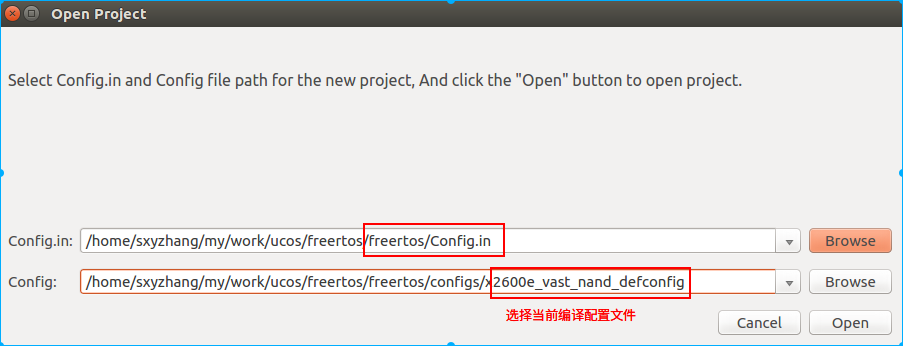
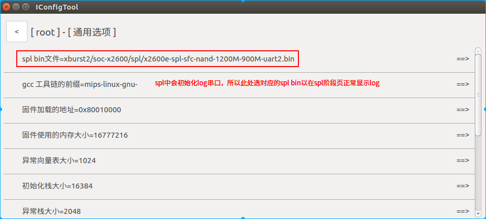
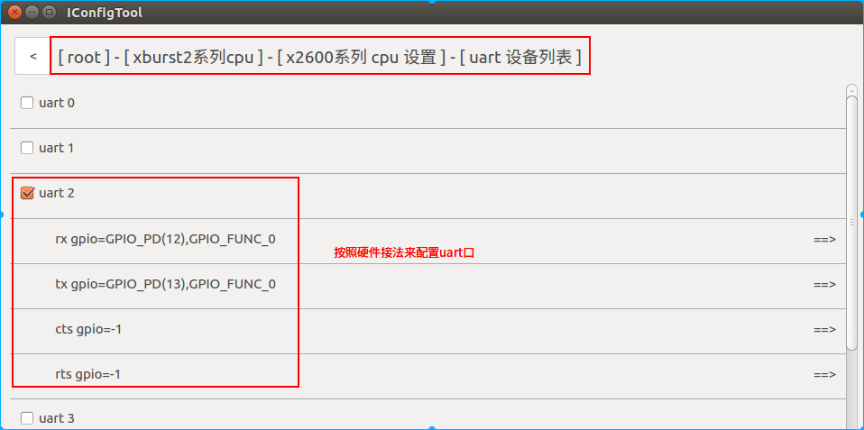
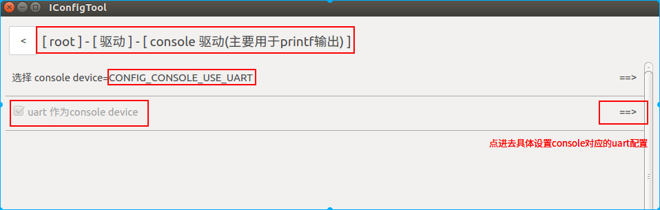
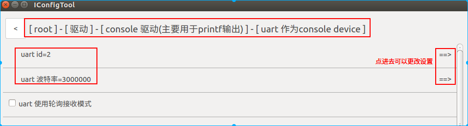
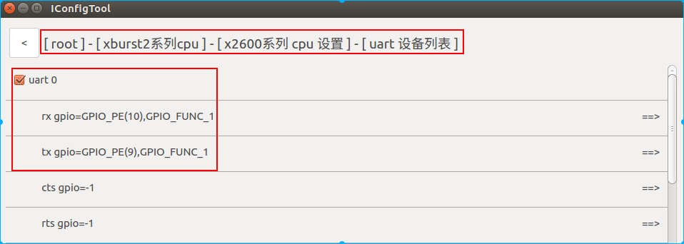
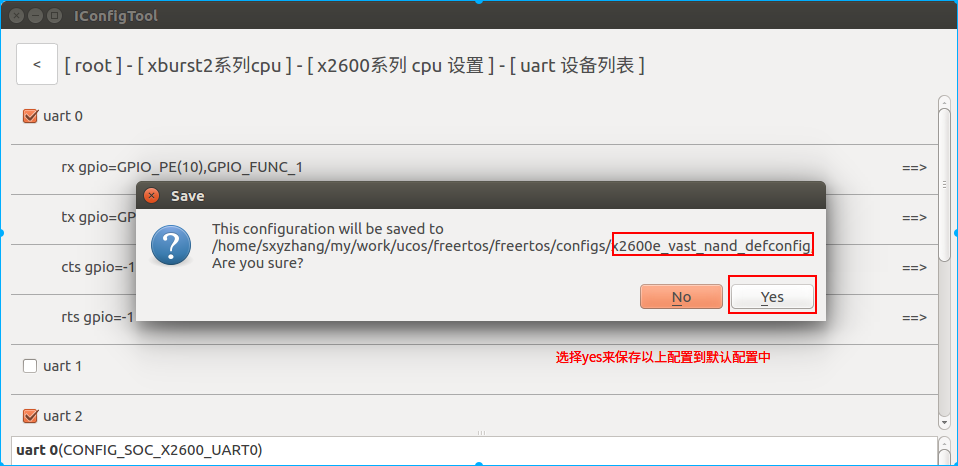
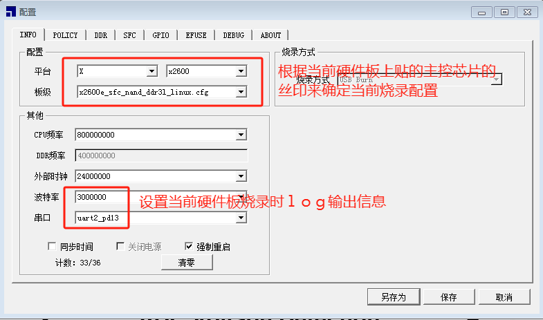
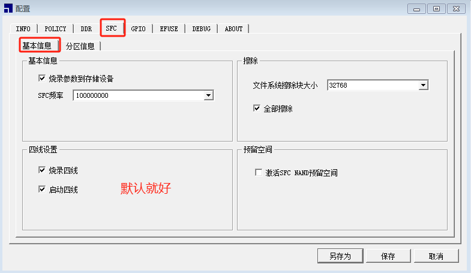

# 				PD_X2600_VAST_V2.0开发板UART使用说明


## 一 功能说明

x2600 的UART功能如下：

-  支持 5，6，7，8-bit 数据位宽 
-  支持奇校验或偶校验 
-  支持 1, 1½, or 2-bit 停止位 
-  支持流控 
-  支持 IrDA1.1 
-  最大 3M 波特率 
-  支持 DMA 传输 
-  支持PIO 传输
-  硬件有8路UART可以同时通讯

## 二 硬件环境说明

本文档以PD_X2600_VAST_V2.0开发板为例，演示UART2（PD12, 13）作为printf 输出系统log信息口的配置及运行。 

同时演示UART0（PE09, 10）短接TX和RX后自收自发的配置和运行。

根据硬件原理图，UART0对应PE09,10：


## 三 软件实现

### 3.1 配置串口log终端

根据硬件设计，本开发板UART2（PD12, 13）作为printf 输出系统log信息口，具体配置如下：











### 3.2 配置uart口通讯

根据硬件设计，UART0 PE09、PE10可以短接起来，自收自发数据来测试软硬件的uart通讯配置如下：



### 3.3 保存配置



## 四 测试

作为log输出口的测试就直接看串口工具的输出就可以了，特别注意要将波特率设置为一致的，通讯模式比如8N1等设置成一致的。 此处不再赘述。对于自收自发的uart0的测试如下：

### 4.1 编写测试程序

君正提供的串口自收自发的测试程序来测试uart0, 硬件上需要将uart0的TX和RX短接。

测试程序位置：example/driver/uart_example.c

```c
#include <stdio.h>
#include <malloc.h>
#include <driver/uart.h>
#include <os.h>
#include <string.h>


	char *tx_buffer = NULL;
	char *rx_buffer = NULL;
	int buffer_len = 1024;
	unsigned char base = 128;

static struct uart_config uart0_config = {
    .uart_id            = 0,       // 对应uart0
    .data_bits          = 8,
    .stop_bits          = 1,
    .loop_mode          = 0,
    .tx_poll_mode       = 1,
    .rx_poll_mode       = 0,
//    .rx_dma_mode      = 1,      // 对应打开rx dma 模式
//    .rxdma_bufsize      = 1024, //设置rx dma模式的bufsize， must >= 256
    .parity             = UART_PARITY_NONE,
    .follow_contrl      = UART_FC_NONE, //UART_FC_NONE / UART_FC_CTS_RTS
    .baud_rate          = 9600,   // 设置待测试uart的通讯波特率
};


static void dump_buffer(void *buffer, int count)
{
    int i = 0;
    unsigned char *tmp = (unsigned char *)buffer;

    for (i=0; i<count; i++) {
        if ( (i != 0) && (i%16 == 0)) {
            printf("\n");
        }
        printf("%02x:", tmp[i]);
    }
    printf("\n");
}

// uart 读取数据并比对发送buffer，全部一致没有打印，有不一致才会dump收发buffer中的数据
static void uart_read_thread_func(void *data)
{
 
	while(1)
	{
	uart_receive(&uart0_config, rx_buffer, buffer_len);
	if (memcmp(tx_buffer, rx_buffer, buffer_len) == 0) {
        } else {
            printf("uart test failed. Send != Recv\n");
            printf("Send Buffer:\n");
            dump_buffer(tx_buffer, buffer_len);

            printf("Recv Buffer:\n");
            dump_buffer(rx_buffer, buffer_len);
        }
        printf("\n");
	}
}

// uart发送函数，发送内容每次都有改变
static void uart_write_thread_func(void *data)
{
	while(1){
		
        memset(rx_buffer, 0x00, buffer_len);
        memset(tx_buffer, --base, buffer_len);
	printf("Send Buffer finish =0x%x\n", tx_buffer[0]);
        uart_send(&uart0_config, tx_buffer, buffer_len);
	if(base == 0)
		base = 128;
        msleep(1000);
	}
}

// 串口通讯的入口函数，前提条件是RX、TX已经短接了
void uart_test(void)
{
	thread_ptr_t uart_read_t;
	thread_ptr_t uart_write_t;

	printf("UART Configurate Infomation:\n");
	printf("UART%d: %d:%d-%c-%d\n",
	        uart0_config.uart_id,
	        uart0_config.baud_rate,
	        uart0_config.data_bits,
	        (uart0_config.parity == UART_PARITY_NONE) ? 'N' : (uart0_config.parity == UART_PARITY_ODD) ? 'O' : 'E',
	        uart0_config.stop_bits);
	printf("HardwareFlow: %s\n", uart0_config.follow_contrl == UART_FC_NONE ? "No" : "Yes");

    tx_buffer = malloc(buffer_len);
    if (!tx_buffer) {
        printf("uart thread malloc tx buffer failed\n");
        return;
    }

    rx_buffer = malloc(buffer_len);
    if (!rx_buffer) {
        printf("uart thread malloc rx_buffer buffer failed\n");
        free(tx_buffer);
        return;
    }

	uart_start(&uart0_config);
	memset(rx_buffer, 0x00, buffer_len);
	memset(tx_buffer, base, buffer_len);

	uart_read_t = thread_create("uart_read_test", 2048, uart_read_thread_func, NULL);
	uart_write_t = thread_create("uart_write_test", 2048, uart_write_thread_func, NULL);

	thread_join(uart_read_t, NULL);
	thread_join(uart_write_t, NULL);
	free(rx_buffer);
	free(tx_buffer);
	uart_stop(&uart0_config);
}
```

### 4.2 测试程序编译和使用

修改 vendor/vendor.c ，引⽤⽂件： example/driver/can_example.c

```c
#include <stdio.h>
#include "../example/driver/uart_example.c"   // 引用测试程序使编译进来

void vendor_init(void)
{
    printf("vendor init...\n");
	uart_test();  // 调用测试入口函数
}
```

### 4.3 测试结果

```c
[0.000000] xburst2 rtos @ Oct 16 2023 18:40:14, epc: fffff116
[0.000085] gpio: VDDIO_CIM(PA00~PA11) = 1.8V
[0.047790] gpio: VDDIO_SD(PD00~PD05) = 3.3V
[0.096927] Supported Nand Flash, FS35SQA001G(cd:71)
[0.218071] stmmac - user ID: 0x20, Synopsys ID: 0x37
[0.273210]  Ring mode enabled
[0.305451]  DMA HW capability register supported Enhanced/Alternate descriptors
[0.389690]      Enabled extended descriptors
[0.433371]  RX Checksum Offload Engine supported (type 2)
[0.494730]  TX Checksum insertion supported
[0.541530]  Enable RX Mitigation via HW Watchdog Timer
[0.701772] Found mac phy id 0x0000ffff
[10.743881] stmmac_hw_setup: DMA engine initialization failed
[10.808378] stmmac_open: Hw setup failed
[10.852338] stmmac_open fail -16
[10.887432] netifapi_netif_add fail
[
1$0 .926110] vendor init...
[10.959178] UART Configurate Infomation:
[11.002858] UART0: 9600:8-N-1         // 当前uart0的配置信息
[11.035098] HardwareFlow: No          // 当前uart0的流控信息，与硬件连接对应
[11.066318] Send Buffer finish =0x7f
[12.170778]              //收发比对不一致的话会打印收发的buffer，一致时仅换行
[13.171319] Send Buffer finish =0x7e
[14.274771] 
[15.275310] Send Buffer finish =0x7d
[16.378763] 
[17.379302] Send Buffer finish =0x7c

```

## 五 编译烧录

```c
sxyzhang@T430:~/freertos/freertos$ source build/envsetup.sh   // 每次打开终端只需配置一次
sxyzhang@T430:~/freertos/freertos$ make x2600e_vast_nand_defconfig 
sxyzhang@T430:~/freertos/freertos$ make
```







## 六 接口详解

```c
1.uart_start //初始化控制器，并设置接收缓存
2.uart_send, uart_receive, uart_get_char //函数进行传输。
3.uart_stop //关闭控制器并清除接收缓存
```

例子代码在example/driver/uart_example.c

### 6.1 包含头文件

```
#include <uart.h>
```

### 6.2 中间参数详解 中间参数详解

```c
uart配置结构体
struct uart_config {
             unsigned char uart_id;           // uart总线编号
             unsigned char data_bits;         // 一帧的数据位数
             unsigned char stop_bits;         // 停止位数
             unsigned char loop_mode;         // 循环模式设置(用于测试)
             unsigned char rx_poll_mode;      // 接收方式：1为轮询机制 0为中断方式
             unsigned char tx_poll_mode;      // 发送方式：1为轮询机制 0为中断方式
             enum uart_parity parity;         // 设置uart奇偶校验
             enum uart_follow_contrl follow_contrl;  // 设置流控
             unsigned int baud_rate;          // 设置波特率
};

uart设置奇偶枚举
enum uart_parity {
             UART_PARITY_NONE,             //没有奇偶校验
             UART_PARITY_ODD,                //奇校验
             UART_PARITY_EVEN,              //偶校验
};

uart设置流控枚举
enum uart_follow_contrl {
             UART_FC_NONE,                     //关闭流控
             UART_FC_CTS_RTS,               //控制流选择RTS/CTS
};
```

### 6.3 接口分析

```c
void uart_start(struct uart_config *config)
功能：初始化uart控制器，设置引脚功能映射，设置接受缓存
参数：struct uart_config *config                 // uart配置结构体
```

```c
void uart_stop(struct uart_config *config)
功能：关闭uart控制器(关闭时钟和释放中断等操作)
参数：struct uart_config *config                 // uart配置结构体
```

```CQL
void uart_send(struct uart_config *config, const char *buf, unsigned int len)
功能：uart发送数据
参数：
              struct uart_config *config        // uart配置结构体
              const char *buf                   // 待发送的数据
              unsigned int len                  // 发送数据的长度
```

```c
void uart_receive(struct uart_config *config, char *buf, unsigned int len)
功能：uart接收数据
参数：
             struct uart_config *config          // uart配置结构体
             const char *buf                     // 接收数据缓冲区
             unsigned int len                    // 需要接受数据的长度
```

```c
char uart_get_char(struct uart_config *config)
功能：uart接收一个字符
参数：struct uart_config *config                  // uart配置结构体
返回值：获取到的字符
```

```c
线程安全并可在中断上下文使用：
        uart_start
        uart_stop （注意：调用数据传输过程，停止uart会系统异常）

如果初始化为中断工作模式，函数线程安全。不允许在中断上下文使用。
如果初始化为轮询工作模式，函数非线程安全，需要用户自己保证不能同时调用函数。可以在中断上下文使用。
        uart_send
        uart_receive
        uart_get_char
```

## 七 调试说明

### 7.1 使用轮询方式实现uart通讯

修改：example/driver/uart_example.c 中的uart0_config结构体成员tx_poll_mode，rx_poll_mode为1即为轮询模式。

```c
static struct uart_config uart0_config = {
    .uart_id            = 0,       // 对应uart0
    .data_bits          = 8,
    .stop_bits          = 1,
    .loop_mode          = 0,
    .tx_poll_mode       = 1,
    .rx_poll_mode       = 1,
    .parity             = UART_PARITY_NONE,
    .follow_contrl      = UART_FC_NONE, //UART_FC_NONE / UART_FC_CTS_RTS
    .baud_rate          = 9600,   // 设置待测试uart的通讯波特率
};
```

### 7.2 使用dma方式实现uart通讯

修改：example/driver/uart_example.c 中的uart0_config结构体成员rx_dma_mode = 1，rxdma_bufsize>=256即为dma模式。

```c
static struct uart_config uart0_config = {
    .uart_id            = 0,       // 对应uart0
    .data_bits          = 8,
    .stop_bits          = 1,
    .loop_mode          = 0,
    .rx_dma_mode      = 1,      // 对应打开rx dma 模式
    .rxdma_bufsize      = 1024, //设置rx dma模式的bufsize， must >= 256
    .parity             = UART_PARITY_NONE,
    .follow_contrl      = UART_FC_NONE, // UART_FC_NONE / UART_FC_CTS_RTS
    .baud_rate          = 9600,   // 设置待测试uart的通讯波特率
};
```

### 7.3 修改uart通讯的流控设置

如果硬件上有接流控的CTS和RTS，并且需要驱动做硬件流控，需设置example/driver/uart_example.c 中的uart0_config结构体成员follow_contrl = UART_FC_CTS_RTS。

```c
static struct uart_config uart0_config = {
    .uart_id            = 0,       // 对应uart0
    .data_bits          = 8,
    .stop_bits          = 1,
    .loop_mode          = 0,
    .rx_dma_mode      = 1,      // 对应打开rx dma 模式
    .rxdma_bufsize      = 1024, //设置rx dma模式的bufsize， must >= 256
    .parity             = UART_PARITY_NONE,
    .follow_contrl      = UART_FC_NONE, // UART_FC_NONE / UART_FC_CTS_RTS
    .baud_rate          = 9600,   // 设置待测试uart的通讯波特率
};
```

