# FreeRTOS_x2600e Camera 使用说明

## 一  硬件环境

该文档使用的开发板为：PD_X2600E_VAST_V2.0  芯片为X2600E。camera使用的是 dvp sensor sc031。

## 二   Camera 功能简介

Camera 控制器
- 支持 DVP 8bit 输入
- 支持输入数据格式:RGB888, RGB565, YCbCr 4:2:2, ITU656, RAW
- 最大分辨率:2047x2047
- 实际可达最大分辨率: 640x480@60fps

## 三  工程配置

RTOS使用的配置文件为：x2600e_vast_nand_defconfig

使用 IConfigTool  工具打开配置。


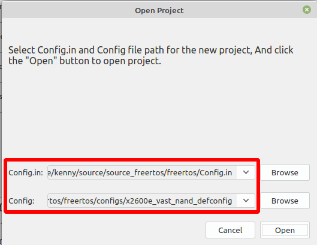


主配置选择：x2600e_vast_nand_defconfig


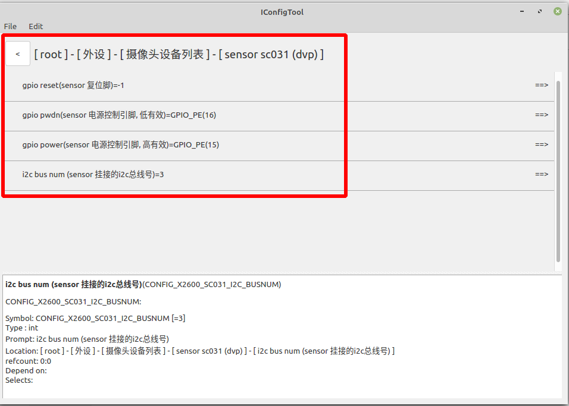

摄像头选择 sc031 ，相关的gpio 引脚根据自己的硬件原理图进行配置。


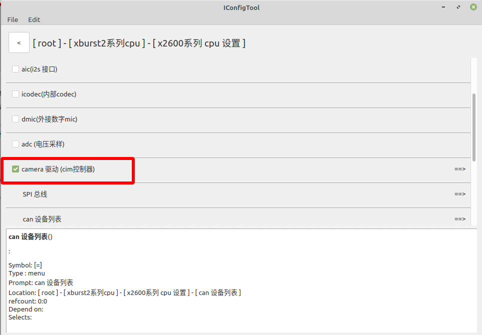

选择 camera 驱动(cim控制器)

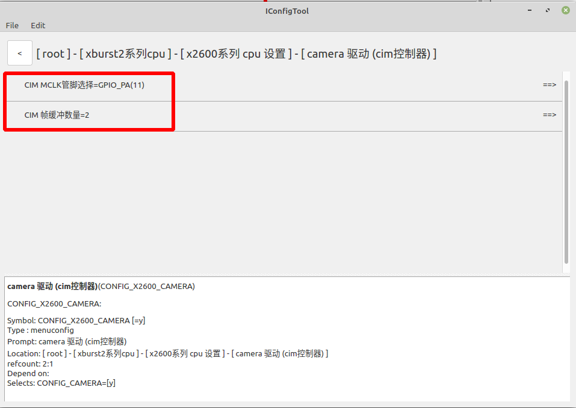

选择 camera 驱动(cim控制器)的 CIM MCLK管脚和缓冲数量，具体参考硬件设计原理图

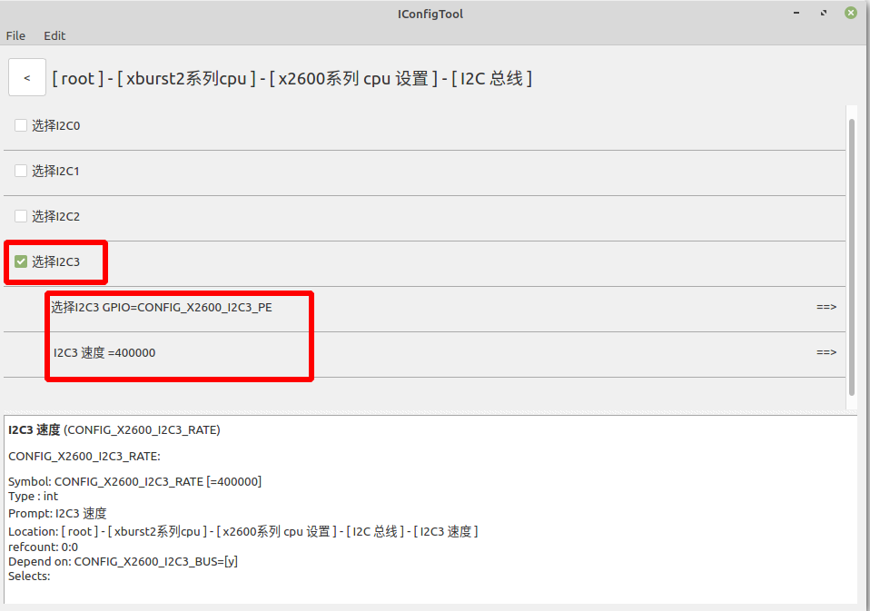

选择I2C总线，总线号跟 sensor sc031 驱动中的i2c bus num 相对应。


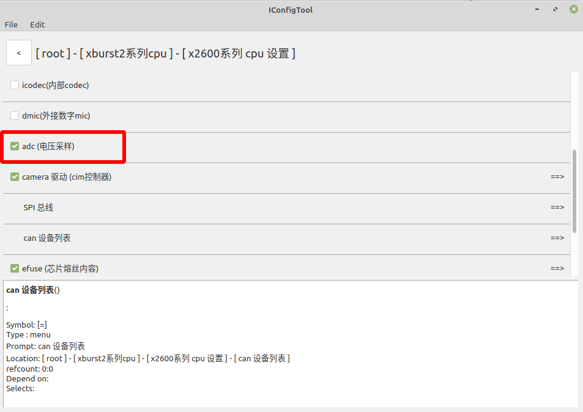

勾选adc(电压采样)


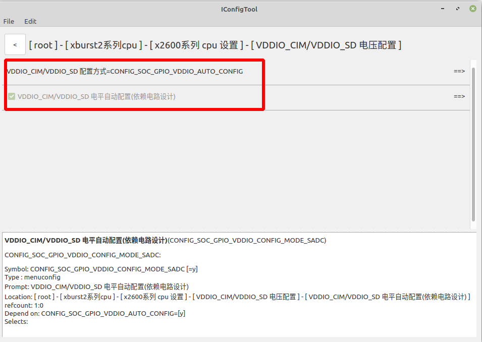

VDDIO_CIM/VDDIO_SD 配置方式选择自动 CONFIG_SOC_GPIO_VDDIO_AUTO_CONFIG，进入CONFIG_SOC_GPIO_VDDIO_AUTO_CONFIG选项如下：

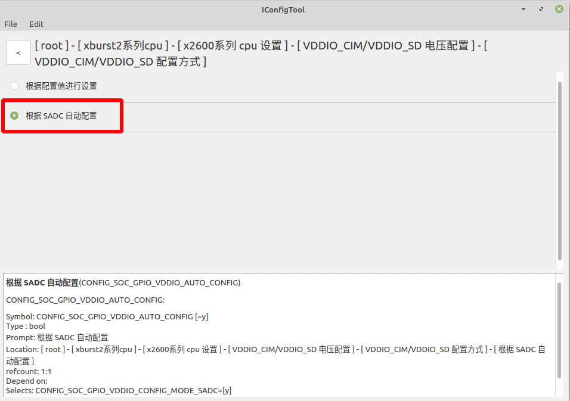

选择根据 SADC自动配置

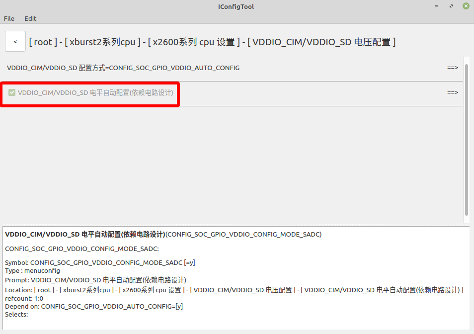

点击VDDIO_CIM/VDDIO_SD 电平自动配置(依赖电路设计)选项进入配置界面

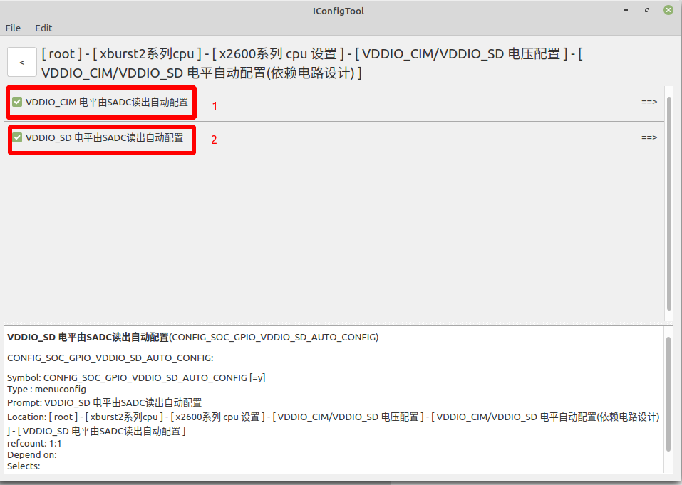

​											

点击上图 VDDIO_CIM 电平由SADC读出自动配置选项，进入 VDDIO_CIM 电平自动配置的电路界面，如下所示：

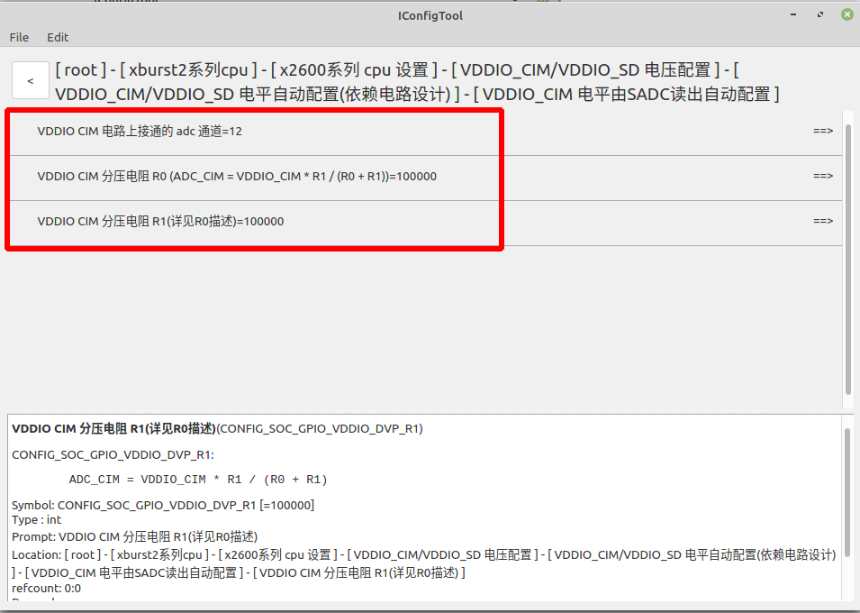


VDDIO CIM 电路上接通的 adc 通道选择 AUX12

VDDIO CIM 分压电阻 R0 (ADC_CIM = VDDIO_CIM * R1 / (R0 + R1)) 为100000 (100k Ω )

VDDIO CIM 分压电阻 R1(详见R0描述) 为 100000 (100k Ω)


点击上图 VDDIO_SD 电平由SADC读出自动配置选项，进入 VDDIO_SD 电平自动配置的电路界面，如下所示：

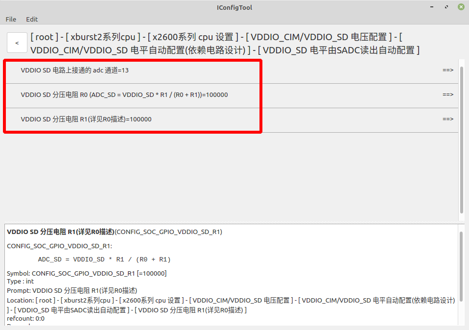

VDDIO SD 电路上接通的 adc 通道选择 AUX13

VDDIO SD 分压电阻 R0 (ADC_SD = VDDIO_SD * R1 / (R0 + R1)) 为100000 (100k Ω)

VDDIO SD 分压电阻 R1(详见R0描述) 为 100000 (100k Ω)


## 四  测试

由于 camera sc031 的是黑白的 Y8格，所以不支持本地预览。可以采用本地采集camera数据和电脑端uvc预览两种方式。

### 4.1  采集camera数据输出的方式

修改 vendor/vendor.c ，引用文件：  example/driver/camera_example.c  

vendor.c文件内容如下：

```shell
#include <stdio.h>

#include <../example/driver/camera_example.c>

void vendor_init(void)
{
    test_camera(0);//参数为0,是因为 x2600e 只有CIM,而CIM只能接一路camera,所以填0
    printf("vendor init...\n");
}
```

#### 4.1.1  camera_example.c 文件

example/driver/camera_example.c 文件内容如下：

```c++
#include <stdio.h>
#include <os.h>
#include <driver/camera.h>
#include <common.h>

//x2600只有一个CIM,所以参数填写为0
void test_camera(int index)
{
    struct camera_device *camera;
    struct camera_info *info;
    int ret;

    camera = camera_detect(index);
    if (!camera) {
        printf("camera not found\n");
        return;
    }

    info = camera_get_info(camera);
    assert(info);

    printf("camera found %s (%dx%d)\n", info->name, info->width, info->height);

    ret = camera_power_on(camera);
    if (ret < 0) {
        printf("camera failed to power on\n");
        return;
    }

    ret = camera_stream_on(camera);
    if (ret < 0) {
        printf("camera failed to stream on\n");
        camera_power_off(camera);
        return;
    }

    int retry_count = 0;

    while (1) {
        void *buf = camera_wait_frame(camera);
        if (buf == NULL) {
            camera_frame_error_type err = camera_get_frame_error(camera);
            printf("camera failed to get frame:%d\n", err);
            if (retry_count++ == 1) {
                printf("camera reset failed\n");
                camera_power_off(camera);
                return;
            }

            if (err == camera_error_dma_error) {
                camera_stream_off(camera);
                camera_stream_on(camera);
            } else {
                camera_power_off(camera);
                camera_power_on(camera);
                camera_stream_on(camera);
            }

            continue;
        }

        retry_count = 0;

        if (camera_fmt_is_NV12(info->data_fmt)) {
            printf("camera: frame:%p uv_buffer: %p\n", buf, buf + info->uv_data_offset);
        } else {
            printf("uv_buffer: %p\n", buf);
        }

        camera_put_frame(camera, buf);
    }
}
```


编译和烧录固件。然后开机，查看串口打印如下：

运行后串口信息如下：

```shell
[0.000000] xburst2 rtos @ Sep 20 2023 16:29:38, epc: 8002d248
[0.000072] gpio: VDDIO_CIM(PA00~PA11) = 1.8V
[0.000230] gpio: VDDIO_SD(PD00~PD05) = 3.3V
[0.002731] Supported Nand Flash, ATO25D1GA(9b:12)
[0.039437] stmmac - user ID: 0x20, Synopsys ID: 0x37
[0.039619]  Ring mode enabled
[0.039723]  DMA HW capability register supported Enhanced/Alternate descriptors
[0.039992] 	Enabled extended descriptors
[0.040133]  RX Checksum Offload Engine supported (type 2)
[0.040329]  TX Checksum insertion supported
[0.040480]  Enable RX Mitigation via HW Watchdog Timer
[0.142397] Found mac phy id 0x02430c54
[0.217682] sc031 get chip id = 0031
[0.235215] camera found sc031-dvp (640x480)   //识别到camera sc031
[0.267924] uv_buffer: 80850780
[0.276250] uv_buffer: 8089b780
[0.284579] uv_buffer: 808e6780
[0.292908] uv_buffer: 80850780
[0.301237] uv_buffer: 8089b780
[0.309565] uv_buffer: 808e6780
[0.317894] uv_buffer: 80850780
[0.326223] uv_buffer: 8089b780
[0.334552] uv_buffer: 808e6780
[0.342881] uv_buffer: 80850780
[0.351209] uv_buffer: 8089b780
[0.359538] uv_buffer: 808e6780
[0.367867] uv_buffer: 80850780
[0.376196] uv_buffer: 8089b780
[0.384525] uv_buffer: 808e6780
[0.392853] uv_buffer: 80850780
```

#### 4.1.2  camera.h 头文件介绍

freertos$ ls ./include/driver/camera.h 

```c++
#ifndef _CAMERA_H_
#define _CAMERA_H_
#include <driver/camera_pixel_format.h>

typedef enum {
    /*当前并未出错
     */
    camera_error_null,

    /* 等待帧数据时camera_stream_off被调用
     */
    camera_error_stream_is_off,
    
    /* 帧传输时dma出错，可能导致帧数据错位
     */
    camera_error_dma_error,
    
    /* 帧接收超时，其它原因导致
     */
    camera_error_timeout,

} camera_frame_error_type;

struct camera_info {
    char name[64];

    /* 每行像素数 */
    unsigned int width;
    
    /* 行数 */
    unsigned int height;
    
    /* camera 帧率 */
    unsigned int fps;
    
    /* camera 帧数据格式 */
    camera_pixel_fmt data_fmt;
    
    /* 一行的长度,单位字节
     * 对于 nv12,nv21, 表示y数据一行的长度
     * 另外由此可以算出uv数据偏移 line_length*height
     */
    unsigned int line_length;
    
    /* 一帧数据经过对齐之前的大小 */
    unsigned int frame_size;
    
    /* 帧缓冲总数 */
    unsigned int frame_nums;
    
    /* 帧缓冲的物理基地址 */
    unsigned long phys_mem;
    
    /* mmap 后的帧缓冲基地址 */
    void *mapped_mem;
    
    /*帧对齐大小 */
    unsigned int frame_align_size;

    /* 上面的结构体成员与 Linux 一致，下面的成员仅 RTOS 所有*/
  
    /* 诸如 NV12 等 planner 格式下, UV 数据在一帧中的偏移 */
    unsigned int uv_data_offset;
};

/* 图像帧信息 */
struct frame_info {
    unsigned int index;             /* 缓存编号 */
    unsigned int sequence;          /* 帧序列号 */

    unsigned int width;             /* 帧宽 */
    unsigned int height;            /* 帧高 */
    unsigned int pixfmt;            /* 帧的图像格式 */
    unsigned int size;              /* 帧所占用空间大小 */
    void *vaddr;                    /* 帧的虚拟地址 */
    unsigned long paddr;            /* 帧的物理地址 */
    
    unsigned long long timestamp;   /* 帧的时间戳，单位微秒，单调时间 */
    
    unsigned int isp_timestamp;     /* isp时间戳，在vic通过isp clk计数换算得出，单位微秒，
                                       最大值10000秒左右（最大值和isp clk相关），大于最大值重新清零计时 */
    unsigned int shutter_count;     /* 曝光计数 */

};

struct sensor_dbg_register {
    unsigned long long reg;
    unsigned long long val;
    unsigned int size;      /* val size, unit:byte */
};

struct camera_device;

/**
 * @brief camera 驱动初始化
 */
   void camera_init(void);

/**
 * @brief 探测第一个可用的 camera
 * @param index 选择控制器(仅X2000有效)
 * @return 非NULL : 成功    NULL: 失败, 一般是i2c 通信失败或者没有sensor注册
 */
   struct camera_device *camera_detect(int index);

/**
 * @brief 或者camera 信息
 * @param camera 由 camera_detect() 返回的指针
 * @return camera 信息
   */
   struct camera_info *camera_get_info(struct camera_device *camera);

/**
 * @brief 打开 camera 电源
 * @param camera 由 camera_detect() 返回的指针
 * @return 0 : 成功    < 0: 失败, 一般是i2c 通信失败
   */
   int camera_power_on(struct camera_device *camera);

/**
 * @brief 关闭 camera 电源
 * @param camera 由 camera_detect() 返回的指针
 */
   void camera_power_off(struct camera_device *camera)
/**

 * @brief 打开 camera 图像输出
 * @param camera 由 camera_detect() 返回的指针
 * @return 0 : 成功    < 0: 失败, 一般是i2c 通信失败
 */
   int camera_stream_on(struct camera_device *camera);

/**
 * @brief 关闭 camera 图像输出
 * @param camera 由 camera_detect() 返回的指针
 */
   void camera_stream_off(struct camera_device *camera);

/**
 * @brief 等待可用的帧
 * @param camera 由 camera_detect() 返回的指针
 * @return 非NULL: 帧的首地址  NULL: 表示失败,失败原因由camera_get_frame_error()得到
 */
   void *camera_wait_frame(struct camera_device *camera);

/**
 * @brief 获取camera 帧错误原因
 * @param camera 由 camera_detect() 返回的指针
 * @return camera 帧错误原因
 * camera_error_null 表示没有错误，其它表示出错 @see camera_frame_error_type
 */
   camera_frame_error_type camera_get_frame_error(struct camera_device *camera);

/**
 * @brief 等待可用的帧
 * @param camera 由 camera_detect() 返回的指针
 * @param frame 由 camera_wait_frame() 返回的指针
 */
   void camera_put_frame(struct camera_device *camera, void *frame);

/**
 * @brief 获取一帧录制的图像数据
 * @param camera 由 camera_detect() 返回的指针
 */
   void *camera_get_frame(struct camera_device *camera);

/**
 * @brief 等待可用的帧
 * @param camera 由 camera_detect() 返回的指针
 * @param frame 由 camera_wait_frame() 返回的指针
 */
   int camera_dqbuf(struct camera_device *camera, struct frame_info *frame);

/**
 * @brief 等待可用的帧
 * @param camera 由 camera_detect() 返回的指针
 * @param frame 由 camera_wait_frame() 返回的指针
 */
   int camera_dqbuf_wait(struct camera_device *camera, struct frame_info *frame);

/**
 * @brief 等待可用的帧
 * @param camera 由 camera_detect() 返回的指针
 * @param frame 由 camera_wait_frame() 返回的指针
 */
   int camera_qbuf(struct camera_device *camera, struct frame_info *frame);

/**
 * @brief 获取sensor寄存器
 * @param camera 由 camera_detect() 返回的指针
 * @return 成功返回0,失败返回负数
 */
   int camera_get_sensor_reg(struct camera_device *camera, struct sensor_dbg_register *reg);

/**

 * @brief 设置sensor寄存器
 * @param camera 由 camera_detect() 返回的指针
 * @return 成功返回0,失败返回负数
 */
   int camera_set_sensor_reg(struct camera_device *camera, struct sensor_dbg_register *reg);

/**

 * @brief 获取可用的帧数 (最大值由驱动frame buffer数量决定)
 * @param camera 由 camera_detect() 返回的指针
 * @return 可用的帧数
 */
   unsigned int camera_get_available_frame_count(struct camera_device *camera);

/**

 * @brief 跳过指定的可用帧,这样camera_wait_frame() 能拿到较新的帧
 * @param camera 由 camera_detect() 返回的指针
 */
   void camera_skip_frames(struct camera_device *camera, unsigned int frames);

/**

 * @brief 设置统计luminance区域(设置坐标). 目前仅X1600支持该功能
 * @param camera 由 camera_detect() 返回的指针
 * @param lumi_enable 使能/禁止统计区域luminance值功能
 * @param (x1, y1) 划分区域luminance第一个点坐标
 * @param (x2, y2) 划分区域luminance第二个点坐标
 * @return 是否支持该功能 < 0 设置区域失败/不支持统计luminance功能
 * = 0 设置区域成功
    *
 * x1        x2
 * |--------|--------|--------|
 * |  area0 |  area1 |  area2 |
 * y1 |--------|--------|--------|
 * |  area3 |  area4 |  area5 |
 * y2 |--------|--------|--------|
 * |  area6 |  area7 |  area8 |
 * |--------|--------|--------|
 */
   int camera_set_luminance_area(struct camera_device *camera, int lumi_enable, int x1, int y1, int x2, int y2);

/**

 * @brief 获取区域luminance区域总和值. 目前仅X1600支持该功能

 * @param camera 由 camera_detect() 返回的指针

 * @param frame 由 camera_wait_frame() 返回的指针

 * @param lumi 各区域内luminance的总和

 * @return 统计区域占内存大小

 * > 0, luminance统计值占用内存大小

 * = 0, 禁止/不支持luminance统计功能
 */
   int camera_get_luminance_area_total(struct camera_device *camera, void *frame, void *lumi);

#endif /* _CAMERA_H_ */
```

### 5.2 uvc预览的输出方式

#### 5.2.1  修改usb配置

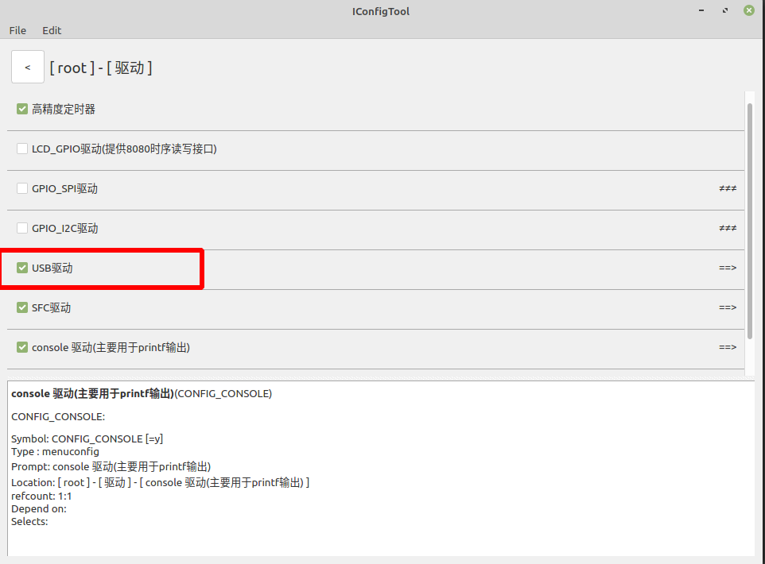

勾选usb驱动


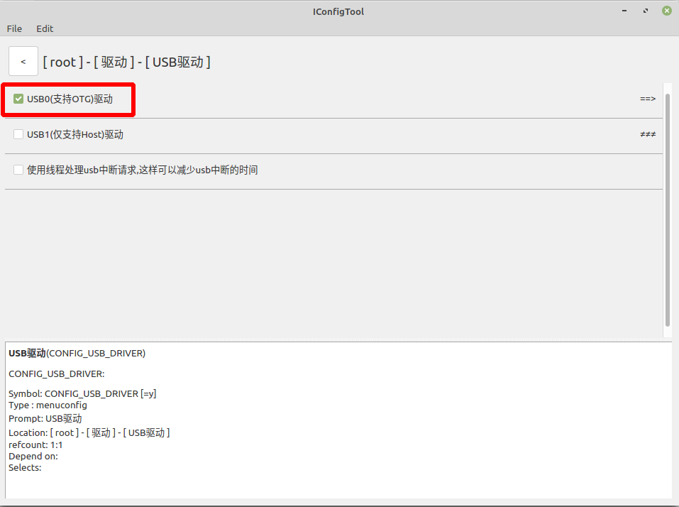

选择 USB0(支持OTG)驱动


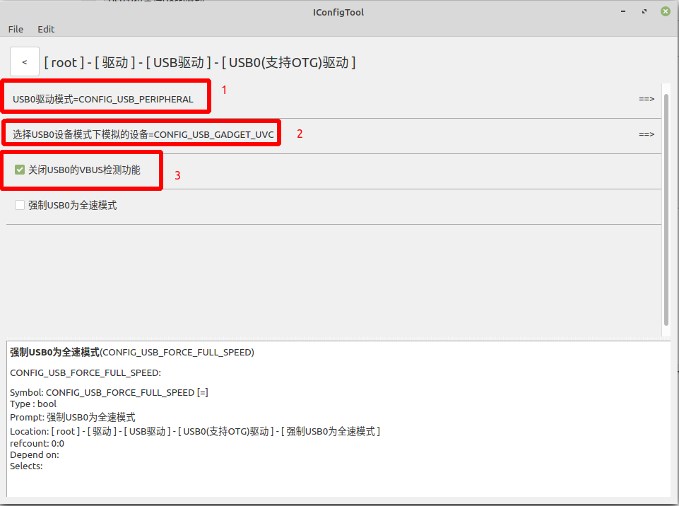


1： USB0驱动模式选择 CONFIG_USB_PERIPHERAL

2：选择USB0设备模式下模拟的设备为：CONFIG_USB_GADGET_UVC

3：勾选关闭USB0的VBUS检测功能


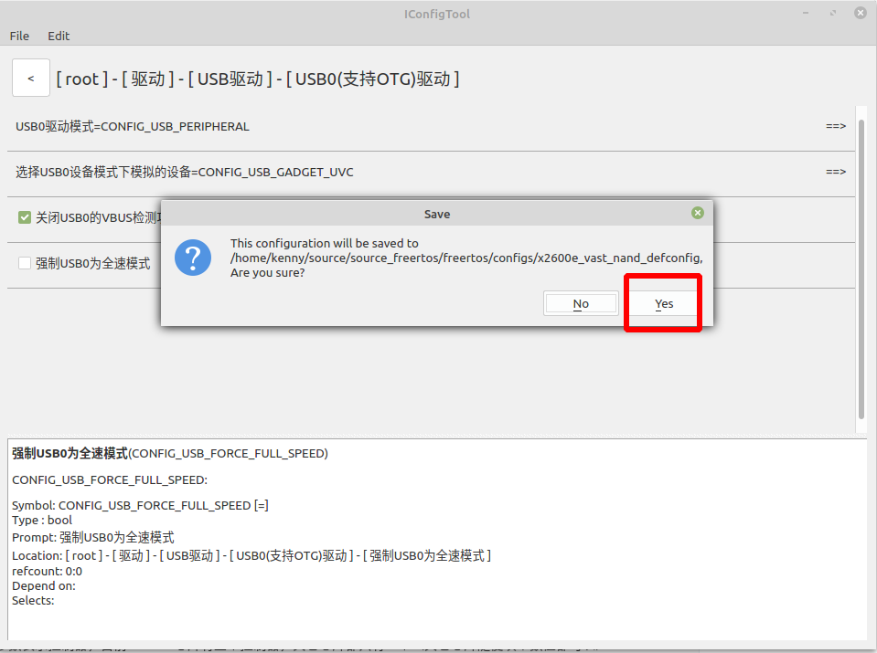


修改后保存配置  x2600e_vast_nand_defconfig 

#### 5.2.2  修改vendor.c文件

修改 vendor/vendor.c ，引用文件： example/usb/device/gadget_usb_uvc_with_camera.c

```shell
#include <stdio.h>
#include <../example/usb/device/gadget_usb_uvc_with_camera.c>

void vendor_init(void)
{
    gadget_usb_uvc_with_camera(0); //参数为0,是因为 x2600e 只有CIM,而CIM只能接一路camera,所以填0
    printf("vendor init...\n");
}
```

编译和烧录固件以后，插上电脑，使用guvcview软件进行预览即可。

example/usb/device/gadget_usb_uvc_with_camera.c 文件内容如下：

```c++
#include <common.h>
#include <os.h>
#include <usb/gadget_uvc.h>

#include <stdio.h>
#include <os.h>
#include <driver/camera.h>
#include <common.h>
#include <driver/cache.h>

#define WEBCAM_VENDOR_ID		0x1d6b	/* Linux Foundation */
#define WEBCAM_PRODUCT_ID		0x0102	/* Webcam A/V gadget */

static struct gadget_id usb_id = {
    .vendor_id = WEBCAM_VENDOR_ID,
    .product_id = WEBCAM_PRODUCT_ID,
};

static const unsigned int frame_fps[] = {
    20,
};

static struct uvc_frame_config uvc_frames[] = {
    {
        // .width = 1280,
        // .height = 720,
        .fps_num = ARRAY_SIZE(frame_fps),
        .frame_fps = frame_fps,
    },
};

static struct uvc_format_config uvc_frame_format[]= {
    {
        .fcc = V4L2_PIX_FMT_YUYV, // V4L2_PIX_FMT_GREY
        .bpp = 16, // 8
        .frames_num = ARRAY_SIZE(uvc_frames),
        .frames = uvc_frames,
    },
};

static struct uvc_device_config uvc_config = {
    .format_num = ARRAY_SIZE(uvc_frame_format),
    .formats = uvc_frame_format,
};

void bayer16_to_yuyv(void *_dst, void *_src, int xres, int yres)
{
    int len = xres * yres;
    unsigned char *src = _src + 1;
    unsigned char *dst = _dst;

    int i = len / 16;
    while (i--) {
        unsigned char s0 = src[0*2];
        unsigned char s1 = src[1*2];
        unsigned char s2 = src[2*2];
        unsigned char s3 = src[3*2];
        unsigned char s4 = src[4*2];
        unsigned char s5 = src[5*2];
        unsigned char s6 = src[6*2];
        unsigned char s7 = src[7*2];
        unsigned char s8 = src[8*2];
        unsigned char s9 = src[9*2];
        unsigned char s10 = src[10*2];
        unsigned char s11 = src[11*2];
        unsigned char s12 = src[12*2];
        unsigned char s13 = src[13*2];
        unsigned char s14 = src[14*2];
        unsigned char s15 = src[15*2];

        dst[0*2] = s0;
        dst[0*2+1] = 0x80;
        dst[1*2] = s1;
        dst[1*2+1] = 0x80;
        dst[2*2] = s2;
        dst[2*2+1] = 0x80;
        dst[3*2] = s3;
        dst[3*2+1] = 0x80;
        dst[4*2] = s4;
        dst[4*2+1] = 0x80;
        dst[5*2] = s5;
        dst[5*2+1] = 0x80;
        dst[6*2] = s6;
        dst[6*2+1] = 0x80;
        dst[7*2] = s7;
        dst[7*2+1] = 0x80;
        dst[8*2] = s8;
        dst[8*2+1] = 0x80;
        dst[9*2] = s9;
        dst[9*2+1] = 0x80;
        dst[10*2] = s10;
        dst[10*2+1] = 0x80;
        dst[11*2] = s11;
        dst[11*2+1] = 0x80;
        dst[12*2] = s12;
        dst[12*2+1] = 0x80;
        dst[13*2] = s13;
        dst[13*2+1] = 0x80;
        dst[14*2] = s14;
        dst[14*2+1] = 0x80;
        dst[15*2] = s15;
        dst[15*2+1] = 0x80;

        src += 32;
        dst += 32;
    }
}

void bayer16_to_bayer8(void *_dst, void *_src, int xres, int yres)
{
    int len = xres * yres;
    unsigned char *src = _src + 1;
    unsigned char *dst = _dst;

    int i = len / 16;
    while (i--) {
        unsigned char s0 = src[0*2];
        unsigned char s1 = src[1*2];
        unsigned char s2 = src[2*2];
        unsigned char s3 = src[3*2];
        unsigned char s4 = src[4*2];
        unsigned char s5 = src[5*2];
        unsigned char s6 = src[6*2];
        unsigned char s7 = src[7*2];
        unsigned char s8 = src[8*2];
        unsigned char s9 = src[9*2];
        unsigned char s10 = src[10*2];
        unsigned char s11 = src[11*2];
        unsigned char s12 = src[12*2];
        unsigned char s13 = src[13*2];
        unsigned char s14 = src[14*2];
        unsigned char s15 = src[15*2];

        dst[0] = s0;
        dst[1] = s1;
        dst[2] = s2;
        dst[3] = s3;
        dst[4] = s4;
        dst[5] = s5;
        dst[6] = s6;
        dst[7] = s7;
        dst[8] = s8;
        dst[9] = s9;
        dst[10] = s10;
        dst[11] = s11;
        dst[12] = s12;
        dst[13] = s13;
        dst[14] = s14;
        dst[15] = s15;

        src += 32;
        dst += 16;
    }
}

void grey_to_yuyv(void *_dst, void *_src, int xres, int yres)
{
    int len = xres * yres;
    unsigned char *src = _src + 1;
    unsigned char *dst = _dst;

    int i = len / 16;
    while (i--) {
        unsigned char s0 = src[0];
        unsigned char s1 = src[1];
        unsigned char s2 = src[2];
        unsigned char s3 = src[3];
        unsigned char s4 = src[4];
        unsigned char s5 = src[5];
        unsigned char s6 = src[6];
        unsigned char s7 = src[7];
        unsigned char s8 = src[8];
        unsigned char s9 = src[9];
        unsigned char s10 = src[10];
        unsigned char s11 = src[11];
        unsigned char s12 = src[12];
        unsigned char s13 = src[13];
        unsigned char s14 = src[14];
        unsigned char s15 = src[15];

        dst[0 * 2 + 0] = s0;
        dst[0 * 2 + 1] = 128;
        dst[1 * 2 + 0] = s1;
        dst[1 * 2 + 1] = 128;
        dst[2 * 2 + 0] = s2;
        dst[2 * 2 + 1] = 128;
        dst[3 * 2 + 0] = s3;
        dst[3 * 2 + 1] = 128;
        dst[4 * 2 + 0] = s4;
        dst[4 * 2 + 1] = 128;
        dst[5 * 2 + 0] = s5;
        dst[5 * 2 + 1] = 128;
        dst[6 * 2 + 0] = s6;
        dst[6 * 2 + 1] = 128;
        dst[7 * 2 + 0] = s7;
        dst[7 * 2 + 1] = 128;
        dst[8 * 2 + 0] = s8;
        dst[8 * 2 + 1] = 128;
        dst[9 * 2 + 0] = s9;
        dst[9 * 2 + 1] = 128;
        dst[10 * 2 + 0] = s10;
        dst[10 * 2 + 1] = 128;
        dst[11 * 2 + 0] = s11;
        dst[11 * 2 + 1] = 128;
        dst[12 * 2 + 0] = s12;
        dst[12 * 2 + 1] = 128;
        dst[13 * 2 + 0] = s13;
        dst[13 * 2 + 1] = 128;
        dst[14 * 2 + 0] = s14;
        dst[14 * 2 + 1] = 128;
        dst[15 * 2 + 0] = s15;
        dst[15 * 2 + 1] = 128;

        src += 16;
        dst += 32;
    }
}

static unsigned char uvc_stream_on;
static unsigned char uvc_buf_use;
static thread_ptr_t uvc_thread;

struct camera_device *camera;
struct camera_info *camera_info;
static volatile int format_width;
static int camera_width;
static int camera_height;
static int src_is_bayer16;
static int dest_is_bayer16;
static int src_is_grey;
static int dest_is_grey;
static int dest_is_yuyv;

static void uvc_connect_callback(int connect)
{
    printf("uvc_connect_callback %d\n", connect);
}

static void uvc_format_callback(const struct uvc_video_format *format)
{
    char *data = (char *)&format->fcc;
    format_width = format->width;
    printf("uvc format: %c%c%c%c, width %d, height %d, fps %d\n", data[0], data[1], data[2], data[3], format->width,  format->height,  format->fps);
}

static int uvc_stream_callback(int enable)
{
    printf("uvc_stream_callback %d\n", enable);
    uvc_stream_on = enable;
    if (enable)
        thread_wakeup(uvc_thread);

    return 0;
}

static void uvc_buf_complete(struct uvc_buffer *buf)
{
    if (buf->state != UVC_BUF_STATE_DONE)
        printf("%s: data not transmitted\n", __func__);

    uvc_buf_use = 0;
    thread_wakeup(uvc_thread);
}

static int camera_is_on = 0;

static int power_on_m_camera(void)
{
    int ret;

    if (camera_is_on)
        return 0;

    ret = camera_power_on(camera);
    if (ret < 0) {
        printf("camera failed to power on\n");
        return ret;
    }

    ret = camera_stream_on(camera);
    if (ret < 0) {
        printf("camera failed to stream on\n");
        camera_power_off(camera);
        return ret;
    }

    camera_is_on = 1;

    return 0;
}

static void power_off_m_camera(void)
{
    if (!camera_is_on)
        return;

    camera_stream_off(camera);
    camera_power_off(camera);
    camera_is_on = 0;
}

static void usb_gadget_uvc_thread(void *data)
{
    int ret;
    void *mem;
    struct uvc_buffer uvc_buf;
    uvc_buf.complete = uvc_buf_complete;
    uvc_buf.mem = NULL;

    void *yuyv_mem = NULL;

    if (src_is_grey && dest_is_yuyv) {
        yuyv_mem = malloc(camera_width*camera_height*2);
        assert(yuyv_mem);
    }

    while (1) {
        thread_wait();

        if (uvc_stream_on) {
            if (power_on_m_camera())
                continue;

            while (uvc_stream_on)
            {
                while (uvc_buf_use)
                    thread_wait();

                if (uvc_buf.mem && !yuyv_mem) {
                    camera_put_frame(camera, (void *)uvc_buf.mem);
                    uvc_buf.mem = NULL;
                }

                if (!uvc_stream_on)
                    break;

                mem = camera_wait_frame(camera);
                if (mem == NULL) {
                    camera_frame_error_type err = camera_get_frame_error(camera);
                    printf("failed to get frame: %d\n", err);
                    if (err == camera_error_dma_error) {
                        camera_stream_off(camera);
                        camera_stream_on(camera);
                    } else {
                        camera_power_off(camera);
                        camera_power_on(camera);
                    }
                    continue;
                }
                if (src_is_bayer16 && dest_is_yuyv)
                    bayer16_to_yuyv(mem, mem, camera_width, camera_height);

                if (src_is_bayer16 && dest_is_grey)
                    bayer16_to_bayer8(mem, mem, camera_width, camera_height);

                if (src_is_grey && dest_is_yuyv)
                    grey_to_yuyv(yuyv_mem, mem, camera_width, camera_height);

                if (!uvc_stream_on) {
                    camera_put_frame(camera, mem);
                    break;
                }

                int bpp = dest_is_yuyv ? 16 : 8;
                uvc_buf.mem = yuyv_mem ? yuyv_mem : mem;
                uvc_buf.length = format_width * camera_height * bpp/8;
                uvc_buf_use = 1;
                ret = gadget_uvc_write(&uvc_buf, 0, 0);
                if (ret < 0) {
                    uvc_buf_use = 0;
                    uvc_buf.mem = NULL;
                    camera_put_frame(camera, mem);
                }

                if (yuyv_mem)
                    camera_put_frame(camera, mem);
            }

            power_off_m_camera();
        }
    }
}

struct uvc_callback callback = {
    .format_cb = uvc_format_callback,
    .stream_cb = uvc_stream_callback,
    .connect_cb = uvc_connect_callback,
};

int gadget_usb_uvc_with_camera(int index)
{
    camera = camera_detect(index);
    if (!camera) {
        printf("camera not found\n");
        return 0;
    }

    camera_info = camera_get_info(camera);
    assert(camera_info);

    printf("camera found %s (%dx%d) %d\n",
         camera_info->name, camera_info->width, camera_info->height, camera_info->frame_align_size);

    camera_width = camera_info->width;
    camera_height = camera_info->height;

    switch (camera_info->data_fmt) {
    case CAMERA_PIX_FMT_SBGGR16:
    case CAMERA_PIX_FMT_SGBRG16:
    case CAMERA_PIX_FMT_SGRBG16:
    case CAMERA_PIX_FMT_SRGGB16:
        src_is_bayer16 = 1;
        dest_is_yuyv = 1; // 或者 dest_is_grey = 1, 查看 grey 数据, 注意windows工具不能看grey
        break;
    case CAMERA_PIX_FMT_YUYV:
    case CAMERA_PIX_FMT_YYUV:
    case CAMERA_PIX_FMT_YVYU:
    case CAMERA_PIX_FMT_UYVY:
    case CAMERA_PIX_FMT_VYUY:
        dest_is_yuyv = 1;
        break;
    case CAMERA_PIX_FMT_GREY:
        src_is_grey = 1;
        dest_is_yuyv = 1; // 或者 dest_is_grey = 1, 查看 grey 数据, 注意windows工具不能看grey
        break;
    default:
        panic("this format currently not support: 0x%x\n", camera_info->data_fmt);
    }

    uvc_frames[0].width = camera_width;
    uvc_frames[0].height = camera_height;

    if (!dest_is_yuyv) {
        uvc_frame_format[0].fcc = V4L2_PIX_FMT_GREY;
        uvc_frame_format[0].bpp = 8;
    } else {
        uvc_frame_format[0].fcc = V4L2_PIX_FMT_YUYV;
        uvc_frame_format[0].bpp = 16;
    }

    gadget_uvc_init(&usb_id, &uvc_config, &callback);

    uvc_thread = thread_create("usb gadget uvc thread", 8192, usb_gadget_uvc_thread, NULL);

    return 0;
}
```


#### 5.2.3 gadget_uvc.h 头文件

freertos$ ls include/usb/gadget_uvc.h

```c
#ifndef _GADGET_UVC_H_
#define _GADGET_UVC_H_

#include <common.h>
#include "gadget_common.h"
#include "uvc.h"

#ifdef CONFIG_USB_GADGET_UVC

#define UVC_ENTITY_INTERFACE_ID                0x00
#define UVC_ENTITY_CAMERA_TERMINAL_ID        0x01
#define UVC_ENTITY_PROCESS_UNIT_ID            0x02
#define UVC_ENTITY_OUTPUT_TERMINAL_ID        0x03

struct uvc_frame_config
{
    unsigned int width;
    unsigned int height;
    unsigned int fps_num;
    const unsigned int *frame_fps;
};

struct uvc_format_config
{
    unsigned int fcc;
    unsigned int bpp;
    unsigned int frames_num;
    const struct uvc_frame_config *frames;
};

struct uvc_device_config
{
    unsigned int format_num;
    unsigned int camera_feature_config;
    unsigned int camera_param_config;
    const struct uvc_format_config *formats;
};

struct uvc_control_request
{
    void* buf;
    unsigned int buf_actual;
    unsigned char request;
    unsigned int request_len;
    unsigned char entity_id;
    unsigned char control_selector;
    unsigned char event_out;
};

typedef void (*format_callback_t)(const struct uvc_video_format *format);
typedef int (*stream_callback_t)(int enable);
typedef int (*fparam_callback_t)(const struct uvc_control_request *req);

struct uvc_callback
{
    format_callback_t format_cb;
    stream_callback_t stream_cb;
    connect_callback_t connect_cb;
    fparam_callback_t param_cb;
};

/*
 uvc init 
    param:
        <id>  Manufacturer's device ID 
        <config> uvc device config
        <callback> uvc function callback
    return:
        <normal> 0
        <abnormal> Error code 
 */
extern void gadget_uvc_init(const struct gadget_id *id, const struct uvc_device_config *config,
                    const struct uvc_callback* callback);

/* uvc device cleanup */
extern void gadget_uvc_cleanup(void);

/*
 UVC write data
    param:
        <buf>  Buffer for writing data 
        <block> Is it blocked 
        <timeout_ms> Block timeout
    return:
        <normal> 0
        <abnormal> Error code 
 */
extern int gadget_uvc_write(struct uvc_buffer *buf, uint8_t block, uint32_t timeout_ms);

/*
   Get UVC Connection Status 
    return:
        <normal> Connection Status
        <abnormal> Error code 
 */
extern int gadget_uvc_get_connect_status(void);

/*
   Waiting for UVC link 
    param:
        <timeout_ms> Block timeout
    return:
        <normal> 0
        <abnormal> Error code 
 */
extern int gadget_uvc_wait_connect(uint32_t timeout_ms);

/*
   Waiting for UVC stream on 
    param:
        <timeout_ms> Block timeout
        <format> UVC video format
    return:
        <normal> 0
        <abnormal> Error code 
 */
extern int gadget_uvc_wait_stream(uint32_t timeout_ms, struct uvc_video_format *format);
#endif

#endif /* _GADGET_UVC_H_ */
```

## 六  工程编译和烧录

### 6.1 工程编译

编译命令如下：

```shell
cd freertos/

$ source build/envsetup.sh

$ make x2600e_vast_nand_defconfig

$ make
```


### 6.2 工程烧录

烧录工具配置如下：

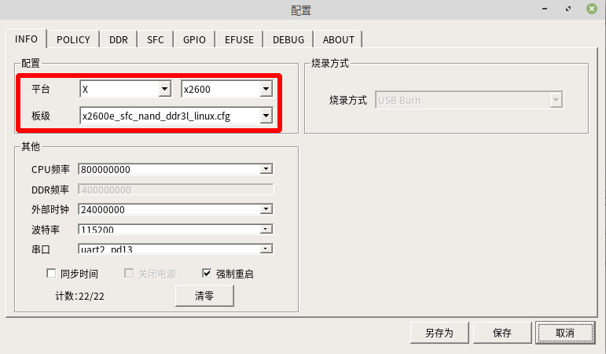

 平台选择： x2600

板级选择：x2600e_sfc_nand_ddr3l_linux.cfg


烧录的文件选择：freertos/rtos-with-spl.bin 

label的名称要与 SFC 中分区信息的Partition name 一致。


保持默认就可以。


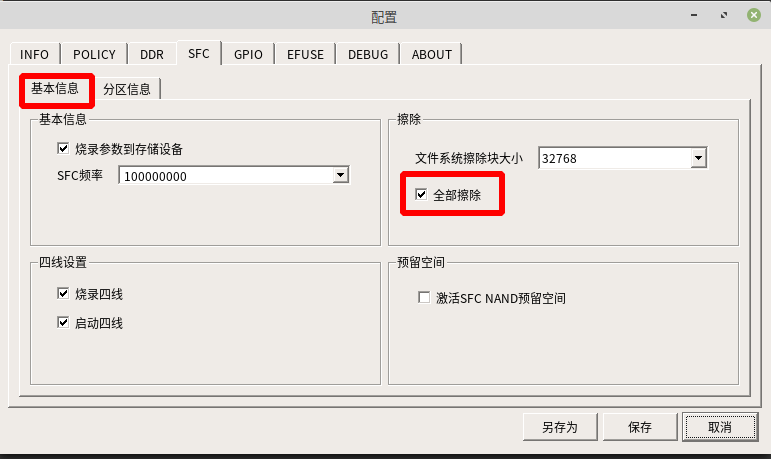


第一次烧录需要勾选全部擦除。


Partition name 为 freertos ，这里的名称可以修改

Manage mode选择 MTD_MODE


保存烧录工具配置以后，点击开始进行烧录。先按住开发板BOOT_KEY键不放，然后按下RST_KEY按键以后，进入烧录模式，烧录成功的界面如下：


