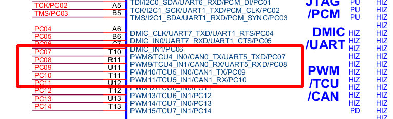
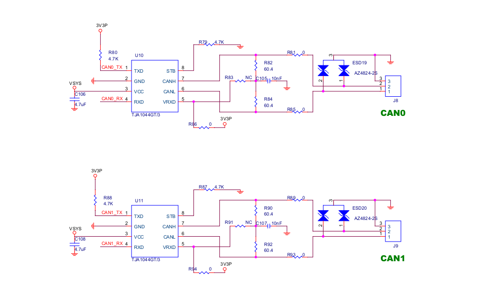
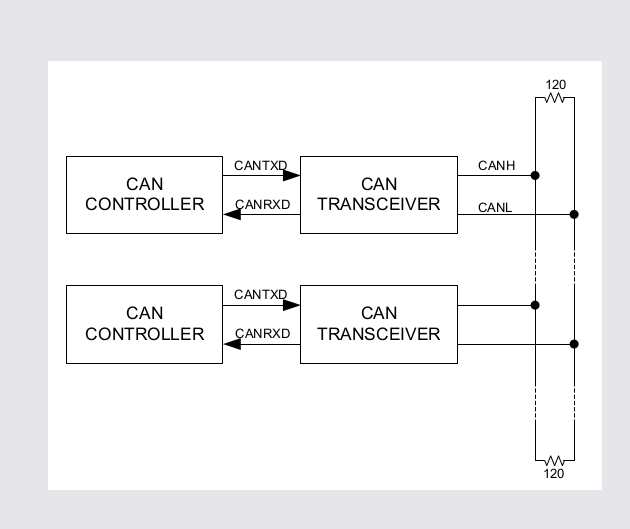
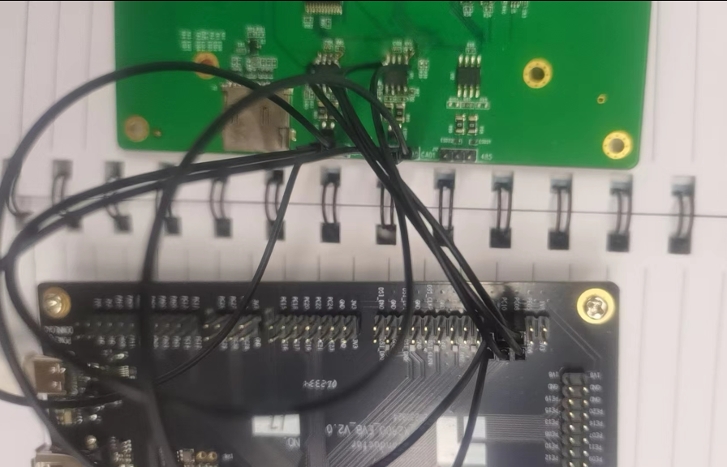
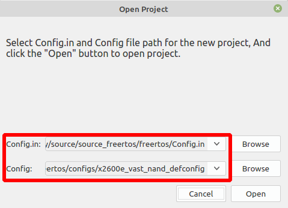
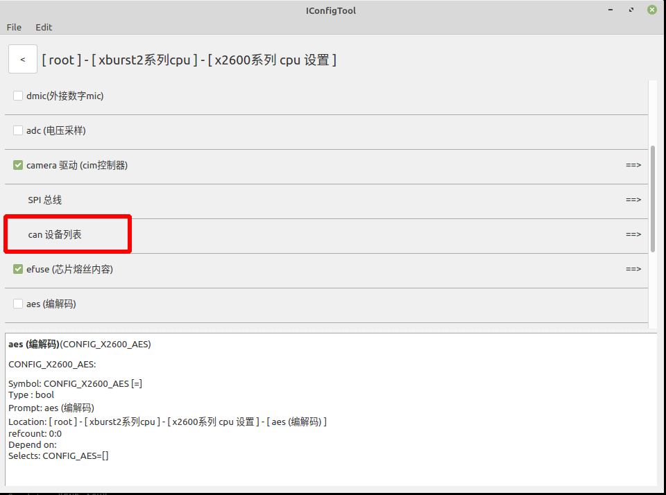
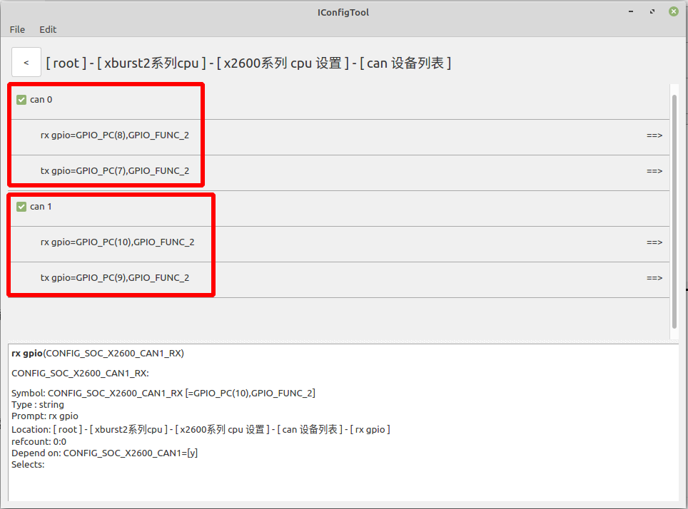
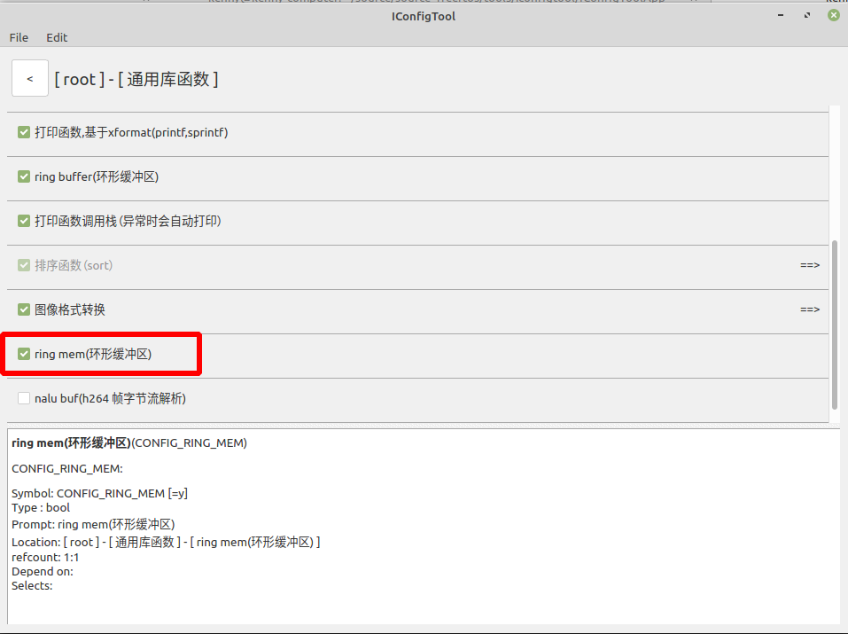
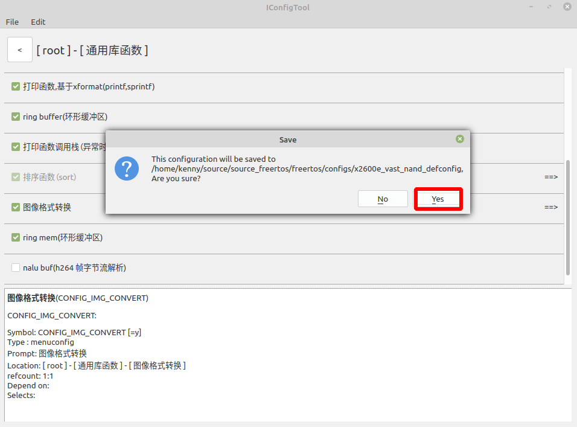

# FreeRTOS_X2600e CAN 使用说明

## 一  硬件环境

该文档使用的开发板为：PD_X2600_EVB_V2.0 针板， 芯片为X2600E。CAN芯片使用的开发板为：RD_X1600_PANDA_V1.1 针板。

## 二  X2600e CAN 概述

​        控制器局域网CAN( Controller Area Network)属于现场总线的范畴，是一种有效支持分布式控制系统的串行通信网络。 CAN 2.0B IP是一个独立的控制器局域网（CAN）协议控制器。它支持CAN 2.0B 标准，最大比特率为1Mb/s。它能够发送和接收标准和扩展消息帧。它包括双缓冲发送缓冲器和64字节接收FIFO，具有4个ID接受过滤和消息管理功能。MCU通信通过AHB-Lite和DMA功能实现。

### 2.1  CAN 特性

​       CAN的特性如下：

  1:  支持ISO-11898-1:2003中的CAN 2.0B协议 

  2:  仲裁比特率高达1Mbps 

  3:  支持CAN 2.0A标准11位和CAN 2.0B扩展29位ID 

  4:  8字节传输双缓冲区 

  5:  内置4字节SRAM作为接收FIFO，最多可接收4个帧 

  6:  四个接收接受ID过滤器和掩码 

  7:  总线错误处理和自动恢复 

  8:  仅侦听模式 

  9:  自检模式 

10:  自循环测试模式

### 2.2  CAN 介绍

​        控制器局域网(CAN)是一种允许多主机的串行异步总线通信。CAN总线使用具有最大数据速率的单端双绞线 1 mbps。公共汽车的典型长度可达40米。CAN的一个不同寻常的方面协议是基于消息的。总线上的节点没有特定的地址消息具有唯一标识符，用于确定其优先级。每个节点根据它的功能传输特定类型的消息，并响应具体的相关消息。CAN在连接电子控制模块时尤其流行，传感器、执行器因其母线结构简单而在汽车和工业中得到应用以及广泛的错误检查带来的容错能力。
典型CAN总线的物理介质是两端端接120欧姆的双绞线。双绞线有两个信号，CANH和CANL。CANH和CANL形成5V伪线因此差分信号即使在高噪声环境下也能可靠传输。在那里是总线上两种可能的逻辑状态。主状态(逻辑0)是CANH处于活动状态时的状态CANL主动拉至0V。隐性状态(逻辑1)是当总线不在时主动驱动，CANH和CANL都被终端电阻拉向2.5V。母线还表现出“线与”特性，即母线处于隐性状态节点是隐性的，如果一个或多个节点是显性的，则总线处于显性状态。因为由于这种伪差分特性，即使其中一条线路损坏，也可以保持正确的数据传输。为了驱动CAN总线，通常使用外部收发器来提供隔离驱动。详细介绍可以看我们的芯片手册。

### 2.3  CAN测试的目的、原理、方法

  rtos 中 can 测试的目的是为了熟悉 can 接口的用法，并且验证使用 can 进行设备之间的正常通讯。原理是利用 can 设备之间互相收发帧。测试方法: 使用 can 设备硬件连接进行通讯。


## 三 测试硬件环境搭建

   由于开发板 PD_X2600_EVB_V2.0针板没有CAN芯片，开发板 RD_X1600_PANDA_V1.1 针板含有CAN芯片。所以让开发板 PD_X2600_EVB_V2.0针板使用开发板 RD_X1600_PANDA_V1.1 针板的CAN芯片进行测试。

开发板 PD_X2600_EVB_V2.0针板CAN的原理图如下：




开发板 RD_X1600_PANDA_V1.1 针板CAN原理图如下：



具体链接方法如下：



​        X2600系列含两个CAN控制器 CAN0和CAN1，连接方式：将芯片端CAN控制器的tx连接到can收发器tx，CAN控制器的rx连接到can收发器的rx端，两个CAN收发器CANH和CANH相连，CANL和CANL相连。

链接好以后的板子图片如下：




## 四  工程配置

RTOS使用的配置文件为：x2600e_vast_nand_defconfig

使用 IConfigTool  工具打开配置。




主配置选择：x2600e_vast_nand_defconfig



选择 can 设备列表





选择can0和can1，并且配置相关gpio





勾选 ring mem(环形缓冲区)，缓存can接收到的帧(包括帧 类型 模式 和 数据)



点击保存配置。

## 五 测试程序添加

修改 vendor/vendor.c ，引用文件： example/driver/can_example.c

vendor.c文件内容如下：

```c++
#include <stdio.h>
#include <../example/driver/can_example.c>  

void vendor_init(void)
{
    can_test();  // 调用can_test() 函数 进行can的测试。
    printf("vendor init...\n");
}
```

example/driver/can_example.c 文件内容如下：

```c++
#include <stdio.h>
#include <string.h>
#include <os.h>
#include <delay.h>
#include <driver/can.h>

/**
 * 以x2600e芯片 PD_X2600_EVB_V1.0 针板为例
 * 将 can0 和 can1 分别连接 can收发器 芯片, 再分别连接两芯片输出端差分电平(高接高, 低接低)
 * 至此 can0 与 can1 形成通路, 可进行通讯
 *
 * 本示例代码为 can0 向 can1 发送数据, 且接收其回复的数据是否匹配
 */

struct can_config cfg0 = {
    .bus_id = 0,
    .bus_rate = CAN_BUS_RATE_500000,
    /* 不使用 rx dma 模式接收数据, 使用中断模式 */
    // .rx_dma_mode = 1,
    .rx_bufsize = 256,
};

struct can_config cfg1 = {
    .bus_id = 1,
    .bus_rate = CAN_BUS_RATE_500000,
    /* 使用 rx dma 模式接收数据 */
    .rx_dma_mode = 1,
    .rx_bufsize = 256,
};

void can_msg_dump(struct can_msg *msg, int busid)
{
    if (busid)
        printf("--- ");
    printf("id: %d - %s - %s - id: 0x%02x, len: %d, data: \"%s\"\n", busid,
        (msg->flags & CAN_EXTENDED) ? "extended" : "standard",
        (msg->flags & CAN_REMOTE) ? "remote" : "data",
        msg->frm_id, msg->len, (char*)msg->buf);
}

int can_send_msg(struct can_config *cfg, int id, unsigned char *buf, int len, int flag)
{
    struct can_msg tmsg;
    tmsg.frm_id = id;
    tmsg.len = len > 8 ? 8 : len;
    memcpy(tmsg.buf, buf, tmsg.len);
    tmsg.flags = flag;

    return can_send_frame(cfg, &tmsg);
}

int can_receive_msg(struct can_config *cfg, struct can_msg *rmsg)
{
    memset(rmsg->buf, 0, sizeof(rmsg->buf));

    return can_receive_frame(cfg, rmsg);
}

void can_test1(void *data)
{
    struct can_msg rmsg;
    can_start(&cfg0);
    struct can_filter_cfg af_cfg[4] = {0};
    af_cfg[2].is_enable = 1;
    af_cfg[2].afid = 0x88;
    can_set_acceptance_filter(&cfg0, af_cfg);

    int ret = 0;
    int t = 8;
    int flag = CAN_EXTENDED;
    unsigned char *rp = NULL;
    while (t--) {
        if (t == 0)
            flag = CAN_REMOTE;/* 最后一轮发送远程帧 请求数据 */
        else
            flag = !flag;/* 交替发送 标准 和 扩展帧 */

        int len = sizeof("Hello");
        ret = can_send_msg(&cfg0, 0x88, (unsigned char *)"Hello", len, flag);
        if (ret < 0)
            break;

        ret = can_receive_msg(&cfg0, &rmsg);
        if (ret < 0)
            break;

        can_msg_dump(&rmsg, 0);

        if (t == 0)
            rp = (unsigned char *)"END_ACK";
        else
            rp = (unsigned char *)"World!";

        if (strncmp((const char *)rp, (const char *)rmsg.buf, 8)) {
            printf("err: receive is not match with send!\n");
            break;
        }
    }

    can_stop(&cfg0);
    printf("test1 done!\n");
}

void can_test2(void *data)
{
    struct can_msg rmsg;
    unsigned char *tbuf;
    int tflag = 0, tlen = 0;
    can_start(&cfg1);

    int ret = 0;
    int t = 8;
    while (t--) {
        ret = can_receive_msg(&cfg1, &rmsg);
        if (ret < 0)
            break;

        can_msg_dump(&rmsg, 1);

        if (rmsg.flags & CAN_REMOTE) {
            tbuf = (unsigned char *)"END_ACK";
            tflag = rmsg.flags & ~CAN_REMOTE;
        } else {
            if (!strncmp((const char *)"Hello", (const char *)rmsg.buf, 8))
                tbuf = (unsigned char *)"World!";
            else
                tbuf = rmsg.buf;
            tflag = rmsg.flags;
        }
        tlen = strlen((const char *)tbuf) + 1;

        /* 回复 与接收到的帧 相同类型和ID 的 数据帧 */
        ret = can_send_msg(&cfg1, rmsg.frm_id, tbuf, tlen, tflag);
        if (ret < 0)
            break;
    }

    can_start(&cfg1);
    printf("test2 done!\n");
}

void can_test(void)
{
    thread_create("cantest0", 4096, can_test1, NULL);
    thread_create("cantest1", 4096, can_test2, NULL);
}
```


## 六  编译和烧录

### 6.1 工程编译

编译命令如下：

```shell
cd freertos/

$ source build/envsetup.sh

$ make x2600e_vast_nand_defconfig

$ make
```


### 6.2 工程烧录

烧录工具配置如下：


 平台选择： x2600

板级选择：x2600e_sfc_nand_ddr3l_linux.cfg


烧录的文件选择：freertos/rtos-with-spl.bin 

label的名称要与 SFC 中分区信息的Partition name 一致。


保持默认就可以。


第一次烧录需要勾选全部擦除。


Partition name 为 freertos ,这个名称可以修改。

Manage mode选择 MTD_MODE


保存烧录工具配置以后，点击开始进行烧录。先按住开发板 BOOT 键不放，然后按下 RST 按键以后，进入烧录模式，烧录成功的界面如下：


## 七  测试结果分析

编译和烧录固件以后，然后开机。

运行后串口信息如下:

```shell
U-Boot SPL 2013.07-00019-g3f9f8dbc1-dirty (Aug 10 2023 - 14:09:33)
ERROR EPC 800355d4
---- size: 7
clk prepare done !!
CPA_CPAPCR:0320490d
CPM_CPMPCR:04b0490d
CPM_CPEPCR:0190510d
CPM_CPCCR:9a0b5510
DDR: W632GU6QG-11 type is : DDR3
DDRP_INNOPHY_PLL_FBDIV_50	0x00000000
DDRP_INNOPHY_PLL_FBDIV_H_51	0x00000086
DDRP_INNOPHY_PLL_CTRL_53	0x00000020
DDRP_INNOPHY_PLL_PDIV_52	0x00000041
DDRP_INNOPHY_PLL_LOCK_60	0x00000016
DDRP_INNOPHY_PU_DRV_CMD:  0000000e
DDRP_INNOPHY_PU_DRV_DQ7_0: 00000014
DDRP_INNOPHY_PU_DRV_DQ15_8: 00000014
DDRP_INNOPHY_PD_DRV_DQ7_0: 00000014
DDRP_INNOPHY_PD_DRV_DQ15_8: 00000014
DDRP_INNOPHY_PU_ODT_DQ7_0: 00000005
DDRP_INNOPHY_PU_ODT_DQ15_8: 00000005
DDRP_INNOPHY_PD_ODT_DQ7_0: 00000005
DDRP_INNOPHY_PD_ODT_DQ15_8: 00000005
DRP_INNOPHY_ZQ_CALIB_DONE : 00000000
DRP_INNOPHY_ZQ_CALIB_AL: 00000002
DRP_INNOPHY_ZQ_CALIB_AH: 00000002
DRP_INNOPHY_ZQ_CALIB_PD_DRV_6C: 00000000
DRP_INNOPHY_ZQ_CALIB_PU_DRV_6D: 00000000
DRP_INNOPHY_ZQ_CALIB_PD_ODT_6E: 00000000
DRP_INNOPHY_ZQ_CALIB_PU_ODT_6F: 00000000
DRP_INNOPHY_ZQ_CALIB_CMD: 00000002
DDRP_INNOPHY_PU_DRV_CMD:  0000000c
DDRP_INNOPHY_PU_DRV_DQ7_0: 0000000c
DDRP_INNOPHY_PU_DRV_DQ15_8: 0000000c
DDRP_INNOPHY_PD_DRV_DQ7_0: 0000000c
DDRP_INNOPHY_PD_DRV_DQ15_8: 0000000c
DDRP_INNOPHY_PU_ODT_DQ7_0: 00000002
DDRP_INNOPHY_PU_ODT_DQ15_8: 00000002
DDRP_INNOPHY_PD_ODT_DQ7_0: 00000002
DDRP_INNOPHY_PD_ODT_DQ15_8: 00000002
DDRP_INNOPHY_CALIB_MODE:	00000020
-----ddr_readl(DDRP_INNOPHY_CALIB_DONE): 00000000
DDRP_INNOPHY_CALIB_DONE_61: 00000003
DDRP_INNOPHY_CALIB_ERR_69:	00000010
DDRP_INNOPHY_CALIB_L_C_9b: 00000001
DDRP_INNOPHY_CALIB_L_DO_9c: 000000d2
DDRP_INNOPHY_CALIB_R_C_9d: 00000001
DDRP_INNOPHY_CALIB_R_DO_9e: 000000d2
DDRP_INNOPHY_CALIB_MODE:	00000020
358, VID=0x000000cd, PID=0x00000071
[0.000000] xburst2 rtos @ Sep 22 2023 11:37:05, epc: 800355d4
[0.000074] gpio: VDDIO_CIM(PA00~PA11) = 1.8V
[0.000229] gpio: VDDIO_SD(PD00~PD05) = 3.3V
[0.002783] Supported Nand Flash, FS35SQA001G(cd:71)
[0.070434] stmmac - user ID: 0x20, Synopsys ID: 0x37
[0.070616]  Ring mode enabled
[0.070720]  DMA HW capability register supported Enhanced/Alternate descriptors
[0.070989] 	Enabled extended descriptors
[0.071130]  RX Checksum Offload Engine supported (type 2)
[0.071326]  TX Checksum insertion supported
[0.071477]  Enable RX Mitigation via HW Watchdog Timer
[0.173395] Found mac phy id 0x0000ffff
[10.175077] stmmac_hw_setup: DMA engine initialization failed
[10.175285] stmmac_open: Hw setup failed
[10.175679] stmmac_open fail -16
[10.175805] netifapi_netif_add fail
[10.177715] USB Core Release: 3.00a (snpsid=4f54300a)
[10.177909] NonPeriodic TXFIFO size: 512
[10.178049] RXFIFO size: 1096
[10.178152] EPs: 9, dedicated fifos, 3576 entries in SPRAM
[10.178455] vendor init...  //以下为can通讯的打印
[10.178993] --- id: 1 - standard - data - id: 0x88, len: 6, data: "Hello" 
[10.179457] id: 0 - standard - data - id: 0x88, len: 7, data: "World!"
[10.179940] --- id: 1 - extended - data - id: 0x88, len: 6, data: "Hello"
[10.180449] id: 0 - extended - data - id: 0x88, len: 7, data: "World!"
[10.180886] --- id: 1 - standard - data - id: 0x88, len: 6, data: "Hello"
[10.181347] id: 0 - standard - data - id: 0x88, len: 7, data: "World!"
[10.181831] --- id: 1 - extended - data - id: 0x88, len: 6, data: "Hello"
[10.182340] id: 0 - extended - data - id: 0x88, len: 7, data: "World!"
[10.182775] --- id: 1 - standard - data - id: 0x88, len: 6, data: "Hello"
[10.183236] id: 0 - standard - data - id: 0x88, len: 7, data: "World!"
[10.183720] --- id: 1 - extended - data - id: 0x88, len: 6, data: "Hello"
[10.184229] id: 0 - extended - data - id: 0x88, len: 7, data: "World!"
[10.184665] --- id: 1 - standard - data - id: 0x88, len: 6, data: "Hello"
[10.185126] id: 0 - standard - data - id: 0x88, len: 7, data: "World!"
[10.185462] --- id: 1 - standard - remote - id: 0x88, len: 6, data: ""
[10.185936] test2 done!
[10.186022] id: 0 - standard - data - id: 0x88, len: 8, data: "END_ACK"
[10.186266] test1 done!
```

调用can_test()函数流程如下：

```shell
 can0向总线发送id为0x88, 数据长度为6个字节, 数据内容为"Hello"的标准数据帧(standard - data)

 can1接收到帧后打印出来" --- id: 1 - standard - data - id: 0x88, len: 6, data: "Hello"

 can1接收并确认是"Hello"之后向总线发送id为0x88, 数据长度为7个字节, 数据内容为"World!"的标准数据帧

 can0接收到帧后打印出来"id: 0 - standard - data - id: 0x88, len: 7, data: "World!"  

 can0向总线发送id为0x88, 数据长度为6个字节, 数据内容为"Hello"的扩展数据帧(extended - data), 

 can1接收到帧后打印出来" --- id: 1 - standard - data - id: 0x88, len: 6, data: "Hello", 

 can1接收并确认是"Hello"之后向总线发送id为0x88, 数据长度为7个字节, 数据内容为"World!"的扩展数据帧, 

 can0接收到帧后打印出来"id: 0 - standard - data - id: 0x88, len: 7, data: "World!",    

 重复几次之后, can0向总线发送id为0x88的标准远程帧( standard - remote, 请求数据), 

 can1接收到远程帧后向总线发送id为0x88, 数据长度为8个字节, 数据内容为"END_ACK"的标准数据帧
```


## 八  API说明

```shell
can头文件 can.h 路径：freertos$ ls include/driver/can.h
```

```c++
  /**
    * CAN 初始化, 无返回值
    */
   void can_init(void);

  /**
    * CAN 设备使能
    * cfg: 设备配置信息结构体, 包含 CAN 设备ID,通讯频率,rx dma 模式及rx使用的缓冲区大小
    */
   void can_start(struct can_config *cfg);

  /**
    * 释放 CAN 资源
    * cfg: 设备配置信息结构体
    */
   void can_stop(struct can_config *cfg);

  /**
    * CAN 传输, 失败返回负数, 成功返回0
    * cfg: 设备配置信息结构体
    * msg: msg 结构体,包含传输过程的相关信息
    * 具体用法可参考 can_example.c
    */
   int can_send_frame(struct can_config *cfg, struct can_msg *msg);

  /**
    * CAN 接收, 失败返回负数, 成功返回0
    * cfg: 设备配置信息结构体
    * msg: msg 结构体,包含传输过程的相关信息
    * 具体用法可参考 can_example.c
    */
   int can_receive_frame(struct can_config *cfg, struct can_msg *msg);

 /**
   * 配置 CAN 接收仲裁, 共 4 个 接收仲裁过滤器, 互相独立
   * cfg: 设备配置信息结构体
   * af_cfg: 接收仲裁过滤器配置结构体
   * 具体用法可参考 can_example.c
   */
   void can_set_acceptance_filter(struct can_config *cfg, struct can_filter_cfg *af_cfg);
```

