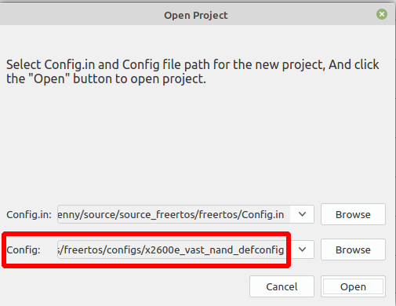
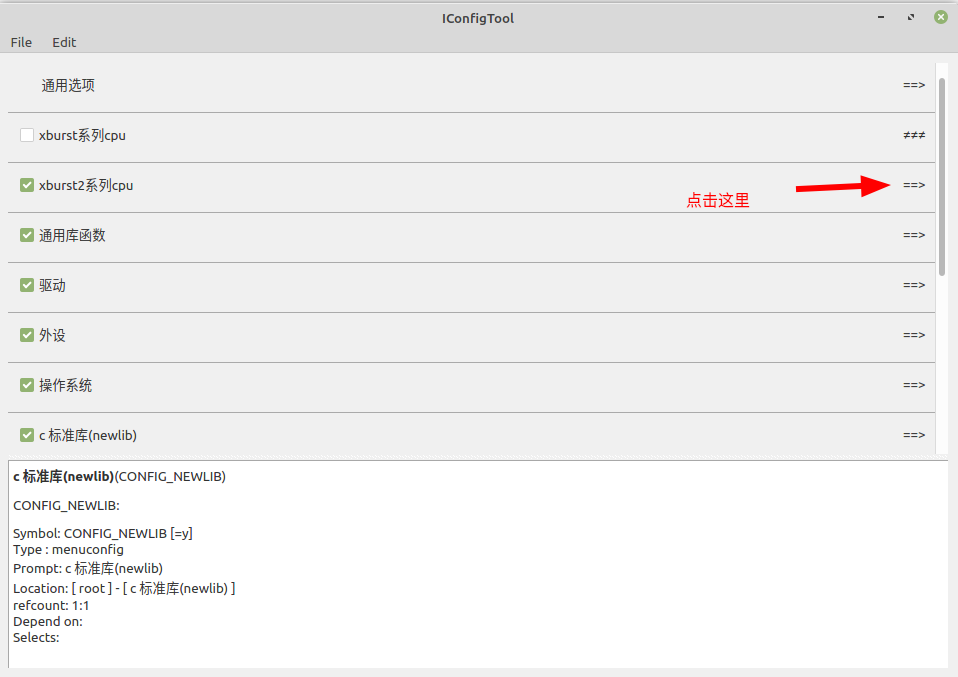
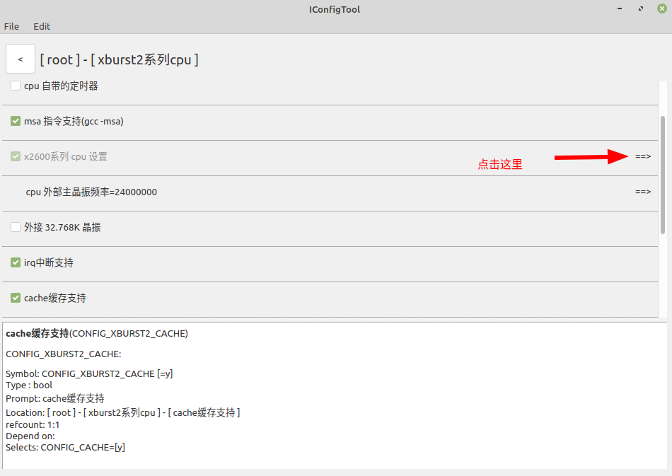
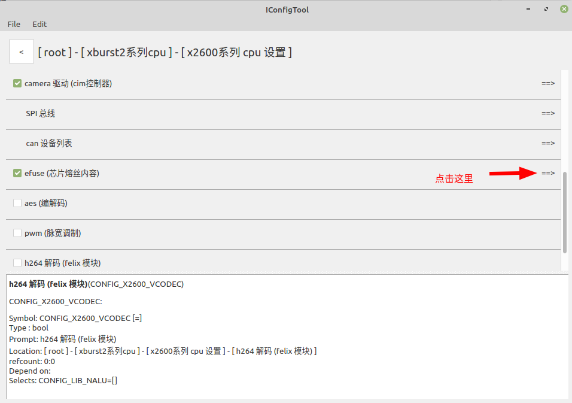
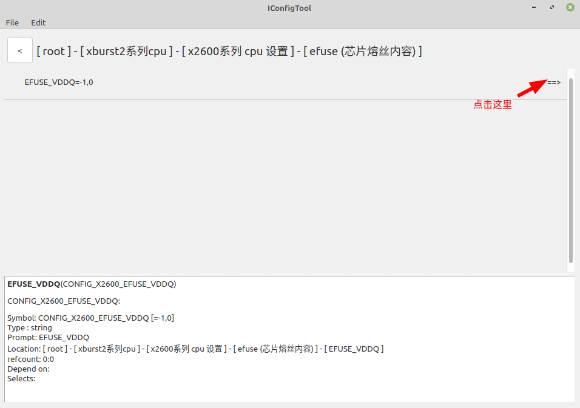
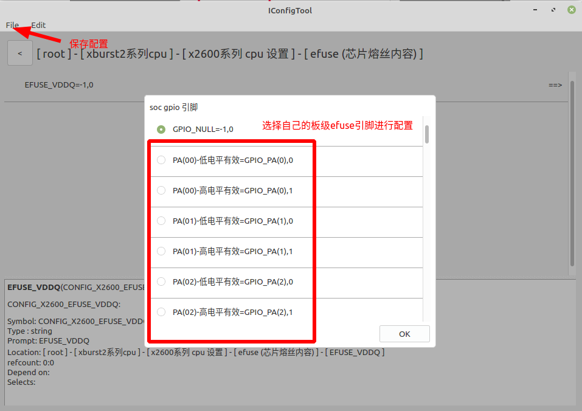
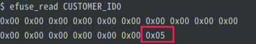
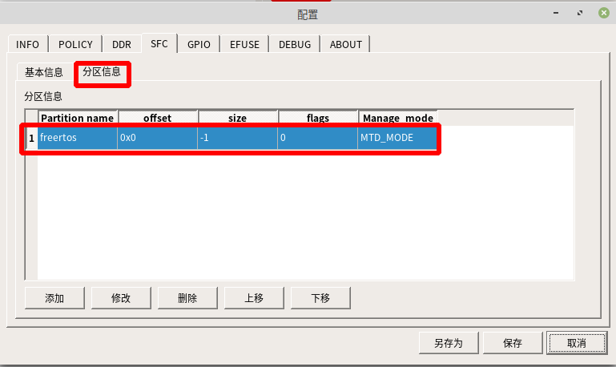

# FreeRTOS_X2600e EFUSE 使用说明

## 一  EFUSE功能简介

​        EFUSE 全称“电子熔断器”（electronic  fuse），是一种可编程电子保险丝，是一种用于存储信息和保护芯片的非易失性存储器件。它的原理是基于电子注入和热效应。在eFuse中，短电流脉冲被应用于热致电子发射，这会使电流通过一个非常小的导线。该电流会引起电线中的材料熔断，形成一个永久性的开路。这个过程是不可逆的，一旦eFuse被熔断，就不能再次编程。

## 二  硬件环境

   该文档使用的开发板为：PD_X2600E_VAST_V2.0 芯片为 X2600E。内置 256MB DD3(L);外置 1Gbit SPI NAND = 1Gbit SPINAND Flash = 1024/8=128M。

## 三 原理介绍

​	efuse类似于EEPROM，是一次性可编程存储器，在芯片出厂之前会被写入信息，在一个芯片中，efuse的容量通常很小，x2000的efuse为2Kb，这些位被单独分成14个段，每个段可以单独编程。

​		efuse里面一般存储芯片的版本号，生产日期和校验位。

​		**注意：**efuse只能由0写为1,不能由1写0。

**硬件电路**


X2600 EFUSE电压默认就有，不需要额外供电。


## 四 软件实现




主配置选择：x2600e_vast_nand_defconfig















X2600e芯片默认EFUSE是已经通电的。所以这里可以不用配置，默认选择GPIO_NULL即可。


## 五 测试程序

### 5.1  efuse 测试程序example

测试程序： freertos$ ls example/driver/efuse_example.c  内容如下：

```c++
#include <driver/efuse.h>

/* 下面以 x1830 为例
 */
void efuse_test(void)
{
    int i;
    unsigned char chip_id_buff[CHIP_ID_SIZE];
    unsigned char user_id_buff[USER_ID_SIZE];
    unsigned char customer_resv_buff[CUSTOMER_RESV_SIZE];

    /* efuse 读 CHIP_ID 段，
     * 每次读的大小和段大小(12byte)保持一致，单位 byte
     */
    efuse_read_segment(CHIP_ID, chip_id_buff, CHIP_ID_SIZE);

    printf("CHIP_ID = ");
    for (i = 0; i < CHIP_ID_SIZE; i++)
        printf("%02x", chip_id_buff[i]);

    printf("\n");

    /* efuse 写 USER_ID 段，
     * 一次写的大小需和段大小保持一致，单位 byte.
     */
    for (i = 0; i < USER_ID_SIZE; i++)
        user_id_buff[i] = 0x11;

    efuse_write_segment(USER_ID, user_id_buff, USER_ID_SIZE);

    /* 读取 efuse CUSTOMER_RESV段
     * 从 第 2 个字节开始的 4 个字节数据
     */
    efuse_read(CUSTOMER_RESV, customer_resv_buff, 2, 4);

    printf("CUSTOMER_RESV = ");
    for (i = 0; i < 4; i++)
        printf("%02x", customer_resv_buff[i]);

    printf("\n");

    /* efuse 读 CUSTOMER_RESV 段，
     * 每次读的大小和段大小(104byte)保持一致，单位 byte
     */
    efuse_read_segment(CUSTOMER_RESV, customer_resv_buff, CUSTOMER_RESV_SIZE);

    printf("CUSTOMER_RESV = ");
    for (i = 0; i < CUSTOMER_RESV_SIZE; i++)
        printf("%02x", customer_resv_buff[i]);

    printf("\n");
}
```

### 5.2  编译和使用测试程序

修改 vendor/vendor.c ，对efuse进行编程，进行写的操作。 内容如下：

```c
#include <stdio.h>
#include <../example/driver/efuse_example.c>
void vendor_init(void)
{
	efuse_test();  //测试efuse的写操作
	printf("vendor init...\n");
}
```

编译烧录以后，开机运行如下命令，结果如下：



可以看到0x05 已经写到了对应的位置。


## 六  编译和烧录

### 6.1  工程编译

编译命令如下：

```shell
cd freertos/

$ source build/envsetup.sh

$ make x2600e_vast_nand_defconfig

$ make
```


### 6.2 工程烧录

烧录工具配置如下：


平台选择： x2600

板级选择：x2600e_sfc_nand_ddr3l_linux.cfg


烧录的文件选择：freertos/rtos-with-spl.bin 

label的名称要与 SFC 中分区信息的Partition name 一致。


保持默认就可以。


第一次烧录需要勾选全部擦除。




Partition name 为 freertos ，这里的名称可以修改

Manage mode选择 MTD_MODE


保存烧录工具配置以后，点击开始进行烧录。先按住开发板BOOT_KEY键不放，然后按下RST_KEY按键以后，进入烧录模式，烧录成功的界面如下：


## 七  API说明

头文件efuse.h, 路径为：freertos$ ls include/driver/efuse.h

freertos/include/driver/efuse.h   文件内容如下：

#ifndef _EFUSE_H_
#define _EFUSE_H_

#include <soc/efuse.h>

```c++
void efuse_init(void);

功能：efuse 初始化
```

```c++
int efuse_write(enum segment_id seg_id, unsigned char *buf, int start, int size);
功能：efuse 写函数
参数：
             enum segment_id seg_id         //待写入的数据段的ID
             unsigned int *buf                         //待写入的数据
             int start                                             //段内偏移地址
             int len                                                //待写入数据的长度
返回值：
                返回值为0：正常退出
                其它值       ：异常退出
"注意：任何段的任一位一旦被写入了1将永远为1，写入0可则不影响下一次写操作。"
```

​    

```c++
int efuse_write_segment(enum segment_id seg_id, unsigned char *buf, int len);

功能：efuse 写整段函数
参数：
             enum segment_id seg_id         //待写入的数据段的ID
             unsigned int *buf                         //待写入的数据
             int len                                                //待写入数据的长度
返回值：
                返回值为0：正常退出
                其它值       ：异常退出
"注意：任何段的任一位一旦被写入了1将永远为1，写入0可则不影响下一次写操作。"
```

```c++
int efuse_read(enum segment_id seg_id, unsigned char *buf, int start, int size);

功能：efuse 读函数
参数：
             enum segment_id seg_id         //待读取的数据段的ID
             unsigned int *buf                         //读到的数据
             int start                                             //段内偏移地址
             int len                                                //读到的数据的长度
返回值：
                返回值为0：正常退出
                其它值       ：异常退出
```

```c++
int efuse_read_segment(enum segment_id seg_id, unsigned char *buf, int len);

功能：efuse 读整段函数
参数：
             enum segment_id seg_id         //待读取的数据段的ID
             unsigned int *buf                         //读到的数据
             int len                                                //读到的数据的长度
返回值：
                 返回值为0：正常退出
                 其它值       ：异常退出
```

#endif /* _EFUSE_H_ */


#include <soc/efuse.h>  路径：freertos$ ls ./xburst2/soc-x2600/include/soc/efuse.h

freertos/xburst2/soc-x2600/include/soc/efuse.h 文件内容如下：

```c++
#ifndef _SOC_EFUSE_H_
#define _SOC_EFUSE_H_

enum segment_id {
    CHIP_ID,        //存放芯片ID
    CUSTOMER_ID0,   //使用者ID0
    CUSTOMER_ID1,   //使用者ID1
    CUSTOMER_ID2,   //使用者ID2
    TRIM_DATA0,
    TRIM_DATA1,
    TRIM_DATA2,
    SOC_INFO,
    PROGRAM_PROTECT,
    HIDE_BLOCK,
    CHIP_KEY,     //存放芯片密钥
    USER_KEY0,
    USER_KEY1,
    NKU,
};

#define     CHIP_ID_SIZE            17
#define     CUSTOMER_ID_SIZE0       17
#define     CUSTOMER_ID_SIZE1       29
#define     CUSTOMER_ID_SIZE2       29
#define     TRIM_DATA_SIZE0         5
#define     TRIM_DATA_SIZE1         5
#define     TRIM_DATA_SIZE2         5
#define     SOC_INFO_SIZE           5
#define     PROGRAM_PROTECT_SIZE    4
#define     HIDE_BLOCK_SIZE         4
#define     CHIP_KEY_SIZE           34
#define     USER_KEY_SIZE0          34
#define     USER_KEY_SIZE1          34
#define     NKU_SIZE                34

#endif
```
