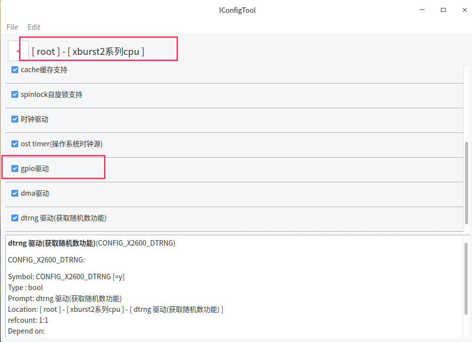
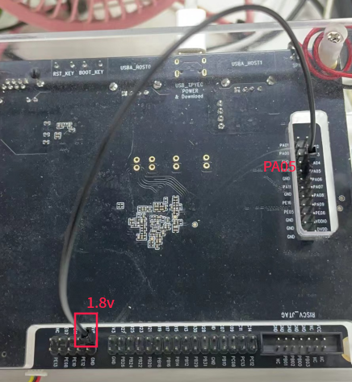

# FreeRTOS_X2600E_GPIO使用文档

## 一 功能简介

GPIO

- 每个端口都可以配置为输入、输出或功能端口
- 每个端口都可以配置为高电平/低电平或上升/下降沿或双沿触发的中断源
- 支持 shadow

## 二 配置方法

*以PD_X2600E_VAST_V2.0开发板为例 , 使用x2600e_vast_nand_defconfig配置 , 实际根据硬件需要配置*


gpio配置



shell配置


## 三 GPIO测试例子

### 3.1  GPIO中断测试

​	此处以gpio PA05为例, 设置为双边沿触发中断. 当检测到外部输入上升沿或下降沿电平时, 将进入中断处理函数, 并打印触发中断对应的外部中断编号及电平状态.具体代码如下：

> **代码位于freertos/example/driver/gpio_irq_example.c**

```c
#include <common.h>
#include <driver/irq.h>
#include <driver/gpio.h>

static void m_gpio_irq_handler(int irq, void *data)
{
    printf("irq: %d %d\n", irq, gpio_get_value(irq_to_gpio(irq)));        //打印io触发中断对应外部中断编号及电平状态
    
}

void test_gpio_irq(void)
{
    request_irq(gpio_to_irq(GPIO_PA(05)), IRQ_TYPE_EDGE_BOTH, m_gpio_irq_handler, "gpio-pa05", NULL);

// request_irq_disabled(gpio_to_irq(GPIO_PA(05)), IRQ_TYPE_LEVEL_HIGH, m_gpio_irq_handler, "gpio-pa05", NULL);
// enable_irq(gpio_to_irq(GPIO_PA(19)));
}

```

IRQ_TYPE见freertos/include/driver/irq.h，测试设置为IRQ_TYPE_EDGE_BOTH

```c
#define IRQ_TYPE_NONE            0
#define IRQ_TYPE_EDGE_RISING     1
#define IRQ_TYPE_EDGE_FALLING    2
#define IRQ_TYPE_EDGE_BOTH       (IRQ_TYPE_EDGE_FALLING | IRQ_TYPE_EDGE_RISING)
#define IRQ_TYPE_LEVEL_HIGH      4
#define IRQ_TYPE_LEVEL_LOW       8
```

### 3.2  GPIO输入与输出测试

gpio_test_example.c

此处gpio输出以GPIO_PE(20)为例 , 向驱动申请GPIO_PE(20)并设置为输出高电平,

gpio输入以GPIO_PB(02)为例, 向驱动申请GPIO_PB(02)并设置为输入.

具体代码如下：

```c
#include <common.h>
#include <driver/gpio.h>

static inline int m_gpio_request(int gpio, const char *name)
{
    if (gpio < 0)
        return 0;

    return gpio_request(gpio, name);
}

static inline void m_gpio_direction_output(int gpio, int value)
{
    if (gpio >= 0)
        gpio_direction_output(gpio, value);
}

static inline void m_gpio_direction_input(int gpio)
{
    if (gpio >= 0)
        gpio_direction_input(gpio);
}

void test_gpio_output(void)                    
{
    m_gpio_request(GPIO_PE(20),"tp");           //申请GPIO_PE(20)
    m_gpio_direction_output(GPIO_PE(20),1);     //设置为输出高电平
}

void test_gpio_input(void)
{
    m_gpio_request(GPIO_PB(02),"test");        //申请GPIO_PB(02)
    m_gpio_direction_input(GPIO_PB(02));       //设置为输入
}
```

### 3.3 测试程序编译和使用

在freertos/vendor目录下添加测试程序文件gpio_irq_example.c, gpio_test_example.c, 并在Makefile添加

```c
src-y += vendor.c  gpio_irq_example.c gpio_test_example.c
```

在vendor.c中引用相关函数, 并添加相关头文件

```c
#include <stdio.h>
#include <driver/irq.h>
#include <driver/gpio.h>
#include <common.h>

void vendor_init(void)
{
    printf("vendor init...\n");
    test_gpio_output();
    test_gpio_input();
    test_gpio_irq();
}
```

## 四 编译和烧录

```c
bhu@bhu-PC:~/rtos$ cd freertos                      
bhu@bhu-PC:~/rtos/freertos$  source build/envsetup.sh        //第一次编译需要初始化编译环境
bhu@bhu-PC:~/rtos/freertos$ make x2600e_vast_nand_defconfig
bhu@bhu-PC:~/rtos/freertos$ make 
```

```c
bhu@bhu-PC:~/rtos/freertos$ ls rtos-with-spl.bin 
rtos-with-spl.bin                                           //编译出来的文件
```

**请使用最新版烧录工具**

```c
wget ftp://ftp.ingenic.com.cn/DevSupport/Tools/USBBurner/cloner-latest-ubuntu.tar.gz 
wget ftp://ftp.ingenic.com.cn/DevSupport/Tools/USBBurner/cloner-latest-windows.zip
```

**烧录配置**


## 五 测试结果

### 5.1 GPIO中断验证

验证gpio中断, 给 PA05外接1.8v, 触发gpio PA05上升沿




```c
$ [1288.417145] irq: 77 1       //进入中断处理函数, 打印出irp：77(PA05对应外部中断编号)1(PA05对应电平)与预期结果一致
[1429.467069] irq: 77 0
[1429.468455] irq: 77 1
[1429.469101] irq: 77 0
[1429.469500] irq: 77 1
[1429.470032] irq: 77 0
[1429.470354] irq: 77 1
[1429.470437] irq: 77 1
[1429.470520] irq: 77 1
[1429.470603] irq: 77 0
```

### 5.2 GPIO输入与输出验证

查看gpio输入与输出结果(相关参数说明见七GPIO命令详解)

```c
$ gpio_get_func PE20                  //申请到的GPIO_PE(20)为输出高电平与预期结果一致
        NOTE:You can use the [gpio_get_func_des] to view Port Description.
        GPIO  Function
        PE20  OUTPUT1| PULL_HIZ 
$ gpio_get_func PB02                  //申请到的GPIO_PB(02)为输入与预期结果一致                                     
        NOTE:You can use the [gpio_get_func_des] to view Port Description.
        GPIO  Function
        PB02  INPUT| PULL_HIZ
```

## 六 GPIO 应用接口分析

> **相关源码见freertos/drivers目录下的gpio.c**

包含头文件：

```c
#include <driver/gpio.h>
#include <driver/irq.h>
#include <include/soc/gpio.h>
```

gpio使用流程：

```c
1.申请需要使用的io口资源，  gpio_request
2.设置io口模式            gpio_direction_input（输入）gpio_direction_output（输出）
3.释放io口               gpio_release
```

api详解：

```c
int gpio_request(int gpio, const char *name)
功能：向驱动申请一个指定io，所申请的io口会被驱动记录。
参数：
             int gpio               //申请的io编号;填写格式:GPIO_Px(n)
             const char *name       //申请者的名字(做为出错信息打印)
返回值：
                 成功:  0；
                 失败: （1） -EBUSY：申请的io忙状态
                      （2）-1 ：申请的io编号错误
"注意: 此函数在使用io口之前使用。已经被申请的io，在没有释放之前再次申请将会失败。"
```

```c
void gpio_release(int gpio)
功能：释放向驱动已经申请的指定io。
参数：int gpio               //所要释放io编号;填写格式:GPIO_Px(n)
"注意：此函数和 gpio_request配对使用，功能相反。"
```

```c
void gpio_direction_input(int gpio)
功能：指定io口设置为输入功能。
参数：int gpio            // 需要设置的io;填写格式:GPIO_Px(n)
```

```c
void gpio_direction_output(int gpio, int value)
功能：指定io口设置为输出功能，并输出指定电平value。
参数：
             int gpio    //需要指定io口的编号；填写格式GPIO_Px(n)
             int value：
                           0：输出低电平
                           1：输出高电平
```

```c
int gpio_get_value(int gpio)
功能：获取io口的电平。
参数：int gpio           //需要获取io口编号;填写格式:GPIO_Px(n)
返回值：
                 0：电平为低
                 1：电平为高
"注意：GPIO处于任何模式都可以直接调用这个接口，包括中断模式和输出模式。"
```

```c
void gpio_set_value(int gpio , int value)
功能：设置io口的电平。
参数：int gpio     //需要设置的io口编号;填写格式:GPIO_Px(n)
     value：
                     0：输出低电平
                     1：输出高电平
"注意：必须保证GPIO是输出模式，才能调用这个接口。"
```

```c
int gpio_to_irq(int gpio)
功能：通过io口编号转换成对应的外部中断编号
参数：int gpio        //要获取的io口编号;填写格式:GPIO_Px(n)
返回值：
                成功：返回中断编号
                失败：-1（io编号错误）
```

```c
int irq_to_gpio(int irq)
功能：通过外部中断编号转换成对应的io口编号
参数：int irq         // io口编号对应外部中断编号
返回值：返回io口编号
```

```c
char *gpio_to_str(int gpio, char *buf,  size_t size);
功能：gpio转字符串
参数：
           int gpio            //io口编号  填写格式:GPIO_Px(n)
           char *buf           //存放字符串指针
           size_t size         //buf的长度（sizeof(buf)）
返回值：字符串地址
```

```c
int str_to_gpio(const char *str);
功能：字符串转gpio
参数：char *str           // 字符串地址
返回值：
                 成功：gpio值
                 失败：-1
```

```c
void gpio_set_func(int gpio, enum gpio_function func)
功能：把指定io口配置为指定功能
参数：
       int gpio      //要获取的io口编号;填写格式:GPIO_Px(n)
       enum gpio_function func //GPIO功能
```

```c
enum gpio_function gpio_get_func(int gpio);
功能：获取gpio的功能。
参数：
      int gpio       //io口编号 填写格式:GPIO_Px(n)
返回值：返回gpio所有功能
```

中间参数详解：

```c
x2600:
enum gpio_function {
    GPIO_FUNC_0    = 0x10,  //0000, GPIO as function 0 / device 0
    GPIO_FUNC_1    = 0x11,  //0001, GPIO as function 1 / device 1
    GPIO_FUNC_2    = 0x12,  //0010, GPIO as function 2 / device 2
    GPIO_FUNC_3    = 0x13,  //0011, GPIO as function 3 / device 3
    GPIO_OUTPUT0   = 0x14,  //0100, GPIO output low  level
    GPIO_OUTPUT1   = 0x15,  //0101, GPIO output high level
    GPIO_INPUT     = 0x16,  //0110, GPIO as input.7 also.
    GPIO_INT_LO    = 0x18,  //1000, Low  Level trigger interrupt
    GPIO_INT_HI    = 0x19,  //1001, High Level trigger interrupt
    GPIO_INT_FE    = 0x1a,  //1010, Fall Edge trigger interrupt
    GPIO_INT_RE    = 0x1b,  //1011, Rise Edge trigger interrupt
    GPIO_INT_MASK_LO = 0x1c,//1100,Port is low level triggered interrupt input.Interrupt is masked.
    GPIO_INT_MASK_HI = 0x1d,//1101,Port is high level triggered interrupt input.Interrupt is masked.
    GPIO_INT_MASK_FE = 0x1e,//1110,Port is fall edge triggered interrupt input.Interrupt is masked.
    GPIO_INT_MASK_RE = 0x1f,//1111,Port is rise edge triggered interrupt input.Interrupt is masked.

    GPIO_PULL_HIZ  = 0x80,    //Hiz
    GPIO_PULL_UP   = 0xa0,    //pull up
    GPIO_PULL_DOWN = 0xc0,    //pull down
    GPIO_PILL_BUSHOLD_OR_NA = 0xe0, //for details about Bus keeper or n/a,refer to the manual
};
```

## 七 GPIO命令详解

> **相关源码见freertos/shell/cmds/drivers/gpio目录下的cmds_x2600_gpio.c**

### 7.1 shell命令

```c
gpio_get_func_des
功能：查看io口功能说明
参数：无
example：
          gpio_get_func_des
```

```c
gpio_get_func
功能：获取指定IO功能状态
参数：gpio         //io口的名字
example：
            gpio_get_func PA8
```

```c
gpio_set_func <GPIO> <FUNCTION>
功能：设定指定IO功能
参数：gpio                //io口的名字
     function            //io口功能
example：
            gpio_set_func PA8 OUTPUT0
```

```c
gpio_set_value <GPIO> <value>
功能：设置io电平
参数：gpio                 //io口的名字
     value：
                     0：输出低电平
                     1：输出高电平
 example：
                     gpio_set_value PA8 0
"注：io口必须为output状态"
```

```c
gpio_get_value <GPIO>
功能：获取io电平
参数：gpio                //io口的名字
 example：
                     gpio_get_value PA8
```

### 7.2 具体例⼦

```c
$ gpio_set_func pe20 OUTPUT1                                                     
$ gpio_get_func pe20                                                             
        NOTE:You can use the [gpio_get_func_des] to view Port Description.
        GPIO  Function
        PE20  OUTPUT1| PULL_HIZ
$ gpio_get_value  pe20                                                           
pe20 value is high level
```


