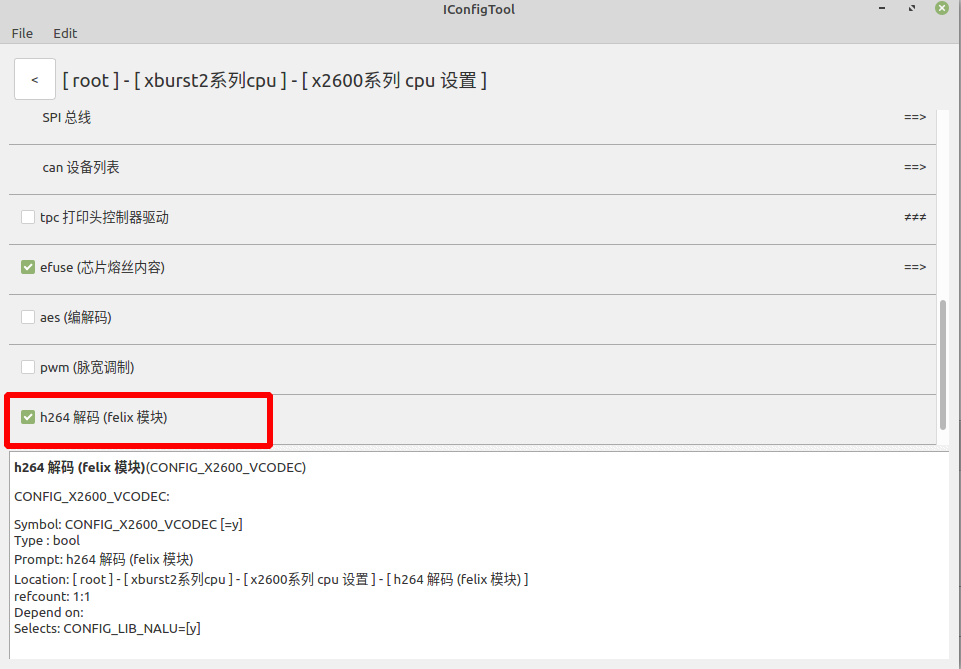
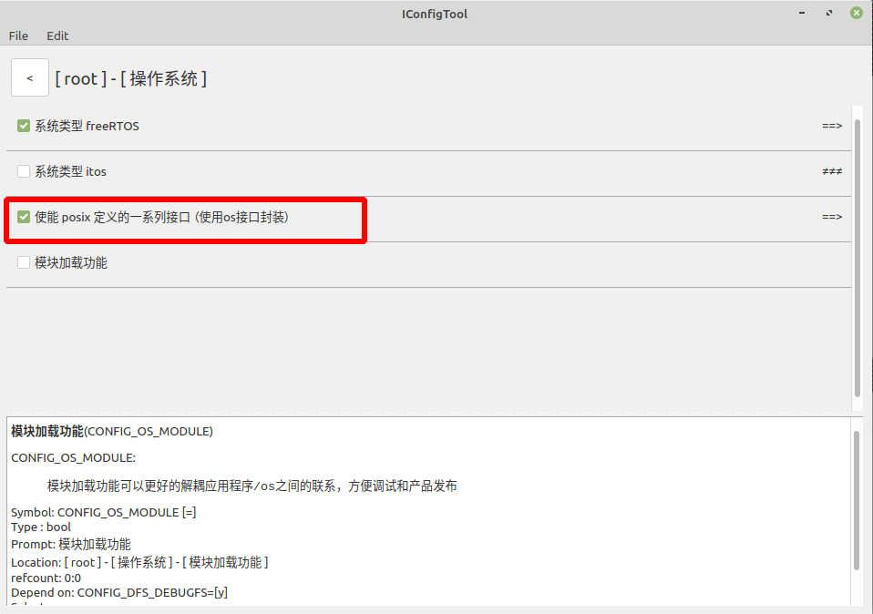
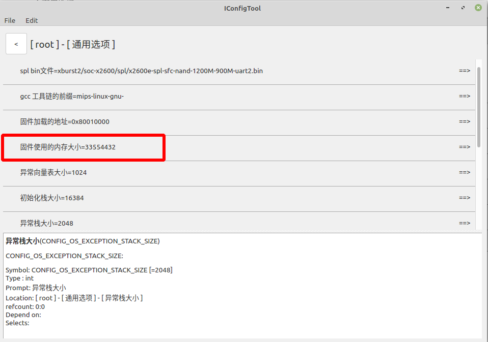
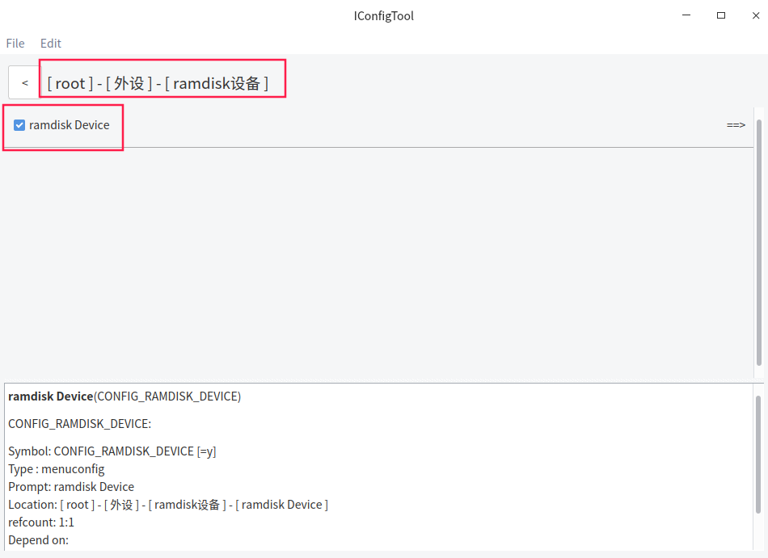
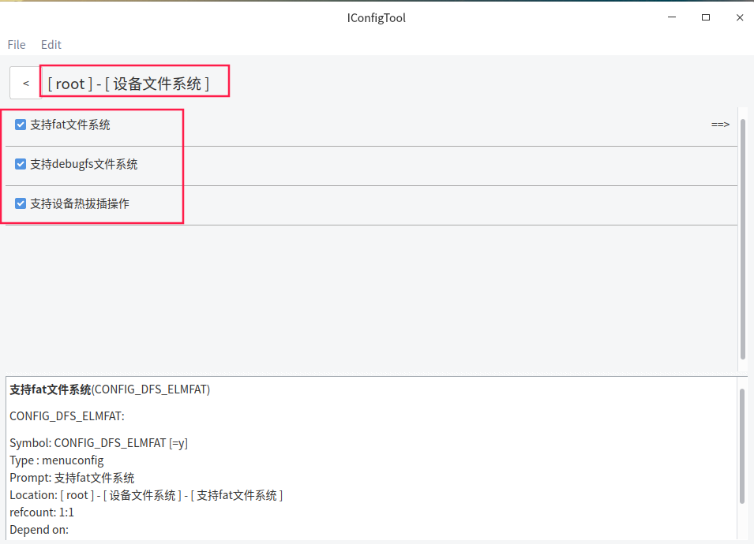
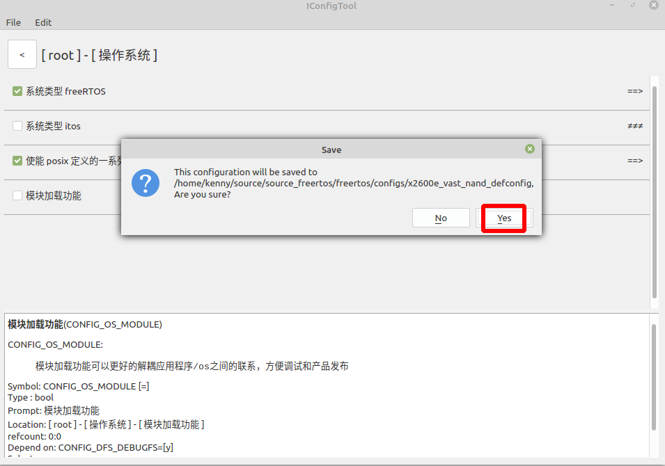
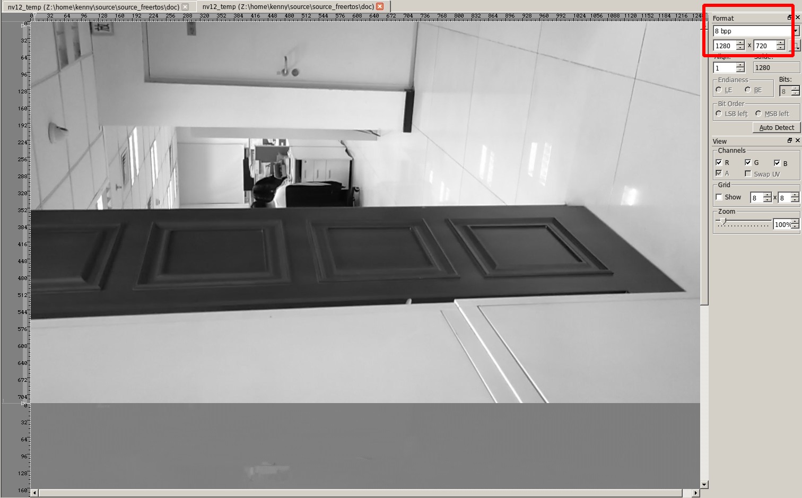
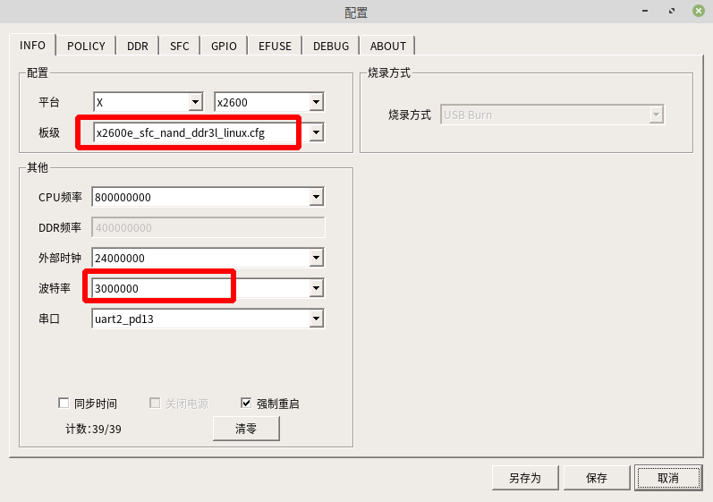
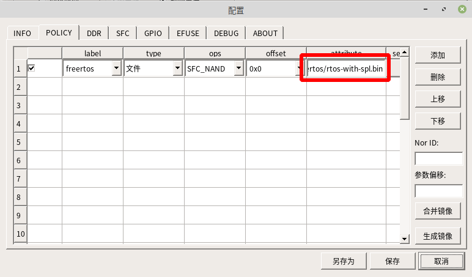
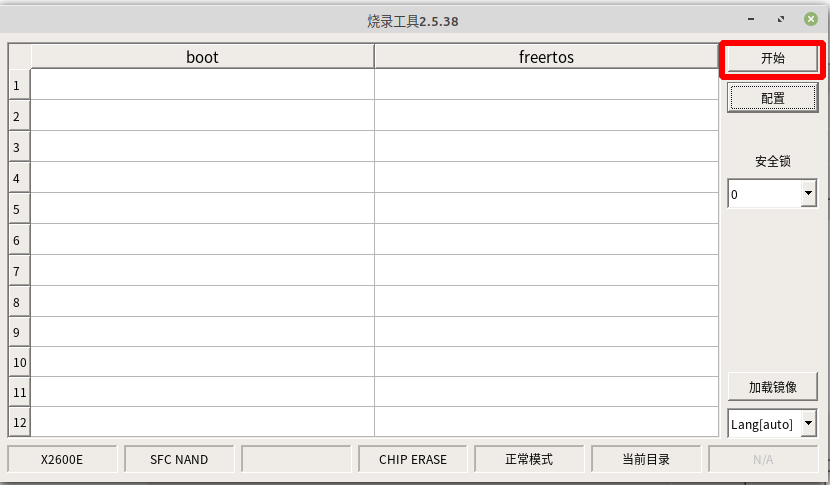

# X2600E_H264解码使用说明

## 一  硬件环境

​    该文档使用的开发板为：PD_X2600E_VAST_V2.0开发板 芯片为 X2600E。内置 256MB DD3(L);外置 1Gbit SPI NAND = 1Gbit SPINAND Flash = 1024/8=128M。

## 二  功能简介

​        H.264是一种高性能的[视频编解码技术](https://baike.baidu.com/item/视频编解码技术/0?fromModule=lemma_inlink)，PD_X2600E_VAST_V2.0开发板含有H.264解码芯片，其参数如下：

**君正X2600E H.264解码参数**

- 最大分辨率: 2560x2048

- 最大解码能力: 1920x1080@60fps

- 输出格式: NV12

  

## 三 软件实现方法

由于H.264解码以后，需要进行预览。该文档使用解码后的图片保存到TF上进行保存，然后放到电脑上进行预览的操作。所以需要添加支持TF卡的配置。


主配置选择 x2600e_vast_nand_defconfig 




勾选h264解码(felix模块)




勾选使能 posix 定义的一系列接口 （使用os接口封装）




由于H.264解码需要，这里的固件使用内存大小设置为32M




勾选 ramdisk Device


### 



设备文件系统配置


MMC总线配置，配置MMC0


多媒体接口设备列表配置




Ctrl + s ，点击 Yes 保存配置


## 五 测试程序

### 5.1  h.264解码测试 example

h.264解码测试程序： freertos$ ls example/driver/felix_h264_decoder_example.c  内容如下：

```c++
#include <stdio.h>
#include <printf.h>
#include <common.h>
#include <os.h>
#include <stdlib.h>
#include <malloc.h>
#include <include_bin.h>
#include <assert.h>
#include <driver/cache.h>


#include<io.h>
#include <sys/types.h>
#include <sys/stat.h>
#include <fcntl.h>


#include <felix/felix_h264_decoder.h>
#include <lib/nalu_buf.h>

INCBIN(h264, "example/resource/test.h264");

//写文件操作，该文件表示把解码后的一帧写到tf卡上
int write_file(const char * path, void *buf, int size)
{
    int fd = open(path, O_RDWR | O_CREAT, 0777);
    if (fd < 0) {
        printf("Error open %s fail \n", path);
        return -1;
    }
    
    write(fd, buf, size);
    
    close(fd);
    
    return 0;
}


void felix_h264_decoder_test(void)
{
    int width = 1280, height = 720;
    void *nv12 = memalign(256, ALIGN(width*height*3/2, cache_line_size()));
    assert(nv12);

    struct nalu_buf *nalu_buf = nalu_buf_init(256*1024);
    assert(nalu_buf);

    struct felix_h264_decoder_param param = {
        .width = width,
        .height = height,
    };
    struct felix_h264_decoder *decoder = felix_h264_decoder_init(&param);
    if (!decoder)
        goto delete_nalu_buf;

    void *data = (void *)h264Data;
    int size = h264Size;
    int count = 0;

    while (1) {
        int len = 0;
        struct nalu_frame *frame = nalu_buf_write(nalu_buf, data, size, &len);
        size -= len;
        data += len;
        if (!frame) {
            if (!len)
                break;
            continue;
        }

        int ret = felix_h264_decoder_decode(decoder, frame->data, frame->size, nv12);
        
        nalu_frame_delete(frame);
        if (ret)
            continue;

        if (count++ == 20) {
            int w = 400, h = 400;
            void *y = memalign(256, w*h);
            unsigned char *s = nv12 + (width-w)/2;
            unsigned char *d = y;
            int i, j;
            for (i = 0; i < h; i++) {
                for (j = 0; j < w; j++) {
                    d[j] = s[j];
                }
                d += w;
                s += width;
            }
            
            //取中间一帧写到tf上（/mmcblk0p1/nv12_temp）
            write_file("/mmcblk0p1/nv12_temp",nv12,width*height*3/2);
            printf_disable_time_stamp();
            dump_mem32_c_style(y, w*h, 8);
            free(y);
        }
    }

    felix_h264_decoder_deinit(decoder);
delete_nalu_buf:
    nalu_buf_deinit(nalu_buf);
    free(nv12);
}
```

### 5.2  编译和使用测试程序

修改 vendor/vendor.c ，测试h.264解码 内容如下：

```c
#include <stdio.h>
#include <../example/driver/felix_h264_decoder_example.c>


void vendor_init(void)
{
	felix_h264_decoder_test();  //测试解码并且写到tf卡上，然后放到电脑上进行预览
	printf("vendor init...\n");
}
```

编译烧录以后，开机运行。tf卡目录下生成如下文件：

```shell
$ ls /mmcblk0p1/
nv12_temp
```

### 5.3 图片预览

把TF卡放到电脑端，导出图片nv12_temp,使用软件7yuv进行预览，如下图所示：



分辨率选择：1280x720


## 六  编译和烧录

### 6.1  工程编译

编译命令如下：

```shell
cd freertos/

$ source build/envsetup.sh

$ make x2600e_vast_nand_defconfig

$ make
```


### 6.2 工程烧录

烧录工具配置如下：



平台选择： x2600

板级选择：x2600e_sfc_nand_ddr3l_linux.cfg




烧录的文件选择：freertos/rtos-with-spl.bin 

label的名称要与 SFC 中分区信息的Partition name 一致。


保持默认就可以。


第一次烧录需要勾选全部擦除。


Partition name 为 freertos ，这里的名称可以修改

Manage mode选择 MTD_MODE



保存烧录工具配置以后，点击开始进行烧录。先按住开发板BOOT_KEY键不放，然后按下RST_KEY按键以后，进入烧录模式，烧录成功的界面如下：


## 七  API说明

头文件 felix_h264_decoder.h , 路径为：freertos$ ls ./xburst2/soc-x2600/vcodec/felix/felix_h264_decoder.h 

freertos/xburst2/soc-x2600/vcodec/felix/felix_h264_decoder.h   文件内容如下：

```shell
#ifndef _FELIX_H264_DECODER_H_
#define _FELIX_H264_DECODER_H_

struct felix_h264_decoder_param {
    int width;
    int height;
};

struct felix_h264_decoder;

struct felix_h264_decoder *felix_h264_decoder_init(struct felix_h264_decoder_param *param);

int felix_h264_decoder_decode_nv12_separate(
    struct felix_h264_decoder *decoder, void *src_, int src_size, void *y_, void *uv_);

int felix_h264_decoder_decode(
    struct felix_h264_decoder *decoder, void *src, int src_size, void *nv12);

void felix_h264_decoder_deinit(struct felix_h264_decoder *decoder);

#endif /* _FELIX_H264_DECODER_H_ */
```
