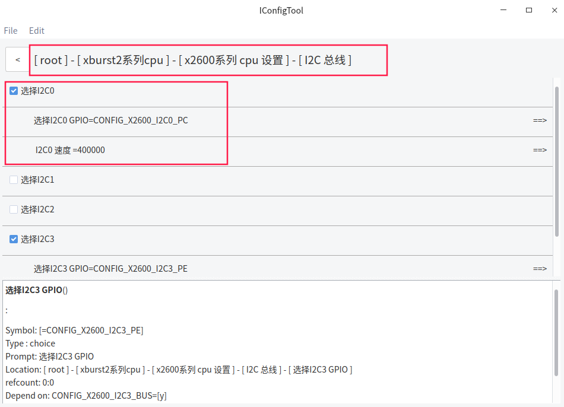
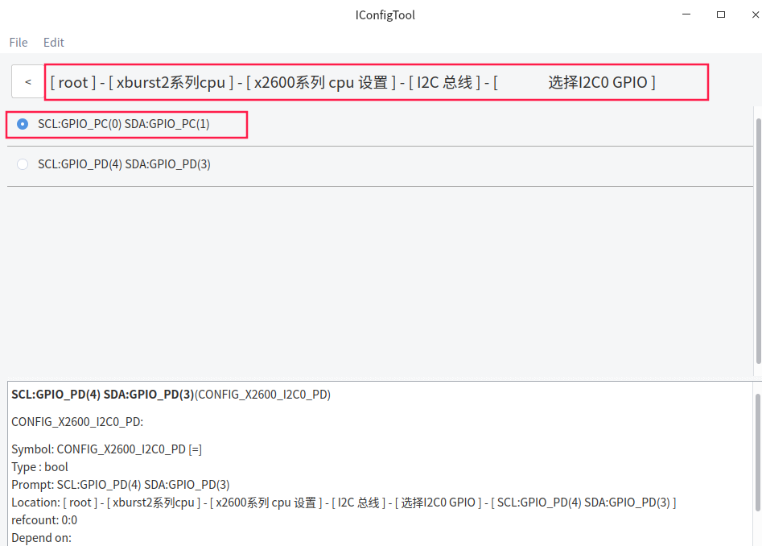
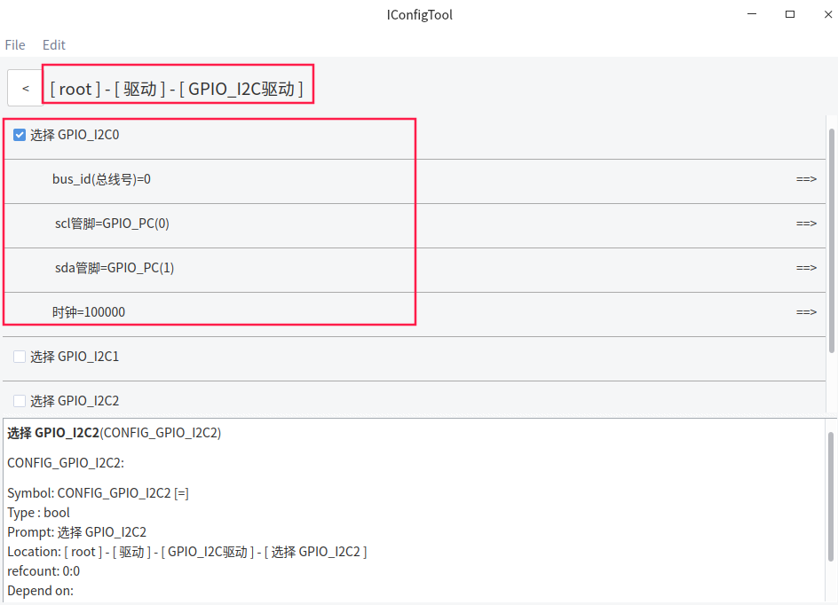

# FreeRTOS_X2600E_I2C使用文档

## 一 功能简介

  X2600 I2C由SDA (serial data line) 和SCL (serial clock) 组成

  支持三种模式：

- Standard mode (100 Kb/s)
- Fast mode (400 Kb/s)
- High mode (3.4Mb/s)

支持 Master 和 Slave 模式

7/10-bit 地址位

4个独立的I2C通道（I2C0、I2C1、I2C2、I2C3）

若I2C总线不够用,或者怀疑i2c驱动异常,还可以使用GPIO口模拟I2C

## 二 硬件I2C配置方法

*以PD_X2600E_VAST_V2.0开发板为例 , 其中camera及tp触摸屏使用到 I2C, 使用x2600e_vast_nand_defconfig配置 , 实际根据硬件需要配置*


I2C控制器驱动配置



相关GPIO选择



## 三 GPIO模拟I2C配置方法




## 四 I2C测试例子

> **代码位于freertos/example/driver/i2c_example.c**

```c
#include <common.h>
#include <driver/i2c.h>
#include <os.h>

/**
 * 具体设备的写函数,需要根据具体的设备去实现
 * i2c: 从设备句柄
 * reg: 从设备具体的寄存器地址
 * buf: 发送缓冲区
 * len: 发送数据的个数
 */
int xx_reg_write(struct i2c_device *i2c, unsigned short reg, char *buf, int len)
{
    char tbuf[128];

    /* 如果需要访问具体的寄存器需要将reg和buf内容进行拼接,将拼接好的内容一起传给i2c_message */
    tbuf[0] = reg;
    if (buf) {
        memcpy((void *)(tbuf+1), (void *)buf, len);
        len++;
    }

    struct i2c_msg m = {
        .buf = tbuf,    /* tbuf为拼接后的内容 */
        .len  = len,      /* 发送数据的个数 */
        .flags = I2C_M_WR,
    };
    return i2c_transfer(i2c, &m, 1);
}

/*＊
 * 具体设备的读函数,需要根据具体的设备去实现
 * i2c: 从设备句柄
 * reg: 从设备具体的寄存器地址
 * buf: 接收缓冲区
 * len: 接收数据的个数
 */
int xx_reg_read(struct i2c_device *i2c, unsigned short reg, char *buf, int len)
{
    /* i2c 读操作前需要先进行写操作 */
    xx_reg_write(i2c, reg, NULL, 1);

    struct i2c_msg m = {
        .buf = buf,
        .len  = len,
        .flags = I2C_M_RD,/* 发送读操作标志 */
    };
    return i2c_transfer(i2c, &m, 1);
}

void i2c_test(void *data)
{
    int ret = 0;
    char tbuf[1] = {0x12};
    char rbuf[1024] = {0};

    struct i2c_device *i2c = i2c_register(1, 0x40, I2C_ADDR_BIT_7, "i2c");/* 0x40是从设备地址 */
    if (i2c == NULL) {
        printf("i2c register error! may be exist the same address on the same bus!\n");
        return;
    }

    /* 具体设备的读写函数需要自己实现，这里只给出简单的示例 */
    ret = xx_reg_write(i2c, 0xf0, tbuf, 1);/* 0xf0是i2c外设具体的寄存器地址 */
    if (ret < 0)
        printf("i2c write error %d\n", ret);
    ret = xx_reg_read(i2c, 0xf0, rbuf, 1);
    if (ret < 0)
        printf("i2c write error %d\n", ret);

    printf("i2c: rx_buf = %x\n", rbuf[0]);

    i2c_unregister(i2c);
}

void test_main(void)
{
    thread_create("i2c_test", 2048, i2c_test, NULL);
}
```

> **本开发板使用到i2c设备的是camera及tp触摸屏，具体的实现可以看**
>
> **freertos/devices/touch/gt9xx/gt9xx_touch.c**
>
> **freertos/devices/camera/x2600/sensor_sc031.c**


## 五 编译和烧录

```c
bhu@bhu-PC:~/rtos$ cd freertos                      
bhu@bhu-PC:~/rtos/freertos$  source build/envsetup.sh        //第一次编译需要初始化编译环境
bhu@bhu-PC:~/rtos/freertos$ make x2600e_vast_nand_defconfig
bhu@bhu-PC:~/rtos/freertos$ make 
```

```c
bhu@bhu-PC:~/rtos/freertos$ ls rtos-with-spl.bin 
rtos-with-spl.bin                                           //编译出来的文件
```

**请使用最新版烧录工具**

[ubuntu版本烧录工具请下载](ftp://ftp.ingenic.com.cn/DevSupport/Tools/USBBurner/cloner-latest-ubuntu.tar.gz)

[windows版本烧录工具请下载](ftp://ftp.ingenic.com.cn/DevSupport/Tools/USBBurner/cloner-latest-windows.zip)

**烧录配置**


## 六 硬件I2C 应用接口分析

> **相关源码见freertos/drivers目录下的i2c.c**

包含头文件：

```c
#include <driver/i2c.h>
```

i2c使用流程：

```c
1.i2c_init //函数初始化I2C
2.i2c_register //注册I2C
3.i2c_transfer //函数进⾏I2C数据传输
4.i2c_unregister //释放I2C
```

api详解：

```c
struct i2c_device *i2c_register(int i2c_bus_num, unsigned short addr, enum i2c_addr_type addr_bit, char *name) 
功能： 注册I2C设备 
参数： int i2c_bus_num // I2C总线编号 
      unsigned short addr // I2C从设备地址 
      enum i2c_addr_type addr_bit // I2C从设备地址类型 
      char *name // I2C设备名 （仅作为标识） 
返回值：struct i2c_device // 从设备句柄
```

```c
int i2c_transfer(struct i2c_device *dev, struct i2c_msg *msg, int count) 
功能：I2C数据传输 
参数： struct i2c_device *dev // 从设备句柄 （I2C注册函数返回值） 
      struct i2c_msg *msg // 传输数据的信息 
      int count // 传输数据的数量 
返回值：  ⼤于0 // 传输数据的数量 
        -ENXIO（-6） // 没有发现从设备地址和设备 
        -ETIMEDOUT（-110） // 连接超时 
"注意：函数运⾏时会阻塞，在线程上下⽂使⽤的时候会引起任务调度，在中断上下⽂使⽤时会轮询阻塞。"
```

```c
int i2c_detect_device(struct i2c_device *dev) 
功能：检测I2C从设备地址 
形参：struct i2c_device *dev // 从设备句柄（I2C注册函数返回值） 
返回值： 0 // 检测器件地址成功(i2c->addr) 
       -ETIMEDOUT（-110） // 连接超时
```

```c
void i2c_unregister(struct i2c_device *dev) 
功能： 释放I2C资源 
形参： struct i2c_device *dev // 从设备句柄（I2C注册函数返回值）
```

中间参数详解：

```c
I2C从设备句柄: 
struct i2c_device { 
    int bus_num; // I2C总线编号 
    char *name; // I2C设备名 （仅作为标识） 
    enum i2c_addr_type addr_bit; // I2C器件地址类型 
    unsigned short addr; // I2C从设备地址 
    struct i2c_bus *i2c_bus; // I2C总线 
    struct list_head link; // 已注册设备链表节 点
};

I2C从设备器件地址⻓度： 
enum i2c_addr_type { 
    I2C_ADDR_BIT_7, // 7位器件地址 
    I2C_ADDR_BIT_10, // 10位器件地址 
};

I2C传输相关信息结构体: 
struct i2c_msg { 
    int len; // 数据传输的个数 
    void *buf; // 数据缓 冲区 
    int flags; 
    /*
    * flags 传输标识.有以下选择： 
    * I2C_M_TEN : 选择 10bit 地址 
    * I2C_M_RD : 发送读操作命令 
    * I2C_M_RW : 发送写操作命令
    * I2C_M_NOSTART ：当flags没有此标志位时开始传输第⼀个msg 时发送start信号 
    * 之后每个 msg都发送start信号最后传输结束发送stop信号。 
    * NOTE： 以上传输标识可组合使⽤（使⽤或运算） 
    */ 
};
```


## 七 GPIO_I2C 应用接口分析

> **相关源码见freertos/drivers目录下的gpio_i2c.c**

包含头文件：

```c
#include <driver/gpio_i2c.h>
```

i2c使用流程：

```c
在调⽤注册函数前可以先调⽤i2c_gpio_add_bus 函数添加总线 

在调⽤注销后调⽤i2c_gpio_remove_bus函数删除总线
```

api详解：

```c
struct i2c_bus* gpio_i2c_add_bus(struct gpio_i2c_bus_data *i2c); 
功能：向总线链表添加总线节点 
参数：struct gpio_i2c_bus_data *i2c //总线数据，数据内容可由⽤⼾输⼊ 
返回值：总线信息结构体
```

```c
void gpio_i2c_remove_bus(struct i2c_bus *bus); 
功能：移除总线链表中的总线节点 
参数：struct i2c_bus *bus //总线信息 
返回值：⽆ 
"注意：其他注册传输注销api请参考适配器i2c函数，这些函数与适配器共⽤同⼀个接⼝。"
```

中间参数详解

```c
gpio_i2c总线数据结构体： 
struct gpio_i2c_bus_data { 
    int i2c_bus_id; //总线编号 
    int gpio_scl; //scl时钟线引脚 
    int gpio_sda; //sda数据线引脚 
    unsigned int clk_rate; //时钟频率 
};
" 注意：其他结构体参数请参考i2c中间参数详解."
```


## 八 I2C shell命令详解

> **相关源码见freertos/shell/cmds/drivers目录下的cmds_i2c.c**

### 8.1 shell命令

```c
i2c_write <bus_num> <dev_addr> <data0> [data....]
功能：向设备写⼊数据
参数：bus_num //i2c总线（单位：10进制） 
     dev_addr //设备地址（单位：16进制） 
     <data0> [data....] //数据（单位：16进制）
Example:
        i2c_write 0 0x40 0x11 0x22 0x33
```

```c
i2c_read <bus_num> <dev_addr> <size>
功能：读取设备数据 
参数：bus_num //i2c总线（单位：10进制） 
	 dev_addr //设备地址（单位：16进制） 
	 size //读取数据的⼤⼩（单位：10进制）
Example:
        i2c_read 0 0x40 2
```

```c
i2c_write_reg <bus_num> <dev_addr> <reg_addr> <data0> [data....]
功能：向寄存器写⼊数据
参数：bus_num //i2c总线（单位：10进制） 
     dev_addr //设备地址（单位：16进制） 
     reg_addr //从设备地址（单位：16进制） 
     <data0> [data....] //数据（单位：16进制）
Example:
        i2c_write_reg 0 0x40 0xf0 0x11 0x22 0x33
```

```c
i2c_read_reg <bus_num> <dev_addr> <reg_addr> <size>
功能：读取寄存器数据
参数：bus_num //i2c总线（单位：10进制） 
     dev_addr //设备地址（单位：16进制） 
     reg_addr //从设备地址（单位：16进制） 
     size //读取数据的⼤⼩（单位：10进制）
Example:
        i2c_read_reg 0 0x40 0xf0 2
```

```c
i2c_detect <bus_num>
功能：检测该总线的设备 
参数：bus_num //i2c总线（单位：10进制） 
Example:
        i2c_detect 0
```

### 8.2 shell配置


### 8.3 具体例⼦

```c
gpio_set_func pe20 OUTPUT1   //这是gtx99的上电流程,必须先上电才可以进行如下操作
```

```c
$ i2c_detect 0
i2c Slave device addr : 0x14
```


