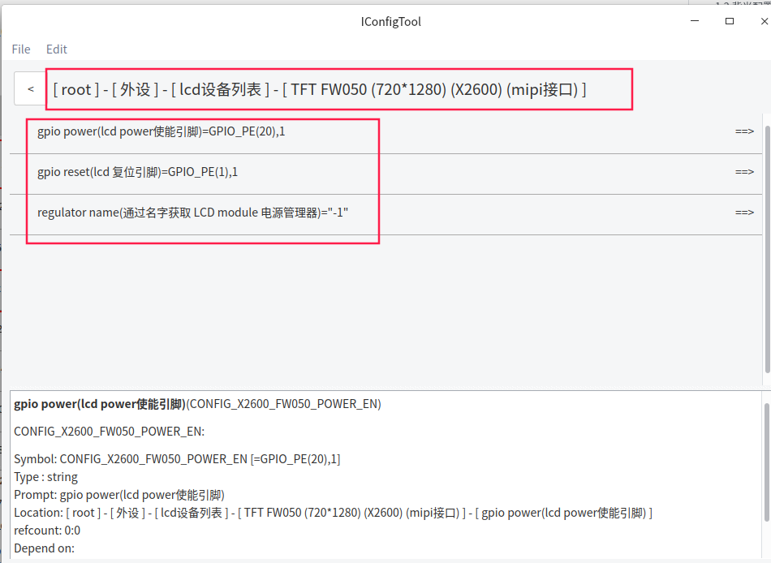
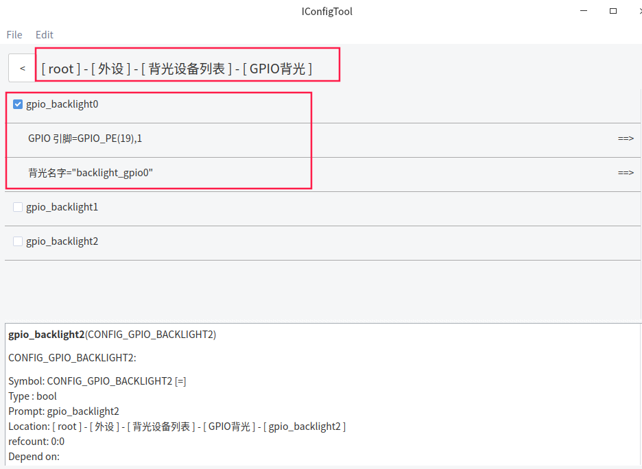
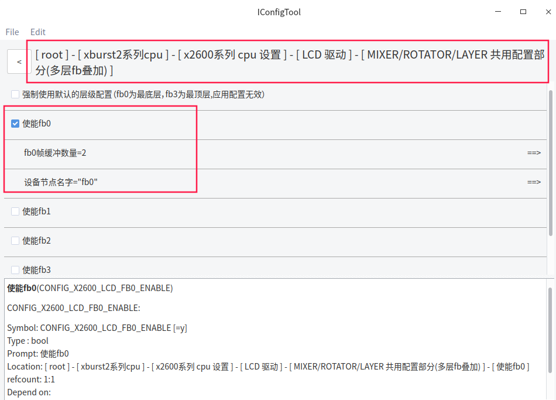
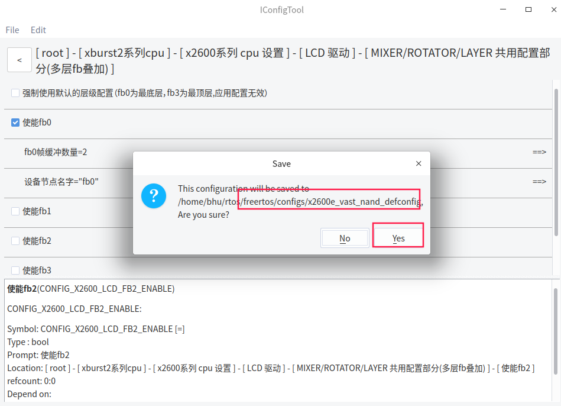

# FreeRTOS_X2600E_LCD使用文档

## 一 功能简介

   X2600处理器支持视频输出，支持显示接口如下：

- MIPI DSI interface (1920*1080@60Hz)
- LVDS interface (1280*800@60Hz)
- RGB interface (1280*800@60Hz)
- 60/80_MCU interface (640*480@60Hz)
- SPI  interface

## 二 软件配置

### 2.1 LCD相关配置

打开iconfigtool配置页面

*以PD_X2600E_VAST_V2.0开发板为例 , 屏幕为FW050（MIPI DSI interface）, 使用x2600e_vast_nand_defconfig配置 , 实际根据硬件需要配置*


lcd设备配置



### 2.2 背光配置



### 2.3 framebuffer 配置



保存配置




## 三 使用fb API编写程序实现显示效果

### 3.1 编写测试程序

将如下代码**编译**, **运行**, 轮流显示各种颜色.

> **代码位于freertos/example/driver/fb_example.c**

```c
#include <driver/fb.h>
#include <os.h>
#include <driver/backlight.h>

void fb_test(void)
{
    struct fb_info fb_info;
    struct fb_handle *fb;
    struct backlight *lcd_pwm;
    lcd_pwm = backlight_open("backlight_gpio0");
    if (lcd_pwm == NULL)
        printf("backlight_open fail.\n");
    else
        backlight_set_brightness(lcd_pwm, lcd_pwm->max_brightness);

    fb = fb_open("fb0");

    if (fb == NULL) {
        printf("open fb0 error!\n");
        return;
    }

    fb_enable(fb);
    fb_get_info(fb, &fb_info);

    if (fb_info.fb_fmt != fb_fmt_RGB888 && fb_info.fb_fmt != fb_fmt_ARGB8888 ) {
        printf("fb_test: this just support rgb888! you should change this demo\n");
        return;
    }

    int i, j;
    unsigned int *p = fb_info.fb_mem;

    for (j = 0; j < fb_info.yres; j++) {
        for (i = 0; i < fb_info.xres; i++) {
            *p++ = 0xffff0000;
        }
    }

    fb_pan_display(fb, 0);
    msleep(300);

    p = fb_info.fb_mem;
    for (j = 0; j < fb_info.yres; j++) {
        for (i = 0; i < fb_info.xres; i++) {
            *p++ = 0xff00ff00;
        }
    }

    fb_pan_display(fb, 0);
    msleep(300);

    p = fb_info.fb_mem;
    for (j = 0; j < fb_info.yres; j++) {
        for (i = 0; i < fb_info.xres; i++) {
            *p++ = 0xff0000ff;
        }
    }

    fb_pan_display(fb, 0);
    msleep(300);
}
```

### 3.2 测试程序编译和使用

在freertos/vendor目录下添加测试程序文件fb_example.c, 并在Makefile添加

```c
src-y += vendor.c fb_example.c
```

在vendor.c中引用fb_example.c中的函数, 并添加相关头文件

```c
#include <stdio.h>
#include <driver/fb.h>
#include <driver/backlight.h>
#include <os.h>

void vendor_init(void)
{
    printf("vendor init...\n");
    fb_test();
}
```


## 四 编译和烧录

```c
bhu@bhu-PC:~/rtos$ cd freertos                      
bhu@bhu-PC:~/rtos/freertos$  source build/envsetup.sh        //第一次编译需要初始化编译环境
bhu@bhu-PC:~/rtos/freertos$ make x2600e_vast_nand_defconfig
bhu@bhu-PC:~/rtos/freertos$ make 
```

```c
bhu@bhu-PC:~/rtos/freertos$ ls rtos-with-spl.bin 
rtos-with-spl.bin                                           //编译出来的文件
```

**请使用最新版烧录工具**

[ubuntu版本烧录工具请下载](ftp://ftp.ingenic.com.cn/DevSupport/Tools/USBBurner/cloner-latest-ubuntu.tar.gz)

[windows版本烧录工具请下载](ftp://ftp.ingenic.com.cn/DevSupport/Tools/USBBurner/cloner-latest-windows.zip)

**烧录配置**


## 五 Frame Buffer API相关说明

包含头文件：

```c
#include <fb.h>
```

framebuffer使用流程：

```c
1.fb_init 初始化数据
2.fb_enable 配置相关寄存器
3.fb_get_info 获取内存映射的地址,并往⾥⾯写⼊RGB数据
4.fb_display 将屏幕⾊彩数据刷新到屏幕上
```

api详解：

```c
void fb_enable(void)
功能：使能fb,主要配置fb相关的寄存器，初始化屏幕并使能电源
```

```c
void fb_disable(void) 
功能：关闭控制器时钟,以及关闭屏幕电源
```

```c
void fb_get_info(struct fbinfo *info) 
功能：获取帧相关的数据 
参数：struct fbinfo *info /*帧相关信息结构体*/
```

```c
void fb_pan_display(int frame_index) 
功能：刷新屏幕数据 （"注意：需调⽤该函数才会将数据同步到屏幕上"） 
参数：int frame_index /*刷新第⼏帧*/
```

中间参数详解：

```c
struct fbinfo {
void *fb_mem; /*内存映射的地址 */ 
unsigned int xres; /*图像x轴⻓度*/ 
unsigned int yres; /*图像y轴⻓度*/ 
unsigned int bits_per_pixel; /*⼀个像数点的位数*/ 
unsigned int bytes_per_pixel; /*⼀个像数点的字节数*/ 
unsigned int bytes_per_line; /*⼀⾏的字节数*/ 
unsigned int bytes_per_frame; /*帧的字节数*/ 
unsigned int frame_count; /*帧的数量*/
}
```

