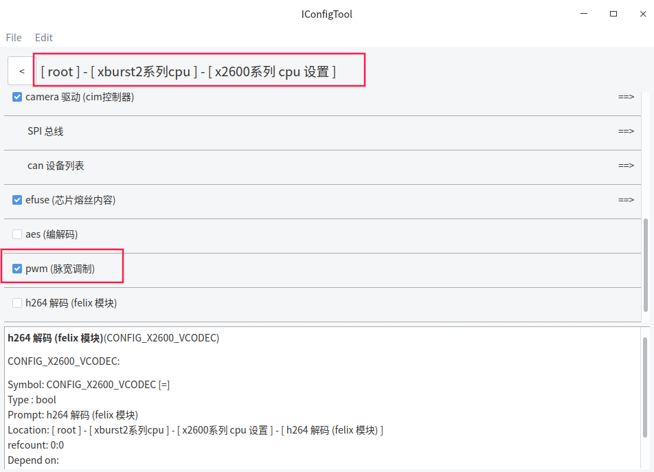
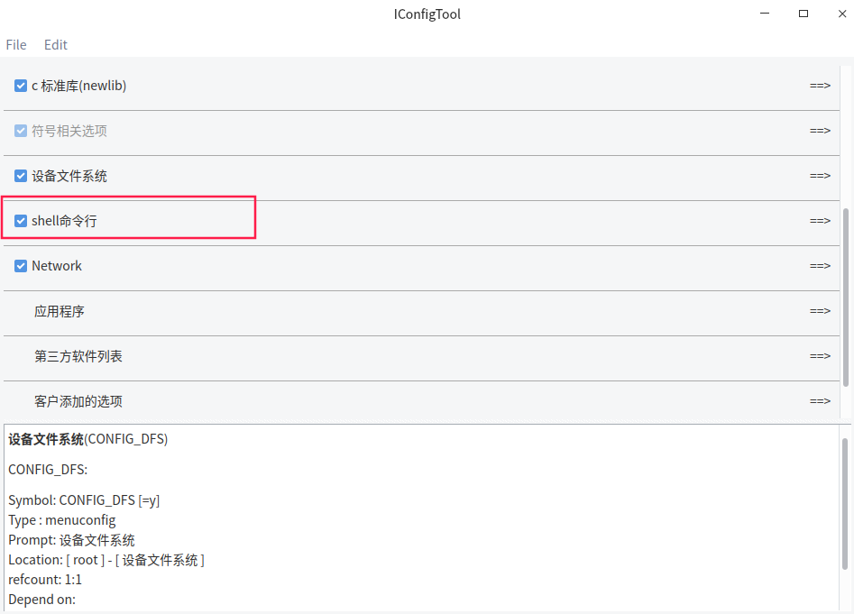

# FreeRTOS_X2600E_PWM使用文档

## 一 功能简介

PWM 

- 16 通道，输出频率最大 50Mhz，分辨率最大 500Mhz
- 支持 cpu/dma 模式

## 二 PWM配置方法

*以PD_X2600E_VAST_V2.0开发板为例 , 使用x2600e_vast_nand_defconfig配置 , 实际根据硬件需要配置*


pwm配置



## 三 PWM测试例子

### 3.1  测试代码

**pwm_test**

此处以GPIO_PC(11)和GPIO_PC(13)为例, 分别申请pwm资源, 配置pwm信息, 配置完后会打印对应通道频率, 设置pwm调制级数

**pwm_dma_test**

此处以GPIO_PC(11)为例, 申请pwm资源, 初始化PWM的dma模式 , 使用dma模式更新pwm的频率

**pwm_multi_channel_sync_test**

此处以GPIO_PC(11)和GPIO_PC(13)为例, 分别申请pwm资源, 配置pwm信息, 配置完后会打印对应通道频率 

预初始化申请到的两个pwm通道的使能, 设置pwm调制级数, 两个pwm通道同时开启

**(需要pwm多通道同时开启后才会输出波形,  预初始化后设置pwm调制级数并不会工作)**

**pwm_dma_multi_channel_sync_test**

此处以GPIO_PC(11)和GPIO_PC(13)为例, 分别申请pwm资源,  预初始化申请到的两个pwm通道的使能

初始化PWM的dma模式 , 使用dma模式更新pwm的频率,两个pwm通道同时开启

**(需要pwm多通道同时开启后才会输出波形,  预初始化后使用dma模式更新pwm的频率并不会工作)**

> **代码位于freertos/example/driver/pwm_example.c**

```c
#include <driver/pwm.h>
#include <driver/gpio.h>
#include <common.h>

struct pwm_config_data pwm0_config = {
    .shutdown_mode = PWM_graceful_shutdown, /* 设置PWM停止输出时以一个完整的周期结束 */
    .idle_level = PWM_idle_low, /* 设置PWM空闲电平为低电平 */
    .accuracy_priority = PWM_accuracy_levels_first, /* 设置输出PWM时，优先满足pwm的级数 */
    .freq = 120000, /* 设置PWM频率为12kHz，在选择了优先满足PWM级数的情况下最终调制后的频率不等于120kHz */
    .levels = 5000, /* 设置PWM最大级数为5000 */
    .clk_id = "rtc", /* 设置PWM时钟源为RTC，可参考对应SOC中的clk.h,选填"pclk" " "rtc" "ext1"*/
};

void pwm0_test(void)
{
    int pwm0 = pwm_request(GPIO_PC(11), "pwm0");

    pwm_config(pwm0, &pwm0_config);

    /* 如果有需要可以使用 pwm_get_freq 获取 PWM 最终调制后的频率 */
    printf("real freq: %ld\n", pwm_get_freq(pwm0));

    pwm_set_level(pwm0, 500);/* 设置 level 值，输出相对应的 PWM */

    mdelay(1000);

    pwm_set_level(pwm0, 0);/* 当 level 值为0， 停止输出 PWM */
}

struct pwm_config_data pwm1_config = {
    .shutdown_mode = PWM_abrupt_shutdown, /* 设置PWM在停止输出时立刻将pwm设置成空闲时电平 */
    .idle_level = PWM_idle_high,    /* 设置PWM空闲电平为高电平 */
    .accuracy_priority = PWM_accuracy_freq_first, /* 设置输出PWM时，优先满足PWM调制后频率的精度 */
    .freq = 1000000, /* 设置PWM调制后频率为1MHz */
    .levels = 100, /* 设置PWM最大级数为100 */
    .clk_id = NULL, /* 对于置NULL的时钟源，默认选择ext1作为时钟源 */
};

void pwm1_test(void)
{
    int pwm1 = pwm_request(GPIO_PC(13), "pwm1");

    pwm_config(pwm1, &pwm1_config);

    /* 如果有需要可以使用 pwm_get_freq 获取 PWM 最终调制后的频率 */
    printf("real freq: %ld\n", pwm_get_freq(pwm1));

    pwm_set_level(pwm1, 50);

    mdelay(100);

    pwm_release(pwm1);
}

void pwm_test(void)
{
    pwm0_test();

    pwm1_test();
}

//////////////////////////////////////////////
struct pwm_data pwm_data[] = {
    {
        .low = 1000,
        .high = 1000,
    },
    {
        .low = 2000,
        .high = 2000,
    },
    {
        .low = 3000,
        .high = 3000,
    },
    {
        .low = 4000,
        .high = 4000,
    },
};

struct pwm_dma_data pwm_dma_data = {
    .data = pwm_data,
    .data_count = 4,
    .dma_loop = 1,//循环dma模式：函数不会阻塞，需要调用pwm_dma_disable_loop停止dma
};

struct pwm_dma_config dma_config;

void pwm_dma_test(void)
{
    int rate;
    int pwm0 = pwm_request(GPIO_PC(11), "pwm1");

    memset(&dma_config, 0, sizeof(struct pwm_dma_config));
    dma_config.idle_level = PWM_idle_low;
    dma_config.start_level = PWM_start_high;
    rate = pwm_dma_init(pwm0, &dma_config);
    if (rate < 0) {
        printf("pwm_dma_init failed!\n");
    }

    pwm_dma_update(pwm0, &pwm_dma_data);
}


struct pwm_config_data pwm0_sync_config = {
    .shutdown_mode = PWM_graceful_shutdown, /* 设置PWM停止输出时以一个完整的周期结束 */
    .idle_level = PWM_idle_low, /* 设置PWM空闲电平为低电平 */
    .accuracy_priority = PWM_accuracy_freq_first, /* 设置输出PWM时，优先满足pwm的频率 */
    .freq = 1000000, /* 设置PWM频率为1MHz */
    .levels = 500, /* 设置PWM最大级数为500 */
};

struct pwm_config_data pwm1_sync_config = {
    .shutdown_mode = PWM_graceful_shutdown, /* 设置PWM停止输出时以一个完整的周期结束 */
    .idle_level = PWM_idle_low, /* 设置PWM空闲电平为低电平 */
    .accuracy_priority = PWM_accuracy_freq_first, /* 设置输出PWM时，优先满足pwm的频率 */
    .freq = 2000000, /* 设置PWM频率为2MHz */
    .levels = 100, /* 设置PWM最大级数为100 */
};

void pwm_multi_channel_sync_test(void)
{
    int pwm0 = pwm_request(GPIO_PC(11), "pwm0");
    int pwm1 = pwm_request(GPIO_PC(13), "pwm1");
    unsigned int channels = 0;

    pwm_config(pwm0, &pwm0_sync_config);
    pwm_config(pwm1, &pwm1_sync_config);

    /* 如果有需要可以使用 pwm_get_freq 获取 PWM 最终调制后的频率 */
    printf("real freq: %ld\n", pwm_get_freq(pwm0));
    printf("real freq: %ld\n", pwm_get_freq(pwm1));
    
	pwm_set_not_really_enable(pwm0, 1);
    pwm_set_not_really_enable(pwm1, 1);

    pwm_set_level(pwm0, 100);
    pwm_set_level(pwm1, 50);

    channels |= (1 << pwm0);
    channels |= (1 << pwm1);

    pwm_enable_channels(channels);

    mdelay(5000);

    pwm_disable_channels(channels);

    pwm_release(pwm0);
    pwm_release(pwm1);
}


struct pwm_data pwm0_dma_sync_data[] = {
    {
        .low = 1000,
        .high = 1000,
    },
    {
        .low = 2000,
        .high = 2000,
    },
    {
        .low = 3000,
        .high = 3000,
    },
    {
        .low = 4000,
        .high = 4000,
    },
};

struct pwm_data pwm1_dma_sync_data[] = {
    {
        .low = 4000,
        .high = 4000,
    },
    {
        .low = 3000,
        .high = 3000,
    },
    {
        .low = 2000,
        .high = 2000,
    },
    {
        .low = 1000,
        .high = 1000,
    },
};

struct pwm_dma_data pwm0_dma_sync_data_config = {
    .data = pwm0_dma_sync_data,
    .data_count = 4,
    .dma_loop = 1,
};

struct pwm_dma_data pwm1_dma_sync_data_config = {
    .data = pwm1_dma_sync_data,
    .data_count = 4,
    .dma_loop = 1,
};

struct pwm_dma_config pwm0_dma_sync_config;
struct pwm_dma_config pwm1_dma_sync_config;

void pwm_dma_multi_channel_sync_test(void)
{
    int pwm0 = pwm_request(GPIO_PC(11), "pwm0");
    int pwm1 = pwm_request(GPIO_PC(13), "pwm1");
    unsigned int channels = 0;

    pwm_set_not_really_enable(pwm0, 1);
    pwm_set_not_really_enable(pwm1, 1);

    memset(&pwm0_dma_sync_config, 0, sizeof(struct pwm_dma_config));
    pwm0_dma_sync_config.idle_level = PWM_idle_low;
    pwm0_dma_sync_config.start_level = PWM_start_high;

    memset(&pwm1_dma_sync_config, 0, sizeof(struct pwm_dma_config));
    pwm1_dma_sync_config.idle_level = PWM_idle_low;
    pwm1_dma_sync_config.start_level = PWM_start_high;

    pwm_dma_init(pwm0, &pwm0_dma_sync_config);
    pwm_dma_init(pwm1, &pwm1_dma_sync_config);

    pwm_dma_update(pwm0, &pwm0_dma_sync_data_config);
    pwm_dma_update(pwm1, &pwm1_dma_sync_data_config);

    channels |= (1 << pwm0);
    channels |= (1 << pwm1);
    pwm_enable_channels(channels);

    mdelay(5000);//延时5s后关闭pwm

    pwm_disable_channels(channels);

    pwm_release(pwm0);
    pwm_release(pwm1);
}
//////////////////////////////////////////////
```

### 3.2 测试程序编译和使用

在freertos/vendor目录下添加测试程序文件pwm_example.c, 并在Makefile添加

```c
src-y += vendor.c  pwm_example.c
```

在vendor.c中引用pwm_example.c中的函数, 并添加相关头文件

```c
#include <stdio.h>
#include <driver/pwm.h>
#include <driver/gpio.h>
#include <common.h>

void vendor_init(void)
{
    printf("vendor init...\n");
    pwm_test();
    pwm_multi_channel_sync_test();
    pwm_dma_multi_channel_sync_test();
}
```

## 四 编译和烧录

```c
bhu@bhu-PC:~/rtos$ cd freertos                      
bhu@bhu-PC:~/rtos/freertos$  source build/envsetup.sh        //第一次编译需要初始化编译环境
bhu@bhu-PC:~/rtos/freertos$ make x2600e_vast_nand_defconfig
bhu@bhu-PC:~/rtos/freertos$ make 
```

```c
bhu@bhu-PC:~/rtos/freertos$ ls rtos-with-spl.bin 
rtos-with-spl.bin                                           //编译出来的文件
```

**请使用最新版烧录工具**

```c
wget ftp://ftp.ingenic.com.cn/DevSupport/Tools/USBBurner/cloner-latest-ubuntu.tar.gz 
wget ftp://ftp.ingenic.com.cn/DevSupport/Tools/USBBurner/cloner-latest-windows.zip
```

**烧录配置**


## 五 测试结果

```c
[0.150926] vendor init...
[0.151027] real freq: 120000         //GPIO_PC(11)开启pwm通道后的频率打印
[1.151172] real freq: 1000000        //GPIO_PC(13)开启pwm通道后的频率打印
[1.251290] real freq: 1000000        //多通道同时开启GPIO_PC(11)频率的打印
[1.251392] real freq: 2000000        //多通道同时开启GPIO_PC(13)频率的打印

```

可以使用示波器测试gpio申请到的pwm通道频率是否与设置一致

## 六 PWM 应用接口分析

> **相关源码见freertos/drivers目录下的pwm.c**

包含头文件：

```c
#include <driver/gpio.h>
#include <driver/pwm.h>
```

pwm使用流程：

```c
1.申请 PWM 资源                   pwm_request
2.配置 PWM 信息                   pwm_config
3.设置 PWM 调制级数                pwm_set_level
4.释放 PWM 资源                   pwm_release
5.获取 PWM 调制后频率              pwm_get_freq
6.初始化PWM的dma模式               pwm_dma_init
7.使用dma模式更新PWM的频率          pwm_dma_update
8.停止dma的循环模式                pwm_dma_disable_loop
9.用于多通道同时开启时的使能         pwm_set_not_really_enable
10.用于多通道同时开启时的失能        pwm_set_not_really_disable
11.多通道同时开启                  pwm_enable_channels
12.多通道同时关闭                  pwm_disable_channels
```

api详解：

```c
int pwm_request(int gpio, const char *name)
功能：申请 PWM 资源
参数：
                gpio：指定 GPIO 号
                name：PWM 名称
返回值：
                成功：返回申请的PWM通道号
                失败：负值
```

```c
int pwm_config(int ch, struct pwm_config_data* config)
功能：设置 PWM 信息
参数：
                ch：PWM 通道号
                config：PWM 配置数据
返回值：
                成功 ： 0
                失败 ： 非0
```

```c
void pwm_release(int ch)
功能：释放 PWM 资源
参数：
                ch：PWM 通道号
```

```c
void pwm_set_level(int ch, unsigned long level)
功能：设置 PWM 调制级数
参数：
                ch：PWM 通道号
                level：pwm 调制级数，即一个周期内非空闲电平长度
```

```c
unsigned long pwm_get_freq(int ch)
功能：获取当前已设置的时钟频率，并将其返回
参数：
                ch：PWM 通道号
返回值：
                获取 PWM 最终调制后的频率
```

```c
int pwm_dma_init(int id, struct pwm_dma_config *dma_config)
功能：初始化 PWM 的 dma 模式
参数：
                id：PWM 通道号
                dma_config：PWM dma 模式的配置信息
返回值：
                成功 ： 返回 dma 模式频率
                失败 ： 返回 -1
```

```c
int pwm_dma_update(int id, struct pwm_dma_data *dma_data)
功能：使用 dma 模式连续更新 PWM 的频率
      普通dma模式: 函数会阻塞到 dma 数据全部转换成对应pwm输出(多通道同时开启模式下不阻塞)
      循环dma模式：函数不会阻塞，需要调用pwm_dma_disable_loop停止dma
参数：
                id：PWM 通道号
                dma_data：PWM dma 模式需要输出的数据
返回值：
                成功 ： 返回 0
                失败 ： 返回 -1
```

```c
int pwm_dma_disable_loop(int id)
功能：停止 dma 的循环模式
参数：
                id：PWM 通道号
返回值：
                成功 ： 返回 0
                失败 ： 返回 -1
```

```c
void pwm_set_not_really_enable(int id, int enable)
功能：预初始化功能的使(失)能，使能后在调用pwm_enable_channels之前不会开始工作
      即当使用该功能时，调用pwm_set_level和pwm_dma_update只是设置，不会工作
      只有当调用pwm_enable_channels时才会输出波形
      pwm dma的非loop模式下，需要知道是否完成dma传输的话
      要在pwm_dma_init时传入dma_config->dma_complete_cb
参数：
                id：PWM 通道号
                enable：是否使用
```

```c
void pwm_set_not_really_disable(int id, int enable)
功能：失能后在输出过程中不完全关闭pwm的功能，保证在下次使用时相位的一致性
     直接调用pwm_release依然会关闭pwm功能，过程中将占空比设为0或100时不会关闭pwm
     //与上面的函数功能并不成对
参数：
            id：PWM 通道号
            enable：是否使用
```

```c
void pwm_enable_channels(unsigned int channels)
功能：多通道同时开启
参数：
                channels：需要启动的通道，每位bit对应通道号
```

```c
void pwm_disable_channels(unsigned int channels)
功能：多通道同时关闭
参数：
                channels：需要关闭的通道，每位bit对应通道号
```

中间参数详解：

```c
PWM配置结构体
struct pwm_config_data {
    enum pwm_shutdown_mode shutdown_mode;  // 设置PWM波停止后的模式
    enum pwm_idle_level idle_level;  // 空闲电平
    enum pwm_accuracy_priority accuracy_priority;  // 设置频率精度和级数精度优先级
    char *clk_id;  //指定时钟源ID
    unsigned long freq;  // 频率
    unsigned long levels;  // PWM调制的级数
};
```

```c
PWM波停止后的模式枚举
enum pwm_shutdown_mode {
    PWM_graceful_shutdown,  // pwm停止输出时,尽量保证pwm的信号结尾是一个完整的周期
    PWM_abrupt_shutdown,  // pwm停止输出时,立刻将pwm设置成空闲时电平
};
```

```c
空闲电平枚举
enum pwm_idle_level {
    PWM_idle_low,  // pwm 空闲时电平为低
    PWM_idle_high,  // pwm 空闲时电平为高
};
```

```c
频率精度和级数精度优先级枚举
enum pwm_accuracy_priority {
    PWM_accuracy_freq_first,  // 优先满足pwm的目标频率的精度,级数可能不准确
    PWM_accuracy_levels_first,  // 优先满足pwm的级数设置,pwm频率可能不准确
};
```

```c
PWM dma 模式的配置结构体
struct pwm_dma_config {
    enum pwm_idle_level idle_level;  // 空闲电平
    enum pwm_dma_start_level start_level;  // 起始电平
    /*dma 回调函数，该参数为 NULL 时使用默认回调，为避免指针异常必须进行初始化
      仅在多通道同时开启且为dma非loop模式下时，可选择使用该函数，平常使用赋值为NULL*/
    void (*dma_complete_cb)(void *data);
};
```

```c
PWM dma 模式的数据信息
struct pwm_dma_data {
    struct pwm_data *data;
    unsigned int data_count;
    unsigned int dma_loop;
};
```

```c
dma 模式的起始电平枚举
enum pwm_dma_start_level {
    PWM_start_low,   /* pwm dma模式的起始电平为低 */
    PWM_start_high,  /* pwm dma模式的起始电平为高 */
};
```

```c
dma 模式需要产生的高低电平个数
struct pwm_data {
    /* 低电平个数 */
    unsigned low:16;
    /* 高电平个数 */
    unsigned high:16;
};
```

```c
需要确保 dma 数据的高低电平不能有零计数，否则需要手动把该宏定义打开
#define PWM_CHECK_DMA_DATA
```

## 七 PWM命令详解

> **相关源码见freertos/shell/cmds/drivers目录下的cmds_pwm.c**

### 7.1 shell命令

```c
pwm_request <gpio> <freq> <max_level> [active_level]
功能：请求pwm和配置
参数：gpio                         //io口的名字
              freq                //频率
              max_level           //PWM调制的级数
              active_level        //活跃电平
example：
                     pwm_request PC25 2000000 300 1
```

```c
pwm_setlevel <pwm_id> <level>
功能：设置pwm级数
参数：pwm_id               //PWM 通道号
     level               //pwm 调制级数，即一个周期内非空闲电平长度
example:
                    pwm_setlevel 0 200
```

```c
pwm_free <pwm_id>
功能：释放pwm资源
参数：pwm_id         //PWM 通道号
example：
                     pwm_free 0
```

### 7.2 shell配置



### 7.3 具体例⼦

```c
$ pwm_request PC12 2000000 300 1                                                 
pwm_id = 13
pwm_freq = 2000000, pwm_levels = 300
idle_level = PWM_idle_high!
current freq: 2000000

$ pwm_setlevel 13  200                                                           
pwm_level = 200

$ pwm_free 13                                                                    
release pwm_13

```


