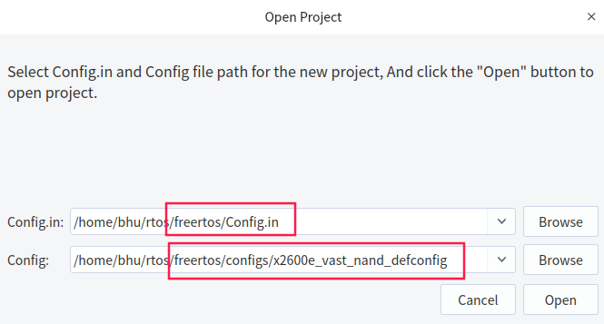
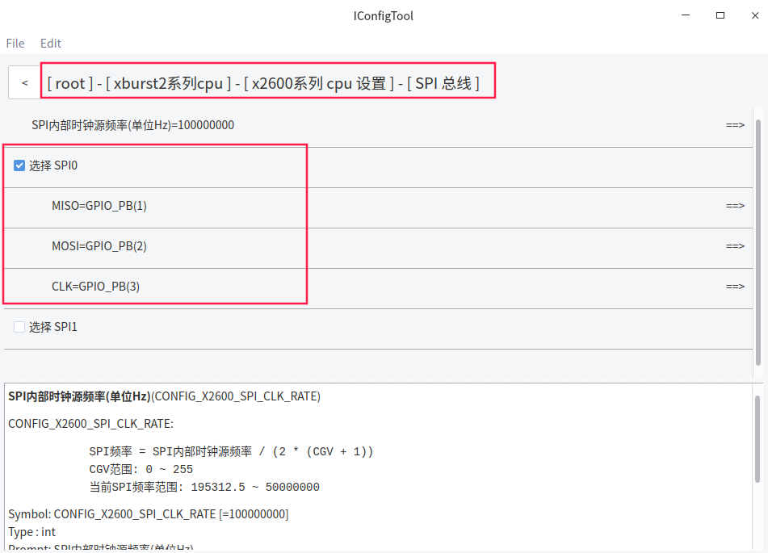
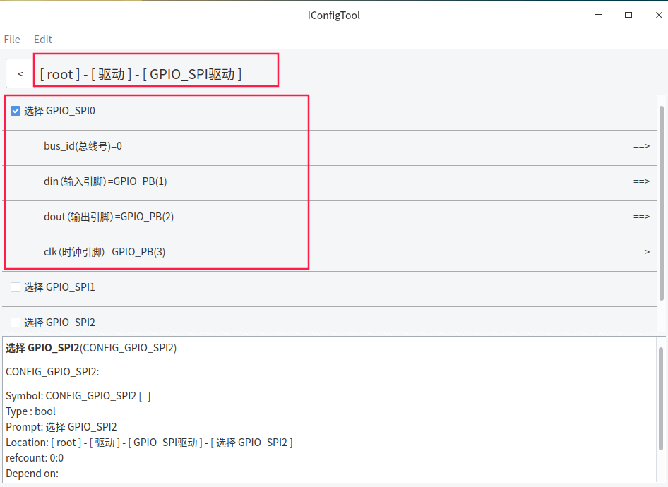
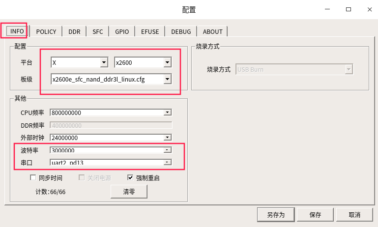
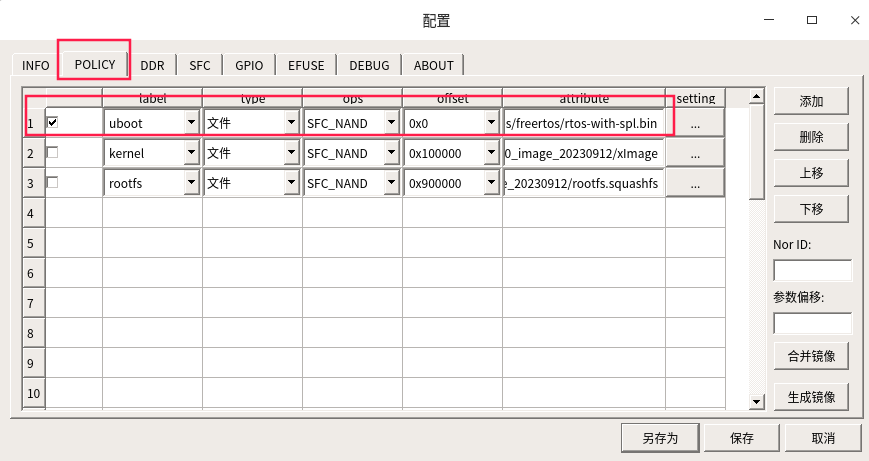
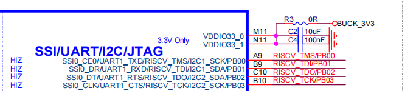
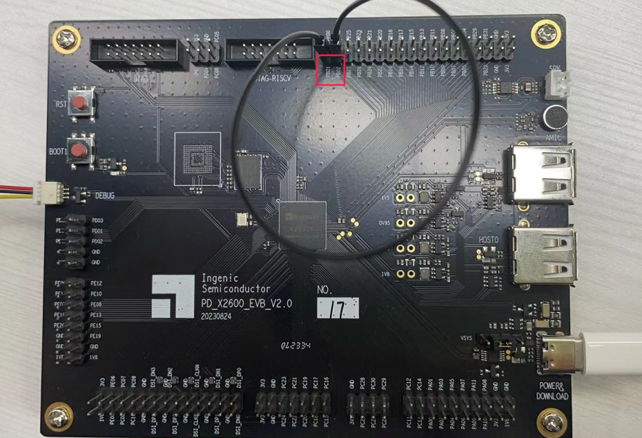

# FreeRTOS_X2600E_SPI使用文档

## 一 功能简介

SPI x2，SPI Slave x1

- 支持 National’s Microwire，TI’s SSP 和 Motorola’s SPI
- 支持 Full-duplix，transimit-only 和 receive-only
- 传输字节序可配置：MSB 或 LSB

当不能正常使用SPI控制器驱动时, 请使用SPI控制器驱动所使用到的IO引脚来配置GPIO_SPI驱动, 从而验证是硬件出现异常还是SPI控制器驱动出现异常

## 二 硬件SPI配置方法

*以PD_X2600_EVB_V2.0开发板为例 ,使用x2600e_vast_nand_defconfig配置 , 实际根据硬件需要配置*



SPI控制器驱动配置




## 三 GPIO模拟SPI配置方法




## 四 SPI测试例子

### 4.1  测试代码

> **代码位于freertos/example/driver/spi_example.c**

```c
#include <common.h>
#include <driver/spi.h>
#include <driver/gpio.h>
#include <os.h>

struct spi_config_data config = {
    .id = 0,
    .cs_pin = GPIO_PB(00),              /* 指定 GPIO 作为 CS 引脚 */
    .clk_rate = 1 * 100 * 1000,         /* 配置时钟频率 */
    .cs_valid_level = Spi_valid_high,   /* 配置spi有效电平为高 */
    .tx_endian = Spi_endian_msb_first,
    .rx_endian = Spi_endian_msb_first,
    .bits_per_word = 8,     /* 数据位宽 8,即传输过程中的最小数据单位为8bit */
    .spi_pha = 0,
    .spi_pol = 0,
    .loop_mode = 0,
};

void spi_test(void *data)
{
    u8 tx_buf1[] = {0x01, 0x02, 0x03 ,0X04, 0x05, 0x06, 0x07 ,0x08};
    u8 rx_buf1[64];

    u8 tx_buf2[] = {0x11, 0x12, 0x13 ,0X14, 0x15, 0x16, 0x17 ,0x18};
    u8 rx_buf2[64];

    int len1 = sizeof(tx_buf1)/sizeof(tx_buf1[0]);
    int len2 = sizeof(tx_buf2)/sizeof(tx_buf2[0]);
    struct spi_message msg[] = {
        {
            .tx_buf = tx_buf1,  /* tx_buf可以为空,表示只接收不发送 */
            .rx_buf = rx_buf1,  /* rx_buf可以为空,表示只发送不接收 */
            .tlen  = len1,      /* tlen 可以为 0,表示只接收不发送 */
            .rlen  = len1,      /* rlen 可以为 0,表示只发送不接收 */
            .cs_change = 1,     /* 第一个transfer结束改变 cs 电平, 0 表示传输结束不改变 */
        },
        {
            .tx_buf = tx_buf2,
            .rx_buf = rx_buf2,
            .tlen  = len2,
            .rlen  = len2,
            .cs_change = 0,     /* 最后一次传输结束都将改变 cs 电平 */
        },
    };

    struct spi_device *spi = spi_register(&config);

    spi_transfer(spi, msg, sizeof(msg)/sizeof(msg[0]));

    printf("len1 = %d, rx_buf = %x, %x\n", len1, rx_buf1[0],rx_buf1[len1-1]);
    printf("len2 = %d, rx_buf = %x, %x\n", len2, rx_buf2[0],rx_buf2[len2-1]);

    spi_unregister(spi);
}

void test_main(void)
{
    thread_create("spi_test", 2048, spi_test, NULL);
}
```

### 4.2 测试程序编译和使用

在freertos/vendor目录下添加测试程序文件spi_example.c, 并在Makefile添加

```c
src-y += vendor.c  spi_example.c
```

在vendor.c中引用spi_example.c中的函数, 并添加相关头文件

```c
#include <stdio.h>
#include <common.h>
#include <driver/spi.h>
#include <driver/gpio.h>
#include <os.h>

void vendor_init(void)
{
    printf("vendor init...\n");
    spi_test();
    
}
```


## 五 编译和烧录

```c
bhu@bhu-PC:~/rtos$ cd freertos                      
bhu@bhu-PC:~/rtos/freertos$  source build/envsetup.sh        //第一次编译需要初始化编译环境
bhu@bhu-PC:~/rtos/freertos$ make x2600e_vast_nand_defconfig
bhu@bhu-PC:~/rtos/freertos$ make 
```

```c
bhu@bhu-PC:~/rtos/freertos$ ls rtos-with-spl.bin 
rtos-with-spl.bin                                           //编译出来的文件
```

**请使用最新版烧录工具**

[ubuntu版本烧录工具请下载](ftp://ftp.ingenic.com.cn/DevSupport/Tools/USBBurner/cloner-latest-ubuntu.tar.gz)

[windows版本烧录工具请下载](ftp://ftp.ingenic.com.cn/DevSupport/Tools/USBBurner/cloner-latest-windows.zip)

**烧录配置**






## 六 测试验证

验证需要短接开发板spi0的tx和rx,  根据原理图短接开发板的PB01和PB02







串口打印信息：

```c
[10.107865] vendor init...
[10.107971] SPI0: user set freq: 100000, the real freq: 195312
[10.108878] len1 = 8, rx_buf = 1, 8
[10.108999] len2 = 8, rx_buf = 11, 18

```

## 七 硬件SPI应用接口分析

> **相关源码见freertos/drivers目录下的spi.c**

包含头文件：

```c
#include <driver/gpio.h>
#include <driver/spi.h>
```

spi使用流程：

```c
1.初始化spi，spi_init
2.定义spi配置信息结构体struct spi_config_data
3.配置spi结构体节点，spi_register
4.配置传送/接收结构体，struct spi_message
5.调用传输函数，spi_transfer
6.释放资源，spi_unregister
```

api详解：

```c
struct spi_device *spi_register(struct spi_config_data *config)
功能：SPI 设备注册
参数：struct spi_config_data *config /*包含spi配置信息*/
返回值：struct spi_device /*SPI从设备句柄*/
```

```c
void spi_transfer(struct spi_device *spi, struct spi_message *msg, int count);
功能：spi数据传输。
参数：
struct spi_device *spi   /*从设备句柄*/
struct spi_message *msg  /*msg 结构体,包含传输过程的相关信息*/
int count     /*一个msg中包含的transfer的数目*/
"注意：函数运行时会阻塞，在线程上下文使用的时候会引起任务调度，在中断上下文使用时会轮询阻塞。"
```

```c
void spi_unregister(struct spi_device *spi)
功能：释放SPI资源
参数：struct spi_device *spi /*从设备句柄*/
```

中间参数详解：

```c
SPI从设备句柄：
struct spi_device {           /*spi设备句柄，不需要修改*/
             struct spi_config_data config;
             int spi_bus_id;
             struct spi_bus *spi_bus;
             struct list_head link;
};

spi_config_data结构体，包含SPI的配置信息：
struct spi_config_data {
             unsigned int id;                 /*SPI 控制器 ID*/
             unsigned int cs_pin;            /*指定作为 cs 脚的 GPIO*/
             char *name;                    /*name 仅作为一个标识*/
             unsigned int clk_rate;        /*时钟频率(默认为 1*1000*1000)*/
             enum spi_cs_valid_level cs_valid_level;  /*有效电平*/

             enum spi_data_endian tx_endian;
             enum spi_data_endian rx_endian;
             /*数据传输的大小端模式选择,具体可选类型为 spi_data_endian 所定义的类型*/

             unsigned int bits_per_word;
             /* bits_per_word 代表数据的位宽.
             例如:bits_per_word = 32 时,SPI传输过程中的最小数据单位为32bit.*/

             unsigned int spi_pol;
             unsigned int spi_pha;
             /*
             * 极性 spi_pol :
             * 当spi_pol=0，在时钟空闲即无数据传输时,clk电平为低电平
             * 当spi_pol=1，在时钟空闲即无数据传输时,clk电平为高电平
             * 相位 spi_pha :
             * 当spi_pha=0，表示在第一个跳变沿开始传输数据，下一个跳变沿完成传输
             * 当spi_pha=1，表示在第二个跳变沿开始传输数据，下一个跳变沿完成传输
             */

             unsigned int loop_mode; /* 循环模式，可用于测试 */
};

spi_message结构体，包含传输过程的相关信息：
struct spi_message {
             /* NOTE:在君正平台下,dma传输需要保证发送和接收的个数相等,其他传输方式不作要求.
             * tlen 发送数据的个数.发送数据的大小＝发送数据的个数(tlen)＊数据对应的字节长度
             * rlen 接收数据的个数.接收数据的大小＝接收数据的个数(rlen)＊数据对应的字节长度
             *
             * bits_per_word 范围是 0～32；
             * 建议选择 8、16、32 作为 bits_per_word 的值，其余的可参考对应的驱动程序.
             * 当 bits_per_word = 8,对应的数据字节长度为1.
             * 当 bits_per_word = 16,对应的数据字节长度为2.
             * 当 bits_per_word = 32,对应的数据字节长度为4.
             */
             int tlen;
             int rlen;
             const void *tx_buf; /* 发送缓冲区 */
             void *rx_buf;      /*接收缓冲区*/
             int use_dma;      /*0:不使用dma方式传输；1：使用dma方式传输 */
             int cs_change;   /*传输结束时,改变cs的状态 */
};
```


## 八 GPIO_SPI 应用接口分析

> **相关源码见freertos/drivers目录下的gpio_spi.c**

包含头文件：

```c
#include <driver/gpio_spi.h>
```

GPIO_SPI使用流程：

```c
在调用注册函数前先调用gpio_spi_add_bus添加总线
在调用注销后调用gpio_spi_remove_bus删除总线
```

api详解：

```c
struct spi_bus* gpio_spi_add_bus(struct gpio_spi_bus_data *spi);
功能：向总线链表添加总线。节点
参数：struct gpio_spi_bus_data *spi   // 总线数据
返回值：总线信息结构体
```

```c
void gpio_spi_remove_bus(struct spi_bus *spi_bus);
功能：删除总线链表中总线节点。
参数：struct spi_bus *spi_bus                          // 总线信息
"注意：其他 注册 传输 注销api请参考适配器spi函数，此三个函数与适配器共用同一个接口。"
```

中间参数详解

```c
gpio_spi总线数据结构体：
struct gpio_spi_bus_data {
             int spi_bus_id;      // 总线编号
             int gpio_dout;      // 输出引脚
             int gpio_din;      // 输入引脚
             int gpio_clk;     // 时钟引脚
};
"注意：还有结构体参数请参考spi中间参数详解。"
```


## 九 SPI shell命令详解

> **相关源码见freertos/shell/cmds/drivers目录下的cmds_spi.c**

### 9.1 shell命令

```c
spi_read_write <BUS_NUM> <CS_GPIO> <CS_VAILD_LEVEL> <PHA> <POL> <DATA0> [DATA....]
功能：SPI传输
参数：BUS_NUM          //spi总线号
     CS_GPIO          //cs 脚的 GPIO
     CS_VAILD_LEVEL   //有效电平
     PHA              //相位(当PHA=0，表示在第一个跳变沿开始传输数据，下一个跳变沿完成传输
                      //当PHA=1，表示在第二个跳变沿开始传输数据，下一个跳变沿完成传输)
     POL              //极性(当POL=0，在时钟空闲即无数据传输时,clk电平为低电平
                      //当POL=1，在时钟空闲即无数据传输时,clk电平为高电平)
     <DATA0> [DATA....]     //数据（单位：16进制）
example:
           spi_read_write SPI0 PC00 1 PHA0 POL0 0x10 0x20
```

### 9.2 shell配置


### 9.3 具体例⼦

> **验证需要短接开发板spi0的tx和rx,  根据原理图短接开发板的PB01和PB02**

```c
$ spi_read_write SPI0 PB00 1 PHA0 POL0 0x10 0x20
rx_buf[0] = 10
rx_buf[1] = 20
```


