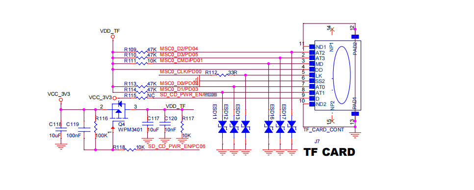
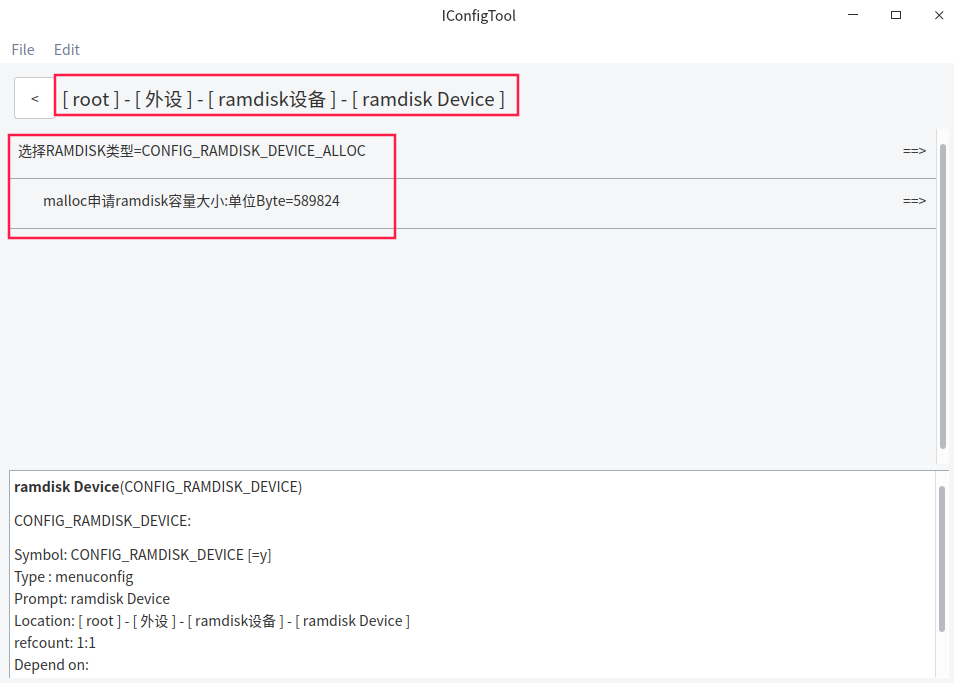
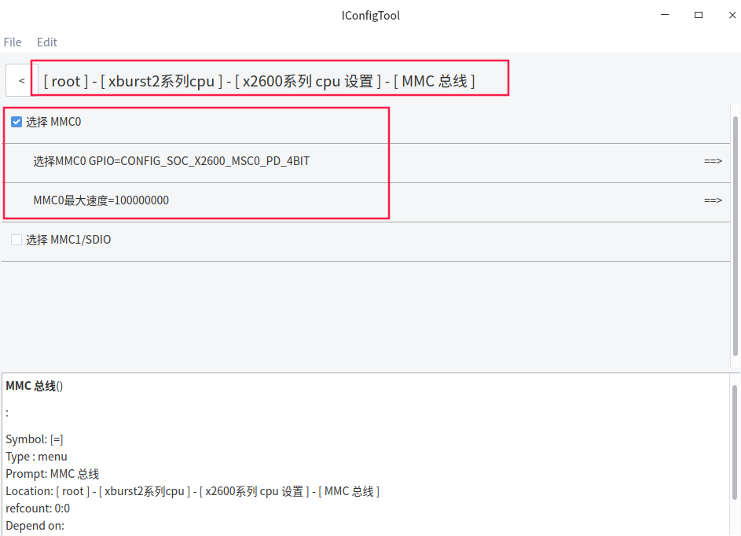
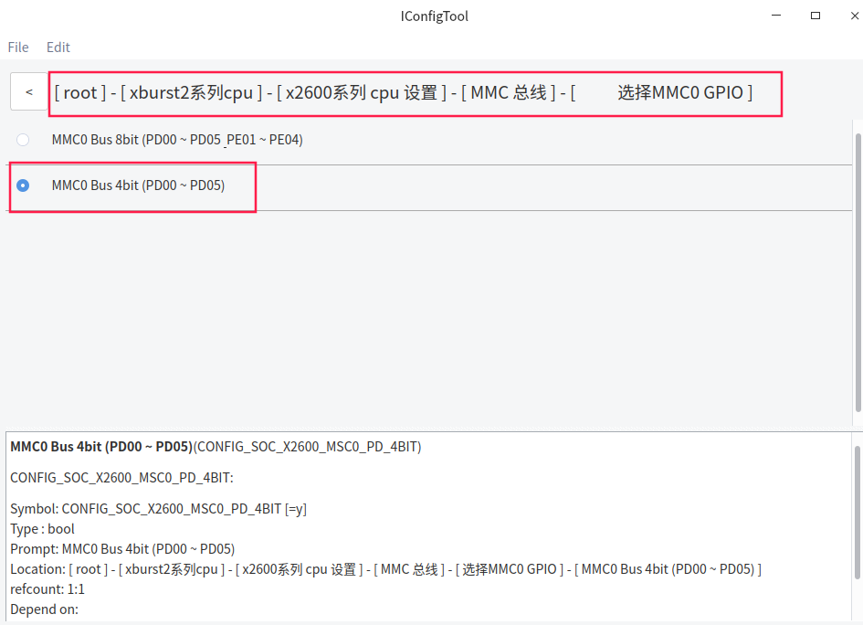
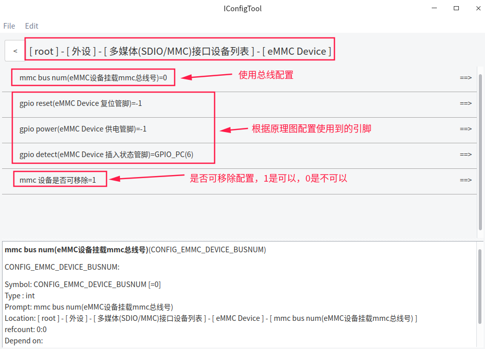
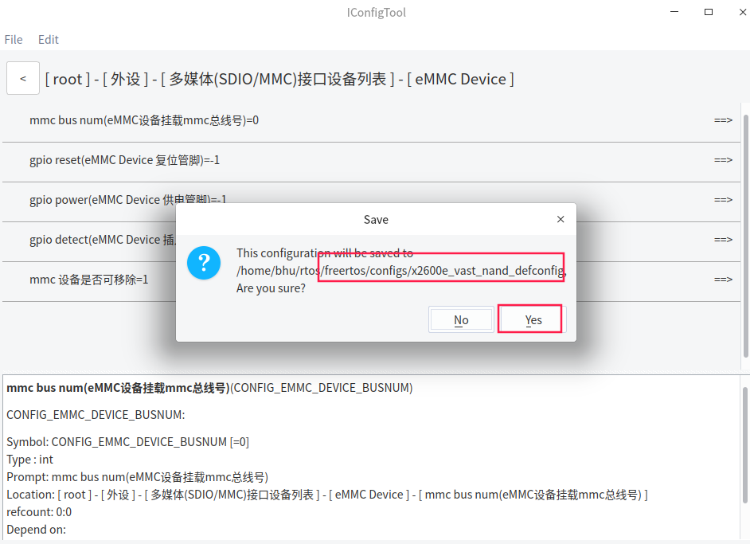
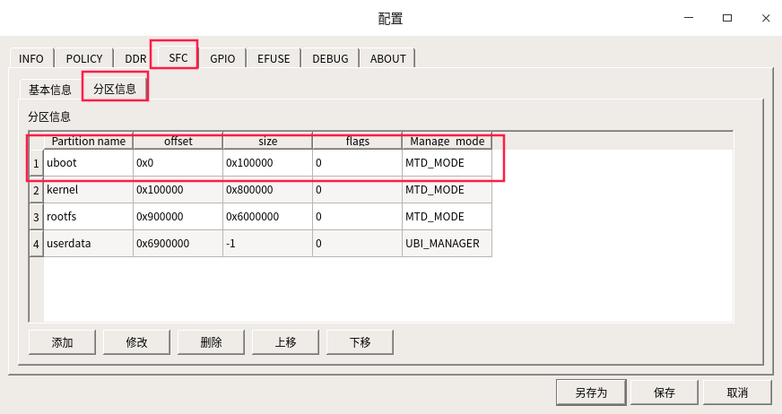

# FreeRTOS_X2600E_TF卡使用文档

## 一 功能简介

Ramdisk介绍:

​						Ramdisk实际上是从内存中划出⼀部分作为⼀个分区使⽤（⽤内存模拟flash）, 使⽤时我们创建⼀ 个ramdisk作为根⽬录"/"的存储空间, 在根⽬录下创建挂载点．

FAT⽂件系统挂载介绍: 

​							   		使⽤⽂件系统前,先确定分区中是否存在FAT16/32或exFAT⽂件系统, 如果存在将分区挂载出来, 不存在就格式化擦除原来的内容, 并在存储介质上新建⽂件分区表和⽬录, ⽤来记录数据存放的偏移地址和剩余空间．数据以⽂件的形式存储, 写⼊新⽂件时, 先在⽬录中创建⼀个索引, 指⽰⽂件存放的偏移址.当读取数据时,从⽬录中找到该⽂件的索引,进而在相应的地址中读取数据．

本开发板支持tf卡挂载, 使用到 msc0控制器驱动. 用到的一组GPIO为PD00-PD05 . 见原理图:



SD/MMC/SDIO 接口（MSC0/1） 

- 支持 SD 3.0/eMMC 5.1/SDIO 3.0
- MSC0 支持 1/4/8bit，MSC1 支持 1/4bit
- 最大 IO 时钟频率 180Mhz


## 二 软件配置

### 2.1 Ramdisk设备配置

打开iconfigtool配置页面

*以PD_X2600E_VAST_V2.0开发板为例 , 使用x2600e_vast_nand_defconfig配置 , 实际根据硬件需要配置*





### 2.2 设备文件系统配置


### 2.3 MMC总线配置

配置MMC0





### 2.4  多媒体接口设备列表配置



保存配置



## 三 编译和烧录

```c
 bhu@bhu-PC:~/rtos$ cd freertos                      
 bhu@bhu-PC:~/rtos/freertos$  source build/envsetup.sh        //第一次编译需要初始化编译环境
 bhu@bhu-PC:~/rtos/freertos$ make x2600e_vast_nand_defconfig
 bhu@bhu-PC:~/rtos/freertos$ make 
```

```c
bhu@bhu-PC:~/rtos/freertos$ ls rtos-with-spl.bin 
rtos-with-spl.bin                                           //编译出来的文件
```

**请使用最新版烧录工具**

[ubuntu版本烧录工具请下载](ftp://ftp.ingenic.com.cn/DevSupport/Tools/USBBurner/cloner-latest-ubuntu.tar.gz)

[windows版本烧录工具请下载](ftp://ftp.ingenic.com.cn/DevSupport/Tools/USBBurner/cloner-latest-windows.zip)

**烧录配置**




## 四 测试验证

```c
$ ls                                                                 //插卡前目录
Type/Size      Name
<DIR>          sys

$ [3174.181301] SD-Nand Device:SC16G:aaaa Capacity 15193 MB         //插卡打印
[3174.188673] detect SD Successfully

$ ls                                                                //插卡后新增的目录
Type/Size      Name
<DIR>          sys
<DIR>          mmcblk0p0
```

