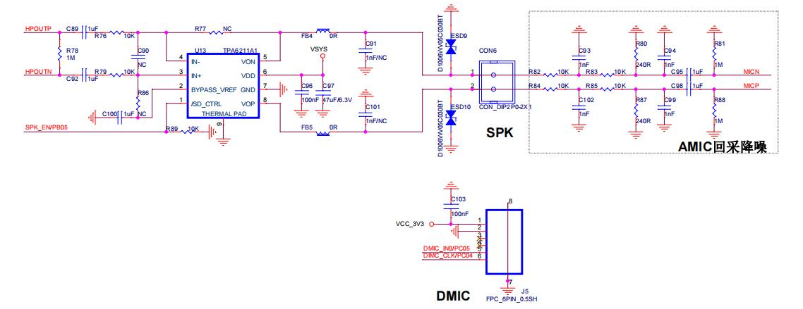
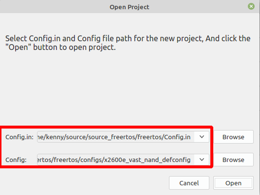
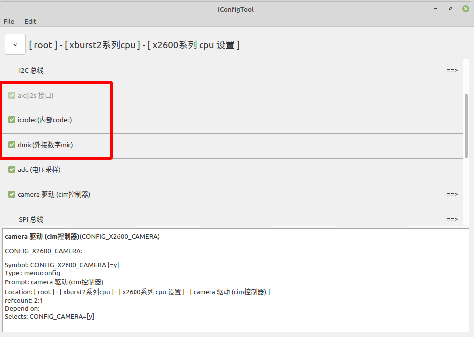
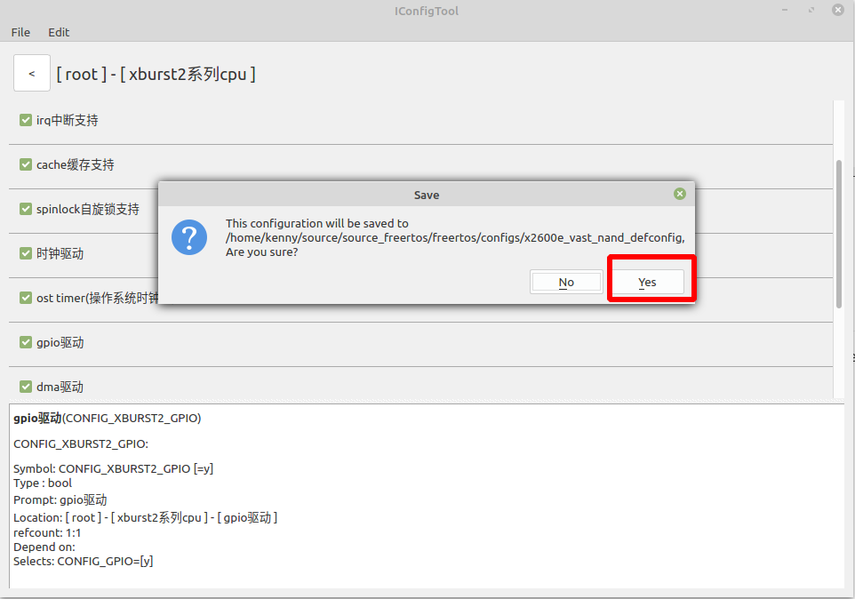
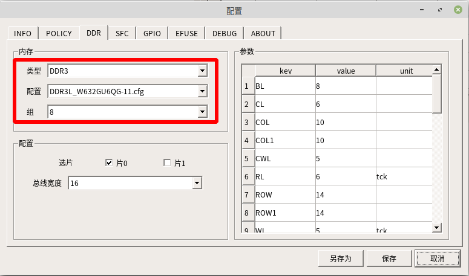
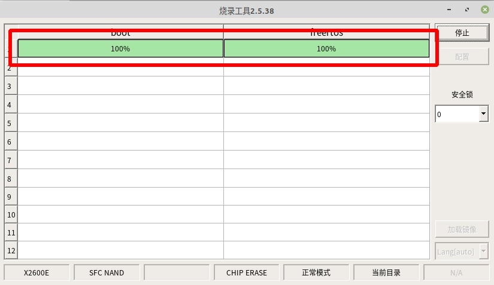

# 录音和播放

## 一  硬件环境

​    该文档使用的开发板为：PD_X2600E_VAST_V2.0开发板 芯片为 X2600E。内置 256MB DD3(L);外置 1Gbit SPI NAND = 1Gbit SPINAND Flash = 1024/8=128M。

## 二  功能简介

​        X2600E 处理器内部自带Audio Codec,支持输入/输出模拟音频差分信号,即AMICP+AMICN(模拟音频差分输入),和HPOUTP+HPOUTN(音频输出);支持2路数字麦克风通道;PD_X2600_VAST_V2.0开发平台默认为1路DIMC输入接口; AMIC可用于回采降噪功能;HPOUT用作模拟音频输出,外接功放;PB05为控制音频功放使能脚,高电平有效。如下图所示:



**硬件参数说明：**

AIC 控制器

- 支持 8/16/18/20/24bit 位宽

- 支持 8/12/16/24/32/44.1/48/96kHz 采样率

- 支持 I2S 和 MSB-Justified 格式

- 支持 Master 和 Slave 模式

  

PCM 控制器

- 支持 8/16bit 位宽

- 支持 8/12/16/24/32/44.1/48/96kHz 采样率

- 支持 Master 和 Slave 模式

  

内部 Codec

- 24bit DAC with 90db SNR

- 24bit ADC with 90db SNR

- 支持 16/20/24bit 位宽

- 支持 8/12/16/24/32/44.1/48/96kHz 采样率

- ADC 支持自动电平控制(ALC)

- 输入输出支持差分信号

- 支持 loopback

  

DMIC 控制器

- 支持 1/2/3/4 个数字 mic
- SNR:90dB, THD:-90dB @ FS-20dB
- 支持 16/24bit 位宽
- 支持 8/16/48/96kHz 采样率
- DMIC 时钟频率支持 2.4/3.072Mhz
- 支持同时使能 DMIC 和 AIC

## 三 原理介绍

### 3.1  录音有两种方式

​	第一： 采用 dmic 硬件采样音频模拟信号并转成数字信号,软件直接读 dmic 输出的数字信号并编码成指定的文件格式,从而录音产生相应格式的音频文件,比如 wav 格式。
​	第二：采用内部 codec (简称 icodec ) + amic (采样音频模拟信号的传感器),从而,接上 amic 之后,硬件上可以实现录音。

注意: PD_X2600E_VAST_V2.0 开发板上没有AMIC硬件，但是含有AMIC回采降噪功能的电路。

### 3.2  播放

​	播放统一采用内部 codec (简称 icodec )这个设备实现。所以, icodec 也是要软件配置的。使用HPOUT用作模拟音频输出,外接功放SPK。

## 四 软件实现方法





主配置选择 x2600e_vast_nand_defconfig 



勾选 aic(i2c 接口) ，icodec(内部codec)，dmic(外部数字mic)




Ctrl + s ，点击 Yes 保存配置


## 五 测试程序

### 5.1  aic 播放测试 example

aic播放测试程序：freertos$ ls example/driver/audio_pcm_example.c  内容如下：

由于 PD_X2600E_VAST_V2.0 开发板芯片X2600E是单声道。所以需要修改点如下：

```c
#include <driver/gpio.h>
#include <driver/pcm.h>

#include <include_bin.h>
#include <wav_utils.h>

INCBIN(audio, "example/resource/test_16k_s16_le.wav");  //使用单声道的音频文件，该文件存放在源码根目录下：


static struct pcm_params playback_params = {
    .channels = 1,    //设置为单通道
    .pcm_data_fmt = pcm_fmt_S16LE,
    .pcm_sample_rate = pcm_rate_16000,
    .pcm_interface = pcm_interface_i2s,
    .i2s_frame_mode = i2s_LR_mode,
    .i2s_bclk_direction = i2s_bclk_codec_master,
    .i2s_frame_direction = i2s_frame_codec_master,
};

static struct pcm_params capture_params = {
    .channels = 1,      //设置为单通道
    .pcm_data_fmt = pcm_fmt_S16LE,
    .pcm_sample_rate = pcm_rate_16000,
    .pcm_interface = pcm_interface_i2s,
    .i2s_frame_mode = i2s_LR_mode,
    .i2s_bclk_direction = i2s_bclk_codec_master,
    .i2s_frame_direction = i2s_frame_codec_master,
};

static volatile int playback_ok = 0;
static int gpio_pa_enable = GPIO_PB(5); // PD_X2600E_VAST_V2.0 开发板的功放引脚是PB05

void write_thread_func(void *data)
{
    struct pcm_device *dai = pcm_get("aic-playback");
    struct pcm_device *codec = pcm_get("icodec-playback");

    /* 注意！
     * 如果为外部codec，则必须在使能aic之前使能。
     * 不是外部则无此规定。
     */
    pcm_enable(codec, &playback_params);
    
    pcm_enable(dai, &playback_params);
    
    pcm_start(codec);
    
    pcm_start(dai);
    
    // 使能功放引脚
    if (gpio_pa_enable >= 0)
    gpio_direction_output(gpio_pa_enable, 1);
    
    /* 解析wav格式音频,得到数据起始和帧数 */
    void *audio = wav_pcm_data((void *) audioData);
    int frames = wav_pcm_frames((void *) audioData);
    
    pcm_write_frame(dai, (void *)audio, frames);
    
    pcm_disable(dai);
    
    pcm_disable(codec);
    
    // 关闭功放引脚
    if (gpio_pa_enable >= 0)
    gpio_direction_output(gpio_pa_enable, 0);
    
    playback_ok = 1;

}

static unsigned int buffer[10 * 16 * 1024];

void pcm_test(void)
{
    struct pcm_device *c_dai = pcm_get("aic-capture");
    struct pcm_device *c_codec = pcm_get("icodec-capture");

    if (gpio_pa_enable >= 0)
        gpio_request(gpio_pa_enable, "pa_enable");
    
    pcm_private_ctrl(c_dai, "sysclk-set-rate", 16000 * 768);
    pcm_private_ctrl(c_dai, "sysclk-set-output", 1);
    
    /*
     * 注意!
     *
     * 对于外接的模拟mic
     * 内部codec需要提前设置enable的时候是否要打开偏置电压
     *
     * 如果是回采电路，则不需要打开偏置电压
     */
    pcm_private_ctrl(c_codec, "bias-on", 1);
    printf("We are bias-on, please know that\n");
    
    /*
     * 开启播放线程
     * 内部codec实际上只能播放左声道的数据
     */
    thread_create("write_thread", 4096, write_thread_func, NULL);
    
    /*
     * 开始录音
     * 内部codec实际上只能录制一个通道的数据在左声道
     */
    pcm_enable(c_dai, &capture_params);
    pcm_enable(c_codec, &capture_params);
    
    pcm_start(c_codec);
    pcm_start(c_dai);
    
    pcm_read_frame(c_dai, buffer, sizeof(buffer)/pcm_frame_size(&capture_params));
    
    pcm_disable(c_codec);
    pcm_disable(c_dai);
    
    /*
     * 等待播放线程结束
     */
    while (!playback_ok)
        msleep(1);
    
    /*
     * 播放录音数据
     * 此时录制的音量可能比较小
     */
    struct pcm_device *dai = pcm_get("aic-playback");
    struct pcm_device *codec = pcm_get("icodec-playback");
    
    pcm_enable(dai, &playback_params);
    
    pcm_enable(codec, &playback_params);
    
    // 使能功放引脚
    if (gpio_pa_enable >= 0)
    gpio_direction_output(gpio_pa_enable, 1);
    
    pcm_start(codec);
    
    pcm_start(dai);
    
    pcm_write_frame(dai, (void *)buffer, sizeof(buffer) / pcm_frame_size(&playback_params));
    
    pcm_disable(dai);
    
    pcm_disable(codec);
    
    // 关闭功放引脚
    if (gpio_pa_enable >= 0)
    gpio_direction_output(gpio_pa_enable, 0);
    
    /*
     * 打印录音数据
     */
    dump_mem32(buffer, sizeof(buffer), 8);

}
```

修改 vendor/vendor.c ，测试AIC SPEAKER 播放 内容如下：

```c
#include <stdio.h>
#include <../example/driver/audio_pcm_example.c>

void vendor_init(void *arg)
{
    pcm_test();   //测试AIC播放预置的音频数据 “example/resource/test_16k_s16_le.wav”
    printf("vendor init...\n");
}
```

编译烧录以后，开机运行如下命令，结果如下：


```shell
U-Boot SPL 2013.07-00019-g3f9f8dbc1-dirty (Aug 10 2023 - 14:09:33)
ERROR EPC 80031cc0
---- size: 7
clk prepare done !!
CPA_CPAPCR:0320490d
CPM_CPMPCR:04b0490d
CPM_CPEPCR:0190510d
CPM_CPCCR:9a0b5510
DDR: W632GU6QG-11 type is : DDR3
DDRP_INNOPHY_PLL_FBDIV_50	0x00000000
DDRP_INNOPHY_PLL_FBDIV_H_51	0x00000086
DDRP_INNOPHY_PLL_CTRL_53	0x00000020
DDRP_INNOPHY_PLL_PDIV_52	0x00000041
DDRP_INNOPHY_PLL_LOCK_60	0x00000016
DDRP_INNOPHY_PU_DRV_CMD:  0000000e
DDRP_INNOPHY_PU_DRV_DQ7_0: 00000014
DDRP_INNOPHY_PU_DRV_DQ15_8: 00000014
DDRP_INNOPHY_PD_DRV_DQ7_0: 00000014
DDRP_INNOPHY_PD_DRV_DQ15_8: 00000014
DDRP_INNOPHY_PU_ODT_DQ7_0: 00000005
DDRP_INNOPHY_PU_ODT_DQ15_8: 00000005
DDRP_INNOPHY_PD_ODT_DQ7_0: 00000005
DDRP_INNOPHY_PD_ODT_DQ15_8: 00000005
DRP_INNOPHY_ZQ_CALIB_DONE : 00000000
DRP_INNOPHY_ZQ_CALIB_AL: 00000002
DRP_INNOPHY_ZQ_CALIB_AH: 00000002
DRP_INNOPHY_ZQ_CALIB_PD_DRV_6C: 00000000
DRP_INNOPHY_ZQ_CALIB_PU_DRV_6D: 00000000
DRP_INNOPHY_ZQ_CALIB_PD_ODT_6E: 00000000
DRP_INNOPHY_ZQ_CALIB_PU_ODT_6F: 00000000
DRP_INNOPHY_ZQ_CALIB_CMD: 00000002
DDRP_INNOPHY_PU_DRV_CMD:  0000000c
DDRP_INNOPHY_PU_DRV_DQ7_0: 0000000c
DDRP_INNOPHY_PU_DRV_DQ15_8: 0000000c
DDRP_INNOPHY_PD_DRV_DQ7_0: 0000000c
DDRP_INNOPHY_PD_DRV_DQ15_8: 0000000c
DDRP_INNOPHY_PU_ODT_DQ7_0: 00000002
DDRP_INNOPHY_PU_ODT_DQ15_8: 00000002
DDRP_INNOPHY_PD_ODT_DQ7_0: 00000002
DDRP_INNOPHY_PD_ODT_DQ15_8: 00000002
DDRP_INNOPHY_CALIB_MODE:	00000020
-----ddr_readl(DDRP_INNOPHY_CALIB_DONE): 00000000
DDRP_INNOPHY_CALIB_DONE_61: 00000003
DDRP_INNOPHY_CALIB_ERR_69:	00000010
DDRP_INNOPHY_CALIB_L_C_9b: 00000001
DDRP_INNOPHY_CALIB_L_DO_9c: 000000ca
DDRP_INNOPHY_CALIB_R_C_9d: 00000001
DDRP_INNOPHY_CALIB_R_DO_9e: 000000ca
DDRP_INNOPHY_CALIB_MODE:	00000020
358, VID=0x0000009b, PID=0x00000012
[0.000000] xburst2 rtos @ Dec  4 2023 17:51:50, epc: 80031cc0
[0.000093] gpio: VDDIO_CIM(PA00~PA11) = 1.8V
[0.000248] gpio: VDDIO_SD(PD00~PD05) = 3.3V
[0.002731] Supported Nand Flash, ATO25D1GA(9b:12)
[0.040129] stmmac - user ID: 0x20, Synopsys ID: 0x37
[0.040310]  Ring mode enabled
[0.040415]  DMA HW capability register supported Enhanced/Alternate descriptors
[0.040683] 	Enabled extended descriptors
[0.040824]  RX Checksum Offload Engine supported (type 2)
[0.041020]  TX Checksum insertion supported
[0.041172]  Enable RX Mitigation via HW Watchdog Timer
[0.143091] Found mac phy id 0x02430c54
[0.154018] pcm_private_ctrl sysclk-set-output fail! return value 0xffffffea
[0.154295] We are bias-on, please know that
[0.154450] AIC: no support clk freq 12288000 and forced to use clk freq 4096000
[0.197099] n: 36
[0.197160] n: 12
```


**由于 PD_X2600E_VAST_V2.0 开发板上没有AMIC硬件，所以下面以 dmic 作为录音进行说明**

### 5.2  dmic 录音和播放测试 example

dmic 录音和播放测试程序： freertos$ ls example/driver/dmic_aic_pcm_example.c  内容如下：

```c++
#include <stdio.h>
#include <driver/pcm.h>
#include <common.h>
#include <driver/gpio.h>
#include <wav_utils.h>

#include <include_bin.h>
INCBIN(audio, "example/resource/end_playing.aiff");

// 以 x2600_vast_v10 板子为例
// icodec 播放 end_playing.aiff 音频, 同时 dmic 录音, 录音结束且播放结束后播放录到的数据, 播放结束退出

static struct pcm_params playback_params = {
    .channels = 1,
    .pcm_data_fmt = pcm_fmt_S16LE,
    .pcm_sample_rate = pcm_rate_48000,
    .pcm_interface = pcm_interface_i2s,
    .i2s_frame_mode = i2s_LR_mode,
    .i2s_bclk_direction = i2s_bclk_codec_master,
    .i2s_frame_direction = i2s_frame_codec_master,
};

static struct pcm_params capture_params = {
    .channels = 1,
    .pcm_data_fmt = pcm_fmt_S16LE,
    .pcm_sample_rate = pcm_rate_48000,
    .pcm_interface = pcm_interface_dmic,
};

static volatile int playback_ok = 0;
static int gpio_spk_enable = GPIO_PB(5);

void write_thread_func(void *data)
{
    struct pcm_device *dai = pcm_get("aic-playback");
    struct pcm_device *codec = pcm_get("icodec-playback");

    pcm_enable(codec, &playback_params);

    pcm_enable(dai, &playback_params);

    pcm_start(codec);

    pcm_start(dai);

    if (gpio_spk_enable >= 0)
        gpio_direction_output(gpio_spk_enable, 1);

    void *audio = wav_pcm_data((void *) audioData);
    int frames = wav_pcm_frames((void *) audioData);

    pcm_write_frame(dai, (void *)audio, frames);

    pcm_disable(dai);

    pcm_disable(codec);

    if (gpio_spk_enable >= 0)
        gpio_direction_output(gpio_spk_enable, 0);

    playback_ok = 1;
    printf("We are playback_ok\n");
}

static unsigned int buffer[5 * 16 * 1024];

void dmic_aic_pcm_test(void)
{
    struct pcm_device *dai = pcm_get("dmic-capture");

    if (gpio_spk_enable >= 0)
        gpio_request(gpio_spk_enable, "spk_enable");

    thread_create("write_thread", 4096, write_thread_func, NULL);

    pcm_enable(dai, &capture_params);
    pcm_start(dai);

    pcm_read_frame(dai, buffer, sizeof(buffer)/pcm_frame_size(&capture_params));

    pcm_stop(dai);
    pcm_disable(dai);

    while (!playback_ok)
        msleep(1);

    printf("We are capture_ok\n");

    struct pcm_device *pdai = pcm_get("aic-playback");
    struct pcm_device *codec = pcm_get("icodec-playback");

    pcm_enable(pdai, &playback_params);

    pcm_enable(codec, &playback_params);

    if (gpio_spk_enable >= 0)
        gpio_direction_output(gpio_spk_enable, 1);

    pcm_start(codec);

    pcm_start(pdai);

    pcm_write_frame(pdai, (void *)buffer, sizeof(buffer) / pcm_frame_size(&playback_params));

    pcm_disable(pdai);

    pcm_disable(codec);

    if (gpio_spk_enable >= 0)
        gpio_direction_output(gpio_spk_enable, 0);

    printf("We are playback_ok again\n");
}
```

### 5.2  编译和使用测试程序

修改 vendor/vendor.c ，测试dmic录音和使用CODEC SPEAKER 播放 内容如下：

```c
#include <stdio.h>
#include <../example/driver/dmic_aic_pcm_example.c>

void vendor_init(void *arg)
{
    dmic_aic_pcm_test();  //测试dmic的录音,并且播放预置的音频数据 “example/resource/end_playing.aiff”
    printf("vendor init...\n");
}
```

编译烧录以后，开机运行如下命令，结果如下：

```shell
U-Boot SPL 2013.07-00019-g3f9f8dbc1-dirty (Aug 10 2023 - 14:09:33)
ERROR EPC 80031c94
---- size: 7
clk prepare done !!
CPA_CPAPCR:0320490d
CPM_CPMPCR:04b0490d
CPM_CPEPCR:0190510d
CPM_CPCCR:9a0b5510
DDR: W632GU6QG-11 type is : DDR3
DDRP_INNOPHY_PLL_FBDIV_50	0x00000000
DDRP_INNOPHY_PLL_FBDIV_H_51	0x00000086
DDRP_INNOPHY_PLL_CTRL_53	0x00000020
DDRP_INNOPHY_PLL_PDIV_52	0x00000041
DDRP_INNOPHY_PLL_LOCK_60	0x00000016
DDRP_INNOPHY_PU_DRV_CMD:  0000000e
DDRP_INNOPHY_PU_DRV_DQ7_0: 00000014
DDRP_INNOPHY_PU_DRV_DQ15_8: 00000014
DDRP_INNOPHY_PD_DRV_DQ7_0: 00000014
DDRP_INNOPHY_PD_DRV_DQ15_8: 00000014
DDRP_INNOPHY_PU_ODT_DQ7_0: 00000005
DDRP_INNOPHY_PU_ODT_DQ15_8: 00000005
DDRP_INNOPHY_PD_ODT_DQ7_0: 00000005
DDRP_INNOPHY_PD_ODT_DQ15_8: 00000005
DRP_INNOPHY_ZQ_CALIB_DONE : 00000000
DRP_INNOPHY_ZQ_CALIB_AL: 00000002
DRP_INNOPHY_ZQ_CALIB_AH: 00000002
DRP_INNOPHY_ZQ_CALIB_PD_DRV_6C: 00000000
DRP_INNOPHY_ZQ_CALIB_PU_DRV_6D: 00000000
DRP_INNOPHY_ZQ_CALIB_PD_ODT_6E: 00000000
DRP_INNOPHY_ZQ_CALIB_PU_ODT_6F: 00000000
DRP_INNOPHY_ZQ_CALIB_CMD: 00000002
DDRP_INNOPHY_PU_DRV_CMD:  0000000c
DDRP_INNOPHY_PU_DRV_DQ7_0: 0000000c
DDRP_INNOPHY_PU_DRV_DQ15_8: 0000000c
DDRP_INNOPHY_PD_DRV_DQ7_0: 0000000c
DDRP_INNOPHY_PD_DRV_DQ15_8: 0000000c
DDRP_INNOPHY_PU_ODT_DQ7_0: 00000002
DDRP_INNOPHY_PU_ODT_DQ15_8: 00000002
DDRP_INNOPHY_PD_ODT_DQ7_0: 00000002
DDRP_INNOPHY_PD_ODT_DQ15_8: 00000002
DDRP_INNOPHY_CALIB_MODE:	00000020
-----ddr_readl(DDRP_INNOPHY_CALIB_DONE): 00000000
DDRP_INNOPHY_CALIB_DONE_61: 00000003
DDRP_INNOPHY_CALIB_ERR_69:	00000010
DDRP_INNOPHY_CALIB_L_C_9b: 00000001
DDRP_INNOPHY_CALIB_L_DO_9c: 000000ca
DDRP_INNOPHY_CALIB_R_C_9d: 00000001
DDRP_INNOPHY_CALIB_R_DO_9e: 000000ca
DDRP_INNOPHY_CALIB_MODE:	00000020
358, VID=0x0000009b, PID=0x00000012
[0.000000] xburst2 rtos @ Dec  5 2023 09:14:18, epc: 80031c94
[0.000095] gpio: VDDIO_CIM(PA00~PA11) = 1.8V
[0.000251] gpio: VDDIO_SD(PD00~PD05) = 3.3V
[0.002739] Supported Nand Flash, ATO25D1GA(9b:12)
[0.040129] stmmac - user ID: 0x20, Synopsys ID: 0x37
[0.040311]  Ring mode enabled
[0.040415]  DMA HW capability register supported Enhanced/Alternate descriptors
[0.040684] 	Enabled extended descriptors
[0.040825]  RX Checksum Offload Engine supported (type 2)
[0.041021]  TX Checksum insertion supported
[0.041172]  Enable RX Mitigation via HW Watchdog Timer
[0.143093] Found mac phy id 0x02430c54
[0.185104] n: 36
[0.185164] n: 12
[1.595105] We are playback_ok
[3.577024] We are capture_ok
[6.958111] We are playback_ok again
[6.958235] vendor init...
```


## 六  编译和烧录

### 6.1  工程编译

编译命令如下：

```shell
cd freertos/

$ source build/envsetup.sh

$ make x2600e_vast_nand_defconfig

$ make
```


### 6.2 工程烧录

烧录工具配置如下：


平台选择： x2600

板级选择：x2600e_sfc_nand_ddr3l_linux.cfg


烧录的文件选择：freertos/rtos-with-spl.bin 

label的名称要与 SFC 中分区信息的Partition name 一致。



保持默认就可以。


第一次烧录需要勾选全部擦除。


Partition name 为 freertos ，这里的名称可以修改

Manage mode选择 MTD_MODE


保存烧录工具配置以后，点击开始进行烧录。先按住开发板BOOT_KEY键不放，然后按下RST_KEY按键以后，进入烧录模式，烧录成功的界面如下：




## 七  接口详解

### 7.1 API介绍 

头文件 pcm.h, 路径为：freertos$ ls  include/driver/pcm.h 

freertos/include/driver/pcm.h  文件内容如下：

```c++
#ifndef _PCM_H_
#define _PCM_H_

#include <os.h>

typedef enum {
    pcm_interface_i2s,
    pcm_interface_i2s_MSB, // i2s 右对齐
    pcm_interface_i2s_left_justified, // i2s 左对齐

    pcm_interface_dmic,

    pcm_interface_nums,
} pcm_interface;

typedef enum {
    pcm_fmt_S8,
    pcm_fmt_U8,
    pcm_fmt_S16LE,
    pcm_fmt_S16BE,
    pcm_fmt_U16LE,
    pcm_fmt_U16BE,
    pcm_fmt_S24LE,
    pcm_fmt_S24BE,
    pcm_fmt_U24LE,
    pcm_fmt_U24BE,
    pcm_fmt_S32LE,
    pcm_fmt_S32BE,
    pcm_fmt_U32LE,
    pcm_fmt_U32BE,

    pcm_fmt_nums,
} pcm_data_fmt;

typedef enum {
    pcm_rate_5512,
    pcm_rate_8000,
    pcm_rate_11025,
    pcm_rate_12000,
    pcm_rate_16000,
    pcm_rate_22050,
    pcm_rate_24000,
    pcm_rate_32000,
    pcm_rate_44100,
    pcm_rate_48000,
    pcm_rate_64000,
    pcm_rate_88200,
    pcm_rate_96000,
    pcm_rate_176400,
    pcm_rate_192000,

    pmc_rate_nums,
} pcm_sample_rate;

typedef enum {
    i2s_LR_mode,
    i2s_RL_mode,
} i2s_frame_mode;

typedef enum {
    i2s_bclk_codec_slave, // codec为从, 控制器向codec设备发出bclk
    i2s_bclk_codec_master, // codec为主, codec设备向控制器发出bclk
} i2s_bclk_direction;

typedef enum {
    i2s_frame_codec_slave, // codec为从, 控制器向codec设备发出sync
    i2s_frame_codec_master, // codec为主, codec设备向控制器发出sync
} i2s_frame_direction;

typedef enum {
    pcm_stream_playback,
    pcm_stream_capture,
} pcm_stream_type;

struct pcm_params {
    pcm_interface pcm_interface; // 数据传输模式
    i2s_frame_mode i2s_frame_mode; // 左右声道传输先后顺序
    i2s_bclk_direction i2s_bclk_direction; // bclk主从模式
    i2s_frame_direction i2s_frame_direction; // sync主从模式(一般与i2s_bclk_direction一致)

    pcm_data_fmt pcm_data_fmt; // 数据格式
    pcm_sample_rate pcm_sample_rate; // 采样率

    unsigned int channels; // 通道数
    unsigned int buffer_time_ms; // 处理一次音频数据缓冲区的时间, 以ms为单位
    unsigned int period_time_ms; // 处理音频数据的周期, 以ms为单位
};

struct pcm_dev_data {
    const char *name;
    pcm_stream_type stream_type; // 数据流类型
    unsigned long pcm_interface_list;
    unsigned long channels_list;
    unsigned long pcm_data_fmt_list;
    unsigned long pcm_sample_rate_list;
    unsigned char i2s_frame_mode_list;
    unsigned char i2s_bclk_direction_list;
    unsigned char i2s_frame_direction_list;
    int (*pcm_write_frame)(struct pcm_dev_data *dev,
                           void *buf, int frame_count, unsigned int timeout_ms);
    int (*pcm_read_frame)(struct pcm_dev_data *dev,
                          void *buf, int frame_count, unsigned int timeout_ms);
    int (*pcm_enable)(struct pcm_dev_data *dev, struct pcm_params *params);
    void (*pcm_disable)(struct pcm_dev_data *dev);
    int (*pcm_start)(struct pcm_dev_data *dev);
    void (*pcm_stop)(struct pcm_dev_data *dev);
    int (*pcm_set_mute)(struct pcm_dev_data *dev, int mute);
    int (*pcm_set_volume)(struct pcm_dev_data *dev, int val);
    int (*pcm_get_volume)(struct pcm_dev_data *dev);
    int (*pcm_private_ctrl)(struct pcm_dev_data *dev, const char *ctrl_id, unsigned long value);

    void *drv_data;
};

struct pcm_device;

/**
 * 音频数据由多帧数据组成, 一帧数据大小为 通道数 * 通道数据大小, 一个通道数据大小根据数据格式不同而不同
 * 例 音频数据格式为 S16_LE, 通道数为 1, 采样率为 16k
 * 1秒 音频数据大小 = 秒数 * 数据格式对应字节 * 通道数 * 采样率 = 1 * 2 * 1 * 16000
 */

/**
 * @brief 设备注册, 在初始化 aic/codec 根据实际注册,或者用于注册混音设备
 * @param data 设备数据结构体, 包含设备名字,数据流类型,可支持的类型列表,pcm回调函数指针
 * @return 返回设备结构体
 */
struct pcm_device *pcm_register(struct pcm_dev_data *data);

/**
 * @brief 注册混音设备且复制 实际设备dev->data(设备数据结构体:数据流类型,可支持的类型列表,pcm回调函数指针) 到 data
 *      例 创建混音播放设备时, 注册混音设备,复制实际设备的部分数据及回调函数指针 到 混音设备
 * @param dev 设备结构体
 * @param data 设备数据结构体, 包含设备名字,数据流类型,可支持的类型列表,pcm回调函数指针
 * @param name 设备名称
 * @return 返回设备结构体
 */
struct pcm_device *pcm_clone_device(struct pcm_device *dev, struct pcm_dev_data *data, const char *name);

/**
 * @brief 设备注销
 * @param data 设备数据结构体, 包含设备名字,数据流类型,可支持的类型列表,pcm回调函数指针
 */
void pcm_unregister(struct pcm_dev_data *data);

/**
 * @brief 根据名字获取设备结构体
 * @param name 设备名称
 * @return 成功返回设备结构体, 失败返回NULL
 */
struct pcm_device *pcm_get(const char *name);

/**
 * @brief 将音频数据写入设备
 * @param dev 设备结构体
 * @param buf 写入的音频数据存放地址
 * @param frame_count 音频帧数
 * @return 成功返回帧数, 失败返回负数
 */
int pcm_write_frame(struct pcm_device *dev, void *buf, int frame_count);

/**
 * @brief 从设备读取音频数据
 * @param dev 设备结构体
 * @param buf 读取到的音频数据存放地址
 * @param frame_count 音频帧数
 * @return 成功返回帧数, 失败返回负数
 */
int pcm_read_frame(struct pcm_device *dev, void *buf, int frame_count);

/**
 * @brief 将音频数据写入设备, 超时退出
 * @param dev 设备结构体
 * @param buf 写入的音频数据存放地址
 * @param frame_count 音频帧数
 * @param timeout_ms 超时时间, 单位为ms
 * @return 成功返回帧数, 失败返回负数
 */
int pcm_write_frame_timeout(struct pcm_device *dev,
    void *buf, int frame_count, unsigned int timeout_ms);

/**
 * @brief 从设备读取音频数据, 超时退出
 * @param dev 设备结构体
 * @param buf 读取到的音频数据存放地址
 * @param frame_count 音频帧数
 * @param timeout_ms 超时时间, 单位为ms
 * @return 成功返回帧数, 失败返回负数
 */
int pcm_read_frame_timeout(struct pcm_device *dev,
    void *buf, int frame_count, unsigned int timeout_ms);

/**
 * @brief 检查参数配置结构体是否符合设备要求
 * @param dev 设备结构体
 * @param p 参数配置结构体
 * @return 成功返回1, 失败返回0
 */
int pcm_check_params(struct pcm_device *dev, struct pcm_params *p);

/**
 * @brief 使能设备, 初始化设备等
 * @param dev 设备结构体
 * @param param 参数配置结构体
 * @return 成功返回0, 失败返回负数
 */
int pcm_enable(struct pcm_device *dev, struct pcm_params *param);

/**
 * @brief 失能设备
 * @param dev 设备结构体
 */
void pcm_disable(struct pcm_device *dev);

/**
 * @brief 启动设备
 * @param dev 设备结构体
 * @return 成功返回0, 失败返回负数
 */
int pcm_start(struct pcm_device *dev);

/**
 * @brief 停止设备
 * @param dev 设备结构体
 */
void pcm_stop(struct pcm_device *dev);

/**
 * @brief 设置是否静音
 * @param dev 设备结构体
 * @param mute 是否设置静音, 1 为静音
 * @return 成功返回0, 失败返回负数
 */
int pcm_set_mute(struct pcm_device *dev, int mute);

/**
 * @brief 获取是否静音
 * @param dev 设备结构体
 * @return 返回1为静音, 0为工作
 */
int pcm_get_mute(struct pcm_device *dev);

/**
 * @brief 设置音量
 * @param dev 设备结构体
 * @param val 音量, 范围为0-100
 * @return 成功返回0, 失败返回负数
 */
int pcm_set_volume(struct pcm_device *dev, int val);

/**
 * @brief 获取音量
 * @param dev 设备结构体
 * @return 返回音量, 范围1-100
 */
int pcm_get_volume(struct pcm_device *dev);

/**
 * @brief 执行对应配置id的代码并设置值
 * @param dev 设备结构体
 * @param ctrl_id 配置id, "sysclk-set-rate"为设置时钟频率, "sysclk-set-output"为设置时钟传输方向
 * @param value 对应配置id需要设定的值
 * @return 存在配置id并配置成功返回0, 失败返回负数
 */
int pcm_private_ctrl(struct pcm_device *dev, const char *ctrl_id, unsigned long value);

/**
 * @brief 获取数据格式对应大小, 以字节为单位
 * @param fmt 数据格式
 * @return 返回数据格式对应的大小
 */
unsigned int pcm_data_sample_size(pcm_data_fmt fmt);

/**
 * @brief 获取采样率大小, 以hz为单位
 * @param rate 采样率类型
 * @return 返回采样率类型对应的采样率大小
 */
unsigned int pcm_data_sample_rate(pcm_sample_rate rate);

/**
 * @brief 获取一帧大小, 数据格式对应大小 * 通道数, 以字节为单位
 * @param param 参数配置结构体
 * @return 返回帧大小
 */
int pcm_frame_size(struct pcm_params *param);

/**
 * @brief 获取参数配置结构体
 * @param dev 设备结构体
 * @return 返回设备对应的参数配置结构体
 */
struct pcm_params *pcm_get_device_params(struct pcm_device *dev);

#endif /* _PCM_H_ */
```


### 7.2  相关接口介绍 

```c
struct pcm_device *pcm_get(const char *name)
功能：    获取已经注册的设备
参数：
         name                     //设备相应功能字符串名
返回值：相应功能设备
"注意：有关参数选项请查阅中间参数详解。"
```

```c
int pcm_private_ctrl(struct pcm_device *dev, const char *ctrl_id, unsigned long value)
功能：配置相应设备
参数：
        dev                       //通过pcm_get()获取的设备
        ctrl_id                   //需要配置的功能的字符串名
        value                     //设置的值
返回值：
        0                         //成功
        -ENODEV                   //该函数功能不存在
        -EINVAL                   //配置失败
"注意：有关参数选项请查阅中间参数详解。"
```

```c
int pcm_write_frame(struct pcm_device *dev, void *buf, int frame_count)
功能：aic将音频数据写入icodec
参数：
        dev                       //通过 pcm_get("aic-playback") 获取的设备
        buf                       //需要写入的音频数据
        frame_count               //数据帧的个数,sizeof(buffer) / pcm_frame_size(&playback_params)
返回值：
        0                         //成功
        -ENODEV                   //该函数功能不存在
        -EINVAL                   //传输失败
```

```c
int pcm_write_frame_timeout(struct pcm_device *dev, void *buf, int frame_count, unsigned int timeout_ms)
功能：带超时的aic将音频数据写入icodec
参数：
        dev                       //通过 pcm_get("aic-playback") 获取的设备
        buf                       //需要写入的音频数据
        frame_count               //数据帧的个数
        timeout_ms                //超时时间
返回值：
        0                         //成功
        -ENODEV                   //该函数功能不存在
        -EINVAL                   //传输失败
```

```c
int pcm_read_frame(struct pcm_device *dev, void *buf, int frame_count)
功能：aic从icodec读取音频数据
参数：
        dev                       //通过 pcm_get("aic-capture") 获取的设备
        buf                       //存放读取数据的 buffer
        frame_count               //数据帧的个数, sizeof(buffer) / pcm_frame_size(&capture_params)
返回值：
        0                         //成功
        -ENODEV                   //该函数功能不存在
        -EINVAL                   //传输失败
```

```c
int pcm_read_frame_timeout(struct pcm_device *dev, void *buf, int frame_count, unsigned int timeout_ms)
功能：带超时的aic从icodec读取音频数据
参数：
        dev                       //通过 pcm_get("aic-capture") 获取的设备
        buf                       //存放读取数据的 buffer
        frame_count               //数据帧的个数
        timeout_ms                //超时时间
返回值：
        0                         //成功
        -ENODEV                   //该函数功能不存在
        -EINVAL                   //传输失败
```

```c
int pcm_check_params(struct pcm_device *dev, struct pcm_params *p)
功能：检查当前设备参数配置是否正确
参数：
        dev                       //通过 pcm_get() 获取的设备
        p                         //当前设备的配置参数
返回值：
        1                         //配置正确
        0                         //配置错误
```

```c
int pcm_enable(struct pcm_device *dev, struct pcm_params *param)
功能：使能相应设备
参数：
        dev                       //通过 pcm_get() 获取的设备
        param                     //当前设备配置参数
返回值：
        -EINVAL                   //失败
        0                         //成功
```

```c
void pcm_disable(struct pcm_device *dev)
功能：失能相应设备
参数：
        dev                       //通过 pcm_get() 获取的设备
```

```c
int pcm_start(struct pcm_device *dev)
功能：启动相应设备功能
参数：
        dev                       //通过 pcm_get() 获取的设备
返回值：
        -EINVAL                   //失败
        0                         //成功
```

```c
void pcm_stop(struct pcm_device *dev)
功能：停止相应设备功能
参数：
        dev                       //通过 pcm_get() 获取的设备
```

```c
int pcm_set_mute(struct pcm_device *dev, int mute)
功能：设置静音模式
参数：
        dev                       //通过 pcm_get("icodec-playback" ) 获取的设备
        mute                      //1表示设置为静音，0取消静音模式
返回值：
        0                         //成功
        -ENODEV                   //该函数功能不存在
        -EINVAL                   //设置失败
```

```c
int pcm_get_mute(struct pcm_device *dev)
功能：判断当前设备是否处于静音模式
参数：
        dev                       //通过 pcm_get("icodec-playback" ) 获取的设备
返回值：
        1                         //设备处于静音模式
        0                         //设备未静音
```

```c
int pcm_set_volume(struct pcm_device *dev, int val)
功能：设置当前设备音量
参数：
        dev                       //通过 pcm_get() 获取的 icodec 设备
        val                       //需要设置的音量值，范围 0～100
返回值：
        0                         //成功
        -ENODEV                   //该函数功能不存在
        -EINVAL                   //设置失败
"注意：音量设置为0时，设备会进入静音模式"
```

```c
int pcm_get_volume(struct pcm_device *dev)
功能：获取当前设备音量
参数：
        dev                       //通过 pcm_get() 获取的 icodec 设备
返回值：
         0~100                    //当前设备音量
        -ENODEV                   //该函数功能不存在
        -EINVAL                   //设置失败
```

```c
unsigned int pcm_data_sample_size(pcm_data_fmt fmt)
功能：检查样本长度是否正确
参数：
        fmt                       //设备采样位数
返回值：
        当前样本长度（采样位数）值，单位字节
```

```c
unsigned int pcm_data_sample_rate(pcm_sample_rate rate)
功能：检查采样率值是否正确
参数：
        rate                      //设备采样率
返回值：
        当前采样率值
```

```c
int pcm_frame_size(struct pcm_params *param)
功能：获取当前帧大小，帧大小 = 样本长度 * 通道数
参数：
        param                     //当前设备的参数配置
返回值：
        当前帧大小
```

```
线程安全，可以中断上下文使用：
        pcm_get
        pcm_check_params
        pcm_get_mute
        pcm_data_sample_size
        pcm_data_sample_rate
        pcm_frame_size
线程安全，不能在中断上下文使用：
        pcm_private_ctrl
        pcm_write_frame
        pcm_write_frame_timeout
        pcm_read_frame
        pcm_read_frame_timeout
        pcm_enable
        pcm_disable
        pcm_start
        pcm_stop
        pcm_set_mute
        pcm_set_volume
        pcm_get_volume
```


### 7.3  使用内部codec播放音频流程

> 1.获取播放功能 aic 设备              pcm_get("aic-playback")
>
> 2.获取播放功能 icodec 设备       pcm_get("icodec-playback")
>
> 3.设置 aic 的工作时钟频率          pcm_private_ctrl(pcm_get("aic-playback"), "sysclk-set-rate", 24 * 1000 * 1000)
>
> 4.设置 aic 输出工作时钟              pcm_private_ctrl(pcm_get("aic-playback"), "sysclk-set-output", 1)
>
> 5.选择使用icodec                         pcm_private_ctrl(pcm_get("aic-playback"), "use-internal-codec", 1)
>
> 6.使能aic                                       pcm_enable(pcm_get("aic-playback"), &playback_params)
>
> 7.使能 icodec                               pcm_enable(pcm_get("icodec-playback"), &playback_params)
>
> 8.启动 icodec                               pcm_start(pcm_get("icodec-playback"))
>
> 9.启动 aic                                     pcm_start(pcm_get("aic-playback"))
>
> 10.开始 aic 将数据写入icodec   pcm_write_frame(pcm_get("aic-playback"), (void *)buffer, sizeof(buffer) / pcm_frame_size(&playback_params))
>
> 11.关闭 aic                                   pcm_disable(pcm_get("aic-playback"))
>
> 12.关闭 icodec                            pcm_disable(pcm_get("icodec-playback"))


### 7.4  使用dmic录制音频流程

> 1.获取录音功能 dmic 设备              pcm_get("dmic-capture")
>
> 2.使能dmic                                       pcm_enable(pcm_get("dmic-capture"), &capture_params)
>
> 3.启动 dmic                               pcm_start(pcm_get("dmic-capture"))
>
> 4.开始 dmic 将数据写入buf数组   pcm_read_frame(struct pcm_device *dev, void *buf, int frame_count)
>
> 5.关闭 dmic                            pcm_disable(pcm_get("dmic-capture"))
